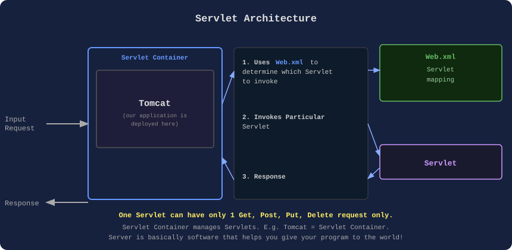
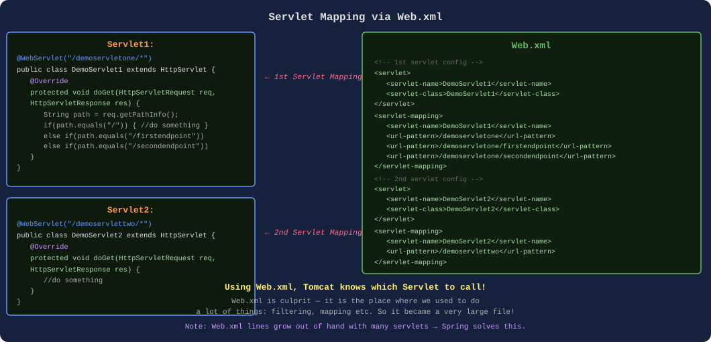
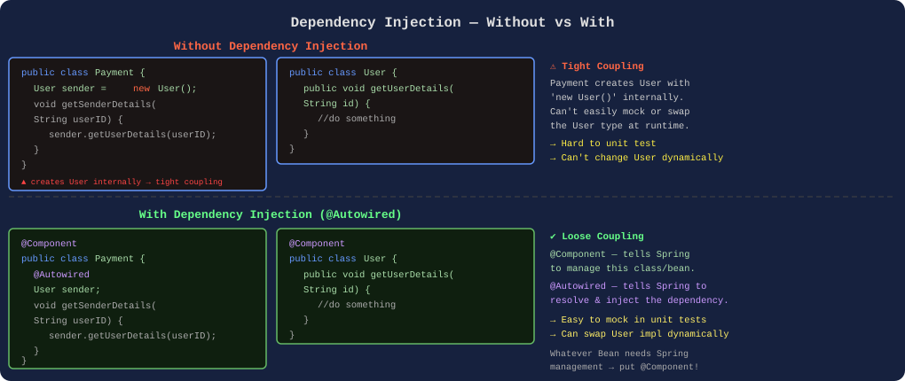
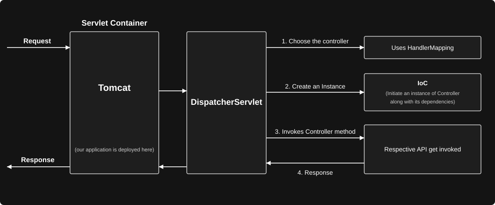
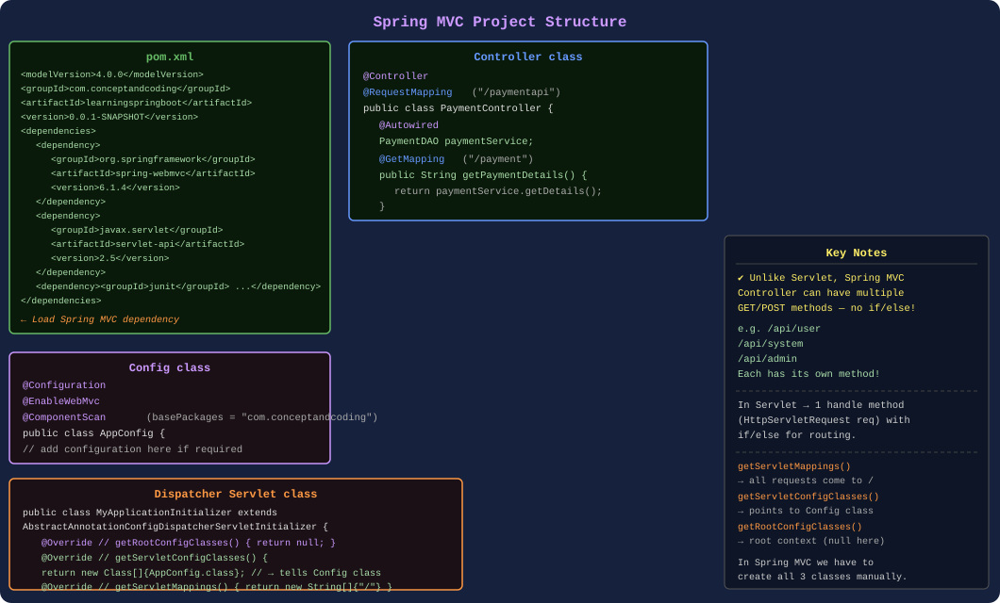
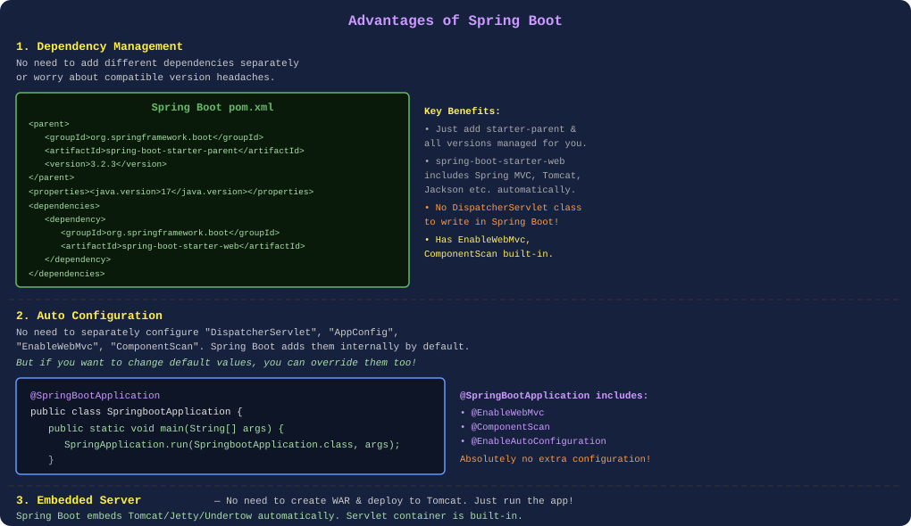
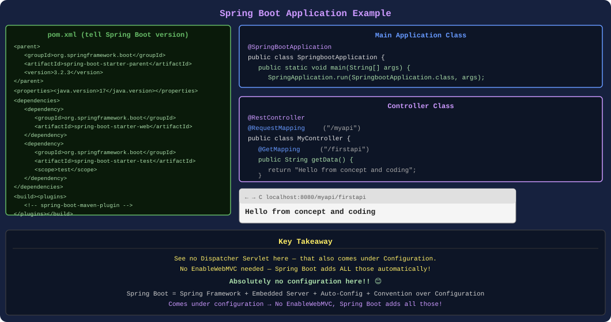

# 001 — Introduction to Spring Boot

---

## 1. Servlet & Servlet Container

Before we talk about Spring or Spring Boot, first we need to understand about **"SERVLET"** and **"Servlet Container"**.

- Provide foundation for building web applications.
- Servlet is a Java Class, which handles client request, processes it and returns the response.
- And Servlet Container are the ones which manages the Servlets.



> **One Servlet can have only 1 Get, Post, Put, Delete Request only.**

**Servlet Container** is the one that manages the Servlets! E.g. Tomcat — So Server is known as Servlet Container. So Server contains the Servlets.

**Server** is basically a software that helps you give your program to the world!

---

## 2. Servlet Mapping via Web.xml



**Servlet1:**

```java
@WebServlet("/demoservletone/*")
public class DemoServlet1 extends HttpServlet {

    @Override
    protected void doGet(HttpServletRequest request,
                         HttpServletResponse response) {

        String requestPathInfo = request.getPathInfo();

        if(requestPathInfo.equals("/")) {
            //do something
        }
        else if(requestPathInfo.equals("/firstendpoint")) {
            //do something
        }
        else if(requestPathInfo.equals("/secondendpoint")) {
            //do something
        }
    }

    @Override
    protected void doPut(HttpServletRequest request,
                         HttpServletResponse response) {
        //do something
    }
}
```

**Servlet2:**

```java
@WebServlet("/demoservlettwo/*")
public class DemoServlet2 extends HttpServlet {

    @Override
    protected void doGet(HttpServletRequest request,
                         HttpServletResponse response) {
        //do something
    }

    @Override
    protected void doPut(HttpServletRequest request,
                         HttpServletResponse response) {
        //do something
    }
}
```

**Web.xml:**

```xml
<!-- my first servlet configuration below-->
<servlet>
    <servlet-name>DemoServlet1</servlet-name>
    <servlet-class>DemoServlet1</servlet-class>
</servlet>

<servlet-mapping>
    <servlet-name>DemoServlet1</servlet-name>
    <url-pattern>/demoservletone</url-pattern>
    <url-pattern>/demoservletone/firstendpoint</url-pattern>
    <url-pattern>/demoservletone/secondendpoint</url-pattern>
</servlet-mapping>

<!-- my second servlet configuration below-->
<servlet>
    <servlet-name>DemoServlet2</servlet-name>
    <servlet-class>DemoServlet2</servlet-class>
</servlet>

<servlet-mapping>
    <servlet-name>DemoServlet2</servlet-name>
    <url-pattern>/demoservlettwo</url-pattern>
</servlet-mapping>
```

> **Web.xml is culprit.** It is the place where we used to do a lot of things: filtering, mapping etc. So it was a very large file!
>
> **Using Web.xml, Tomcat knows which Servlet to call!**

---

## 3. Spring Framework — Solving Servlet Challenges

**Spring Framework** solves challenges which exist with Servlets.

### Problems with Servlets:

#### a) Removal of web.xml
- This `web.xml` over time becomes too big and becomes very difficult to manage and understand.
- Spring framework introduced **Annotations based configuration**.

#### b) Inversion of Control (IoC) → DI is implementation of IoC
- Servlets depend on Servlet container to create object and maintain its lifecycle.
- IoC is more flexible way to manage object dependencies and its lifecycle (through Dependency Injection).

#### c) Unit Testing is much harder
- As the object creation depends on Servlet container, mocking is not easy. Which makes Unit testing process harder.
- Spring dependency injection facility makes the Unit testing very easy.

#### d) Difficult to manage REST APIs
- Handling different HTTP methods, request parameters, path mapping makes code little difficult to understand.
- Spring MVC provides an organised approach to handle the requests and it's easy to build RESTful APIs.

> There are many other areas where Spring framework makes developer life easy such as: integration with other technology like hibernate, adding security etc…

> *For IoC see diagram on Next page*

---

## 4. Dependency Injection (IoC) — Core Feature of Spring

The most important feature of Spring framework is **DEPENDENCY INJECTION** or **Inversion of Control (IoC)**.



### Without Dependency Injection:

```java
public class Payment {
    User sender = new User();

    void getSenderDetails(String userID){
        sender.getUserDetails(userID);
    }
}
```

```java
public class User {
    public void getUserDetails(String id) {
        //do something
    }
}
```

**Payment class is creating an instance of User class**, and there is one major problem with this — **Tight coupling**: Now payment class is tightly coupled with User class.

**How?**
- Suppose I want to write Unit test cases for Payment `getSenderDetails()` method, but now I can **not easily MOCK** "User" object, as Payment class is creating new object of User, so it will invoke the method of User class too.
- Suppose in future, we have different types of User like "admin", "Member" etc., then with this logic, I can not change the user dynamically. (User user = new AdminUser? → need to change it!!)

> *First see below — Mocking means we create a new object, then we will not be able to mock. Also discussed on next page.*

---

## 5. Mocking in Spring Boot

In Spring Boot (and more generally in Spring Framework), **mocking** refers to the practice of simulating the behavior of dependencies in unit tests, rather than using actual implementations of those dependencies. This helps isolate the unit being tested and focus on testing its logic without requiring external systems, like databases or web services, to be available or interact with.

Mocking is often done using frameworks like **Mockito**, which allows you to create mock objects for dependencies and define their behavior.

### Why Mocking is Useful:

- **Isolation:** You can test your component independently of its dependencies, ensuring that failures in the dependencies do not interfere with testing the component itself.
- **Speed:** You don't need to wait for database queries, network requests, or other slow external services.
- **Control:** You can simulate different behaviors of dependencies (like throwing exceptions or returning specific values) to test how your component handles them.

Suppose you have a service class that depends on a repository:

```java
@Service
public class MyService {
    @Autowired
    private MyRepository myRepository;

    public String processData() {
        MyEntity entity = myRepository.findById(1L);
        return "Processed: " + entity.getName();
    }
}
```

In a test, you might want to mock `MyRepository` so it doesn't actually interact with the database:

```java
@RunWith(SpringRunner.class)
@SpringBootTest
public class MyServiceTest {

    @MockBean
    private MyRepository myRepository; // Mocked version of MyRepository

    @Autowired
    private MyService myService; // Service to be tested

    @Test
    public void testProcessData() {
        // Define behavior of mock repository
        MyEntity mockEntity = new MyEntity(1L, "Mock Entity");
        Mockito.when(myRepository.findById(1L)).thenReturn(mockEntity);

        // Call the method to be tested
        String result = myService.processData();

        // Verify the result
        assertEquals("Processed: Mock Entity", result);
    }
}
```

> *2 — fixed the result of External Repository*

### Key Points:
- `@MockBean` is used to create a mock of a Spring bean (like `MyRepository`) and inject it into the context. This is useful in Spring Boot tests to replace real dependencies with mocks.
- `Mockito.when()` defines the behavior of the mock object when specific methods are called on it.
- The test can now verify the behavior of `MyService` without needing the actual database.

Mocking allows you to focus on the unit of work (the service in this case) without worrying about the actual behavior of its dependencies.

---

## 6. Why Mocking Doesn't Work with `new`?

> *Why mocking doesn't work with new??*

No, if you create a new instance of `MyRepository` using `new()` in your test (like `new MyRepository()`), you **won't** be able to mock it effectively. This is because the mocking framework, like Mockito, needs to intercept the actual creation of the object and replace it with a mocked version to simulate behavior.

When you use `new` to create an object, you bypass the Spring context (and mocking tools like Mockito) entirely, which means the object is a regular, real instance, not a mock. This makes it impossible for Mockito to replace or control the behavior of the object.

### Why Doesn't `new()` Work for Mocking?

Mocking frameworks like **Mockito** work by creating a proxy or subclass of the real object (or interface) and then injecting that proxy into the Spring context. When you use `new()` directly, you are instantiating a regular object that Mockito has no control over. It doesn't know that it should be mocked.

### Correct Way to Mock a Spring Bean:

In Spring, you typically mock beans in a test using annotations like `@MockBean` or `@Mock`, depending on the situation.

1. `@MockBean`: For mocking Spring beans in tests, use the `@MockBean` annotation. This will create a mock of the bean that Spring manages, and the mocked bean will be injected into your service (or other classes) during the test.

### What Happens if You Use `new()`?

If you do something like:
```java
MyRepository myRepository = new MyRepository();
```

In this case:
- `MyRepository` is **not** a mock, and no mocking behavior is applied.
- It will be a real instance of `MyRepository` (assuming you have a constructor for it) and will not be controlled by Mockito. So, any mock setup (e.g., `Mockito.when(...)`) will not work on this object.
- If `MyService` uses this `myRepository` instance, it will be using the real `MyRepository` class, which defeats the purpose of mocking (isolating the test from real dependencies).

### Conclusion:

To mock dependencies in a Spring test, you should use **Spring's** `@MockBean` or **Mockito's** `@Mock` (for non-Spring tests), rather than directly creating an object with `new`. This allows the mocking framework to properly intercept and control the behavior of the mock object.

In this case:
- `@MockBean` makes sure that Spring injects a mock of `MyRepository` into `MyService`, instead of the real implementation.
- Mockito intercepts calls to `myRepository.findById(1L)` and returns the `mockEntity` instead of querying the actual database.

---

## 7. With Dependency Injection:

```java
@Component
public class Payment {
    @Autowired
    User sender;

    void getSenderDetails(String userID){
        sender.getUserDetails(userID);
    }
}
```

```java
@Component
public class User {
    public void getUserDetails(String id) {
        //do something
    }
}
```

> **@Component:** tells Spring that you have to manage this class or bean.
> **@Autowired:** tells Spring to resolve and add this object dependency.

> *Whatever Bean needs to be managed by Spring, need to put @Component over that!!*

---

## 8. Spring INTEGRATION — Another Important Feature

The another important feature of Spring framework is lots of **INTEGRATION** available with other frameworks.

This allows Developers to choose different combination of technologies and framework which best fits their requirements like:

- Integration with Unit testing framework like Junit or Mockito.
- Integration with Data Access framework like Hibernate, JDBC, JPA etc.
- Integration with Asynchronous programming.
- Similar way, it has different integration available for:
  - Caching
  - Messaging
  - Security etc.

---

## 9. Spring MVC — DispatcherServlet Architecture



> *In Spring, DispatcherServlet is also called "First Controller"*

**Flow:**
1. **Choose the controller** → Uses HandlerMapping
2. **Create an Instance** → IoC (Initiate an instance of Controller along with its dependencies)
3. **Invokes Controller method** → Respective API get invoked
4. **Response**

> We have to deploy our application here (Create a WAR & deploy to this)

> *In Servlet, Tomcat used to tell where to get which mapping. But here DispatcherServlet tells (In Spring)*

---

## 10. Spring MVC Project Structure



### pom.xml (Spring MVC):

```xml
<modelVersion>4.0.0</modelVersion>
<groupId>com.conceptandcoding</groupId>
<artifactId>learningspringboot</artifactId>
<version>0.0.1-SNAPSHOT</version>
<name>springboot application</name>
<description>project for learning springboot</description>
<dependencies>
    <dependency>
        <groupId>org.springframework</groupId>
        <artifactId>spring-webmvc</artifactId>
        <version>6.1.4</version>
    </dependency>
    <dependency>
        <groupId>javax.servlet</groupId>
        <artifactId>servlet-api</artifactId>
        <version>2.5</version>
    </dependency>
    <dependency>
        <groupId>junit</groupId>
        <artifactId>junit</artifactId>
        <version>4.13.2</version>
        <scope>test</scope>
    </dependency>
</dependencies>
```

### Controller class:

```java
@Controller
@RequestMapping("/paymentapi")
public class PaymentController {
    @Autowired
    PaymentDAO paymentService;

    @GetMapping("/payment")
    public String getPaymentDetails() {
        return paymentService.getDetails();
    }
}
```

> *Unlike Servlet, we can have Multiple GET APIs — and not if/else!*
>
> To be used for: `/api/user`, `/api/system`, `/api/admin`
>
> In Servlet, used to do all in `/api/` handle method (HttpServletRequest req){if (){} else{}}
>
> In Spring MVC, we have 3 separate methods for these — no if/else in Controller

### Config class (In Spring MVC we have to create this):

```java
@Configuration
@EnableWebMvc
@ComponentScan(basePackages = "com.conceptandcoding")
public class AppConfig {
    // add configuration here if required
}
```

### Dispatcher Servlet class:

```java
public class MyApplicationInitializer extends
    AbstractAnnotationConfigDispatcherServletInitializer {

    @Override
    protected Class<?>[] getRootConfigClasses() {
        return null;
    }

    @Override
    protected Class<?>[] getServletConfigClasses() {
        return new Class[]{AppConfig.class};  // → tell Config class
    }

    @Override
    protected String[] getServletMappings() {
        return new String[]{"/"};  // → telling all request config by /
    }
}
```

> Can create 3 separate methods for the handle request

---

## 11. HandlerMapping — What Does It Do?

In the context of a Spring-based web application, **Handler Mapping** is a mechanism that helps the **DispatcherServlet** (the front controller in Spring MVC) to determine which **controller method** to invoke for a specific HTTP request.

Here's how it works in a Spring MVC application:

1. **DispatcherServlet** receives an HTTP request.
2. It needs to figure out which controller method should handle this request.
3. The DispatcherServlet delegates this responsibility to a **HandlerMapping**.

### What does HandlerMapping do?

- HandlerMapping's job is to match the incoming request URL (and other information like HTTP method, headers, etc.) with the appropriate handler (usually a controller method) that can process the request.
- It returns a **HandlerExecutionChain**, which contains the handler and any associated interceptors.

### Types of HandlerMapping

Spring provides different types of HandlerMapping implementations:

- **RequestMappingHandlerMapping**: This is the most common one and is used when you use annotations like `@RequestMapping`, `@GetMapping`, etc., in your controllers.
- **SimpleUrlHandlerMapping**: A more basic mapping that maps specific URL patterns to handler beans.
- **BeanNameUrlHandlerMapping**: Maps the URL pattern to the bean name.

---

## 12. Advantages of Spring Boot



**Spring Boot**, solve challenges which exists with Spring MVC.

### 1. Dependency Management
No need for adding different dependencies separately and also their compatible version headache.

```xml
<parent>
    <groupId>org.springframework.boot</groupId>
    <artifactId>spring-boot-starter-parent</artifactId>
    <version>3.2.3</version>
    <relativePath/> <!-- lookup parent from repository -->
</parent>
<groupId>com.conceptandcoding</groupId>
<artifactId>learningspringboot</artifactId>
<version>0.0.1-SNAPSHOT</version>
<name>springboot application</name>
<description>project for learning springboot</description>
<properties>
    <java.version>17</java.version>
</properties>
<dependencies>
    <dependency>
        <groupId>org.springframework.boot</groupId>
        <artifactId>spring-boot-starter-web</artifactId>
    </dependency>
    <dependency>
        <groupId>org.springframework.boot</groupId>
        <artifactId>spring-boot-starter-test</artifactId>
        <scope>test</scope>
    </dependency>
</dependencies>
```

### 2. Auto Configuration
No need for separately configuring "DispatcherServlet", "AppConfig", "EnableWebMvc", "ComponentScan". Spring Boot adds internally by-default.

> *But if you want to change default value, we can change that too!*

```java
@SpringBootApplication
public class SpringbootApplication {
    public static void main(String[] args) {
        SpringApplication.run(SpringbootApplication.class, args);
    }
}
```

> **Has EnableWebMvc, ComponentScan, and all other configurations!**
>
> No Dispatcher Servlet to write here in Spring Boot.

### 3. Embedded Server *(Very Important!)*

In traditional Spring MVC application, we need to build a WAR file, which is a packaged file containing your application's classes, JSP pages, configuration files, and dependencies. Then we need to deploy this WAR file to a servlet container like Tomcat.

But in Spring Boot, Servlet container is already embedded, we don't have to do all this stuff. Just run the application, that's all.

> **We no need to create WAR & then deploy it to TOMCAT Server!! It automatically does this for us!!**

### So, what is Spring Boot?

- It provides a quick way to create a production ready application.
- It is based on Spring framework.
- It supports **"Convention over Configuration"**.
  Use default values for configuration, and if developer don't want to go with convention (the way something is done), they can override it.
- It also helps to run an application as quick as possible.

---

## 13. Spring Boot Application Example



### pom.xml (Spring Boot — need to tell Spring Boot version):

```xml
<parent>
    <groupId>org.springframework.boot</groupId>
    <artifactId>spring-boot-starter-parent</artifactId>
    <version>3.2.3</version>
    <relativePath/> <!-- lookup parent from repository -->
</parent>
<groupId>com.conceptandcoding</groupId>
<artifactId>learningspringboot</artifactId>
<version>0.0.1-SNAPSHOT</version>
<name>springboot application</name>
<description>project for learning springboot</description>
<properties>
    <java.version>17</java.version>
</properties>
<dependencies>
    <dependency>
        <groupId>org.springframework.boot</groupId>
        <artifactId>spring-boot-starter-web</artifactId>
    </dependency>
    <dependency>
        <groupId>org.springframework.boot</groupId>
        <artifactId>spring-boot-starter-test</artifactId>
        <scope>test</scope>
    </dependency>
</dependencies>
<build>
    <plugins>
        <plugin>
            <groupId>org.springframework.boot</groupId>
            <artifactId>spring-boot-maven-plugin</artifactId>
        </plugin>
    </plugins>
</build>
```

### Main Application class:

```java
@SpringBootApplication
public class SpringbootApplication {
    public static void main(String[] args) {
        SpringApplication.run(SpringbootApplication.class, args);
    }
}
```

### Controller:

```java
@RestController
@RequestMapping("/myapi")
public class MyController {

    @GetMapping("/firstapi")
    public String getData() {
        return "Hello from concept and coding";
    }
}
```

**Output:** `localhost:8080/myapi/firstapi` → `Hello from concept and coding`

> **See no dispatcher Servlet here — that also comes under Configuration. No EnableWebMVC, Spring Boot adds all those!**
>
> *Absolutely no configuration here!! 😊*