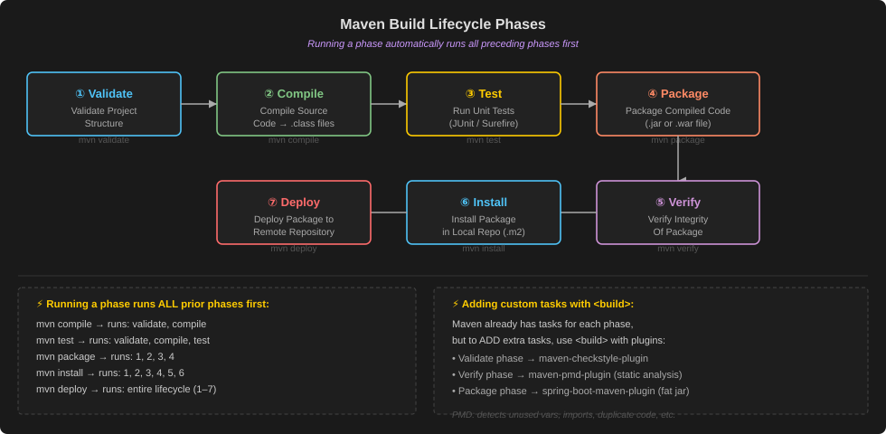
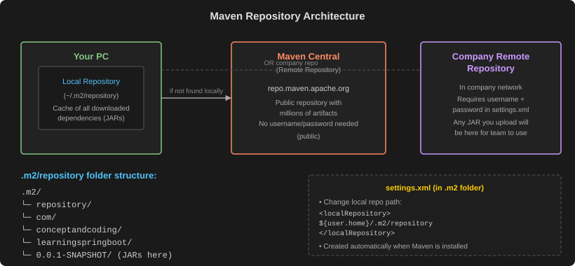
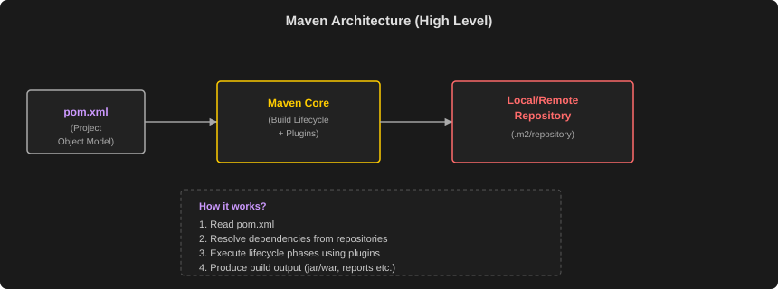

# Maven Notes

> **Maven is a Project Management Tool!!**

---

## 1. What is Maven?

- It's a project management tool. Helps developers with:
  - Build generation
  - Dependency resolution
  - Documentation etc.

- Maven uses **POM** (Project Object Model) to achieve this.

- When `"maven"` command is given, it looks for `"pom.xml"` in the current directory & gets needed configuration.
  - For any command it looks for `pom.xml` in current directory and then looks for configuration.

> Previously we had **ANT** — we needed to tell what to do AND also how to do it.
> But Maven — we need to tell what to do by just **command**!!

---

## 2. Maven Project Structure


```
learningspringboot (your app name)
├── pom.xml
└── src
    ├── main
    │   └── java
    │       └── com
    │           └── conceptandcoding (company name)
    │               └── learningspringboot (app name)
    │                   └── Application.java
    └── test
        └── java
            └── com
                └── conceptandcoding (company name)
                    └── learningspringboot (app name)
                        └── ApplicationTest.java   ← Unit Test Cases live here (Test class)
```

---

## 3. pom.xml — Project Object Model

`pom.xml` is the heart of every Maven project. It contains project configuration.

```xml
<?xml version="1.0" encoding="UTF-8"?>
<project xmlns="http://maven.apache.org/POM/4.0.0"
         xmlns:xsi="http://www.w3.org/2001/XMLSchema-instance"
         xsi:schemaLocation="http://maven.apache.org/POM/4.0.0 https://maven.apache.org/xsd/maven-4.0.0.xsd">
    <modelVersion>4.0.0</modelVersion>

    <parent>
        <groupId>org.springframework.boot</groupId>
        <artifactId>spring-boot-starter-parent</artifactId>
        <version>3.2.3</version>
        <relativePath/>
    </parent>

    <groupId>com.conceptandcoding</groupId>
    <artifactId>learningspringboot</artifactId>     <!-- Unique identifier of your project -->
    <version>0.0.1-SNAPSHOT</version>
    <name>springboot application</name>

    <properties>
        <java.version>17</java.version>             <!-- Define Key-Value pair for configuration. Can be referenced throughout pom.xml -->
    </properties>

    <repositories>
        <repository>
            <id>central</id>
            <url>https://repo.maven.apache.org/maven2</url>   <!-- This is from where Maven looks for dependencies and downloads artifacts (jars) -->
        </repository>
    </repositories>

    <dependencies>
        <dependency>
            <groupId>org.springframework.boot</groupId>
            <artifactId>spring-boot-starter-web</artifactId>
        </dependency>
        <dependency>
            <groupId>org.springframework.boot</groupId>
            <artifactId>spring-boot-starter-test</artifactId>
            <scope>test</scope>                               <!-- This is where we declare the dependencies that our project relies on -->
        </dependency>
    </dependencies>

    <build>
        <plugins>
            <plugin>
                <groupId>org.springframework.boot</groupId>
                <artifactId>spring-boot-maven-plugin</artifactId>
            </plugin>
        </plugins>
    </build>
</project>
```

### pom.xml Annotations Explained:

**① XML Schema declaration:**
- Tells XML schema which defines `pom.xml`. Here you **can't** change the schema like `<parent>` is defined there. You can't write `<xyz>` here — something has to match the schema.

**② `<parent>` block:**
- Tells this is a child of the one present in `<parent>`. We know **groupId** & **artifactId** uniquely identifies a project. So here `spring-boot-starter-parent` is parent of this & this `spring-boot-starter-parent` would be child of **Super pom.xml**. (Every `pom.xml` in Spring Boot is child of Super `pom.xml`)
- If `<parent>` is NOT specified, Maven by default inherits from "Super Pom".
- Super Pom link: https://maven.apache.org/ref/3.6.3/maven-model-builder/super-pom.html

> **groupId, artifactId, Version** → used to **uniquely identify a project** in Maven Central!!

**③ `<groupId>` and `<artifactId>`:**
- Uniquely defines your project.
- `java.version` — we can use it in include `pom.xml`

**④ `<repositories>`:**
- The central repo link is **NOT** necessary to be put there. It's just shown to tell you where these downloads happen. This is already present in Super Pom — just shown here to show!!

> To understand the `<build>` we need to understand **Build Lifecycle**

---

## 4. Maven Build Lifecycle



### Maven Build Lifecycle Phases:

- If you want to run `"package"` phase, all its previous phases will get executed first.
- And if you want to run a specific goal of a particular phase, then all the goals of previous phases + current phase goals before the one you defined will get run.

**Phases (in order):**

| # | Phase | Description |
|---|-------|-------------|
| 1 | **Validate** Project Structure | Validates project is correct |
| 2 | **Compile** Source Code | Compiles Java source |
| 3 | **Test** the code (Unit test) | Runs unit tests |
| 4 | **Package** Compiled Code (Jar or War) | Packages to JAR/WAR |
| 5 | **Verify** the Integrity of Package | Runs integration checks |
| 6 | **Install** the package In Local Repository | Installs to `~/.m2/` |
| 7 | **Deploy** the package In Remote Repository | Deploys to remote repo |

> Phases are in **given order** and only if previous phases have already been completed, then the next phase runs.

Maven already has Validate phase defined and its goal, but if we want to add more goals or tasks, then we can use `<build>` element and add the goal to a specific phase.

At a particular phase, you want some extra task to do in addition to what build already does that.

Suppose at 6th phase we have 3 tasks (T1, T2, T3) — and now you want to add one more task T4. You can add with the help of `<build>`.

---

## 5. Maven Lifecycle Phases in Detail

### Step 1 — Validate: `mvn validate`

`<build>` → This build helps to add a new task inside one of the phases.

```xml
<build>
  <plugin>
    <groupId>org.apache.maven.plugins</groupId>
    <artifactId>maven-checkstyle-plugin</artifactId>
    <version>3.1.2</version>
    <executions>
      <execution>
        <id>validate-checkstyle</id>
        <phase>validate</phase>    <!-- added to this phase -->
        <goals>
          <goal>check</goal>       <!-- 1 Task -->
        </goals>
      </execution>
    </executions>
    <configuration>
      <configLocation>myCodeStyle.xml</configLocation>
    </configuration>
  </plugin>
</build>
```

> **Plugin** → Maven Supports adding a new plugin. The `<build>` block tells configuration if needed.

`check` → checks the **code style** which varies across different companies — which we configure in `myCodeStyle.xml`.

---

### Step 2 — Compile: `mvn compile`

**Run the command:** `mvn compile`

- It will **validate** and **compile** your code and put it under `${project.basedir}/target/classes`
- Creates the **Bytecode** from Java Code
- Creates `.class` file
- This phase internally runs `javac` command
- Target folder is generated after this phase only

> You won't find `validate` phase as it is not compulsory — but in case you need it you can add it.

---

### Step 3 — Test: `mvn test`

- It will **validate**, **compile** and then run the **TEST cases** in your project.

Unit Test class (`SpringbootApplicationTests.java`):
```java
package com.conceptandcoding.learningspringboot;

import ...;

@SpringBootTest
class SpringbootApplicationTests {

    @Test
    void contextLoads() {
        System.out.println("CONCEPT && CODING : TEST CASE RUNNING");
    }
}
```

> The `System.out.println` statement we have given — it will show in test output!!

---

### Step 4 — Package: `mvn package`

→ Creates the **JAR** file.

- First complete Validate, Compile, Test phase and then run Package phase in which it **Generates `.jar` or `.war` file**.
- **JAR is put in this location:** `target/learningspringboot-0.0.1-SNAPSHOT.jar`
- This JAR anyone can use as dependency, can deploy it!!

---

### Step 5 — Verify: `mvn verify`

→ Does not force you to verify — no task in this phase by default.

- It can perform some additional checks apart from unit test cases like:
  - **STATIC CODE ANALYSIS**
  - **CHECKSUM VERIFICATION** etc.

**STATIC CODE ANALYSIS** using PMD plugin (in `verify` phase):

```xml
<plugin>
  <groupId>org.apache.maven.plugins</groupId>
  <artifactId>maven-pmd-plugin</artifactId>
  <version>3.21.2</version>
  <executions>
    <execution>
      <id>pmd-analysis</id>
      <phase>verify</phase>
      <goals>
        <goal>pmd</goal>
      </goals>
    </execution>
  </executions>
</plugin>
```

**PMD is a source code analyzer:**
- Finds unused variable
- Finds unused imports
- Empty Catch block
- No usage of object
- Finds duplicate code etc.

→ Reports warnings

> For **Static Code Analysis** we use **PMD** tool in `verify` phase.

---

### Step 6 — Install: `mvn install`

→ Install package in **local repository**.

- It will install the `.jar` package in local Maven Repository.
- Which is typically located in your user home directory (`~/.m2/repository`) — on Mac.
- **Put in local repository** — that is `.m2` folder.

**`settings.xml` (in `.m2` folder):**

```xml
<settings xmlns="http://maven.apache.org/SETTINGS/1.0.0"
          xmlns:xsi="http://www.w3.org/2001/XMLSchema-instance"
          xsi:schemaLocation="http://maven.apache.org/SETTINGS/1.0.0
                              http://maven.apache.org/xsd/settings-1.0.0.xsd">

  <!-- Local Repository: Location where Maven stores downloaded artifacts -->
  <localRepository>${user.home}/.m2/repository</localRepository>

  <!-- some other configurations goes here -->

</settings>
```

---

## 6. Maven Repositories



- **Local Repository** → Your PC (`~/.m2/repository`)
- **Maven Central** → Remote Repository (public, no auth needed)
- **Company Remote Repository** → In Company Network — whatever JAR you upload will be in Company Remote Repository!!

**In `.m2` folder, `settings.xml` we can change Remote Repository.** Now all the JARs will go to that changed path folder!!

**Local Repository is like a Cache!!** It stores all dependencies so that we need not go to Remote Repository again & again!!

> Whenever you download Maven — `.m2` folder, `settings.xml` will be **created automatically!!**

---

### Step 7 — Deploy: `mvn deploy`

→ Deploy to **Remote Repository** (Company or Maven Central).

It will deploy the `.jar` to REMOTE Repository.

**Needs configuration in both `pom.xml` and `settings.xml`:**

**`pom.xml`:**
```xml
<project>
  <!-- ... other project configurations ... -->

  <distributionManagement>
    <repository>
      <id>remote repository id</id>
      <url>https://remote-repository-url</url>    <!-- URL where you want to deploy -->
    </repository>
  </distributionManagement>

  <!-- ... other pom.xml configurations ... -->
</project>
```

**`settings.xml`:**
```xml
<settings>
  <!-- other settings configurations -->

  <servers>
    <server>
      <id>remote repository id</id>
      <username>remote-repository-username</username>    <!-- Username & Password we put here -->
      <password>remote-repository-password</password>
    </server>
  </servers>

  <!-- other settings configurations -->
</settings>
```

> **URL** where you want to deploy → put in `pom.xml`
> **Username & Password** → put in `settings.xml`

If we do not define the remote repository, then MAVEN during `"mvn deploy"` command will face below error:
```
[ERROR] Failed to execute goal org.apache.maven.plugins:maven-deploy-plugin:3.1.1:deploy
(default-deploy) on project learningspringboot: Deployment failed: repository element
was not specified in the POM inside distributionManagement element ...
```

> If we want to deploy the manifest to Maven central repository: https://repo.maven.apache.org/maven2.
> Since it's public, we do not need username and password in `settings.xml`

---

## 7. Maven Lifecycle Reference — Cheat Sheet



### Default (Build) Lifecycle Phases (Complete Table):

| Phase | Description | Plugin Goal (Generally) |
|-------|-------------|------------------------|
| validate | Validate the project is correct and all necessary information is available | validate |
| initialize | Initialize build state | – |
| generate-sources | Generate any source code | generate-sources |
| process-sources | Process the source code | resources:resources |
| generate-resources | Generate resources | – |
| process-resources | Copy and process resources | resources:resources |
| compile | Compile the source code of the project | compiler:compile |
| process-classes | Post-process the generated classes | – |
| generate-test-sources | Generate any test source code | – |
| process-test-sources | Process test source code | resources:testResources |
| generate-test-resources | Generate test resources | – |
| process-test-resources | Copy and process test resources | resources:testResources |
| test-compile | Compile the test source code | compiler:testCompile |
| test | Run tests using a suitable unit testing framework | surefire:test |
| prepare-package | Perform any operations necessary to prepare a package before actual packaging | – |
| package | Package the compiled code in its distributable format (jar/war) | jar:jar or war:war |
| verify | Run any checks to verify the package is valid | – |
| install | Install the package into the local repository (.m2) | install:install |
| deploy | Copy the final package to the remote repository | deploy:deploy |

---

## 8. Common Maven Commands

| Command | Description | Example |
|---------|-------------|---------|
| `mvn clean` | Cleans the project (deletes target/) | mvn clean |
| `mvn compile` | Compiles main source code | mvn compile |
| `mvn test` | Compiles and runs tests | mvn test |
| `mvn package` | Packages the code (jar/war) | mvn package |
| `mvn install` | Installs the package to local repo (.m2) | mvn install |
| `mvn deploy` | Deploys the package to remote repo | mvn deploy |
| `mvn clean install` | Clean + build + test + install | mvn clean install |
| `mvn clean package` | Clean + build + test + package | mvn clean package |
| `mvn clean install -DskipTests` | Build and install, but skip tests | mvn clean install -DskipTests |
| `mvn dependency:tree` | Shows dependency tree | mvn dependency:tree |
| `mvn help:effective-pom` | Shows the final POM after inheritance | mvn help:effective-pom |
| `mvn help:effective-settings` | Shows effective settings | mvn help:effective-settings |

---

## 9. Useful Maven Options

| Option | Description |
|--------|-------------|
| `-DskipTests` | Skip test execution (but compiles tests) |
| `-Dmaven.test.skip=true` | Skip test compilation and execution |
| `-X` | Enable debug output |
| `-e` | Show full stack trace of errors |
| `-U` | Forces update of snapshots/releases |
| `-P<profile-id>` | Activate a specific profile |
| `-q (quiet)` | Quiet mode (less logs) |
| `-version` | Show Maven version |

---

## 10. Running a Specific Phase

- If we run a phase, all previous phases are executed.

```
mvn test     → runs validate, compile, test-compile, test
mvn package  → runs up to package
mvn install  → runs up to install
mvn deploy   → runs entire lifecycle
```

### Skip Tests

- `-DskipTests` → compiles tests but does NOT run
- `-Dmaven.test.skip=true` → does not compile AND does not run tests

---

## 11. Example: Lifecycle Execution

If we run → `mvn install`

It will execute phases in this order:

```
validate → compile → test → package → verify → install
```
*(All previous phases are executed automatically)*

---

## 12. Folder Created by Maven Build

After `mvn package` (jar project):

```
project-root/
├── src/
└── target/
    ├── classes/          (compiled classes)
    ├── test-classes/     (compiled test classes)
    ├── app.jar           (executable jar)
    └── ...
└── pom.xml
```

---

## 13. Other Maven Lifecycles

### Clean Lifecycle
Used to clean the project.

Phases:
- `pre-clean`
- `clean` → deletes `target/` directory
- `post-clean`

### Site Lifecycle
Used to generate project documentation.

Phases:
- `pre-site`
- `site` → generates site in `target/site`
- `post-site`
- `site-deploy`

---

## 14. Spring Boot + Maven (Typical Flow)

1. Create Spring Boot project (Spring Initializer)
2. `pom.xml` contains `spring-boot-starter-parent` (Manages versions)
3. Add dependencies (starters)
4. Write code
5. Run:
   - `mvn spring-boot:run` → run application
   - `mvn clean package` → creates executable jar
   - `java -jar target/app.jar` → run jar

---

## 15. Important Maven Plugins in Spring Boot

| Plugin | Purpose |
|--------|---------|
| `spring-boot-maven-plugin` | Builds executable jar/war and runs the app |
| `maven-compiler-plugin` | Compiles java code |
| `maven-surefire-plugin` | Runs unit tests (JUnit) |
| `maven-jar-plugin` | Creates JAR file |
| `maven-war-plugin` | Creates WAR file |

---

## 16. Key Takeaways

- Maven follows **lifecycle based build**.
- Each phase has a **specific goal**.
- Running a phase runs **all previous phases** automatically.
- Maven manages **dependencies automatically**.
- In Spring Boot, `spring-boot-maven-plugin` makes running and packaging super easy.