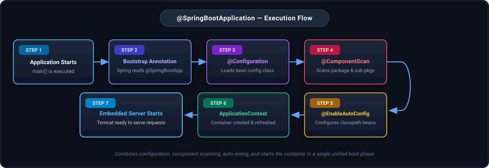
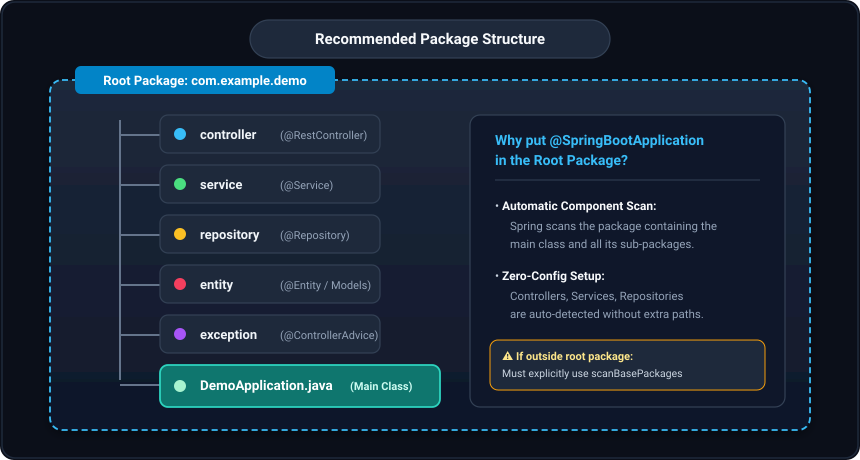
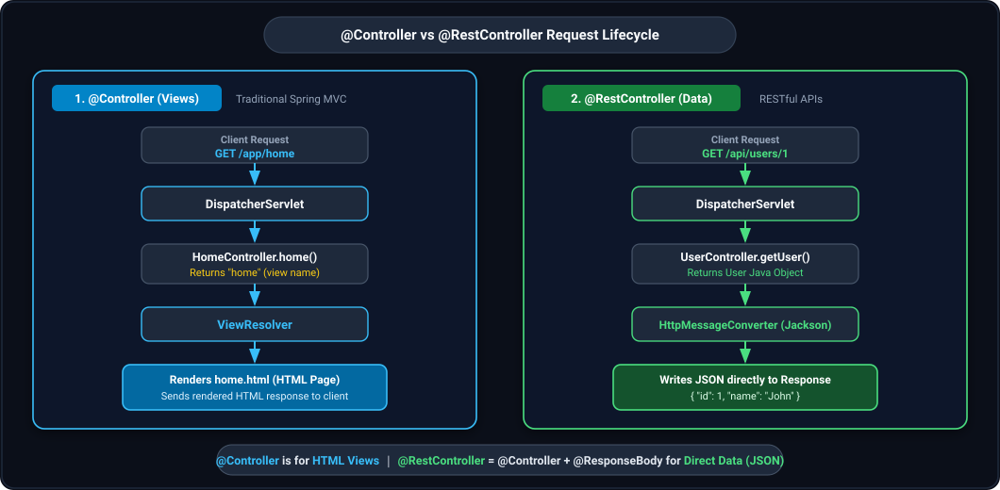
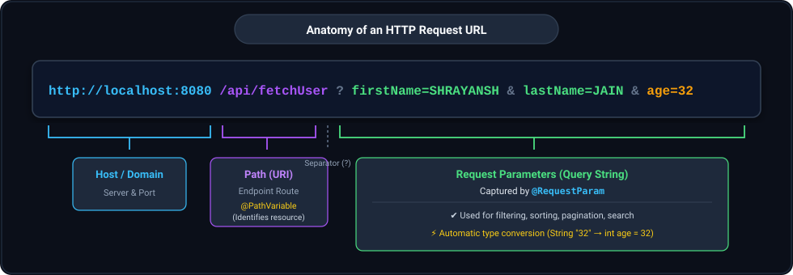
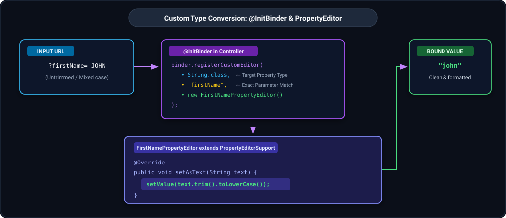
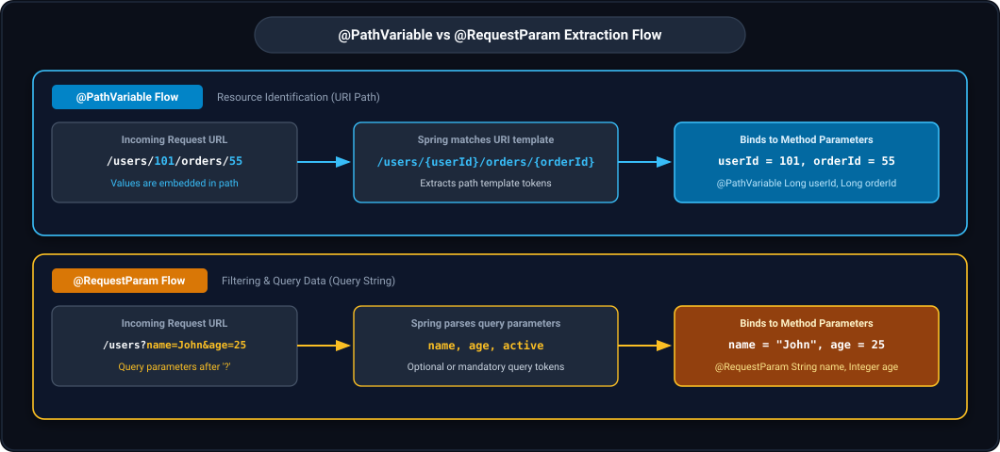
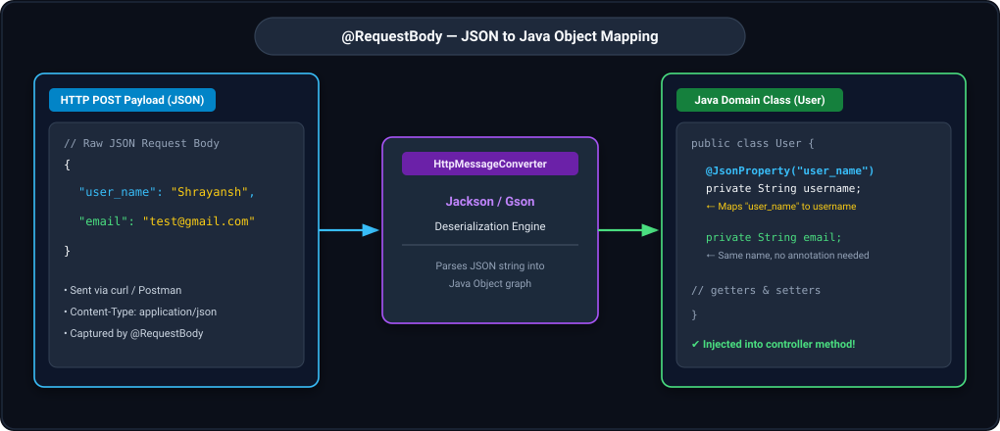
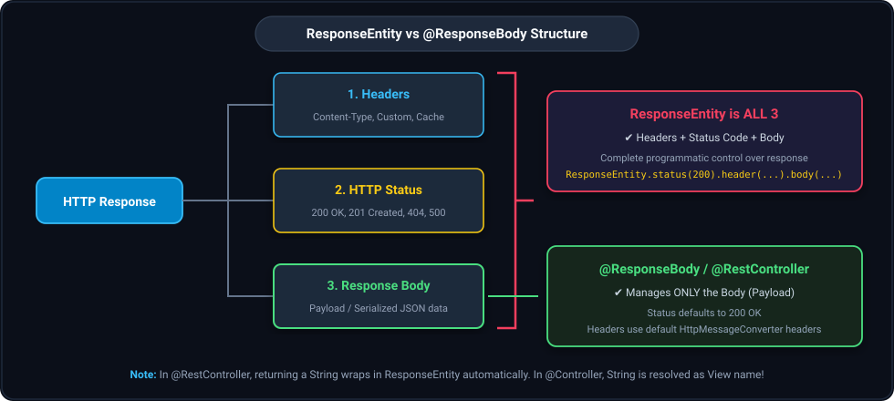
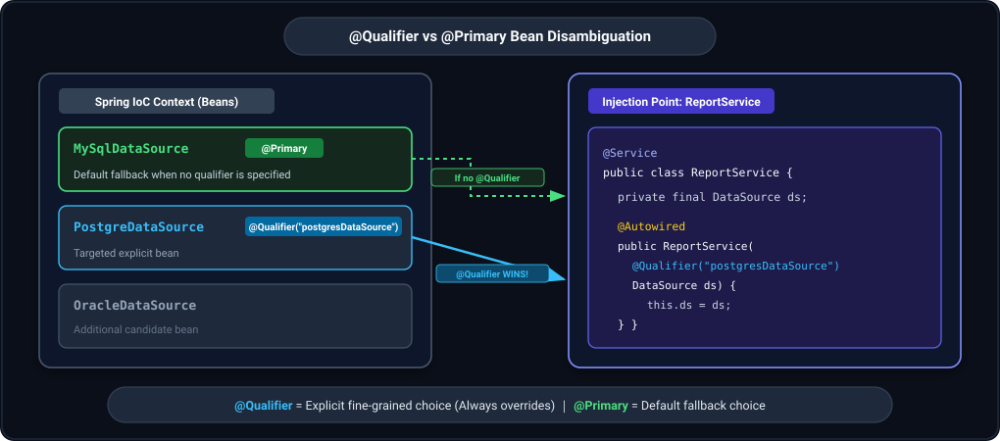
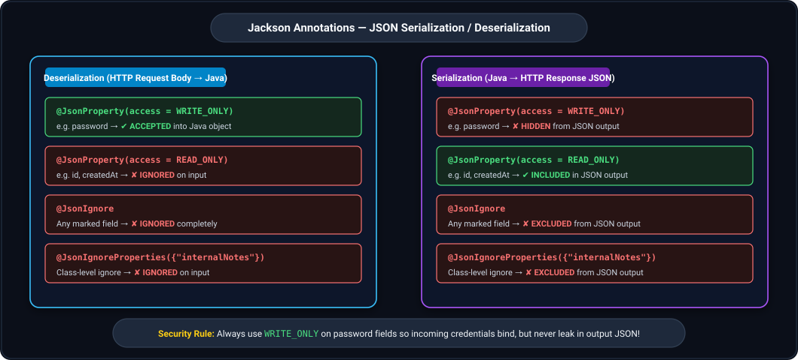

## 1. @SpringBootApplication

### Introduction
- `@SpringBootApplication` is the primary bootstrap annotation used in every Spring Boot application.
- It is placed directly on the main class (the class containing the entry point `public static void main(String[] args)`).
- It is a convenience meta-annotation combining three foundational Spring annotations:
  1. `@Configuration`
  2. `@EnableAutoConfiguration`
  3. `@ComponentScan`
- It triggers Spring Boot's auto-configuration engine, scans for components across the base package and its sub-packages, and allows developers to register additional beans.

---

### Definition & Meta-Annotations
Inside the Spring Boot framework (`org.springframework.boot.autoconfigure`), `@SpringBootApplication` is declared as:

```java
@Target(ElementType.TYPE)
@Retention(RetentionPolicy.RUNTIME)
@Documented
@Inherited
@SpringBootConfiguration
@EnableAutoConfiguration
@ComponentScan
public @interface SpringBootApplication {

    @AliasFor(annotation = EnableAutoConfiguration.class)
    Class<?>[] exclude() default {};

    @AliasFor(annotation = EnableAutoConfiguration.class)
    String[] excludeName() default {};

    @AliasFor(annotation = ComponentScan.class, attribute = "basePackages")
    String[] scanBasePackages() default {};

    @AliasFor(annotation = ComponentScan.class, attribute = "basePackageClasses")
    Class<?>[] scanBasePackageClasses() default {};

    @AliasFor(annotation = Configuration.class, attribute = "proxyBeanMethods")
    boolean proxyBeanMethods() default true;
}
```

---

### What It Does Internally
When the application starts, Spring Boot performs the following 6 sequential steps:
1. **Loads the configuration class:** Reads the class annotated with `@SpringBootApplication` as a central bean configuration class.
2. **Scans packages & sub-packages:** Scans the package where the main class is located and all its sub-packages for Spring components (`@Component`, `@Service`, `@Repository`, `@Controller`, `@RestController`, etc.).
3. **Enables Auto-Configuration:** Inspects the runtime classpath, existing user-defined beans, and application properties to configure beans automatically.
4. **Starts Embedded Server:** Boots up the configured embedded servlet container (Tomcat by default, Jetty, or Undertow).
5. **Creates and Refreshes ApplicationContext:** Instantiates the Spring IoC Container and manages the bean lifecycle.
6. **Prepares Request Handlers:** Makes the application ready to receive and process incoming client HTTP requests.



---

### The Three Core Constituent Annotations

#### A) `@Configuration`
- Marks the annotated class as a source of bean definitions for the Spring IoC Container.
- Modern Java-based equivalent of legacy XML `<beans>` configuration.
- Allows methods inside the class to be annotated with `@Bean` so Spring can instantiate, configure, and manage them.
- Used by the Spring container to process configuration metadata during bootstrap.

#### B) `@EnableAutoConfiguration`
- Enables Spring Boot's smart auto-configuration mechanism.
- Automatically configures beans based on:
  - **Libraries present on the classpath:** (e.g., if `spring-webmvc` is present, it auto-configures `DispatcherServlet`; if MySQL driver is present, it prepares `DataSource`).
  - **Beans already defined:** Will never override or conflict with custom beans explicitly defined by the developer.
  - **Application properties:** Reads configurations from `application.properties` or `application.yml`.
- Dramatically reduces boilerplate and eliminates manual XML/Java configuration.

#### C) `@ComponentScan`
- Instructs Spring to scan the current package (where the annotated class resides) and all its child packages.
- Automatically registers all stereotype annotations with the Spring container (`@Component`, `@Service`, `@Repository`, `@Controller`, `@RestController`).
- Equivalent to `<context:component-scan>` in traditional Spring XML configuration.

---

### Where Should We Put It?
- Always place `@SpringBootApplication` on the main application class located in the **root package** (top-level package).
- All other application packages (`controller`, `service`, `repository`, `entity`, `exception`, etc.) must be sub-packages of this root package.
- This ensures `@ComponentScan` automatically discovers every component without needing manual package paths.



**Example Package Hierarchy:**
```text
com.example.demo                     <-- Root Package
├── controller                       <-- Sub-package (Discovered automatically)
│   └── UserController.java
├── service                          <-- Sub-package
│   └── UserService.java
├── repository                       <-- Sub-package
│   └── UserRepository.java
├── entity                           <-- Sub-package
│   └── User.java
├── exception                        <-- Sub-package
│   └── GlobalExceptionHandler.java
└── DemoApplication.java            <-- Main Class with @SpringBootApplication
```

---

### Code Example
```java
package com.example.demo;

import org.springframework.boot.SpringApplication;
import org.springframework.boot.autoconfigure.SpringBootApplication;

@SpringBootApplication
public class DemoApplication {

    public static void main(String[] args) {
        // Creates & starts the ApplicationContext and the embedded Tomcat server
        SpringApplication.run(DemoApplication.class, args);
    }
}
```

**Explanation:**
- `@SpringBootApplication` boots the application by combining configuration, auto-configuration, and component scanning.
- `SpringApplication.run(...)` launches the application, bootstraps Spring's `ApplicationContext`, and starts the embedded web server.

---

### Important Attributes
1. **`exclude` / `excludeName`:**
   - Excludes specific auto-configuration classes that are not needed.
   - Useful when you want to bypass a specific auto-configured feature (e.g. disabling automatic database connection).
2. **`scanBasePackages` / `scanBasePackageClasses`:**
   - Used to supply custom base packages for component scanning if some classes reside outside the root package hierarchy.

```java
@SpringBootApplication(
    scanBasePackages = "com.example.custom",
    exclude = { DataSourceAutoConfiguration.class }
)
public class DemoApplication {
    public static void main(String[] args) {
        SpringApplication.run(DemoApplication.class, args);
    }
}
```

---

### Summary Table

| Annotation | Purpose | What It Does | Equivalent (XML) |
|---|---|---|---|
| `@Configuration` | Marks class as bean configuration source | Allows methods annotated with `@Bean` | `<beans>` |
| `@EnableAutoConfiguration` | Enables Spring Boot auto-configuration | Configures beans based on classpath, properties & existing beans | N/A (Spring Boot feature) |
| `@ComponentScan` | Scans components across packages | Finds and registers `@Component`, `@Service`, `@Repository`, `@Controller` | `<context:component-scan>` |
| `@SpringBootApplication` | Combination meta-annotation | Unifies `@Configuration` + `@EnableAutoConfiguration` + `@ComponentScan` | N/A |

> **Core Formula:**
> ````
> @SpringBootApplication = @Configuration + @EnableAutoConfiguration + @ComponentScan
> ````

---

## 2. @Controller

### Introduction
- `@Controller` is a core stereotype annotation in Spring MVC used to indicate that a Java class acts as a web controller responsible for handling incoming HTTP requests.
- **Only classes annotated with `@Controller` (or `@RestController`) can handle HTTP requests in Spring.**
- It is meta-annotated with `@Component`, which allows it to be auto-detected by Spring's component scanning mechanism.

```java
@Target({ElementType.TYPE})
@Retention(RetentionPolicy.RUNTIME)
@Documented
@Component
public @interface Controller {
    @AliasFor(annotation = Component.class)
    String value() default "";
}
```

---

### View-Oriented Behavior
- Traditional `@Controller` is designed primarily for web applications that return **HTML Views** (rendered with view technologies such as Thymeleaf, JSP, or FreeMarker).
- **Default Behavior:** By default, the return value of a controller method (such as a `String`) is treated as a **view name** that is resolved by a `ViewResolver`.
- If an `@Controller` needs to return raw data (such as JSON or XML) instead of a view, the method must explicitly be annotated with `@ResponseBody`, or return a `ResponseEntity`.

```java
@Controller
@RequestMapping("/app")
public class HomeController {

    @GetMapping("/home")
    public String home(Model model) {
        model.addAttribute("msg", "Welcome to Spring MVC");
        return "home"; // Resolves to /templates/home.html via ViewResolver
    }
}
```

---

## 3. @RestController

### Introduction & Definition
- `@RestController` is a specialized convenience annotation for building **RESTful Web Services and APIs**.
- It was introduced in Spring 4.0 and combines `@Controller` and `@ResponseBody`:

> **Formula:**
> ````
> @RestController = @Controller + @ResponseBody
> ````

```java
@Target(ElementType.TYPE)
@Retention(RetentionPolicy.RUNTIME)
@Documented
@Controller
@ResponseBody
public @interface RestController {
    @AliasFor(annotation = Controller.class)
    String value() default "";
}
```

---

### Data-Oriented Behavior
- Since `@ResponseBody` is inherited at the class level, **every method inside `@RestController` automatically writes its return value directly to the HTTP response body**.
- It never produces or looks for a View.
- Return objects (such as DTOs, Maps, Lists) are automatically serialized into JSON or XML by registered `HttpMessageConverter` instances (primarily Jackson ObjectMapper).

```java
@RestController
@RequestMapping("/api/users")
public class UserController {

    @GetMapping("/{id}")
    public User getUser(@PathVariable Long id) {
        // Automatically converted to JSON in the HTTP response body
        return new User(id, "John", "john@example.com");
    }
}
```

---

### @Controller vs @RestController Comparison



| Feature | `@Controller` | `@RestController` |
|---|---|---|
| **Primary Purpose** | Traditional Web Applications (Server-side rendered Views) | RESTful Web APIs & Microservices (Raw Data) |
| **Return Value** | View Name (`String`) resolved to an HTML page | Data Object (`User`, `List<T>`, `Map`, etc.) |
| **Response Handling** | Resolved by `ViewResolver` | Written directly to HTTP Response Body |
| **Needs `@ResponseBody`** | Yes (explicitly on each method returning data) | No (automatically inherited at class level) |
| **Default Behavior** | Forward to view template | Serializes payload to JSON / XML via Jackson |
| **Typical Use Cases** | Thymeleaf, JSP, legacy MVC web pages | Microservices, Single Page Applications (React, Angular), Mobile Apps |
| **Code Example** | `return "home";` (renders `home.html`) | `return new User(...);` (returns JSON `{ "id": 1 }`) |

---

### Same Endpoint Comparison Example

**1. Using `@Controller` (Returns View):**
```java
@Controller
public class ProductController {

    @GetMapping("/products")
    public String getProducts(Model model) {
        List<Product> list = productService.getAll();
        model.addAttribute("products", list);
        return "products"; // Resolves to /templates/products.html
    }
}
// Response: Renders the products.html template and sends HTML to client
```

**2. Using `@RestController` (Returns Data):**
```java
@RestController
public class ProductController {

    @GetMapping("/products")
    public List<Product> getProducts() {
        return productService.getAll(); // Serialized directly to JSON
    }
}
// Response: JSON Array of products
// [ {"id": 1, "name": "Laptop", "price": 50000}, {"id": 2, "name": "Phone", "price": 20000} ]
```

> **Bottom Line:**
> Both do the exact same job of handling incoming HTTP requests.
> - `@Controller` is for **views** (HTML).
> - `@RestController` is for **data** (JSON/XML).

---

## 4. @ResponseBody

### Introduction & Core Rule
- `@ResponseBody` is an annotation that tells Spring that the value returned by a controller method should be serialized directly into the **HTTP Response Body**, rather than being placed in a Model or interpreted as a View name.
- It bypasses the `ViewResolver` entirely and invokes registered `HttpMessageConverter`s (e.g. Jackson for JSON).

> **The Fundamental Rule:**
> - **Without `@ResponseBody`:** The return value is considered a **View name** (Spring attempts to resolve an HTML template).
> - **With `@ResponseBody`:** The return value is **Data / HTTP Response Body** (Spring serializes the object to JSON/XML).

```java
@Controller
public class LegacyApiController {

    // Because @ResponseBody is explicitly added, this returns JSON data, NOT a view name!
    @ResponseBody
    @GetMapping("/api/status")
    public Map<String, String> getStatus() {
        return Collections.singletonMap("status", "UP");
    }
}
```

---

## 5. @RequestMapping

### Introduction
- `@RequestMapping` is the core routing annotation in Spring MVC used to map web requests onto handler methods and controller classes.
- Can be applied at two levels:
  1. **Class level:** Sets the shared base path prefix for all endpoints within that controller.
  2. **Method level:** Defines the specific endpoint path and HTTP method.
  - When used at both levels, the method path is **concatenated** with the class path:
    - Class: `@RequestMapping("/api")`
    - Method: `@RequestMapping("/fetchUser")`
    - Full resolved endpoint: `/api/fetchUser`

---

### Definition & Meta-Annotations
```java
@Target({ElementType.TYPE, ElementType.METHOD})
@Retention(RetentionPolicy.RUNTIME)
@Documented
@Mapping
@Reflective(ControllerMappingReflectiveProcessor.class)
public @interface RequestMapping {

    String name() default "";

    @AliasFor("path")
    String[] value() default {};

    @AliasFor("value")
    String[] path() default {};

    RequestMethod[] method() default {};

    String[] params() default {};

    String[] headers() default {};

    String[] consumes() default {};

    String[] produces() default {};
}
```

---

### Key Attributes Explained
1. **`path` / `value`:**
   - Both are aliases for each other (`@AliasFor`). You can use either `path = "/fetchUser"` or `value = "/fetchUser"`, or simply `"/fetchUser"`.
2. **`method`:**
   - Specifies the HTTP request method (`RequestMethod.GET`, `POST`, `PUT`, `PATCH`, `DELETE`, etc.).
3. **`consumes`:**
   - Narrows the mapping by the `Content-Type` header sent by the client (e.g. `consumes = "application/json"`).
4. **`produces`:**
   - Narrows the mapping by the `Accept` header sent by the client, specifying what media type the endpoint returns (e.g. `produces = "application/json"`).
5. **`headers`:**
   - Narrows mapping to requests containing specific headers (e.g. `headers = "X-API-VERSION=1"`).
6. **`params`:**
   - Narrows mapping to requests containing specific query parameters (e.g. `params = "action=create"`).

```java
@RequestMapping(
    path = "/fetchUser",
    method = RequestMethod.GET,
    consumes = "application/json",
    produces = "application/json"
)
```

---

### Internal Working & Reflection
- **`@Mapping`:** Meta-annotation indicating that this annotation participates in web request mapping.
- **`DispatcherServlet` Registration:** URL mappings must reside within `@Controller` / `@RestController` classes because Spring's `DispatcherServlet` inspects only controller beans during startup to build its `HandlerMapping` table.
- **Reflection Resolution:** All mapping annotations are discovered and resolved via **Java Reflection**.
- **`@Reflective(ControllerMappingReflectiveProcessor.class)`:** The internal processor class responsible for registering mapping metadata during compilation and AOT/reflection processing.

---

### HTTP Method Shortcut Annotations
Spring provides convenient composed annotations that encapsulate `@RequestMapping(method = ...)`:
- `@GetMapping(path = "...")` $\rightarrow$ `@RequestMapping(method = RequestMethod.GET)`
- `@PostMapping(path = "...")` $\rightarrow$ `@RequestMapping(method = RequestMethod.POST)`
- `@PutMapping(path = "...")` $\rightarrow$ `@RequestMapping(method = RequestMethod.PUT)`
- `@DeleteMapping(path = "...")` $\rightarrow$ `@RequestMapping(method = RequestMethod.DELETE)`
- `@PatchMapping(path = "...")` $\rightarrow$ `@RequestMapping(method = RequestMethod.PATCH)`

---

## 6. @RequestParam (Type Conversion, @InitBinder & PropertyEditor)

### Introduction
- `@RequestParam` is used to extract query parameters from the HTTP request URL and bind them to controller method parameters.



**URL Breakdown:**
```text
http://localhost:8080/api/fetchUser?firstName=SHRAYANSH&lastName=JAIN&age=32
|───────────────────| |────────────| |──────────────────────────────────────|
       Host                Path               Request Parameters (Query)
```
- **Host:** Server protocol, domain, and port (`http://localhost:8080`).
- **Path:** Resource route (`/api/fetchUser`).
- **Query Delimiter:** `?` initiates query parameters, separated by `&`.
- **Request Parameters:** Key-value pairs (`firstName=SHRAYANSH`, `lastName=JAIN`, `age=32`).

---

### Code Example
```java
@RestController
@RequestMapping(value = "/api")
public class SampleController {

    @GetMapping(path = "/fetchUser")
    public String getUserDetails(
            @RequestParam(name = "firstName") String firstName,
            @RequestParam(name = "lastName", required = false) String lastName,
            @RequestParam(name = "age") int age) {

        return "fetching and returning user details based on first name = " + firstName +
               ", lastName = " + lastName + " and age is = " + age;
    }
}
```

### Attributes & Rules
- **`name` / `value`:** Name of the query parameter in the URL.
- **`required`:** Indicates whether the parameter is mandatory.
  - **By default, `required = true`**.
  - If a mandatory parameter is missing in the request, Spring aborts mapping and throws HTTP **400 Bad Request** (`MissingServletRequestParameterException`).
  - Set `required = false` for optional parameters.
- **`defaultValue`:** Sets a fallback value if the parameter is omitted.

---

### Automatic Type Conversion
Spring automatically converts the string representation of query parameters into the declared Java method parameter type:
1. **Primitive types:** `int`, `long`, `float`, `double`, `boolean`, etc. (e.g. `?age=28` automatically converts to `int age = 28`).
2. **Wrapper classes:** `Integer`, `Long`, `Float`, `Double`, `Boolean`, etc.
3. **String:** Inherently treated as strings without conversion.
4. **Enums:** Binds matching string values directly to enum constants.
5. **Custom object types:** Supported by registering a custom `PropertyEditor` or `Converter`.

---

### Custom Type Conversion with @InitBinder & PropertyEditorSupport
When we need custom transformation or logic before assigning an incoming request parameter to a variable (e.g., trimming whitespace, sanitizing text, converting to lowercase, or parsing custom date formats like `/23/9/1987`), we register a custom `PropertyEditor`.



#### 1. Create a Custom PropertyEditor
Extend `PropertyEditorSupport` and override `setAsText(String text)`:

```java
import java.beans.PropertyEditorSupport;

public class FirstNamePropertyEditor extends PropertyEditorSupport {

    @Override
    public void setAsText(String text) throws IllegalArgumentException {
        // Custom logic: trim whitespace and convert to lower case
        if (text != null) {
            setValue(text.trim().toLowerCase());
        }
    }
}
```

#### 2. Register via `@InitBinder` in the Controller
```java
@RestController
@RequestMapping(value = "/api")
public class SampleController {

    @InitBinder
    protected void initBinder(DataBinder binder) {
        // Registers custom editor for a specific field name and type
        binder.registerCustomEditor(String.class, "firstName", new FirstNamePropertyEditor());
    }

    @GetMapping(path = "/fetchUser")
    public String getUserDetails(
            @RequestParam(name = "firstName") String firstName,
            @RequestParam(name = "lastName", required = false) String lastName,
            @RequestParam(name = "age") int age) {

        return "fetching and returning user details based on first name = " + firstName +
               ", lastName = " + lastName + " and age is = " + age;
    }
}
```

**How It Works:**
- `@InitBinder` tells Spring to configure the `DataBinder` before handling incoming requests in this controller.
- `binder.registerCustomEditor(requiredType, field, propertyEditor)` takes 3 arguments:
  1. `requiredType` (`String.class`): The target data type of the property.
  2. `field` (`"firstName"`): The exact parameter name to intercept.
  3. `propertyEditor` (`new FirstNamePropertyEditor()`): The custom editor instance that overrides `setAsText()`.
- When a request with `?firstName=  JOHN ` arrives, Spring matches `"firstName"`, runs `FirstNamePropertyEditor.setAsText()`, trims and lowercases it, and passes `"john"` into the controller method!

---

## 7. @PathVariable (and @PathVariable vs @RequestParam)

### Introduction
- `@PathVariable` extracts values directly from the URI path template (e.g. `/api/fetchUser/{firstName}`).
- Used when a value is part of the URI path itself and represents a specific resource identifier.

```java
@RestController
@RequestMapping(value = "/api")
public class SampleController {

    @GetMapping(path = "/fetchUser/{firstName}")
    public String getUserDetails(@PathVariable(value = "firstName") String firstName) {
        return "fetching and returning user details based on first name = " + firstName;
    }
}
```

---

### Deep Comparison: @PathVariable vs @RequestParam



| Feature | `@PathVariable` | `@RequestParam` |
|---|---|---|
| **Origin of Value** | URI Path Template | Query String (after `?`) |
| **Example URL** | `GET /users/101` | `GET /users?id=101` |
| **Primary Use Case** | Identifying a specific resource (`id`, `orderId`) | Filtering, searching, sorting, pagination, optional data |
| **Required by Default** | Yes (part of the path) | Yes by default (`required=false` can be configured) |
| **Can be Optional?** | No (omitting changes the path structure) | Yes (`required = false` or `defaultValue = "..."`) |
| **RESTful Style** | Highly RESTful (Clean hierarchical URI) | Less RESTful (Query string parameter) |

---

### Combined Usage Example
A common RESTful design pattern combines both annotations: `@PathVariable` identifies the resource, while `@RequestParam` handles optional filters.

```java
@RestController
@RequestMapping("/users")
public class UserController {

    // Example Request: GET /users/101?sort=name&page=2
    @GetMapping("/{userId}")
    public String getUser(
            @PathVariable Long userId,
            @RequestParam(required = false) String sort,
            @RequestParam(defaultValue = "0") int page) {

        return "userId=" + userId + ", sort=" + sort + ", page=" + page;
    }
}
```

> **Rule of Thumb:**
> - Use `@PathVariable` for **identifying** a specific resource.
> - Use `@RequestParam` for **filtering, searching, or optional** metadata about that resource.

---

## 8. @RequestBody (JSON Deserialization & @JsonProperty)

### Introduction
- `@RequestBody` binds the body of the incoming HTTP request (typically JSON or XML payload) directly to a Java domain object.
- Spring uses an `HttpMessageConverter` (by default Jackson `MappingJackson2HttpMessageConverter`, or Gson) to deserialize the incoming JSON string into the target Java object.



---

### Code Example
**Controller:**
```java
@RestController
@RequestMapping(value = "/api")
public class SampleController {

    @PostMapping(path = "/saveUser")
    public String saveUser(@RequestBody User user) {
        return "User created " + user.getUsername() + ":" + user.getEmail();
    }
}
```

**Java Domain Class:**
```java
public class User {

    @JsonProperty("user_name")
    private String username;

    private String email;

    public String getUsername() {
        return username;
    }
    public void setUsername(String username) {
        this.username = username;
    }
    public String getEmail() {
        return email;
    }
    public void setEmail(String email) {
        this.email = email;
    }
}
```

**Sample cURL Request:**
```bash
curl --location --request POST 'http://localhost:8080/api/saveUser' \
--header 'Content-Type: application/json' \
--data-raw '{
    "user_name": "Shrayansh",
    "email": "sjxyztest@gmail.com"
}'
```

---

### Key Mechanics & @JsonProperty
- **Direct Mapping:** The JSON payload sent in the HTTP POST/PUT request is automatically mapped directly into the Java class fields.
- **`@JsonProperty("user_name")`:** Maps the JSON key `"user_name"` to the Java property `username`.
- **Exact Name Match:** If the JSON field name matches the Java field name identically (e.g., `"email"` $\leftrightarrow$ `email`), `@JsonProperty` is not required.
- **Under the Hood:** Spring uses Jackson's `ObjectMapper` (or Gson) to inspect getters/setters and construct the Java object graph.

---

## 9. ResponseEntity (Header, Status & Body)

### Introduction
- `ResponseEntity` represents the **entire HTTP Response**:
  1. **HTTP Headers** (e.g. `Content-Type`, `Cache-Control`, custom headers)
  2. **HTTP Status Code** (e.g. `200 OK`, `201 CREATED`, `400 BAD_REQUEST`, `404 NOT_FOUND`)
  3. **Response Body** (Payload serialized into JSON, XML, or text)



---

### Code Example
```java
@RestController
@RequestMapping(value = "/api")
public class SampleController {

    @GetMapping(path = "/fetchUser")
    public ResponseEntity<String> getUserDetails(@RequestParam(value = "firstName") String firstName) {
        String output = "fetched User details of " + firstName;

        return ResponseEntity
                .status(HttpStatus.OK)
                .header("Custom-Header", "DemoValue")
                .body(output);
    }
}
```

---

### ResponseEntity vs @ResponseBody
- **`ResponseEntity` is ALL 3:** It gives complete programmatic control over Headers, Status Code, and Body.
- **`@ResponseBody` is ONLY the Body:** When using `@ResponseBody` or `@RestController`, Spring automatically serializes the returned object to the HTTP response body and defaults the HTTP status code to `200 OK`.
- **String Return Differences:**
  - In **`@RestController`**, when simply returning a `String`, Spring internally wraps it inside a `ResponseEntity` with `HttpStatus.OK` and writes it to the response body.
  - In **`@Controller`**, returning a `String` is interpreted as a **View name**!

---

## 10. @Qualifier & @Primary (Bean Disambiguation)

### Introduction
- When multiple beans of the same interface or type exist in the Spring IoC context, Spring encounters ambiguity during dependency injection and throws `NoUniqueBeanDefinitionException`.
- Both `@Qualifier` and `@Primary` are used to resolve bean ambiguity, but they operate differently.



---

### 1. @Qualifier (Bean Level + Injection Point Level)
- **Where it is used:** Primarily placed at the **injection point** (constructor argument, field, or setter), but can also be defined on the bean class/method.
- **Purpose:** Explicitly tells Spring **EXACTLY** which bean name or custom qualifier to inject.
- Provides fine-grained, explicit control.

```java
// 1. Define multiple beans of the same type
@Component("mySqlDataSource")
public class MySqlDataSource implements DataSource { }

@Component("postgresDataSource")
public class PostgreDataSource implements DataSource { }

// 2. Explicitly inject using @Qualifier
@Service
public class ReportService {

    private final DataSource dataSource;

    @Autowired
    public ReportService(@Qualifier("mySqlDataSource") DataSource dataSource) {
        this.dataSource = dataSource;
    }
}
```

#### Custom Qualifier Annotations
Instead of hardcoding bean names as strings, you can define custom qualifier annotations:

```java
@Target({ElementType.FIELD, ElementType.PARAMETER, ElementType.METHOD, ElementType.TYPE})
@Retention(RetentionPolicy.RUNTIME)
@Qualifier
public @interface FastDB { }

// Apply to bean
@Component
@FastDB
public class MySqlDataSource implements DataSource { }

// Inject via custom qualifier
@Service
public class ReportService {
    @Autowired
    public ReportService(@FastDB DataSource dataSource) {
        this.dataSource = dataSource;
    }
}
```

---

### 2. @Primary (Bean Level)
- **Where it is used:** Placed at the **bean definition level** (`@Component` class or `@Bean` method).
- **Purpose:** Marks a bean as the **DEFAULT** candidate when multiple beans exist and no qualifier is specified at the injection point.
- Acts as a fallback default choice. Only one bean of a given type should be marked `@Primary`.

```java
@Component
@Primary // Default bean
public class MySqlDataSource implements DataSource { }

@Component
public class PostgreDataSource implements DataSource { }

@Service
public class ReportService {

    private final DataSource dataSource;

    @Autowired
    public ReportService(DataSource dataSource) {
        // Spring injects MySqlDataSource because it is marked @Primary
        this.dataSource = dataSource;
    }
}
```

---

### Quick Comparison Table

| Feature | `@Qualifier` | `@Primary` |
|---|---|---|
| **Purpose** | Choose a specific bean explicitly | Designate a default fallback bean |
| **Where Used** | At the injection point (constructor, parameter, field) | At the bean definition (`@Component`, `@Bean`) |
| **Specification Syntax** | `@Qualifier("beanName")` or custom annotation | `@Primary` |
| **When Used** | When you need exact, fine-grained control | When one bean is the preferred default |
| **Multiple Allowed?** | Yes (different qualifiers for different beans) | No (only one `@Primary` per bean type) |
| **Precedence (Both Used)** | `@Qualifier` **wins** | `@Qualifier` overrides `@Primary` |

> **Precedence Rule:**
> If both are present, **`@Qualifier` always wins!**
> `@Primary` is only considered when no `@Qualifier` is specified at the injection point.
>
> - Use **`@Qualifier`** when you want **EXACT control**.
> - Use **`@Primary`** when you want a **DEFAULT fallback**.

---

## 11. Jackson JSON Exclusion Annotations (@JsonIgnore, @JsonProperty, etc.)

### Introduction
- Spring Boot uses the **Jackson** library by default to convert Java objects to JSON (**Serialization**) and JSON to Java objects (**Deserialization**).
- When exposing REST APIs, certain fields must be excluded or restricted (e.g. passwords, secrets, internal metadata, audit timestamps).
- Jackson annotations control which fields get included or excluded during serialization and deserialization.



---

### 1. `@JsonIgnore` — Complete Field Exclusion
- Placed directly on a field, getter, or setter.
- The field is **completely ignored in both directions**:
  - Never serialized to JSON response.
  - Never deserialized from incoming JSON request.

```java
import com.fasterxml.jackson.annotation.JsonIgnore;

public class User {

    private Long id;
    private String username;

    @JsonIgnore
    private String password; // Completely excluded from JSON

    // Getters and Setters
}
```

**Serialized Output JSON:**
```json
{
  "id": 1,
  "username": "john_doe"
}
```

---

### 2. `@JsonIgnoreProperties` — Class-Level Batch Exclusion
- Applied at the class level to exclude multiple fields at once.
- Can also ignore unknown fields using `ignoreUnknown = true`.
- Can ignore fields inherited from parent superclasses.

```java
import com.fasterxml.jackson.annotation.JsonIgnoreProperties;

@JsonIgnoreProperties({"password", "internalNotes"})
public class User {

    private Long id;
    private String username;
    private String password;
    private String internalNotes;

    // Getters and Setters
}
```

---

### 3. `@JsonProperty(access = Access.WRITE_ONLY)` — Best for Passwords
- **Input (Deserialization):** Accepted from client JSON request.
- **Output (Serialization):** Hidden from JSON response.
- **Perfect for passwords, API keys, and sensitive credentials.**

```java
import com.fasterxml.jackson.annotation.JsonProperty;

public class User {

    private Long id;
    private String username;

    @JsonProperty(access = JsonProperty.Access.WRITE_ONLY)
    private String password;

    // Getters and Setters
}
```

---

### 4. `@JsonProperty(access = Access.READ_ONLY)` — Best for Server-Generated Data
- **Output (Serialization):** Shown in JSON response.
- **Input (Deserialization):** Ignored if the client sends it in the request body.
- **Perfect for IDs, creation timestamps, and calculated fields.**

```java
public class User {

    @JsonProperty(access = JsonProperty.Access.READ_ONLY)
    private Long id;

    @JsonProperty(access = JsonProperty.Access.READ_ONLY)
    private LocalDateTime createdAt;
}
```

---

### 5. `@JsonIgnoreType` — Ignore Entire Type
- Applied on a class definition.
- Any field of this type will automatically be ignored across all classes wherever it is referenced.

```java
import com.fasterxml.jackson.annotation.JsonIgnoreType;

@JsonIgnoreType
public class InternalMetadata {
    private String ipAddress;
    private String deviceInfo;
    private Long requestId;
}

public class User {
    private Long id;
    private String username;
    private InternalMetadata meta; // Whole object ignored automatically
}
```

---

### Quick Comparison Table

| Annotation | Serialize (Java $\rightarrow$ JSON) | Deserialize (JSON $\rightarrow$ Java) | Primary Use Case |
|---|---|---|---|
| `@JsonIgnore` | ❌ Excluded | ❌ Ignored | Never include in either direction |
| `@JsonProperty(access = WRITE_ONLY)` | ❌ Hidden | ✔ Accepted | Passwords, sensitive credentials |
| `@JsonProperty(access = READ_ONLY)` | ✔ Shown | ❌ Ignored | Server-generated IDs, timestamps |
| `@JsonIgnoreProperties({"a", "b"})` | ❌ Hidden | ❌ Ignored | Batch exclusion at class level |
| `@JsonIgnoreType` | ❌ Hidden type | ❌ Ignored type | Exclude entire type across all usages |

---

### Spring Boot Controller Integration Example
Jackson annotations are automatically evaluated by Spring Boot's `HttpMessageConverter` during request and response processing. No custom controller code is required.

```java
@RestController
@RequestMapping("/users")
public class UserController {

    private final UserService userService;

    public UserController(UserService userService) {
        this.userService = userService;
    }

    @GetMapping("/{id}")
    public User getUser(@PathVariable Long id) {
        return userService.findById(id);
        // Sensitive fields like password are automatically excluded by Jackson
    }
}
```

---

### All-in-One Comprehensive Example

**Entity Definition:**
```java
@JsonIgnoreProperties({"internalNotes"})
public class User {

    @JsonProperty(access = JsonProperty.Access.READ_ONLY)
    private Long id;

    private String username;

    @JsonProperty(access = JsonProperty.Access.WRITE_ONLY)
    private String password;

    private String email;

    // Getters and Setters
}
```

**Incoming Request (HTTP POST `/users`):**
```json
{
  "id": 999,
  "username": "john_doe",
  "password": "mypassword",
  "email": "john@gmail.com",
  "internalNotes": "for admin only"
}
```
*Note: `id` is ignored on input (READ_ONLY); `internalNotes` is ignored on input (`@JsonIgnoreProperties`).*

**Outgoing Response (HTTP GET `/users/1`):**
```json
{
  "id": 1,
  "username": "john_doe",
  "email": "john@gmail.com"
}
```
*Note: `password` is hidden in output (WRITE_ONLY); `internalNotes` is hidden in output (`@JsonIgnoreProperties`).*

---

### Summary Takeaways
- Use **`@JsonIgnore`** for internal fields that should never be serialized or deserialized.
- Use **`@JsonProperty(access = WRITE_ONLY)`** for sensitive input-only data (like passwords).
- Use **`@JsonProperty(access = READ_ONLY)`** for server-generated output-only data (like IDs and timestamps).
- Use **`@JsonIgnoreProperties`** or **`@JsonIgnoreType`** for class-level or type-wide exclusion.