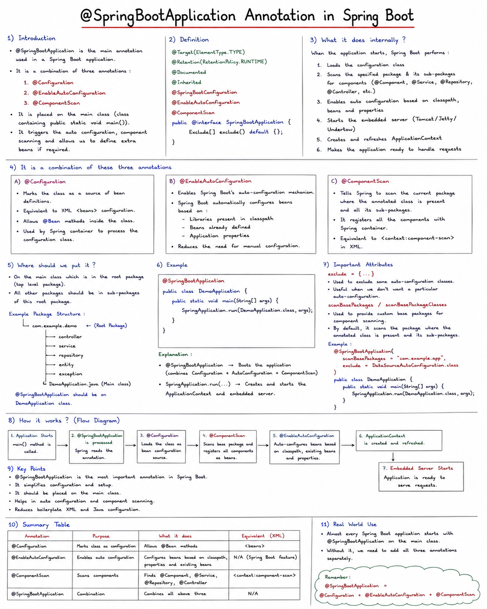

        

To exclude a field from JSON output in a Java REST response, you'll typically use **Jackson annotations** (Jackson is the JSON library Spring Boot uses by default).

## `@JsonIgnore` — the main one

Place it directly on the field, getter, or setter you want to exclude:

```java
import com.fasterxml.jackson.annotation.JsonIgnore;

public class User {
    private Long id;
    private String username;

    @JsonIgnore
    private String password;

    // getters and setters
}
```

**Output:**
```json
{
  "id": 1,
  "username": "john_doe"
}
```

`password` is completely excluded — never serialized (Java → JSON) or deserialized (JSON → Java).

## Other useful variations

### `@JsonIgnoreProperties` — ignore multiple fields at the class level
Useful when you don't want to annotate each field individually, or need to ignore fields not directly declared in the class (e.g., inherited or dynamically added).

```java
@JsonIgnoreProperties({"password", "internalNotes"})
public class User {
    private Long id;
    private String username;
    private String password;
    private String internalNotes;
}
```

### `@JsonProperty(access = Access.WRITE_ONLY)` — accept on input, hide on output
This is the **right choice for passwords** — you want the client to be able to *send* a password when creating a user, but never *receive* it back in a response.

```java
import com.fasterxml.jackson.annotation.JsonProperty;

public class User {
    private Long id;
    private String username;

    @JsonProperty(access = JsonProperty.Access.WRITE_ONLY)
    private String password;
}
```

- Incoming JSON (POST request body) → `password` is accepted and deserialized ✅
- Outgoing JSON (response) → `password` is hidden ❌

There's also the reverse, `Access.READ_ONLY`, for fields that should appear in output but never be accepted as input (like a server-generated `id` or `createdAt`).

### `@JsonIgnoreType` — ignore an entire type wherever it's used
```java
@JsonIgnoreType
public class InternalMetadata { ... }
```
Any field of this type is ignored automatically, everywhere it appears.

## Quick comparison

| Annotation | Behavior |
|---|---|
| `@JsonIgnore` | Field excluded in **both** directions (serialize + deserialize) |
| `@JsonProperty(access = WRITE_ONLY)` | Field accepted on input, hidden on output |
| `@JsonProperty(access = READ_ONLY)` | Field shown on output, ignored on input |
| `@JsonIgnoreProperties({"a","b"})` | Class-level, ignore multiple named fields |

## Example in a Spring Boot controller

```java
@RestController
public class UserController {

    @GetMapping("/users/{id}")
    public User getUser(@PathVariable Long id) {
        return userService.findById(id); // password field auto-excluded from JSON
    }
}
```

You don't need to do anything extra in the controller — Jackson (via Spring's `HttpMessageConverter`) automatically applies these annotations when serializing the object to JSON.

## One caveat

These are **Jackson** annotations (`com.fasterxml.jackson.annotation.*`), which is the default in Spring Boot. If your project is using a different JSON library (like Gson), the annotation would be different (`@Expose` / `transient` for Gson). Since Spring Boot uses Jackson by default (via `spring-boot-starter-web`), `@JsonIgnore` is almost always the right answer.

`@ConditionalOn...` annotations are Spring Boot's mechanism for **turning beans and configuration classes on or off based on the environment** — the classpath, existing beans, properties, OS, and more. They're the actual engine behind everything auto-configuration does.

## The root: `@Conditional`

All of these annotations are built on top of Spring Framework's base `@Conditional` annotation:

```java
@Conditional(MyCustomCondition.class)
@Bean
public MyBean myBean() { ... }
```

`@Conditional` takes a class implementing the `Condition` interface:

```java
public interface Condition {
    boolean matches(ConditionContext context, AnnotatedTypeMetadata metadata);
}
```

If `matches()` returns `true`, the bean/configuration is registered. If `false`, Spring skips it entirely — as if it were never declared.

Spring Boot builds a whole family of ready-made, purpose-specific conditions on top of this base, so you rarely write raw `Condition` classes yourself.

## The main `@ConditionalOn...` annotations

### 1. `@ConditionalOnClass` / `@ConditionalOnMissingClass`
Checks whether a class is present (or absent) **on the classpath**.

```java
@Configuration
@ConditionalOnClass(DataSource.class)
public class DataSourceAutoConfiguration { ... }
```

This only activates if `javax.sql.DataSource` can be found on the classpath — i.e., if you've pulled in a JDBC-related dependency.

### 2. `@ConditionalOnBean` / `@ConditionalOnMissingBean`
Checks whether a bean of a given type **already exists** (or doesn't) in the application context.

```java
@Bean
@ConditionalOnMissingBean
public DataSource dataSource() {
    return new HikariDataSource();
}
```

This is the key to Spring Boot's "sensible defaults, but overridable" philosophy: Spring Boot provides a default bean, guarded by `@ConditionalOnMissingBean`. If **you** define your own `DataSource` bean, Spring Boot's default politely backs off and yours is used instead.

### 3. `@ConditionalOnProperty`
Checks values in `application.properties` / `application.yml`.

```java
@Bean
@ConditionalOnProperty(name = "feature.cache.enabled", havingValue = "true", matchIfMissing = false)
public CacheManager cacheManager() { ... }
```

```properties
feature.cache.enabled=true
```

This lets you toggle features on/off purely through configuration files, no code changes needed.

### 4. `@ConditionalOnWebApplication` / `@ConditionalOnNotWebApplication`
Checks whether the app is running as a web application (servlet-based or reactive) vs. a plain non-web app.

```java
@Configuration
@ConditionalOnWebApplication
public class WebMvcAutoConfiguration { ... }
```

### 5. `@ConditionalOnResource`
Checks whether a specific resource file (like a config file) exists on the classpath.

```java
@ConditionalOnResource(resources = "classpath:custom-config.xml")
```

### 6. `@ConditionalOnExpression`
The most flexible — evaluates a SpEL (Spring Expression Language) expression.

```java
@ConditionalOnExpression("${feature.enabled:false} and ${feature.premium:false}")
```

### 7. `@ConditionalOnJava`
Checks the running JVM version.

```java
@ConditionalOnJava(JavaVersion.SEVENTEEN)
```

### 8. `@ConditionalOnSingleCandidate`
Like `@ConditionalOnBean`, but specifically checks that there's exactly **one** candidate bean (or one marked `@Primary`) — useful for auto-configuring something that wraps a single dependency.

## How they combine — a real example

Here's a simplified real pattern used by Spring Boot for the embedded Tomcat server:

```java
@Configuration
@ConditionalOnClass({ Servlet.class, Tomcat.class })
@ConditionalOnMissingBean(value = ServletWebServerFactory.class)
@ConditionalOnWebApplication(type = Type.SERVLET)
public class TomcatServletWebServerFactoryConfiguration {

    @Bean
    public TomcatServletWebServerFactory tomcatServletWebServerFactory() {
        return new TomcatServletWebServerFactory();
    }
}
```

Reading this top to bottom, Spring Boot activates embedded Tomcat only if:
1. Both `Servlet` and `Tomcat` classes exist on the classpath (i.e., you added `spring-boot-starter-web`, which pulls in `spring-boot-starter-tomcat`)
2. You haven't already defined your own `ServletWebServerFactory` bean (e.g., if you swapped in Jetty or Undertow instead)
3. This is a servlet-based web application (not reactive/WebFlux, not a CLI app)

All three conditions must pass simultaneously — `@Conditional` annotations stack with **AND** logic when multiple are present on the same class/method.

## Writing your own conditional bean

You can use these annotations in your own code too, not just rely on Spring Boot's built-in auto-configuration:

```java
@Configuration
public class NotificationConfig {

    @Bean
    @ConditionalOnProperty(name = "notification.provider", havingValue = "email")
    public NotificationService emailNotificationService() {
        return new EmailNotificationService();
    }

    @Bean
    @ConditionalOnProperty(name = "notification.provider", havingValue = "sms")
    public NotificationService smsNotificationService() {
        return new SmsNotificationService();
    }
}
```

```properties
notification.provider=email
```

Now, switching providers is just a one-line property change, no code edits or redeployment logic needed — Spring picks the right bean at startup based on the condition.

## Debugging conditionals

As mentioned earlier, run with `--debug` (or set `debug=true` in `application.properties`) to get the **Conditions Evaluation Report**, showing exactly why each conditional bean was included or excluded — extremely useful when auto-configuration doesn't behave as expected.


## What is the classpath?

The **classpath** is the list of locations (folders and JAR files) that the Java Virtual Machine (JVM) searches through to find **`.class` files** (compiled Java bytecode) when it needs to load a class at runtime or compile time.

Think of it like Java's version of a search path — similar to how your operating system's `PATH` variable tells the shell where to look for executable programs. The classpath tells the JVM: "here are all the places where compiled classes and libraries might live."

## Why it exists

When you write:

```java
import org.springframework.web.bind.annotation.GetMapping;
```

The JVM doesn't magically know where `GetMapping.class` is. It needs to search through the classpath, find a JAR file that contains that class, load it, and make it available to your program.

## What's actually on the classpath

For a typical Spring Boot app, the classpath includes:

1. **Your own compiled code** — e.g., `target/classes/` (all your `.java` files compiled into `.class` files)
2. **Every dependency JAR** your project pulls in — Spring, Jackson, Hibernate, H2 database driver, etc., usually stored in your local Maven/Gradle cache (`~/.m2` or `~/.gradle`)
3. **Resource files** — `application.properties`, static files, etc. (in `src/main/resources`)

## A simple analogy

Imagine your classpath is a set of folders on a bookshelf:

```
📁 target/classes/          → your own compiled classes
📁 spring-web-6.1.0.jar     → contains GetMapping, RestController, etc.
📁 spring-core-6.1.0.jar    → contains core Spring classes
📁 jackson-databind.jar     → contains JSON serialization classes
📁 h2-2.2.224.jar           → contains the H2 database driver
```

When your code says `import com.fasterxml.jackson.databind.ObjectMapper;`, the JVM checks each of these locations in order until it finds a class matching that fully-qualified name.

## How it connects back to `@ConditionalOnClass`

This is exactly why `@ConditionalOnClass(DataSource.class)` matters. Spring Boot's auto-configuration is literally asking: *"Does a class named `javax.sql.DataSource` exist somewhere on the classpath?"*

- If you added `spring-boot-starter-data-jpa` as a dependency → the JDBC/JPA JARs are pulled onto the classpath → `DataSource.class` is found → the condition passes → `DataSourceAutoConfiguration` activates.
- If you never added that dependency → `DataSource.class` isn't found anywhere → the condition fails → Spring Boot skips that auto-configuration entirely, silently.

So "the classpath" is really just **"the complete set of JARs/classes your project has pulled in and can see."** Auto-configuration works by inspecting this set and reacting to what's present or absent.

## How you control the classpath

You don't manage it directly — a build tool does it for you:

**Maven (`pom.xml`)**:
```xml
<dependency>
    <groupId>org.springframework.boot</groupId>
    <artifactId>spring-boot-starter-data-jpa</artifactId>
</dependency>
```

**Gradle (`build.gradle`)**:
```groovy
implementation 'org.springframework.boot:spring-boot-starter-data-jpa'
```

Adding either line downloads that library (and its transitive dependencies) and adds all of them to the classpath. Remove the dependency, and its classes disappear from the classpath — which is exactly what flips `@ConditionalOnClass` checks from "match" to "no match."

---


Let's cover both — how auto-configuration resolves conditional beans, and a minimal working project structure.

## How `@EnableAutoConfiguration` actually works

**Step 1: Discovery**
Spring Boot doesn't scan your classpath blindly. Instead, auto-configuration classes register themselves via a file bundled inside `spring-boot-autoconfigure.jar`:

```
META-INF/spring/org.springframework.boot.autoconfigure.AutoConfiguration.imports
```

This is just a plain text file listing fully-qualified class names, one per line:

```
org.springframework.boot.autoconfigure.web.servlet.WebMvcAutoConfiguration
org.springframework.boot.autoconfigure.jdbc.DataSourceAutoConfiguration
org.springframework.boot.autoconfigure.orm.jpa.HibernateJpaAutoConfiguration
...
```

At startup, Spring Boot reads this file and considers loading **every one** of these as a `@Configuration` class candidate.

**Step 2: Conditional filtering**
Each auto-configuration class is guarded by condition annotations so it only activates when appropriate:

```java
@Configuration
@ConditionalOnClass(DataSource.class)          // only if this class is on the classpath
@ConditionalOnMissingBean(DataSource.class)    // only if you haven't defined your own
@EnableConfigurationProperties(DataSourceProperties.class)
public class DataSourceAutoConfiguration {

    @Bean
    @ConditionalOnProperty(prefix = "spring.datasource", name = "url")
    public DataSource dataSource(DataSourceProperties properties) {
        return properties.initializeDataSourceBuilder().build();
    }
}
```

Common conditions:

| Annotation | Activates when... |
|---|---|
| `@ConditionalOnClass` | a given class is present on the classpath |
| `@ConditionalOnMissingClass` | a given class is **absent** |
| `@ConditionalOnBean` | a specific bean already exists in the context |
| `@ConditionalOnMissingBean` | a specific bean does **not** exist (lets you override defaults) |
| `@ConditionalOnProperty` | a property in `application.properties`/`.yml` matches |
| `@ConditionalOnWebApplication` | the app is a web application |

**Step 3: Ordering & backing off**
If you define your own bean of the same type, `@ConditionalOnMissingBean` makes Spring Boot's auto-configured version quietly back off — your bean wins. This is why you can override almost anything just by declaring a `@Bean` yourself.

**Debugging it**: run your app with `--debug`, and Spring Boot prints an **auto-configuration report** showing exactly which configurations were applied and which were skipped (with reasons like "did not match — required class was not found").

```
============================
CONDITIONS EVALUATION REPORT
============================
Positive matches:
-----------------
   DataSourceAutoConfiguration matched:
      - @ConditionalOnClass found required class 'javax.sql.DataSource'

Negative matches:
-----------------
   MongoAutoConfiguration:
      Did not match:
         - @ConditionalOnClass did not find required class 'com.mongodb.client.MongoClient'
```

---

## Minimal working project structure

```
myapp/
├── pom.xml
└── src/
    └── main/
        ├── java/
        │   └── com/example/myapp/
        │       ├── MyApplication.java
        │       ├── controller/
        │       │   └── HelloController.java
        │       ├── service/
        │       │   └── GreetingService.java
        │       └── repository/
        │           └── UserRepository.java
        └── resources/
            └── application.properties
```

**`pom.xml`** (key part):
```xml
<parent>
    <groupId>org.springframework.boot</groupId>
    <artifactId>spring-boot-starter-parent</artifactId>
    <version>3.3.0</version>
</parent>

<dependencies>
    <dependency>
        <groupId>org.springframework.boot</groupId>
        <artifactId>spring-boot-starter-web</artifactId>
    </dependency>
</dependencies>
```

**`MyApplication.java`**
```java
package com.example.myapp;

import org.springframework.boot.SpringApplication;
import org.springframework.boot.autoconfigure.SpringBootApplication;

@SpringBootApplication
public class MyApplication {
    public static void main(String[] args) {
        SpringApplication.run(MyApplication.class, args);
    }
}
```

**`controller/HelloController.java`**
```java
package com.example.myapp.controller;

import org.springframework.web.bind.annotation.GetMapping;
import org.springframework.web.bind.annotation.RestController;

@RestController
public class HelloController {

    @GetMapping("/hello")
    public String hello() {
        return "Hello, Spring Boot!";
    }
}
```

Because `MyApplication` sits at `com.example.myapp` (the root package), `@ComponentScan` automatically picks up `HelloController` in the `controller` sub-package — no extra configuration needed. Run it, and `spring-boot-starter-web` on the classpath triggers `WebMvcAutoConfiguration` to spin up an embedded Tomcat on port 8080 automatically, hitting `/hello` returns the string.

