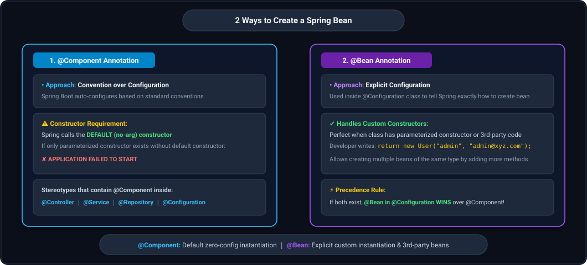
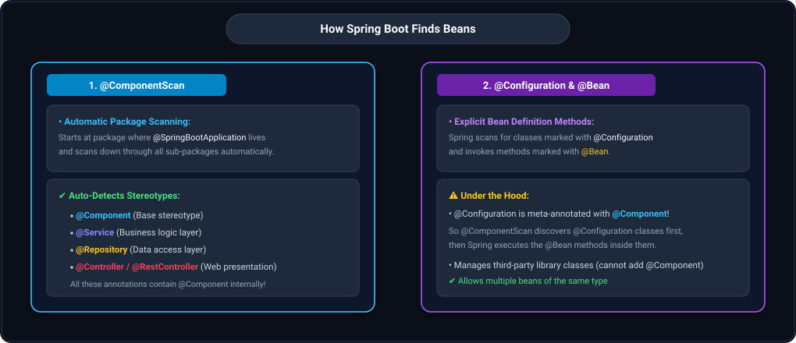
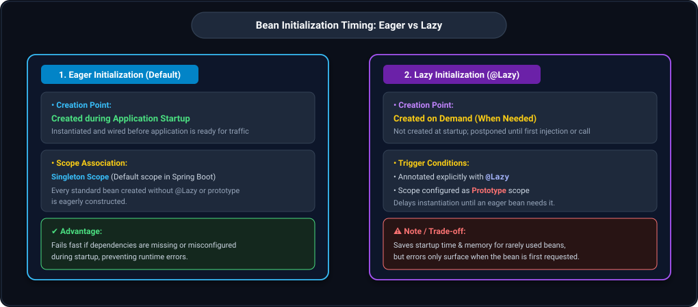
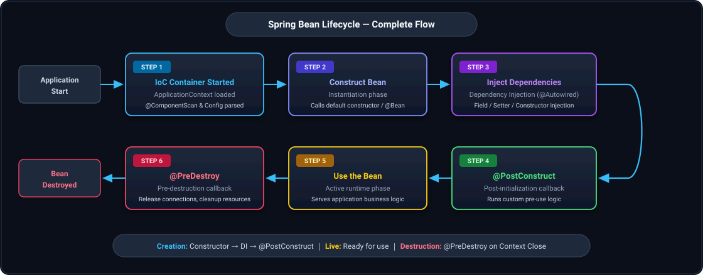
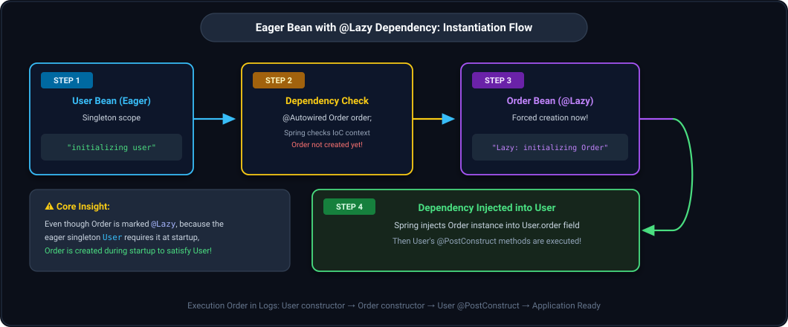
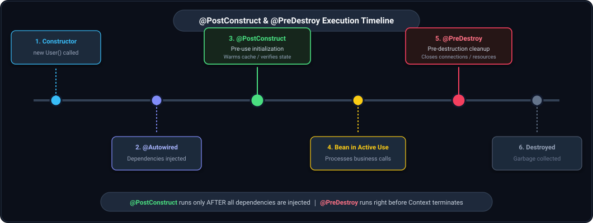

## 1. What is a Bean & IoC Container?

- In simple terms: **A Bean is a Java Object that is instantiated, assembled, and managed by the Spring IoC Container.**
- **IoC Container (Inversion of Control Container):**
  - The core engine in Spring Boot responsible for managing the complete lifecycle of beans.
  - It creates the objects, wires their dependencies together, configures them, and manages their destruction.
  - In Spring applications, `ApplicationContext` (and specifically `WebApplicationContext` in web applications) serves as the primary implementation of the IoC container.

---

## 2. Two Ways to Create a Bean

There are two primary ways to create and register a Bean in Spring Boot:
1. **Using `@Component` Annotation** (Automatic / Convention-over-Configuration)
2. **Using `@Bean` Annotation inside `@Configuration`** (Explicit / Programmatic)



---

## 3. Creating Beans with @Component (Convention over Configuration)

- `@Component` follows the **"Convention over Configuration"** philosophy.
- Spring Boot auto-configures and instantiates the bean based on standard conventions, eliminating the need for explicit XML or Java configuration classes.
- **Stereotype Annotations:**
  - Stereotypes like `@Controller`, `@RestController`, `@Service`, and `@Repository` all have `@Component` meta-annotated inside them.
  - Therefore, any class annotated with `@Service`, `@Repository`, `@Controller`, or `@RestController` is automatically recognized by Spring as a `@Component` bean.

```text
@Controller, @Service, @Repository, @Configuration
               │
               ▼
All internally contain @Component!
```

### Constructor Mechanism of `@Component`
> **Critical Rule:**
> **`@Component` relies on the DEFAULT (no-argument) constructor to instantiate the object!**
> Spring Boot internally calls `new ClassName()` to create an instance.

**Example Class:**
```java
package com.conceptandcoding.learningspringboot;

import org.springframework.stereotype.Component;

@Component
public class User {

    String username;
    String email;

    // Default no-argument constructor is provided by Java compiler automatically
    public String getUsername() { return username; }
    public void setUsername(String username) { this.username = username; }
    public String getEmail() { return email; }
    public void setEmail(String email) { this.email = email; }
}
```
- During startup, Spring Boot uses auto-configuration and invokes `new User()` to instantiate the bean inside the IoC container.

---

## 4. Parameterized Constructor vs. @Bean in @Configuration

### What happens when we provide our own Constructor?
If you define a custom parameterized constructor on a `@Component` class and do not provide a no-arg constructor:

```java
@Component
public class User {

    String username;
    String email;

    // Custom parameterized constructor
    public User(String username, String email) {
        this.username = username;
        this.email = email;
    }

    public String getUsername() { return username; }
    public void setUsername(String username) { this.username = username; }
    public String getEmail() { return email; }
    public void setEmail(String email) { this.email = email; }
}
```

**Result upon running the application:**
```text
***************************
APPLICATION FAILED TO START
***************************
Parameter 0 of constructor in com.conceptandcoding.learningspringboot.User 
required a bean of type 'java.lang.String' that could not be found.
```

### Why does this failure happen?
1. Once a custom constructor is defined, the Java compiler **no longer provides the default no-argument constructor**.
2. `@Component` requires a default constructor (or resolvable bean parameters) to instantiate the class automatically.
3. Spring Boot does not know what values or beans to pass into the `username` and `email` constructor parameters.

---

### Solution: Using `@Bean` in `@Configuration`
When custom constructor arguments or external configuration details are required, **`@Bean` comes into the picture**.

- Remove `@Component` from the domain class.
- Create an `@Configuration` class and declare a method annotated with `@Bean`.
- Inside the `@Bean` method, explicitly write the instantiation logic, telling Spring Boot exactly how to construct the object.

**1. Domain Class (No `@Component`):**
```java
public class User {

    String username;
    String email;

    public User(String username, String email) {
        this.username = username;
        this.email = email;
    }

    public String getUsername() { return username; }
    public void setUsername(String username) { this.username = username; }
    public String getEmail() { return email; }
    public void setEmail(String email) { this.email = email; }
}
```

**2. Configuration Class with `@Bean`:**
```java
package com.conceptandcoding.learningspringboot;

import org.springframework.context.annotation.Bean;
import org.springframework.context.annotation.Configuration;

@Configuration
public class AppConfig {

    @Bean
    public User createUserBean() {
        // Explicitly telling Spring how to create the bean and what arguments to supply
        return new User("defaultusername", "defaultemail");
    }
}
```

---

## 5. Overriding & Precedence: @Bean vs. @Component

### What happens if you have both `@Component` and `@Bean`?
Suppose a class has `@Component` with a default constructor, AND there is also a `@Bean` method inside an `@Configuration` class returning an instance of that same class:

> **Precedence Rule:**
> **`@Bean` in `@Configuration` is given preference!**
> Spring Boot prioritizes explicit developer configuration over auto-configured convention defaults.
> The bean will be instantiated according to the explicit `@Bean` definition.

### Creating Multiple Beans of the Same Type with `@Bean`
With `@Component`, only one bean definition is generated per class. With `@Bean`, you can register multiple distinct beans of the same type by declaring multiple `@Bean` methods:

```java
@Configuration
public class AppConfig {

    @Bean
    public User createUserBean() {
        return new User("defaultusername", "defaultemail");
    }

    @Bean
    public User createAnotherUserBean() {
        return new User("anotherUsername", "anotheremail");
    }
}
```
- Spring creates **two distinct beans** of type `User` in the IoC container.
- We can define as many beans as needed by adding more `@Bean` methods.

---

## 6. How Spring Boot Finds Beans

Spring Boot discovers beans using two core mechanisms:



### 1. Using `@ComponentScan`
- `@ComponentScan` tells Spring to scan the base package and all its sub-packages for classes annotated with `@Component`, `@Service`, `@Repository`, `@Controller`, and `@RestController`.
- By default, `@SpringBootApplication` includes `@ComponentScan` and automatically scans the package where the main class resides and all descendant packages.

```java
@SpringBootApplication
@ComponentScan(basePackages = "com.conceptandcoding.learningspringboot")
public class SpringbootApplication {
    public static void main(String[] args) {
        SpringApplication.run(SpringbootApplication.class, args);
    }
}
```

### 2. Through `@Configuration` Classes
- Spring explicitly discovers classes annotated with `@Configuration` and processes all methods annotated with `@Bean`.
- **Note:** `@Configuration` is itself meta-annotated with `@Component`!
- Therefore, `@ComponentScan` discovers `@Configuration` classes, and Spring then processes the `@Bean` definitions within them.

---

## 7. Bean Initialization Timing: Eager vs. Lazy (@Lazy)

At what time do beans get created inside the Spring IoC Container?



### 1. Eager Initialization (Default)
- Beans are created **during application startup**.
- **Default Scope:** In Spring Boot, the default bean scope is **Singleton**.
- **All Singleton beans are initialized eagerly by default!**
- Before the embedded Tomcat server finishes startup and is ready to accept incoming requests, all eager singleton beans have already been constructed and injected.

### 2. Lazy Initialization (`@Lazy`)
- Beans are created **on-demand (lazily)** — only when they are actually requested or injected into another active bean.
- **Triggers for Lazy Initialization:**
  1. Adding the `@Lazy` annotation on the bean class or `@Bean` method.
  2. Prototype scoped beans (which are created each time they are requested).

```java
package com.conceptandcoding.learningspringboot;

import org.springframework.context.annotation.Lazy;
import org.springframework.stereotype.Component;

@Lazy
@Component
public class Order {

    public Order() {
        System.out.println("initializing Order");
    }
}
```

---

## 8. Complete Bean Lifecycle (6-Step Lifecycle Flow)

The lifecycle of a Spring Bean consists of 6 sequential phases from application bootstrap to shutdown:



```text
┌───────────────────┐      ┌────────────────────────┐      ┌──────────────────┐
│ Application Start │ ───► │   IoC Container Start  │ ───► │  Construct Bean  │
│                   │      │ (Configuration Loaded) │      │  (Instantiation) │
└───────────────────┘      └────────────────────────┘      └──────────────────┘
                                                                     │
                                                                     ▼
┌───────────────────┐      ┌────────────────────────┐      ┌──────────────────┐
│  @PostConstruct   │ ◄─── │  Use the Bean in App   │ ◄─── │Inject Dependency │
│  (Initialization) │      │   (Active Runtime)     │      │   (@Autowired)   │
└───────────────────┘      └────────────────────────┘      └──────────────────┘
         │
         ▼
┌───────────────────┐      ┌────────────────────────┐
│    @PreDestroy    │ ───► │     Bean Destroyed     │
│ (Cleanup Method)  │      │                        │
└───────────────────┘      └────────────────────────┘
```

---

### Step 1: Application Start & IoC Container Started
- During application startup, Spring Boot invokes and bootstraps the IoC Container (`ApplicationContext`).
- Spring loads `WebApplicationContext`, reads configuration classes, and executes `@ComponentScan` to discover all classes to instantiate.

**Console Startup Log Evidence:**
```text
main] o.s.b.w.embedded.tomcat.TomcatWebServer  : Tomcat initialized with port 8080 (http)
main] o.apache.catalina.core.StandardService   : Starting service [Tomcat]
main] o.apache.catalina.core.StandardEngine    : Starting Servlet engine: [Apache Tomcat/10.1.19]
main] o.a.c.c.C.[Tomcat].[localhost].[/]       : Initializing Spring embedded WebApplicationContext  <-- Invoking IoC Container
main] w.s.c.ServletWebServerApplicationContext : Root WebApplicationContext: initialization completed in 419 ms
main] o.s.b.w.embedded.tomcat.TomcatWebServer  : Tomcat started on port 8080 (http) with context path ''
main] c.c.l.SpringbootApplication              : Started SpringbootApplication in 0.771 seconds (process running for 0.946)
```

---

### Step 2: Construct the Bean (Instantiation)
- Spring allocates memory and invokes the constructor of the bean.
- Default scope is Singleton, so bean construction occurs eagerly during startup.

```java
@Component
public class User {

    public User() {
        System.out.println("initializing user");
    }
}
```

**Console Startup Log Evidence:**
```text
main] o.a.c.c.C.[Tomcat].[localhost].[/]       : Initializing Spring embedded WebApplicationContext
initializing user                                                                                      <-- Bean Object Created!
main] w.s.c.ServletWebServerApplicationContext : Root WebApplicationContext: initialization completed in 412 ms
main] o.s.b.w.embedded.tomcat.TomcatWebServer  : Tomcat started on port 8080 (http) with context path ''
main] c.c.l.SpringbootApplication              : Started SpringbootApplication in 0.756 seconds (process running for 0.927)
```

---

### Step 3: Inject Dependencies into Constructed Bean (@Autowired)
- Once the bean is constructed, Spring inspects its fields, setters, or constructor for `@Autowired` annotations.
- Spring searches the IoC container for a matching bean type. If found, it injects it.
- **Different Injection Methods:**
  - Constructor Injection
  - Setter Injection
  - Field Injection

#### What if a Dependency is `@Lazy` Initialized?
Consider an eager bean `User` that depends on `Order`, where `Order` is marked with `@Lazy`:



```java
@Component
public class User {

    @Autowired
    Order order;

    public User() {
        System.out.println("initializing user");
    }
}

@Lazy
@Component
public class Order {

    public Order() {
        System.out.println("Lazy: initializing Order");
    }
}
```

**Console Startup Log Evidence:**
```text
main] o.a.c.c.C.[Tomcat].[localhost].[/]       : Initializing Spring embedded WebApplicationContext
initializing user                                                                                      <-- 1. User created by default constructor
Lazy: initializing Order                                                                               <-- 2. Order created because User requires it!
main] w.s.c.ServletWebServerApplicationContext : Root WebApplicationContext: initialization completed in 416 ms
main] o.s.b.w.embedded.tomcat.TomcatWebServer  : Tomcat started on port 8080 (http) with context path ''
main] c.c.l.SpringbootApplication              : Started SpringbootApplication in 0.76 seconds (process running for 0.929)
```

> **Key Takeaway:**
> Even though `Order` is annotated with `@Lazy`, because the eager singleton `User` requires it at startup, **`Order` is instantiated at startup during User's dependency injection phase!**
> 1. `User` is constructed first via its default constructor.
> 2. Spring checks for `Order`. Since it does not exist yet, Spring creates `Order` immediately.
> 3. Spring injects the `Order` bean into `User`.

---

### Step 4: @PostConstruct (Post-Initialization Callback)
- Runs **after bean construction AND after all dependencies have been injected**.
- Used to execute initialization logic before the bean is exposed to the application (e.g., establishing database connections, loading initial cache, validating required configuration).

```java
@Component
public class User {

    @Autowired
    Order order;

    @PostConstruct
    public void initialize() {
        System.out.println("Bean has been constructed and dependencies have been injected");
    }

    public User() {
        System.out.println("initializing user");
    }
}
```

**Console Startup Log Evidence:**
```text
main] o.a.c.c.C.[Tomcat].[localhost].[/]       : Initializing Spring embedded WebApplicationContext
initializing user                                                                                      <-- 1. Constructor
Lazy: initializing Order                                                                               <-- 2. Dependency created & injected
Bean has been constructed and dependencies have been injected                                          <-- 3. @PostConstruct executed!
main] w.s.c.ServletWebServerApplicationContext : Root WebApplicationContext: initialization completed in 417 ms
```

---

### Step 5: Use the Bean in Your Application
- The bean is fully initialized, dependency-wired, and ready for active runtime use.
- It resides in the `ApplicationContext` serving client requests, executing business logic, and handling service calls.

---

### Step 6: @PreDestroy (Pre-Destruction Cleanup Callback)
- Runs **right before the bean is destroyed** when the Spring `ApplicationContext` is closing.
- Used to release resources cleanly (e.g., closing file streams, shutting down background thread pools, closing active socket/database connections).



#### Verifying `@PreDestroy` with `context.close()`:
To explicitly observe `@PreDestroy` in action, capture the `ConfigurableApplicationContext` in `main()` and close it:

```java
@SpringBootApplication
public class SpringbootApplication {

    public static void main(String[] args) {
        ConfigurableApplicationContext context = SpringApplication.run(SpringbootApplication.class, args);
        // Explicitly closing the context triggers pre-destroy lifecycle methods
        context.close();
    }
}
```

**Bean with `@PostConstruct` and `@PreDestroy`:**
```java
@Component
public class User {

    @PostConstruct
    public void initialize() {
        System.out.println("Post Construct initiated");
    }

    @PreDestroy
    public void preDestroy() {
        System.out.println("Bean is about to destory, in PreDestoryMethod");
    }

    public User() {
        System.out.println("initializing user");
    }
}
```

**Console Execution Log Evidence:**
```text
initializing user                                                                                      <-- 1. Construction
Post Construct initiated                                                                               <-- 2. @PostConstruct
main] o.s.b.w.embedded.tomcat.TomcatWebServer  : Tomcat started on port 8080 (http) with context path ''
main] c.c.l.SpringbootApplication              : Started SpringbootApplication in 0.764 seconds
Bean is about to destory, in PreDestoryMethod                                                          <-- 3. @PreDestroy on context.close()!
main] org.apache.tomcat.util.net.Acceptor      : The acceptor thread [http-nio-8080-Acceptor] did not stop cleanly
```

> **Destruction Mechanics:**
> - When `ApplicationContext` is closed, **before destroying any bean, Spring executes its `@PreDestroy` method**.
> - Once `@PreDestroy` finishes, every bean inside that context is destroyed and becomes eligible for garbage collection.

---

## 9. Summary of Key Annotations

| Annotation | Level | Phase | Primary Function |
|---|---|---|---|
| **`@Component`** | Class | Discovery & Creation | Marks class for auto-discovery; instantiated via default no-arg constructor |
| **`@Bean`** | Method | Creation & Configuration | Explicitly declares and configures a bean inside `@Configuration` |
| **`@Configuration`** | Class | Configuration | Declares a bean definition factory (internally meta-annotated with `@Component`) |
| **`@ComponentScan`** | Class | Discovery | Scans package hierarchies for `@Component` stereotypes |
| **`@Lazy`** | Class / Method | Timing | Defers bean instantiation until it is explicitly requested |
| **`@Autowired`** | Field / Method / Constructor | Dependency Injection | Injects required bean dependency into constructed bean |
| **`@PostConstruct`** | Method | Post-Initialization | Callback executed after constructor and after dependency injection |
| **`@PreDestroy`** | Method | Pre-Destruction | Callback executed right before context closes and bean is destroyed |
