## 1. What is Dependency Injection (DI)?

Dependency Injection is a software design pattern used to implement **Inversion of Control (IoC)**. It allows a class to remain independent of its dependencies by externalizing their creation and configuration.

### Core Objectives of Dependency Injection:
- **Decoupling:** Makes classes independent of their dependencies.
- **Removes Hardcoded Implementations:** Strips out hardcoded `new` instantiations of concrete classes and allows dependencies to be injected from an external container (the Spring IoC Container).
- **Enables S.O.L.I.D Principles:** Fulfills the **Dependency Inversion Principle (DIP)** and the **Single Responsibility Principle (SRP)**.

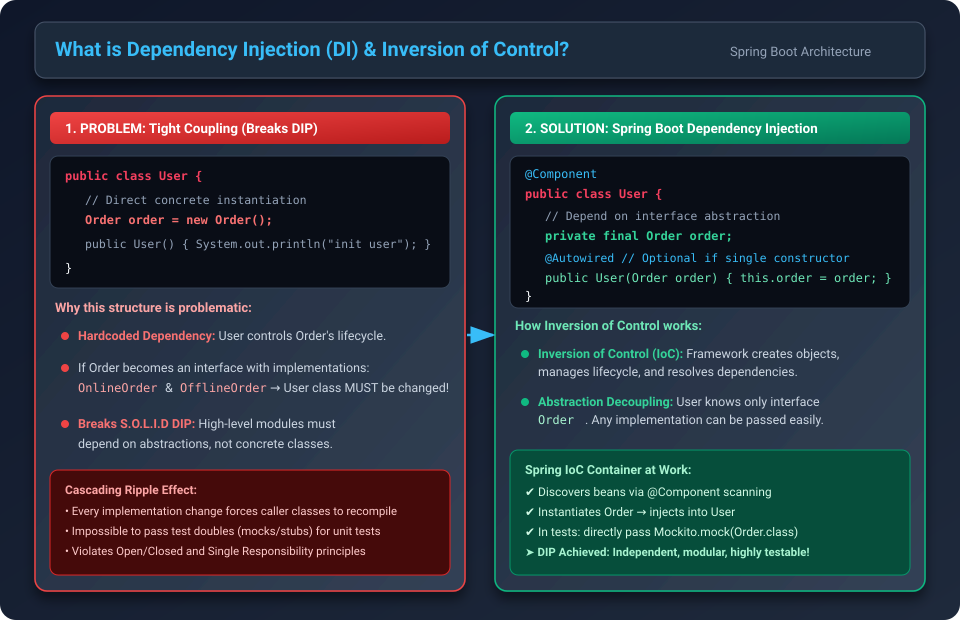

---

### Understanding the Problem: Tight Coupling

Consider the following naive implementation:

```java
public class User {
    // Tightly coupled concrete instantiation
    Order order = new Order();

    public User() {
        System.out.println("initializing user");
    }
}

public class Order {
    public Order() {
        System.out.println("initializing Order");
    }
}
```

#### Major Issues with this Structure:
1. **Both `User` and `Order` are Tightly Coupled:**
   The `User` class directly controls the creation lifecycle of `Order`.
2. **Fragile to Requirement Changes:**
   Suppose the `Order` creation logic changes in the future (e.g., `Order` becomes an `interface` implemented by multiple concrete classes):

   ```java
   public interface Order {
   }

   public class OnlineOrder implements Order {
   }

   public class OfflineOrder implements Order {
   }
   ```

   Now, the `User` class is forced to modify its internal source code:
   ```java
   public class User {
       // Code modified directly inside User class!
       Order order = new OnlineOrder();
   }
   ```
   Every time an implementation changes, caller classes must be modified and recompiled.

3. **Breaks the Dependency Inversion Principle (DIP) of S.O.L.I.D:**
   > **Dependency Inversion Principle (DIP):**
   > High-level modules should not depend on low-level modules; both should depend on abstractions (interfaces). Do **NOT** depend on concrete implementations.

   - `new OnlineOrder()` is a concrete class, violating DIP.
   - **The DIP Inversion Solution:** Pass the dependency through an external provider (like a constructor):
     ```java
     public class User {
         private Order order;

         // Whosoever uses User will create the concrete Order and pass it here!
         public User(Order orderObj) {
             this.order = orderObj;
         }
     }
     ```

---

### How Spring Boot Solves This: Automated Dependency Inversion (Inversion of Control) 

Through Dependency Injection

In Spring Boot, the framework takes over the creation and management of dependency beans:

```java
@Component
public class Order {
}

@Component
public class User {
    @Autowired
    private Order order;
}
```

- When `@Autowired` is used, Spring searches its ApplicationContext for a bean matching the required type (`Order`).
- If found, Spring injects that bean into `User`.
- **Key Takeaway:** *Dependency Injection is the mechanism through which Spring Boot fulfills the Dependency Inversion Principle.*

---

## 2. Spring Bean Lifecycle with Dependency Injection

To understand how and when dependencies are supplied, review the execution order within the Spring IoC Container:

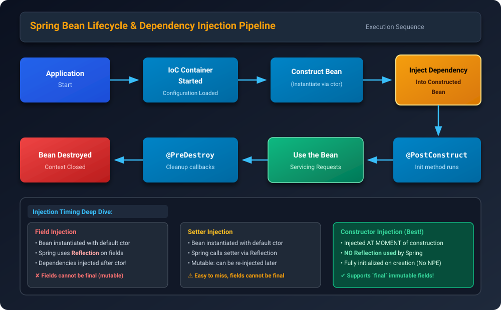

### Lifecycle Sequence:
1. **Application Start:** Spring Boot initializes and triggers context startup.
2. **IoC Container Started:** Bean definitions and application configuration are loaded into memory.
3. **Construct Bean:** Spring instantiates the bean instance (via constructor).
4. **Inject Dependency Into Constructed Bean:** Dependencies are resolved and injected into the bean (via Reflection for fields/setters, or during construction for constructor injection).
5. **`@PostConstruct` Callback:** Any method annotated with `@PostConstruct` is executed after all dependencies are injected.
6. **Use the Bean:** The fully initialized bean is active and serving application requests.
7. **`@PreDestroy` Callback:** Pre-destruction cleanup methods execute as the ApplicationContext begins shutting down.
8. **Bean Destroyed:** Resources are released and the bean is removed from memory.

---

## 3. The Three Ways to Inject Dependencies

Spring Boot provides three primary injection mechanisms:
1. **Field Injection**
2. **Setter Injection**
3. **Constructor Injection** *(Widely used and recommended in industry!)*

---

## 4. Field Injection: Mechanism & Drawbacks

In Field Injection, the dependency is injected directly into class fields using the `@Autowired` annotation.

```java
@Component
public class User {
    @Autowired
    private Order order;

    public User() {
        System.out.println("User initialized");
    }

    public void process() {
        order.process();
    }
}

@Component
@Lazy
public class Order {
    public Order() {
        System.out.println("order initialized");
    }
}
```

### Console Output During Startup:
```text
Tomcat initialized with port 8080 (http)
Starting service [Tomcat]
User initialized
order initialized
Started SpringbootApplication in 0.811 seconds
```

### How Spring Executes Field Injection Internally:
1. Spring calls the default zero-argument constructor (`new User()`).
2. Spring uses the **Java Reflection API** (`field.setAccessible(true)`) to iterate over private fields and inject the required bean.

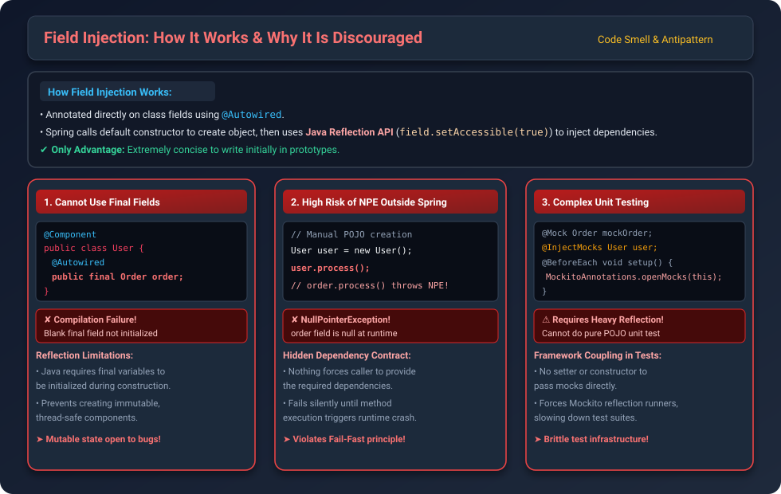

### Advantages:
- Extremely quick and concise to write in small scripts or rapid prototypes.

### Why Field Injection is Discouraged (3 Critical Drawbacks):

#### 1. Cannot be Used with Immutable (`final`) Fields:
```java
@Component
public class User {
    @Autowired
    public final Order order; // COMPILE ERROR: Variable 'order' might not have been initialized
}
```
- In Java, `final` fields must be assigned a value during object construction.
- Because Field Injection happens *after* the constructor completes via Reflection, fields cannot be made `final`.
- This leaves the bean mutable and breaks immutability and thread-safety standards.

#### 2. High Risk of `NullPointerException` (NPE) Outside Spring:
If someone instantiates `User` manually in code or tests:
```java
User userObj = new User(); // Default constructor called; order is still null!
userObj.process();         // THROWS NullPointerException at runtime!
```
- Spring does not enforce dependencies when instantiating the class outside the IoC Container.
- This creates a hidden contract: looking at the constructor `User()`, there is no indication that `Order` is mandatory.

#### 3. Difficult and Clunky Unit Testing:
Because there is no constructor or setter, you cannot pass mock dependencies directly:
```java
// Without reflection, this cannot set the mock order:
class UserTest {
    private Order orderMockObj;
    private User user;

    @BeforeEach
    public void setup() {
        this.orderMockObj = Mockito.mock(Order.class);
        this.user = new User();
        // How do we inject orderMockObj into user? No constructor or setter exists!
    }
}
```
To test this, you are forced to rely on Mockito's internal reflection engine:
```java
class UserTest {
    @Mock
    private Order orderMockObj;

    @InjectMocks
    private User user; // Uses Reflection to inject mock into private field

    @BeforeEach
    public void setup() {
        MockitoAnnotations.openMocks(this);
    }
}
```
- Requires framework-heavy reflection runners, slowing down test execution and coupling unit tests to reflection tools.

---

## 5. Setter Injection: Mechanism & Tradeoffs

In Setter Injection, dependencies are supplied through public setter methods annotated with `@Autowired`.

```java
@Component
public class User {
    private Order order;

    public User() {
        System.out.println("User initialized");
    }

    @Autowired
    public void setOrderDependency(Order order) {
        this.order = order;
    }
}
```

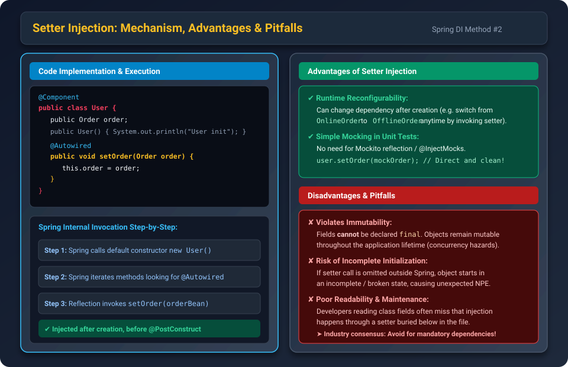

### Advantages:
1. **Reconfigurable at Runtime:**
   The dependency can be replaced after bean creation (e.g., dynamically switching from `OnlineOrder` to `OfflineOrder` by calling `setOrderDependency(...)`).
2. **Simplified Unit Testing:**
   Allows direct mock assignment in tests without reflection:
   ```java
   User user = new User();
   user.setOrderDependency(mockOrder); // Direct and clean
   ```

### Disadvantages:
1. **Fields Cannot Be Marked as `final`:**
   Because the setter is called after object construction, fields cannot be immutable.
2. **Risk of Incomplete State:**
   An object can exist in an uninitialized, broken state if the setter is not called.
3. **Poor Maintainability & Readability:**
   Developers inspecting class declarations often overlook setters placed at the bottom of the file.

---

## 6. Constructor Injection (Industry Standard)

In Constructor Injection, dependencies are supplied directly as arguments to the class constructor. **No reflection is used by Spring to perform injection.**

```java
@Component
public class User {
    private final Order order;

    // Single constructor: @Autowired is optional in Spring 4.3+
    public User(Order order) {
        this.order = order;
        System.out.println("User initialized");
    }
}
```

### Execution Log:
```text
Tomcat initialized with port 8080 (http)
order initialized
User initialized
Started SpringbootApplication in 0.759 seconds
```
Notice the order of initialization: `order` is initialized **first**, so it can be passed into `User`'s constructor!

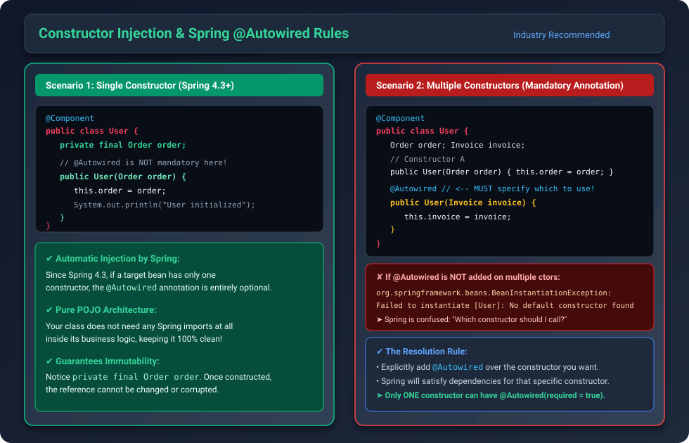

---

### Rules for `@Autowired` on Constructors

#### Rule 1: Single Constructor (Spring 4.3+)
If a Spring Bean has only **one** constructor, `@Autowired` is **not mandatory**. Spring will automatically detect and inject dependencies through that constructor.

#### Rule 2: Multiple Constructors
If a class has **more than one constructor**, `@Autowired` is **mandatory** on the constructor you want Spring to use.

If `@Autowired` is omitted when multiple constructors exist:
```java
@Component
public class User {
    Order order;
    Invoice invoice;

    public User(Order order) {
        this.order = order;
    }

    public User(Invoice invoice) {
        this.invoice = invoice;
    }
}
```
Spring Boot crashes at startup with:
```text
Caused by: org.springframework.beans.BeanInstantiationException: 
Failed to instantiate [com.conceptandcoding.learningspringboot.User]: No default constructor found
```
**The Fix:** Explicitly annotate the target constructor with `@Autowired`:
```java
@Autowired
public User(Invoice invoice) {
    this.invoice = invoice;
}
```

---

## 7. Why Constructor Injection is Recommended

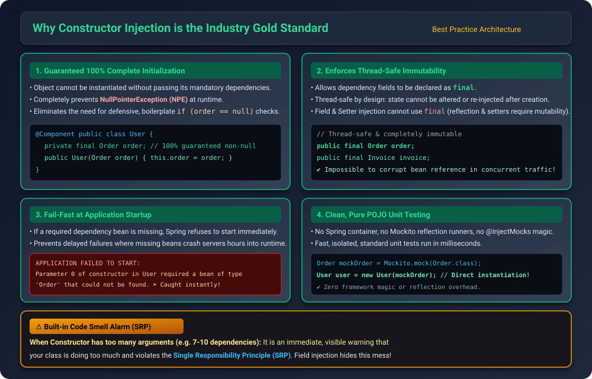

### The 4 Major Pillars:

1. **Guaranteed 100% Complete Initialization (Zero NPE):**
   - An object cannot be instantiated without passing its mandatory dependencies.
   - Prevents `NullPointerException` during runtime.
   - Eliminates redundant defensive `if (order == null)` checks.

2. **Full Immutability with `final` Fields:**
   - Dependency references can be declared `final`:
     ```java
     private final Order order;
     ```
   - Guarantees thread safety and ensures dependencies cannot be mutated after bean construction.

3. **Fail-Fast at Application Startup:**
   - If a required dependency bean is missing, the application fails to start immediately:
     ```text
     APPLICATION FAILED TO START
     Description:
     Parameter 0 of constructor in com.conceptandcoding.learningspringboot.User 
     required a bean of type 'Order' that could not be found.
     ```
   - Errors are caught at compile/boot time rather than surfacing as runtime bugs in production.

4. **Pure POJO Unit Testing:**
   - No Spring context, no Mockito reflection runners, no `@InjectMocks` magic needed.
   ```java
   Order mockOrder = Mockito.mock(Order.class);
   User user = new User(mockOrder); // Fast, direct POJO testing!
   ```

### Built-in Code Smell Alarm:
When a class has too many constructor arguments (e.g., 7–10 parameters), it is an immediate visible indicator that the class is doing too much and violates the **Single Responsibility Principle (SRP)**. Field injection dangerously masks this architectural flaw.

---

## 8. Common Dependency Injection Issues & Solutions

### Issue 1: Circular Dependency

A Circular Dependency occurs when Bean A depends on Bean B, and Bean B directly or indirectly depends on Bean A.

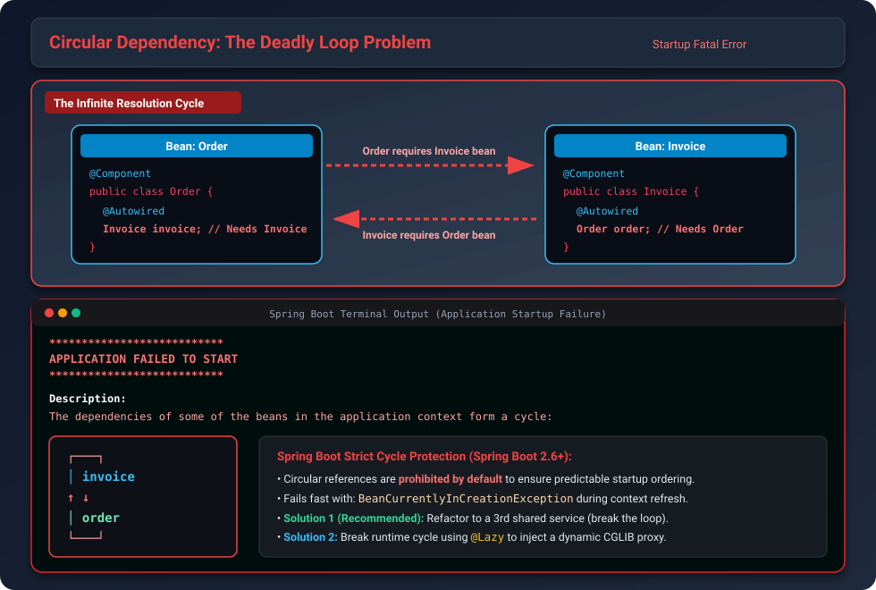

```java
@Component
public class Order {
    @Autowired
    private Invoice invoice;
}

@Component
public class Invoice {
    @Autowired
    private Order order;
}
```

#### Application Failure at Startup:
```text
***************************
APPLICATION FAILED TO START
***************************

Description:
The dependencies of some of the beans in the application context form a cycle:

┌───┐
|  invoice
↑   ↓
|  order
└───┘
```

> **Note:** Starting with Spring Boot 2.6, circular references are prohibited by default.

---

### Solutions to Circular Dependencies:

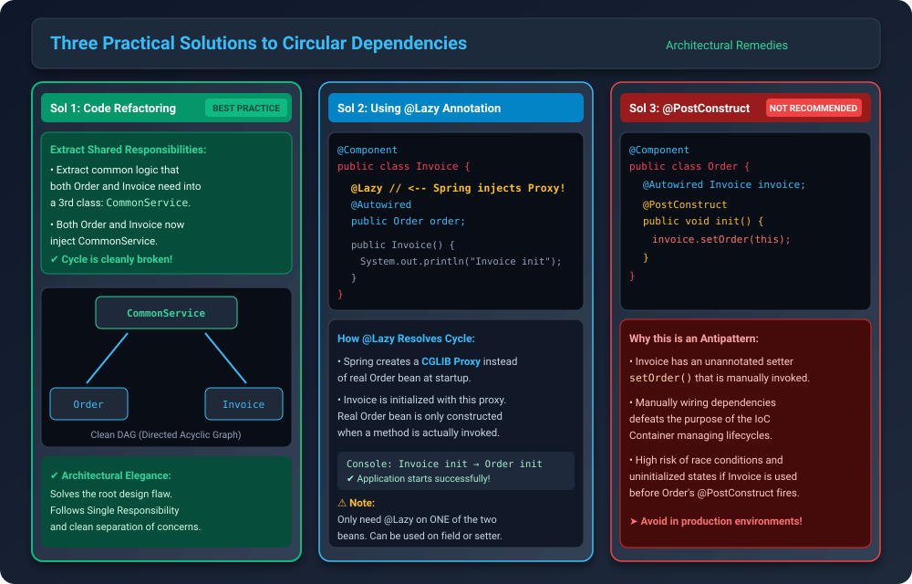

#### Solution 1: Code Refactoring (Recommended & Best Practice)
The presence of a circular dependency indicates poor architectural design. Extract the shared logic that both classes need into a separate third service:

```java
@Service
public class CommonOrderInvoiceService {
    // Shared functionality extracted here
}

@Component
public class Order {
    private final CommonOrderInvoiceService commonService;
    public Order(CommonOrderInvoiceService commonService) {
        this.commonService = commonService;
    }
}

@Component
public class Invoice {
    private final CommonOrderInvoiceService commonService;
    public Invoice(CommonOrderInvoiceService commonService) {
        this.commonService = commonService;
    }
}
```
This turns the circular dependency graph into a clean **Directed Acyclic Graph (DAG)**.

---

#### Solution 2: Using `@Lazy` on `@Autowired`
Annotate the dependency on one of the beans with `@Lazy`. Instead of instantiating the real bean immediately, Spring injects a **CGLIB dynamic proxy**, breaking the startup initialization loop:

```java
@Component
public class Order {
    @Autowired
    private Invoice invoice;
}

@Component
public class Invoice {
    @Lazy // Injects a proxy bean; resolves circular reference at startup
    @Autowired
    private Order order;
}
```

- When the application starts, Spring injects a proxy into `Invoice.order`.
- The real `Order` bean is only initialized when a method on `order` is actually called.

---

#### Solution 3: Using `@PostConstruct` (Not Recommended)
Manually setting dependencies inside a lifecycle callback:

```java
@Component
public class Order {
    @Autowired
    private Invoice invoice;

    @PostConstruct
    public void init() {
        invoice.setOrder(this); // Manual wiring
    }
}

@Component
public class Invoice {
    private Order order; // Not @Autowired

    public void setOrder(Order order) {
        this.order = order;
    }
}
```
*Why this is discouraged:* It bypasses the IoC container's automated wiring and reintroduces manual dependency management, risking race conditions.

---

### Issue 2: Unsatisfied Dependency (Bean Ambiguity)

When an interface has multiple implementing beans in the ApplicationContext, Spring cannot determine which bean to inject.

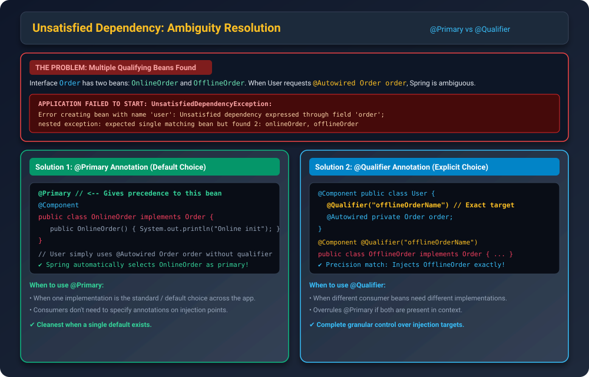

```java
public interface Order { }

@Component
public class OnlineOrder implements Order { }

@Component
public class OfflineOrder implements Order { }

@Component
public class User {
    @Autowired
    private Order order; // Which one should Spring inject?
}
```

#### Startup Exception:
```text
APPLICATION FAILED TO START
UnsatisfiedDependencyException: Error creating bean with name 'user': 
expected single matching bean but found 2: onlineOrder, offlineOrder
```

---

### Solutions for Unsatisfied Dependency:

#### Solution 1: `@Primary` Annotation
Mark one implementation with `@Primary`. Spring will pick it as the default bean whenever ambiguity arises:

```java
@Primary
@Component
public class OnlineOrder implements Order {
}

@Component
public class OfflineOrder implements Order {
}

@Component
public class User {
    @Autowired
    private Order order; // Spring automatically injects OnlineOrder
}
```

#### Solution 2: `@Qualifier` Annotation
Use `@Qualifier` to explicitly specify the exact bean name at the injection site:

```java
@Component
@Qualifier("offlineOrderName")
public class OfflineOrder implements Order {
}

@Component
public class User {
    @Qualifier("offlineOrderName")
    @Autowired
    private Order order; // Explicitly injects OfflineOrder
}
```

- If both `@Primary` and `@Qualifier` are present, `@Qualifier` takes precedence.

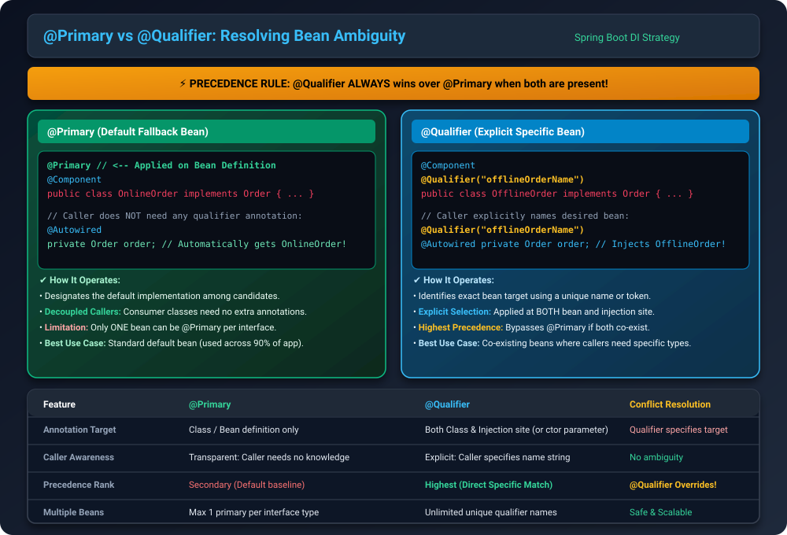

---

## 9. Comprehensive Comparison Matrix

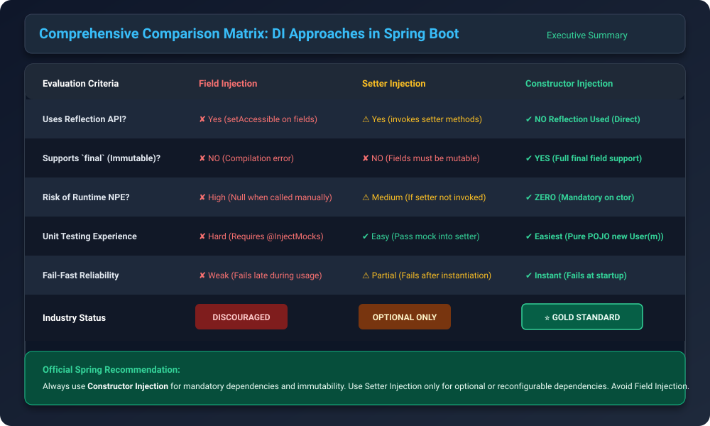

| Evaluation Criteria | Field Injection | Setter Injection | Constructor Injection |
| :--- | :--- | :--- | :--- |
| **Uses Java Reflection?** | Yes (`field.setAccessible`) | Yes (method reflection) | **No** (Direct invocation) |
| **Supports `final` (Immutable)?**| No (Compilation error) | No (Fields must be mutable) | **Yes** (100% immutable) |
| **Risk of `NullPointerException`?** | High (outside Spring) | Medium (if setter skipped) | **Zero** (Mandatory params) |
| **Unit Test Ease** | Difficult (`@InjectMocks`) | Easy (call setter) | **Easiest** (Pure POJO `new`) |
| **Fail-Fast Safety** | Poor (fails at runtime) | Partial (post-creation) | **Instant** (Startup failure) |
| **Circular Dependency Handling**| Hidden / Silently masked | Handled | Caught immediately |
| **Industry Adoption** | **Discouraged** | Optional / Rare cases | **Gold Standard (Recommended)** |

---

## 10. Summary Cheat Sheet for Interviews

1. **Why does Spring recommend Constructor Injection?**
   It guarantees mandatory dependencies are initialized, enables `final` immutability, fails fast if dependencies are missing, and requires no reflection or framework dependencies for unit tests.
2. **When is `@Autowired` optional?**
   From Spring 4.3 onwards, if a class defines **only one constructor**, `@Autowired` can be omitted.
3. **How do you resolve a Circular Dependency?**
   - *Best Practice:* Refactor and extract common functionality to a separate shared service.
   - *Framework Fix:* Use `@Lazy` on one of the injection points to inject a CGLIB proxy.
4. **How do you resolve multiple candidate beans for an interface?**
   Use `@Primary` on the default implementation, or `@Qualifier("beanName")` for explicit selection at the injection point.