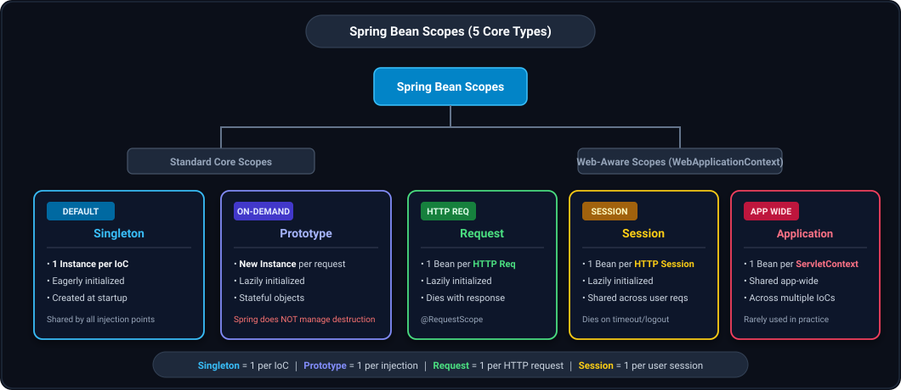
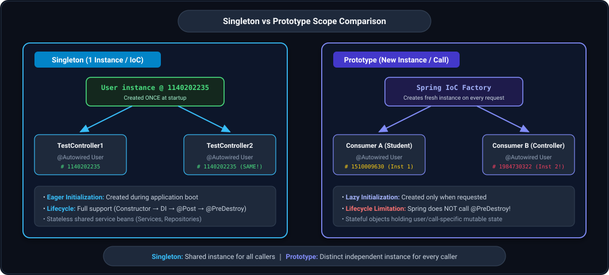
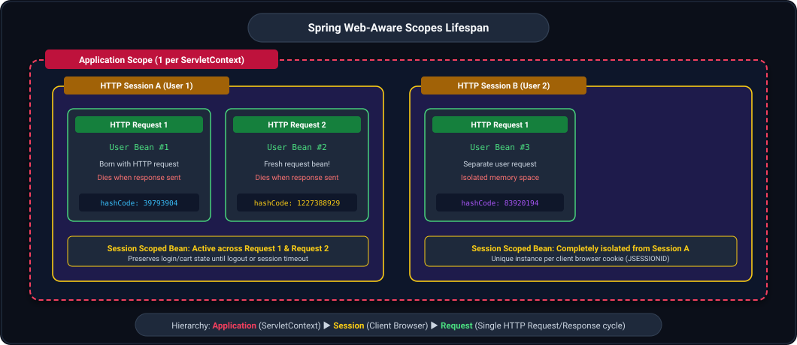
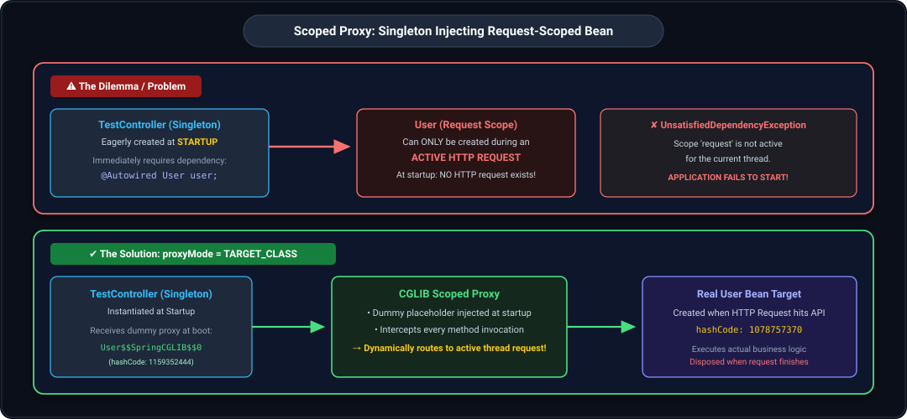
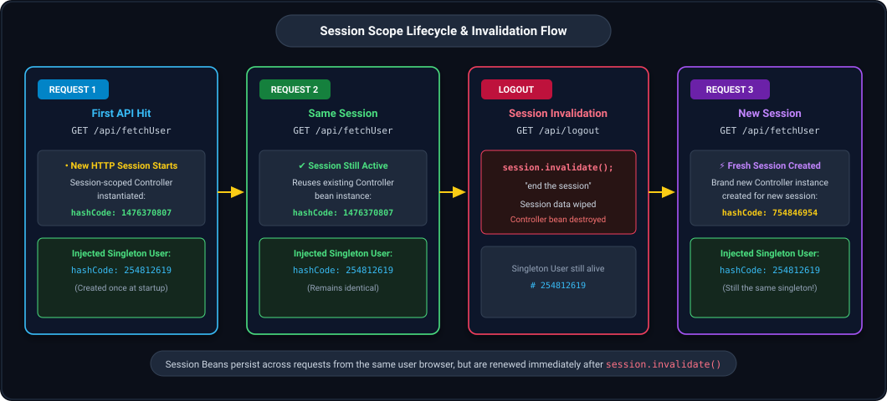

## 1. Introduction to Bean Scopes (The 5 Scope Types)

In Spring Boot, the **scope** of a bean defines its lifecycle, visibility, and how many instances of that bean are created by the Spring IoC Container.

Spring provides **5 distinct bean scopes**:
1. **Singleton:** Exactly 1 instance per Spring IoC Container (Default scope).
2. **Prototype:** A brand new instance is created every time the bean is requested or injected.
3. **Request:** Exactly 1 instance per HTTP request lifecycle (Web-aware).
4. **Session:** Exactly 1 instance per HTTP session lifecycle (Web-aware).
5. **Application:** Exactly 1 instance per `ServletContext` across the entire web application (Web-aware).



---

## 2. Singleton Scope (Default Scope)

### Core Characteristics
- **Default Scope:** If no `@Scope` is explicitly declared on a class or `@Bean` method, Spring defaults to **Singleton**.
- **1 Instance per IoC Container:** Only one shared instance of the bean is created per Spring IoC container (`ApplicationContext`).
- **Eager Initialization:** Created eagerly at application startup (before Tomcat finishes loading and before any API requests arrive).
- **Thread Safety Warning:** Because all threads share the exact same instance, singleton beans should generally be **stateless**.

### Two Ways to Declare Singleton Scope
```java
// Option 1: String literal
@Scope("singleton")

// Option 2: ConfigurableBeanFactory constant (Recommended)
@Scope(value = ConfigurableBeanFactory.SCOPE_SINGLETON)
```

---

### Code Example: Sharing a Singleton Bean
```java
@Component
@Scope("singleton")
public class User {

    public User() {
        System.out.println("User initialization");
    }

    @PostConstruct
    public void init() {
        System.out.println("User object hashCode: " + this.hashCode());
    }
}

@RestController
@RequestMapping(value = "/api")
public class TestController1 {

    @Autowired
    User user;

    public TestController1() {
        System.out.println("TestController1 instance initialization");
    }

    @PostConstruct
    public void init() {
        System.out.println("TestController1 object hashCode: " + this.hashCode() 
                + " User object hashCode: " + user.hashCode());
    }

    @GetMapping(path = "/fetchUser")
    public ResponseEntity<String> getUserDetails() {
        System.out.println("fetchUser api invoked");
        return ResponseEntity.status(HttpStatus.OK).body("");
    }
}

@RestController
@RequestMapping(value = "/api")
@Scope(value = ConfigurableBeanFactory.SCOPE_SINGLETON)
public class TestController2 {

    @Autowired
    User user;

    public TestController2() {
        System.out.println("TestController2 instance initialization");
    }

    @PostConstruct
    public void init() {
        System.out.println("TestController2 object hashCode: " + this.hashCode() 
                + " User object hashCode: " + user.hashCode());
    }

    @GetMapping(path = "/fetchUser2")
    public ResponseEntity<String> getUserDetails() {
        System.out.println("fetchUser2 api invoked");
        return ResponseEntity.status(HttpStatus.OK).body("");
    }
}
```

---

### Console Startup Log Evidence
```text
TestController1 instance initialization
User initialization                                                                             <-- 1. Default constructor called
User object hashCode: 1140202235                                                                <-- 3. @PostConstruct called
TestController1 object hashCode: 1046302571 User object hashCode: 1140202235
TestController2 instance initialization
TestController2 object hashCode: 1525241607 User object hashCode: 1140202235                    <-- Same User bean reused!
main] o.s.b.w.embedded.tomcat.TomcatWebServer  : Tomcat started on port 8080 (http) with context path ''
main] c.c.l.SpringbootApplication              : Started SpringbootApplication in 0.771 seconds
```

> **Lifecycle Execution Order:**
> 1. **1st:** Default Constructor is invoked (`User initialization`).
> 2. **2nd:** Dependencies are injected (`@Autowired`).
> 3. **3rd:** `@PostConstruct` method is executed (`User object hashCode: 1140202235`).
>
> **Key Observation:**
> Notice that `User` is **NOT initialized a second time** for `TestController2`. The existing singleton instance with hashCode `1140202235` is injected into both controllers!

---

## 3. Prototype Scope

### Core Characteristics
- **New Instance Every Time:** A brand new, distinct instance is created every single time the bean is requested from the IoC container or injected into another bean.
- **Lazy Initialization:** Prototype beans are **never created at application startup**; they are instantiated on-demand.
- **Stateful Usage:** Ideal for stateful beans where each caller requires its own independent copy with isolated instance variables.
- **Lifecycle Limitation:** Spring manages creation and dependency injection, but **does NOT manage destruction** (`@PreDestroy` is **never** called for prototype beans!). Resource cleanup must be handled manually.



### Two Ways to Declare Prototype Scope
```java
// Option 1: String literal
@Scope("prototype")

// Option 2: ConfigurableBeanFactory constant
@Scope(value = ConfigurableBeanFactory.SCOPE_PROTOTYPE)
```

---

### Code Example: Prototype vs. Singleton Interaction
```java
// Prototype Bean
@Component
@Scope("prototype")
public class User {

    public User() {
        System.out.println("User initialization");
    }

    @PostConstruct
    public void init() {
        System.out.println("User object hashCode: " + this.hashCode());
    }
}

// Singleton Bean (Default scope)
@Component
public class Student {

    @Autowired
    User user;

    public Student() {
        System.out.println("Student instance initialization");
    }

    @PostConstruct
    public void init() {
        System.out.println("Student object hashCode: " + this.hashCode() 
                + " User object hashCode: " + user.hashCode());
    }
}

// Prototype Controller
@RestController
@Scope(ConfigurableBeanFactory.SCOPE_PROTOTYPE)
@RequestMapping(value = "/api")
public class TestController1 {

    @Autowired
    User user;

    @Autowired
    Student student;

    public TestController1() {
        System.out.println("TestController1 instance initialization");
    }

    @PostConstruct
    public void init() {
        System.out.println("TestController1 object hashCode: " + this.hashCode() 
                + " User object hashCode: " + user.hashCode() 
                + " Student object hashCode: " + student.hashCode());
    }

    @GetMapping(path = "/fetchUser")
    public ResponseEntity<String> getUserDetails() {
        System.out.println("fetchUser api invoked");
        return ResponseEntity.status(HttpStatus.OK).body("");
    }
}
```

---

### Step-by-Step Log Analysis

#### Phase 1: During Application Startup
```text
Student instance initialization                                                                 <-- 1. Student is Singleton (eagerly created)
User initialization                                                                             <-- 2. New Prototype User created for Student
User object hashCode: 1510009630                                                                <-- User instance #1
Student object hashCode: 2092450685 User object hashCode: 1510009630
main] o.s.b.w.embedded.tomcat.TomcatWebServer  : Tomcat started on port 8080 (http) with context path ''
main] c.c.l.SpringbootApplication              : Started SpringbootApplication in 0.768 seconds
```
*Notice: `TestController1` is Prototype, so it is **NOT created at application startup**!*

#### Phase 2: When API is Called (`GET /api/fetchUser`)
```text
TestController1 instance initialization                                                         <-- Controller requested, so created now!
User initialization                                                                             <-- Fresh Prototype User instance for Controller!
User object hashCode: 1984730322                                                                <-- User instance #2 (DIFFERENT hashCode!)
TestController1 object hashCode: 1786739287 User object hashCode: 1984730322 Student object hashCode: 2092450685
fetchUser api invoked
```

> **Key Observations:**
> 1. `Student` has no scope defined, so it defaults to **Singleton** (hashCode `2092450685` is reused everywhere).
> 2. `User` is **Prototype**:
>    - Inside `Student`, User has hashCode: `1510009630`.
>    - Inside `TestController1`, User has hashCode: `1984730322`.
> 3. Each injection of a prototype bean receives a **completely distinct instance**.

---

## 4. Request Scope (Web-Aware Scope)

### Core Characteristics
- **1 Instance per HTTP Request:** A new bean instance is created for each incoming HTTP request and destroyed when the HTTP response completes.
- **Web-Aware:** Available only in web-enabled Spring applications (`WebApplicationContext`).
- **Lazy Initialization:** Never created at startup; only instantiated when an HTTP request reaches the server.
- **Shared within a Request:** If multiple beans inject the same request-scoped bean within the same HTTP request thread, they all share that exact same instance.



### Ways to Declare Request Scope
```java
// Option 1: Standard annotation
@Scope("request")

// Option 2: Constant
@Scope(value = WebApplicationContext.SCOPE_REQUEST)

// Option 3: Composed annotation
@RequestScope
```

---

### Code Example: Request Scope Behavior
```java
@Component
@Scope("request")
public class User {

    public User() {
        System.out.println("User initialization");
    }

    @PostConstruct
    public void init() {
        System.out.println("User object hashCode: " + this.hashCode());
    }
}

@Component
@Scope("prototype")
public class Student {

    @Autowired
    User user;

    public Student() {
        System.out.println("Student instance initialization");
    }

    @PostConstruct
    public void init() {
        System.out.println("Student object hashCode: " + this.hashCode() 
                + " User object hashCode: " + user.hashCode());
    }
}

@RestController
@Scope("request")
@RequestMapping(value = "/api")
public class TestController1 {

    @Autowired
    User user;

    @Autowired
    Student student;

    public TestController1() {
        System.out.println("TestController1 instance initialization");
    }

    @PostConstruct
    public void init() {
        System.out.println("TestController1 object hashCode: " + this.hashCode() 
                + " User object hashCode: " + user.hashCode() 
                + " Student object hashCode: " + student.hashCode());
    }

    @GetMapping(path = "/fetchUser")
    public ResponseEntity<String> getUserDetails() {
        System.out.println("fetchUser api invoked");
        return ResponseEntity.status(HttpStatus.OK).body("");
    }
}
```

---

### Console Log Evidence

#### Application Startup
```text
:: Spring Boot ::                (v3.2.3)
main] o.s.b.w.embedded.tomcat.TomcatWebServer  : Tomcat initialized with port 8080 (http)
main] o.s.b.w.embedded.tomcat.TomcatWebServer  : Tomcat started on port 8080 (http) with context path ''
main] c.c.l.SpringbootApplication              : Started SpringbootApplication in 0.795 seconds
```
*Notice: **NO BEAN INITIALIZATION OCCURS AT STARTUP** because all beans are lazily initialized!*

#### 1st HTTP Request (`GET /api/fetchUser`)
```text
TestController1 instance initialization
User initialization
User object hashCode: 39793904                                                                 <-- Request-scoped User #1
Student instance initialization
Student object hashCode: 275139209 User object hashCode: 39793904                               <-- Student shares the SAME User #1!
TestController1 object hashCode: 898967761 User object hashCode: 39793904 Student object hashCode: 275139209
fetchUser api invoked
```

#### 2nd HTTP Request (`GET /api/fetchUser`)
```text
TestController1 instance initialization                                                         <-- Fresh Request Controller
User initialization                                                                             <-- Fresh Request User!
User object hashCode: 1227388929                                                                <-- Request-scoped User #2 (New HashCode!)
Student instance initialization                                                                 <-- Fresh Prototype Student
Student object hashCode: 1206886228 User object hashCode: 1227388929                           <-- Student shares User #2!
TestController1 object hashCode: 1137709937 User object hashCode: 1227388929 Student object hashCode: 1206886228
fetchUser api invoked
```

> **Key Rule of Request Scope:**
> Within a single HTTP request, **all beans sharing the dependency receive the exact same instance** (User `# 39793904` in request 1, User `# 1227388929` in request 2).

---

## 5. Prototype vs. Request Scope (Key Distinctions)

| Feature | Prototype Scope | Request Scope |
|---|---|---|
| **Target Context** | Any Spring Context (Batch, CLI, Messaging, Web) | Web Applications only (`WebApplicationContext`) |
| **Creation Trigger** | Every time the bean is requested / injected | Exactly once per incoming HTTP request |
| **Shared Within Request?** | **No.** Injected twice $\rightarrow$ 2 separate objects | **Yes.** Injected twice $\rightarrow$ shares the same object |
| **Lifecycle Destruction** | Spring does **not** manage destruction (No `@PreDestroy`) | Spring disposes the bean when the HTTP request finishes |
| **Typical Use Case** | Complex stateful calculations, multi-threaded tasks | Storing request-specific headers, auth token, audit logs |

---

## 6. The Scoped Proxy Dilemma: Singleton Injecting Request Scope

### The Problem: Architectural Mismatch
What happens when an eagerly initialized **Singleton Controller** injects a **Request-Scoped Bean**?



```java
@RestController
@Scope("singleton") // Eagerly created at application startup!
@RequestMapping(value = "/api")
public class TestController1 {

    @Autowired
    User user; // Request-scoped bean!
}

@Component
@Scope("request")
public class User {
    // Needs an active HTTP request to be created!
}
```

**Startup Crash Result:**
```text
org.springframework.beans.factory.UnsatisfiedDependencyException: 
Error creating bean with name 'testController1': Unsatisfied dependency expressed through field 'user'...
Scope 'request' is not active for the current thread; 
IllegalStateException: No thread-bound request found: Are you referring to request attributes outside of an actual web request?
```

### Why does it fail?
1. `TestController1` is Singleton $\rightarrow$ Spring creates it **at startup**.
2. Spring attempts to resolve and inject all `@Autowired` dependencies for `TestController1`.
3. `User` is Request-scoped $\rightarrow$ can only exist when there is an **active HTTP request**.
4. At application startup, **there is NO active HTTP request**!
5. Spring cannot create `User`, so dependency injection fails and the application crashes.

---

### The Solution: Scoped Proxy (`proxyMode = ScopedProxyMode.TARGET_CLASS`)
To bridge the lifecycle gap, Spring uses a **Scoped Proxy** (a CGLIB proxy dummy object):

```java
@Component
@Scope(value = "request", proxyMode = ScopedProxyMode.TARGET_CLASS)
public class User {

    public User() {
        System.out.println("User initialization");
    }

    @PostConstruct
    public void init() {
        System.out.println("User object hashCode: " + this.hashCode());
    }

    public void dummyMethod() { }
}
```

### How the Scoped Proxy Works
1. **At Startup:** Spring does not create the real `User` instance. Instead, it generates a **CGLIB proxy (dummy object)** and injects this proxy into the singleton controller.
2. **At Runtime:** When a client sends an HTTP request and the controller calls a method on `user`, the proxy intercepts the call, fetches the **real request-scoped `User` instance** for the current thread, and delegates the method call to it!

**Startup Logs with Proxy:**
```text
TestController1 instance initialization
TestController1 object hashCode: 1356419559 User object hashCode: 1159352444                     <-- 1159352444 is the DUMMY CGLIB PROXY!
main] o.s.b.w.embedded.tomcat.TomcatWebServer  : Tomcat started on port 8080 (http)
```

**API Invocation Logs (`GET /api/fetchUser`):**
```text
fetchUser api invoked
User initialization                                                                             <-- Real User created now on HTTP request!
User object hashCode: 1078757370                                                                <-- Real User instance (Delegated by Proxy)
```

---

## 7. Session Scope (Web-Aware Scope)

### Core Characteristics
- **1 Instance per HTTP Session:** A single bean instance is created for each HTTP Session and remains alive across multiple HTTP requests from the same user browser.
- **Tied to `JSESSIONID`:** Spring tracks the session via the `JSESSIONID` cookie sent by the browser.
- **Session Expiration:** The bean is destroyed when the session times out (configured via `server.servlet.session.timeout`) or is explicitly invalidated via `request.getSession().invalidate()`.



### Ways to Declare Session Scope
```java
// Option 1: Standard annotation
@Scope("session")

// Option 2: Constant
@Scope(value = WebApplicationContext.SCOPE_SESSION)

// Option 3: Composed annotation
@SessionScope
```

---

### Code Example: Session Invalidation (`/logout`)
```java
@Component
@Scope("singleton") // Singleton User
public class User {

    public User() {
        System.out.println("User initialization");
    }

    @PostConstruct
    public void init() {
        System.out.println("User object hashCode: " + this.hashCode());
    }
}

@RestController
@Scope(value = "session") // Session-Scoped Controller
@RequestMapping(value = "/api")
public class TestController1 {

    @Autowired
    User user;

    public TestController1() {
        System.out.println("TestController1 instance initialization");
    }

    @PostConstruct
    public void init() {
        System.out.println("TestController1 object hashCode: " + this.hashCode() 
                + " User object hashCode: " + user.hashCode());
    }

    @GetMapping(path = "/fetchUser")
    public ResponseEntity<String> getUserDetails() {
        System.out.println("fetchUser api invoked");
        return ResponseEntity.status(HttpStatus.OK).body("");
    }

    @GetMapping(path = "/logout")
    public ResponseEntity<String> logout(HttpServletRequest request) {
        System.out.println("end the session");
        HttpSession session = request.getSession();
        session.invalidate(); // Ends the session!
        return ResponseEntity.status(HttpStatus.OK).body("");
    }
}
```

---

### Step-by-Step Execution Trace

#### Step 1: Application Startup
- `User` is Singleton $\rightarrow$ eagerly created at startup (hashCode: `254812619`).
- `TestController1` is Session $\rightarrow$ not created yet.

#### Step 2: First Call to `/fetchUser` (Session A Created)
- New HTTP session established.
- `TestController1` instantiated with hashCode: `1476370807`.
- Injected with singleton `User` (hashCode: `254812619`).

#### Step 3: Second Call to `/fetchUser` (Same Session A)
- Same browser session cookie passed.
- Same `TestController1` reused (hashCode: `1476370807`).

#### Step 4: Call to `/logout`
- `session.invalidate()` is executed $\rightarrow$ Session A is terminated and `TestController1` (`1476370807`) is destroyed.

#### Step 5: Next Call to `/fetchUser` (Session B Created)
- Previous session is gone. Spring establishes a **new HTTP Session**.
- A **brand new `TestController1` instance** is created with hashCode: `754846954`!
- The injected singleton `User` remains the same (`254812619`).

---

## 8. Application Scope (Web-Aware Scope)

### Core Characteristics
- **1 Instance per `ServletContext`:** Created once for the entire web application lifecycle and shared across all servlets and filters.
- **Ways to Declare:**
  ```java
  @Scope("application")
  @Scope(value = WebApplicationContext.SCOPE_APPLICATION)
  @ApplicationScope
  ```

### Difference between Singleton and Application Scope
- **Singleton Scope:** Exactly **1 instance per Spring IoC Container (`ApplicationContext`)**.
  - If a large enterprise web application has multiple IoC containers (e.g. multiple DispatcherServlets with parent and child contexts), each container creates its own Singleton instance!
- **Application Scope:** Exactly **1 instance per `ServletContext`**, globally shared across all IoC containers within that web application.
- **Practical Note:** In modern standalone Spring Boot applications, there is typically only one `ApplicationContext` per running process, so Application Scope behaves identically to Singleton and is **rarely used in practice**.

---

## 9. Comprehensive Comparison Table of All 5 Scopes

| Scope | Context | Instance Created | Lifecycle Duration | Destruction Managed? | Common Use Cases |
|---|---|---|---|---|---|
| **`Singleton`** | Any Spring App | Once per IoC Container | Entire application lifecycle | Yes (`@PreDestroy`) | Stateless services, repositories, configurations |
| **`Prototype`** | Any Spring App | Every injection / lookup | Caller controls lifecycle | **No** (Must cleanup manually) | Stateful calculation engines, temporary tasks |
| **`Request`** | Web Applications | Once per HTTP request | Single request/response cycle | Yes (On request completion) | Request audit logs, user IP context, auth tokens |
| **`Session`** | Web Applications | Once per HTTP session | User session (login to logout/timeout) | Yes (On session invalidation) | Shopping cart, user profile session data |
| **`Application`** | Web Applications | Once per ServletContext | Entire web application deployment | Yes (On servlet context shutdown) | Global app config, shared runtime metrics |
