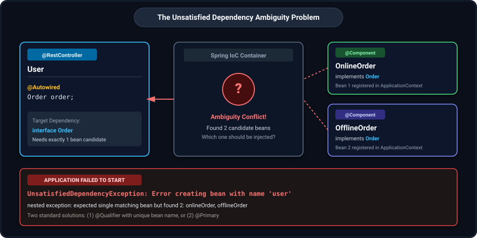
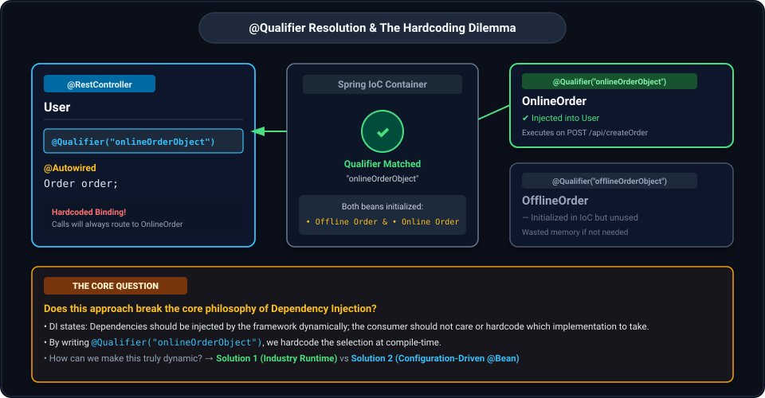
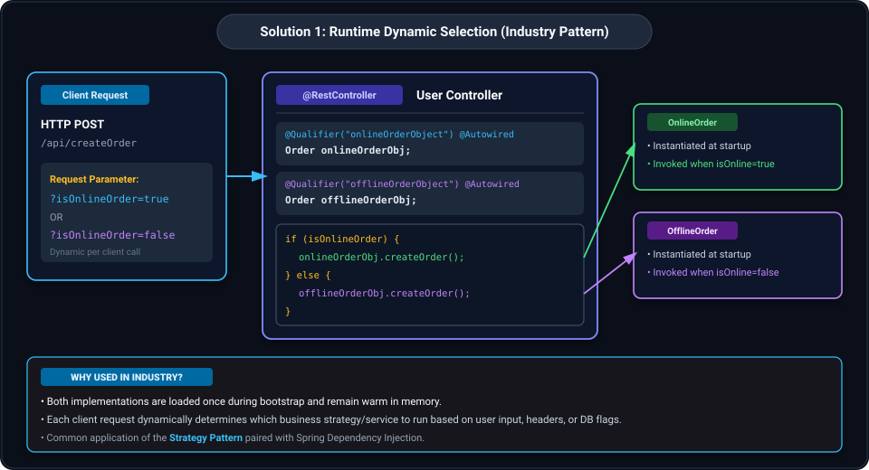
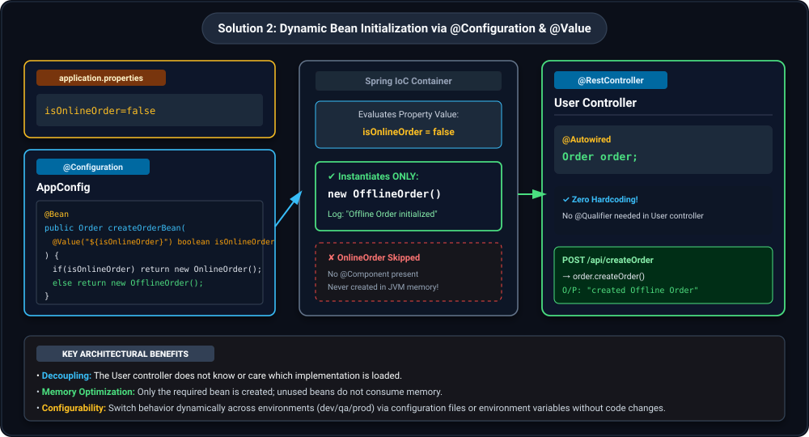

## 1. Unsatisfied Dependency Problem in Dependency Injection

In Spring Boot, when an interface has multiple implementation classes registered as Spring beans (e.g., annotated with `@Component`), the Spring IoC (Inversion of Control) container encounters an ambiguity problem during dependency injection.



### Code Scenario

#### 1. Interface Definition
```java
public interface Order {
    public void createOrder();
}
```

#### 2. First Implementation: `OnlineOrder`
```java
@Component
public class OnlineOrder implements Order {

    public OnlineOrder() {
        System.out.println("Online Order Initialized");
    }

    public void createOrder() {
        System.out.println("created Online Order");
    }
}
```

#### 3. Second Implementation: `OfflineOrder`
```java
@Component
public class OfflineOrder implements Order {

    public OfflineOrder() {
        System.out.println("Offline Order initialized");
    }

    public void createOrder() {
        System.out.println("created Offline Order");
    }
}
```

#### 4. Controller (Injection Point): `User`
```java
@RestController
@RequestMapping(value = "/api")
public class User {

    @Autowired
    Order order;

    @PostMapping("/createOrder")
    public ResponseEntity<String> createOrder() {
        order.createOrder();
        return ResponseEntity.ok("");
    }
}
```

---

### The Problem & Error Output

When starting the Spring Boot application, Spring scans the classpath, detects both `OnlineOrder` and `OfflineOrder` implementing `Order`, and attempts to inject an `Order` bean into `User`. Because both beans qualify, Spring cannot determine which one to pick:

```text
***************************
APPLICATION FAILED TO START
***************************

Description:
Field order in com.example.demo.User required a single bean of type 'com.example.demo.Order' that could not be found.

Action:
Consider marking one of the beans as @Primary, updating the consumer to accept multiple beans, or using @Qualifier to identify the bean that should be consumed

UnsatisfiedDependencyException: Error creating bean with name 'user'
```

---

## 2. Resolving Ambiguity via `@Qualifier` and Its Limitations

Traditionally, Spring provides two primary ways to resolve bean ambiguity:
1. **`@Qualifier`**: Explicitly specifies the bean name to inject.
2. **`@Primary`**: Designates one implementation as the primary default bean when multiple candidates exist.

Let us inspect the `@Qualifier` approach and observe how it behaves at startup and runtime.



### Code Implementation with `@Qualifier`

The consumer specifies the qualifier name matching the bean definition:

```java
@RestController
@RequestMapping(value = "/api")
public class User {

    @Qualifier("onlineOrderObject")
    @Autowired
    Order order;

    @PostMapping("/createOrder")
    public ResponseEntity<String> createOrder() {
        order.createOrder();
        return ResponseEntity.ok("");
    }
}
```

```java
public interface Order {
    public void createOrder();
}
```

```java
@Qualifier("onlineOrderObject")
@Component
public class OnlineOrder implements Order {

    public OnlineOrder() {
        System.out.println("Online Order Initialized");
    }

    public void createOrder() {
        System.out.println("created Online Order");
    }
}
```

```java
@Qualifier("offlineOrderObject")
@Component
public class OfflineOrder implements Order {

    public OfflineOrder() {
        System.out.println("Offline Order initialized");
    }

    public void createOrder() {
        System.out.println("created Offline Order");
    }
}
```

> **Key Rule**: The string value inside `@Qualifier("onlineOrderObject")` on the injection target (`User`) must match the value provided on the bean declaration (`OnlineOrder`).

---

### Application Startup Logs

At application bootstrap, Spring scans and instantiates **both** `@Component` beans into the container context:

```text
2024-05-07T16:41:14.520+05:30 INFO 98826 --- [           main] c.c.l.SpringBootApplication
2024-05-07T16:41:14.521+05:30 INFO 98826 --- [           main] c.c.l.SpringBootApplication
2024-05-07T16:41:14.953+05:30 INFO 98826 --- [           main] o.s.b.w.embedded.tomcat.TomcatWebServer
2024-05-07T16:41:14.959+05:30 INFO 98826 --- [           main] o.apache.catalina.core.StandardService
2024-05-07T16:41:14.959+05:30 INFO 98826 --- [           main] o.apache.catalina.core.StandardEngine
2024-05-07T16:41:14.985+05:30 INFO 98826 --- [           main] o.a.c.c.C.[Tomcat].[localhost].[/]
2024-05-07T16:41:14.985+05:30 INFO 98826 --- [           main] w.s.c.ServletWebServerApplicationContext
Offline Order initialized
Online Order Initialized
2024-05-07T16:41:15.149+05:30 INFO 98826 --- [           main] o.s.b.w.embedded.tomcat.TomcatWebServer
2024-05-07T16:41:15.154+05:30 INFO 98826 --- [           main] c.c.l.SpringBootApplication
```

---

### Runtime Execution

Triggering the endpoint via HTTP POST:

```http
POST http://localhost:8090/api/createOrder
```

**Console Output:**
```text
2024-05-07T16:41:54.579+05:30 INFO 98826 --- [nio-8090-exec-2] o.a.c.c.C.[Tomcat].[localhost].[/]
2024-05-07T16:41:54.579+05:30 INFO 98826 --- [nio-8090-exec-2] o.s.web.servlet.DispatcherServlet
2024-05-07T16:41:54.580+05:30 INFO 98826 --- [nio-8090-exec-2] o.s.web.servlet.DispatcherServlet
created Online Order
```

**Observation**: The injected bean is hardcoded at compile-time/declaration. Every invocation will always route to `OnlineOrder`.

---

### The Fundamental Dilemma

> **Question**: Does this break Dependency Injection?
> 
> The core tenet of Dependency Injection is that dependencies should be managed and injected by the framework without the consuming class having to hardcode which concrete implementation to take.
> 
> By using `@Qualifier("onlineOrderObject")`, we are hardcoding the choice directly in our controller. If business requirements change or need dynamic behavior, how do we make the initialization and selection truly dynamic?

There are two primary architectural solutions to solve this:
- **Solution 1**: Runtime dynamic selection (Industry standard pattern).
- **Solution 2**: Dynamic bean initialization via `@Configuration` & `@Value` (Configuration-driven startup pattern).

---

## 3. Solution 1: Runtime Dynamic Selection (Industry Pattern)

In many production enterprise applications, the decision of which service implementation to execute depends on dynamic runtime conditions—such as request parameters, HTTP headers, tenant IDs, or database state.

In this pattern, all candidate beans are injected into the consumer using `@Qualifier`, and business logic programmatically selects the appropriate instance at runtime.



### Code Implementation

```java
@RestController
@RequestMapping(value = "/api")
public class User {

    @Qualifier("onlineOrderObject")
    @Autowired
    Order onlineOrderObj;

    @Qualifier("offlineOrderObject")
    @Autowired
    Order offlineOrderObj;

    @PostMapping("/createOrder")
    public ResponseEntity<String> createOrder(@RequestParam boolean isOnlineOrder) {
        // Dynamic execution decided programmatically at runtime
        if (isOnlineOrder) {
            onlineOrderObj.createOrder();
        } else {
            offlineOrderObj.createOrder();
        }
        return ResponseEntity.ok("");
    }
}
```

```java
public interface Order {
    public void createOrder();
}
```

```java
@Qualifier("onlineOrderObject")
@Component
public class OnlineOrder implements Order {

    public OnlineOrder() {
        System.out.println("Online Order Initialized");
    }

    public void createOrder() {
        System.out.println("created Online Order");
    }
}
```

```java
@Qualifier("offlineOrderObject")
@Component
public class OfflineOrder implements Order {

    public OfflineOrder() {
        System.out.println("Offline Order initialized");
    }

    public void createOrder() {
        System.out.println("created Offline Order");
    }
}
```

### Why This Is Used in Industry
1. **True Runtime Dynamism**: Client requests can pass `?isOnlineOrder=true` or `?isOnlineOrder=false`, and the controller executes the corresponding logic on the fly.
2. **Strategy Pattern Alignment**: Both beans stay initialized in memory as Spring singletons, ready to handle incoming concurrent requests without re-instantiation overhead.

---

## 4. Solution 2: Dynamic Bean Initialization via `@Configuration` and `@Value`

If the decision of which bean implementation to use is determined at application deployment/startup time (e.g., based on application configuration, environment profiles, or feature toggles), we can dynamically register **only the required bean** in the Spring IoC container.

In this approach:
- Remove `@Component` from both `OnlineOrder` and `OfflineOrder`.
- Define a `@Configuration` class (`AppConfig`) with a `@Bean` factory method.
- Use `@Value("${isOnlineOrder}")` to inspect the configuration property.
- Conditionally return the appropriate instance (`new OnlineOrder()` or `new OfflineOrder()`).



### Code Implementation

#### 1. Implementation Classes (No `@Component`)
```java
// Note: No @Component annotation here.
// Instances are created exclusively through configuration methods.
public class OnlineOrder implements Order {

    public OnlineOrder() {
        System.out.println("Online Order Initialized");
    }

    public void createOrder() {
        System.out.println("created Online Order");
    }
}
```

```java
// Note: No @Component annotation here.
public class OfflineOrder implements Order {

    public OfflineOrder() {
        System.out.println("Offline Order initialized");
    }

    public void createOrder() {
        System.out.println("created Offline Order");
    }
}
```

#### 2. Configuration Class: `AppConfig`
```java
@Configuration
public class AppConfig {

    @Bean
    public Order createOrderBean(@Value("${isOnlineOrder}") boolean isOnlineOrder) {
        if (isOnlineOrder) {
            return new OnlineOrder();
        } else {
            return new OfflineOrder();
        }
    }
}
```

#### 3. Configuration File: `application.properties`
```properties
isOnlineOrder=false
```

#### 4. Consumer: `User` Controller
```java
@RestController
@RequestMapping(value = "/api")
public class User {

    // Clean injection: No @Qualifier or conditional branching needed in the controller!
    @Autowired
    Order order;

    @PostMapping("/createOrder")
    public ResponseEntity<String> createOrder() {
        order.createOrder();
        return ResponseEntity.ok("");
    }
}
```

---

### Application Startup Logs

When `isOnlineOrder=false` in `application.properties`:

```text
2024-05-08T19:30:38.605+05:30 INFO 45167 --- [           main] o.apache.catalina.core.StandardService   : 
2024-05-08T19:30:38.606+05:30 INFO 45167 --- [           main] o.apache.catalina.core.StandardEngine    : 
2024-05-08T19:30:38.631+05:30 INFO 45167 --- [           main] o.a.c.c.C.[Tomcat].[localhost].[/]       : 
2024-05-08T19:30:38.632+05:30 INFO 45167 --- [           main] w.s.c.ServletWebServerApplicationContext : 
Offline Order initialized
2024-05-08T19:30:38.793+05:30 INFO 45167 --- [           main] o.s.b.w.embedded.tomcat.TomcatWebServer : 
2024-05-08T19:30:38.798+05:30 INFO 45167 --- [           main] c.c.l.SpringBootApplication              : 
```

> **Critical Observation**: Notice that **only** `Offline Order initialized` appears in the startup log! `OnlineOrder` was never instantiated and consumes zero JVM memory.

---

### Request Execution & Console Output

```http
POST http://localhost:8090/api/createOrder
```

**Console Output:**
```text
2024-05-08T19:30:38.606+05:30 INFO 45167 --- [           main] o.apache.catalina.core.StandardEngine    : 
2024-05-08T19:30:38.631+05:30 INFO 45167 --- [           main] o.a.c.c.C.[Tomcat].[localhost].[/]       : 
2024-05-08T19:30:38.632+05:30 INFO 45167 --- [           main] w.s.c.ServletWebServerApplicationContext : 
Offline Order initialized
2024-05-08T19:30:38.793+05:30 INFO 45167 --- [           main] o.s.b.w.embedded.tomcat.TomcatWebServer : 
2024-05-08T19:30:38.798+05:30 INFO 45167 --- [           main] c.c.l.SpringBootApplication              : 
2024-05-08T19:32:33.610+05:30 INFO 45167 --- [nio-8090-exec-2] o.a.c.c.C.[Tomcat].[localhost].[/]       : 
2024-05-08T19:32:33.610+05:30 INFO 45167 --- [nio-8090-exec-2] o.s.web.servlet.DispatcherServlet        : 
2024-05-08T19:32:33.611+05:30 INFO 45167 --- [nio-8090-exec-2] o.s.web.servlet.DispatcherServlet        : 
created Offline Order
```

---

## 5. Understanding the `@Value` Annotation

The `@Value` annotation in Spring is used to inject values into bean fields, constructor parameters, or `@Bean` method arguments from various sources:
1. **Property Files**: e.g., `application.properties` or `application.yml` via `${property.name}`.
2. **Environment Variables & System Properties**: OS env variables or JVM `-D` flags.
3. **Inline Literals**: Hardcoded string/boolean/numeric values directly in the annotation parameter.

### Inline Literal Example

Instead of referencing an external property key like `${isOnlineOrder}`, `@Value` can accept a literal string value directly:

```java
@Configuration
public class AppConfig {

    @Bean
    public Order createOrderBean(@Value("false") boolean isOnlineOrder) {
        if (isOnlineOrder) {
            return new OnlineOrder();
        } else {
            return new OfflineOrder();
        }
    }
}
```

- When `@Value("false")` is evaluated, Spring converts the string `"false"` into the `boolean` primitive value `false`.
- The condition evaluates `if (false)`, returning `new OfflineOrder()`.

---

## 6. Summary Comparison: Dynamic Initialization Approaches

| Dimension | Default `@Qualifier` Approach | Solution 1: Runtime Dynamic Selection | Solution 2: Config-Driven `@Bean` Initialization |
| :--- | :--- | :--- | :--- |
| **Selection Timing** | Compile/Declaration time | Per-request runtime execution | Application startup / bootstrap time |
| **Beans Initialized** | Both beans (`OnlineOrder` & `OfflineOrder`) | Both beans (`OnlineOrder` & `OfflineOrder`) | **Only the selected bean** (`OfflineOrder`) |
| **Consumer Decoupling** | Hardcoded qualifier string on injected field | Injects all candidate beans; controller contains branching logic | **Completely decoupled**; consumer only knows interface `Order` |
| **Configuration Source** | Java annotation code | Request parameters / headers / database | `application.properties` / Environment variables |
| **Best Used For** | Static single-purpose implementations | Dynamic business decisions varying per HTTP request | Switching implementations across environments (e.g., Local vs Cloud, Mock vs Real) |