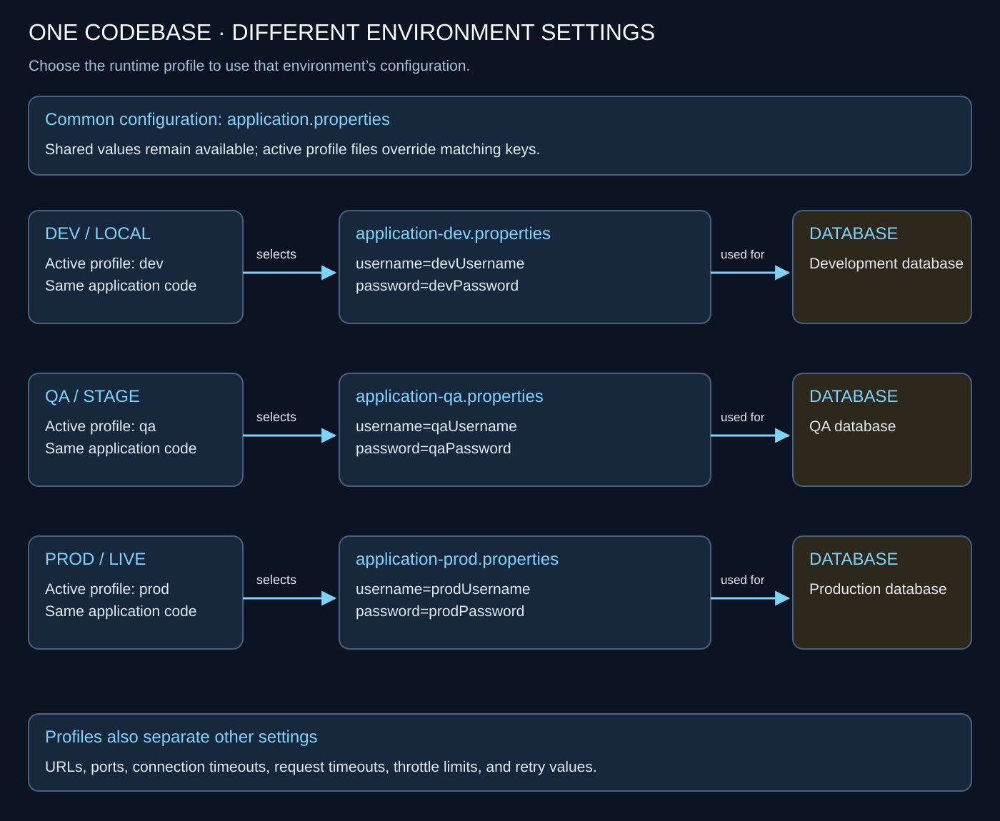
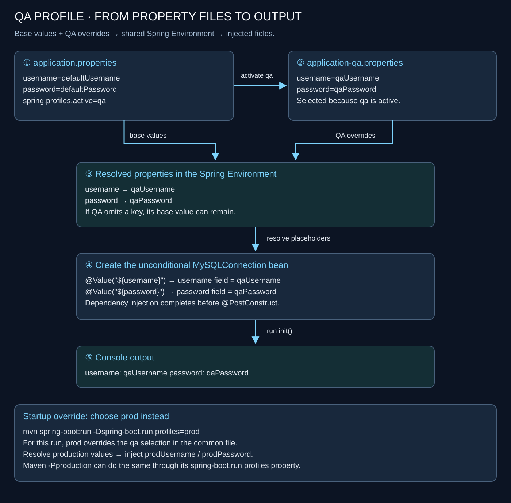
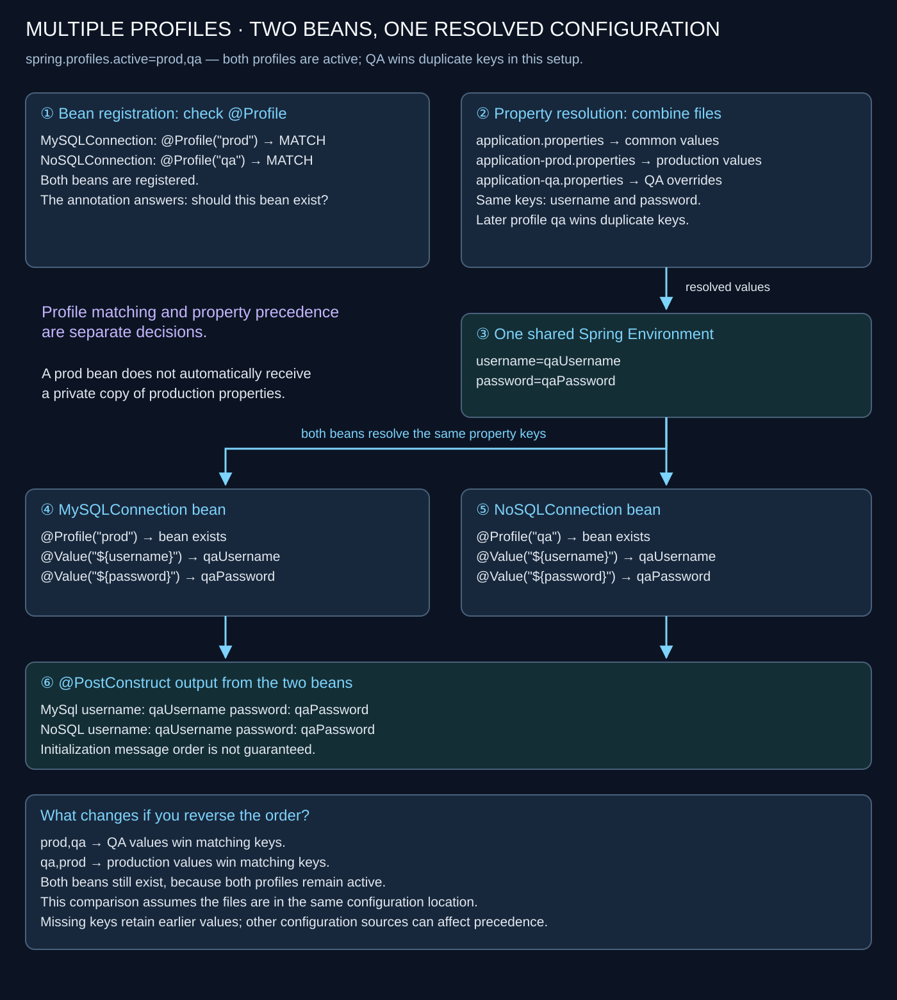
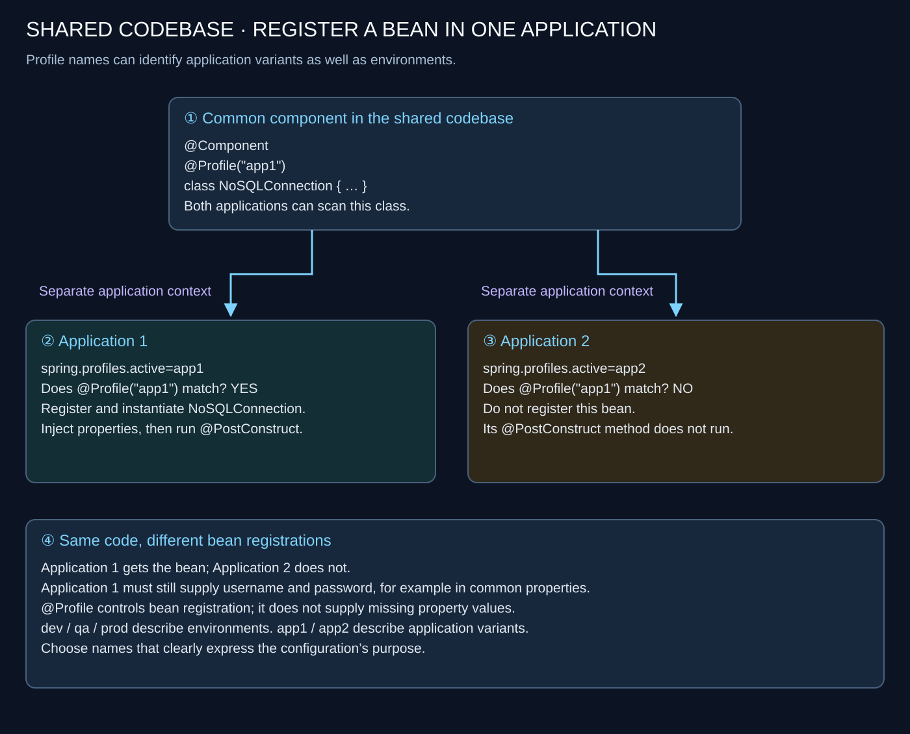

# 🎯 Spring Boot — Profiles

> 💡 **Core idea:** Use one codebase with different configuration values and different beans for each runtime setup.

| Mechanism | Purpose |
| --- | --- |
| `application.properties` | Common configuration and fallback values |
| `application-{profile}.properties` | Configuration for a particular profile |
| `spring.profiles.active` | Selects the active Spring profiles |
| `@Profile` | Makes a bean eligible for registration only when its profile condition matches |
| `@Value` | Injects a resolved property value into a bean |

---

## 1. 🌍 Why use profiles?

An application often runs in several environments:

- **Dev / local:** the developer's machine.
- **QA / stage:** a testing or staging environment.
- **Prod / live:** the production environment.

Each environment may use its own database and configuration.



| Setting | Dev | QA | Production |
| --- | --- | --- | --- |
| Username | `devUsername` | `qaUsername` | `prodUsername` |
| Password | `devPassword` | `qaPassword` | `prodPassword` |
| Database | Development database | QA database | Production database |

The credential strings are illustrative values. Other settings that may differ include:

- URLs and port numbers.
- Connection timeouts.
- Request timeouts.
- Throttle limits.
- Retry values.

**Profiles let us select the appropriate configuration at startup.**

---

## 2. 🗂️ Organize the property files

Place the configuration files under `src/main/resources`:

```text
src/main/resources/
├── application.properties
├── application-dev.properties
├── application-qa.properties
└── application-prod.properties
```

The naming convention is:

```text
application-{profile}.properties
```

For example, the `qa` profile corresponds to `application-qa.properties`.

### Common configuration

`application.properties`:

```properties
username=defaultUsername
password=defaultPassword
```

### Development configuration

`application-dev.properties`:

```properties
username=devUsername
password=devPassword
```

### QA configuration

`application-qa.properties`:

```properties
username=qaUsername
password=qaPassword
```

### Production configuration

`application-prod.properties`:

```properties
username=prodUsername
password=prodPassword
```

> 📌 **Configuration is combined:** The common file still contributes values. A profile-specific file overrides matching keys from the common file; it does not discard every common property.

If a key is absent from the active profile's file, its common value remains available, unless another property source overrides it.

---

## 3. 💉 Read configuration with @Value

```java
@Component
public class MySQLConnection {

    @Value("${username}")
    String username;

    @Value("${password}")
    String password;

    @PostConstruct
    public void init() {
        System.out.println(
                "username: " + username + " password: " + password);
    }
}
```

### How it works

1. Spring resolves the application's configuration.
2. Component scanning discovers `MySQLConnection`.
3. Spring creates the bean and injects the resolved properties.
4. `@PostConstruct` runs after dependency injection.
5. The initialization method prints the injected values.

The class demonstrates property injection; it does not actually open a database connection. The printed password is a dummy value for this example.

### Without an explicitly active profile

With the common configuration above and no profile override:

```text
username: defaultUsername password: defaultPassword
```

The `dev`, `qa`, and `prod` files are not all loaded merely because they exist. In the absence of explicitly active profiles, Spring uses its default profile; this example has no `application-default.properties`.

---

## 4. ⚙️ Activate a Spring profile

### Option A: Set it in application.properties

```properties
username=defaultUsername
password=defaultPassword
spring.profiles.active=qa
```

Now Spring combines the common configuration with `application-qa.properties`.

```text
The following 1 profile is active: "qa"
username: qaUsername password: qaPassword
```



### Option B: Select it when starting with Maven

```shell
mvn spring-boot:run -Dspring-boot.run.profiles=prod
```

In PowerShell, the property argument can be quoted:

```powershell
mvn spring-boot:run "-Dspring-boot.run.profiles=prod"
```

This tells the Spring Boot Maven plugin to run the application with the `prod` Spring profile. It overrides the `qa` selection stored in `application.properties` for this run.

```text
The following 1 profile is active: "prod"
username: prodUsername password: prodPassword
```

Selecting the environment at launch lets the same codebase run with different settings.

### Option C: Map Maven profiles to Spring profiles

Add this inside the `<project>` element of `pom.xml`:

```xml
<profiles>
    <profile>
        <id>local</id>
        <properties>
            <spring-boot.run.profiles>dev</spring-boot.run.profiles>
        </properties>
    </profile>

    <profile>
        <id>production</id>
        <properties>
            <spring-boot.run.profiles>prod</spring-boot.run.profiles>
        </properties>
    </profile>

    <profile>
        <id>stage</id>
        <properties>
            <spring-boot.run.profiles>qa</spring-boot.run.profiles>
        </properties>
    </profile>
</profiles>
```

Run with the Maven profile name:

```shell
mvn spring-boot:run -Pproduction
```

| Maven command | Maven profile | Spring profile passed to the application |
| --- | --- | --- |
| `mvn spring-boot:run -Plocal` | `local` | `dev` |
| `mvn spring-boot:run -Pstage` | `stage` | `qa` |
| `mvn spring-boot:run -Pproduction` | `production` | `prod` |

### 🔎 Understand the two profile names: production and prod

There are two separate settings here:

| Name | Who reads it? | Where is it defined? | What does it select? |
| --- | --- | --- | --- |
| `production` | Maven | `<id>production</id>` in `pom.xml` | A Maven configuration block |
| `prod` | Spring Boot | Value of `spring-boot.run.profiles` in that block | The application's active Spring profile |

Focus on this part of the Maven configuration:

```xml
<profile>
    <id>production</id>
    <properties>
        <spring-boot.run.profiles>prod</spring-boot.run.profiles>
    </properties>
</profile>
```

### Step by step: what happens when you run the command?

```shell
mvn spring-boot:run -Pproduction
```

1. **Maven reads `-Pproduction`.** It activates the Maven profile whose ID is `production`. [Maven build profiles](https://maven.apache.org/guides/introduction/introduction-to-profiles.html).
2. **That block supplies a property:** `spring-boot.run.profiles=prod`.
3. **The Spring Boot Maven plugin reads this property.** Its `run` goal starts the application with the Spring profile `prod`. [Spring Boot Maven run goal](https://docs.spring.io/spring-boot/3.5/maven-plugin/run.html).
4. **Spring Boot applies `prod`:** it uses `application-prod.properties` alongside common configuration, and beans with `@Profile("prod")` become eligible for registration.

```text
Command: -Pproduction
        ↓ Maven selects this ID
pom.xml: <id>production</id>
        ↓ Supplies a plugin configuration property
spring-boot.run.profiles=prod
        ↓ spring-boot:run starts the application
Spring profile: prod
        ├── application-prod.properties contributes values
        └── @Profile("prod") beans are eligible
```

### Why do the names not have to match?

The XML property explicitly connects the two names. Maven does not infer the Spring profile from the Maven profile ID.

For example, rename only the Maven ID:

```xml
<profile>
    <id>live-server</id>
    <properties>
        <spring-boot.run.profiles>prod</spring-boot.run.profiles>
    </properties>
</profile>
```

Now use:

```shell
mvn spring-boot:run -Plive-server
```

The application still activates **`prod`**. Its file remains `application-prod.properties`, and its bean annotation remains `@Profile("prod")`.

### Direct selection without a Maven profile block

For the Spring profile selection in this example, these commands have the same result:

```shell
# Uses the production block in pom.xml to supply prod
mvn spring-boot:run -Pproduction

# Supplies prod directly to the Spring Boot Maven plugin
mvn spring-boot:run -Dspring-boot.run.profiles=prod
```

> 💡 **Remember:** `-P...` chooses a Maven profile by ID. `spring-boot.run.profiles=...` tells the Spring Boot run goal which Spring profiles to activate. A Maven profile named `production` alone does not automatically activate `prod` or `production` in Spring.

The commands can differ if the Maven profile also changes dependencies or other build settings. This mapping configures `spring-boot:run`; it does not permanently set the active profile for every later `java -jar` launch.

---

## 5. 🧩 Create beans conditionally with @Profile

Property files choose configuration values. **`@Profile` controls whether a bean is registered for the active profiles.**

### Production-only bean

```java
@Component
@Profile("prod")
public class MySQLConnection {

    @Value("${username}")
    String username;

    @Value("${password}")
    String password;

    @PostConstruct
    public void init() {
        System.out.println(
                "MySql username: " + username + " password: " + password);
    }
}
```

### Development-only bean

```java
@Component
@Profile("dev")
public class NoSQLConnection {

    @Value("${username}")
    String username;

    @Value("${password}")
    String password;

    @PostConstruct
    public void init() {
        System.out.println(
                "NoSQL username: " + username + " password: " + password);
    }
}
```

These are separate Java classes. They replace the earlier unconditional component example.

### Which bean is created?

| Active profile | `MySQLConnection @Profile("prod")` | `NoSQLConnection @Profile("dev")` |
| --- | --- | --- |
| `qa` | Not registered | Not registered |
| `prod` | ✅ Registered | Not registered |
| `dev` | Not registered | ✅ Registered |

If `application.properties` selects `qa`, then:

```shell
mvn spring-boot:run
```

Neither connection bean is registered. Their `@PostConstruct` methods do not run, so neither connection-specific message is printed. The application can still start when no other bean requires either of them.

Run with production instead:

```shell
mvn spring-boot:run -Dspring-boot.run.profiles=prod
```

```text
The following 1 profile is active: "prod"
MySql username: prodUsername password: prodPassword
```

Only the production bean is registered and initialized.

---

## 6. 🔀 Activate multiple profiles

For this example, keep `MySQLConnection` on `prod` and **change the NoSQL bean's condition from `dev` to `qa`**:

```java
@Component
@Profile("qa")
public class NoSQLConnection {
    // Same @Value fields and @PostConstruct method as above.
}
```

Activate both profiles:

```properties
username=defaultUsername
password=defaultPassword
spring.profiles.active=prod,qa
```



### Two decisions happen

**1. Bean registration**

- `prod` is active → register `MySQLConnection`.
- `qa` is active → register `NoSQLConnection`.

**2. Property resolution**

In this simple setup, the profile-specific files are in the same configuration location. When both define the same property, the later listed profile wins:

```text
application.properties
    → application-prod.properties
    → application-qa.properties
    → resolved username = qaUsername
    → resolved password = qaPassword
```

Both beans use `@Value("${username}")` and `@Value("${password}")`, so both receive the same resolved QA values.

### Output

```text
The following 2 profiles are active: "prod", "qa"
MySql username: qaUsername password: qaPassword
NoSQL username: qaUsername password: qaPassword
```

The order of the two initialization messages is not the point; the injected values are.

> 💡 **A profile annotation does not give a bean its own private property file.** `@Profile("prod")` permits the MySQL bean to exist. It does not force that bean's `@Value` fields to read exclusively from `application-prod.properties`.

### Does profile order matter?

| Active profiles | Beans registered in this example | Winning duplicate values |
| --- | --- | --- |
| `prod,qa` | MySQL and NoSQL | QA values |
| `qa,prod` | MySQL and NoSQL | Production values |

The later profile overrides **matching keys**, not every setting from earlier files. If a later file does not define a key, its previously resolved value can remain. Other configuration sources and locations can also affect precedence.

### 🧪 Example: duplicate keys and values that remain

Keep these three files in the same `src/main/resources` folder. Assume no external configuration overrides these values.

**application.properties — common values:**

```properties
spring.profiles.active=prod,qa

username=baseUser
app.timeout=10
app.retries=1
app.name=OrdersApp
```

**application-prod.properties — production values:**

```properties
username=prodUser
app.timeout=60
app.audit-enabled=true
```

**application-qa.properties — QA values:**

```properties
username=qaUser
app.retries=3
```

Notice that QA defines neither `app.timeout` nor `app.audit-enabled`. Neither profile file defines `app.name`.

#### Case A: spring.profiles.active=prod,qa

For each property, apply common values, then production overrides, then QA overrides:

| Property | Common value | After prod | After qa — final value |
| --- | --- | --- | --- |
| `username` | `baseUser` | `prodUser` | **`qaUser`** — QA overrides the same key |
| `app.timeout` | `10` | `60` | **`60`** — QA does not define this key |
| `app.retries` | `1` | `1` — unchanged | **`3`** — QA overrides the common value |
| `app.audit-enabled` | Not defined | `true` | **`true`** — QA does not define this key |
| `app.name` | `OrdersApp` | `OrdersApp` | **`OrdersApp`** — neither profile overrides it |

**Effective configuration:**

```properties
username=qaUser
app.timeout=60
app.retries=3
app.audit-enabled=true
app.name=OrdersApp
```

> 💡 **QA is last, but the result is not just the QA file.** It contains QA values, production values, and common values, resolved separately for each key.

#### Case B: spring.profiles.active=qa,prod

Change only the profile order in `application.properties`:

```properties
spring.profiles.active=qa,prod

username=baseUser
app.timeout=10
app.retries=1
app.name=OrdersApp
```

The two profile-specific files stay the same. Now apply common values, then QA overrides, then production overrides:

| Property | Common value | After qa | After prod — final value |
| --- | --- | --- | --- |
| `username` | `baseUser` | `qaUser` | **`prodUser`** — prod overrides the same key |
| `app.timeout` | `10` | `10` — unchanged | **`60`** — prod overrides the common value |
| `app.retries` | `1` | `3` | **`3`** — prod does not define this key |
| `app.audit-enabled` | Not defined | Not defined | **`true`** — prod adds this key |
| `app.name` | `OrdersApp` | `OrdersApp` | **`OrdersApp`** — neither profile overrides it |

**Effective configuration:**

```properties
username=prodUser
app.timeout=60
app.retries=3
app.audit-enabled=true
app.name=OrdersApp
```

Only `username` changes between these two orders because it is the only key defined in **both** profile-specific files. The MySQL and NoSQL beans remain eligible in both cases because `prod` and `qa` are both active.

> 📌 **Rule:** For each key, the later active profile that actually defines that key wins in this same-location setup. An absent key does not erase an earlier value. “Absent” means the key is not declared; `username=` explicitly declares an empty value.

---

## 7. 🏷️ One common codebase, two applications

Profiles can also identify application variants. They are not restricted to environment names.

Suppose a shared component should be available to Application 1 but not Application 2:

```java
@Component
@Profile("app1")
public class NoSQLConnection {

    @Value("${username}")
    String username;

    @Value("${password}")
    String password;

    @PostConstruct
    public void init() {
        System.out.println(
                "NoSQL username: " + username + " password: " + password);
    }
}
```

Application 1 configuration:

```properties
spring.profiles.active=app1
```

Application 2 configuration:

```properties
spring.profiles.active=app2
```



| Application | Active profile | Result for this bean |
| --- | --- | --- |
| Application 1 | `app1` | ✅ Bean registered and initialized |
| Application 2 | `app2` | Bean not registered |

Both applications can use the same code while registering different beans. Application 1 still needs values for `username` and `password`, for example from the common properties file.

**Naming consideration:** names such as `dev`, `qa`, and `prod` communicate environments; names such as `app1` and `app2` communicate application variants. Use the distinction deliberately so the purpose is clear during review.


## 8. 🥇 Priority: common vs default vs dev

Assume these three files are in `src/main/resources`, with no external overrides or custom default profile:

```text
application.properties
application-default.properties
application-dev.properties
```

> 📌 **Spelling matters:** Use `application-default.properties`. The filename `application-defualt.properties` belongs to a profile named `defualt`; it is not the automatic default-profile file.

### Shared example values

`application-default.properties`:

```properties
username=defaultProfileUsername
```

`application-dev.properties`:

```properties
username=devUsername
```

The common file also defines `username`, as shown in each case below.

### Case A: dev is explicitly active

**application.properties:**

```properties
username=baseUsername
spring.profiles.active=dev
```

```text
application.properties          → loaded: username=baseUsername
application-dev.properties      → loaded: overrides with devUsername
application-default.properties  → not loaded for this profile selection

Final username = devUsername
```

**Priority for matching keys:** `application-dev.properties` > `application.properties`.

### Case B: no profile is explicitly active

**application.properties:**

```properties
username=baseUsername
# No spring.profiles.active setting
```

Also ensure no startup argument or environment variable activates a profile.

```text
No explicit active profile       → Spring uses the default profile
application.properties          → loaded: username=baseUsername
application-default.properties  → loaded: overrides with defaultProfileUsername
application-dev.properties      → not loaded

Final username = defaultProfileUsername
```

**Priority for matching keys:** `application-default.properties` > `application.properties`.

You do not need to write `spring.profiles.active=default` for this automatic behavior. Spring Boot documents both the default-profile fallback and profile-specific overrides. [Profile-specific files](https://docs.spring.io/spring-boot/reference/features/external-config.html#features.external-config.files.profile-specific), [Profiles](https://docs.spring.io/spring-boot/reference/features/profiles.html).

### Compare the results

| Configuration | Files contributing values | Winning username |
| --- | --- | --- |
| `spring.profiles.active=dev` | Common + dev | `devUsername` |
| No active profile configured anywhere | Common + default | `defaultProfileUsername` |

> 💡 **The default-profile file is not an extra fallback layer under dev.** With only `dev` active, a key missing from the dev file falls back to the common file, not to `application-default.properties`.

“Dev is not active” does not necessarily mean “no profile is active.” If `qa` is active instead, Spring uses common + QA configuration; it does not automatically add the default profile.

### Optional: make dev the fallback profile

**application.properties:**

```properties
username=baseUsername
spring.profiles.default=dev
```

Now, when no profile is explicitly activated, the fallback is `dev` instead of `default`, so the final username is `devUsername`. Put `spring.profiles.active` and `spring.profiles.default` in the common configuration, not in a profile-specific file.
