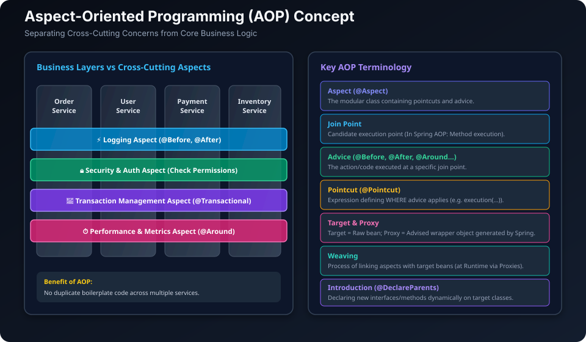
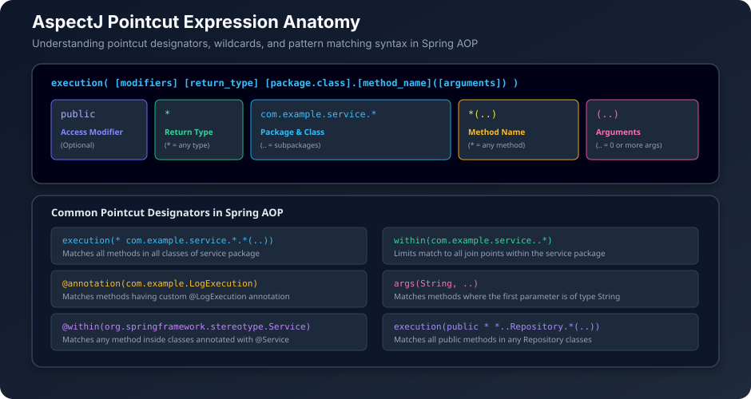
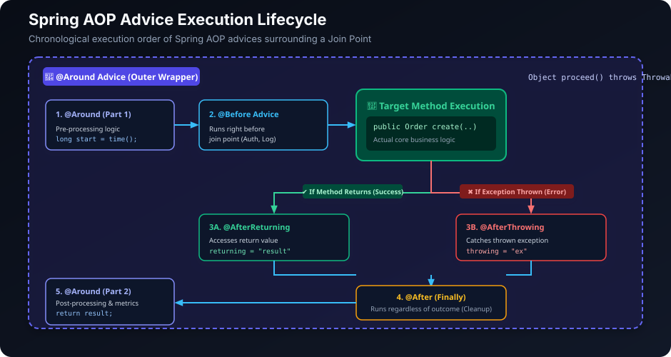
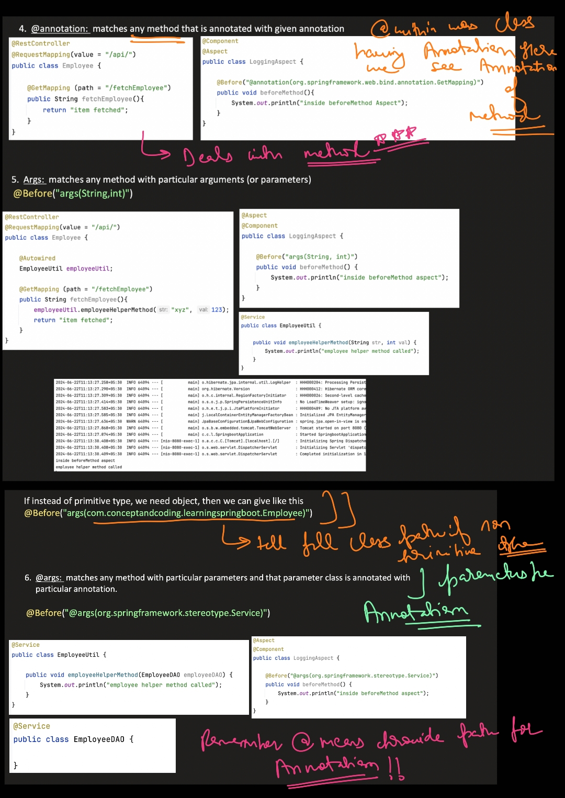
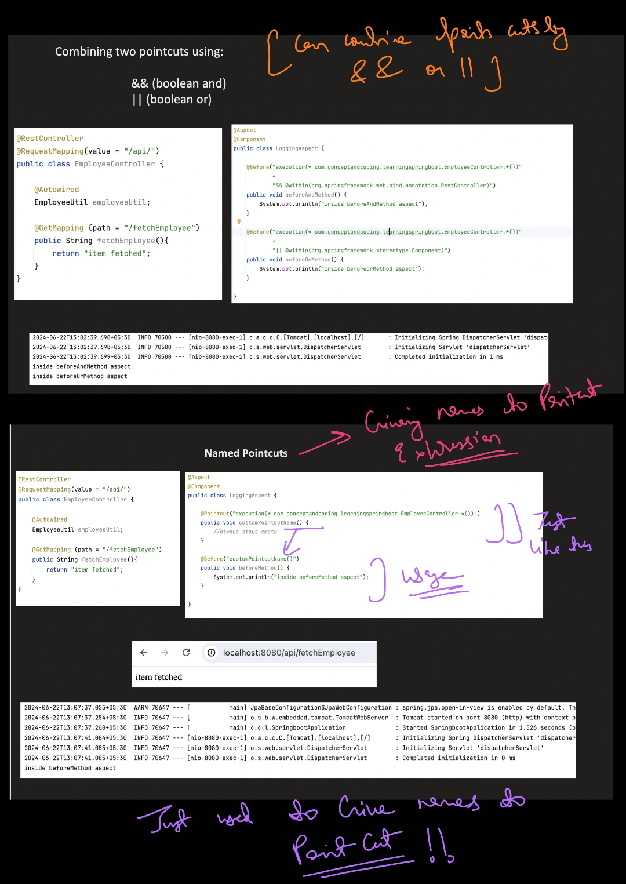
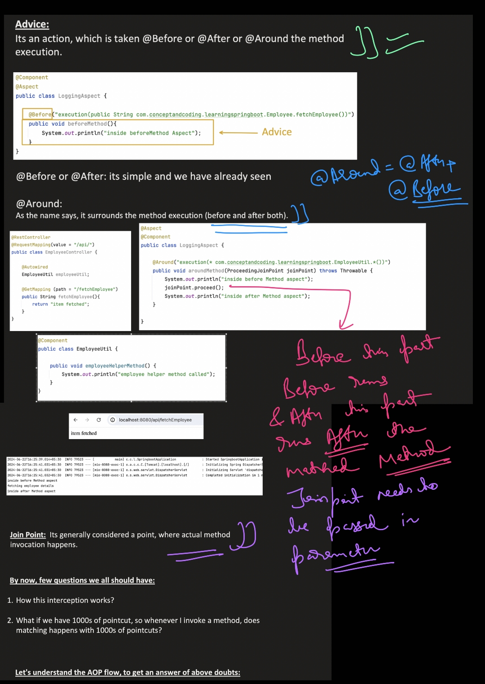
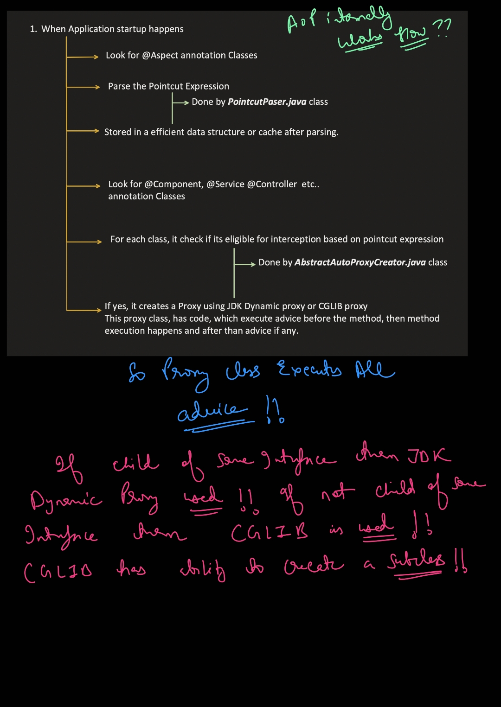
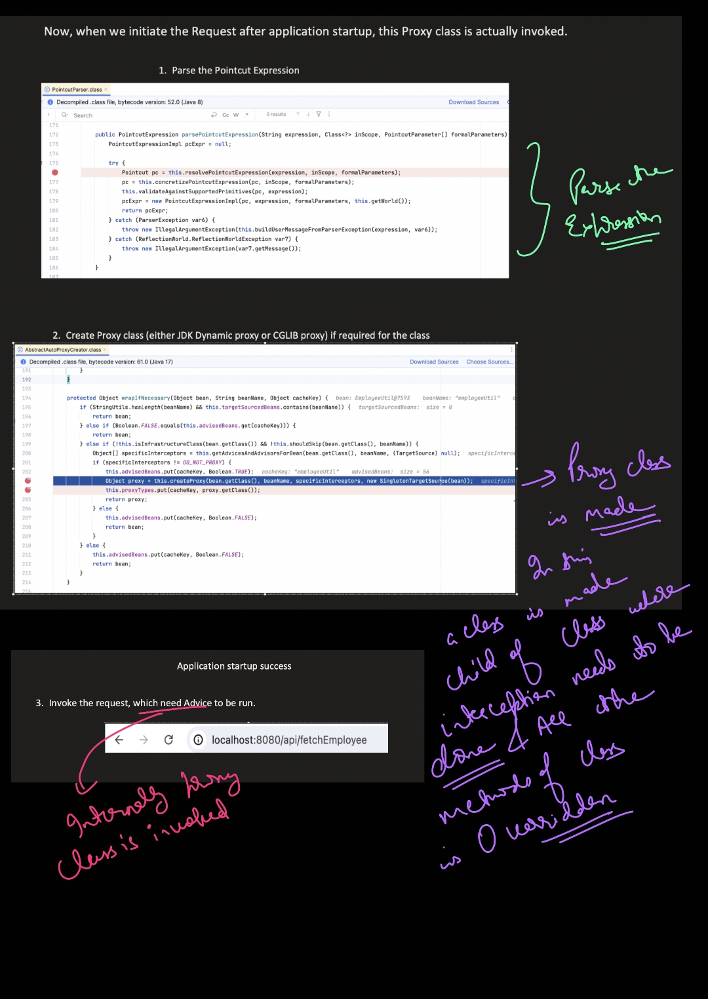
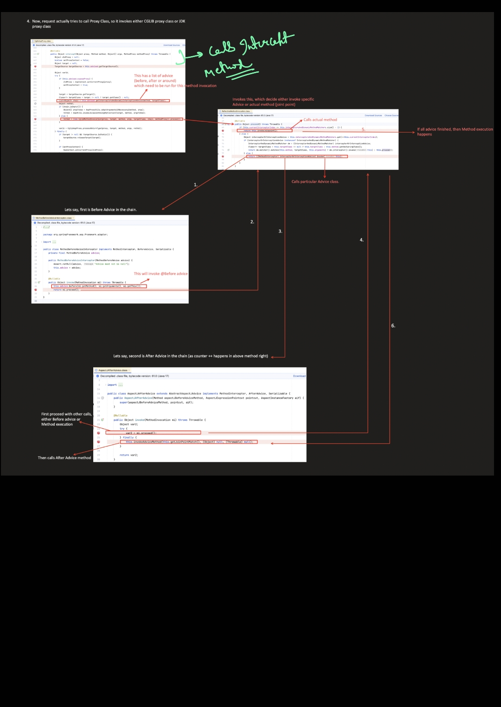

## 1. What is AOP?

- **AOP** stands for **Aspect Oriented Programming**.
- It is a programming paradigm that helps separate **cross-cutting concerns** from core business logic.
- **Cross-cutting concerns** are parts of an application that span across multiple modules and layers, such as:
  - 📝 **Logging**
  - 🔒 **Security / Authentication**
  - 💾 **Transaction Management** (`@Transactional`)
  - ⏱️ **Performance Monitoring / Metrics**
  - ⚠️ **Exception Handling**
  - ⚡ **Caching**
  - 🛡️ **Auditing**
- **Benefits:** Improves code modularity, maintainability, clean code architecture, and eliminates repetitive boilerplate code.



---

## 2. AOP Core Terminology

| Term | Definition | Key Annotation / Example |
|---|---|---|
| **Aspect** | A modular class that encapsulates cross-cutting advice and pointcuts. | `@Aspect` |
| **Join Point** | A specific point in the execution of a program where an aspect can be plugged in (In Spring AOP: **Method execution**). | `JoinPoint`, `ProceedingJoinPoint` |
| **Advice** | The actual action or code executed at a specific join point. | `@Before`, `@After`, `@Around`, etc. |
| **Pointcut** | A predicate expression that matches join points (specifies *WHERE* advice should be applied). | `@Pointcut("execution(* com.service.*.*(..))")` |
| **Weaving** | The process of linking aspects with target beans to create advised proxy objects (done at **Runtime** in Spring AOP). | Dynamic Proxy creation |
| **Target Object** | The original raw business bean being advised by one or more aspects. | e.g. `UserServiceImpl` |
| **AOP Proxy** | The dynamic wrapper object created by Spring AOP that implements the aspect contracts. | JDK Dynamic Proxy or CGLIB Proxy |
| **Introduction** | Declaring additional methods or interfaces dynamically on advised target classes. | `@DeclareParents` |

---

## 3. How AOP Works in Spring (Proxy Mechanism)

1. Spring creates a **proxy object** wrapping the target bean.
2. When a client calls a method on the proxy, Spring checks if any aspect's **pointcut matches**.
3. If matched, the **advice** executes at that join point (e.g. `@Before`).
4. Then the **actual target method** executes.
5. Control returns to the proxy and any **after advice** (e.g. `@AfterReturning`, `@After`) executes.
6. Control returns to the caller.

> [!NOTE]
> **Proxy-Based Approach in Spring:**
> - **Target implements interface(s)** $\rightarrow$ Spring uses **JDK Dynamic Proxy**.
> - **Target does NOT implement interface** $\rightarrow$ Spring uses **CGLIB Proxy** (subclassing).

---

## 4. Enabling AOP in Spring Boot

### Step 1: Add Dependency (Starter)
*(Included automatically in `spring-boot-starter-web` or add explicitly)*

```xml
<dependency>
    <groupId>org.springframework.boot</groupId>
    <artifactId>spring-boot-starter-aop</artifactId>
</dependency>
```

### Step 2: Enable AspectJ AutoProxy
Add `@EnableAspectJAutoProxy` to your main configuration class:

```java
@SpringBootApplication
@EnableAspectJAutoProxy // Enables Spring AOP proxy generation
public class DemoApplication {
    public static void main(String[] args) {
        SpringApplication.run(DemoApplication.class, args);
    }
}
```

---

## 5. Join Points Supported in Spring AOP

Spring AOP supports **only Method Execution join points**:
- 🟢 **Before method execution** (`@Before`)
- 🔵 **After method execution** (`@After` / finally)
- 🟢 **After returning from method** (`@AfterReturning`)
- 🔴 **After throwing exception** (`@AfterThrowing`)
- 🔄 **Around method execution** (`@Around`)

---

## 6. Pointcut Expressions (AspectJ Expression Language)

Pointcuts define the pattern to match join points.



### Common Pointcut Designators & Examples:

| Pointcut Expression | Matches What |
|---|---|
| `execution(* com.example.service.*.*(..))` | All methods in all classes inside `com.example.service` package. |
| `execution(public * *(..))` | All `public` methods across the entire application. |
| `execution(* *..Repository.*(..))` | All methods in any class ending with `Repository`. |
| `within(com.example..*)` | All join points within the `com.example` package and its subpackages. |
| `@annotation(com.example.LogExecution)` | Any method annotated with custom `@LogExecution` annotation. |
| `args(String, ..)` | Any method where the first parameter is of type `String`. |
| `@within(org.springframework.stereotype.Service)` | Any method inside classes annotated with `@Service`. |

---

## 7. Advice Types & Lifecycle



### Advice Types Breakdown:

| Annotation | Advice Type | When It Runs | Method Signature | Typical Use Case |
|---|---|---|---|---|
| `@Before` | Before Advice | Before the join point executes | `void logBefore(JoinPoint jp)` | Security checks, logging entry |
| `@After` | After (Finally) Advice | After join point completes (whether success or error) | `void logAfter(JoinPoint jp)` | Resource cleanup, audit trace |
| `@AfterReturning` | After Returning Advice | Only after join point **completes successfully** | `void logSuccess(JoinPoint jp, Object result)` | Logging return values, caching |
| `@AfterThrowing` | After Throwing Advice | Only if join point **throws an exception** | `void logError(JoinPoint jp, Exception ex)` | Error logging, alerting, notifications |
| `@Around` | Around Advice | **Surrounds** join point (before & after) | `Object logAround(ProceedingJoinPoint pjp) throws Throwable` | Performance timer, transaction management, caching |

---

### Complete Aspect Code Example:

```java
@Aspect
@Component
public class LoggingAspect {

    // 1. Before Advice
    @Before("execution(* com.example.service.*.*(..))")
    public void logBefore(JoinPoint joinPoint) {
        System.out.println("[BEFORE] Method: " + joinPoint.getSignature().getName());
    }

    // 2. After Returning Advice
    @AfterReturning(
        pointcut = "execution(* com.example.service.*.*(..))", 
        returning = "result"
    )
    public void logAfterReturning(JoinPoint joinPoint, Object result) {
        System.out.println("[AFTER RETURNING] Method: " + joinPoint.getSignature().getName() + " -> Result: " + result);
    }

    // 3. After Throwing Advice
    @AfterThrowing(
        pointcut = "execution(* com.example.service.*.*(..))", 
        throwing = "ex"
    )
    public void logAfterThrowing(JoinPoint joinPoint, Exception ex) {
        System.out.println("[AFTER THROWING] Method: " + joinPoint.getSignature().getName() + " -> Exception: " + ex.getMessage());
    }

    // 4. After (Finally) Advice
    @After("execution(* com.example.service.*.*(..))")
    public void logAfter(JoinPoint joinPoint) {
        System.out.println("[AFTER (FINALLY)] Method: " + joinPoint.getSignature().getName());
    }

    // 5. Around Advice (Performance Monitoring)
    @Around("execution(* com.example.service.*.*(..))")
    public Object logAround(ProceedingJoinPoint pjp) throws Throwable {
        System.out.println("[AROUND - BEFORE] " + pjp.getSignature().getName());
        long start = System.currentTimeMillis();

        Object result = pjp.proceed(); // 🌟 Proceeds to the actual target method

        long end = System.currentTimeMillis();
        System.out.println("[AROUND - AFTER] Time taken: " + (end - start) + " ms");
        return result;
    }
}
```

---

## 8. Important Annotations in Spring AOP

| Annotation | Purpose |
|---|---|
| `@Aspect` | Marks a Java class as an Aspect. |
| `@Component` | Registers the aspect class as a Spring-managed bean. |
| `@EnableAspectJAutoProxy` | Enables automatic proxy creation for `@Aspect` classes. |
| `@Before` | Executes advice before method execution. |
| `@After` | Executes advice after method execution (finally block). |
| `@AfterReturning` | Executes advice after successful method completion. |
| `@AfterThrowing` | Executes advice if method throws an exception. |
| `@Around` | Surrounds the method execution (most powerful advice). |
| `@Pointcut` | Declares a reusable pointcut signature. |
| `@DeclareParents` | Introduction: Dynamically adds new interfaces/methods to target beans. |
| `@Order` | Specifies the execution precedence of multiple aspects. |

---

## 9. Reusable `@Pointcut` Declaration Example

Instead of duplicating long pointcut expressions in every advice, declare a reusable `@Pointcut` method:

```java
@Aspect
@Component
public class CommonPointcuts {

    // Define reusable pointcut
    @Pointcut("execution(* com.example.service.*.*(..))")
    public void serviceLayer() {}
}

@Aspect
@Component
public class SecurityAspect {

    // Reference the reusable pointcut
    @Before("com.example.aspect.CommonPointcuts.serviceLayer()")
    public void checkSecurity() {
        System.out.println("[Security Check] Validating permissions...");
    }
}
```

---

## 10. Aspect Precedence with `@Order`

When multiple aspects advise the same join point, use `@Order` to control execution sequence:

> **Rule:** **Lower order number = Higher priority** (runs first before method, and runs last after method).

```java
@Aspect
@Component
@Order(1) // 🥇 Runs 1st
public class SecurityAspect { ... }

@Aspect
@Component
@Order(2) // 🥈 Runs 2nd
public class LoggingAspect { ... }
```

---

## 11. Proxies in Spring AOP

- Spring AOP generates a **proxy object** for each target bean.
- **JDK Dynamic Proxy:** Used when the target class implements at least one interface.
- **CGLIB Proxy:** Used when the target class does not implement any interface (subclassing).
- *Note:* `final` methods cannot be advised when using CGLIB proxies.

---

## 12. Limitations of Spring AOP

- Only **method execution join points** are supported.
- **Cannot intercept:**
  - ❌ Constructor calls
  - ❌ Field access (getters/setters direct memory reads)
  - ❌ Static methods
  - ❌ `final` methods (with CGLIB)
  - ❌ `private` methods (due to proxy inheritance rules)
- **Self-Invocation:** Calling `this.methodB()` from inside `methodA()` of the same bean bypasses the proxy.

---

## 13. Complete Execution Flow & Key Takeaways

1. **Client** calls a method on the Spring bean (proxy).
2. **Proxy** checks if the method matches any pointcut expressions.
3. If matched $\rightarrow$ executes appropriate `@Before` / `@Around` advice.
4. **Target method** executes.
5. If success $\rightarrow$ executes `@AfterReturning`. If exception $\rightarrow$ executes `@AfterThrowing`.
6. Executes `@After` (finally).
7. Control returns to the caller.

---

           

---

## Can Spring AOP Intercept `private` Methods?

**Short Answer:** **NO.** Standard Spring AOP **cannot** intercept `private` methods.

---

### Why? (The Technical Mechanism)

Spring AOP is **proxy-based** (not bytecode modification). It works by creating a proxy object around your Spring bean at runtime:

1. **CGLIB Proxy (Subclassing):**
   - Spring creates a runtime subclass: `class MyService$$EnhancerBySpringCGLIB extends MyService`.
   - In Java, a subclass **cannot override** or even see a `private` method of its parent class. Therefore, the proxy has no way to intercept it.
   ```java
   // What Spring CGLIB generates under the hood:
   public class MyService$$EnhancerBySpringCGLIB extends MyService {
       
       @Override
       public void publicMethod() {
           // Intercepts and adds advice ✅
           super.publicMethod();
       }

       // ❌ CANNOT override private methods due to Java visibility rules!
   }
   ```

2. **JDK Dynamic Proxy (Interface Implementation):**
   - JDK dynamic proxies implement interfaces.
   - Java interfaces **only define `public` methods**, so `private` methods cannot exist on the proxy.

3. **Spring AOP Join Points:**
   - Spring AOP explicitly supports **only method execution join points for `public` methods** on Spring-managed beans.

---

### Comparison: Spring AOP vs Full AspectJ

| Feature | Spring AOP (Default in Spring Boot) | Full AspectJ (CTW / LTW) |
|---|:---:|:---:|
| **Mechanism** | Runtime Proxy (CGLIB / JDK Dynamic) | Direct Bytecode Weaving (`.class` file modified) |
| **Can intercept `private` methods?** | ❌ **NO** | ✅ **YES** |
| **Can intercept `final` methods/classes?** | ❌ **NO** | ✅ **YES** |
| **Can intercept self-invocation (`this.method()`)?** | ❌ **NO** | ✅ **YES** |
| **Extra compiler / JVM agent needed?** | ❌ No (Built-in) | ✅ Yes (`ajc` compiler or `-javaagent`) |

---

### Key Takeaway for Interviews
> *"Spring AOP cannot intercept private methods because it uses runtime proxies (CGLIB / JDK). In Java, a proxy subclass cannot override private methods. Only Full AspectJ with bytecode weaving can intercept private methods."*
