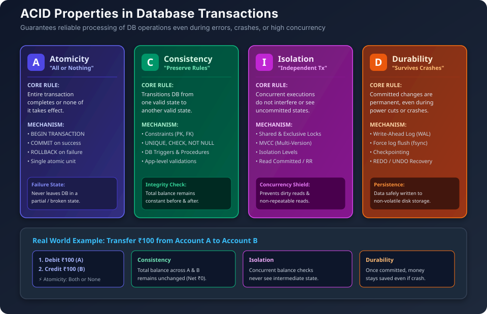
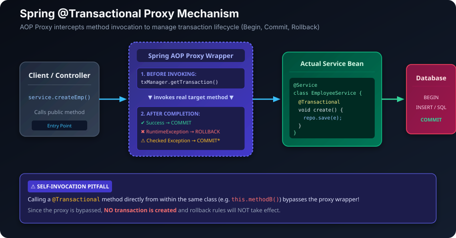
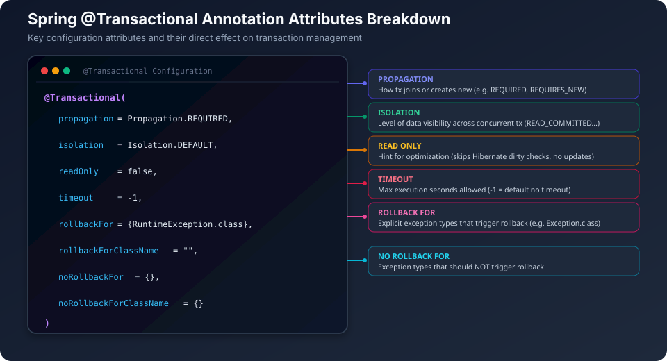
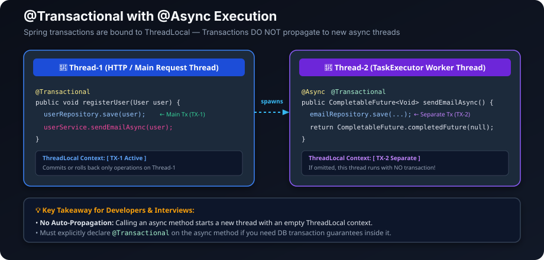

## ACID Properties in Databases

ACID properties are a set of guidelines that guarantee reliable processing of database transactions, even in the event of errors, failures, or concurrent access.



### Properties Overview

| Property | Meaning | What it means | How we maintain this property |
|---|---|---|---|
| **1. Atomicity**<br>*(All or Nothing)* | Either the whole transaction is completed or none of it is. | • If any part of the transaction fails, the entire transaction is rolled back.<br>• Database is never left in a partial state. | ① Using `BEGIN TRANSACTION`, `COMMIT` / `ROLLBACK`<br>② If an error occurs, `ROLLBACK` is executed.<br>③ All operations are treated as a single unit of work. |
| **2. Consistency**<br>*(Preserve Rules)* | A transaction takes the database from one valid state to another valid state. | • All integrity constraints (`PK`, `FK`, `UNIQUE`, `CHECK`, `NOT NULL`) are not violated.<br>• Business rules remain true before and after the transaction. | ① Enforce constraints (`PK`, `FK`, `UNIQUE`, `CHECK`, `NOT NULL`).<br>② Use triggers, validations, and stored procedures.<br>③ Application-level checks before `COMMIT`. |
| **3. Isolation**<br>*(Independent Transactions)* | Concurrent transactions do not interfere with each other. | • Each transaction appears to be executed in isolation.<br>• Intermediate results of a transaction are not visible to others. | ① Concurrency Control:<br>&nbsp;&nbsp;• Locks (Shared, Exclusive locks)<br>&nbsp;&nbsp;• Timestamps<br>&nbsp;&nbsp;• MVCC (Multi-Version Concurrency Control)<br>② Set appropriate isolation levels:<br>&nbsp;&nbsp;`Read Uncommitted` → `Read Committed` → `Repeatable Read` → `Serializable` |
| **4. Durability**<br>*(Permanent Change)* | Once a transaction is committed, its changes are permanent even if the system fails. | • Committed data is saved permanently.<br>• System crash will not lose committed changes. | ① Write-Ahead Logging (WAL):<br>&nbsp;&nbsp;• Before data is written to the database, the log is written to stable storage.<br>&nbsp;&nbsp;• Log contains `<before image, after image>`.<br>② Force log to disk (`fsync`) before `COMMIT`.<br>③ On crash, use logs to `REDO` or `UNDO` transactions. |

---

### ACID Summary & Mnemonics

- **A - Atomicity** → *All or Nothing*
- **C - Consistency** → *Correctness*
- **I - Isolation** → *Independent*
- **D - Durability** → *Data survives crash*

---

### Example: Transfer ₹100 from A/c A to A/c B

1. Debit ₹100 from A
2. Credit ₹100 to B

- **Atomicity** → Both steps happen or none.
- **Consistency** → Total money remains the same.
- **Isolation** → Other transactions don't see partial transfer.
- **Durability** → Once committed, even if system crashes, transfer is preserved.

---

### How Database Systems Help

- Transactions
- Locking & Concurrency control
- Constraints & Triggers
- Write-Ahead Logging (WAL)
- Recovery Manager (Crash Recovery)
- Checkpoints

---

## `@Transactional` in Spring Overview

### What is `@Transactional`?

- It is used to declare that a method (or class) should run within a database transaction.
- If an error occurs, the transaction is rolled back.
- If everything is successful, the transaction is committed.
- It works with Spring's transaction manager and underlying database (through `DataSource` / `JPA` / `Hibernate`).



### Basic Usage

```java
@Service
public class EmployeeService {
    @Transactional
    public void createEmployee(Employee e) {
        employeeRepository.save(e);
        // If this method completes successfully → COMMIT
        // If any RuntimeException occurs → ROLLBACK
    }
}
```

### Default Behavior

- **Propagation:** `REQUIRED`
- **Isolation:** `DEFAULT` (depends on database)
- **Read Only:** `false`
- **Timeout:** `-1` (no timeout)
- **Rollback:** `RuntimeException` and `Error`
- **Commit:** Checked `Exception` (unless configured)

---

### All Properties of `@Transactional`



```java
@Transactional(
    propagation = Propagation.REQUIRED,    // How transaction joins or creates
    isolation = Isolation.DEFAULT,         // Level of data isolation
    readOnly = false,                      // Hint for read-only operations (no update, better performance)
    timeout = -1,                          // Max time in seconds
    rollbackFor = RuntimeException.class,  // Exceptions that should rollback
    rollbackForClassName = "",
    noRollbackFor = {},                    // Exceptions that should NOT rollback
    noRollbackForClassName = {}
)
```

---

### Propagation Options
*(Defines how transaction behaves when called inside another transaction)*

| Propagation | Description |
|---|---|
| `REQUIRED` (default) | Join existing or create new |
| `REQUIRES_NEW` | Suspend current and create new |
| `SUPPORTS` | Join if exists, else run without transaction |
| `NOT_SUPPORTED` | Run without transaction (suspend if exists) |
| `MANDATORY` | Must run inside transaction, else exception |
| `NEVER` | Must not run inside transaction, else exception |
| `NESTED` | Nested transaction (savepoint). Works with JDBC (not with JPA in all cases) |

---

### Isolation Levels
*(Defines visibility of data between transactions)*

| Isolation | Description |
|---|---|
| `DEFAULT` | Use database default |
| `READ_UNCOMMITTED` | Can read uncommitted data (dirty read possible) |
| `READ_COMMITTED` | Can read only committed data (prevents dirty read) |
| `REPEATABLE_READ` | Same data in multiple reads (prevents non-repeatable read) |
| `SERIALIZABLE` | Fully isolated (prevents phantom read) |

---

### With `@Async`

- `@Async` runs method in another thread.
- Transaction does **NOT** automatically propagate to new thread.
- If you need transaction in async method → add `@Transactional` on that method.



```java
@Service
public class UserService {
    @Async
    @Transactional
    public CompletableFuture<Void> sendEmailAsync(User user) {
        // runs in another thread
        emailRepository.save(...);
        return CompletableFuture.completedFuture(null);
    }
}

// Calling it
@Transactional
public void registerUser(User user) {
    userRepository.save(user);          // in main tx
    userService.sendEmailAsync(user);   // new thread, its own transaction
}
```

---

### Key Properties Summary

#### 1. Rollback Rules
- By default → `RuntimeException` & `Error` → rollback
- Checked `Exception` → commit no rollback here
- Customize using `rollbackFor` / `noRollbackFor`:
```java
@Transactional(rollbackFor = {Exception.class})
public void method() {
    // now even checked exception will rollback
}
```

#### 2. Read Only
- `readOnly = true` → hints that data will not change.
- Improves performance (skips dirty checking in some cases).
```java
@Transactional(readOnly = true)
public List<User> getAllUsers() {
    return userRepository.findAll();
}
```

#### 3. Timeout
- Set max time for transaction.
- If it exceeds → `TransactionTimedOutException`
```java
@Transactional(timeout = 5)
public void longRunningTask() {
    // must complete within 5 seconds
}
```

#### 4. Keep in Mind
- Works only on **`public`** methods (due to proxy).
- **Self-invocation** (calling another method in same class) will not work → transaction won't start.
- Works with proxies (**JDK dynamic proxy** or **CGLIB**).
- Works with `DataSourceTransactionManager` or `JpaTransactionManager`.

---


    


### How Spring implements it internally

Spring creates a **proxy** around your class:

```
You call → Proxy (opens transaction) → Your method → Proxy (commit/rollback)
```

- Before method: `BEGIN TRANSACTION`
- Method runs
- After method: `COMMIT` or `ROLLBACK`

This is why **self-invocation doesn't work**:
```java
// THIS WON'T WORK
public void methodA() {
    this.methodB(); // calling directly, bypasses proxy
}

@Transactional
public void methodB() { ... }
```
Because `this.methodB()` skips the proxy — no transaction opened.

---

### Rollback rules — most asked interview question

```java
@Transactional
public void doSomething() {
    // throws RuntimeException → ROLLBACK ✅
    // throws CheckedException → NO ROLLBACK ❌ (by default)
}
```

| Exception type | Default behavior |
|---|---|
| `RuntimeException` (unchecked) | Rollback |
| `Error` | Rollback |
| `Exception` (checked) | **NO rollback** |

To force rollback on checked exception:
```java
@Transactional(rollbackFor = Exception.class)
public void doSomething() throws Exception { }
```

To prevent rollback on specific exception:
```java
@Transactional(noRollbackFor = IllegalArgumentException.class)
```

---

**Most important to know: REQUIRED vs REQUIRES_NEW**

```java
@Transactional(propagation = Propagation.REQUIRES_NEW)
public void sendNotification() {
    // runs in its OWN transaction
    // even if outer transaction rolls back
    // notification still gets saved
}
```

Real use case: **audit logging** — even if main transaction fails, you want the audit log committed.

---


### Common interview gotchas:

**1. `@Transactional` on private method — does it work?**
→ ❌ No. Proxy can't intercept private methods. Must be public.

**2. Exception caught inside method — does it rollback?**

```java
@Transactional
public void doSomething() {
    try {
        riskyOperation();
    } catch(Exception e) {
        // swallowed — NO ROLLBACK ❌
        // Spring proxy never sees the exception!
    }
}
```

→ ❌ **No rollback — the transaction will COMMIT!**

#### Why does this happen? (Behind the Scenes):
Spring manages transactions using an **AOP Proxy** wrapper around your method. The proxy looks conceptually like this:

```java
// Conceptual pseudo-code of Spring's TransactionInterceptor (Proxy)
public void invokeProxy() {
    try {
        beginTransaction();           // 1. Open DB Transaction
        targetService.doSomething();  // 2. Execute your actual method
        commitTransaction();          // 3. If method returns normally ──> COMMIT!
    } catch (Throwable ex) {
        if (shouldRollback(ex)) {
            rollbackTransaction();    // 4. Only if exception bubbles up ──> ROLLBACK!
        }
    }
}
```

- When you catch and swallow the exception inside `doSomething()`, your method returns normally to the proxy.
- Because no exception escapes the method, the proxy thinks everything succeeded and executes **`commitTransaction()`**.

---

#### Dangerous Real-World Example (Money Lost):

```java
@Transactional
public void transferMoney(Long fromId, Long toId, Double amount) {
    try {
        accountRepo.debit(fromId, amount);   // Step 1: Debited ₹100 ✅
        
        accountRepo.credit(toId, amount);  // Step 2: Throws RuntimeException (DB connection error / constraint) ❌
    } catch (Exception e) {
        log.error("Transfer failed: " + e.getMessage());
        // Exception swallowed here!
    }
    // Result: Step 1 (Debit) gets COMMITTED permanently! ₹100 lost! 😱
}
```

---

#### How to Fix It Properly:

##### Solution 1: Re-throw the exception (Standard & Recommended)
Allow the exception to bubble up to the Spring proxy so it can trigger rollback automatically:

```java
@Transactional
public void transferMoney(Long fromId, Long toId, Double amount) {
    try {
        accountRepo.debit(fromId, amount);
        accountRepo.credit(toId, amount);
    } catch (Exception e) {
        log.error("Transfer failed, rolling back!", e);
        throw new CustomBusinessException("Transfer failed", e); // Bubble up as RuntimeException ✅
    }
}
```

##### Solution 2: Explicitly mark for rollback via `TransactionAspectSupport`
If you need to catch the exception and return a custom response (without throwing), manually mark the transaction status as rollback-only:

```java
@Transactional
public boolean transferMoney(Long fromId, Long toId, Double amount) {
    try {
        accountRepo.debit(fromId, amount);
        accountRepo.credit(toId, amount);
        return true;
    } catch (Exception e) {
        log.error("Error occurred: " + e.getMessage());
        
        // Explicitly tell Spring to ROLLBACK this transaction ✅
        TransactionAspectSupport.currentTransactionStatus().setRollbackOnly();
        return false; // Safely returns false without throwing exception to the caller
    }
}
```

###### **Will this 100% roll back the transaction?**
**Yes, absolutely!** Even though no exception is thrown and the method returns normally (e.g. `return false;`), Spring's transaction manager inspects the transaction status before committing:

```java
// Conceptual internal check inside Spring's TransactionInterceptor:
if (status.isRollbackOnly()) {
    txManager.rollback(status); // 🚨 EXECUTES FULL DB ROLLBACK!
} else {
    txManager.commit(status);   // Commits only if NOT marked rollback-only
}
```

- **When to use:** When you want to return a graceful response object (e.g., `Result.failure("Insufficient funds")`) instead of bubbling an exception to the client/controller, while ensuring all partial DB writes are completely discarded.
- **Gotcha:** `TransactionAspectSupport.currentTransactionStatus()` requires an active transaction. If invoked in a non-transactional method, it throws `NoTransactionException`.

---


**3. `@Transactional` on Class vs Method (Precedence & Overriding)**

#### Precedence Rule:
> **Method-level configuration ALWAYS overrides Class-level configuration.**

- **Class-Level `@Transactional`**: Serves as the **default configuration** for all `public` methods within that class.
- **Method-Level `@Transactional`**: Takes **highest priority** and overrides the class-level defaults specifically for that method.

---

#### Recommended Production Best-Practice Pattern:

A standard industry pattern is to set the entire service class to **`readOnly = true`** by default (for safety and Hibernate performance optimization), and only override specific mutation methods that write/update data:

```java
@Service
@Transactional(readOnly = true) // 🌟 1. CLASS-LEVEL DEFAULT: Read-Only for all methods
public class UserService {

    @Autowired
    private UserRepository userRepository;
    @Autowired
    private AuditRepository auditRepository;

    // ──────────────────────────────────────────────────────────────────────────
    // Case 1: Inherits class-level configuration
    // ──────────────────────────────────────────────────────────────────────────
    // Runs with: readOnly = true, propagation = REQUIRED, timeout = -1
    // Optimization: Hibernate disables dirty-checking snapshot creation
    public User getUserById(Long id) {
        return userRepository.findById(id)
                .orElseThrow(() -> new UserNotFoundException(id));
    }

    // ──────────────────────────────────────────────────────────────────────────
    // Case 2: Method-level overrides 'readOnly'
    // ──────────────────────────────────────────────────────────────────────────
    // Overrides class-level readOnly=true with default readOnly=false (Read-Write)
    @Transactional
    public User createUser(User user) {
        return userRepository.save(user);
    }

    // ──────────────────────────────────────────────────────────────────────────
    // Case 3: Method-level overrides 'propagation' & 'rollbackFor'
    // ──────────────────────────────────────────────────────────────────────────
    // Runs in its own independent transaction (T2) and rolls back on all checked exceptions
    @Transactional(propagation = Propagation.REQUIRES_NEW, rollbackFor = Exception.class)
    public void logUserAction(String action) throws Exception {
        auditRepository.save(new AuditLog(action));
    }
}
```

---

#### Comparison Summary:

| Aspect | Class-Level `@Transactional` | Method-Level `@Transactional` |
|---|---|---|
| **Scope** | Applies to **all public methods** in the class. | Applies **only to the annotated method**. |
| **Priority** | Lower (acts as fallback / default baseline). | **Highest priority** (overrides class settings). |
| **Best Use Case** | Setting baseline settings like `readOnly = true` or standard rollback rules across the service. | Customizing write operations, setting `REQUIRES_NEW`, custom timeouts, or specific `rollbackFor` rules. |


