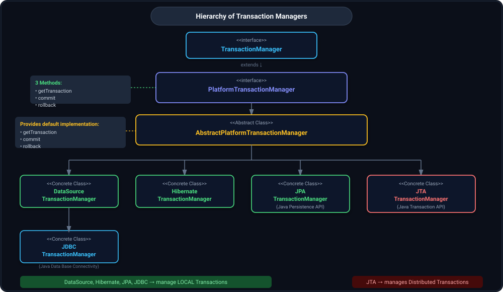
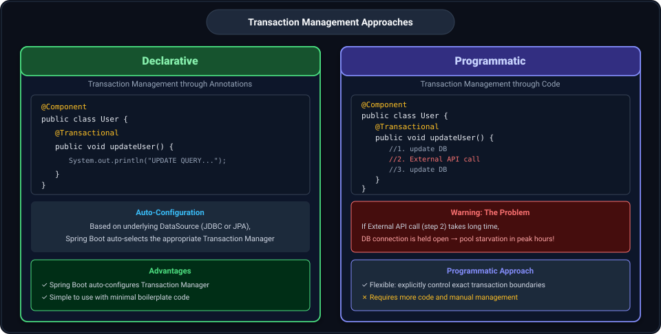
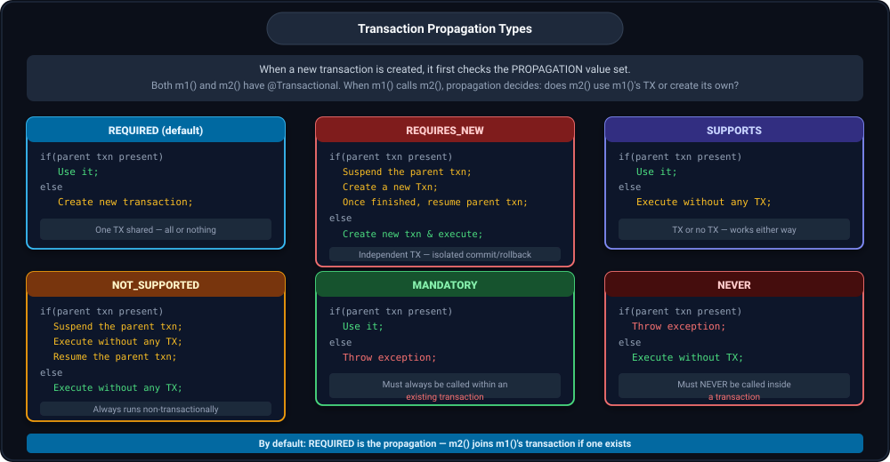
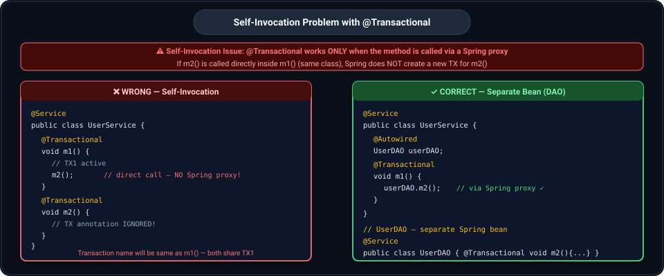

## 1. Hierarchy of Transaction Managers



`TransactionManager` is the top-level interface — it has nothing (no methods of its own).

`PlatformTransactionManager` extends `TransactionManager` and defines **3 core methods**:
- `getTransaction`
- `commit`
- `rollback`

`AbstractPlatformTransactionManager` is an abstract class that **provides default implementations** of the 3 methods above. Child classes can override specific things according to their needs.

Based on the type of DB you are using (whether JDBC, Hibernate, JPA, etc.) there are different implementations of the transaction manager. But **all the method signatures are defined in `PlatformTransactionManager`**.

#### Concrete Implementations (all manage LOCAL Transactions):
| Class | Notes |
|---|---|
| `DataSourceTransactionManager` | Direct JDBC — you write queries |
| `JDBCTransactionManager` | Extends DataSourceTransactionManager |
| `HibernateTransactionManager` | For Hibernate |
| `JPATransactionManager` | For JPA (Java Persistence API) — create entities mapped to tables, no need to write queries |

#### `JTATransactionManager` — for Distributed Transactions:
- JTA (Java Transaction API) manages **distributed transactions** spanning multiple databases or resources.
- For local transactions, use any of: JDBC, Hibernate, JPA, etc.

The child implementations (DataSource TM, JPA TM) add any specific additional behaviour they need on top of what `AbstractPlatformTransactionManager` already provides.


**Why is the problem?** If you put `@Transactional` on a method that makes an external API call or third party call, the API/third party connection takes time and the **DB connection will be held open the entire time**. This can choke the system during peak hours — do not use `@Transactional` in such cases.


---

## 2. Transaction Management Approaches



There are **2 ways** to implement transaction management in Spring:

### Declarative — Using Annotations

Transaction management through annotations.

```java
@Component
public class User {

    @Transactional
    public void updateUser() {
        System.out.println("UPDATE QUERY TO update the user db values");
    }
}
```

- Based on the underlying DataSource used (JDBC or JPA), Spring Boot automatically chooses the appropriate Transaction Manager.
- Spring Boot hides a lot of things — it chooses the Transaction Manager on its own and does autoconfiguration.

### Programmatic — Using Code

```java
@Component
public class User {

    @Transactional
    public void updateUser() {
        //1. update DB
        //2. External API call
        //3. update DB
    }
}
```


In programmatic approach, we control exactly when transactions open and close, so we can wrap only the DB operations in a transaction and skip the external API call.

---

## 3.Declarative Transaction Management

#### `AppConfig`:
```java
@Configuration
public class AppConfig {

    @Bean
    public DataSource dataSource() {
        DriverManagerDataSource dataSource = new DriverManagerDataSource();
        dataSource.setDriverClassName("org.h2.Driver");
        dataSource.setUrl("jdbc:h2:mem:testdb");
        dataSource.setUsername("sa");
        dataSource.setPassword("");
        return dataSource;
    }

    @Bean
    public PlatformTransactionManager userTransactionManager(DataSource dataSource) {
        return new DataSourceTransactionManager(dataSource);
    }
}
```
See Directly using  `PlatformTransactionManager`


```java
@Component
public class UserDeclarative {

    @Transactional(transactionManager = "userTransactionManager")
    public void updateUserProgrammatic() {
        //SOME DB OPERATIONS
        System.out.println("Insert Query ran");
        System.out.println("Update Query ran");
    }
}
```

On `@Transactional` we tell which `transactionManager` to choose because there are two — one Spring Boot creates by default, and one we defined by telling the method name on  `transactionManager=`.

## 4.Programmatic Transaction Management 

### 4.1  Approach 1: 

#### `AppConfig`:
```java
@Configuration
public class AppConfig {

    @Bean
    public DataSource dataSource() {
        DriverManagerDataSource dataSource = new DriverManagerDataSource();
        dataSource.setDriverClassName("org.h2.Driver");
        dataSource.setUrl("jdbc:h2:mem:testdb");
        dataSource.setUsername("sa");
        dataSource.setPassword("");
        return dataSource;
    }

    @Bean
    public PlatformTransactionManager userTransactionManager(DataSource dataSource) {
        return new DataSourceTransactionManager(dataSource);
    }
}
```
#### Manual TX management via `PlatformTransactionManager`:
```java
@Component
public class UserProgrammaticApproach1 {

    PlatformTransactionManager userTransactionManager;

    UserProgrammaticApproach1(PlatformTransactionManager userTransactionManager) {
        this.userTransactionManager = userTransactionManager;
    }

    public void updateUserProgrammatic() {
        TransactionStatus status = userTransactionManager.getTransaction(null);
        try {
            //SOME INITIAL SET OF DB OPERATIONS
            System.out.println("Insert Query run1");
            System.out.println("Update Query run1");
            userTransactionManager.commit(status);
        }
        catch (Exception e) {
            userTransactionManager.rollback(status);
        }
    }
}
```

First we get a transaction via `getTransaction`. In the try block we do operations and call `commit()`. If any error occurs, `rollback()` is called.

---

### 4.2 Programmatic Transaction Management — Approach 2: `TransactionTemplate`

`TransactionTemplate` is a **wrapper around `getTransaction`, `commit`, and `rollback`**. These are handled by the template — we just write business logic.

#### Updated `AppConfig` with `TransactionTemplate` bean:
```java
@Configuration
public class AppConfig {

    @Bean
    public DataSource dataSource() {
        DriverManagerDataSource dataSource = new DriverManagerDataSource();
        dataSource.setDriverClassName("org.h2.Driver");
        dataSource.setUrl("jdbc:h2:mem:testdb");
        dataSource.setUsername("sa");
        dataSource.setPassword("");
        return dataSource;
    }

    @Bean
    public PlatformTransactionManager userTransactionManager(DataSource dataSource) {
        return new DataSourceTransactionManager(dataSource);
    }

    @Bean
    public TransactionTemplate transactionTemplate(PlatformTransactionManager userTransactionManager) {
        return new TransactionTemplate(userTransactionManager);
    }
}
```

While creating `TransactionTemplate`, we need to pass the `TransactionManager` to it.

#### `UserProgrammaticApproach2`:
```java
@Component
public class UserProgrammaticApproach2 {

    TransactionTemplate transactionTemplate;

    public UserProgrammaticApproach2(TransactionTemplate transactionTemplate) {
        this.transactionTemplate = transactionTemplate;
    }

    public void updateUserProgrammatic() {
        TransactionCallback<TransactionStatus> dbOperationsTask = (TransactionStatus status) -> {
            System.out.println("Insert Query ran");
            System.out.println("Update Query ran");
            return status;
        };
        TransactionStatus status = transactionTemplate.execute(dbOperationsTask);
    }
}
```

`execute()` takes a functional interface `TransactionCallback`. The template internally calls `getTransaction`, executes the callback, then calls `commit()` or `rollback()` depending on whether an exception is thrown. This is better than Approach 1 because we don't have to write `getTransaction`, `commit`, and `rollback` manually.

---

## 5. `TransactionTemplate.execute()` — Internal Source Code

```java
public class TransactionTemplate extends DefaultTransactionDefinition {

    @Override
    public void afterPropertiesSet() {
        if (this.transactionManager == null) {
            throw new IllegalArgumentException("Property 'transactionManager' is required");
        }
    }

    @Override
    @Nullable
    public <T> T execute(TransactionCallback<T> action) throws TransactionException {
        Assert.state(this.transactionManager != null, "No PlatformTransactionManager set");

        if (this.transactionManager instanceof CallbackPreferringPlatformTransactionManager cpptm) {
            return cpptm.execute(this, action);
        }
        else {
            TransactionStatus status = this.transactionManager.getTransaction(this);
            T result;
            try {
                result = action.doInTransaction(status);
            }
            catch (RuntimeException | Error ex) {
                // Transactional code threw application exception -> rollback
                rollbackOnException(status, ex);
                ...
```

`execute()` takes a functional interface `TransactionCallback` as input. Internally calls `getTransaction`, runs `doInTransaction`, and on `RuntimeException` triggers rollback.

Now let us see propagation. When we create a new transaction, it sees the propagation value.

---

## 6. Transaction Propagation

When we create a new transaction, it first checks the **PROPAGATION** value set. This tells whether we have to create a new transaction or not.

Suppose m1 and m2 are both methods having `@Transactional`. From m1 we call m2. Propagation decides: does the transaction of m2() use the same transaction as m1(), or does m2() get a separate new transaction?

```java
@Transactional
m1() {
    m2()
}

@Transactional
m2() {

}
```

Both methods are doing transactions. Propagation tells whether transaction of m2() is same as of m1() or m2() has a separate new transaction.



### REQUIRED (default propagation):
```java
@Transactional(propagation = Propagation.REQUIRED)
// if(parent txn present)
//     Use it;
// else
//     Create new transaction;
```

### REQUIRES_NEW:
```java
@Transactional(propagation = Propagation.REQUIRES_NEW)
// if(parent txn present)
//     Suspend the parent txn;
//     Create a new Txn and once finished;
//     Resume the parent txn;
// else
//     Create new transaction and execute the method;
```

### SUPPORTS:
```java
@Transactional(propagation = Propagation.SUPPORTS)
// if(parent txn present)
//     Use it;
// Else
//     Execute the method without any transaction;
```

### NOT_SUPPORTED:
```java
@Transactional(propagation = Propagation.NOT_SUPPORTED)
// if(parent txn present)
//     Suspend the parent txn;
//     Execute the method without any transaction;
//     Resume the parent txn;
// else
//     Execute the method without any transaction;
```

### MANDATORY:
```java
@Transactional(propagation = Propagation.MANDATORY)
// if(parent txn present)
//     Use it;
// Else
//     Throw exception;
```

### NEVER:
```java
@Transactional(propagation = Propagation.NEVER)
// if(parent txn present)
//     Throw exception;
// Else
//     Execute the method without any transaction;
```

In NEVER: the parent should also not have any transaction.

**By default REQUIRED is the propagation.**

---

## 7. Self-Invocation Problem — Critical Gotcha



**The biggest issue is self-invocation.** Spring's `@Transactional` works **only when the method is called via a Spring proxy** (not directly within the same class). If `m2()` is called directly inside `m1()` (same class), Spring **does not create a new transaction for `m2()`**.

```java
@RestController
public class UserController {
    @Autowired
    UserService userService;

    @GetMapping("/user")
    void getUser() {
        userService.m1();
    }
}
```

```java
@Service
public class UserService {

    @Transactional
    void m1() {
        System.out.println("Transaction Active :"
                + TransactionSynchronizationManager.isActualTransactionActive());
        System.out.println("Transaction Name :"
                + TransactionSynchronizationManager.getCurrentTransactionName());
        System.out.println("Some DB operation");
        m2();   // DIRECT CALL — Spring proxy is bypassed!
        System.out.println("Some DB operation");
    }

    @Transactional
    void m2() {
        System.out.println("Transaction Active :"
                + TransactionSynchronizationManager.isActualTransactionActive());
        System.out.println("Transaction Name :"
                + TransactionSynchronizationManager.getCurrentTransactionName());
        System.out.println("Some DB operation1");
        System.out.println("Some DB operation2");
    }
}
```

#### Output (WRONG — m2() uses m1()'s transaction, self-invocation bypassed proxy):
```text
initialization in 4 ms
Transaction Active :true
Transaction Name :com.app.mohit.UserService.m1
Some DB operation
Transaction Active :true
Transaction Name :com.app.mohit.UserService.m1     ← m2's name is still m1's!
Some DB operation1
Some DB operation2
Some DB operation
```

### Fix — Move m2() to a Separate Spring Bean (DAO):

```java
@Service
public class UserService {
    @Autowired
    UserDAO userDAO;

    @Transactional
    public void m1() {
        System.out.println("Transaction Active :" + TransactionSynchronizationManager.isActualTransactionActive());
        System.out.println("Transaction Name :" + TransactionSynchronizationManager.getCurrentTransactionName());
        System.out.println("Some DB operation");
        userDAO.m2();   // called via Spring proxy on a separate bean — works correctly
        System.out.println("Some DB operation");
    }
}
```

```java
@Service
public class UserDAO {

    @Transactional
    public void m2() {
        System.out.println("Transaction Active :" + TransactionSynchronizationManager.isActualTransactionActive());
        System.out.println("Transaction Name :" + TransactionSynchronizationManager.getCurrentTransactionName());
        System.out.println("Some DB operation1");
        System.out.println("Some DB operation2");
    }
}
```

### Where to Put `propagation` — On Parent or on Child?

A very common question: **Where should we specify the `propagation` attribute — on the parent (caller) or on the child (callee)?**

#### Short Answer:
**`propagation` is primarily specified on the CHILD (called) method.**

#### Detailed Explanation:
- **Parent (`m1()` in `UserService`)**: Starts or opens the initial transaction context for the overall business operation (e.g., `@Transactional` with default `REQUIRED`).
- **Child (`m2()` in `UserDAO`)**: Specifies `propagation` to define **how it wants to participate in (or isolate itself from) the parent's active transaction**.

| Method | Role | What it Controls |
| :--- | :--- | :--- |
| **Parent (`m1()`)** | Caller / Initiator | Establishes the initial transaction context for the business request. |
| **Child (`m2()`)** | Callee / Participant | **Dictates propagation behavior**: whether to join the parent's TX (`REQUIRED`), create its own independent TX (`REQUIRES_NEW`), execute non-transactionally (`NOT_SUPPORTED`), require an existing TX (`MANDATORY`), etc. |

#### Why Child Controls the Propagation Behavior:
1. When `m1()` calls `userDAO.m2()`, Spring's AOP proxy intercepts the call to `m2()`.
2. The proxy inspects the `@Transactional(propagation = ...)` attribute on `m2()`:
   - *"Is there an active parent transaction from `m1()`?"*
   - Based on `m2()`'s propagation setting, Spring decides whether to:
     - **Join** `m1()`'s existing transaction (`REQUIRED` — default)
     - **Suspend** `m1()`'s transaction and start a brand-new one (`REQUIRES_NEW`)
     - **Execute without** any transaction (`NOT_SUPPORTED`)
     - **Throw an exception** if no transaction exists (`MANDATORY`) or if a transaction exists (`NEVER`)

> [!NOTE]
> **Can we specify propagation on the Parent?**  
> Yes! But the parent's propagation only affects how the parent behaves relative to *its* caller (e.g., a Controller, REST endpoint, or Scheduled task).  
> To control the transactional relationship between the parent workflow and individual database/service operations, **you configure `propagation` on the child method**.

> [!IMPORTANT]
> **Proxy Requirement**: For the child's propagation to be evaluated, the child method **must be in a separate Spring Bean** (e.g., `UserDAO`) and injected into the parent bean. If called internally (`this.m2()`), the call bypasses Spring's AOP proxy and the child's propagation setting is completely ignored.

---

## 8. REQUIRED Propagation — Output Verified

With REQUIRED (default) and m2() in a separate DAO class:

```text
2025-03-04T22:50:47.772+05:30  INFO 58852 --- [01TransactionThread]
initialization in 0 ms
Transaction Active :true
Transaction Name :com.app.mohit.UserService.m1
Some DB operation
Transaction Active :true
Transaction Name :com.app.mohit.UserService.m1     ← m2() joined m1()'s TX (same name)
Some DB operation1
Some DB operation2
Some DB operation
```

m2()'s transaction name is still `UserService.m1` — it joined the parent transaction. No new TX was created.

---

## 9. REQUIRES_NEW Propagation — Output Verified

```java
@Service
public class UserDAO {

    @Transactional(propagation = Propagation.REQUIRES_NEW)
    public void m2() {
        System.out.println("Transaction Active :" + TransactionSynchronizationManager.isActualTransactionActive());
        System.out.println("Transaction Name :" + TransactionSynchronizationManager.getCurrentTransactionName());
        System.out.println("Some DB operation1");
        System.out.println("Some DB operation2");
    }
}
```

```text
2025-03-04T22:49:53.110+05:30  INFO 53184 --- [01TransactionThread]
initialization in 1 ms
Transaction Active :true
Transaction Name :com.app.mohit.UserService.m1
Some DB operation
Transaction Active :true
Transaction Name :com.app.mohit.UserDAO.m2          ← m2() has its own brand new TX!
Some DB operation1
Some DB operation2
Some DB operation
```

m2()'s transaction name is `UserDAO.m2` — a **separate new transaction** was created, m1()'s TX was suspended.

---

## 10. SUPPORTS Propagation — Output Verified

`SUPPORTS` on m1(), m2() has default REQUIRED:

```java
@Transactional(propagation = Propagation.SUPPORTS)
void m1() { ... userDAO.m2(); ... }
```

#### When called from Controller (no parent TX):
```text
initialization in 1 ms
Transaction Active :false                              ← m1() SUPPORTS, no parent → no TX
Transaction Name :com.app.mohit.UserService.m1
Some DB operation
Transaction Active :true                               ← m2() REQUIRED, creates its own TX
Transaction Name :com.app.mohit.UserDAO.m2
Some DB operation1
Some DB operation2
Some DB operation
```

#### When SUPPORTS is also put on m2():
```text
initialization in 2 ms
Transaction Active :false
Transaction Name :com.app.mohit.UserService.m1
Some DB operation
Transaction Active :false                              ← m2() SUPPORTS too, no parent → no TX either
Transaction Name :com.app.mohit.UserService.m1
Some DB operation1
Some DB operation2
Some DB operation
```

---

## 11. Propagation — Declarative Full Example with UserDeclarative and UserDAO

```java
@Component
public class UserDeclarative {

    @Autowired
    UserDAO userDAOobj;

    @Transactional
    public void updateUser() {
        System.out.println("Is transaction active: " + TransactionSynchronizationManager.isActualTransactionActive());
        System.out.println("Current transaction name: " + TransactionSynchronizationManager.getCurrentTransactionName());

        System.out.println("Some initial DB operation");
        userDAOobj.dbOperationWithRequiredPropagation();
        System.out.println("Some final DB operation");
    }

    public void updateUserFromNonTransactionalMethod() {
        System.out.println("Is transaction active: " + TransactionSynchronizationManager.isActualTransactionActive());
        System.out.println("Current transaction name: " + TransactionSynchronizationManager.getCurrentTransactionName());
        System.out.println("Some initial DB operation");
        userDAOobj.dbOperationWithRequiredPropagation();
        System.out.println("Some final DB operation");
    }
}
```

```java
@Component
public class UserDAO {

    @Transactional(propagation = Propagation.REQUIRED)
    /**
     * if(parent txn present)
     *      use it
     * else
     *      create new
     */
    public void dbOperationWithRequiredPropagation() {
        boolean isTransactionActive = TransactionSynchronizationManager.isActualTransactionActive();
        String currentTransactionName = TransactionSynchronizationManager.getCurrentTransactionName();
        System.out.println("****************************");
        System.out.println("Propagation.REQUIRED: Is parent transaction active: " + isTransactionActive);
        System.out.println("Propagation.REQUIRED: Current transaction name: " + currentTransactionName);
        System.out.println("****************************");
    }
}
```

#### Output from `updateUser()` (parent TX present):
```text
Is transaction active: true
Current transaction name: com.conceptandcoding.learningspringboot.TransactionManagement.UserDeclarative.updateUser
Some initial DB operation
****************************
Propagation.REQUIRED: Is parent transaction active: true
Propagation.REQUIRED: Current transaction name: com.conceptandcoding.learningspringboot.TransactionManagement.UserDeclarative.updateUser
****************************
Some final DB operation
```

#### Output from `updateUserFromNonTransactionalMethod()` (no parent TX):
```text
Is transaction active: false
Current transaction name: null
Some initial DB operation
****************************
Propagation.REQUIRED: Is parent transaction active: true
Propagation.REQUIRED: Current transaction name: com.conceptandcoding.learningspringboot.TransactionManagement.UserDAO.dbOperationWithRequiredPropagation
****************************
Some final DB operation
```

When called from a non-transactional method, the parent has no active TX, so REQUIRED creates a brand new transaction under `UserDAO.dbOperationWithRequiredPropagation`.

---

## 12. Propagation — Programmatic Way (Approach 1): `PlatformTransactionManager`

```java
@Component
public class UserDAO {

    PlatformTransactionManager userTransactionManager;

    UserDAO(PlatformTransactionManager userTransactionManager) {
        this.userTransactionManager = userTransactionManager;
    }

    /**
     * if(parent txn present) use it
     * else create new
     */
    public void dbOperationWithRequiredPropagationUsingProgrammaticApproach1() {
        DefaultTransactionDefinition transactionDefinition = new DefaultTransactionDefinition();
        transactionDefinition.setName("Testing REQUIRED propagation");
        transactionDefinition.setPropagationBehavior(TransactionDefinition.PROPAGATION_REQUIRED);
        TransactionStatus status = userTransactionManager.getTransaction(transactionDefinition);
        try {
            //EXECUTE operation
            System.out.println("****************************");
            System.out.println("Propagation.REQUIRED: Is transaction active: "
                    + TransactionSynchronizationManager.isActualTransactionActive());
            System.out.println("Propagation.REQUIRED: Current transaction name: "
                    + TransactionSynchronizationManager.getCurrentTransactionName());
            System.out.println("****************************");
            userTransactionManager.commit(status);
        }
        catch (Exception e) {
            userTransactionManager.rollback(status);
        }
    }
}
```

In DAO we pass a `DefaultTransactionDefinition` where we set the **name** and **propagation behaviour** programmatically.

---

## 13. Propagation — Programmatic Way (Approach 2): `TransactionTemplate`

#### `AppConfig` — set propagation on the `TransactionTemplate` bean:
```java
@Configuration
public class AppConfig {

    @Bean
    public DataSource dataSource() {
        DriverManagerDataSource dataSource = new DriverManagerDataSource();
        dataSource.setDriverClassName("org.h2.Driver");
        dataSource.setUrl("jdbc:h2:mem:testdb");
        dataSource.setUsername("sa2");
        dataSource.setPassword("");
        return dataSource;
    }

    @Bean
    public PlatformTransactionManager userTransactionManager(DataSource dataSource) {
        return new DataSourceTransactionManager(dataSource);
    }

    @Bean
    public TransactionTemplate transactionTemplate(PlatformTransactionManager userTransactionManager) {
        TransactionTemplate transactionTemplate = new TransactionTemplate(userTransactionManager);
        transactionTemplate.setPropagationBehavior(TransactionDefinition.PROPAGATION_REQUIRED);
        transactionTemplate.setName("TRANSACTION TEMPLATE REQUIRED PROPAGATION");
        return transactionTemplate;
    }
}
```

Here we set the **propagation behaviour** and give the transaction template a **name**.

#### `UserDAO` using `TransactionTemplate`:
```java
@Component
public class UserDAO {

    TransactionTemplate transactionTemplate;

    UserDAO(TransactionTemplate transactionTemplate) {
        this.transactionTemplate = transactionTemplate;
    }

    /**
     * if(parent txn present) use it
     * else create new
     */
    public void dbOperationWithRequiredPropagationUsingProgrammaticApproach2() {
        TransactionCallback<TransactionStatus> operations = (TransactionStatus status) -> {
            //some operations for this method
            System.out.println("****************************");
            System.out.println("Propagation.REQUIRED: Is transaction active: "
                    + TransactionSynchronizationManager.isActualTransactionActive());
            System.out.println("Propagation.REQUIRED: Current transaction name: "
                    + TransactionSynchronizationManager.getCurrentTransactionName());
            System.out.println("****************************");
            return status;
        };
        TransactionStatus status = transactionTemplate.execute(operations);
    }
}
```

#### Output — when parent TX exists (`updateUser()` is transactional):
```text
Is transaction active: true
Current transaction name: com.conceptandcoding.learningspringboot.TransactionManagement.UserDeclarative.updateUser
Some initial DB operation
****************************
Propagation.REQUIRED: Is  transaction active: true
Propagation.REQUIRED: Current transaction name: com.conceptandcoding.learningspringboot.TransactionManagement.UserDeclarative.updateUser
****************************
Some final DB operation
```

#### Output — when no parent TX (called from non-transactional method):
```text
Is transaction active: false
Current transaction name: null
Some initial DB operation
****************************
Propagation.REQUIRED: Is  transaction active: true
Propagation.REQUIRED: Current transaction name: TRANSACTION TEMPLATE REQUIRED PROPAGATION
****************************
Some final DB operation
```

When no parent TX exists, `TransactionTemplate` creates a new TX using its own configured name `"TRANSACTION TEMPLATE REQUIRED PROPAGATION"`.

---

## 14. Key Mental Model — Propagation Summary

| Propagation | If Parent TX Exists | If No Parent TX | Simple Memory Aid |
|---|---|---|---|
| `REQUIRED` | Join it | Create new | Share the TX — all in this together |
| `REQUIRES_NEW` | Suspend parent, create own, resume | Create new | I need my own TX — don't involve me in yours |
| `SUPPORTS` | Join it | Run without TX | TX or no TX — I'm fine either way |
| `NOT_SUPPORTED` | Suspend parent, run without TX, resume | Run without TX | Keep me out of any TX |
| `MANDATORY` | Join it | **Throw exception** | You MUST have a TX before calling me |
| `NEVER` | **Throw exception** | Run without TX | You must NOT have a TX when calling me |

**By default: REQUIRED is the propagation.**

> **Key mental model**: Think of it as — *"When Method B is called, what should it do with the existing transaction from Method A?"*