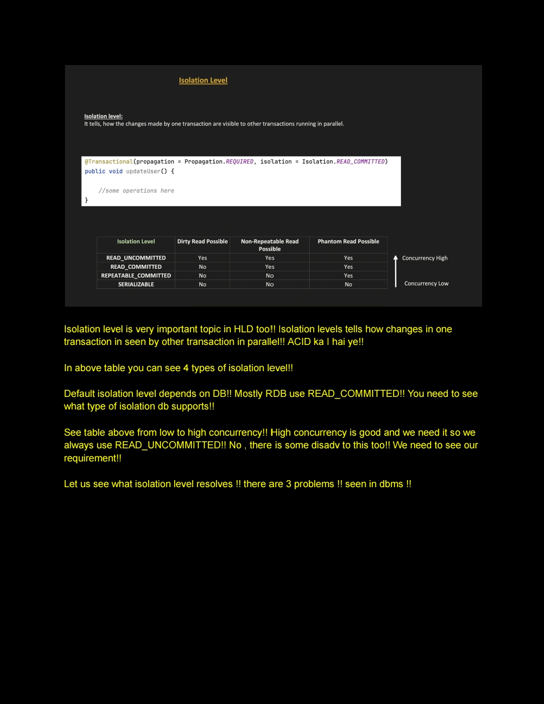
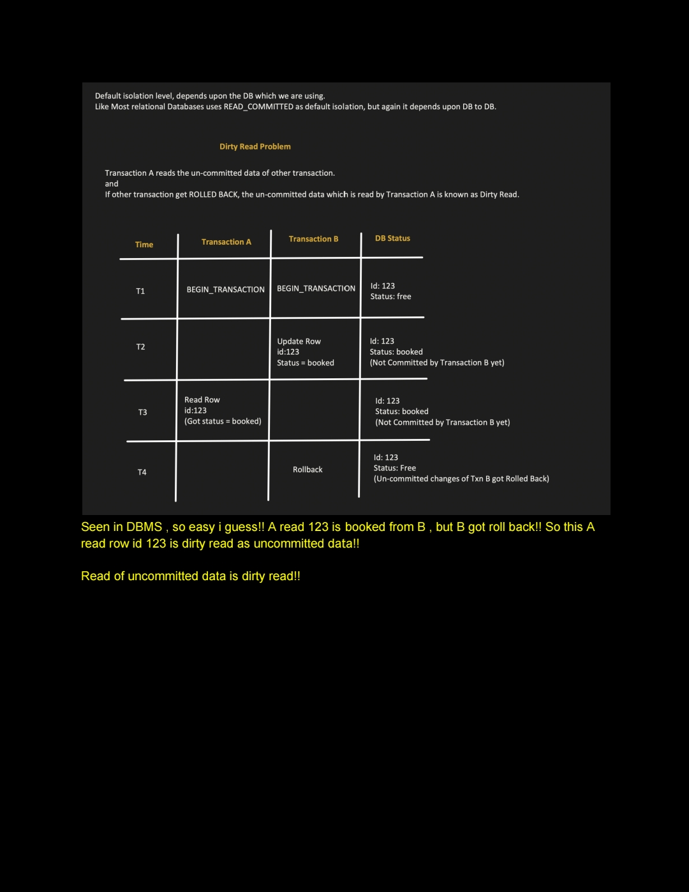
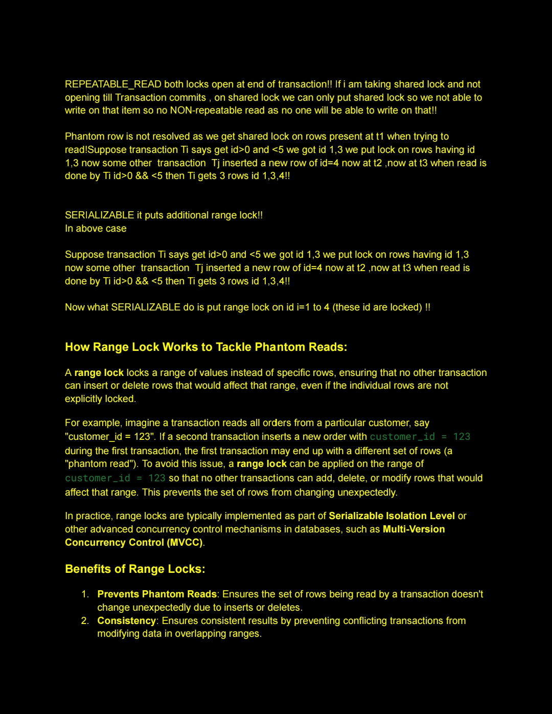
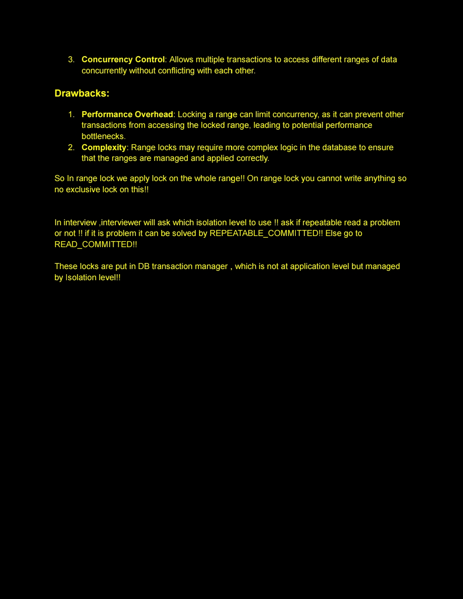

```
A — Atomicity    → All or nothing. Commit fully or rollback fully.
                   "No partial results left in DB"

I — Isolation    → One transaction cannot see another transaction's
                   in-progress (uncommitted) work
```


---

## Correct ACID breakdown

**Atomicity** — all steps succeed or all are undone
```
debitAccount(A)   ✓
creditAccount(B)  ✗ fails

→ debitAccount(A) is also rolled back
→ DB left as if nothing happened
```

**Consistency** — DB moves from one valid state to another valid state
```
Before transfer:  A = 1000, B = 500,  total = 1500
After transfer:   A = 700,  B = 800,  total = 1500  ← still valid
```

**Isolation** — running transactions are invisible to each other
```
TX A is in progress updating balance...
TX B cannot see TX A's uncommitted changes
```

**Durability** — once committed, data survives crashes
```
TX commits → written to disk
Server crashes 1 second later
Data still there after restart
```

---

## So where does Isolation Level fit?

ACID's **Isolation** in its pure form means:

> "A transaction in progress is completely invisible to others"

That is the **Serializable** level — the strictest one.

But databases said full isolation is too slow for real world apps. So they introduced **weaker levels** as a trade-off:

```
SERIALIZABLE      ← full ACID isolation (complete invisibility)
REPEATABLE_READ   ← partial isolation (some leakage allowed)
READ_COMMITTED    ← more leakage allowed
READ_UNCOMMITTED  ← almost no isolation (even dirty reads allowed)
```

So isolation levels are basically the database asking you:

> "How strictly do you want the I in ACID enforced?"

`@Transactional` alone just turns on a transaction. It does NOT enforce full ACID isolation by itself — it uses whatever the DB default is, which is usually `READ_COMMITTED`, not full `SERIALIZABLE`. That is why you still need to explicitly set isolation levels when you need stronger guarantees.


      