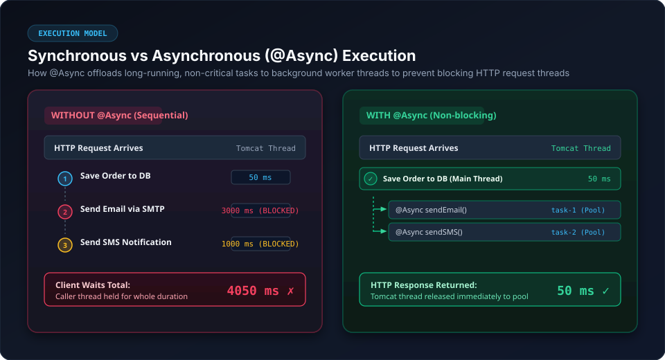
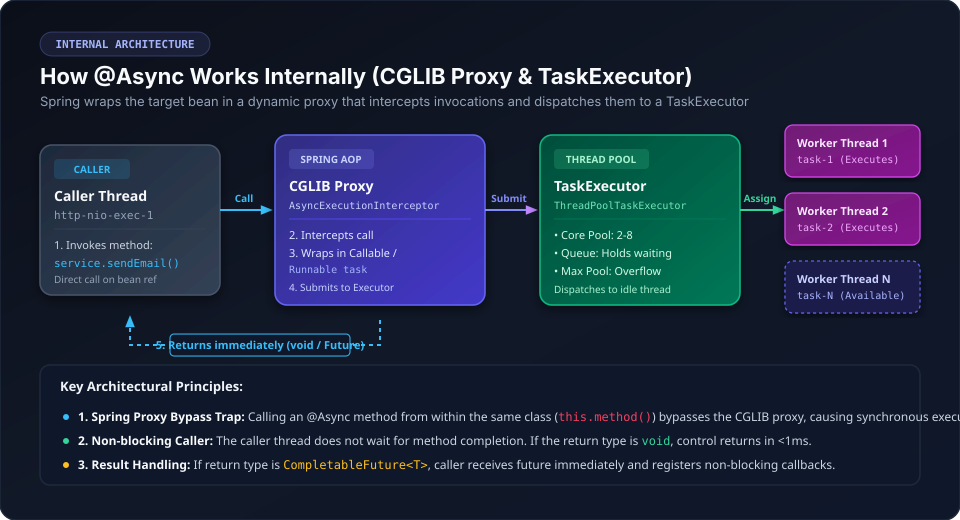
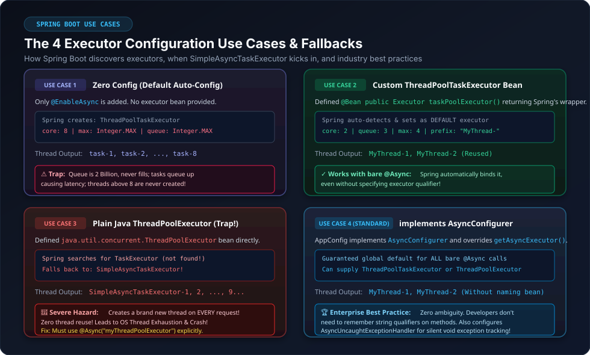
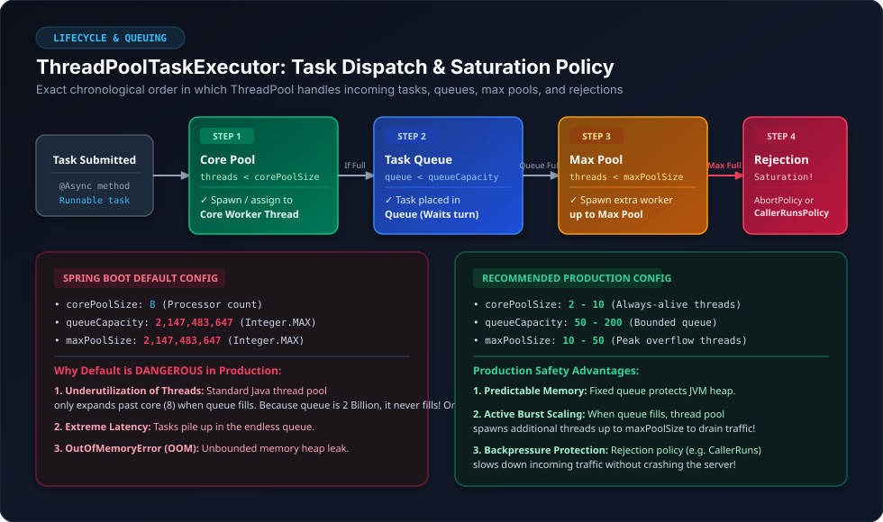
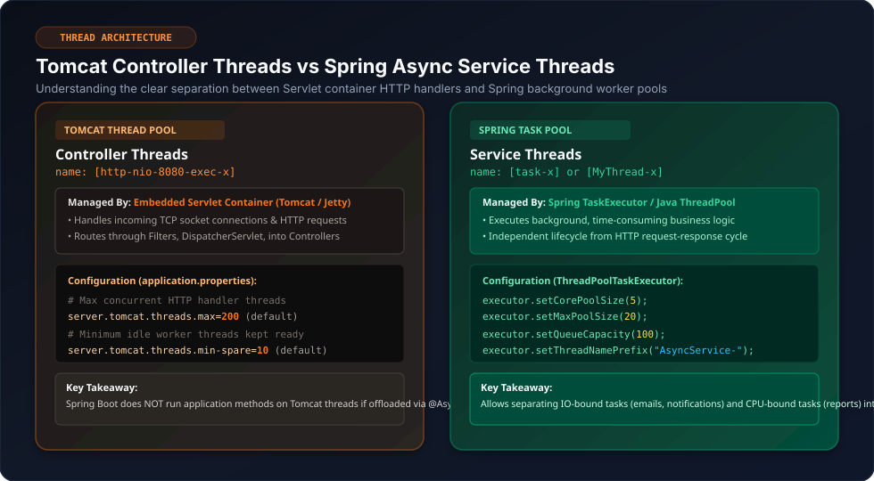
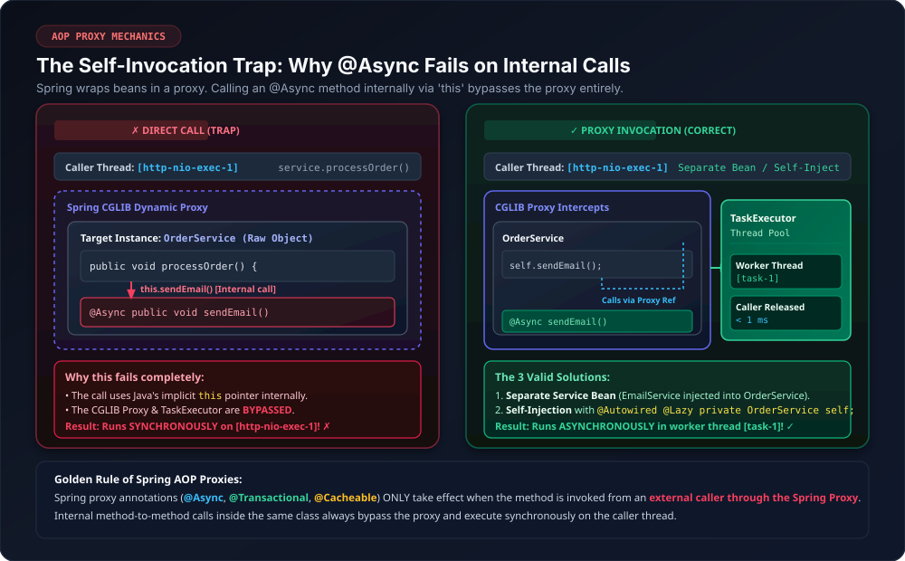

`@Async` is a core Spring Framework annotation used to execute methods **asynchronously** in a separate background thread. When an `@Async` method is invoked, the caller thread is not blocked and resumes its execution immediately, while the method logic runs in the background within a managed thread pool.

---

## 1. Why Use `@Async`?

In standard synchronous execution, each step of an HTTP request runs sequentially on the web server's request thread. If any step involves a slow or non-critical operation (e.g., sending emails, invoking third-party APIs, generating reports, writing audit logs), the client must wait for the entire chain to complete.



### Benefits
- **Drastically Reduced Response Time:** Offloads long-running tasks so HTTP responses return in milliseconds.
- **Enhanced Application Throughput:** Servlet container worker threads are quickly returned to the server pool to handle new incoming HTTP requests.
- **Resource Optimization:** Time-consuming background operations run on specialized worker pools tailored for IO or CPU workloads.

---

## 2. Internal Mechanism: How `@Async` Works

Spring implements asynchronous method execution using **Spring AOP (Aspect-Oriented Programming)** backed by **CGLIB dynamic proxies**.



### What ThreadPool Does `@Async` Use by Default?

A very common interview question and source of confusion is: *"What thread pool does Spring use if we only add `@EnableAsync` without defining any custom executor?"*

> [!NOTE]
> **The Spring Framework vs Spring Boot Difference:**
> - In **plain Spring Framework**, the default executor is `SimpleAsyncTaskExecutor` (which does NOT reuse threads and creates a new thread per invocation).
> - In **Spring Boot (2.1+ / 3.x)**, Spring Boot's auto-configuration (`TaskExecutionAutoConfiguration`) automatically builds and registers a **`ThreadPoolTaskExecutor`** bean (named `applicationTaskExecutor` / `taskExecutor`) as the default!

#### Default Configuration Properties of Spring Boot's Default Executor:

| Property | Default Value in Spring Boot | Meaning & Effect |
|---|---|---|
| **Underlying Class** | `ThreadPoolTaskExecutor` (Spring wrapper around Java `ThreadPoolExecutor`) | Manages an actual pool of reusable background worker threads. |
| **`corePoolSize`** | **`8`** *(or number of available CPU cores)* | The base number of worker threads kept alive in the pool at all times. |
| **`queueCapacity`** *(Queue Size)* | **`2,147,483,647`** (`Integer.MAX_VALUE`) | **Unbounded queue.** Tasks wait in an infinite `LinkedBlockingQueue` when all 8 core threads are busy. |
| **`maxPoolSize`** *(Max Threads)* | **`2,147,483,647`** (`Integer.MAX_VALUE`) | The maximum number of threads the pool is allowed to grow to when the queue becomes full. |
| **`keepAliveSeconds`** *(Keep-Alive Timer)* | **`60 seconds`** | How long non-core threads (threads above 8) are allowed to remain idle before being terminated. |
| **Thread Name Prefix** | **`task-`** | Worker threads are named sequentially: `task-1`, `task-2`, `task-3`, etc. |

> [!WARNING]
> **The Queue Size Trap:** Because the default `queueCapacity` is **2.14 Billion**, the queue **practically never fills up**. Under standard Java thread pool rules, threads above `corePoolSize` (8) are **ONLY created once the queue is 100% full**. Therefore, Spring Boot's default pool will **never expand past 8 threads** under normal circumstances—all excess tasks will simply wait indefinitely in the queue!

---

### Step-by-Step Internal Flow:
1. **Bean Initialization:** During startup, if `@EnableAsync` is active, Spring detects beans containing `@Async` methods and generates a CGLIB proxy subclass around the target bean.
2. **Method Interception:** When an external caller calls `service.sendEmail()`, the call hits the CGLIB proxy rather than the real instance.
3. **Task Wrapping:** `AsyncExecutionInterceptor` intercepts the invocation and packages the method execution into a `Callable` or `Runnable`.
4. **Executor Submission:** The interceptor submits the task to a configured `TaskExecutor` (thread pool).
5. **Immediate Return:** 
   - If the return type is `void`, control returns to the caller thread immediately (`< 1ms`).
   - If the return type is `Future` or `CompletableFuture`, an incomplete future handle is returned immediately.
6. **Background Execution:** An idle worker thread (`task-1`, `MyThread-1`) picks up the task from the executor's queue and executes the actual method body.

---

### Why is the Default ThreadPool NOT Recommended for Production?

Although Spring Boot provides an auto-configured `ThreadPoolTaskExecutor` out of the box, relying on it in production environments is considered an anti-pattern. There are **4 critical reasons** why:

```text
Incoming Tasks ──► [Core Pool: 8 Threads] ──(Busy)──► [Unbounded Queue: 2.14 Billion]
                                                            │
                                                     (Never Fills Up!)
                                                            ▼
                                        [Max Pool: 2.14B Threads NEVER Triggered!]
```

#### 1. Severe Underutilization of Available Threads
Standard Java `ThreadPoolExecutor` follows a strict dispatch order:
$$\text{Core Threads (8)} \longrightarrow \text{Task Queue} \longrightarrow \text{Max Threads} \longrightarrow \text{Rejection}$$
- Additional threads beyond `corePoolSize` are **only spawned after the task queue is completely full**.
- Because Spring Boot sets `queueCapacity = Integer.MAX_VALUE` (~2.14 billion), the queue **never fills up**.
- As a consequence, the executor **never scales up to `maxPoolSize`**. You effectively have a fixed, bottlenecked 8-thread pool, leaving the remaining server CPU and memory resources completely underutilized!

#### 2. Excessive Latency & Task Stalling
- Because the queue is practically infinite, new tasks are continuously accepted into the queue rather than rejected or handled by newly spawned burst threads.
- Under peak traffic or during downstream network slowdowns (e.g., slow SMTP or database), thousands of tasks sit in the queue waiting their turn.
- A task submitted at 10:00 AM might not actually begin execution until 10:15 AM, resulting in severe latency and degraded user experience.

#### 3. High Memory Consumption & Risk of OutOfMemoryError (Heap Leak)
- Every task added to the queue is an instantiated Java object (`Runnable` / `Callable` holding method arguments, closures, and object references) stored on the JVM Heap.
- Under sustained heavy load, storing millions of queued tasks consumes substantial heap memory.
- Eventually, this causes aggressive Garbage Collection pauses and can crash the entire application with:
  ```text
  java.lang.OutOfMemoryError: Java heap space
  ```

#### 4. Catastrophic Thread Exhaustion (In the Rare Event the Queue Fills)
- If the application ever did manage to queue 2.14 billion tasks, the executor would finally attempt to create threads up to `maxPoolSize = Integer.MAX_VALUE`.
- Operating systems enforce hard limits on the number of native OS threads a process can create (typically a few thousand threads).
- Spawning even a few thousand native threads simultaneously causes immediate CPU thrashing, stack memory exhaustion, and a fatal JVM crash:
  ```text
  java.lang.OutOfMemoryError: unable to create new native thread
  ```

> [!TIP]
> **Production Recommendation:** Always configure a dedicated custom `ThreadPoolTaskExecutor` with a **bounded queue** (e.g., 50–200 tasks), a balanced `corePoolSize` and `maxPoolSize`, and a backpressure rejection policy such as `ThreadPoolExecutor.CallerRunsPolicy()`.

---

## 3. Getting Started: Basic Configuration & Usage

### Step 1: Enable Async Support
To activate Spring's async proxy machinery, annotate a `@Configuration` class or your main `@SpringBootApplication` class with `@EnableAsync`.

```java
package com.example.async;

import org.springframework.boot.SpringApplication;
import org.springframework.boot.autoconfigure.SpringBootApplication;
import org.springframework.scheduling.annotation.EnableAsync;

@SpringBootApplication
@EnableAsync // Activates Spring's async proxy machinery
public class Application {
    public static void main(String[] args) {
        SpringApplication.run(Application.class, args);
    }
}
```

> [!IMPORTANT]
> Without `@EnableAsync`, the `@Async` annotation is completely ignored! Spring will not generate an async proxy, and all methods will execute **synchronously** on the caller thread.

---

### Step 2: Define Asynchronous Service Method

```java
package com.example.async.service;

import org.slf4j.Logger;
import org.slf4j.LoggerFactory;
import org.springframework.scheduling.annotation.Async;
import org.springframework.stereotype.Service;

@Service
public class EmailService {

    private static final Logger log = LoggerFactory.getLogger(EmailService.class);

    @Async
    public void sendWelcomeEmail(String toEmail) {
        log.info("inside sendWelcomeEmail: {}", Thread.currentThread().getName());
        try {
            // Simulate slow SMTP network call
            Thread.sleep(3000);
            log.info("Email sent successfully to {}", toEmail);
        } catch (InterruptedException e) {
            Thread.currentThread().interrupt();
        }
    }
}
```

---

### Step 3: Call Async Method from Controller / Service

```java
package com.example.async.controller;

import com.example.async.service.EmailService;
import org.slf4j.Logger;
import org.slf4j.LoggerFactory;
import org.springframework.beans.factory.annotation.Autowired;
import org.springframework.web.bind.annotation.GetMapping;
import org.springframework.web.bind.annotation.RequestMapping;
import org.springframework.web.bind.annotation.RestController;

@RestController
@RequestMapping("/api")
public class UserController {

    private static final Logger log = LoggerFactory.getLogger(UserController.class);

    @Autowired
    private EmailService emailService;

    @GetMapping("/register")
    public String registerUser() {
        log.info("inside registerUser: {}", Thread.currentThread().getName());
        
        // Trigger async execution in a separate background thread
        emailService.sendWelcomeEmail("john.doe@example.com");
        
        log.info("This line prints immediately without waiting for email to complete");
        return "User registered successfully!";
    }
}
```

### Execution Log Output:
```text
2026-09-05T22:15:01.102+05:30  INFO 44004 --- [nio-8080-exec-1] c.e.a.c.UserController   : inside registerUser: http-nio-8080-exec-1
2026-09-05T22:15:01.105+05:30  INFO 44004 --- [nio-8080-exec-1] c.e.a.c.UserController   : This line prints immediately without waiting for email to complete
2026-09-05T22:15:01.106+05:30  INFO 44004 --- [         task-1] c.e.a.s.EmailService      : inside sendWelcomeEmail: task-1
2026-09-05T22:15:04.108+05:30  INFO 44004 --- [         task-1] c.e.a.s.EmailService      : Email sent successfully to john.doe@example.com
```

- `http-nio-8080-exec-1` is the **Tomcat Servlet container thread**. It finishes in `3ms` and returns the HTTP response.
- `task-1` is the **Spring TaskExecutor background worker thread**. It continues executing the 3-second email task independently.

---

## 4. Return Types in `@Async`

`@Async` methods can have one of three return types:

| Return Type | Behavior | Blocking / Non-Blocking | Recommended Use Cases |
|---|---|---|---|
| `void` | Fire-and-forget. Caller receives no return value. | Non-blocking | Notifications, emails, audit logs, metrics publishing. |
| `Future<T>` | Legacy Java abstraction. Requires blocking `.get()`. | Blocking when calling `.get()` | Legacy codebases where caller eventually needs the result. |
| `CompletableFuture<T>` | Modern Java 8+ API. Supports non-blocking chaining, callbacks, and composition. | Non-blocking (using callbacks) | Modern distributed architectures, microservice aggregations, parallel API calls. |

---

### Option 1: Fire-and-Forget (`void`)
```java
@Async
public void sendPushNotification(String userId, String message) {
    // Fire and forget: caller doesn't wait and doesn't receive a result
    notificationGateway.send(userId, message);
}
```

---

### Option 2: Legacy `Future<T>`
```java
@Async
public Future<String> processLegacyReport(Long reportId) {
    try {
        Thread.sleep(2000);
        return new AsyncResult<>("Report Data for " + reportId); // Spring helper wrapper
    } catch (InterruptedException e) {
        Thread.currentThread().interrupt();
        return new AsyncResult<>(null);
    }
}

// Caller invocation (blocking):
Future<String> future = reportService.processLegacyReport(101L);
// Doing other work...
String result = future.get(); // Blocks until thread completes!
```

---

### Option 3: Modern `CompletableFuture<T>` (Recommended)

```java
@Async
public CompletableFuture<String> fetchUserDataAsync(String userId) {
    try {
        Thread.sleep(1500);
        String data = externalClient.getUserDetails(userId);
        return CompletableFuture.completedFuture(data);
    } catch (Exception ex) {
        return CompletableFuture.failedFuture(ex);
    }
}
```

#### Non-blocking Consumer with Callbacks:
```java
@GetMapping("/user/{id}")
public void handleUser(@PathVariable String id) {
    userService.fetchUserDataAsync(id)
        .thenAccept(data -> log.info("Received user data: {}", data))
        .exceptionally(ex -> {
            log.error("Failed to fetch user data: {}", ex.getMessage());
            return null;
        });
}
```

---

### Combining Multiple Async Calls in Parallel

You can execute multiple independent tasks simultaneously and wait for all of them using `CompletableFuture.allOf()`:

```java
@Service
public class OrderNotificationService {

    @Autowired private EmailService emailService;
    @Autowired private SmsService smsService;
    @Autowired private PushNotificationService pushService;

    public void notifyCustomer(Order order) {
        CompletableFuture<Void> emailFuture = emailService.sendOrderEmailAsync(order);
        CompletableFuture<Void> smsFuture = smsService.sendOrderSmsAsync(order);
        CompletableFuture<Void> pushFuture = pushService.sendOrderPushAsync(order);

        // Wait for all 3 async operations to finish in parallel
        CompletableFuture.allOf(emailFuture, smsFuture, pushFuture).join();
        log.info("All notifications dispatched successfully!");
    }
}
```

---

## 5. Thread Pool Configuration & The 4 Use Cases

Understanding which `Executor` runs your `@Async` methods is essential to avoiding system instability in production.



---

### Use Case 1: Zero-Config (Spring Boot Default)

If you only specify `@EnableAsync` without declaring any custom `Executor` or `ThreadPoolTaskExecutor` bean:

```java
@Configuration
public class AppConfig {
    // No executor beans declared
}

@SpringBootApplication
@EnableAsync
public class SpringbootApplication { ... }
```

#### Default Configuration Values Created by Spring:
```text
defaultExecutor = {ThreadPoolTaskExecutor}
  ├── corePoolSize   = 8 (matches system CPU core count)
  ├── maxPoolSize    = 2,147,483,647 (Integer.MAX_VALUE)
  ├── queueCapacity  = 2,147,483,647 (Integer.MAX_VALUE)
  └── keepAliveSecs  = 60
```

#### Thread Names in Log:
`task-1`, `task-2`, `task-3`, ..., `task-8`

#### Why the Default Executor is Dangerous in Production:
1. **Thread Underutilization:** Standard Java thread pool logic states: *new threads above `corePoolSize` are ONLY spawned once the queue is completely full*. Because the default queue capacity is `Integer.MAX_VALUE` (2.14 billion tasks), the queue **never fills up**. The pool remains stuck at 8 threads forever!
2. **High Latency:** Under heavy load, thousands of incoming tasks sit endlessly in the unbounded queue waiting for the 8 core threads.
3. **Memory Exhaustion (OOM):** Queuing millions of `Runnable` objects consumes JVM heap memory, causing `OutOfMemoryError`.
4. **Catastrophic Failure:** In the extreme event that 2.14 billion tasks are queued, Spring will attempt to spawn threads up to `Integer.MAX_VALUE`, crashing the operating system.

---

### Use Case 2: Custom `ThreadPoolTaskExecutor` Bean (Spring Wrapper)

Define a custom bean of type `org.springframework.scheduling.concurrent.ThreadPoolTaskExecutor`:

```java
package com.example.async.config;

import org.springframework.context.annotation.Bean;
import org.springframework.context.annotation.Configuration;
import org.springframework.scheduling.concurrent.ThreadPoolTaskExecutor;

import java.util.concurrent.Executor;

@Configuration
public class AppConfig {

    @Bean(name = "myThreadPoolExecutor")
    public Executor taskPoolExecutor() {
        ThreadPoolTaskExecutor poolTaskExecutor = new ThreadPoolTaskExecutor();
        poolTaskExecutor.setCorePoolSize(2);
        poolTaskExecutor.setMaxPoolSize(4);
        poolTaskExecutor.setQueueCapacity(3);
        poolTaskExecutor.setThreadNamePrefix("MyThread-");
        poolTaskExecutor.initialize();
        return poolTaskExecutor;
    }
}
```

#### Method Usage:
Can be called with either `@Async` or `@Async("myThreadPoolExecutor")`.

```java
@Component
public class UserService {
    // Spring Boot automatically picks "myThreadPoolExecutor" as default!
    @Async
    public void asyncMethodTest() {
        System.out.println("inside asyncMethodTest: " + Thread.currentThread().getName());
    }
}
```

#### Stress Testing Use Case 2 with `Thread.sleep(50000)`:

Here is the exact request-by-request lifecycle when simulating a burst of requests with a 50-second sleep (`corePoolSize = 2`, `queueCapacity = 3`, `maxPoolSize = 4`):

| Request # | Active Threads (Pool) | Queue State (`capacity = 3`) | Action Taken | Console Log Printed |
|---|---|---|---|---|
| **Request 1** | 1 (`MyThread-1` created) | `[Empty]` | Core thread 1 created and runs Request 1 (sleeps 50s) | `inside asyncMethodTest: MyThread-1` |
| **Request 2** | 2 (`MyThread-1`, `MyThread-2`) | `[Empty]` | Core thread 2 created and runs Request 2 (sleeps 50s) | `inside asyncMethodTest: MyThread-2` |
| **Request 3** | 2 (Both busy sleeping) | `[Req 3]` | Core pool is full; task placed in queue | *(No log yet — waiting in queue)* |
| **Request 4** | 2 (Both busy sleeping) | `[Req 3, Req 4]` | Core pool is full; task placed in queue | *(No log yet — waiting in queue)* |
| **Request 5** | 2 (Both busy sleeping) | `[Req 3, Req 4, Req 5]` | **Queue is now 100% FULL!** | *(No log yet — waiting in queue)* |
| **Request 6** | 3 (`MyThread-3` created) | `[Req 3, Req 4, Req 5]` | Queue is full, but active (2) < max (4). New thread **`MyThread-3` is created and immediately executes Request 6** (sleeps 50s)! | `inside asyncMethodTest: MyThread-3` |
| **Request 7** | 4 (`MyThread-4` created) | `[Req 3, Req 4, Req 5]` | Queue is full, but active (3) < max (4). New thread **`MyThread-4` is created and immediately executes Request 7** (sleeps 50s)! | `inside asyncMethodTest: MyThread-4` |
| **Request 8** | 4 (All 4 busy sleeping!) | `[Req 3, Req 4, Req 5]` (Full!) | **Max threads reached (4) AND queue is full (3)!** Cannot queue or spawn threads. | `java.util.concurrent.RejectedExecutionException` |

> [!NOTE]
> **Why do `MyThread-3` and `MyThread-4` execute Requests 6 & 7 instead of Requests 3, 4, 5?**
> In standard Java `ThreadPoolExecutor` architecture:
> 1. When a task arrives and the queue is full, Java invokes `addWorker(task, false)` to spawn a new thread.
> 2. The task that *triggered* the expansion (Request 6) is passed as the **first task (`firstTask`)** of the newly created thread (`MyThread-3`).
> 3. Therefore, `MyThread-3` **immediately starts executing Request 6**, and `MyThread-4` **immediately starts executing Request 7**!
> 4. As a result, `MyThread-3` and `MyThread-4` are **NOT free**—they are actively executing the 50-second sleep of Requests 6 and 7!
> 5. Only after `MyThread-1`, `2`, `3`, or `4` finish their 50-second sleep will they call `workQueue.take()` to pick up the queued Requests 3, 4, and 5.
> 6. Because all 4 threads are occupied and all 3 queue slots are full, **Request 8 has nowhere to go and is rejected**!

---

### Use Case 3: Plain Java `ThreadPoolExecutor` Bean (The Severe Pitfall)

Here we are using Java threadpool

If you declare a standard Java `java.util.concurrent.ThreadPoolExecutor` directly:

```java
package com.example.async.config;

import org.springframework.context.annotation.Bean;
import org.springframework.context.annotation.Configuration;

import java.util.concurrent.ArrayBlockingQueue;
import java.util.concurrent.Executor;
import java.util.concurrent.ThreadFactory;
import java.util.concurrent.ThreadPoolExecutor;
import java.util.concurrent.TimeUnit;
import java.util.concurrent.atomic.AtomicInteger;

@Configuration
public class AppConfig {

    @Bean(name = "myThreadPoolExecutor")
    public Executor taskPoolExecutor() {
        int minPoolSize = 2;
        int maxPoolSize = 4;
        int queueSize = 3;
        
        return new ThreadPoolExecutor(
            minPoolSize,
            maxPoolSize,
            1,
            TimeUnit.HOURS,
            new ArrayBlockingQueue<>(queueSize),
            new CustomThreadFactory()
        );
    }
}

// Custom thread factory to name threads sequentially (e.g. "MyThread-1", "MyThread-2")
class CustomThreadFactory implements ThreadFactory {
    private final AtomicInteger threadNumber = new AtomicInteger(1);

    @Override
    public Thread newThread(Runnable r) {
        Thread thread = new Thread(r);
        thread.setName("MyThread-" + threadNumber.getAndIncrement());
        return thread;
    }
}
```

And in your service:
```java
@Component
public class UserService {
    @Async // Note: NO qualifier specified!
    public void asyncMethodTest() {
        System.out.println("inside asyncMethodTest: " + Thread.currentThread().getName());
    }
}
```

#### What Happens Internally (Why Spring Boot Ignored Our ThreadPool):

You might ask: *"We clearly instantiated a custom `ThreadPoolExecutor` bean in `AppConfig`! Why did Spring Boot completely ignore it and use `SimpleAsyncTaskExecutor` instead?"*

The answer lies in the **exact lookup algorithm** inside Spring's `AsyncExecutionInterceptor.java`:

```java
// Spring Framework Internal Lookup Logic:
protected Executor getDefaultExecutor(@Nullable BeanFactory beanFactory) {
    if (beanFactory != null) {
        try {
            // STEP 1: Search the ApplicationContext by TYPE: TaskExecutor
            return beanFactory.getBean(TaskExecutor.class);
        }
        catch (NoSuchBeanDefinitionException ex) {
            try {
                // STEP 2: Fallback search by exact BEAN NAME: "taskExecutor"
                return beanFactory.getBean("taskExecutor", Executor.class);
            }
            catch (NoSuchBeanDefinitionException ex2) {
                // No bean found by type TaskExecutor OR name "taskExecutor"
            }
        }
    }
    // STEP 3: Fallback to creating a new SimpleAsyncTaskExecutor!
    return new SimpleAsyncTaskExecutor();
}
```

#### The Two Reasons Why Our Bean Was Not Picked Up:

1. **The Type Mismatch (Step 1 Failed):**
   - Spring searches for a bean of type `org.springframework.core.task.TaskExecutor` (a Spring-specific interface).
   - In **Use Case 2**, `ThreadPoolTaskExecutor` implements Spring's `TaskExecutor`, so Step 1 succeeded automatically.
   - But in **Use Case 3**, plain Java `java.util.concurrent.ThreadPoolExecutor` only implements Java's standard `java.util.concurrent.Executor` and `ExecutorService`—it does **NOT** implement Spring's `TaskExecutor`! Therefore, Step 1 failed with `NoSuchBeanDefinitionException`.

2. **The Name Mismatch (Step 2 Failed):**
   - When Step 1 fails, Spring falls back to looking for a bean with the exact name **`"taskExecutor"`**.
   - However, we annotated our bean as:
     ```java
     @Bean(name = "myThreadPoolExecutor") // ❌ Name does not match "taskExecutor"!
     public Executor taskPoolExecutor() { ... }
     ```
   - Since the bean name is `"myThreadPoolExecutor"` and not `"taskExecutor"`, Step 2 also failed!

3. **The Result (Step 3 Triggered):**
   - Spring concludes that **no default async executor exists in the application**.
   - It silently ignores our `myThreadPoolExecutor` bean (leaving it completely idle in the Spring container).
   - It falls back to instantiating `new SimpleAsyncTaskExecutor()` for every un-qualified `@Async` call!

#### Execution Log Output:
```text
inside asyncMethodTest: SimpleAsyncTaskExecutor-1
inside asyncMethodTest: SimpleAsyncTaskExecutor-2
inside asyncMethodTest: SimpleAsyncTaskExecutor-3
...
inside asyncMethodTest: SimpleAsyncTaskExecutor-9
```

> [!CAUTION]
> **Why `SimpleAsyncTaskExecutor` is Extremely Dangerous:**
> `SimpleAsyncTaskExecutor` does **NOT** reuse threads! It does not maintain a pool. Every single `@Async` invocation creates a brand new native OS thread from scratch and terminates it after execution. Under moderate or heavy traffic, this causes:
> 1. **OS Thread Exhaustion:** Crashes with `java.lang.OutOfMemoryError: unable to create new native thread`.
> 2. **Severe CPU Thrashing:** Continuous thread creation and destruction burns CPU cycles.
> 3. **Degraded Performance:** Thread IDs keep climbing infinitely (`SimpleAsyncTaskExecutor-1000...`).

---

#### How to Make Spring Boot Utilize Our Custom ThreadPool:

If you want to use a plain Java `ThreadPoolExecutor`, you have **4 ways** to make Spring Boot utilize it:

| Solution | Code | How it Works |
|---|---|---|
| **Option 1: Add Qualifier on `@Async`** | `@Async("myThreadPoolExecutor")` | Bypasses default lookup and forces Spring to find your bean by its custom name. |
| **Option 2: Rename Bean to `"taskExecutor"`** | `@Bean(name = "taskExecutor")` | Satisfies Step 2 of Spring's fallback lookup algorithm. |
| **Option 3: Wrap in `TaskExecutorAdapter`** | `new TaskExecutorAdapter(poolExecutor)` | Adapts the Java `ThreadPoolExecutor` to Spring's `TaskExecutor` interface, satisfying Step 1. |
| **Option 4: Implement `AsyncConfigurer` (Recommended)** | Override `getAsyncExecutor()` | Directly declares the application-wide default executor with zero ambiguity (See Use Case 4 below). |

---

### Use Case 4: Production Standard – Implementing `AsyncConfigurer`

To eliminate all ambiguity and ensure your custom executor is always the application-wide default without needing qualifiers, implement `AsyncConfigurer`:

```java
package com.example.async.config;

import org.slf4j.Logger;
import org.slf4j.LoggerFactory;
import org.springframework.aop.interceptor.AsyncUncaughtExceptionHandler;
import org.springframework.context.annotation.Configuration;
import org.springframework.scheduling.annotation.AsyncConfigurer;
import org.springframework.scheduling.annotation.EnableAsync;
import org.springframework.scheduling.concurrent.ThreadPoolTaskExecutor;

import java.lang.reflect.Method;
import java.util.concurrent.Executor;
import java.util.concurrent.ThreadPoolExecutor;

@Configuration
@EnableAsync
public class AsyncConfig implements AsyncConfigurer {

    private static final Logger log = LoggerFactory.getLogger(AsyncConfig.class);

    @Override
    public Executor getAsyncExecutor() {
        ThreadPoolTaskExecutor executor = new ThreadPoolTaskExecutor();
        executor.setCorePoolSize(5);
        executor.setMaxPoolSize(20);
        executor.setQueueCapacity(100);
        executor.setKeepAliveSeconds(60);
        executor.setThreadNamePrefix("AsyncWorker-");
        
        // CallerRunsPolicy provides backpressure when queue and max pool are saturated
        executor.setRejectedExecutionHandler(new ThreadPoolExecutor.CallerRunsPolicy());
        executor.initialize();
        return executor;
    }

    @Override
    public AsyncUncaughtExceptionHandler getAsyncUncaughtExceptionHandler() {
        return new CustomAsyncExceptionHandler();
    }

    // Custom exception handler for void async methods
    public static class CustomAsyncExceptionHandler implements AsyncUncaughtExceptionHandler {
        @Override
        public void handleUncaughtException(Throwable throwable, Method method, Object... params) {
            log.error("Exception occurred in async method: {}", method.getName(), throwable);
        }
    }
}
```

Now, any standard `@Async` annotation across the entire application will reliably utilize `AsyncWorker-*` threads with backpressure protection and centralized exception handling!

> [!NOTE]
> **Why put `@EnableAsync` on the `@Configuration` class (`AsyncConfig`) instead of the main class?**
> 1. **Modular Configuration (Separation of Concerns):** It encapsulates all async-related behavior (activation, thread pool sizing, exception handlers) inside a single, dedicated configuration file rather than cluttering your main `@SpringBootApplication` class.
> 2. **Enables Integration & Slice Testing:** If you write an integration test and only want to test asynchronous features, you can import `@Import(AsyncConfig.class)`. Because `@EnableAsync` is right on `AsyncConfig`, the test automatically activates async processing without needing to spin up the entire application.
> 3. **Conditional Enabling / Disabling:** You can easily combine it with conditions like `@ConditionalOnProperty(name = "app.async.enabled", havingValue = "true", matchIfMissing = true)` to toggle all async processing on or off via configuration without touching your main application entrypoint.
> 
> *(Note: Placing `@EnableAsync` on `@SpringBootApplication` also works, but putting it on `AsyncConfig` is considered enterprise best practice).*

---

## 6. Thread Pool Task Dispatch & Saturation Policies



### Chronological Task Dispatch Sequence:
1. **Core Pool Check:** If active threads < `corePoolSize`, spawn a new core thread to execute the task immediately.
2. **Queue Buffering:** If active threads == `corePoolSize`, place task into the waiting queue (`queueCapacity`).
3. **Max Pool Expansion:** If the queue is 100% full and active threads < `maxPoolSize`, spawn additional worker threads up to `maxPoolSize`.
4. **Saturation Rejection:** If active threads == `maxPoolSize` AND the queue is 100% full, the `RejectedExecutionHandler` is triggered.

### Rejection Policies Overview:
- `AbortPolicy` (Default): Throws `RejectedExecutionException`.
- `CallerRunsPolicy` (Recommended): Executes the task on the **caller thread** (e.g. Tomcat thread). This naturally throttles incoming throughput (backpressure).
- `DiscardPolicy`: Silently drops the rejected task without error.
- `DiscardOldestPolicy`: Discards the oldest unhandled task in the queue and retries submission.

---

### Segregating Workloads: Multiple Executors

For optimal stability, separate high-volume IO-bound tasks from computation-heavy CPU-bound tasks:

```java
@Configuration
public class MultiExecutorConfig {

    // IO-bound tasks (emails, notifications): high pool size, larger queue
    @Bean(name = "notificationExecutor")
    public Executor notificationExecutor() {
        ThreadPoolTaskExecutor executor = new ThreadPoolTaskExecutor();
        executor.setCorePoolSize(10);
        executor.setMaxPoolSize(50);
        executor.setQueueCapacity(200);
        executor.setThreadNamePrefix("NotificationWorker-");
        executor.initialize();
        return executor;
    }

    // CPU-bound tasks (report compilation, image processing): low pool size matching CPU cores
    @Bean(name = "reportExecutor")
    public Executor reportExecutor() {
        ThreadPoolTaskExecutor executor = new ThreadPoolTaskExecutor();
        executor.setCorePoolSize(2);
        executor.setMaxPoolSize(4);
        executor.setQueueCapacity(10);
        executor.setThreadNamePrefix("ReportWorker-");
        executor.initialize();
        return executor;
    }
}
```

#### Usage with Qualifiers:
```java
@Async("notificationExecutor")
public void sendBulkEmails(List<String> emails) { ... }

@Async("reportExecutor")
public CompletableFuture<Report> generatePdfReport(Long reportId) { ... }
```

---

## 7. Controller Threads vs Async Service Threads

In a web application, two distinct thread pools handle user traffic and background workloads:



| Metric | Controller Threads (`http-nio-8080-exec-*`) | Async Service Threads (`task-*` / `MyThread-*`) |
|---|---|---|
| **Managed By** | Embedded Servlet Container (Tomcat / Jetty) | Spring `TaskExecutor` / `ThreadPoolExecutor` |
| **Purpose** | Handles incoming HTTP requests, filters, routing | Asynchronous business logic & heavy processing |
| **Default Pool Size** | `min-spare = 10`, `max = 200` | `core = 8`, `max = 2.14B` (Default) |
| **Config Location** | `application.properties` (`server.tomcat.*`) | `@Configuration` (`ThreadPoolTaskExecutor`) |

---

### Code Example: Observing Both Thread Pools in Action

Here is a complete example demonstrating the interplay between the Tomcat controller thread and the Spring async worker thread:

#### 1. Controller Layer (`UserController.java`)
```java
package com.example.async.controller;

import com.example.async.service.OrderProcessingService;
import org.springframework.beans.factory.annotation.Autowired;
import org.springframework.web.bind.annotation.GetMapping;
import org.springframework.web.bind.annotation.RequestMapping;
import org.springframework.web.bind.annotation.RestController;

@RestController
@RequestMapping("/api")
public class UserController {

    @Autowired
    private OrderProcessingService orderProcessingService;

    @GetMapping("/checkout")
    public String checkoutOrder() {
        // 1. Thread managed by Tomcat Servlet container
        System.out.println("inside Controller (Tomcat Thread): " + Thread.currentThread().getName());

        // 2. Offload background processing to Spring Async thread pool
        orderProcessingService.processOrderAsync();

        // 3. Controller thread immediately returns response to client
        return "Order submitted successfully!";
    }
}
```

#### 2. Service Layer (`OrderProcessingService.java`)
```java
package com.example.async.service;

import org.springframework.scheduling.annotation.Async;
import org.springframework.stereotype.Service;

@Service
public class OrderProcessingService {

    @Async
    public void processOrderAsync() {
        // Thread managed by Spring TaskExecutor thread pool
        System.out.println("inside Service (Spring Async Thread): " + Thread.currentThread().getName());
        try {
            Thread.sleep(4000); // Simulate slow processing (e.g. inventory update / payment verification)
        } catch (InterruptedException e) {
            Thread.currentThread().interrupt();
        }
    }
}
```

---

### Console Output Under Traffic:

```text
2026-09-05T22:36:10.100  INFO --- [nio-8080-exec-1] c.e.a.c.UserController          : inside Controller (Tomcat Thread): http-nio-8080-exec-1
2026-09-05T22:36:10.102  INFO --- [         task-1] c.e.a.s.OrderProcessingService   : inside Service (Spring Async Thread): task-1
2026-09-05T22:36:10.840  INFO --- [nio-8080-exec-2] c.e.a.c.UserController          : inside Controller (Tomcat Thread): http-nio-8080-exec-2
2026-09-05T22:36:10.841  INFO --- [         task-2] c.e.a.s.OrderProcessingService   : inside Service (Spring Async Thread): task-2
2026-09-05T22:36:11.412  INFO --- [nio-8080-exec-3] c.e.a.c.UserController          : inside Controller (Tomcat Thread): http-nio-8080-exec-3
2026-09-05T22:36:11.413  INFO --- [         task-3] c.e.a.s.OrderProcessingService   : inside Service (Spring Async Thread): task-3
2026-09-05T22:36:12.015  INFO --- [nio-8080-exec-1] c.e.a.c.UserController          : inside Controller (Tomcat Thread): http-nio-8080-exec-1
2026-09-05T22:36:12.016  INFO --- [         task-4] c.e.a.s.OrderProcessingService   : inside Service (Spring Async Thread): task-4
```

---

### Detailed Architectural Explanation:

1. **Tomcat Controller Threads (`http-nio-8080-exec-X`):**
   - **Lifecycle & Origin:** Created and managed by Tomcat's internal worker thread pool (`org.apache.tomcat.util.threads.ThreadPoolExecutor`).
   - **Role:** When an HTTP request reaches port `8080`, Tomcat accepts the socket connection, assigns an idle thread (such as `http-nio-8080-exec-1`), runs filter chains, invokes `DispatcherServlet`, and enters the `checkoutOrder()` controller method.
   - **Non-blocking Behavior:** Because the controller invokes an `@Async` method, the call is intercepted by Spring's CGLIB proxy and submitted to Spring's task queue. The controller returns its HTTP response (`"Order submitted successfully!"`) in just **2 milliseconds**.
   - **Thread Reuse:** `http-nio-8080-exec-1` is immediately released back to Tomcat's spare thread pool! As shown on line 7 of the log, `http-nio-8080-exec-1` is already picking up a new incoming HTTP request while `task-1` is still running the previous order!

2. **Spring Async Service Threads (`task-X` / `MyThread-X`):**
   - **Lifecycle & Origin:** Created and managed by Spring's `TaskExecutor` (`ThreadPoolTaskExecutor`), completely outside the Servlet container.
   - **Role:** An idle thread from Spring's worker pool (e.g. `task-1`) dequeues the task submitted by the proxy and executes `processOrderAsync()` in complete isolation.
   - **Independence:** Even if `processOrderAsync()` sleeps for 4 seconds, experiences network lag, or takes minutes to process, it has **zero impact** on Tomcat's ability to accept new incoming HTTP connections.

3. **Why this dual-pool model protects your production system:**
   - If `processOrderAsync()` were executed synchronously, the Tomcat thread would remain blocked for 4 seconds. Under a burst of just 200 concurrent users, all 200 Tomcat threads (`server.tomcat.threads.max=200`) would be locked, causing HTTP 504 Gateway Timeouts or `Connection Refused` errors for all subsequent users.
   - By offloading to `@Async`, the 200 Tomcat threads remain free to handle thousands of requests per second.

---

### Configuring Tomcat Controller Threads

In `application.properties`:
```properties
# Maximum number of worker threads to handle HTTP connections (default: 200)
server.tomcat.threads.max=200

# Minimum spare worker threads kept idle for burst requests (default: 10)
server.tomcat.threads.min-spare=10

# Maximum connection backlog queue length
server.tomcat.accept-count=100

# Maximum concurrent TCP connections Tomcat accepts
server.tomcat.max-connections=8192
```

---

## 8. Critical Limitation: The Self-Invocation Trap

The most common pitfall with Spring `@Async` is invoking an async method from within the same class.



```java
@Service
public class OrderService {

    public void processOrder() {
        // Calling async method directly from inside the same class
        sendConfirmationEmail(); // ⚠️ Runs SYNCHRONOUSLY!
    }

    @Async
    public void sendConfirmationEmail() {
        System.out.println("Thread: " + Thread.currentThread().getName());
    }
}
```

### Why Does It Fail?
Spring `@Async` relies on CGLIB dynamic proxies. When an external bean calls `orderService.processOrder()`, it invokes the proxy. However, when `processOrder()` calls `sendConfirmationEmail()`, it uses Java's implicit `this` reference. The call is dispatched internally on the raw object instance, **completely bypassing the Spring AOP proxy**. As a result, no interception occurs, and the method executes synchronously on the caller thread.

### The 3 Solutions:

#### Solution 1: Dedicated Service Bean (Recommended & Clean Architecture)
Extract the async logic into its own service class:
```java
@Service
public class OrderService {
    @Autowired private EmailService emailService;

    public void processOrder() {
        emailService.sendConfirmationEmail(); // Flows through proxy!
    }
}
```

#### Solution 2: Self-Injection with `@Lazy`
```java
@Service
public class OrderService {
    @Autowired @Lazy private OrderService self;

    public void processOrder() {
        self.sendConfirmationEmail(); // Explicitly calls proxy!
    }

    @Async
    public void sendConfirmationEmail() { ... }
}
```

#### Solution 3: ApplicationContext Lookup
```java
@Service
public class OrderService implements ApplicationContextAware {
    private ApplicationContext context;

    public void processOrder() {
        context.getBean(OrderService.class).sendConfirmationEmail();
    }

    @Override
    public void setApplicationContext(ApplicationContext context) {
        this.context = context;
    }
}
```

---

## 9. Additional `@Async` Rules & Gotchas

1. **Method Visibility:**
   - Must be `public`. Private, protected, or package-private methods cannot be proxied by Spring AOP for `@Async`.
2. **Cannot be `final`:**
   - Neither the class nor the `@Async` method can be declared `final`, as CGLIB must subclass the target to create the proxy.
3. **Transaction Context Does Not Propagate:**
   - Database transactions managed by `@Transactional` rely on `ThreadLocal` storage. Because `@Async` methods execute on a distinct thread, **they do not inherit the caller's transaction context**. They run in their own independent transaction or outside a transaction.
4. **Exception Handling for `void` Methods:**
   - Uncaught exceptions thrown inside `@Async void` methods are swallowed silently by default. Always register an `AsyncUncaughtExceptionHandler` via `AsyncConfigurer`.

---

## 10. `@Async` vs Other Asynchronous Options

| Feature | Spring `@Async` | `CompletableFuture.supplyAsync()` | Spring `@Scheduled` |
|---|---|---|---|
| **Invocation** | Declarative via method call | Programmatic in code | Cron expression or fixed delay/rate |
| **Thread Management** | Managed Spring `TaskExecutor` | Common `ForkJoinPool` or custom executor | Single-thread task scheduler (default) |
| **Return Types** | `void`, `Future`, `CompletableFuture` | `CompletableFuture<T>` | `void` only |
| **Spring Integration** | Native Spring bean proxy integration | Standard Java standard library | Native Spring scheduled task manager |
| **Best For** | Service-level business methods | Ad-hoc functional task compositions | Recurring background jobs |