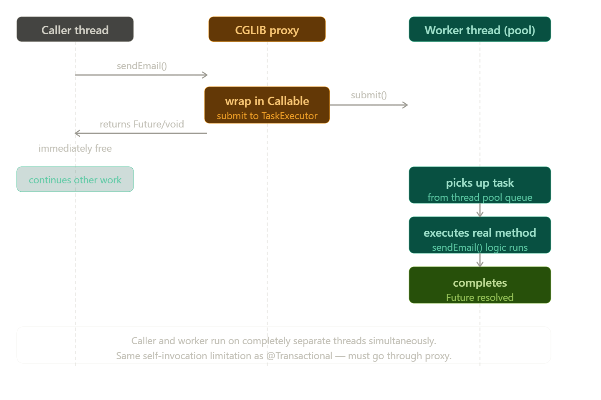
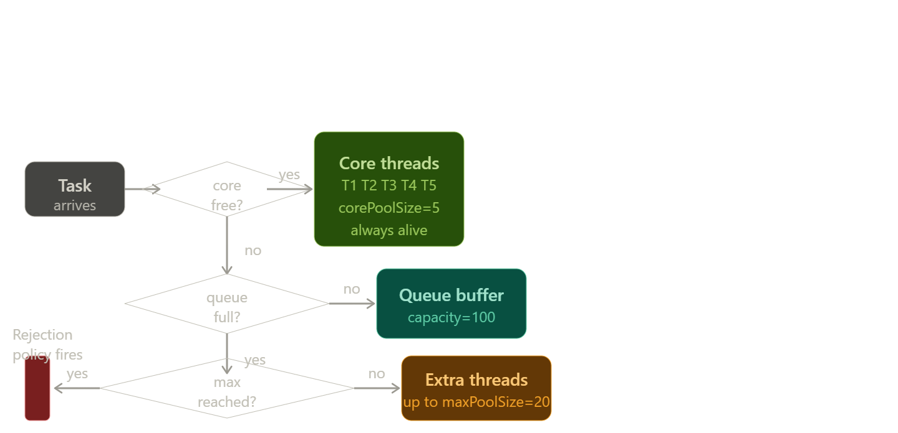

# Notes


                  


## `@Async` in Spring — Complete Deep Dive

### What problem does it solve?

Without `@Async`, every method call blocks the calling thread until it completes. If sending an email takes 3 seconds, your HTTP request waits 3 seconds doing nothing useful.

```
Without @Async                    With @Async
──────────────────                ──────────────────
Request arrives                   Request arrives
  │                                 │
  ├─ save to DB      (50ms)         ├─ save to DB      (50ms)
  ├─ send email      (3000ms)       ├─ send email ──────────────► separate thread
  ├─ send SMS        (1000ms)       ├─ send SMS  ──────────────► separate thread
  └─ return response (4050ms)       └─ return response (50ms) ✓
```

`@Async` runs the method on a **separate thread** from a thread pool — the caller gets control back immediately.

---

### How it works internally — same CGLIB proxy mechanism

Just like `@Transactional`, `@Async` works through a proxy. When Spring sees `@Async` on a method, the CGLIB proxy intercepts the call and submits it to a `TaskExecutor` thread pool instead of running it on the caller's thread.---



### Step 1 — Enable async support

```java
@Configuration
@EnableAsync                    // this activates the async proxy machinery
public class AsyncConfig {
}
```

Without `@EnableAsync`, the `@Async` annotation is completely ignored — no proxy is created, methods run synchronously as normal.

---

### Step 2 — Three return type options

```java
@Service
public class NotificationService {

    // Option 1: fire-and-forget — caller gets nothing back
    @Async
    public void sendEmail(String to, String subject) {
        // runs on worker thread
        emailClient.send(to, subject);
        // return type void — caller can't know when it finishes
    }

    // Option 2: Future — old Java way, blocking get()
    @Async
    public Future<String> sendSmsLegacy(String phone) {
        String result = smsClient.send(phone);
        return new AsyncResult<>(result);   // Spring's helper wrapper
    }

    // Option 3: CompletableFuture — modern way, non-blocking callbacks
    @Async
    public CompletableFuture<String> sendSms(String phone) {
        String result = smsClient.send(phone);
        return CompletableFuture.completedFuture(result);
    }
}
```

---

### Step 3 — Calling async methods

```java
@Service
public class OrderService {

    @Autowired
    private NotificationService notificationService;

    public void placeOrder(Order order) {
        // save order — runs on caller thread
        orderRepo.save(order);

        // fire-and-forget — returns immediately
        notificationService.sendEmail(order.getUserEmail(), "Order confirmed");

        // with CompletableFuture — non-blocking callback
        notificationService.sendSms(order.getUserPhone())
            .thenAccept(result -> log.info("SMS sent: {}", result))
            .exceptionally(ex -> {
                log.error("SMS failed", ex);
                return null;
            });

        // method returns here — async tasks still running in background
    }
}
```

---

### Step 4 — Configuring the thread pool

By default Spring uses `SimpleAsyncTaskExecutor` which creates a **new thread for every call** — no pool, no reuse. This is terrible for production. You must configure a proper pool:

```java
@Configuration
@EnableAsync
public class AsyncConfig implements AsyncConfigurer {

    @Override
    @Bean(name = "taskExecutor")
    public Executor getAsyncExecutor() {
        ThreadPoolTaskExecutor executor = new ThreadPoolTaskExecutor();

        executor.setCorePoolSize(5);        // always-alive threads
        executor.setMaxPoolSize(20);        // max threads under heavy load
        executor.setQueueCapacity(100);     // tasks queued when all threads busy
        executor.setThreadNamePrefix("async-");  // name shows in logs/JVM profiler
        executor.setKeepAliveSeconds(60);   // idle threads above core size die after 60s
        executor.setRejectedExecutionHandler(
            new ThreadPoolExecutor.CallerRunsPolicy()
            // if queue full: run on caller's thread instead of dropping
        );
        executor.initialize();
        return executor;
    }

    @Override
    public AsyncUncaughtExceptionHandler getAsyncUncaughtExceptionHandler() {
        return new SimpleAsyncUncaughtExceptionHandler();
    }
}
```

The thread pool works like this:---



### Step 5 — Multiple executors for different tasks

You can have different thread pools for different kinds of work:

```java
@Configuration
@EnableAsync
public class AsyncConfig {

    // For email/SMS — IO-bound, can have many threads
    @Bean(name = "notificationExecutor")
    public Executor notificationExecutor() {
        ThreadPoolTaskExecutor exec = new ThreadPoolTaskExecutor();
        exec.setCorePoolSize(10);
        exec.setMaxPoolSize(50);
        exec.setQueueCapacity(200);
        exec.setThreadNamePrefix("notification-");
        exec.initialize();
        return exec;
    }

    // For report generation — CPU-bound, fewer threads
    @Bean(name = "reportExecutor")
    public Executor reportExecutor() {
        ThreadPoolTaskExecutor exec = new ThreadPoolTaskExecutor();
        exec.setCorePoolSize(2);
        exec.setMaxPoolSize(4);
        exec.setQueueCapacity(10);
        exec.setThreadNamePrefix("report-");
        exec.initialize();
        return exec;
    }
}
```

Then reference them by name:

```java
@Async("notificationExecutor")
public void sendEmail(String to) { ... }

@Async("reportExecutor")
public CompletableFuture<Report> generateReport() { ... }
```

---

### Exception handling — the silent killer

This is the most dangerous part of `@Async`. Exceptions in `void` methods are **silently swallowed** unless you handle them:

```java
@Async
public void sendEmail(String to) {
    throw new RuntimeException("SMTP server down");
    // this exception disappears into the void
    // caller never knows, no stack trace by default
}
```

You must configure an exception handler:

```java
@Configuration
@EnableAsync
public class AsyncConfig implements AsyncConfigurer {

    @Override
    public AsyncUncaughtExceptionHandler getAsyncUncaughtExceptionHandler() {
        return (ex, method, params) -> {
            log.error("Async method '{}' threw exception: {}",
                method.getName(), ex.getMessage(), ex);
            // could also: send alert, save to DB, notify monitoring
        };
    }
}
```

For `CompletableFuture` return types, exceptions are captured inside the future and propagated properly:

```java
@Async
public CompletableFuture<String> sendSms(String phone) {
    try {
        String result = smsClient.send(phone);
        return CompletableFuture.completedFuture(result);
    } catch (Exception ex) {
        // exception is inside the CompletableFuture — caller can handle it
        return CompletableFuture.failedFuture(ex);
    }
}

// Caller handles it properly
notificationService.sendSms(phone)
    .thenAccept(r -> log.info("sent"))
    .exceptionally(ex -> {
        log.error("failed: {}", ex.getMessage());
        return null;
    });
```

---

### Combining multiple async calls — parallel execution

One of the most powerful uses is running multiple slow operations in parallel and waiting for all of them:

```java
@Service
public class OrderService {

    @Autowired private EmailService emailService;
    @Autowired private SmsService smsService;
    @Autowired private PushService pushService;

    public void notifyUser(Order order) throws Exception {

        // all three start simultaneously on different threads
        CompletableFuture<String> emailFuture =
            emailService.send(order.getEmail());

        CompletableFuture<String> smsFuture =
            smsService.send(order.getPhone());

        CompletableFuture<String> pushFuture =
            pushService.send(order.getDeviceToken());

        // wait for ALL to complete
        CompletableFuture.allOf(emailFuture, smsFuture, pushFuture)
            .join();  // blocks until all done

        // total time = max(email, sms, push) instead of sum
        log.info("All notifications sent");
    }
}
```

Without `@Async` this would take `email + sms + push` time. With `@Async` it takes `max(email, sms, push)` time.

---

### Full working example — order processing

```java
@Service
public class OrderProcessor {

    @Autowired private OrderRepository orderRepo;
    @Autowired private NotificationService notificationService;
    @Autowired private InventoryService inventoryService;
    @Autowired private AuditService auditService;

    @Transactional   // runs on caller thread — DB work is synchronous
    public OrderResponse placeOrder(OrderRequest request) {

        // 1. Save order — must be synchronous (we need the ID)
        Order order = orderRepo.save(new Order(request));

        // 2. Deduct inventory — must be synchronous (must succeed or fail with order)
        inventoryService.deduct(order.getItems());

        // 3. All of these can run async — caller doesn't need to wait
        notificationService.sendConfirmationEmail(order);   // @Async void
        notificationService.sendConfirmationSms(order);     // @Async void
        auditService.logOrderCreated(order);                // @Async void

        // Returns immediately — async tasks still running in background
        return new OrderResponse(order.getId(), "Order placed successfully");
    }
}

@Service
public class NotificationService {

    @Async("notificationExecutor")
    public void sendConfirmationEmail(Order order) {
        // runs on notification thread pool
        emailClient.send(
            order.getUserEmail(),
            "Order #" + order.getId() + " confirmed"
        );
    }

    @Async("notificationExecutor")
    public void sendConfirmationSms(Order order) {
        smsClient.send(order.getUserPhone(), "Your order is confirmed!");
    }
}
```

---

### Critical rules — same as `@Transactional`

| Rule | Reason |
|---|---|
| Must be `public` method | CGLIB can't override private/protected methods |
| No `final` methods | CGLIB can't subclass final methods |
| No self-invocation | `this.asyncMethod()` bypasses proxy — use separate bean |
| Must be on a Spring bean | `@Async` on a plain `new MyService()` does nothing |
| `@EnableAsync` required | Without it, `@Async` is silently ignored |

The self-invocation trap is exactly the same as `@Transactional`:

```java
@Service
public class MyService {

    public void outer() {
        this.doAsync();  // WRONG — bypasses proxy, runs synchronously
    }

    @Async
    public void doAsync() {
        // this runs on the SAME thread as outer() — no async at all
    }
}

// Fix: inject self or split into two beans
@Service
public class MyService {

    @Autowired
    private MyService self;   // Spring injects the proxy

    public void outer() {
        self.doAsync();   // goes through proxy — actually async
    }

    @Async
    public void doAsync() { ... }
}
```

---

### `@Async` vs `@Transactional` — how they interact

A very common question — can you use both together?

```java
@Async
@Transactional
public CompletableFuture<Void> processAsync(Long orderId) {
    // This runs on a worker thread
    // @Transactional opens a NEW transaction on THAT worker thread
    // The caller's transaction (if any) is NOT shared — different thread
    Order order = orderRepo.findById(orderId).orElseThrow();
    order.setStatus("PROCESSED");
    orderRepo.save(order);
    return CompletableFuture.completedFuture(null);
}
```

Transactions are bound to threads via `ThreadLocal`. Since `@Async` moves execution to a different thread, any existing transaction from the caller is NOT inherited. The async method always starts a brand new transaction.

---

### Quick comparison — `@Async` vs other options

| | `@Async` | `CompletableFuture` directly | `@Scheduled` |
|---|---|---|---|
| What it does | Runs method on thread pool | Manual async programming | Runs method on a timer |
| When to use | Offload slow tasks | Complex async pipelines | Periodic background jobs |
| Thread pool | Spring-managed | You manage | Spring-managed |
| Return type | `void` / `Future` / `CompletableFuture` | `CompletableFuture` | `void` only |
| Triggered by | Method call | Manual | Time/cron |

