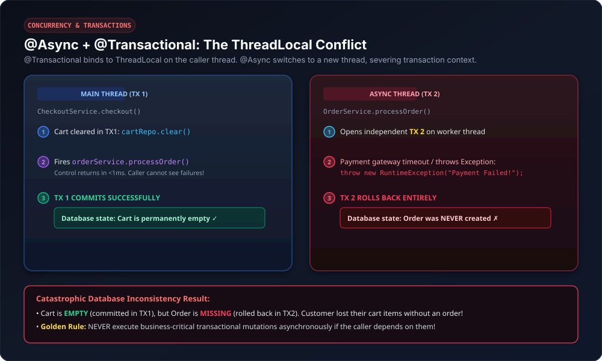
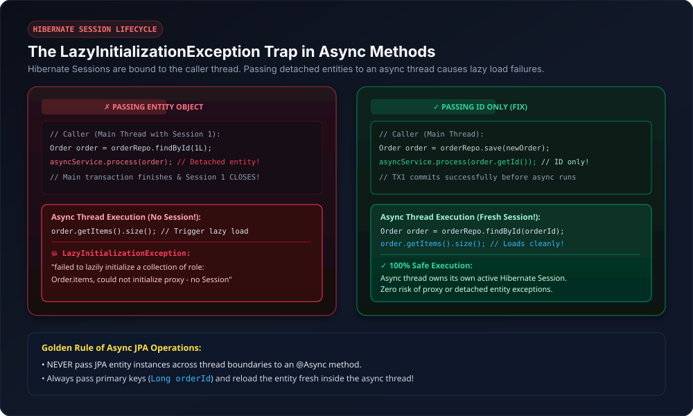
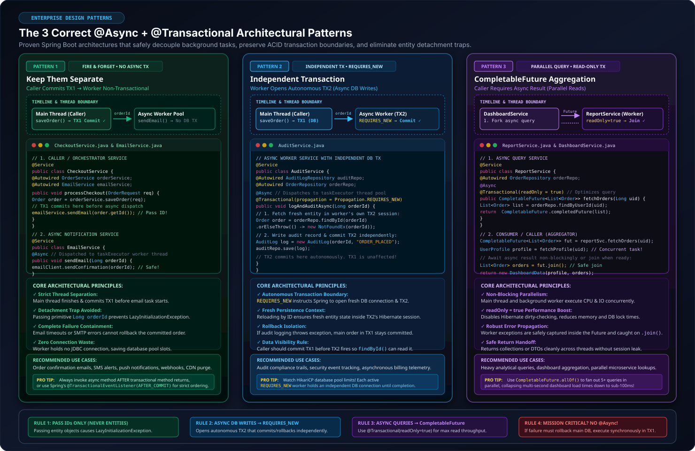
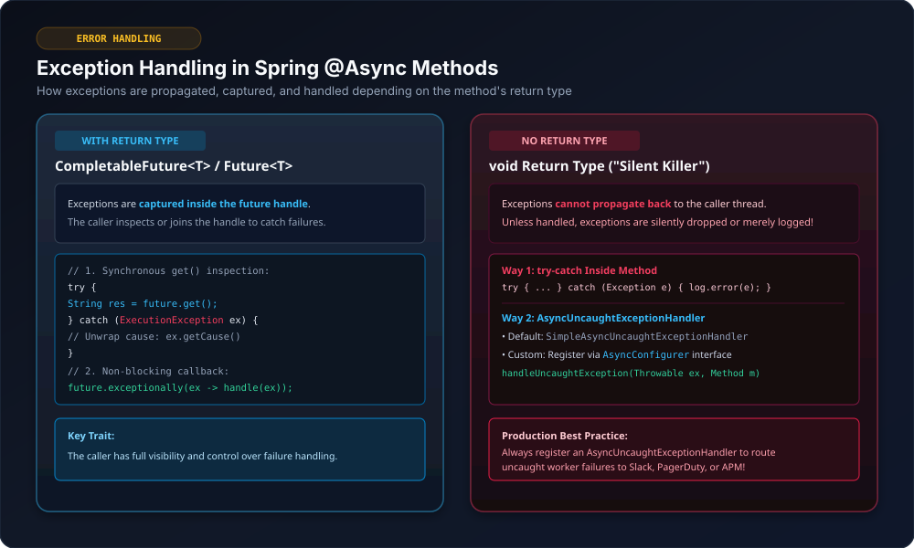

# Advanced Spring `@Async`: Transactions, Hibernate Lifecycle & Exception Handling

This guide dives into advanced asynchronous programming in Spring Boot, focusing on how `@Async` interacts with `@Transactional`, why Hibernate lazy-loading breaks across thread boundaries, method return types, and centralized exception handling.

---

## 1. Prerequisites: Conditions for `@Async` to Work Properly

For Spring's asynchronous processing to function as expected, two fundamental AOP proxy rules must be met:

### Condition 1: The Method Must Be in a Separate Class (No Self-Invocation)
Spring `@Async` relies on **CGLIB dynamic proxies**. When you invoke a method from within the same class, Java uses the implicit `this` reference, calling the raw target instance directly and **completely bypassing the Spring AOP proxy**.

#### ❌ Incorrect (Self-Invocation Bypasses Proxy):
```java
@RestController
@RequestMapping("/api")
public class UserController {

    @GetMapping("/getuser")
    public String getUserMethod() {
        System.out.println("inside getUserMethod: " + Thread.currentThread().getName());
        asyncMethodTest(); // ⚠️ Self-invocation within the same class!
        return null;
    }

    @Async
    public void asyncMethodTest() {
        System.out.println("inside asyncMethodTest: " + Thread.currentThread().getName());
    }
}
```

#### Console Output (Synchronous Execution!):
```text
inside getUserMethod: http-nio-8080-exec-1
inside asyncMethodTest: http-nio-8080-exec-1
```
*Notice both methods execute on the same Tomcat thread `http-nio-8080-exec-1`. The `@Async` annotation was completely ignored!*

#### ✓ Correct Solution:
Place the `@Async` method in a separate `@Service` or `@Component` bean and inject it into your controller or caller class.

---

### Condition 2: The Method Must Be `public`
Spring AOP proxies intercept method invocations by overriding methods in a generated subclass. `private`, `protected`, and package-private methods cannot be intercepted by Spring's async proxy.
- Always declare `@Async` methods as **`public`**.
- Never declare the class or method as **`final`** (CGLIB cannot subclass final classes or override final methods).

---

## 2. `@Async` and `@Transactional`: The Core Conflict

A very common bug in Spring enterprise applications occurs when combining `@Async` and `@Transactional`.



### Why Do They Fight Each Other?
1. **`@Transactional` uses `ThreadLocal`:** Spring binds the active database connection, transaction state, and Hibernate `EntityManager` / `Session` to the **current thread** via Java's `ThreadLocal`.
2. **`@Async` switches to a DIFFERENT thread:** The moment `@Async` executes, the task is dispatched to a background worker thread (e.g. `task-1`).
3. **Transaction isolation:** `ThreadLocal` variables **cannot cross thread boundaries**. The background thread has no access to the caller's transaction context!

---

### What Happens If You Naïvely Combine Both on the Same Method?

```java
@Service
public class OrderService {

    @Async
    @Transactional // ⚠️ Runs in a completely separate transaction on the async thread!
    public void processOrder(Order order) {
        orderRepo.save(order);
        paymentRepo.save(payment);
    }
}
```

| Main Thread (`[nio-exec-1]`) | Async Thread (`[task-1]`) |
|---|---|
| Calls `orderService.processOrder()` | Method begins execution on `task-1` |
| `@Async` proxy immediately returns control | `@Transactional` opens a **NEW, separate transaction** on `task-1` |
| Caller continues without waiting | Caller has **zero visibility** into whether the async transaction commits or fails! |
| Cannot rollback based on async results | If async fails, caller cannot undo its already committed changes |

---

### Problem 1: The Caller Cannot React to Async Transaction Failures

Consider an e-commerce checkout flow where the caller clears the shopping cart, and offloads order processing asynchronously:

```java
@Service
public class CheckoutService {

    @Autowired private CartRepository cartRepo;
    @Autowired private OrderService orderService;

    @Transactional // TX 1 on Main Thread
    public void checkout(Order order) {
        cartRepo.clear(); // Clears cart in TX1
        orderService.processOrder(order); // @Async call to background thread (TX 2)
        // TX1 COMMITS HERE! Cart is now permanently empty.
    }
}

@Service
public class OrderService {

    @Async
    @Transactional // TX 2 on Async Thread
    public void processOrder(Order order) {
        orderRepo.save(order);
        // Simulate credit card charge failure
        throw new RuntimeException("Payment Gateway Timeout!");
        // TX2 ROLLS BACK! Order is never saved.
    }
}
```

#### Execution Timeline & Inconsistent Database State:
```text
Main Thread:
  1. cartRepo.clear()              ──► Cart cleared in TX1
  2. processOrder() fired          ──► Control returns immediately
  3. TX1 COMMITS                   ──► Cart is permanently empty in DB ✓

Async Thread:
  1. orderRepo.save()              ──► Staged in TX2
  2. RuntimeException thrown       ──► "Payment Gateway Timeout!"
  3. TX2 ROLLS BACK                ──► Order is NOT saved in DB ✗

FINAL DATABASE STATE:
  • Cart: EMPTY ✓
  • Order: MISSING ✗  <-- Data corruption! User lost their cart items without an order!
```

---

### Problem 2: The `LazyInitializationException` Trap

Another common error occurs when passing a JPA entity with lazy-loaded collections to an `@Async` method:



```java
@Entity
public class Order {
    @Id private Long id;

    @OneToMany(fetch = FetchType.LAZY)
    private List<OrderItem> items; // Lazily loaded collection
}
```

#### ❌ The Trap:
```java
@Service
public class OrderService {

    @Transactional
    public void checkout(Long orderId) {
        Order order = orderRepo.findById(orderId).orElseThrow();
        // Passing the loaded entity object to an async method:
        notificationService.sendOrderSummary(order);
        // TX1 completes -> Hibernate Session for this thread is CLOSED!
    }
}

@Service
public class NotificationService {

    @Async
    public void sendOrderSummary(Order order) {
        // Accessing lazy collection on a DIFFERENT thread with NO Hibernate session:
        System.out.println("Items count: " + order.getItems().size()); // 💥 CRASH!
    }
}
```

#### Console Error:
```text
org.hibernate.LazyInitializationException: failed to lazily initialize a collection of role: 
com.example.Order.items, could not initialize proxy - no Session
```

#### Why It Crashes:
- The Hibernate `Session` that loaded `order` was attached to the **caller thread**.
- When the caller's `@Transactional` method completed, that Hibernate `Session` was closed.
- The async thread received a **detached entity**. When `order.getItems().size()` was invoked, Hibernate tried to query the database, but found **no active Hibernate Session on the async thread**.

#### ✓ The Fix (The Golden Rule of Async JPA):
> [!IMPORTANT]
> **NEVER pass JPA entity objects across thread boundaries to an `@Async` method!**
> Always pass only the **Entity ID** (`Long orderId`), and let the async method fetch a fresh entity within its own persistence context.

```java
// Caller:
notificationService.sendOrderSummary(order.getId()); // Pass ID only!

// Async Service:
@Async
@Transactional(readOnly = true)
public void sendOrderSummary(Long orderId) {
    // Loaded fresh within the async thread's own Hibernate session:
    Order order = orderRepo.findById(orderId).orElseThrow();
    System.out.println("Items count: " + order.getItems().size()); // Works perfectly!
}
```

---

## 3. The 3 Correct Architectural Patterns



---

### Pattern 1: Keep Them Separate (Simplest & Safest)
Do all critical transactional work synchronously on the caller thread, commit the transaction, and only then fire the async method for non-critical tasks (emails, notifications).

```java
@Service
public class CheckoutService {

    @Autowired private OrderService orderService;
    @Autowired private EmailService emailService;

    public void processCheckout(OrderRequest request) {
        // Step 1: Save order synchronously and commit database transaction
        Order order = orderService.saveOrder(request);

        // Step 2: Fire and forget async email AFTER transaction commit
        emailService.sendConfirmationEmail(order.getId());
    }
}
```

---

### Pattern 2: Async Method with Independent Transaction (`REQUIRES_NEW`)
When the asynchronous task itself needs to perform database writes (e.g., audit trails, event sourcing, notification history), configure it with `Propagation.REQUIRES_NEW`:

```java
@Service
public class AuditService {

    @Autowired private AuditLogRepository auditRepo;
    @Autowired private OrderRepository orderRepo;

    @Async
    @Transactional(propagation = Propagation.REQUIRES_NEW)
    public void logAndAuditAsync(Long orderId) {
        // 1. Fetch fresh entity in new transaction TX2
        Order order = orderRepo.findById(orderId).orElseThrow();

        // 2. Write audit log
        AuditLog log = new AuditLog(orderId, "ORDER_COMPLETED");
        auditRepo.save(log);
        // TX2 commits independently
    }
}
```

---

### Pattern 3: `CompletableFuture` for Async Queries / Reports
When the caller requires the result of an asynchronous operation (e.g., aggregating microservices or generating reports), use `CompletableFuture`:

```java
@Service
public class ReportService {

    @Autowired private OrderRepository orderRepo;

    @Async
    @Transactional(readOnly = true)
    public CompletableFuture<List<Order>> fetchUserOrdersAsync(Long userId) {
        List<Order> orders = orderRepo.findByUserId(userId);
        return CompletableFuture.completedFuture(orders);
    }
}
```

#### Consumer Example:
```java
@Service
public class DashboardService {

    @Autowired private ReportService reportService;

    public DashboardData loadDashboard(Long userId) {
        // Fire async query
        CompletableFuture<List<Order>> ordersFuture = reportService.fetchUserOrdersAsync(userId);

        // Perform other independent tasks on main thread...
        UserProfile profile = fetchProfile(userId);

        // Wait or join when needed
        List<Order> orders = ordersFuture.join();
        return new DashboardData(profile, orders);
    }
}
```

---

### Quick Decision Matrix

| Scenario | Recommendation |
|---|---|
| Need result of async work in your transaction? | **Do NOT use `@Async`**. Execute synchronously inside `@Transactional`. |
| Does async work need to modify the DB? | Use `@Async` + `@Transactional(propagation = Propagation.REQUIRES_NEW)` and pass **Entity ID only**. |
| Is async work mission-critical (failure must rollback main DB)? | **Do NOT use `@Async`**. Keep it synchronous within the main transaction. |
| Non-critical fire-and-forget (email, push alert, audit log)? | Use `@Async` on a separate bean, called **after** main transaction commits. |

---

## 4. Return Types in `@Async` Methods

Spring `@Async` methods support three return types:

### 1. `void` (Fire-and-Forget)
Best for notifications, telemetry, and background caching where the caller does not require feedback.

```java
@Async
public void sendSlackAlert(String message) {
    slackClient.post(message);
}
```

---

### 2. `Future<T>` (Legacy Java 5+)

In legacy Spring applications, `AsyncResult<T>` was used to return a `Future<T>`:

```java
@Service
public class UserService {

    @Async
    public Future<String> performTaskAsync() {
        try {
            Thread.sleep(2000);
            return new AsyncResult<>("Task completed successfully");
        } catch (InterruptedException e) {
            return new AsyncResult<>("Task interrupted");
        }
    }
}
```

#### Methods in `java.util.concurrent.Future`:
| Method | Purpose |
|---|---|
| `boolean cancel(boolean mayInterruptIfRunning)` | Attempts to cancel execution of the task. |
| `boolean isCancelled()` | Returns `true` if the task was cancelled before completion. |
| `boolean isDone()` | Returns `true` if the task completed, was cancelled, or threw an exception. |
| `V get()` | **Blocks the caller thread** until the async task finishes and returns the result. |
| `V get(long timeout, TimeUnit unit)` | Waits at most the given timeout; throws `TimeoutException` if expired. |

> [!NOTE]
> `AsyncResult` is **deprecated** as of Spring Framework 6.0 in favor of `CompletableFuture`.

---

### 3. `CompletableFuture<T>` (Modern Java 8+)

`CompletableFuture` supports non-blocking functional chaining, reactive callbacks, and parallel task composition:

```java
@Service
public class UserService {

    @Async
    public CompletableFuture<String> performTaskAsync() {
        try {
            Thread.sleep(2000);
            return CompletableFuture.completedFuture("async task result");
        } catch (Exception e) {
            return CompletableFuture.failedFuture(e);
        }
    }
}
```

#### Non-blocking Callbacks vs Blocking `get()`:
```java
// 1. Non-blocking callback (Recommended):
userService.performTaskAsync()
    .thenAccept(result -> System.out.println("Result: " + result))
    .exceptionally(ex -> {
        System.err.println("Error: " + ex.getMessage());
        return null;
    });

// 2. Synchronous get() (Blocks caller thread until complete):
try {
    String output = userService.performTaskAsync().get();
    System.out.println(output);
} catch (ExecutionException e) {
    System.err.println("Exception inside async thread: " + e.getCause());
} catch (InterruptedException e) {
    Thread.currentThread().interrupt();
}
```

---

## 5. Exception Handling in `@Async`



Exception handling strategies differ depending on whether the method returns a value or returns `void`.

---

### Category 1: Methods with Return Type (`CompletableFuture<T>` / `Future<T>`)

When an exception occurs in a method that returns a `Future`, Spring captures the exception inside the future handle.
- The caller receives the exception wrapped in an **`ExecutionException`** when invoking `.get()`.
- Or handles it non-blockingly via **`.exceptionally()`** or **`.handle()`**.

```java
CompletableFuture<String> future = userService.performTaskAsync();

// Catching via try-catch around get():
try {
    String result = future.get();
} catch (ExecutionException ex) {
    Throwable originalException = ex.getCause();
    System.err.println("Async thread threw: " + originalException.getMessage());
}
```

---

### Category 2: Methods with `void` Return Type ("The Silent Killer")

In `@Async void` methods, there is no return object to capture the error, and the caller thread has already moved on. By default, **exceptions thrown in void async methods are silently swallowed** unless explicitly handled!

There are two primary ways to handle exceptions in `void` methods:

#### Approach 1: Handle Inside the Async Method Itself
```java
@Async
public void performTaskAsync() {
    try {
        // Business logic that may throw ArithmeticException, etc.
        int result = 5 / 0;
    } catch (Exception e) {
        log.error("Exception handled within async method: {}", e.getMessage(), e);
    }
}
```

---

#### Approach 2: Centralized `AsyncUncaughtExceptionHandler` (Production Standard)

If an exception is unhandled within an `@Async void` method, Spring invokes an `AsyncUncaughtExceptionHandler`.

##### Spring's Default Handler:
If you do not provide a custom handler, Spring uses `SimpleAsyncUncaughtExceptionHandler`:
```java
// Spring Framework Internal Default:
public class SimpleAsyncUncaughtExceptionHandler implements AsyncUncaughtExceptionHandler {
    @Override
    public void handleUncaughtException(Throwable ex, Method method, Object... params) {
        logger.error("Unexpected exception occurred invoking async method: " + method, ex);
    }
}
```

##### Implementing a Custom Production Exception Handler:

You can implement `AsyncUncaughtExceptionHandler` to log errors, capture method parameters, and trigger alerts to Slack, Sentry, or PagerDuty:

```java
package com.example.async.handler;

import org.slf4j.Logger;
import org.slf4j.LoggerFactory;
import org.springframework.aop.interceptor.AsyncUncaughtExceptionHandler;
import org.springframework.stereotype.Component;

import java.lang.reflect.Method;
import java.util.Arrays;

@Component
public class CustomAsyncExceptionHandler implements AsyncUncaughtExceptionHandler {

    private static final Logger log = LoggerFactory.getLogger(CustomAsyncExceptionHandler.class);

    @Override
    public void handleUncaughtException(Throwable ex, Method method, Object... params) {
        log.error("================ ASYNC ERROR CAUGHT ================");
        log.error("Method Name    : {}", method.getName());
        log.error("Parameter Values: {}", Arrays.toString(params));
        log.error("Exception Message: {}", ex.getMessage());
        log.error("Exception Type : {}", ex.getClass().getName());
        log.error("====================================================");

        // Optional: Send alert to PagerDuty / Slack / Metrics dashboard
    }
}
```

##### Registering the Handler in `AsyncConfig`:
```java
package com.example.async.config;

import com.example.async.handler.CustomAsyncExceptionHandler;
import org.springframework.beans.factory.annotation.Autowired;
import org.springframework.context.annotation.Configuration;
import org.springframework.scheduling.annotation.AsyncConfigurer;
import org.springframework.scheduling.annotation.EnableAsync;
import org.springframework.aop.interceptor.AsyncUncaughtExceptionHandler;

@Configuration
@EnableAsync
public class AsyncConfig implements AsyncConfigurer {

    @Autowired
    private CustomAsyncExceptionHandler customAsyncExceptionHandler;

    @Override
    public AsyncUncaughtExceptionHandler getAsyncUncaughtExceptionHandler() {
        return customAsyncExceptionHandler;
    }
}
```

#### Verification Log Output:
When an async method throws an exception (e.g. `5 / 0` ArithmeticException):
```text
2026-09-05T23:04:14.082  INFO 70455 --- [nio-8080-exec-1] c.e.a.c.UserController   : inside getUserMethod
2026-09-05T23:04:14.085 ERROR 70455 --- [         task-1] c.e.a.h.CustomAsyncExceptionHandler : ================ ASYNC ERROR CAUGHT ================
2026-09-05T23:04:14.086 ERROR 70455 --- [         task-1] c.e.a.h.CustomAsyncExceptionHandler : Method Name    : performTaskAsync
2026-09-05T23:04:14.086 ERROR 70455 --- [         task-1] c.e.a.h.CustomAsyncExceptionHandler : Exception Message: / by zero
2026-09-05T23:04:14.087 ERROR 70455 --- [         task-1] c.e.a.h.CustomAsyncExceptionHandler : Exception Type : java.lang.ArithmeticException
2026-09-05T23:04:14.087 ERROR 70455 --- [         task-1] c.e.a.h.CustomAsyncExceptionHandler : ====================================================
```

---

## 6. Summary of Golden Rules

1. **Proxy Interception:** `@Async` methods must be `public` and invoked from a separate Spring bean to pass through the CGLIB proxy.
2. **Transaction Independence:** `@Transactional` does not cross thread boundaries. Never rely on an async method to rollback your caller's database transaction.
3. **No Detached Entities:** Never pass JPA entities into an `@Async` method to prevent `LazyInitializationException`. Pass primary key IDs and reload within the async thread.
4. **Order of Operations:** Commit critical database transactions on the main thread first, then dispatch async fire-and-forget tasks.
5. **Centralized Error Handling:** Always register a custom `AsyncUncaughtExceptionHandler` via `AsyncConfigurer` so exceptions in `void` methods are logged and monitored.