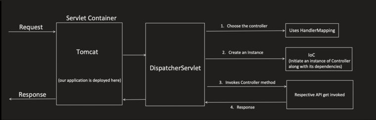
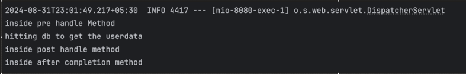
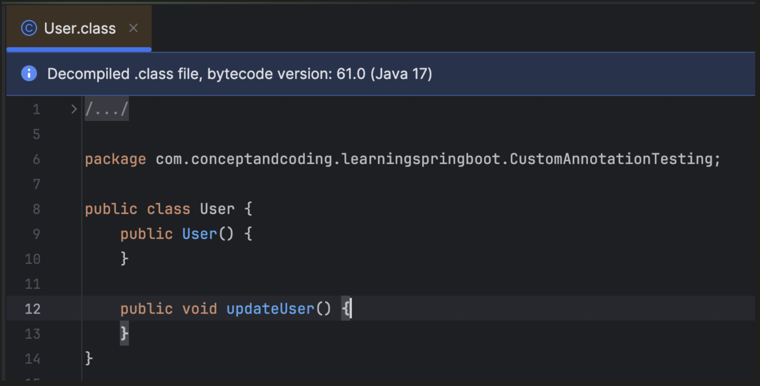
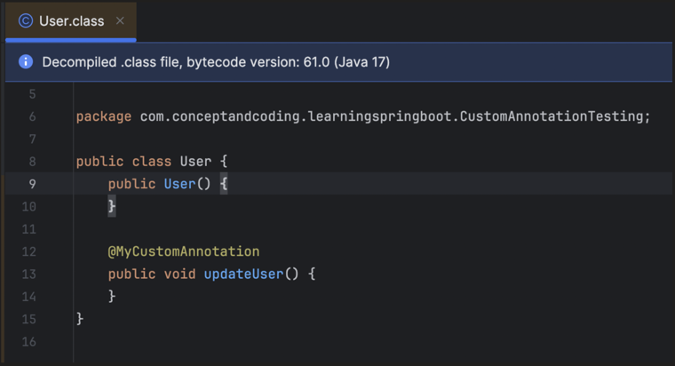
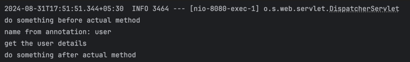

## Custom Interceptors in Spring Boot


**Interceptor:**
It's a mediator, which get invoked before or after your actual code.

In future topics below, we might need to write our custom interceptors:
- Springboot Caching,
- Springboot logging,
- Springboot Authentication etc..


### Custom Interceptor for Requests before even reaching to specific Controller class



```java
@RestController
@RequestMapping(value = "/api/")
public class UserController {

    @Autowired
    User user;

    @GetMapping(path = "/getUser")
    public String getUser() {
        user.getUser();
        return "success";
    }
}
```
See Interceptor

```java
@Component
public class MyCustomInterceptor implements HandlerInterceptor {

    @Override
    public boolean preHandle(HttpServletRequest request,
            HttpServletResponse response, Object handler) throws Exception {
        System.out.println("inside pre handle Method");
        return true;
    }

    @Override
    public void postHandle(HttpServletRequest request,
            HttpServletResponse response, Object handler,
            @Nullable ModelAndView modelAndView) throws Exception {
        System.out.println("inside post handle method");
    }

    @Override
    public void afterCompletion(HttpServletRequest request,
            HttpServletResponse response, Object handler,
            @Nullable Exception ex) throws Exception {
        System.out.println("inside after completion method");
    }
}
```

```java
@Configuration
public class AppConfig implements WebMvcConfigurer {

    @Autowired
    MyCustomInterceptor myCustomInterceptor;

    @Override
    public void addInterceptors(InterceptorRegistry registry) {

        registry.addInterceptor(myCustomInterceptor)
                .addPathPatterns("/api/*") // Apply to these URL patterns
                .excludePathPatterns("/api/updateUser", "/api/deleteUser"); // Exclude for these URL patterns
    }
}
```

`http://localhost:8080/api/getUser`

Output:



### Custom Interceptor for Requests after reaching to specific Controller class

**Step1: Creation of custom annotation**

We can create Custom Annotation using keyword "@interface" java Annotation.

```java
public @interface MyCustomAnnotation {
}
```

```java
public class User {

    @MyCustomAnnotation
    public void updateUser(){
        //some business logic
    }
}
```

**2 Important Meta Annotation properties are:**

**@Target:**
this meta annotation, tells where we can apply the particular annotation on method or class or constructor etc.

```java
@Target(ElementType.METHOD)
public @interface MyCustomAnnotation {
}
```

```java
@Target({ElementType.CONSTRUCTOR, ElementType.METHOD,
        ElementType.PARAMETER, ElementType.FIELD})
public @interface MyCustomAnnotation {
}
```

**@Retention:**
this meta annotation tell, how the particular annotation will be stored in java.

- **RetentionPolicy.SOURCE**: Annotation will be discarded by compiler itself and its not even recorded in .class file.
- **RetentionPolicy.CLASS**: Annotation will be recorded in .class file but ignored by JVM during run time.
- **RetentionPolicy.RUNTIME**: Annotation will be recorded in .class file and also available during run time.

**RetentionPolicy.SOURCE:**

```java
@Target({ElementType.METHOD})
@Retention(RetentionPolicy.SOURCE)
public @interface MyCustomAnnotation {
}
```

```java
public class User {

    @MyCustomAnnotation
    public void updateUser(){
        //some business logic
    }
}
```

after compilation .class is below — annotation is discarded, no trace of `@MyCustomAnnotation`:



**RetentionPolicy.RUNTIME:**

```java
@Target(ElementType.METHOD)
@Retention(RetentionPolicy.RUNTIME)
public @interface MyCustomAnnotation {
}
```

```java
public class User {

    @MyCustomAnnotation
    public void updateUser(){
        //some business logic
    }
}
```

after compilation .class is below — annotation is retained and visible on the compiled method:



### How to create Custom Annotation with methods (more like a fields)

No parameter, no body.

Return type is restricted to:
- Primitive type (int, boolean, double etc.)
- String
- Enum
- Class<?>
- Annotations
- Array of above types

**Using Annotation with Custom Attribute Value**

```java
@Target(ElementType.METHOD)
@Retention(RetentionPolicy.RUNTIME)
public @interface MyCustomAnnotation {

    String key() default "defaultKeyName";
}
```

```java
public class User {

    @MyCustomAnnotation(key = "userKey")
    public void updateUser(){
        //some business logic
    }
}
```

**Custom Annotation with Multiple Attribute Types**

```java
@Target(ElementType.METHOD)
@Retention(RetentionPolicy.RUNTIME)
public @interface MyCustomAnnotation {

    int intKey() default 0;

    String stringKey() default "defaultString";

    Class<?> classTypeKey() default String.class;

    MyCustomEnum enumKey() default MyCustomEnum.ENUM_VAL1;

    String[] stringArrayKey() default {"default1", "default2"};

    int[] intArrayKey() default {1, 2};
}
```

```java
public class User {

    @MyCustomAnnotation(
        intKey = 10,
        stringKey = "user",
        classTypeKey = User.class,
        enumKey = MyCustomEnum.ENUM_VAL2
    )
    public void updateUser(){
        //some business logic
    }
}
```

**Step2: Creation of Custom Interceptor**

```java
@RestController
@RequestMapping(value = "/api/")
public class UserController {

    @Autowired
    User user;

    @GetMapping(path = "/getUser")
    public String getUser(){
        user.getUser();
        return "success";
    }
}
```

```java
@Target({ElementType.METHOD})
@Retention(RetentionPolicy.RUNTIME)
public @interface MyCustomAnnotation {

    String name() default "";
}
```

```java
@Component
public class User {

    @MyCustomAnnotation(name = "user")
    public void getUser() {
        System.out.println("get the user details");
    }
}
```

```java
@Component
@Aspect
public class MyCustomInterceptor {

    @Around("@annotation(com.conceptandcoding.learningspringboot.CustomInterceptor.MyCustomAnnotation)") //pointcut expression
    public void invoke(ProceedingJoinPoint joinPoint) throws Throwable { //advice

        System.out.println("do something before actual method");

        Method method = ((MethodSignature) joinPoint.getSignature()).getMethod();

        if(method.isAnnotationPresent(MyCustomAnnotation.class)){
            MyCustomAnnotation annotation = method.getAnnotation(MyCustomAnnotation.class);
            System.out.println("name from annotation: " + annotation.name());
        }

        joinPoint.proceed();

        System.out.println("do something after actual method");
    }
}
```

Output:

