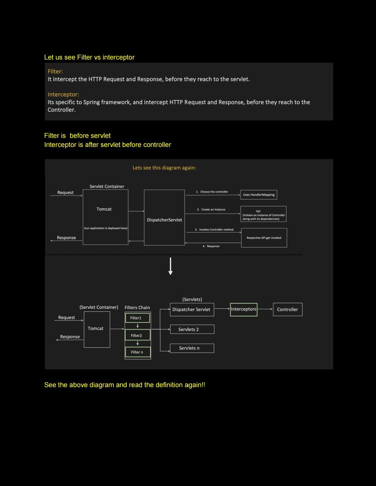
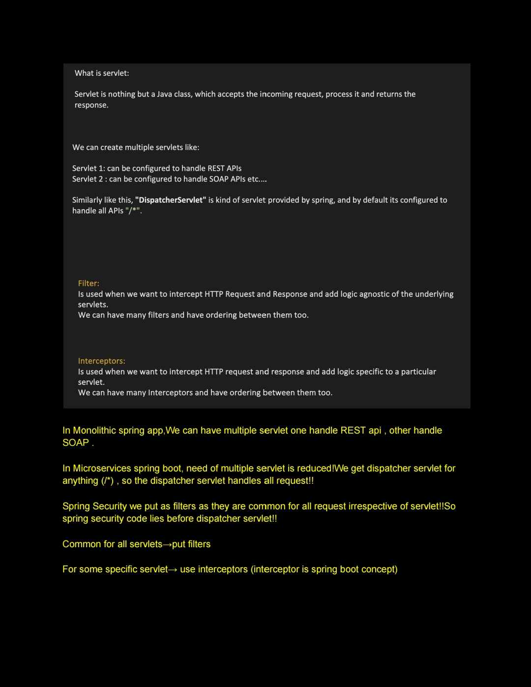
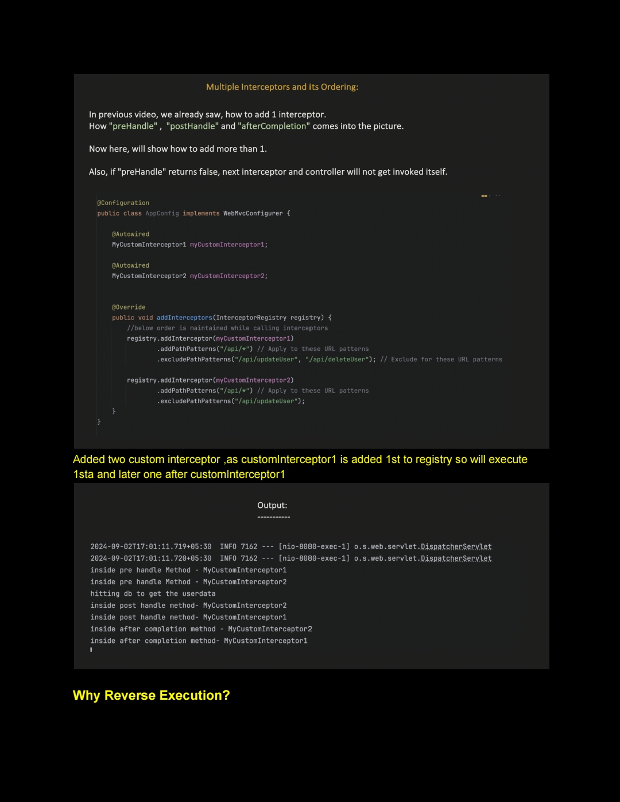
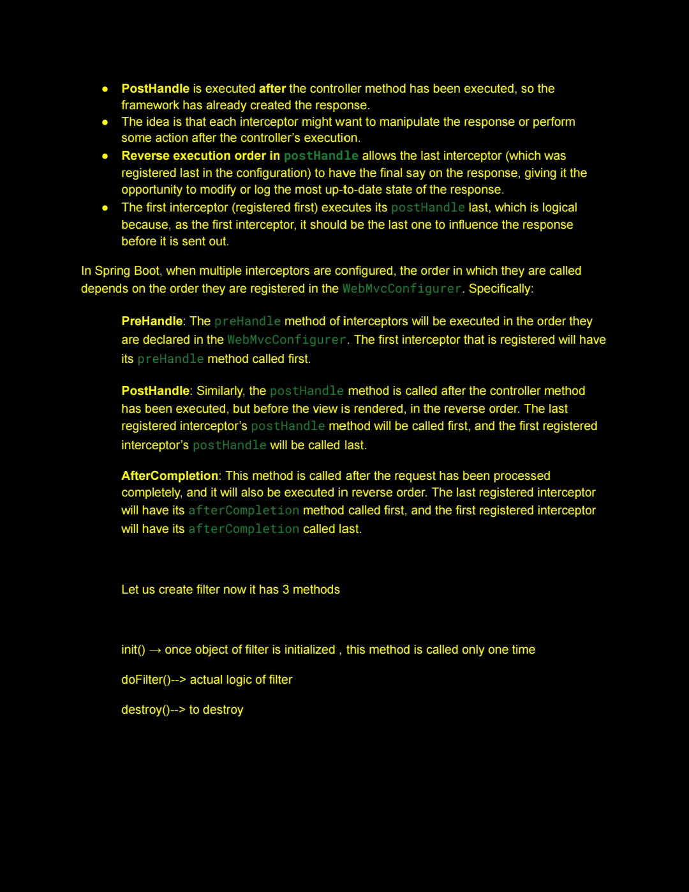
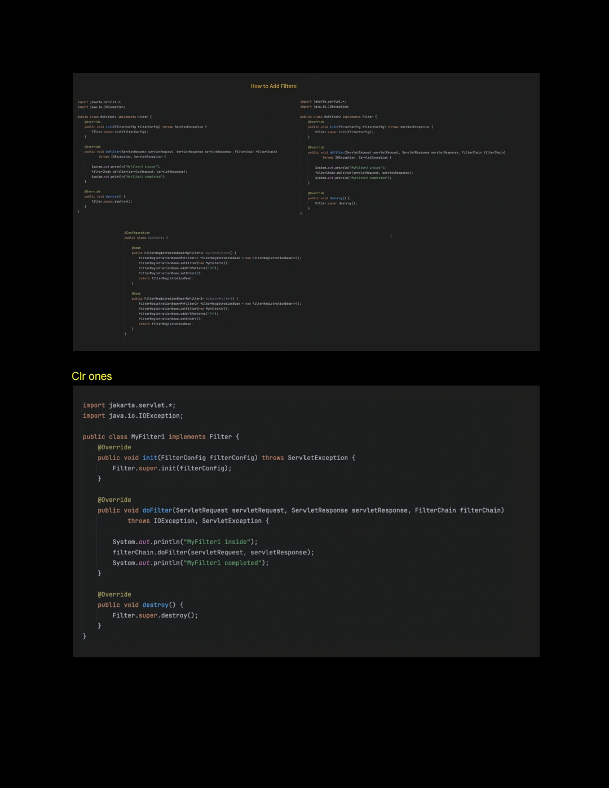
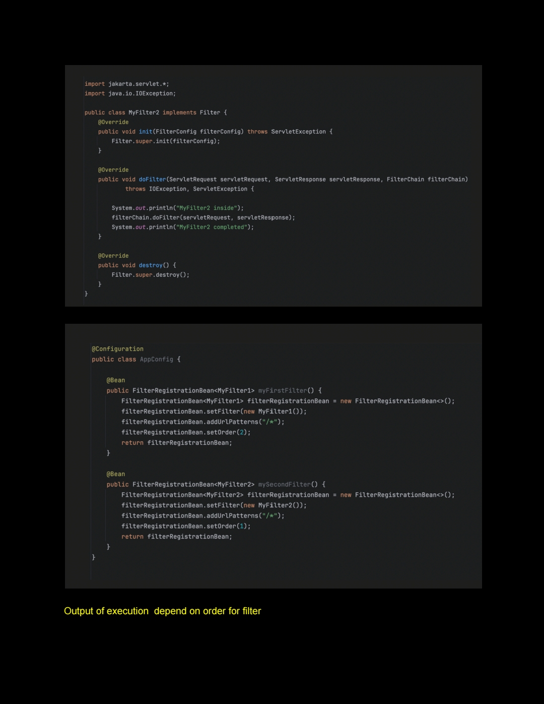
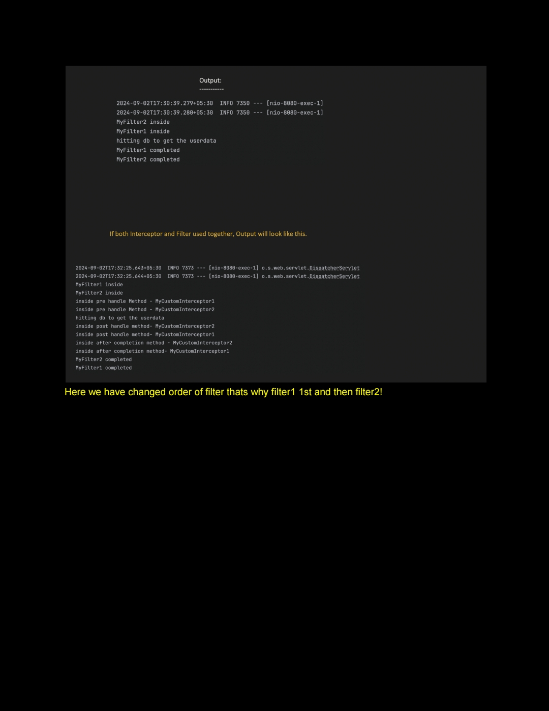
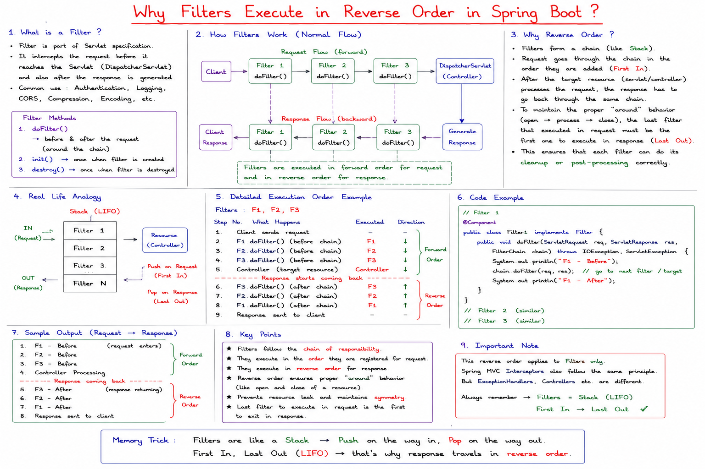
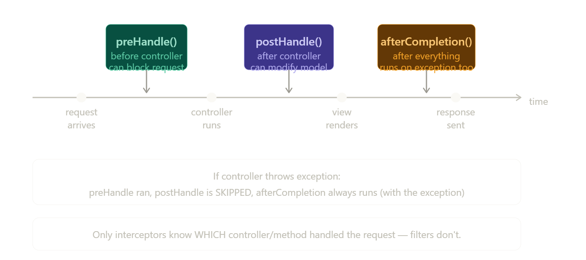

# Notes
      


## Filter vs Interceptor in Spring Boot



### The key difference in one line

> **Filter** lives in the **servlet container** (Tomcat) — it sees raw HTTP requests before Spring touches them.
> **Interceptor** lives inside **Spring's DispatcherServlet** — it sees requests after Spring has parsed them.The position in the pipeline is the fundamental architectural difference. Filters run before Spring even knows about the request. Interceptors run inside Spring after the `DispatcherServlet` has parsed everything and knows which controller will handle it.

---

### Filter — complete anatomy

A filter implements `javax.servlet.Filter` — it's a Java EE standard, not Spring-specific:

```java
@Component   // register as Spring bean so it gets picked up
public class RequestLoggingFilter implements Filter {

    @Override
    public void init(FilterConfig filterConfig) throws ServletException {
        // runs once at startup — set up resources
    }

    @Override
    public void doFilter(ServletRequest request,
                         ServletResponse response,
                         FilterChain chain) throws IOException, ServletException {

        HttpServletRequest req = (HttpServletRequest) request;

        // ---- BEFORE request reaches servlet ----
        long start = System.currentTimeMillis();
        log.info("Incoming: {} {}", req.getMethod(), req.getRequestURI());

        // MUST call this to pass to next filter (or servlet)
        // if you don't call it, the request is BLOCKED here
        chain.doFilter(request, response);

        // ---- AFTER response is generated ----
        long duration = System.currentTimeMillis() - start;
        log.info("Completed in {}ms", duration);
    }

    @Override
    public void destroy() {
        // runs once at shutdown — clean up resources
    }
}
```

If you need control over URL patterns or ordering:

```java
@Configuration
public class FilterConfig {

    @Bean
    public FilterRegistrationBean<RequestLoggingFilter> loggingFilter() {
        FilterRegistrationBean<RequestLoggingFilter> bean =
            new FilterRegistrationBean<>();
        bean.setFilter(new RequestLoggingFilter());
        bean.addUrlPatterns("/api/*");   // only applies to /api/ paths
        bean.setOrder(1);               // lower = runs first
        return bean;
    }

    @Bean
    public FilterRegistrationBean<AuthFilter> authFilter() {
        FilterRegistrationBean<AuthFilter> bean =
            new FilterRegistrationBean<>();
        bean.setFilter(new AuthFilter());
        bean.addUrlPatterns("/*");
        bean.setOrder(2);               // runs after logging filter
        return bean;
    }
}
```

---

### Interceptor — complete anatomy

An interceptor implements Spring's `HandlerInterceptor` — it has three distinct hook points:

```java
@Component
public class AuditInterceptor implements HandlerInterceptor {

    // 1. Runs BEFORE the controller method
    // return true  = continue to controller
    // return false = block — controller never runs
    @Override
    public boolean preHandle(HttpServletRequest request,
                             HttpServletResponse response,
                             Object handler) throws Exception {

        // 'handler' is the actual controller method about to run
        HandlerMethod method = (HandlerMethod) handler;
        log.info("About to call: {}.{}()",
            method.getBeanType().getSimpleName(),
            method.getMethod().getName());

        // can check annotations on the controller method
        if (method.hasMethodAnnotation(AdminOnly.class)) {
            if (!isAdmin(request)) {
                response.sendError(403);
                return false;   // block the request
            }
        }

        return true;  // proceed
    }

    // 2. Runs AFTER controller, BEFORE view rendering
    // modelAndView is null for @RestController (no view)
    @Override
    public void postHandle(HttpServletRequest request,
                           HttpServletResponse response,
                           Object handler,
                           ModelAndView modelAndView) throws Exception {

        // can add data to the model before view renders
        if (modelAndView != null) {
            modelAndView.addObject("appVersion", "1.0.5");
        }
    }

    // 3. Runs AFTER everything — even if an exception was thrown
    // perfect for cleanup, timing, logging final outcome
    @Override
    public void afterCompletion(HttpServletRequest request,
                                HttpServletResponse response,
                                Object handler,
                                Exception ex) throws Exception {

        if (ex != null) {
            log.error("Request failed: {}", ex.getMessage());
        }
        log.info("Request fully completed: {} {}",
            request.getMethod(), request.getRequestURI());
    }
}
```

Register it with `WebMvcConfigurer`:

```java
@Configuration
public class WebConfig implements WebMvcConfigurer {

    @Autowired private AuditInterceptor auditInterceptor;
    @Autowired private RateLimitInterceptor rateLimitInterceptor;

    @Override
    public void addInterceptors(InterceptorRegistry registry) {
        registry.addInterceptor(auditInterceptor)
                .addPathPatterns("/api/**")       // apply to these paths
                .excludePathPatterns("/api/health"); // but not this one

        registry.addInterceptor(rateLimitInterceptor)
                .addPathPatterns("/**")
                .order(1);                        // runs first
    }
}
```

---

### The three interceptor hooks — when each fires

The `postHandle` skip on exception is a subtle but important behaviour — if you want guaranteed cleanup logic, always put it in `afterCompletion`, never `postHandle`.

---

### What each can and cannot do

This is the practical difference that determines which one to choose:

| Capability | Filter | Interceptor |
|---|---|---|
| Modify request body/response body | Yes | No (body already read) |
| Access raw `InputStream` / `OutputStream` | Yes | No |
| Know which controller will handle request | No | Yes (`handler` object) |
| Read annotations on controller method | No | Yes |
| Access Spring `ModelAndView` | No | Yes (`postHandle`) |
| Access Spring beans via `@Autowired` | Yes (if Spring bean) | Yes (always a Spring bean) |
| Apply to non-Spring requests (static files etc.) | Yes | No (only Spring MVC routes) |
| Works without Spring | Yes (Java EE standard) | No (Spring only) |
| Exception access after response | No | Yes (`afterCompletion`) |

---

### Real-world use cases — which to use when

```java
// USE FILTER for these:

// 1. CORS headers — must be set before Spring touches the request
@Component
@Order(Ordered.HIGHEST_PRECEDENCE)
public class CorsFilter implements Filter {
    @Override
    public void doFilter(ServletRequest req, ServletResponse res,
                         FilterChain chain) throws IOException, ServletException {
        HttpServletResponse response = (HttpServletResponse) res;
        response.setHeader("Access-Control-Allow-Origin", "*");
        response.setHeader("Access-Control-Allow-Methods", "GET,POST,PUT,DELETE");
        chain.doFilter(req, res);
    }
}

// 2. Request body caching (body can only be read once — wrap it)
@Component
public class CachingRequestBodyFilter implements Filter {
    @Override
    public void doFilter(ServletRequest req, ServletResponse res,
                         FilterChain chain) throws IOException, ServletException {
        ContentCachingRequestWrapper wrapped =
            new ContentCachingRequestWrapper((HttpServletRequest) req);
        chain.doFilter(wrapped, res);   // now body can be re-read
    }
}

// 3. JWT authentication (Spring Security's BasicAuthenticationFilter is also a Filter)
@Component
public class JwtFilter extends OncePerRequestFilter {
    @Override
    protected void doFilterInternal(HttpServletRequest req,
                                    HttpServletResponse res,
                                    FilterChain chain) {
        String token = req.getHeader("Authorization");
        if (token != null && jwtService.isValid(token)) {
            SecurityContextHolder.getContext()
                .setAuthentication(buildAuth(token));
        }
        chain.doFilter(req, res);
    }
}
```

```java
// USE INTERCEPTOR for these:

// 1. Role-based access using custom annotations on controller methods
@Component
public class RoleCheckInterceptor implements HandlerInterceptor {
    @Override
    public boolean preHandle(HttpServletRequest req,
                             HttpServletResponse res,
                             Object handler) throws Exception {
        if (!(handler instanceof HandlerMethod)) return true;

        HandlerMethod method = (HandlerMethod) handler;
        RequiresRole annotation = method.getMethodAnnotation(RequiresRole.class);

        if (annotation != null && !hasRole(req, annotation.value())) {
            res.sendError(403, "Insufficient role");
            return false;
        }
        return true;
    }
}

// 2. Per-controller execution timing
@Component
public class TimingInterceptor implements HandlerInterceptor {
    @Override
    public boolean preHandle(HttpServletRequest req,
                             HttpServletResponse res, Object handler) {
        req.setAttribute("startTime", System.currentTimeMillis());
        return true;
    }

    @Override
    public void afterCompletion(HttpServletRequest req,
                                HttpServletResponse res,
                                Object handler, Exception ex) {
        long start = (Long) req.getAttribute("startTime");
        HandlerMethod method = (HandlerMethod) handler;
        log.info("{}.{} took {}ms",
            method.getBeanType().getSimpleName(),
            method.getMethod().getName(),
            System.currentTimeMillis() - start);
    }
}

// 3. Locale / timezone setup based on user preferences
@Component
public class LocaleInterceptor implements HandlerInterceptor {
    @Override
    public boolean preHandle(HttpServletRequest req,
                             HttpServletResponse res, Object handler) {
        String locale = req.getHeader("Accept-Language");
        LocaleContextHolder.setLocale(new Locale(locale));
        return true;
    }
}
```

---

### Execution order when both exist together

```
HTTP Request
     │
     ▼
Filter 1 — doFilter() before chain.doFilter()
     │
     ▼
Filter 2 — doFilter() before chain.doFilter()
     │
     ▼
DispatcherServlet receives request
     │
     ▼
Interceptor 1 — preHandle()      → true, continue
Interceptor 2 — preHandle()      → true, continue
     │
     ▼
Controller method executes
     │
     ▼
Interceptor 2 — postHandle()     ← reverse order
Interceptor 1 — postHandle()     ← reverse order
     │
     ▼
Response written
     │
     ▼
Interceptor 2 — afterCompletion() ← reverse order
Interceptor 1 — afterCompletion() ← reverse order
     │
     ▼
Filter 2 — doFilter() after chain.doFilter()
Filter 1 — doFilter() after chain.doFilter()
     │
     ▼
HTTP Response
```

Interceptors run in registration order for `preHandle` and `postHandle`, then in **reverse** order for `afterCompletion`. Filters run in `@Order` order before and in reverse after.

---

### The one-line decision rule

> Use a **Filter** when you need to work with the raw HTTP request/response, before Spring is involved — security, CORS, body caching, compression.
> Use an **Interceptor** when you need to work with Spring MVC specifics — which controller ran, which annotations it has, the model data, per-handler timing or logging.

