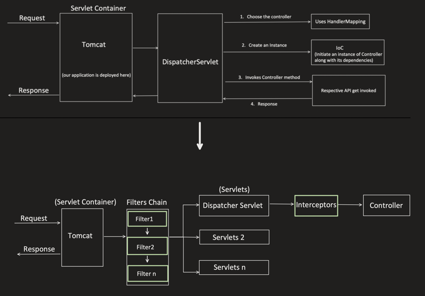
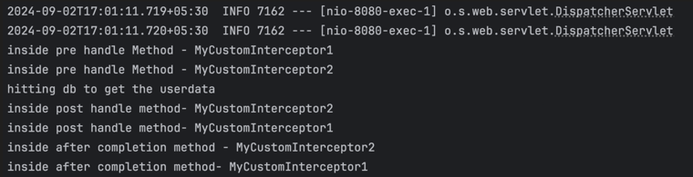
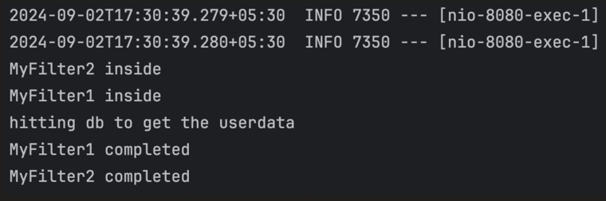
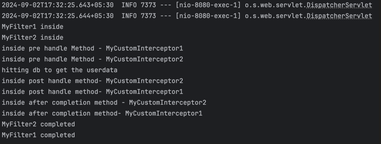
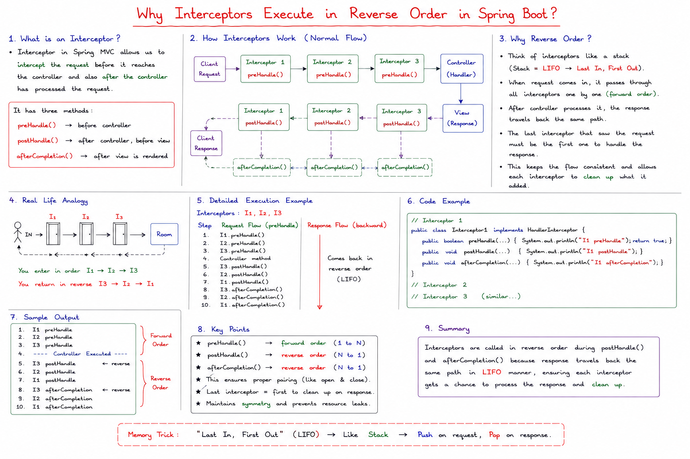

---

## Filter vs Interceptor


**Filter:**
It intercept the HTTP Request and Response, before they reach to the servlet.

**Interceptor:**
Its specific to Spring framework, and intercept HTTP Request and Response, before they reach to the Controller.

Lets see this diagram again:



**What is servlet:**

Servlet is nothing but a Java class, which accepts the incoming request, process it and returns the response.

We can create multiple servlets like:
- Servlet 1: can be configured to handle REST APIs
- Servlet 2: can be configured to handle SOAP APIs etc...

Similarly like this, "DispatcherServlet" is kind of servlet provided by spring, and by default its configured to handle all APIs "/*".

**Filter:**
Is used when we want to intercept HTTP Request and Response and add logic agnostic of the underlying servlets.
We can have many filters and have ordering between them too.

**Interceptors:**
Is used when we want to intercept HTTP request and response and add logic specific to a particular servlet.
We can have many Interceptors and have ordering between them too.

### Multiple Interceptors and its Ordering

In previous video, we already saw, how to add 1 interceptor.
How "preHandle", "postHandle" and "afterCompletion" comes into the picture.

Now here, will show how to add more than 1.
Also, if "preHandle" returns false, next interceptor and controller will not get invoked itself.

```java
@Configuration
public class AppConfig implements WebMvcConfigurer {

    @Autowired
    MyCustomInterceptor1 myCustomInterceptor1;

    @Autowired
    MyCustomInterceptor2 myCustomInterceptor2;

    @Override
    public void addInterceptors(InterceptorRegistry registry) {

        // below order is maintained while calling interceptors
        registry.addInterceptor(myCustomInterceptor1)
                .addPathPatterns("/api/*") // Apply to these URL patterns
                .excludePathPatterns("/api/updateUser", "/api/deleteUser"); // Exclude for these URL patterns

        registry.addInterceptor(myCustomInterceptor2)
                .addPathPatterns("/api/*") // Apply to these URL patterns
                .excludePathPatterns("/api/updateUser");
    }
}
```

Output:



### How to Add Filters

```java
import jakarta.servlet.*;
import java.io.IOException;

public class MyFilter1 implements Filter {

    @Override
    public void init(FilterConfig filterConfig) throws ServletException {
        Filter.super.init(filterConfig);
    }

    @Override
    public void doFilter(ServletRequest servletRequest,
                          ServletResponse servletResponse,
                          FilterChain filterChain)
            throws IOException, ServletException {

        System.out.println("MyFilter1 inside");
        filterChain.doFilter(servletRequest, servletResponse);
        System.out.println("MyFilter1 completed");
    }

    @Override
    public void destroy() {
        Filter.super.destroy();
    }
}
```

```java
import jakarta.servlet.*;
import java.io.IOException;

public class MyFilter2 implements Filter {

    @Override
    public void init(FilterConfig filterConfig) throws ServletException {
        Filter.super.init(filterConfig);
    }

    @Override
    public void doFilter(ServletRequest servletRequest,
                          ServletResponse servletResponse,
                          FilterChain filterChain)
            throws IOException, ServletException {

        System.out.println("MyFilter2 inside");
        filterChain.doFilter(servletRequest, servletResponse);
        System.out.println("MyFilter2 completed");
    }

    @Override
    public void destroy() {
        Filter.super.destroy();
    }
}
```

```java
@Configuration
public class AppConfig {

    @Bean
    public FilterRegistrationBean<MyFilter1> myFirstFilter() {
        FilterRegistrationBean<MyFilter1> filterRegistrationBean = new FilterRegistrationBean<>();
        filterRegistrationBean.setFilter(new MyFilter1());
        filterRegistrationBean.addUrlPatterns("/*");
        filterRegistrationBean.setOrder(2);
        return filterRegistrationBean;
    }

    @Bean
    public FilterRegistrationBean<MyFilter2> mySecondFilter() {
        FilterRegistrationBean<MyFilter2> filterRegistrationBean = new FilterRegistrationBean<>();
        filterRegistrationBean.setFilter(new MyFilter2());
        filterRegistrationBean.addUrlPatterns("/*");
        filterRegistrationBean.setOrder(1);
        return filterRegistrationBean;
    }
}
```

Output (lower order value = higher priority, so MyFilter2 (order 1) runs before MyFilter1 (order 2)):



If both Interceptor and Filter used together, Output will look like this:






