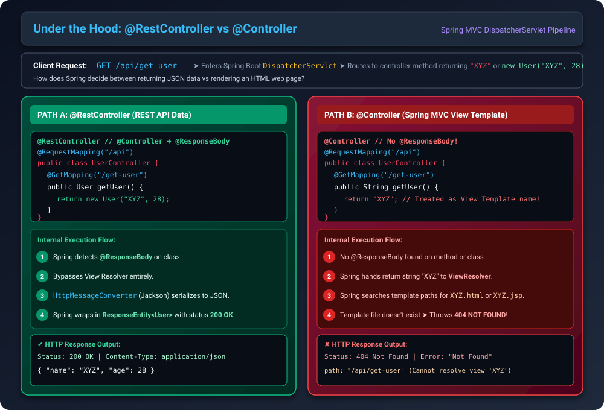
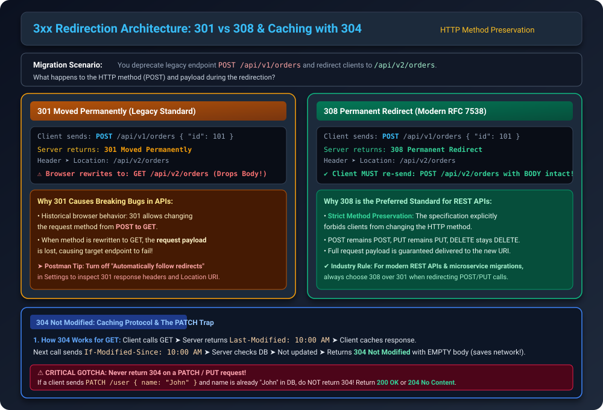
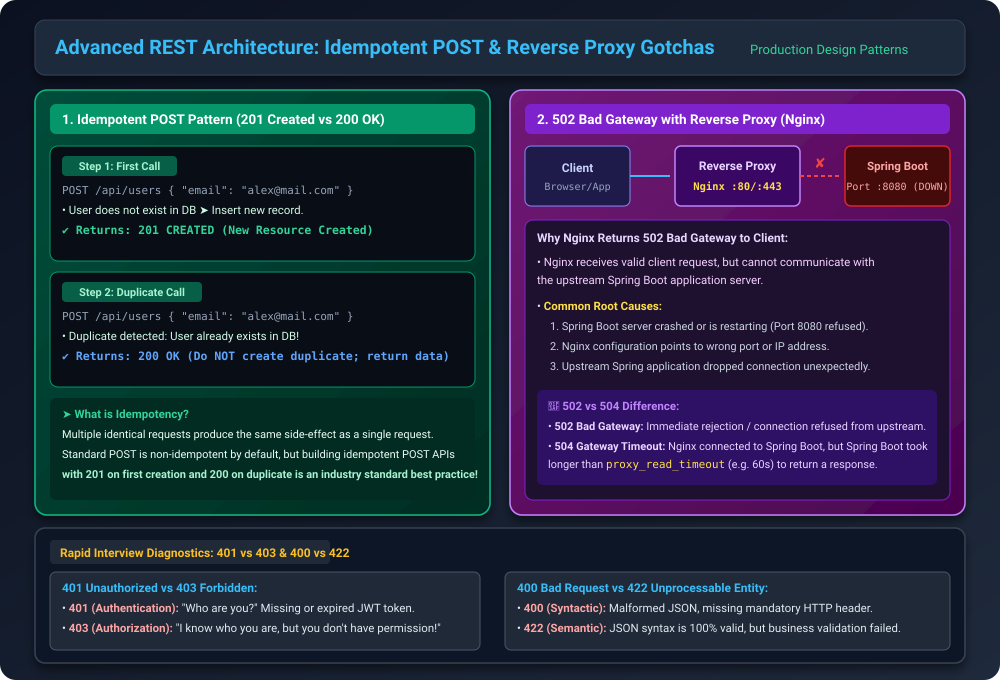

## 1. Anatomy of an HTTP Response

In client-server communication (REST APIs), an HTTP response sent back to the client contains three fundamental components:

1. **Status Code:**
   The 3-digit numeric code indicating the outcome of the request (e.g., `200 OK`, `201 CREATED`, `400 BAD_REQUEST`, `500 INTERNAL_SERVER_ERROR`).
2. **Headers (Optional):**
   Key-value metadata providing supplementary information about the response (e.g., `Content-Type: application/json`, `Location: /api/v2/users`, custom headers).
3. **Body (Payload):**
   The actual response data sent to the client (e.g., JSON representation of a user, plain text, or binary stream). In responses like `204 NO_CONTENT` or redirect responses, the body may be empty (`null`).


---

## 2. Using `ResponseEntity<T>` in Spring Boot

`ResponseEntity<T>` represents the entire HTTP response (Status Code, Headers, and Body). In this generic signature:
- **`T`** represents the type of the **response body** object (e.g., `ResponseEntity<User>`, `ResponseEntity<String>`, or `ResponseEntity<Void>`).

### Pattern A: Standard Response with Body
```java
@GetMapping(path = "/get-user")
public ResponseEntity<String> getUser() {
    return ResponseEntity.ok("My Response body Object can go here");
}
```

### Pattern B: Custom Status Code, Headers, and Body (Builder Pattern)
```java
@GetMapping(path = "/get-user")
public ResponseEntity<String> getUser() {
    HttpHeaders headers = new HttpHeaders();
    headers.add("My-Header1", "SomeValue1");
    headers.add("My-Header2", "SomeValue2");

    return ResponseEntity.status(HttpStatus.OK)
            .headers(headers)
            .body("My Response body Object can go here");
}
```

#### Understanding the Builder Pattern:
Spring's `ResponseEntity` uses the Builder Design Pattern:
- `ResponseEntity.status(HttpStatus.OK)` returns a `BodyBuilder` instance.
- `.headers(headers)` configures metadata on the `BodyBuilder`.
- `.body(T body)` is the final call that completes construction and returns `ResponseEntity<T>`.

```java
// Spring Framework internal signatures:
public static BodyBuilder status(HttpStatusCode status) { ... }
BodyBuilder headers(@Nullable HttpHeaders headers);
<T> ResponseEntity<T> body(@Nullable T body);
```

### Pattern C: Response with No Body (`ResponseEntity<Void>` & `.build()`)
When an endpoint succeeds but does not return any data (such as a `204 NO_CONTENT` or a deletion operation), use the `.build()` method instead of `.body()`:

```java
@GetMapping(path = "/get-user")
public ResponseEntity<Void> getUser() {
    HttpHeaders headers = new HttpHeaders();
    headers.add("My-Header1", "SomeValue1");
    headers.add("My-Header2", "SomeValue2");

    return ResponseEntity.status(HttpStatus.OK)
            .headers(headers)
            .build(); // Returns ResponseEntity<Void> with body set to null
}
```

> **Key Rule:** `.build()` returns `ResponseEntity<T>` with `body = null`. Whenever an API sends an empty response body, call `.build()`.

---

## 3. Spring Boot Default Behavior & `@ResponseBody`

What happens when an endpoint returns a plain Java POJO or String directly without wrapping it in a `ResponseEntity`?

```java
@RestController
@RequestMapping(value = "/api")
public class UserController {

    @GetMapping(path = "/get-user")
    public User getUser() {
        User responseObj = new User("XYZ", 28);
        return responseObj;
    }
}
```

### Postman Test Output:
```json
Status: 200 OK
Content-Type: application/json

{
  "name": "XYZ",
  "age": 28
}
```

### Behind the Scenes:
1. Even though `ResponseEntity` is not written explicitly in the method signature, **Spring Boot automatically wraps the returned object in a `ResponseEntity<User>`** internally.
2. By default, Spring assigns status code **`200 OK`**.

---

## 4. `@RestController` vs `@Controller` (Under the Hood)



### What does `@ResponseBody` do?
When a method returns a plain String or POJO, `@ResponseBody` tells Spring:
> *"Treat this return value directly as the serialized HTTP response body (JSON/XML/text), rather than as an MVC View template name."*

### Why don't we write `@ResponseBody` with `@RestController`?
Looking at the internal declaration of `@RestController`:

```java
@Target(ElementType.TYPE)
@Retention(RetentionPolicy.RUNTIME)
@Documented
@Controller
@ResponseBody // <-- Meta-annotation bundled here!
public @interface RestController {
    @AliasFor(annotation = Controller.class)
    String value() default "";
}
```
**`@RestController` is a convenience composed annotation: `@Controller` + `@ResponseBody`.** It automatically applies `@ResponseBody` to every handler method in the class.

---

### What happens if you use `@Controller` instead?

```java
@Controller
@RequestMapping(value = "/api")
public class UserController {

    @GetMapping(path = "/get-user")
    public String getUser() {
        return "XYZ";
    }
}
```

### Postman Output:
```json
Status: 404 Not Found

{
  "timestamp": "2024-09-08T19:19:30.179+00:00",
  "status": 404,
  "error": "Not Found",
  "path": "/api/get-user"
}
```

### Why does `@Controller` return 404 Not Found?
1. In Spring MVC, `@Controller` expects handler methods to return a **View Name** (e.g., `XYZ.html`, `XYZ.jsp`, or a Thymeleaf template).
2. The `DispatcherServlet` passes `"XYZ"` to the configured `ViewResolver`.
3. Spring Boot searches template folders for a file named `XYZ.html`.
4. Because no such view template exists, Spring throws a **`404 Not Found`** error.

> **Rule:**
> - Use **`@RestController`** for building RESTful APIs returning data (JSON/XML).
> - Use **`@Controller`** for traditional Spring MVC web applications rendering HTML pages/views.
> - If you must return raw data from a `@Controller`, you **must** explicitly add `@ResponseBody` above the method or return a `ResponseEntity`.

---

## 5. HTTP Status Codes: Overview & Categories

HTTP response status codes are grouped into five distinct standard categories:


| Category | Classification | Meaning & Responsibility |
| :--- | :--- | :--- |
| **`1xx`** | **Informational** | Request received, continuing process (Interim status, not final response). |
| **`2xx`** | **Success** | Request successfully received, understood, and processed. |
| **`3xx`** | **Redirection** | Client must take additional action to complete request (Redirect / Cache validation). |
| **`4xx`** | **Client / Validation Error** | Client passed invalid data, missing params, or business rule validation failed. |
| **`5xx`** | **Server Error** | Server failed to fulfill a valid request due to bug, crash, timeout, or DB downtime. |

---

## 6. 1xx: Informational Status Codes

Informational codes provide interim progress updates before the server delivers the final response. They are rarely used in standard web APIs.

### `100 Continue`
Used when uploading large payloads (e.g., multi-megabyte files):
1. **Preliminary Check:** Client sends request headers first with:
   ```http
   Content-Length: 10485760
   Content-Type: multipart/form-data
   Expect: 100-continue
   ```
2. **Server Validation:** The server evaluates authorization, authentication, and acceptable content length *before* receiving the large body.
3. **Acknowledgment:** If ready, server replies with `100 Continue`.
4. **Body Transmission:** Client then transmits the heavy file payload.

---

## 7. 2xx: Success Status Codes

Indicates that the client request was successfully processed.

### `200 OK`
- Used for successful `GET`, `PUT`, and **idempotent duplicate `POST`** calls.
- The requested data is returned in the response body.

### `201 Created`
- Used for `POST` requests when a **new resource is successfully created** in the database.
- Best practice: Include the created resource or a `Location` header pointing to the newly created URI.

### `202 Accepted`
- The request has been accepted for processing, but processing is **not yet completed**.
- Ideal for **asynchronous batch processing** (e.g., long-running Excel export, bulk imports, report generation).

### `204 No Content`
- The server successfully fulfilled the request, and there is **no content/body to return**.
- Standard for `DELETE` operations or status updates that do not need to echo data back.

### `206 Partial Content`
- Used when a request is partially successful (e.g., bulk addition where 95 records succeeded and 5 failed) or during range-based file streaming (e.g., video streaming).

---

## 8. 3xx: Redirection & Caching

Client must take additional action to complete the request.



### `301 Moved Permanently` vs `308 Permanent Redirect`

When migrating from an older legacy API endpoint (`/api/v1/...`) to a new API (`/api/v2/...`), you must specify the new URI in the response header:
```http
Location: https://api.example.com/api/v2/orders
```

#### The Critical Difference:
- **`301 Moved Permanently` (Legacy):**
  Historically, browsers rewritten `POST` requests to `GET` requests upon receiving a 301 redirect. As a consequence, the **request payload was dropped**, breaking POST/PUT API contracts.
- **`308 Permanent Redirect` (Modern RFC 7538):**
  Explicitly forbids changing the HTTP method. If the original request was `POST`, the redirected request **MUST remain `POST`** with the original body payload intact.

> **Postman Debugging Tip:** In Postman Settings &#x2794; General, toggle **"Automatically follow redirects" to OFF**. Otherwise, Postman silently follows the `Location` header and obscures the 301/308 status code.

---

### `304 Not Modified` (Client-Side Cache Validation)
Used with `GET` requests to save network bandwidth:
1. **Initial GET:** Client calls `GET /user/1`. Server returns user data plus a timestamp header:
   ```http
   Last-Modified: Sun, 15 Sep 2025 10:00:00 GMT
   ```
2. **Subsequent GET:** Client makes another request, sending the cached timestamp:
   ```http
   If-Modified-Since: Sun, 15 Sep 2025 10:00:00 GMT
   ```
3. **Server Check:** If the database record hasn't changed since that timestamp, the server responds with **`304 Not Modified` with an empty body**. The client loads its local cached copy.

#### ⚠️ The PATCH Trap: Avoid `304` for Updates!
Suppose a client sends `PATCH /user/1` with `{ "name": "John" }`, and the user's name is already `"John"` in the database.
- **Do NOT return `304 Not Modified`** here! `304` is reserved strictly for HTTP caching protocols.
- **Correct approach:** Return **`200 OK`** or **`204 No Content`**.

---

## 9. 4xx: Client & Validation Errors

Indicates that the client sent an invalid request or triggered a business rule validation failure.

### `400 Bad Request`
- Malformed syntax, unparseable JSON, or missing mandatory query parameters.

### `401 Unauthorized` vs `403 Forbidden` (Authentication vs. Authorization)
- **`401 Unauthorized` (Authentication):**
  The user is unauthenticated ("Who are you?"). The request lacks valid authentication credentials (e.g., missing or expired JWT Bearer token).
- **`403 Forbidden` (Authorization):**
  The user is authenticated, but does not have sufficient roles/permissions ("I know who you are, but you are not allowed here!"). For instance, a regular user attempting to access an `/admin` endpoint.

### `404 Not Found`
- The requested resource URI or database identifier does not exist (e.g., `GET /user/999` where ID 999 is missing).

### `405 Method Not Allowed`
- The endpoint exists, but does not support the received HTTP method (e.g., sending `POST` to an endpoint that only defines `@GetMapping`). In Spring Boot, `DispatcherServlet` throws this before reaching controller logic.

### `422 Unprocessable Entity`
- The request syntax is 100% valid JSON, but it violates a **domain business rule**.
- *Example:* A registration request is syntactically perfect, but registration from a specific country is not yet supported.

### `429 Too Many Requests` (Rate Limiting)
- The client has exceeded their allowed request threshold within a given timeframe (e.g., limit of 10 requests/minute, and client makes their 11th request).

---

## 10. 5xx: Server Errors

Indicates that a valid request reached the server, but the server encountered an internal failure while trying to fulfill it.

> **Production Objective:** Minimize `5xx` errors to near zero. Server code should never crash on valid client input.

### `500 Internal Server Error`
- An unhandled exception occurred on the server (e.g., `NullPointerException`, database connection timeout, or uncaught business runtime exception).

### `501 Not Implemented`
- The server does not support the functionality required to fulfill the request (e.g., an endpoint under future development).

### `502 Bad Gateway` vs `504 Gateway Timeout`
When applications are deployed behind a **Reverse Proxy / API Gateway** (such as Nginx, AWS ALB, or Spring Cloud Gateway):
- **`502 Bad Gateway`:**
  Nginx received an immediate error or connection refusal while attempting to connect to upstream Spring Boot (e.g., Spring Boot service crashed, port 8080 down, or misconfigured reverse proxy mapping).
- **`504 Gateway Timeout`:**
  Nginx successfully connected to Spring Boot, but Spring Boot took longer than the configured gateway timeout (e.g., 60 seconds) to return a response.



---

## 11. Idempotent Calls & Production Design Patterns

### What is an Idempotent HTTP Method?
An HTTP method is **idempotent** if making the same request multiple times produces the exact same side-effects as making it once.
- `GET`, `PUT`, `DELETE`, `HEAD`, `OPTIONS` are idempotent.
- `POST` is **non-idempotent** by default (submitting 3 times might insert 3 orders).

### Implementing Idempotent `POST` in Spring Boot:
To protect against duplicate network submissions, double-clicks, or client retries:
1. **First `POST` Call:**
   Creates the record in DB &#x27A4; Returns **`201 Created`**.
2. **Subsequent Duplicate `POST` Calls:**
   System detects existing record via idempotency key or unique constraint &#x27A4; Does **not** insert duplicate; returns **`200 OK`** with existing resource data.

---

### How Do We Get the Idempotency Key? (Client & Server Protocol)

A common question is: **"Where does the idempotency key come from, who creates it, and how does the client send it?"**

#### 1. Who Generates It?
The **Client** (e.g., React frontend, mobile app, or calling microservice) generates the key **before** making the API call.

#### 2. How is It Generated on the Client?
It is usually a **UUID v4** (Universally Unique Identifier) or a high-entropy random token created once per user action.

- **In Modern JavaScript / Browser:**
  ```javascript
  const idempotencyKey = crypto.randomUUID(); 
  // Example: "9b1deb4d-3b7d-4bad-9bdd-2b0d7b3dcb6d"
  ```
- **In Java / Android / Backend Clients:**
  ```java
  String idempotencyKey = UUID.randomUUID().toString();
  ```

---

#### 3. How Does the Client Send It to the Server?

The industry-standard convention (standardized by IETF and used by payment systems like Stripe and PayPal) is to transmit it as a **custom HTTP Request Header**:

```http
Idempotency-Key: 9b1deb4d-3b7d-4bad-9bdd-2b0d7b3dcb6d
```

##### Client-Side Implementation Patterns (Avoiding the "Double-Click Trap"):

> ⚠️ **The Critical Trap:**
> If you put `const idempotencyKey = crypto.randomUUID();` directly *inside* a button's `onClick` function, then clicking the button twice will call the function twice and generate **two completely different keys**! This would defeat idempotency during accidental double-clicks.
>
> To be truly idempotent, the **same key must be reused across retries and repeated clicks** for the same user action.

---

##### Pattern 1: Form / Session Level Key (React / Frontend Best Practice)
Generate the key **once** when the checkout form or modal loads (mounts), and store it in state (`useState` or `useRef`). Re-use that exact same key for any submission or retry of that form:

```javascript
import React, { useState, useRef } from 'react';

function CheckoutComponent() {
  // 1. Generate key ONCE when the component loads/mounts
  const idempotencyKeyRef = useRef(crypto.randomUUID());
  const [loading, setLoading] = useState(false);

  async function handleFormSubmit(formData) {
    if (loading) return; // Prevent concurrent submissions
    setLoading(true);

    try {
      // 2. Uses the SAME key even if user clicks multiple times or retries!
      const response = await fetch('/api/orders', {
        method: 'POST',
        headers: {
          'Content-Type': 'application/json',
          'Idempotency-Key': idempotencyKeyRef.current // <-- Reused key!
        },
        body: JSON.stringify(formData)
      });

      const data = await response.json();
      
      // 3. ONLY generate a new key AFTER the transaction completes successfully:
      idempotencyKeyRef.current = crypto.randomUUID();
      return data;
    } finally {
      setLoading(false);
    }
  }

  return (
    <button onClick={() => handleFormSubmit({ item: "Book", qty: 1 })} disabled={loading}>
      {loading ? "Processing..." : "Place Order"}
    </button>
  );
}
```

---

##### Pattern 2: Client HTTP Retry Interceptor (Axios / Automated Retries)
When a mobile app or browser encounters a network drop, timeout, or HTTP 503, an automated retry interceptor resends the **exact same request with the exact same original `Idempotency-Key`**:

```javascript
import axios from 'axios';

// 1. Generate key once for this specific purchase action
const checkoutKey = crypto.randomUUID();

// 2. Automated retry loop (e.g. up to 3 attempts on network error)
async function sendWithRetry(payload, maxRetries = 3) {
  for (let attempt = 1; attempt <= maxRetries; attempt++) {
    try {
      return await axios.post('/api/orders', payload, {
        headers: {
          'Idempotency-Key': checkoutKey // <-- Stays identical across all 3 retry attempts!
        }
      });
    } catch (err) {
      if (attempt === maxRetries) throw err;
      await new Promise(res => setTimeout(res, 1000 * attempt)); // Exponential backoff
    }
  }
}
```

---

##### Pattern 3: Deterministic Content Hash (Natural Key)
If client state cannot be stored, generate the idempotency key deterministically by hashing the immutable business fields (e.g., SHA-256 of `userId + cartId + amount`):

```javascript
// Even if called 100 times, same inputs generate the EXACT same hash:
async function generateDeterministicKey(userId, cartId, amount) {
  const data = `${userId}:${cartId}:${amount}`;
  const msgBuffer = new TextEncoder().encode(data);
  const hashBuffer = await crypto.subtle.digest('SHA-256', msgBuffer);
  return Array.from(new Uint8Array(hashBuffer)).map(b => b.toString(16).padStart(2, '0')).join('');
}
```

---

##### Pattern 4: Using `cURL` (Command Line / Terminal):
```bash
curl -X POST http://localhost:8080/api/users \
  -H "Content-Type: application/json" \
  -H "Idempotency-Key: 9b1deb4d-3b7d-4bad-9bdd-2b0d7b3dcb6d" \
  -d '{"email":"alex@example.com", "name":"Alex"}'
```

##### Pattern 5: Inside Request Body (JSON Field):
Some APIs accept the key directly in the request body payload:
```json
{
  "idempotencyKey": "9b1deb4d-3b7d-4bad-9bdd-2b0d7b3dcb6d",
  "email": "alex@example.com",
  "name": "Alex"
}
```
*(Sending via header is preferred because it cleanly separates infrastructure metadata from domain business fields).*

---

#### 4. How Does the Spring Boot Server Extract It?

In Spring Boot, we read the header directly using the `@RequestHeader` annotation:

```java
@PostMapping("/api/users")
public ResponseEntity<UserResponse> createUser(
        @RequestHeader(value = "Idempotency-Key", required = false) String idempotencyKey,
        @RequestBody CreateUserRequest request) {
    
    // Server now has access to the unique client-generated key!
}
```

---

#### 5. Client Lifecycle & Retry Rules:
1. **Button Click / Form Load:** Frontend binds **one** `idempotencyKey` to the current transaction instance.
2. **Double-Click or Network Retry:** If the user clicks multiple times or the network drops, the client sends the **exact same `Idempotency-Key`**.
3. **Server Deduping:** The server detects the existing key in DB/Cache, avoids duplicate insertion, and safely returns `200 OK` with the existing record!
4. **New Transaction:** When the user initiates a separate purchase or refreshes the page, the client generates a **brand new key**.

---

### Complete Code Implementation Example:

#### 1. The DTO and Response Objects
```java
// Request Payload
public record CreateUserRequest(
    String email,
    String name
) {}

// Response Payload
public record UserResponse(
    Long id,
    String email,
    String name,
    LocalDateTime createdAt
) {}
```

#### 2. The Controller (`UserController.java`)
We inspect the `Idempotency-Key` header (or natural unique constraint like `email`):

```java
@RestController
@RequestMapping("/api/users")
public class UserController {

    private final UserService userService;

    public UserController(UserService userService) {
        this.userService = userService;
    }

    @PostMapping
    public ResponseEntity<UserResponse> createUser(
            @RequestHeader(value = "Idempotency-Key", required = false) String idempotencyKey,
            @RequestBody CreateUserRequest request) {

        // Service returns a result tuple containing the User and a boolean 'isNewlyCreated'
        UserCreationResult result = userService.createOrGetUser(request, idempotencyKey);

        if (result.isNewlyCreated()) {
            // First call: Resource created in DB -> Return 201 Created
            URI location = URI.create("/api/users/" + result.user().id());
            return ResponseEntity
                    .created(location) // Sets status 201 and Location header
                    .body(result.user());
        } else {
            // Subsequent duplicate call: Already exists -> Return 200 OK
            return ResponseEntity
                    .status(HttpStatus.OK) // Sets status 200 OK
                    .header("X-Idempotent-Replay", "true")
                    .body(result.user());
        }
    }
}
```

#### 3. The Service Layer (`UserService.java`)
```java
@Service
public class UserService {

    private final UserRepository userRepository;

    public UserService(UserRepository userRepository) {
        this.userRepository = userRepository;
    }

    @Transactional
    public UserCreationResult createOrGetUser(CreateUserRequest request, String idempotencyKey) {
        // Step 1: Check if user already exists by idempotency key (or unique email)
        Optional<UserEntity> existingUser = userRepository.findByIdempotencyKey(idempotencyKey);
        
        if (existingUser.isEmpty() && request.email() != null) {
            existingUser = userRepository.findByEmail(request.email());
        }

        // Step 2: If user exists, do NOT re-insert! Return existing record with flag isNewlyCreated = false
        if (existingUser.isPresent()) {
            UserResponse response = mapToResponse(existingUser.get());
            return new UserCreationResult(response, false);
        }

        // Step 3: First time seeing this request -> Insert new user into DB
        UserEntity newUser = new UserEntity();
        newUser.setEmail(request.email());
        newUser.setName(request.name());
        newUser.setIdempotencyKey(idempotencyKey);
        newUser.setCreatedAt(LocalDateTime.now());

        UserEntity savedUser = userRepository.save(newUser);
        UserResponse response = mapToResponse(savedUser);

        // Return newly created record with flag isNewlyCreated = true
        return new UserCreationResult(response, true);
    }

    private UserResponse mapToResponse(UserEntity entity) {
        return new UserResponse(entity.getId(), entity.getEmail(), entity.getName(), entity.getCreatedAt());
    }
}

// Result wrapper record
public record UserCreationResult(UserResponse user, boolean isNewlyCreated) {}
```

---

### Step-by-Step Execution Walkthrough:

#### Scenario A: First POST Call (Initial Creation)
```http
POST /api/users HTTP/1.1
Host: api.example.com
Idempotency-Key: 9b1deb4d-3b7d-4bad-9bdd-2b0d7b3dcb6d
Content-Type: application/json

{
  "email": "alex@example.com",
  "name": "Alex"
}
```

**Server Response (Status 201 Created):**
```http
HTTP/1.1 201 Created
Location: /api/users/42
Content-Type: application/json

{
  "id": 42,
  "email": "alex@example.com",
  "name": "Alex",
  "createdAt": "2025-09-05T20:45:00"
}
```

---

#### Scenario B: Second Duplicate POST Call (Network Retry / Double-Click)
Due to network lag or double-clicking the submit button, the client sends the exact same request with the same `Idempotency-Key`:

```http
POST /api/users HTTP/1.1
Host: api.example.com
Idempotency-Key: 9b1deb4d-3b7d-4bad-9bdd-2b0d7b3dcb6d
Content-Type: application/json

{
  "email": "alex@example.com",
  "name": "Alex"
}
```

**Server Response (Status 200 OK):**
```http
HTTP/1.1 200 OK
X-Idempotent-Replay: true
Content-Type: application/json

{
  "id": 42,
  "email": "alex@example.com",
  "name": "Alex",
  "createdAt": "2025-09-05T20:45:00"
}
```

### Why this is Essential for Production APIs:
- **No Duplicate Records:** Prevents duplicate accounts, duplicate orders, or double-charging customer credit cards during payment processing.
- **Client Transparency:** The client receives a successful response with the exact expected data without throwing an unhandled `DataIntegrityViolationException` or error `500`.
- **Standards Compliance:** Conforms with REST standards by returning `201 Created` for resource creation and `200 OK` for idempotent re-execution.

---

## 12. Summary Cheat Sheet for Interviews

| Status Code | Reason Phrase | Primary Use Case | Key Interview Takeaway |
| :--- | :--- | :--- | :--- |
| **`100`** | `Continue` | Large Multipart upload check | Client sends `Expect: 100-continue` first. |
| **`200`** | `OK` | `GET`, `PUT`, Idempotent `POST` | Standard successful response with body. |
| **`201`** | `Created` | First `POST` creation | Returns newly created resource & URI. |
| **`202`** | `Accepted` | Asynchronous batch task | Processing accepted but incomplete. |
| **`204`** | `No Content` | `DELETE`, empty response | Returns `ResponseEntity<Void>` with `.build()`. |
| **`206`** | `Partial Content` | Bulk ops / Video streaming | Returns partial subset of data. |
| **`301`** | `Moved Permanently` | Legacy redirection | May alter `POST` &#x27A4; `GET`, dropping payload. |
| **`308`** | `Permanent Redirect`| Modern REST redirection | **Strictly preserves HTTP method & payload**. |
| **`304`** | `Not Modified` | HTTP cache validation | Uses `If-Modified-Since`. **Never use on PATCH!** |
| **`400`** | `Bad Request` | Client syntax / missing param | Malformed JSON or invalid parameter syntax. |
| **`401`** | `Unauthorized` | Authentication failure | Missing/invalid Bearer token ("Who are you?"). |
| **`403`** | `Forbidden` | Authorization failure | Authenticated, but role disallowed. |
| **`404`** | `Not Found` | Missing resource / Bad URL | Resource not found in DB, or View missing. |
| **`405`** | `Method Not Allowed`| Wrong HTTP verb | e.g. `POST` sent to `@GetMapping`. |
| **`422`** | `Unprocessable Entity`| Business rule failure | Valid JSON, but domain logic rejected it. |
| **`429`** | `Too Many Requests`| Rate limiting | Exceeded API rate limits per time window. |
| **`500`** | `Internal Server Error`| Server-side unhandled exception| Uncaught NPE, DB down, server code bug. |
| **`501`** | `Not Implemented` | Unsupported feature | API endpoint planned for future release. |
| **`502`** | `Bad Gateway` | Reverse proxy failure | Nginx upstream connection refused. |
| **`504`** | `Gateway Timeout` | Upstream timeout | Microservice took too long to reply to Gateway. |