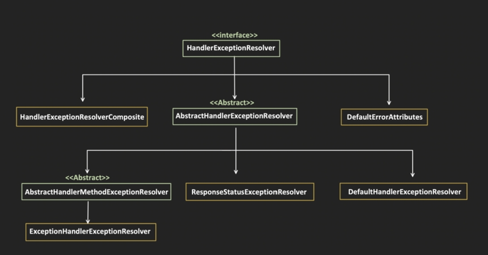
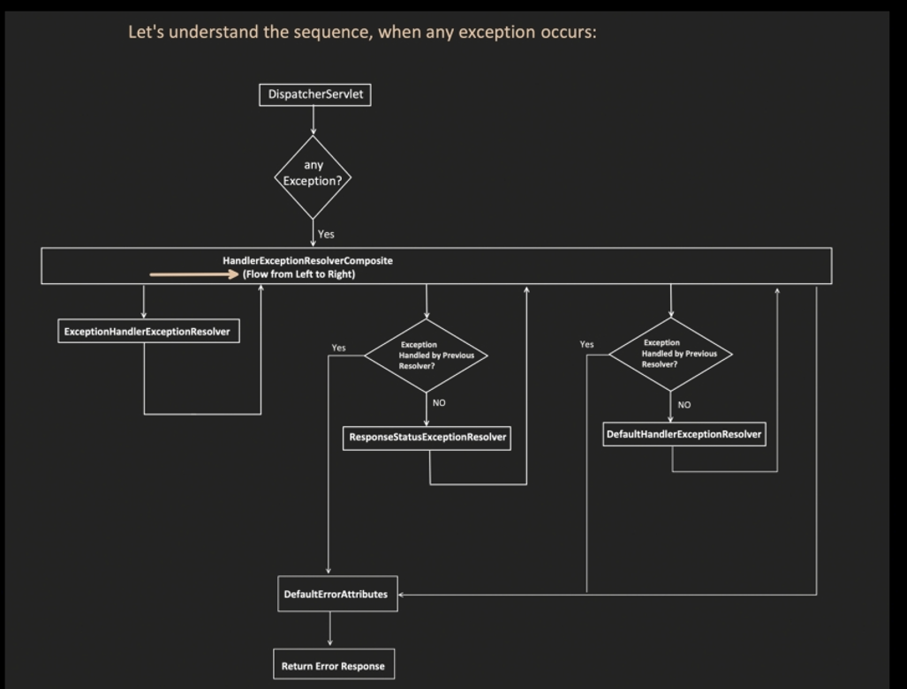
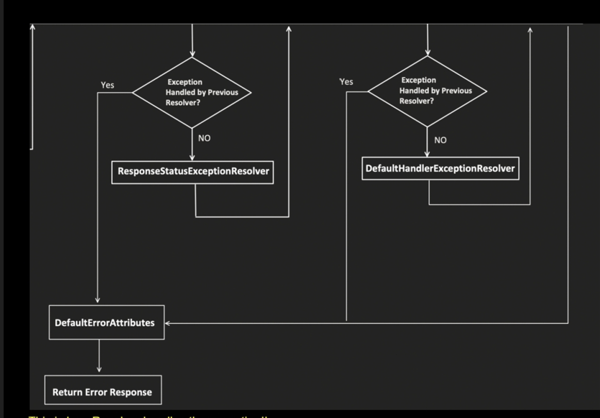

---

## Exception Handling

Exception Handling!! This is very frequently asked in interviews!!



In here ExceptionHandlerExceptionResolver, ResponseStatusExceptionResolver and DefaultHandlerExceptionResolver are very important resolvers!!

HandlerExceptionResolverComposite and DefaultErrorAttributes are helper classes! These are also very important!!

The top interface HandlerExceptionResolver is the one which has method called doResolveException()!!

We know 1st requests come to DispatcherServlet!! This invokes the controller!! In Controller there can be exception or DispatcherServlet not able to call controller throws exception!!


### Let's understand the sequence, when any exception occurs


Suppose in any case exception occurs!! Dispatcher servlet calls HandlerExceptionResolverComposite now that calls all 3 resolver in sequence given above left to right can see in above diagram!!

Flow:
1. `DispatcherServlet` → any Exception? → Yes → `HandlerExceptionResolverComposite` (Flow from Left to Right)
2. First → `ExceptionHandlerExceptionResolver`

After this resolver control goes back to HandlerExceptionResolverComposite and there it checks if exception is handled if yes then not go further and goes to DefaultErrorAttribute class!! And this continues can see in below diagram!!



3. → Exception Handled by Previous Resolver? → NO → `ResponseStatusExceptionResolver` → Exception Handled by Previous Resolver? → NO → `DefaultHandlerExceptionResolver`
4. → `DefaultErrorAttributes` → Return Error Response

This is how Resolver handles the exception!!

HandlerExceptionResolverComposite orchestrates or manages All resolvers!! DefaultErrorAttributes is class which create the response what need to be send to the client!!

### Let's see the flow with an example

```java
@RestController
@RequestMapping(value = "/api/")
public class UserController {

    @GetMapping(path = "/get-user")
    public String getUser() {
        throw new NullPointerException("throwing null pointer exception for testing");
    }
}
```

Output:
```
GET localhost:8080/api/get-user
500 Internal Server Error
{
  "timestamp": "2024-10-22T16:36:34.796+00:00",
  "status": 500,
  "error": "Internal Server Error",
  "path": "/api/get-user"
}
```

See this is output we are getting!!

```java
public class CustomException extends RuntimeException{
    HttpStatus status;
    String message;

    CustomException(HttpStatus status, String message) {
        this.status = status;
        this.message = message;
    }

    public HttpStatus getStatus() {
        return status;
    }

    @Override
    public String getMessage() {
        return message;
    }
}
```

```java
@RestController
@RequestMapping(value = "/api/")
public class UserController {

    @GetMapping(path = "/get-user")
    public String getUser() {
        throw new CustomException(HttpStatus.BAD_REQUEST,
                "request is not correct, UserID is missing");
    }
}
```

again output is same:
```
500 Internal Server Error
{
  "timestamp": "2024-10-22T16:41:41.887+00:00",
  "status": 500,
  "error": "Internal Server Error",
  "path": "/api/get-user"
}
```

Here we are throwing bad request but out you see below clearly!! Again same output!!

Why for both output is same?
Why when  my Return Code "BAD_REQUEST" i.e. 400 then also output is 500  and my error message is not shown in output?

In both the example, we are not creating the **ResponseEntity** object, we are just returning the exception, some other class is creating the ResponseEntity Object.

If we need full control and don't want to rely on Exception Resolvers, then we have to create the ResponseEntity Object.

This is the reason!! ResponseEntity is created by DefaultErrorAttribute!! and by default it put status code 500!!

### Example

```java
public class ErrorResponse {
    private Date timestamp;
    private String msg;
    private int status;

    public ErrorResponse(Date timestamp, String msg, int status) {
        this.msg = msg;
        this.status = status;
        this.timestamp = timestamp;
    }

    public Date getTimestamp() {
        return timestamp;
    }

    public String getMessage() {
        return msg;
    }

    public int getStatus() {
        return status;
    }
}
```
This is one other way to call super(message) in constructor!!

```java
public class CustomException extends RuntimeException{
    HttpStatus status;
    String message;

    CustomException(HttpStatus status, String message) {
        this.status = status;
        this.message = message;
    }

    public HttpStatus getStatus() {
        return status;
    }

    @Override
    public String getMessage() {
        return message;
    }
}
```

```java
@RestController
@RequestMapping(value = "/api/")
public class UserController {

    @GetMapping(path = "/get-user")
    public ResponseEntity<?> getUser() {
        try {
            //your business logic and validations...
            throw new CustomException(HttpStatus.BAD_REQUEST, "UserID is missing");
        }
        catch (CustomException e) {
            ErrorResponse errorResponse = new ErrorResponse(new Date(), e.getMessage(), e.getStatus().value());
            return new ResponseEntity<>(errorResponse, e.getStatus());
        }
        catch (Exception e) {
            ErrorResponse errorResponse = new ErrorResponse(new Date(), e.getMessage(), HttpStatus.INTERNAL_SERVER_ERROR.value());
            return new ResponseEntity<>(errorResponse, HttpStatus.INTERNAL_SERVER_ERROR);
        }
    }
}
```

You need to create response Entity


Now see the output:
```
400 Bad Request
{
  "timestamp": "2024-10-25T12:13:02.318+00:00",
  "status": 400,
  "message": "UserID is missing"
}
```

We need to put code in response entity!!

It passes to all 3 Resolver!!

ExceptionHandlerExceptionResolver resolves only ControllerAdvice and ExceptionHandler annotation so it will not handle and then it goes to ResponseStatusExceptionResolver it only handles ResponseStatus Annotation!! Then it goes to Default one!!

Default one handles pre defined exception and all 3 resolver passed so it goes to defaultErrorAttribute!! Default error attribute!! See default error attribute class

### DefaultErrorAttributes class (Spring source, by Yanming Zhou)

```java
public class DefaultErrorAttributes implements ErrorAttributes {

    private static final String ERROR_INTERNAL_ATTRIBUTE = DefaultErrorAttributes.class.getName() + ".ERROR";

    @Override
    public Map<String, Object> getErrorAttributes(ServerRequest request, ErrorAttributeOptions options) {
        Map<String, Object> errorAttributes = getErrorAttributes(request, options.isIncluded(Include.STACK_TRACE));
        options.retainIncluded(errorAttributes);
        return errorAttributes;
    }

    private Map<String, Object> getErrorAttributes(ServerRequest request, boolean includeStackTrace) {
        Map<String, Object> errorAttributes = new LinkedHashMap<>();
        errorAttributes.put("timestamp", new Date());
        errorAttributes.put("path", request.requestPath().value());
        Throwable error = getError(request);
        MergedAnnotation<ResponseStatus> responseStatusAnnotation = MergedAnnotations
                .from(error.getClass(), SearchStrategy.TYPE_HIERARCHY)
                .get(ResponseStatus.class);
        //HttpStatus errorStatus = determineHttpStatus(error, responseStatusAnnotation);
        errorAttributes.put("status", errorStatus.value());
        errorAttributes.put("error", errorStatus.getReasonPhrase());
        errorAttributes.put("requestId", request.exchange().getRequest().getId());
        handleException(errorAttributes, error, responseStatusAnnotation, includeStackTrace);
        return errorAttributes;
    }

    private HttpStatus determineHttpStatus(Throwable error, MergedAnnotation<ResponseStatus> responseStatusAnnotation)
    ...
```

See comented line  it calls determine status and that is below set 500 as default status and rest of things are set here only!!

```java
private HttpStatus determineHttpStatus(Throwable error, MergedAnnotation<ResponseStatus> responseStatusAnnotation) {
    if (error instanceof ResponseStatusException responseStatusException) {
        HttpStatus httpStatus =
            HttpStatus.resolve(responseStatusException.getStatusCode().value());
        if (httpStatus != null) {
            return httpStatus;
        }
    }

    return (HttpStatus)responseStatusAnnotation.getValue("code",
        HttpStatus.class).orElse(HttpStatus.INTERNAL_SERVER_ERROR);
}
```

So if no resolver handle error, then it put 500 as status and all other details is set!! If any resolver able to handle then it put just status and message!!

### So, When we don't return ResponseEntity like below

```java
@RestController
@RequestMapping(value = "/api/")
public class UserController {

    @GetMapping(path = "/get-user")
    public String getUser() {
        throw new CustomException(HttpStatus.BAD_REQUEST,
                "request is not correct, UserID is missing");
    }
}
```

then in Exception scenario, exception passes through each Resolver like "ExceptionHandlerExceptionResolver", "ResponseStatusExceptionResolver" and "DefaultHandlerExceptionResolver" in sequence.

Each Resolver set the proper **status** and **message** in HTTP response for exceptions which they are taking care of.
and
NullPointerException and CustomException all the 3 Resolvers, do not understand, so Status and Message is not set.

So, when control reaches to "DefaultErrorAttributes" class, it fills the values in HTTP Response with default values.

```java
// DefaultErrorAttributes
@Override
public Map<String, Object> getErrorAttributes(WebRequest webRequest, ErrorAttributeOptions options) {
    Map<String, Object> errorAttributes = getErrorAttributes(webRequest, options.isIncluded(Include.STACK_TRACE));
    options.retainIncluded(errorAttributes);
    return errorAttributes;
}

private Map<String, Object> getErrorAttributes(WebRequest webRequest, boolean includeStackTrace) {
    Map<String, Object> errorAttributes = new LinkedHashMap<>();
    errorAttributes.put("timestamp", new Date());
    addStatus(errorAttributes, webRequest);
    addErrorDetails(errorAttributes, webRequest, includeStackTrace);
    addPath(errorAttributes, webRequest);
    return errorAttributes;
}

@RequestMapping
public ResponseEntity<Map<String, Object>> error(HttpServletRequest request) {
    HttpStatus status = this.getStatus(request);
    if (status == HttpStatus.NO_CONTENT) {
        return new ResponseEntity(status);
    } else {
        Map<String, Object> body = this.getErrorAttributes(request, this.getErrorAttributeOptions(request, MediaType.ALL));
        return new ResponseEntity(body, status);
    }
}
```

Output:
```
500 Internal Server Error
{
  "timestamp": "2024-10-22T16:41:41.887+00:00",
  "status": 500,
  "error": "Internal Server Error",
  "path": "/api/get-user"
}
```

And that DefaultErrorAttribute put that in responseEntity!! For huge application we do not want to put every time try catch!!

### So, now question is: what exception does "ExceptionHandlerExceptionResolver", "ResponseStatusExceptionResolver" and "DefaultHandlerExceptionResolver" handles?

## 1. ExceptionHandlerExceptionResolver

Responsible for handling below annotations:
- @ExceptionHandler
- @ControllerAdvice

**Controller level Exception handling:**

```java
@RestController
@RequestMapping(value = "/api/")
public class UserController {

    @GetMapping(path = "/get-user")
    public ResponseEntity<?> getUser() {
        //your business logic and validations...
        throw new CustomException(HttpStatus.BAD_REQUEST, "UserID is missing");
    }

    @ExceptionHandler(CustomException.class)
    public ResponseEntity<String> handleCustomException(CustomException ex) {
        return new ResponseEntity<>(ex.getMessage(), ex.getStatus());
    }
}
```

Output:
```
400 Bad Request
UserID is missing
```

It do all exceptions thrown by Controller!! need not worry about try catch!! 

ExceptionHandler handles all exception in the controller if any one throws Custom Exception which ExceptionHandler handles!! We want our own body to be shown!!

**Use-case just to show returning Error Response object instead of just message:**

```java
public class ErrorResponse {
    private Date timestamp;
    private String msg;
    private int status;

    public ErrorResponse(Date timestamp, String msg, int status) {
        this.msg = msg;
        this.status = status;
        this.timestamp = timestamp;
    }

    public Date getTimestamp() {
        return timestamp;
    }

    public String getMessage() {
        return msg;
    }

    public int getStatus() {
        return status;
    }
}
```

```java
@RestController
@RequestMapping(value = "/api/")
public class UserController {

    @GetMapping(path = "/get-user")
    public ResponseEntity<?> getUser() {
        //your business logic and validations...
        throw new CustomException(HttpStatus.BAD_REQUEST, "UserID is missing");
    }

    @ExceptionHandler(CustomException.class)
    public ResponseEntity<Object> handleCustomException(CustomException ex) {
        ErrorResponse errorResponse = new ErrorResponse(new Date(), ex.getMessage(), ex.getStatus().value());
        return new ResponseEntity<>(errorResponse, ex.getStatus());
    }
}
```

Output:
```
400 Bad Request
{
  "timestamp": "2024-10-24T15:41:24.294+00:00",
  "status": 400,
  "message": "UserID is missing"
}
```


**Use-case just to show multiple @ExceptionHandler in single Controller class:**

```java
@RestController
@RequestMapping(value = "/api/")
public class UserController {

    @GetMapping(path = "/get-user")
    public ResponseEntity<?> getUser() {
        //your business logic and validations...
        throw new CustomException(HttpStatus.BAD_REQUEST, "UserID is missing");
    }

    @GetMapping(path = "/get-user-history")
    public ResponseEntity<?> getUserHistory() {
        //your business logic and validations...
        throw new IllegalArgumentException("inappropriate arguments passed");
    }

    @ExceptionHandler(CustomException.class)
    public ResponseEntity<String> handleCustomException(CustomException ex) {
        return new ResponseEntity<>(ex.getMessage(), ex.getStatus());
    }

    @ExceptionHandler(IllegalArgumentException.class)
    public ResponseEntity<String> handleCustomException(IllegalArgumentException ex) {
        return new ResponseEntity<>(ex.getMessage(), HttpStatus.BAD_REQUEST);
    }
}
```

Same controller two exception handler!!

Output for `/api/get-user`:
```
400 Bad Request
UserID is missing
```

Output for `/api/get-user-history`:
```
400 Bad Request
inappropriate arguments passed
```

This is also easy i guess!!

**Use-case just to show 1 @ExceptionHandler handling multiple exceptions:**

```java
@RestController
@RequestMapping(value = "/api/")
public class UserController {

    @GetMapping(path = "/get-user")
    public ResponseEntity<?> getUser() {
        //your business logic and validations...
        throw new CustomException(HttpStatus.BAD_REQUEST, "UserID is missing");
    }

    @GetMapping(path = "/get-user-history")
    public ResponseEntity<?> getUserHistory() {
        //your business logic and validations...
        throw new IllegalArgumentException("inappropriate arguments passed");
    }

    @ExceptionHandler({CustomException.class, IllegalArgumentException.class})
    public ResponseEntity<String> handleCustomException(Exception ex) {
        return new ResponseEntity<>(ex.getMessage(), HttpStatus.BAD_REQUEST);
    }
}
```

In both customException and IllegalArgument both will give bad-request, also see as it handles two exceptions we put parameter as Exception the parent class of both the exceptions!!

Also it can take HttpServletRequest and HttpServletResponse as parameters too!! In any order we can pass the parameters!!

**Use-case just to show @ExceptionHandler not returning ResponseEntity and let "DefaultErrorAttributes" to create the ResponseEntity.**

```java
@RestController
@RequestMapping(value = "/api/")
public class UserController {

    @GetMapping(path = "/get-user")
    public ResponseEntity<?> getUser() {
        //your business logic and validations...
        throw new CustomException(HttpStatus.BAD_REQUEST, "UserID is missing");
    }

    @GetMapping(path = "/get-user-history")
    public ResponseEntity<?> getUserHistory() {
        //your business logic and validations...
        throw new IllegalArgumentException("inappropriate arguments passed");
    }

    @ExceptionHandler(CustomException.class)
    public void handleCustomException(HttpServletResponse response, CustomException ex) throws IOException {
        response.sendError(HttpStatus.BAD_REQUEST.value(), ex.message);
    }
}
```

Without this DefaultErrorAttributes, filter out the message field in response.

application.properties:
```
server.error.include-message=always
```

Output:
```
400 Bad Request
{
  "timestamp": "2024-10-24T15:55:07.807+00:00",
  "status": 400,
  "error": "Bad Request",
  "message": "UserID is missing",
  "path": "/api/get-user"
}
```

In above ExceptionHandler we are not creating ResponseEntity we just send Exceptions!! Now first control goes to 1st resolver that will be able to handle it, when we goes to DefaultErrorAttribute, that will set everything in ResponseEntity!!


DefaultErrorAttribute helps to add ResponseEntity!!

### Global Exception handling

Problem with Controller level @ExceptionHandler is:
- if multiple controller has the same type of Exceptions then same handling we might to do in multiple controller
- which is nothing but a code duplication.

```java
@ControllerAdvice
public class GlobalExceptionHandling {

    @ExceptionHandler(CustomException.class)
    public ResponseEntity<String> handleCustomException(CustomException ex) {
        return new ResponseEntity<>(ex.message, ex.getStatus());
    }
}
```

Output:
```
400 Bad Request
UserID is missing
```

**What if, I provide both Controller level and Global level @ExceptionHandler, which one has more priority?**

```java
// Controller level
@RestController
@RequestMapping(value = "/api/")
public class UserController {

    @GetMapping(path = "/get-user")
    public ResponseEntity<?> getUser() {
        //your business logic and validations...
        throw new CustomException(HttpStatus.BAD_REQUEST, "UserID is missing");
    }

    @ExceptionHandler(CustomException.class)
    public ResponseEntity<String> handleCustomException(CustomException ex) {
        return new ResponseEntity<>(ex.message + ": from Controller ExceptionHandler", ex.getStatus());
    }
}

// Global level
@ControllerAdvice
public class GlobalExceptionHandling {

    @ExceptionHandler(CustomException.class)
    public ResponseEntity<String> handleCustomException(CustomException ex) {
        return new ResponseEntity<>(ex.message + ": from Global ExceptionHandler", ex.getStatus());
    }
}
```

Output:
```
400 Bad Request
UserID is missing: from Controller ExceptionHandler
```

Controller one will be given more priority!!

**What if there are 2 handlers which can handle an exception, which one will be given priority:**

It always follow a hierarchy, from bottom to up (first look for exact match if not, check for its parent and so on...)

```java
// Global level with 2 handlers
@ControllerAdvice
public class GlobalExceptionHandling {

    @ExceptionHandler(CustomException.class)
    public ResponseEntity<String> handleCustomException(CustomException ex) {
        return new ResponseEntity<>(ex.message, ex.getStatus());
    }

    @ExceptionHandler(RuntimeException.class)
    public ResponseEntity<String> handleRuntimeException(RuntimeException ex) {
        return new ResponseEntity<>(ex.getMessage(), HttpStatus.INTERNAL_SERVER_ERROR);
    }
}
```

This we already know about global exception handler let see now!!

Now let us see 2nd resolver!! it handles uncaught Exception annotated with ResponseStatus

## 2. ResponseStatusExceptionResolver

Handles Uncaught exception annotated with **@ResponseStatus** annotation.

**Use-case1: Used on an Exception class**

```java
@RestController
@RequestMapping(value = "/api/")
public class UserController {

    @GetMapping(path = "/get-user")
    public ResponseEntity<?> getUser() {
        //your business logic and validations...
        throw new CustomException("UserID is missing");
    }
}
```

```java
@ResponseStatus(HttpStatus.BAD_REQUEST)
public class CustomException extends RuntimeException {

    CustomException(String message) {
        super(message);
    }
}
```

Output:
```
400 Bad Request
{
  "timestamp": "2024-10-25T12:50:42.453+00:00",
  "status": 400,
  "error": "Bad Request",
  "message": "UserID in missing",
  "path": "/api/get-user"
}
```

Response status will be put as BAD_REQUEST!! Uncaught Exception as no ExceptionHandler for this!! As no ExceptionHandler so uncaught Exception is handled by 2nd resolver!!

**Custom Uncaught Exception with message as reason!!**

```java
@RestController
@RequestMapping(value = "/api/")
public class UserController {

    @GetMapping(path = "/get-user")
    public ResponseEntity<?> getUser() {
        //your business logic and validations...
        throw new CustomException("UserID is missing");
    }
}
```

```java
@ResponseStatus(value = HttpStatus.BAD_REQUEST, reason = "Invalid Request Passed")
public class CustomException extends RuntimeException {

    HttpStatus status;

    CustomException(HttpStatus status, String message) {
        super(message);
        this.status = status;
    }
}
```

Output:
```
400 Bad Request
{
  "timestamp": "2024-10-25T13:03:50.574+00:00",
  "status": 400,
  "error": "Bad Request",
  "message": "Invalid Request Passed",
  "path": "/api/get-user"
}
```

**Use-case2: Used above on an @ExceptionHandler method**

Again *ResponseStatusExceptionResolver* handles Uncaught exception annotated with **@ResponseStatus** annotation but if used with **@ExceptionHandler** then it will not be handled by "*ResponseStatusExceptionResolver*", it will be handled by Spring request handling mechanism itself.

```java
@RestController
@RequestMapping(value = "/api/")
public class UserController {

    @GetMapping(path = "/get-user")
    public ResponseEntity<?> getUser() {
        //your business logic and validations...
        throw new CustomException(HttpStatus.INTERNAL_SERVER_ERROR, "UserID is missing");
    }

    @ExceptionHandler(CustomException.class)
    @ResponseStatus(value = HttpStatus.BAD_REQUEST, reason = "Invalid Request Sent")
    public ResponseEntity<Object> handleCustomException(CustomException e) {
        return new ResponseEntity<>("you are not authorized", HttpStatus.FORBIDDEN);
    }
}
```

```java
public class CustomException extends RuntimeException {
    HttpStatus status;

    CustomException(HttpStatus status, String message) {
        super(message);
        this.status = status;
    }
}
```

Output:
```
400 Bad Request
{
  "timestamp": "2024-10-25T14:05:53.089+00:00",
  "status": 400,
  "error": "Bad Request",
  "message": "Invalid Request Sent",
  "path": "/api/get-user"
}
```

Using both in handler!! see we are setting 3 different status!! But it will be resolved by resolver we think so at last resolver will handle ResponseStatus!! So bad_request and Invalid Request sent will be sent!!

But see if it goes to 1st handler it creates ResponseEntity and send that back, it will not go to the 2nd handler!! But then how the output is coming as 400 why??

This is handled by spring flow!! see how!!

```java
protected ModelAndView doResolveHandlerMethodException(HttpServletRequest request,
        HttpServletResponse response, @Nullable HandlerMethod handlerMethod, Exception exception) {

    ServletInvocableHandlerMethod exceptionHandlerMethod = getExceptionHandlerMethod(handlerMethod, exception);
    if (exceptionHandlerMethod == null) {
        return null;
    }

    if (this.argumentResolvers != null) {
        exceptionHandlerMethod.setHandlerMethodArgumentResolvers(this.argumentResolvers);
    }
    if (this.returnValueHandlers != null) {
        exceptionHandlerMethod.setHandlerMethodReturnValueHandlers(this.returnValueHandlers);
    }

    ServletWebRequest webRequest = new ServletWebRequest(request, response);
    ModelAndViewContainer mavContainer = new ModelAndViewContainer();

    ArrayList<Throwable> exceptions = new ArrayList<>();
    try {
        if (logger.isDebugEnabled()) {
            logger.debug("Using @ExceptionHandler " + exceptionHandlerMethod);
        }
        // Expose causes as provided arguments as well
        Throwable exToExpose = exception;
        while (exToExpose != null) {
            exceptions.add(exToExpose);
            Throwable cause = exToExpose.getCause();
            exToExpose = (cause != exToExpose ? cause : null);
        }
        Object[] arguments = new Object[exceptions.size() + 1];
        exceptions.toArray(arguments);  // efficient arraycopy call in ArrayList
        arguments[arguments.length - 1] = handlerMethod;
        exceptionHandlerMethod.invokeAndHandle(webRequest, mavContainer, arguments);//see here it is called
    }
    ...
}
```

**ExceptionHandlerExceptionResolver.java** calls **ServletInvocableHandlerMethod.java**'s `invokeAndHandle` method, via `exceptionHandlerMethod.invokeAndHandle(webRequest, mavContainer, arguments);`

```java
// ServletInvocableHandlerMethod.java
public void invokeAndHandle(ServletWebRequest webRequest, ModelAndViewContainer mavContainer,
        Object... providedArgs) throws Exception {

    Object returnValue = invokeForRequest(webRequest, mavContainer, providedArgs);
    setResponseStatus(webRequest);

    if (returnValue == null) {
        if (isRequestNotModified(webRequest) || getResponseStatus() != null || mavContainer.isRequestHandled()) {
            disableContentCachingIfNecessary(webRequest);
            mavContainer.setRequestHandled(true);
            return;
        }
    }
    else if (StringUtils.hasText(getResponseStatusReason())) {
        mavContainer.setRequestHandled(true);
        return;
    }

    mavContainer.setRequestHandled(false);
    Assert.state(this.returnValueHandlers != null, "No return value handlers");
    try {
        this.returnValueHandlers.handleReturnValue(
                returnValue, getReturnValueType(returnValue), mavContainer, webRequest);
    }
    catch (Exception ex) {
        if (logger.isTraceEnabled()) {
            logger.trace(formatErrorForReturnValue(returnValue), ex);
        }
        throw ex;
    }
}
```

So whatever you have set (`@ResponseStatus` on the handler method) is handled by this (`setResponseStatus(webRequest)`)!! Not by resolver!! So response is handled by spring framework!!

One resolver is involved then other resolver will not be involved!!

**What if @ExceptionHandler method set Response status and message itself instead of returning the response entity:**

```java
@RestController
@RequestMapping(value = "/api/")
public class UserController {

    @GetMapping(path = "/get-user")
    public ResponseEntity<?> getUser() {
        //your business logic and validations...
        throw new CustomException(HttpStatus.INTERNAL_SERVER_ERROR, "UserID is missing");
    }

    @ExceptionHandler(CustomException.class)
    @ResponseStatus(value = HttpStatus.BAD_REQUEST, reason = "Invalid Request Sent")
    public void handleCustomException(CustomException e, HttpServletResponse response) throws IOException {
        response.sendError(HttpStatus.FORBIDDEN.value(), "you are not authorized");
    }
}
```

Output:
```
500 Internal Server Error
{
  "timestamp": "2024-10-25T14:08:14.390+00:00",
  "status": 500,
  "error": "Internal Server Error",
  "message": "YOUR ARE NOT AUTHORIZED",
  "path": "/api/get-user"
}
```

Its because, Response.sendError first set the status and message in response and do COMMIT.

2nd ResponseStatus method will try to do the same thing, and Exception will occur in ExceptionHandlerResolver class as we try to reset already committed status field.

Here we are sending response not responseEntity!! we sending status ad message in response!! CustomException caught by 1st resolver it set Forbidden and committed and then as per spring it will set bad_request and then again it commits that we have already set so thats why it will give Internal server error!!! You cannot commit again!!

So its advisable not to use together @ExceptionHandler and @ResponseStatus together to avoid confusion.

But if you have to, use like below:

```java
@RestController
@RequestMapping(value = "/api/")
public class UserController {

    @GetMapping(path = "/get-user")
    public ResponseEntity<?> getUser() {
        //your business logic and validations...
        throw new CustomException(HttpStatus.INTERNAL_SERVER_ERROR, "UserID is missing");
    }

    @ExceptionHandler(CustomException.class)
    @ResponseStatus(value = HttpStatus.BAD_REQUEST, reason = "Invalid Request Sent")
    public void handleCustomException(CustomException e) {
        //do nothing here
    }
}
```

Output:
```
400 Bad Request
{
  "timestamp": "2024-10-25T14:14:52.389+00:00",
  "status": 400,
  "error": "Bad Request",
  "message": "Invalid Request Sent",
  "path": "/api/get-user"
}
```

Either handler set responseStatus or the Annotation, not both!! 3rd is default one

## 3. DefaultHandlerExceptionResolver

Handles Spring framework related exceptions only like MethodNotFound, NoResourceFound etc..