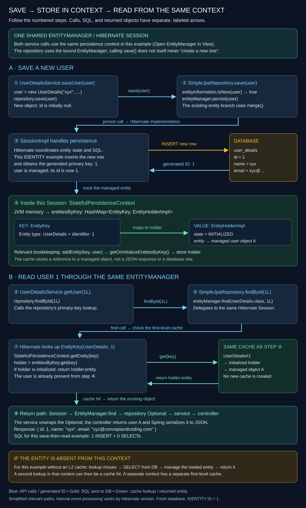
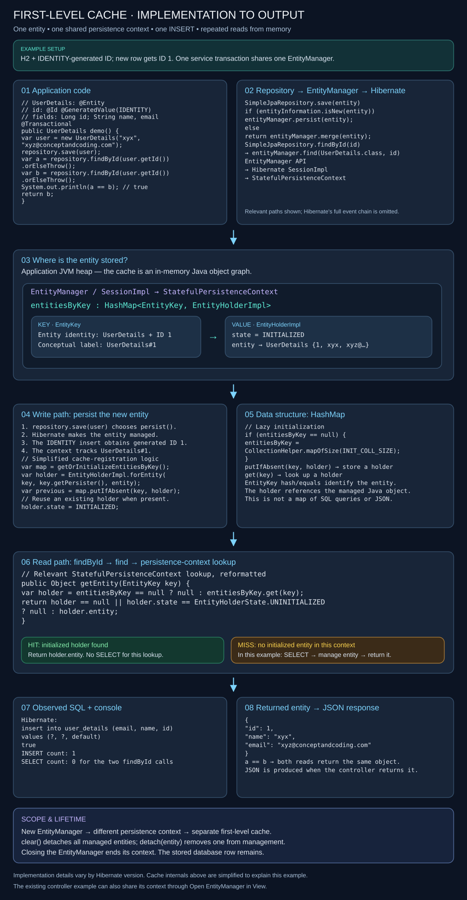
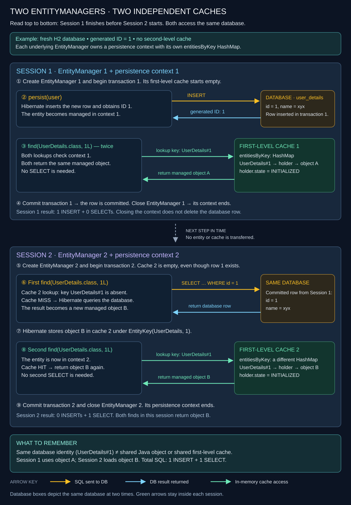
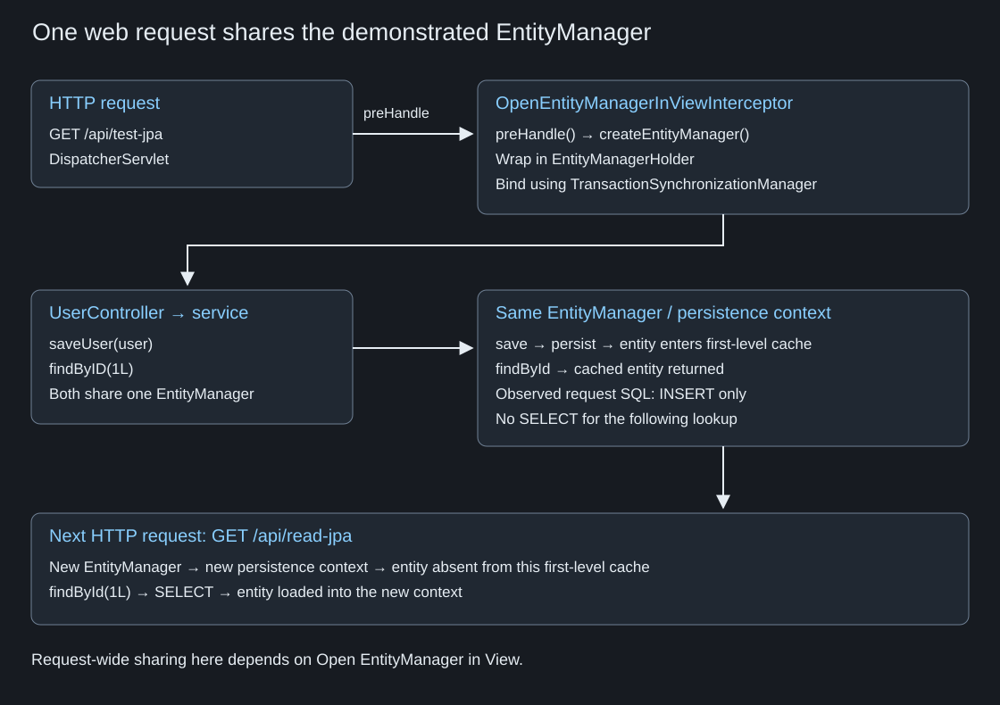

# 🧠 JPA — First-Level Cache

> 💡 **Core idea:** A persistence context keeps managed entities in memory. Looking up the same entity by its primary key can reuse that object without another database query.

**EntityManager / Session → Persistence context → First-level cache**

| ✅ Cache hit | 🔎 Cache miss |
| --- | --- |
| Entity is already managed in the current context. | Entity is absent from the current context. |
| The lookup reuses the managed object. | The lookup loads the entity from the database in this example. |

---

## 1. ⚙️ Application configuration

`application.properties`:

```properties
# Database connection
spring.datasource.url=jdbc:h2:mem:userDB
spring.datasource.driver-class-name=org.h2.Driver
spring.datasource.username=sa
spring.datasource.password=

# Enable the H2 console and set the path
spring.h2.console.enabled=true
spring.h2.console.path=/h2-console

spring.jpa.show-sql=true
spring.jpa.properties.hibernate.format_sql=true
```

The example uses an in-memory H2 database. SQL logging lets us observe whether reading an entity executes a SELECT.

---

## 2. 🧩 Entity and repository

### UserDetails

```java
@Entity
public class UserDetails {

    @Id
    @GeneratedValue(strategy = GenerationType.IDENTITY)
    private Long id;

    private String name;
    private String email;

    // Constructors
    public UserDetails() {
    }

    public UserDetails(String name, String email) {
        this.name = name;
        this.email = email;
    }

    // Getters and setters
}
```

Imports and getter/setter bodies are omitted for brevity.

### UserDetailsRepository

```java
@Repository
public interface UserDetailsRepository
        extends JpaRepository<UserDetails, Long> {
}
```

The repository:

- Uses the EntityManager API internally and provides predefined methods such as `findAll` and `deleteAll`.
- Provides pagination and sorting.
- Provides transaction support for operations such as insert, modify, and delete.
- Integrates with Spring's EntityManager lifecycle management, so repository callers do not manually open and close EntityManagers.

---

## 3. 🔄 Save, then read: controller and service

```java
@RestController
@RequestMapping(value = "/api/")
public class UserController {

    @Autowired
    UserDetailsService userDetailsService;

    @GetMapping(path = "/test-jpa")
    public UserDetails getUser() {
        UserDetails userDetails = new UserDetails(
                "xyx", "xyz@conceptandcoding.com");
        userDetailsService.saveUser(userDetails);
        UserDetails output1 = userDetailsService.getUser(1L);
        return output1;
    }

    @GetMapping(path = "/read-jpa")
    public UserDetails getUser2() {
        UserDetails output1 = userDetailsService.getUser(1L);
        return output1;
    }
}
```

```java
@Service
public class UserDetailsService {

    @Autowired
    UserDetailsRepository userDetailsRepository;

    public void saveUser(UserDetails user) {
        userDetailsRepository.save(user);
    }

    public UserDetails getUser(Long primaryKey) {
        return userDetailsRepository.findById(primaryKey).get();
    }
}
```

In `/api/test-jpa`, we first insert a user and then fetch it. The demonstrated output contains **only an INSERT, with no SELECT**, yet returns the user. The read is served from the first-level cache.

**Example assumptions:** the database is fresh, so the new user's ID is `1`; both operations use the same persistence context with Open EntityManager in View enabled. On subsequent calls, the controller still fetches ID `1`, even when the newly inserted user receives another ID. The `.get()` call assumes that the entity exists.

---

## 4. 🔧 JpaRepository and SimpleJpaRepository

`JpaRepository` is an interface. `SimpleJpaRepository` is its implementation. Key interface methods include:

```java
@NoRepositoryBean
public interface JpaRepository<T, ID>
        extends ListCrudRepository<T, ID>,
                ListPagingAndSortingRepository<T, ID>,
                QueryByExampleExecutor<T> {

    void flush();

    <S extends T> S saveAndFlush(S entity);

    <S extends T> List<S> saveAllAndFlush(Iterable<S> entities);

    /** @deprecated */
    @Deprecated
    default void deleteInBatch(Iterable<T> entities) {
        this.deleteAllInBatch(entities);
    }

    void deleteAllInBatch(Iterable<T> entities);

    void deleteAllByIdInBatch(Iterable<ID> ids);

    void deleteAllInBatch();

    /** @deprecated */
    @Deprecated
    T getOne(ID id);

    /** @deprecated */
    @Deprecated
    T getById(ID id);

    T getReferenceById(ID id);

    <S extends T> List<S> findAll(Example<S> example);

    <S extends T> List<S> findAll(Example<S> example, Sort sort);
}
```

The deprecated methods are included for reference; declarations can differ between Spring Data JPA versions.

### How save delegates to EntityManager

```java
// SimpleJpaRepository.java
@Transactional
public <S extends T> S save(S entity) {
    Assert.notNull(entity, "Entity must not be null");

    if (this.entityInformation.isNew(entity)) {
        this.entityManager.persist(entity);
        return entity;
    } else {
        return this.entityManager.merge(entity);
    }
}
```

For the new user, `save()` calls `persist()`. For an entity classified as existing, it calls `merge()`.

---

## 5. 🗂️ Where the first-level cache lives





`EntityManager` is the JPA API. Hibernate's `SessionImpl` implements the API, while `StatefulPersistenceContext` holds managed entities.

```text
One underlying EntityManager / Hibernate Session
    → its persistence context
    → first-level cache of managed entities
```

Application code works through the repository or EntityManager. Hibernate handles SQL and persistence-context bookkeeping. The map key is an `EntityKey` identifying the entity type and identifier, rather than the UserDetails object itself.

An example cache entry:

```text
key: EntityKey[com.conceptandcoding.learningspringboot.jpa.entity.UserDetails#1]
entity: UserDetails
    id = 1
    name = "xyx"
    email = "xyz@conceptandcoding.com"
```

### Adding an entity with putIfAbsent

`StatefulPersistenceContext.addEntity()` can store the entity holder using `putIfAbsent()`:

```java
@Override
public void addEntity(EntityKey key, Object entity) {
    EntityHolderImpl holder = EntityHolderImpl.forEntity(
            key, key.getPersister(), entity);
    final EntityHolderImpl oldHolder =
            getOrInitializeEntitiesByKey().putIfAbsent(key, holder);

    if (oldHolder != null) {
        assert oldHolder.entity == null || oldHolder.entity == entity;
        oldHolder.entity = entity;
        holder = oldHolder;
    }

    holder.state = EntityHolderState.INITIALIZED;
    final BatchFetchQueue fetchQueue = this.batchFetchQueue;
    if (fetchQueue != null) {
        fetchQueue.removeBatchLoadableEntityKey(key);
    }
}
```

### Map initialization and alternative implementation

Another implementation delegates to `addEntityHolder()` and initializes the map when needed:

```java
private Map<EntityKey, EntityHolderImpl> getOrInitializeEntitiesByKey() {
    if (entitiesByKey == null) {
        entitiesByKey = CollectionHelper.mapOfSize(INIT_COLL_SIZE);
    }
    return entitiesByKey;
}

@Override
public void addEntity(EntityKey key, Object entity) {
    addEntityHolder(key, entity);
}

@Override
public EntityHolder addEntityHolder(EntityKey key, Object entity) {
    final Map<EntityKey, EntityHolderImpl> entityHolderMap =
            getOrInitializeEntitiesByKey();
    EntityHolderImpl oldHolder = entityHolderMap.get(key);
    EntityHolderImpl holder;

    if (oldHolder != null) {
        // assert oldHolder.entity == null || oldHolder.entity == entity;
        oldHolder.entity = entity;
        holder = oldHolder;
    } else {
        entityHolderMap.put(key, holder = EntityHolderImpl.forEntity(
                key, key.getPersister(), entity));
    }

    holder.state = EntityHolderState.INITIALIZED;
    final BatchFetchQueue fetchQueue = this.batchFetchQueue;
    if (fetchQueue != null) {
        fetchQueue.removeBatchLoadableEntityKey(key);
    }
    return holder;
}
```

These alternative implementations both store the entity in the persistence-context map. Use them to understand the flow; internal details vary by Hibernate version.

> 💡 **Remember:** `persist()` is a method on the EntityManager interface, not an interface itself. The `@Transactional` annotation belongs to the repository's `save()` method. The identity-generated ID example shows an INSERT accompanying persistence; this should not be generalized to mean that every `persist()` call immediately executes SQL.

### Reading from the same map

`getEntity()` looks up the holder and returns its initialized entity:

```java
// Loaded entity instances, by EntityKey
private HashMap<EntityKey, EntityHolderImpl> entitiesByKey;

@Override
public Object getEntity(EntityKey key) {
    final EntityHolderImpl holder = entitiesByKey == null
            ? null : entitiesByKey.get(key);
    return holder == null || holder.state == EntityHolderState.UNINITIALIZED
            ? null : holder.entity;
}
```

A subsequent primary-key lookup through the same persistence context finds the initialized entity in the map and needs no SELECT. Similarly, reading the same previously uncached ID twice in one context needs a SELECT for the first lookup; the second lookup can use the cached entity.

---

## 6. 🔎 API responses and SQL

### Application startup

With schema recreation enabled for this example, Hibernate drops and creates the table:

```sql
drop table if exists user_details cascade;

create table user_details (
    id bigint generated by default as identity,
    email varchar(255),
    name varchar(255),
    primary key (id)
);
```

The application initializes its EntityManagerFactory and runs Tomcat on port `8080`. Open EntityManager in View is enabled in this example.

### First request: insert, then read

```http
GET http://localhost:8080/api/test-jpa
```

**Response:**

```json
{
  "id": 1,
  "name": "xyx",
  "email": "xyz@conceptandcoding.com"
}
```

**Executed SQL:**

```sql
insert into user_details (email, name, id)
values (?, ?, default);
```

Only the INSERT appears. The following lookup returns the entity already held in the persistence context.

### Second request: read again

```http
GET http://localhost:8080/api/read-jpa
```

The response contains the same user, but this request executes:

```sql
select
    ud1_0.id,
    ud1_0.email,
    ud1_0.name
from user_details ud1_0
where ud1_0.id = ?;
```

The SELECT belongs to `/read-jpa`. This new request has a different persistence context, so it cannot reuse the preceding request's first-level cache.

---

## 7. 🔀 Two manually created EntityManagers

**Persistence-context scope is associated with the underlying EntityManager.** The service example creates two EntityManagers:

```java
@Service
public class UserDetailsService {

    @Autowired
    EntityManagerFactory entityManagerFactory;

    public UserDetails saveUser(UserDetails user) {
        EntityManager entityManager =
                entityManagerFactory.createEntityManager(); // Session 1
        entityManager.getTransaction().begin();
        entityManager.persist(user);
        entityManager.find(UserDetails.class, 1L);
        UserDetails output = entityManager.find(UserDetails.class, 1L);
        System.out.println("i am able to find the data, name is:"
                + output.getName());
        entityManager.getTransaction().commit();
        entityManager.close();

        EntityManager entityManager2 =
                entityManagerFactory.createEntityManager(); // Session 2
        entityManager2.getTransaction().begin();
        entityManager2.find(UserDetails.class, 1L);
        UserDetails output2 = entityManager2.find(UserDetails.class, 1L);
        System.out.println("Session2: i am able to find the data, name is:"
                + output2.getName());
        entityManager2.getTransaction().commit();
        entityManager2.close();

        return output2;
    }
}
```

Session 2 prints `output2`, the entity loaded by its own EntityManager. Transaction failure handling and guaranteed resource cleanup are omitted here to keep the cache behavior easy to follow.



| Operation | Cache behavior | Executed SQL |
| --- | --- | --- |
| Session 1: persist | Adds the entity to context 1 | INSERT |
| Session 1: first find | Uses context 1's managed entity | None |
| Session 1: second find | Uses the same managed entity | None |
| Close Session 1; create Session 2 | Context 2 starts without that entity | None |
| Session 2: first find | Loads the entity into context 2 | SELECT |
| Session 2: second find | Uses context 2's managed entity | None |

**Output:**

```text
Hibernate:
    insert into user_details (email, name, id) values (?, ?, default)
i am able to find the data, name is:xyx
Hibernate:
    select ud1_0.id, ud1_0.email, ud1_0.name
    from user_details ud1_0 where ud1_0.id=?
Session2: i am able to find the data, name is:xyx
```

---

## 8. 🌐 Why the web example shares an EntityManager

A request passes through DispatcherServlet and an interceptor's `preHandle()`. With **Open EntityManager in View** enabled, an EntityManager is bound for the request and reused by repository calls within it.



**DispatcherServlet request flow:**

```java
if (!mappedHandler.applyPreHandle(processedRequest, response)) {
    return;
}

// Actually invoke the handler.
mv = ha.handle(processedRequest, response, mappedHandler.getHandler());

if (asyncManager.isConcurrentHandlingStarted()) {
    return;
}
```

`OpenEntityManagerInViewInterceptor.preHandle()` creates an EntityManager when needed, wraps it in a holder, and binds it:

```java
EntityManagerFactory emf = obtainEntityManagerFactory();

// In the branch that opens an EntityManager for this request:
EntityManager em = createEntityManager();
EntityManagerHolder emHolder = new EntityManagerHolder(em);
TransactionSynchronizationManager.bindResource(emf, emHolder);
```

The surrounding code checks for an already bound resource, records participation if one exists, registers asynchronous request interceptors, and wraps a PersistenceException in a DataAccessResourceFailureException. This is an excerpt, not the entire interceptor implementation.

> 📌 **Scope matters:** “one EntityManager per HTTP request” describes the demonstrated Open EntityManager in View flow. The first-level cache belongs to the persistence context, not to HTTP itself. The manual example above creates two contexts within one method. Separate repository calls should not be assumed to share a context in every configuration.

### Compact service/controller example

The service exposes a `findByID` method:

```java
@Service
public class UserDetailsService {

    @Autowired
    UserDetailsRepository userDetailsRepository;

    public void saveUser(UserDetails user) {
        userDetailsRepository.save(user);
    }

    public UserDetails findByID(Long primaryKey) {
        return userDetailsRepository.findById(primaryKey).get();
    }
}
```

```java
@RestController
@RequestMapping(value = "/api/")
public class UserController {

    @Autowired
    UserDetailsService userDetailsService;

    @GetMapping(path = "/test-jpa")
    public UserDetails getUser() {
        UserDetails userDetails1 = new UserDetails(
                "xyx", "xyz@conceptandcoding.com");
        userDetailsService.saveUser(userDetails1);
        return userDetailsService.findByID(1L);
    }
}
```

Both calls use the same underlying EntityManager in this request, so the lookup is a cache hit. The request executes only this SQL:

```sql
insert into user_details (email, name, id)
values (?, ?, default);
```

---

## 9. 📌 Quick revision

- The first-level cache contains managed entities within a persistence context.
- The illustrated Hibernate map uses EntityKey and EntityHolderImpl.
- A primary-key lookup can reuse an entity already managed in that context.
- Different contexts have separate first-level caches.
- The demonstrated save-then-read request logs an INSERT and no SELECT.
- A new read request logs a SELECT in this example.
- These examples demonstrate entity caching through primary-key lookups, not caching arbitrary query results.
