
## First Level Cache Recap

From previous video, First level caching, we already know that, for each **HTTP REQUEST**, different EntityManager Object (session) is created and it has its own Persistence context (1st level cache).

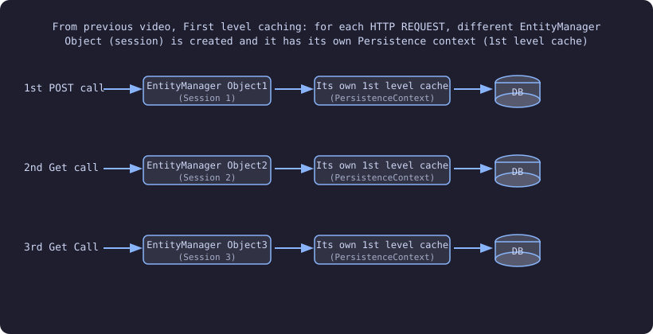

- We have already seen first level caching in a previous video!!
- For a new http request a new Entity manager is created; for each entity manager a new Persistence Context is created!!
- Persistence Context has its own hashmap!! Which is cache here!!

Now let us see **L2 cache** or **level 2 cache**!!

---

## Second Level Cache (L2 Cache)

Now, in **Second Level caching** or **L2 caching**, we will achieve something like this:

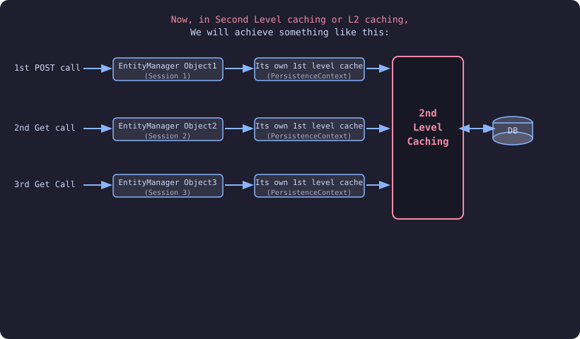

Now between PersistanceContext and DB we have **Another layer** called as **2nd level cache**!! Now every persistence Context shares L2 cache!!

---

## Setting Up L2 Cache — Happy Flow

Lets first see, one happy flow, and see what all it takes to enable the 2nd level caching.

### pom.xml — 3 Dependencies Required


```xml
<dependency>
    <groupId>org.ehcache</groupId>
    <artifactId>ehcache</artifactId>
    <version>3.10.8</version>
</dependency>
<dependency>
    <groupId>org.hibernate</groupId>
    <artifactId>hibernate-jcache</artifactId>
    <version>6.5.2.Final</version>
</dependency>
<dependency>
    <groupId>javax.cache</groupId>
    <artifactId>cache-api</artifactId>
    <version>1.1.1</version>
</dependency>
```

We need to add all 3 dependencies!! **Ehcache**, **hibernate-jcache**, **cache-api**!!

### application.properties


```properties
spring.jpa.properties.hibernate.cache.use_second_level_cache=true
spring.jpa.properties.hibernate.cache.region.factory_class=org.hibernate.cache.jcache.JCacheRegionFactory
spring.jpa.properties.javax.cache.provider=org.ehcache.jsr107.EhcacheCachingProvider
logging.level.org.hibernate.cache.spi=DEBUG
```

In application properties we need to enable 2nd level cache!!

### Code Overview — Controller, Entity, Service, Repository


## UserController


```java
@RestController
@RequestMapping(value = "/api/")
public class UserController {

    @Autowired
    UserDetailsService userDetailsService;

    @PostMapping(path = "/user")
    public UserDetails insertUser(@RequestBody UserDetails userDetails) {
        return userDetailsService.saveUser(userDetails);
    }

    @GetMapping("/user/{id}")
    public UserDetails getUser2() {
        return userDetailsService.findByID(primaryKey: 1L);
    }
}
```

In entity we need to make change. We need to put **cache annotation**!! See below!!

---

## UserDetails Entity with @Cache Annotation


```java
@Entity
@Cache(usage = CacheConcurrencyStrategy.READ_WRITE,
        region = "userDetailsCache")
public class UserDetails {

    @Id
    @GeneratedValue(strategy = GenerationType.IDENTITY)
    private Long id;

    private String name;
    private String email;

    // Constructors
    public UserDetails() {
    }

    public UserDetails(String name, String email) {
        this.name = name;
        this.email = email;
    }

    // Getters and setters
}
```

Below service layer and Repository we have no change in that!! Only this change needs to be change!!

---

## UserDetailsService and Repository


```java
@Service
public class UserDetailsService {

    @Autowired
    UserDetailsRepository userDetailsRepository;

    public UserDetails saveUser(UserDetails user) {
        return userDetailsRepository.save(user);
    }

    public UserDetails findByID(Long primaryKey) {
        return userDetailsRepository.findById(primaryKey).get();
    }
}

@Repository
public interface UserDetailsRepository extends
        JpaRepository<UserDetails, Long> {
}
```

---

## How Cache Works — Insert and Get Flow

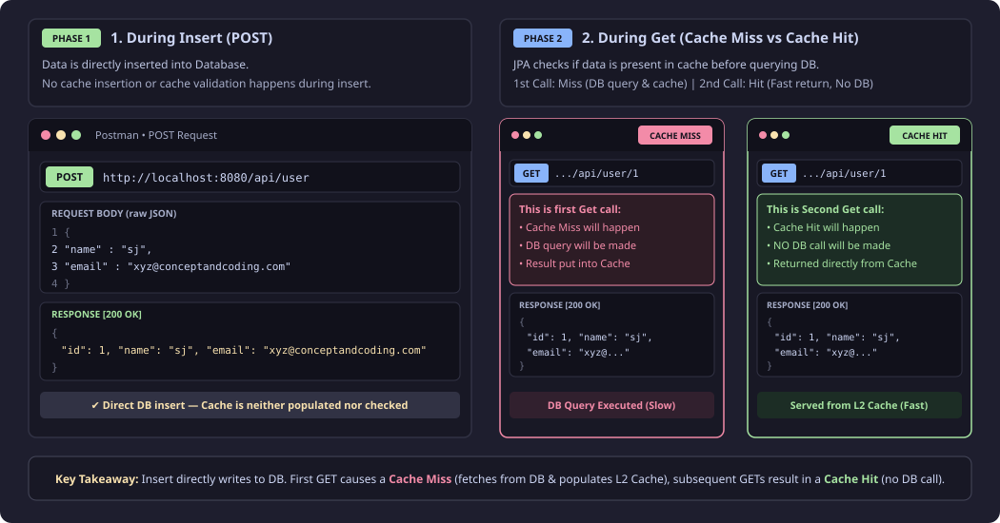

### 1. During Insert

Data is directly inserted into DB, no Cache insertion or validation happens.

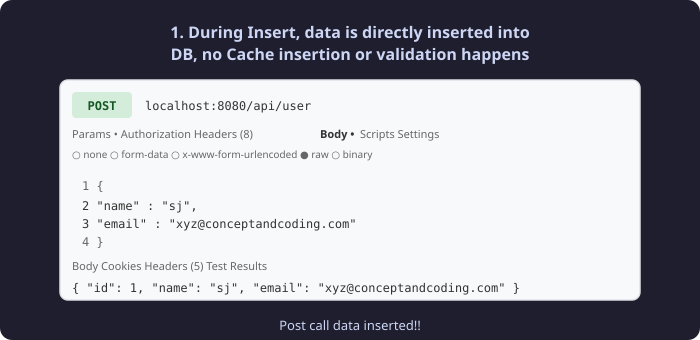

Post call data inserted!!

### 2. Get

During Get, JPA will check, if data is present in cache? If Yes, its **cache hit** and return, else its **cache miss** and it will fetch from DB and put into Cache.

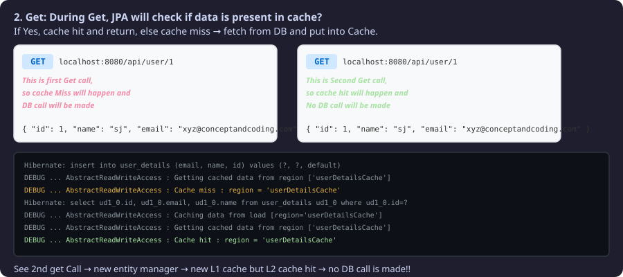

See 2nd get Call — a new entity manager so new L1 cache but L2 cache we get hit so **no DB call is made**!!


---

## Detail Analysis — Why 3 Dependencies?

### 1. Why in pom.xml, 3 dependencies required?

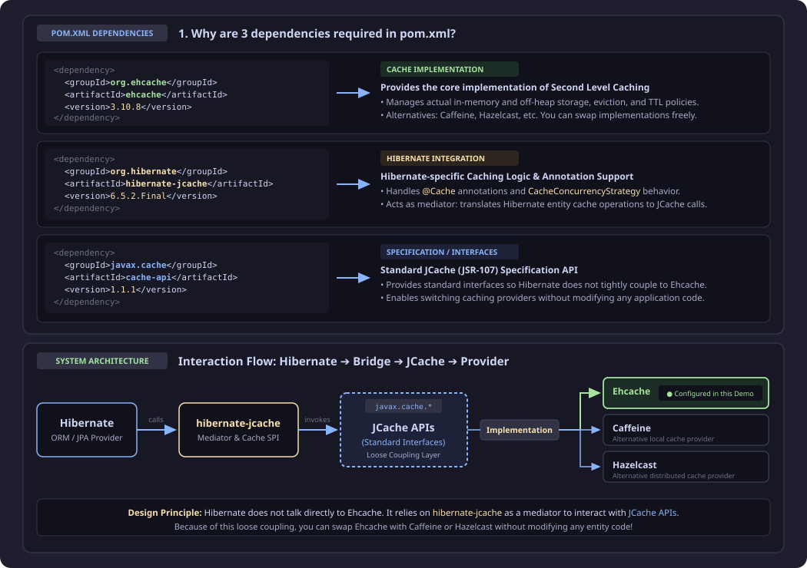

| Dependency | Purpose |
|---|---|
| `org.ehcache:ehcache` | Provides the core implementation of Second level caching |
| `org.hibernate:hibernate-jcache` | Hibernate specific Caching logic. Like we use `@Cache` with `CacheConcurrencyStrategy`, so specific logic need to be executed, and this library helps us with that. |
| `javax.cache:cache-api` | Provides the interface for Jcache, hibernate interact with these APIs. Helps to achieve Loose coupling. We can change from Ehcache to some other Jcache compliant caching provider without changing code. |

- 1st dependency tells which cache implementation to use!! Implementations like **Ehcache**, **Caffeine cache** and **Hazelcast** cast!! You can use any of these!!
- Now we have cache-api!! It provide various api to do operations on cache!! We only interested in invoking APIs which calls cache implementation whatever implementation you use!!
- Hibernate needs to talk to Jcache APIs!! Hibernate does not directly talk to Jcache so we need some mediator between them!! To talk between two we use **Hibernate-jcache**!! Hibernate-jcache provides cache specific logic!!

---

## 2. Lets understand application.properties and Region

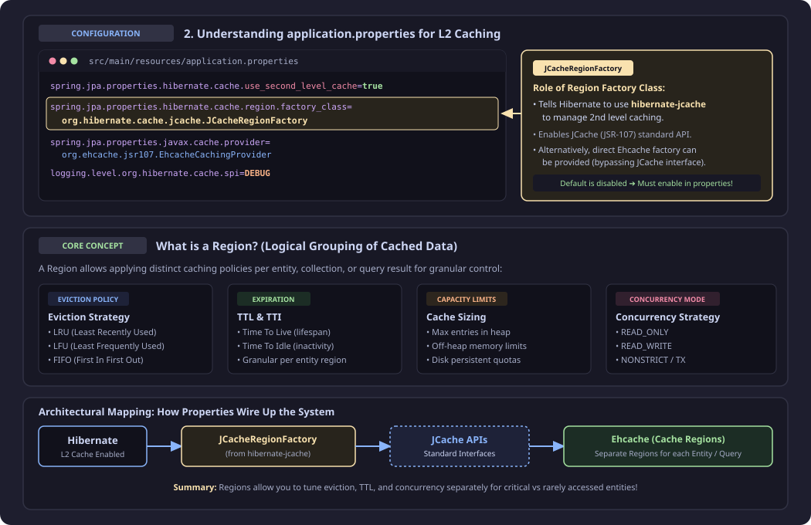

```properties
spring.jpa.properties.hibernate.cache.use_second_level_cache=true
spring.jpa.properties.hibernate.cache.region.factory_class=org.hibernate.cache.jcache.JCacheRegionFactory
spring.jpa.properties.javax.cache.provider=org.ehcache.jsr107.EhcacheCachingProvider
logging.level.org.hibernate.cache.spi=DEBUG
```

- `JCacheRegionFactory` tells hibernate to use hibernate-jcache class to manage caching. We can also provide here direct ehcache factory class, means bypassing Jcache interface.
- By default 2nd level cache is **disabled**, we need to enable it in properties!!
- 2nd property `region factory` → Use `JcacheRegionFactory` which is managed by **Hibernate-jacache**!!

### Region:

Helps in **logical grouping** of cached data. For each Region (or say group), we can apply different caching strategy like:
- Eviction policy
- TTL
- Cache size
- Concurrency strategy etc.

Which helps in achieving granular level management of cached data (either Entity, Collection or Query results)

- But we can use Ehcache too!! But it has disadvantage that if we changed cache then need to change code!
- 3rd property cache provider, so we put `EHcacheCachingProvider`
- 4th one is just for debug!! 1st 3 are only important!!

Region tells about logical grouping!! For each region we have different eviction policy like `LIFO`, `FIFO`, `LRU`, `LFU` and so on, different Time to live, Cache size (entries in cache), Concurrency Strategy etc!!

---

## Entities with Different Cache Regions + ehcache.xml

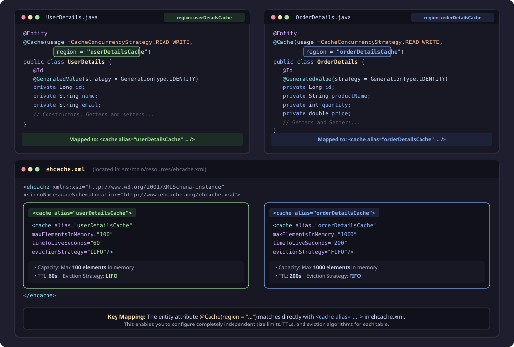

```java
@Entity
@Cache(usage = CacheConcurrencyStrategy.READ_WRITE,
        region = "userDetailsCache")
public class UserDetails {
    @Id
    @GeneratedValue(strategy = GenerationType.IDENTITY)
    private Long id;
    private String name;
    private String email;
    // Constructors, Getters and setters
}

@Entity
@Cache(usage = CacheConcurrencyStrategy.READ_WRITE,
        region = "orderDetailsCache")
public class OrderDetails {
    @Id
    @GeneratedValue(strategy = GenerationType.IDENTITY)
    private Long id;
    private String productName;
    private int quantity;
    private double price;
    // Getters and Setters
}
```

**ehcache.xml** (file within "src/main/resources/" path):

```xml
<ehcache xmlns:xsi="http://www.w3.org/2001/XMLSchema-instance"
          xsi:noNamespaceSchemaLocation="http://www.ehcache.org/ehcache.xsd">

    <cache alias="userDetailsCache"
            maxElementsInMemory="100"
            timeToLiveSeconds="60"
            evictionStrategy="LIFO" />

    <cache alias="orderDetailsCache"
            maxElementsInMemory="1000"
            timeToLiveSeconds="200"
            evictionStrategy="FIFO" />
</ehcache>
```

See above entities we have put Cache on both!! We can give any name to Region!! We can put region details in application.properties or create another xml like above and put region details there!!

---

## 3. Different CacheConcurrencyStrategy

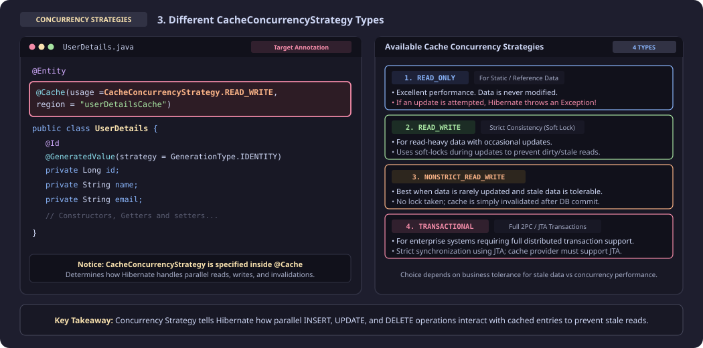

Let us see Concurrency Strategy!! We have **4 types**!! Which one to use depends on business to business!! This tells how insert, update, delete impact cache data so that they can run in parallel!! In some applications we want strict concurrency so no stale data!!

| S.No. | Strategy |
|---|---|
| 1. | READ_ONLY |
| 2. | READ_WRITE |
| 3. | NONSTRICT_READ_WRITE |
| 4. | TRANSACTIONAL |

---

## Strategy 1: READ_ONLY

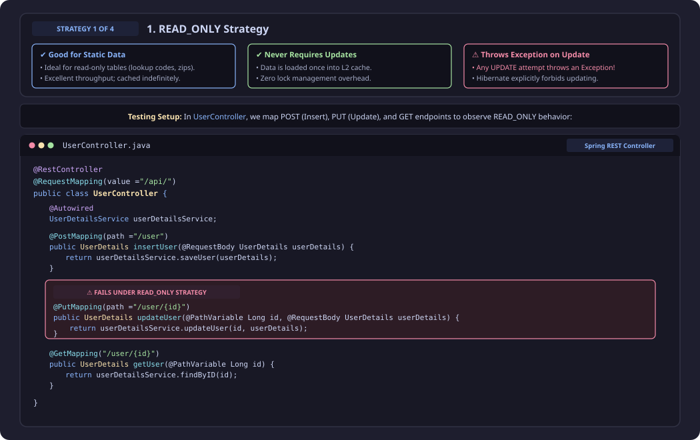

- **Good for Static Data**
- **Which do not require any updates**
- **If try to update just entity, exception will come**

In the Controller see below we have put mapping!!

```java
@RestController
@RequestMapping(value = "/api/")
public class UserController {

    @Autowired
    UserDetailsService userDetailsService;

    @PostMapping(path = "/user")
    public UserDetails insertUser(@RequestBody UserDetails userDetails) {
        return userDetailsService.saveUser(userDetails);
    }

    @PutMapping(path = "/user/{id}")
    public UserDetails updateUser(@PathVariable Long id, @RequestBody UserDetails userDetails) {
        return userDetailsService.updateUser(id, userDetails);
    }

    @GetMapping("/user/{id}")
    public UserDetails getUser2() {
        return userDetailsService.findByID(primaryKey: 1L);
    }
}
```
#### Service

```java
@Service
public class UserDetailsService {

    @Autowired
    UserDetailsRepository userDetailsRepository;

    public UserDetails saveUser(UserDetails user) {
        return userDetailsRepository.save(user);
    }

    public UserDetails updateUser(Long id, UserDetails user) {
        UserDetails existingUser = userDetailsRepository.findById(id).get();
        existingUser.setName(user.getName());
        existingUser.setEmail(user.getEmail());
        return userDetailsRepository.save(existingUser);
    }

    public UserDetails findByID(Long primaryKey) {
        return userDetailsRepository.findById(primaryKey).get();
    }
}

@Repository
public interface UserDetailsRepository extends
        JpaRepository<UserDetails, Long> {
}
```

Above service we are updating.

### Entity with READ_ONLY

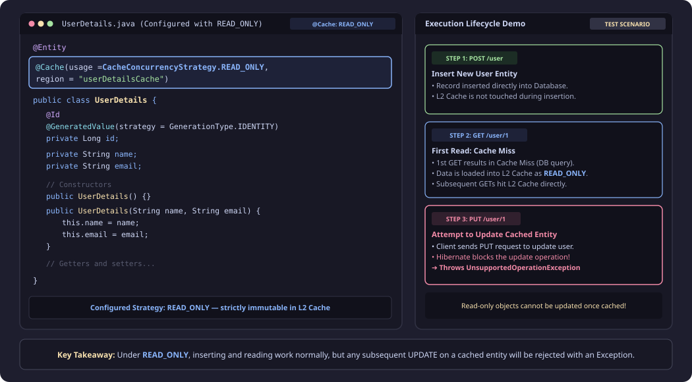

```java
@Entity
@Cache(usage = CacheConcurrencyStrategy.READ_ONLY,
        region = "userDetailsCache")
public class UserDetails {

    @Id
    @GeneratedValue(strategy = GenerationType.IDENTITY)
    private Long id;

    private String name;
    private String email;

    // Constructors
    public UserDetails() {
    }

    public UserDetails(String name, String email) {
        this.name = name;
        this.email = email;
    }

    // Getters and setters
}
```

See entity is read only!!!

1st we have inserted then we do GET — 1st cache miss so get from DB and then put in L2 cache!! Now we do PUT call!! But entity is Read Only

### READ_ONLY Error Demo

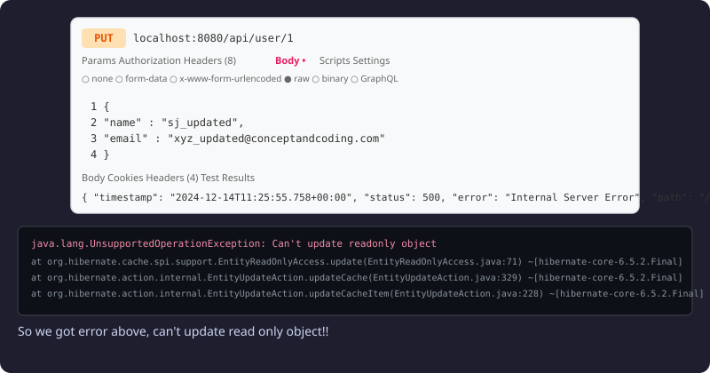

```
PUT localhost:8080/api/user/1
Body: { "name" : "sj_updated", "email" : "xyz_updated@conceptandcoding.com" }

Response: { "timestamp": "2024-12-14T11:25:55.758+00:00", "status": 500, "error": "Internal Server Error", "path": "/api/user/1" }

java.lang.UnsupportedOperationException: Can't update readonly object
    at org.hibernate.cache.spi.support.EntityReadOnlyAccess.update(EntityReadOnlyAccess.java:71)
    at org.hibernate.action.internal.EntityUpdateAction.updateCache(EntityUpdateAction.java:329)
    at org.hibernate.action.internal.EntityUpdateAction.updateCacheItem(EntityUpdateAction.java:228)
```

So we got error above, **can't update read only object**!!

---

## Strategy 2: READ_WRITE

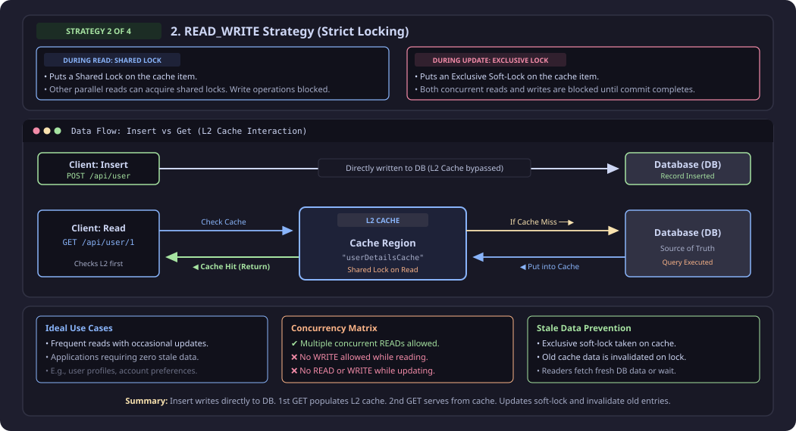

- **During Read**, it put **Shared Lock**, other Read can also acquire Shared Lock. But no Write operation.
- **During Update**, it put **Exclusive Lock**, other Read and Write operation not allowed.

1st we do insert and then do 1st get call!! Then on 2nd get call L2 cache comes into picture!! L2 cache never comes before that!!

Use cases when multiple read, write, delete!! Also we do not want stale data!!

- We can have multiple read!!
- But can't have write on read!!
- And while writing cannot read or write!!

How it makes sure it does not get stale data — Once it gets lock on cache, **it invalidates old data**!!

### READ_WRITE Update Flow

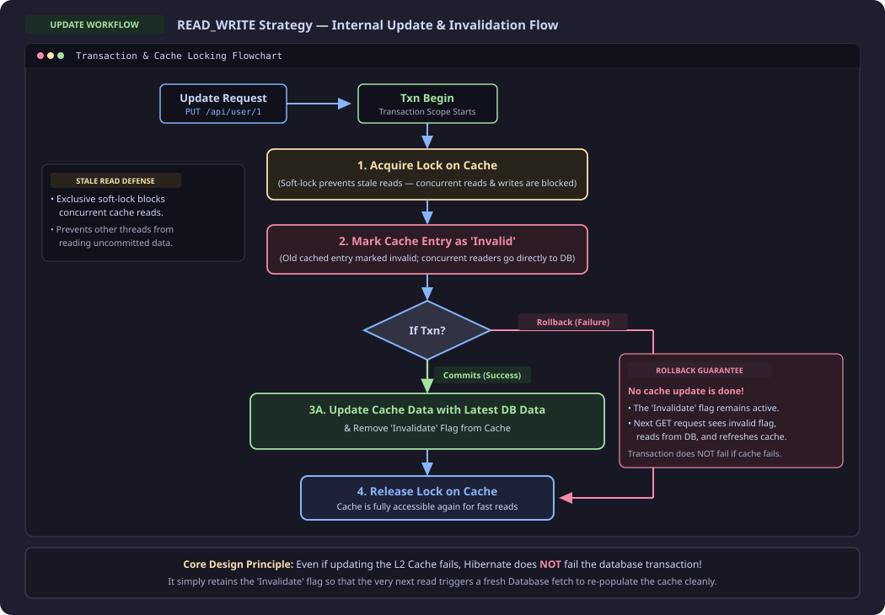

In case of rollback, no updation of cache is done!! But the invalidate flag is still not removed so whenever the next GET call or any call happens it updates the cache!!

In case not able to update the cache we are not failing Transaction!! It will not remove invalidate flag!!!

### READ_WRITE Demo — POST → GET → PUT → GET

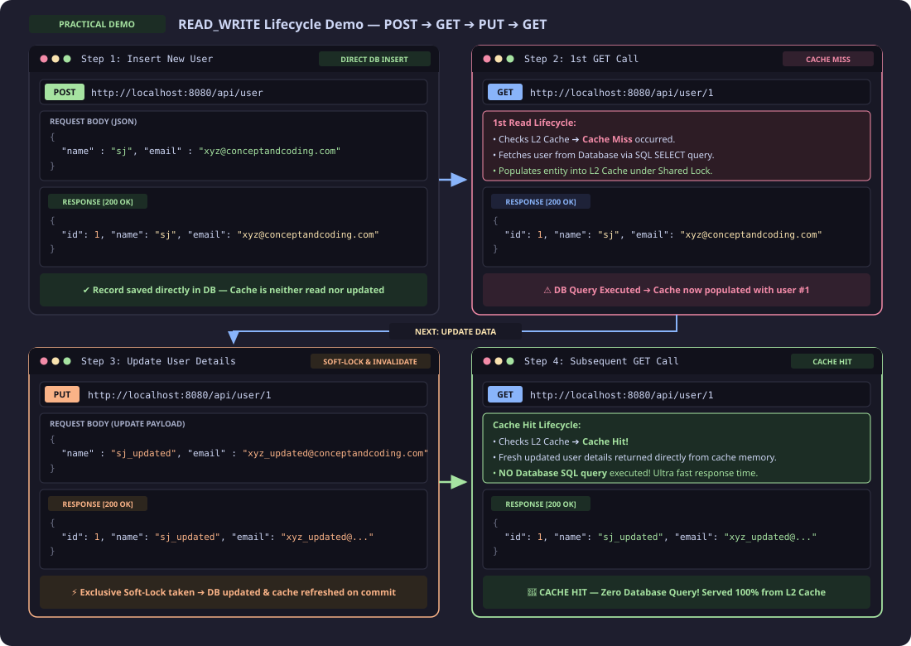

### READ_WRITE Console Logs

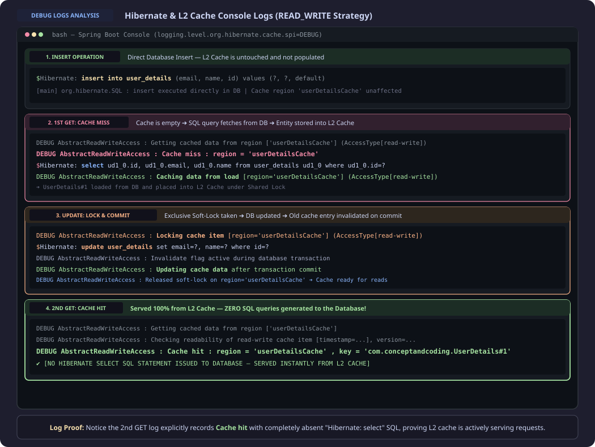

```
Hibernate: insert into user_details (email, name, id) values (?, ?, default)
─── Insert Operation (directly inserted into DB)

DEBUG AbstractReadWriteAccess : Cache miss : region = 'userDetailsCache'
Hibernate: select ud1_0.id, ud1_0.email, ud1_0.name from user_details ud1_0 where ud1_0.id=?
─── Get Operation (Cache Miss, read from DB and inserted into Cache)
DEBUG AbstractReadWriteAccess : Caching data from load [region='userDetailsCache']

Hibernate: update user_details set email=?, name=? where id=?
─── Update Operation (Cache Lock and update both DB and Cache on Success)

DEBUG AbstractReadWriteAccess : Cache hit : region = 'userDetailsCache'
─── Get Operation (Cache hit, No DB hit)
```

After 1st cache miss we get, We get the L2 cache so now on 2nd call we get no DB call!!

- On read **no locks**!!
- It means try to get lock for less time!!
- Now here no update cache on updation!! It just **invalidates** the cache!!
- If transaction rollback, it wont even invalidate!! It just release the lock!!

---

## Strategy 3: NONSTRICT_READ_WRITE & Strategy 4: TRANSACTIONAL

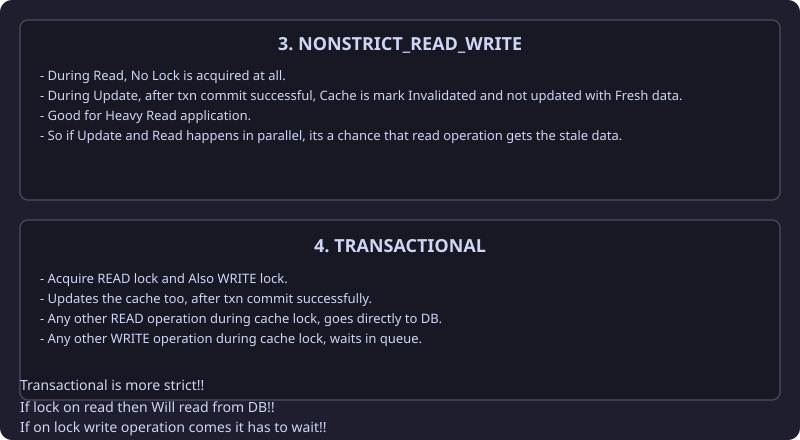

### 3. NONSTRICT_READ_WRITE

- During Read, **No Lock** is acquired at all.
- During Update, after txn commit successful, Cache is mark **Invalidated** and not updated with Fresh data.
- Good for **Heavy Read** application.
- So if Update and Read happens in parallel, its a chance that read operation gets the **stale data**.

### 4. TRANSACTIONAL

- Acquire **READ lock** and Also **WRITE lock**.
- Updates the cache too, after txn commit successfully.
- Any other READ operation during cache lock, goes directly to **DB**.
- Any other WRITE operation during cache lock, **waits in queue**.

Transactional is more strict!!

If lock on read then Will read from DB!!

If on lock write operation comes it has to wait!!
