## First Level Cache Recap

From previous video, First level caching, we already know that, for each **HTTP REQUEST**, different EntityManager Object (session) is created and it has its own Persistence context (1st level cache).

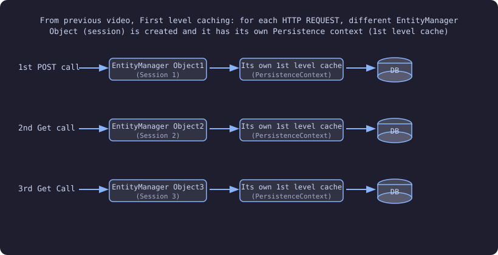

- We have already seen first level caching in a previous video!!
- For a new http request a new Entity manager is created; for each entity manager a new Persistence Context is created!!
- Persistence Context has its own hashmap!! Which is cache here!!

Now let us see **L2 cache** or **level 2 cache**!!

---
## Is L2 cache same as putting redis as cache?
No, they are different. L2 cache is specific to Hibernate/JPA and is used to cache entity data. Redis, on the other hand, is a general-purpose in-memory data store that can be used as a cache, message broker, and more. Redis is external to Hibernate, while L2 cache is internal to Hibernate.


No — they're related in *purpose* (both cache data to avoid expensive re-fetches) but very different in **scope, mechanism, and level**. Let's break down the distinction clearly.

**Hibernate L2 Cache (Second-Level Cache)**

- This is specifically about **JPA/Hibernate entity caching** — it caches **database entity objects** (the results of your `EntityManager`/repository queries) so that repeated lookups for the same entity don't hit the database again.
- **Scope:** shared across **all sessions/transactions within a single application instance** (that's what makes it "second-level" — the "first-level cache" is per-`EntityManager`/session, and L2 sits above that, shared app-wide within one JVM).
- **Where it lives:** typically in-memory within the same JVM as your application (using providers like **Ehcache**, **Caffeine**, or **Infinispan** as the underlying storage).
- **What it caches:** entity objects by primary key (`User` by `id`), and sometimes query results (`@QueryHints` for query caching).
- **Enabled via:** `@Cacheable` annotation on entities + Hibernate second-level cache configuration (`hibernate.cache.use_second_level_cache=true`).

**Redis as a cache**

- This is a **general-purpose, distributed, external cache** — a separate service entirely, not tied to Hibernate/JPA at all.
- **Scope:** shared across **multiple application instances/services** (since it's an external process, not living inside any single JVM) — this is the big structural difference.
- **What it caches:** anything you explicitly choose to store — DTOs, computed results, session data, rate limiter counters (as you've used it), serialized objects, HTML fragments — completely independent of your ORM/entity layer.
- **How it's used:** you explicitly write code to check Redis first, then fall back to DB on a cache miss (cache-aside pattern), or use Spring's `@Cacheable` with a Redis-backed `CacheManager` to make it feel automatic.

**Key differences, side by side**

| | Hibernate L2 Cache | Redis |
|---|---|---|
| Scope | Single JVM (per app instance) | Shared across all instances |
| Tied to ORM? | Yes — entity/query-specific | No — completely general purpose |
| Survives app restart? | No (in-memory, local) | Yes (separate process, persists independently) |
| Works in microservices (multi-instance)? | No — each instance has its own separate L2 cache, so they can go **out of sync** with each other | Yes — this is exactly why Redis is preferred in distributed/microservices setups |
| Use case | Reduce DB load within one app instance for entity lookups | Reduce DB/computation load across the whole distributed system, plus general caching, rate limiting, distributed locks, session storage |


**One-line interview answer:**
"Hibernate's L2 cache is a JVM-local, ORM-specific cache for entity/query results, shared only within one application instance — it can go stale across multiple instances in a microservices setup. Redis is an external, distributed, general-purpose cache shared across all instances, making it the better choice when you need cache consistency across a horizontally-scaled service — though you could technically configure Hibernate's L2 cache to use a distributed provider like Infinispan in clustered mode to get similar cross-instance consistency, at added complexity."

---
## Second Level Cache (L2 Cache)

Now, in **Second Level caching** or **L2 caching**, we will achieve something like this:

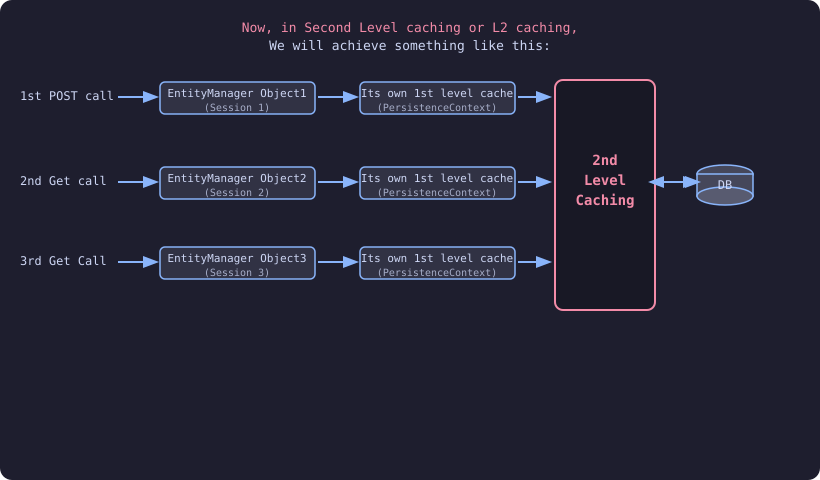

Now between PersistanceContext and DB we have **Another layer** called as **2nd level cache**!! Now every persistence Context shares L2 cache!!

---

### **Is Hibernate L2 Cache the same as Spring Boot's Default Cache (`@Cacheable`)?**

> **Short Answer: NO!** They operate at **completely different architectural layers**, solve different problems, and work completely differently under the hood.

```
┌─────────────────────────────────────────────────────────────┐
│                      Client Request                         │
└─────────────────────────────┬───────────────────────────────┘
                              ▼
┌─────────────────────────────────────────────────────────────┐
│                     Controller Layer                        │
└─────────────────────────────┬───────────────────────────────┘
                              ▼
┌─────────────────────────────────────────────────────────────┐
│                      Service Layer                          │
│                                                             │
│   ⭐ 1. SPRING BOOT CACHE (@Cacheable)                      │
│      - Intercepts Java method execution via Spring AOP      │
│      - Caches ANY method return value (DTO, String, List)   │
│      - Skips service method entirely on cache HIT           │
└─────────────────────────────┬───────────────────────────────┘
                              ▼
┌─────────────────────────────────────────────────────────────┐
│                    Repository / ORM Layer                   │
│                                                             │
│   ⭐ 2. HIBERNATE L1 CACHE (Persistence Context / Session)  │
│      - Transaction-scoped (lives & dies with transaction)   │
│                              │                              │
│                              ▼                              │
│   ⭐ 3. HIBERNATE L2 CACHE (SessionFactory / Process-wide)  │
│      - Shared across ALL Persistence Contexts               │
│      - Caches dehydrated entity data (raw column values)    │
│      - Only skips the SQL query to DB, NOT service code     │
└─────────────────────────────┬───────────────────────────────┘
                              ▼
┌─────────────────────────────────────────────────────────────┐
│                     Database (RDBMS)                        │
└─────────────────────────────────────────────────────────────┘
```

---

#### **Key Differences Explained with Examples**

##### **1. Where do they intercept?**
* **Spring `@Cacheable`**: Intercepts **method calls** via Spring AOP.
  ```java
  @Service
  public class OrderService {
      // 🟢 Spring Cache:
      // If orderId=10 is in cache, this ENTIRE METHOD is skipped!
      // No calculations, no repository calls, no DB touches.
      @Cacheable(value = "orderSummaries", key = "#orderId")
      public OrderSummaryDTO getOrderSummary(Long orderId) {
          // Expensive calculation / multi-table joins:
          Order order = orderRepository.findById(orderId).orElseThrow();
          return new OrderSummaryDTO(order, calculateDiscounts(order));
      }
  }
  ```
* **Hibernate L2 Cache**: Intercepts **ORM entity queries** before hitting the database.
  ```java
  @Service
  public class OrderService {
      public Order getOrder(Long orderId) {
          // 🔵 Hibernate L2 Cache:
          // The service method ALWAYS runs.
          // Inside orderRepository.findById(orderId):
          // 1. Checks L1 cache. Miss?
          // 2. Checks L2 cache. If HIT -> Reconstructs Order entity from cached data!
          // 3. No SQL "SELECT * FROM orders WHERE id=?" sent to DB.
          return orderRepository.findById(orderId).orElseThrow();
      }
  }
  ```

---

##### **2. Cache Invalidation & Stale Data (The BIGGEST Difference!)**
* **Spring `@Cacheable` is DUMB regarding DB changes:**
  Spring has no clue if an entity was modified in the database. You **must manually evict** the cache using `@CacheEvict` or `@CachePut`:
  ```java
  @Transactional
  @CacheEvict(value = "orderSummaries", key = "#orderId") // ⚠️ If you forget this, cache stays STALE!
  public void updateOrderStatus(Long orderId, String status) {
      Order order = orderRepository.findById(orderId).orElseThrow();
      order.setStatus(status);
      orderRepository.save(order);
  }
  ```
* **Hibernate L2 Cache is ORM-AWARE (Automatic Eviction):**
  Hibernate tracks entity mutations directly in its lifecycle. When you update an entity:
  ```java
  @Transactional
  public void updateOrderStatus(Long orderId, String status) {
      Order order = orderRepository.findById(orderId).orElseThrow();
      order.setStatus(status); 
      // When the transaction commits, Hibernate AUTOMATICALLY updates
      // or invalidates the L2 cache entry for this Order entity!
      // No manual @CacheEvict annotation needed!
  }
  ```

---

##### **3. What actually gets stored in memory?**
* **Spring `@Cacheable`**: Stores the exact **Java return object** (e.g. `OrderSummaryDTO`, a `List<Product>`, or raw JSON).
* **Hibernate L2 Cache**: Does **NOT** store actual Java entity instances (to prevent threading and reference mutation issues). Instead, it stores **"dehydrated" raw property arrays**:
  ```
  Cached Data: [id: 10, status: "PENDING", totalAmount: 250.00, customerId: 4]
  ```
  When fetched, Hibernate creates a *new managed Java object* inside the current transaction's `PersistenceContext` (L1 cache) and inflates it with these cached values.

---

#### **Side-by-Side Comparison Table**

| Aspect | Spring Boot Cache (`@Cacheable`) | Hibernate Second Level Cache (L2) |
|---|---|---|
| **Layer** | **Application / Service Layer** (via Spring AOP) | **ORM / Persistence Layer** (inside Hibernate) |
| **Annotation** | `org.springframework.cache.annotation.Cacheable` | `jakarta.persistence.Cacheable` & `org.hibernate.annotations.Cache` |
| **What is Cached?** | Any method return value (DTO, POJO, primitive, List, etc.) | Entity column values, collections, query cache |
| **What is Skipped on Hit?** | The **entire method body** (no service code executes) | Only the **SQL `SELECT` statement** to the DB |
| **Cache Invalidation** | **Manual** (must use `@CacheEvict` or `@CachePut`) | **Automatic** (Hibernate tracks entity changes on commit) |
| **Default Provider** | Spring provides a simple default (`ConcurrentMapCacheManager`) | **None** (must explicitly configure Ehcache, Hazelcast, Infinispan, etc.) |
| **Best Used For** | Caching DTOs, external REST API responses, heavy business calculations | Caching frequently read, infrequently updated JPA Entities across multiple sessions |

---

## **Deep Dive: Spring Boot Default Cache (Spring Cache Abstraction)**

Before tracing Hibernate L2 Cache, let's understand **Spring Boot's default cache mechanism** in detail — its dependencies, how it works under the hood, and every caching annotation with practical examples.

---

### **1. What is the Spring Boot Default Cache?**

Spring Framework does not write its own custom in-memory caching engine. Instead, it provides a unified **Cache Abstraction Layer** (via the `org.springframework.cache` package).

When you enable caching in Spring Boot without declaring an external cache provider (such as Redis, Caffeine, Ehcache, or Hazelcast), Spring Boot automatically auto-configures the **Default Cache Provider**:
👉 **`ConcurrentMapCacheManager`** (often referred to as the **Simple Cache**).

#### **How the Default Cache Works Under the Hood:**
* It is backed by standard Java **`ConcurrentHashMap<Object, Object>`** instances in JVM heap memory.
* For each named cache (e.g., `"products"`, `"users"`), Spring initializes an underlying `ConcurrentHashMap`.
* Keys (e.g. `Long id`) and values (e.g. `ProductDTO`) are stored as raw Java object references in memory.
* **Scope:** Local to the single running JVM process (not shared across instances or servers).

```
┌────────────────────────────────────────────────────────────────────────┐
│                         JVM Memory Heap                                │
│                                                                        │
│   org.springframework.cache.concurrent.ConcurrentMapCacheManager       │
│                                                                        │
│   ┌───────────────────────────────┐  ┌───────────────────────────────┐ │
│   │ Cache Name: "products"        │  │ Cache Name: "users"           │ │
│   │ ConcurrentHashMap<Key, Value> │  │ ConcurrentHashMap<Key, Value> │ │
│   │  Key: 101 -> ProductDTO(...)  │  │  Key: 501 -> UserProfile(...) │ │
│   │  Key: 102 -> ProductDTO(...)  │  │  Key: 502 -> UserProfile(...) │ │
│   └───────────────────────────────┘  └───────────────────────────────┘ │
└────────────────────────────────────────────────────────────────────────┘
```

> [!WARNING]
> **Limitations of the Default Cache in Production:**
> 1. **No Eviction Policy (TTL / Expiry):** Entries stay in memory indefinitely until manually evicted via `@CacheEvict`.
> 2. **No Max-Size / Memory Bounds:** High request traffic with unique keys will cause unbounded memory growth and trigger `OutOfMemoryError (OOM)`.
> 3. **Not Distributed:** In a horizontally-scaled microservice architecture (multiple pods/instances), each pod has its own `ConcurrentHashMap`, leading to data inconsistencies across pods.
>
> 💡 *Takeaway: The default cache is ideal for prototyping, testing, or small static lookup tables (e.g. country codes, roles). For production workloads, switch to **Caffeine** (single-instance with TTL/LRU) or **Redis** (distributed across all pods).*

---

### **2. Dependencies Required**

To enable Spring Boot's caching abstraction, add the starter dependency to your project:

#### **Maven (`pom.xml`):**
```xml
<dependency>
    <groupId>org.springframework.boot</groupId>
    <artifactId>spring-boot-starter-cache</artifactId>
</dependency>
```

#### **Gradle (`build.gradle`):**
```groovy
implementation 'org.springframework.boot:spring-boot-starter-cache'
```

#### **What does `spring-boot-starter-cache` do?**
1. Brings in `spring-context-support`, containing the core caching interfaces (`Cache`, `CacheManager`, etc.).
2. Triggers Spring Boot's `CacheAutoConfiguration`.
3. If no other provider dependency (e.g. Caffeine, Redis, Hazelcast) is found on the classpath, Spring Boot defaults to `spring.cache.type=simple` (`ConcurrentMapCacheManager`).

---

### **3. How Spring Cache Works Internally (AOP Proxy Architecture)**

Spring Caching is implemented entirely via **Spring AOP (Aspect-Oriented Programming)** proxies (`CacheInterceptor`).

```
 Client HTTP Request
       │
       ▼
 ┌──────────────┐
 │  Controller  │
 └──────┬───────┘
        │
        ▼
 ┌─────────────────────────────────────────────────────────────┐
 │                     Spring AOP Proxy                        │
 │                                                             │
 │  1. Intercepts method call with @Cacheable                  │
 │  2. Computes the Cache Key (e.g. from method arguments)     │
 │  3. Checks CacheManager (ConcurrentHashMap)                 │
 └──────────────┬──────────────────────────────┬───────────────┘
                │                              │
          Cache HIT?                      Cache MISS?
                │                              │
                ▼                              ▼
     Return cached value             ┌─────────────────────┐
     (Method body SKIPPED! ⚡)       │  Target Service     │
                                     │  Executes actual    │
                                     │  business logic /   │
                                     │  database query     │
                                     └─────────┬───────────┘
                                               │
                                               ▼
                                     Store result in Cache
                                               │
                                               ▼
                                         Return result
```

---

### **4. All Spring Boot Caching Annotations**

Spring provides 6 core caching annotations under the package `org.springframework.cache.annotation`:

| Annotation | Target | Purpose |
|---|---|---|
| **`@EnableCaching`** | Class (Config / Main) | Enables Spring's annotation-driven cache management |
| **`@Cacheable`** | Method / Class | Populates cache on miss; skips method on hit |
| **`@CachePut`** | Method | Always runs method & updates the cache with result |
| **`@CacheEvict`** | Method | Removes entry/entries from cache (eviction) |
| **`@Caching`** | Method | Groups multiple cache operations (e.g. multi-evict) |
| **`@CacheConfig`** | Class | Defines shared cache configurations across methods |

---

#### 1️⃣ `@EnableCaching`
Activates Spring’s annotation-driven cache management. Without this annotation, all caching annotations (`@Cacheable`, `@CacheEvict`, etc.) are **completely ignored**!

```java
@SpringBootApplication
@EnableCaching // 👈 Activates Spring AOP caching infrastructure
public class Application {
    public static void main(String[] args) {
        SpringApplication.run(Application.class, args);
    }
}
```

* **Attributes:**
  * `proxyTargetClass`: Forces CGLIB class-based proxies instead of standard JDK interface proxies (`true` by default in Spring Boot).
  * `mode`: Advice mode (`AdviceMode.PROXY` by default, or `AdviceMode.ASPECTJ` for compile-time/load-time weaving).

---

#### 2️⃣ `@Cacheable`
Applied to methods. When invoked:
1. Spring generates a cache key from method parameters.
2. If the key exists in the cache, the **method body is not executed**; the cached value is returned immediately.
3. If the key does not exist, the method runs, and its return value is stored in the cache.

```java
@Service
public class ProductService {

    @Cacheable(value = "products", key = "#id")
    public ProductDTO getProductById(Long id) {
        // Simulating slow database call or computation
        System.out.println("Fetching from Database for ID: " + id);
        return productRepository.findById(id)
                .map(ProductDTO::new)
                .orElseThrow(() -> new ProductNotFoundException(id));
    }
}
```

##### **Key Attributes of `@Cacheable`:**

| Attribute | Type | Description & Example |
|---|---|---|
| `value` / `cacheNames` | `String[]` | Name of the cache region (e.g. `value = "products"`). |
| `key` | `String` (SpEL) | Dynamic key via SpEL (e.g. `key = "#id"`, `key = "#user.email"`). If omitted, uses default `SimpleKeyGenerator` (hashes all parameters). |
| `keyGenerator` | `String` | Bean name of custom `KeyGenerator` implementation. Mutually exclusive with `key`. |
| `condition` | `String` (SpEL) | Evaluated **BEFORE** method runs. If `false`, caching is bypassed (method runs normally without checking or updating cache). Example: `condition = "#id > 10"`. |
| `unless` | `String` (SpEL) | Evaluated **AFTER** method runs. Can inspect `#result`. If `true`, the result is **NOT** cached. Example: `unless = "#result == null"`, `unless = "#result.price > 1000"`. |
| `sync` | `boolean` | If `true`, synchronizes access to prevent the **Cache Stampede / Dog-piling effect** (multiple concurrent threads requesting the same missing key). Only 1 thread executes the method while others wait for the cached result. Default `false`. |
| `cacheManager` | `String` | Bean name of specific `CacheManager` to use if multiple managers exist. |

##### **Example using `condition`, `unless`, and `sync`:**
```java
@Cacheable(
    value = "products",
    key = "#id",
    condition = "#id > 0",              // Only cache if ID is positive
    unless = "#result == null",         // Do NOT cache null returns
    sync = true                         // Thread-safe lock against cache stampede
)
public ProductDTO getProduct(Long id) {
    return productRepository.findById(id).map(ProductDTO::new).orElse(null);
}
```

---

#### 3️⃣ `@CachePut`
Always **executes the method body**, and then updates the cache with the returned result.

> [!IMPORTANT]
> **Difference between `@Cacheable` and `@CachePut`:**
> * `@Cacheable`: Skips method execution if cache entry already exists.
> * `@CachePut`: **ALWAYS executes** the method and updates the cache with the fresh result.
> Use `@CachePut` for **update / save** methods!

```java
@CachePut(value = "products", key = "#productDTO.id")
public ProductDTO updateProduct(ProductDTO productDTO) {
    // Method ALWAYS executes to update DB:
    Product entity = productRepository.findById(productDTO.getId()).orElseThrow();
    entity.setName(productDTO.getName());
    entity.setPrice(productDTO.getPrice());
    productRepository.save(entity);
    
    // The updated ProductDTO is placed into the "products" cache with key #productDTO.id
    return new ProductDTO(entity);
}
```

---

#### 4️⃣ `@CacheEvict`
Removes stale or deleted data from the cache.

```java
// Evict a single entry by ID
@CacheEvict(value = "products", key = "#id")
public void deleteProduct(Long id) {
    productRepository.deleteById(id);
}

// Clear the ENTIRE cache (all entries)
@CacheEvict(value = "products", allEntries = true)
public void clearAllProductsCache() {
    System.out.println("Cleared entire products cache!");
}
```

##### **Key Attributes of `@CacheEvict`:**

| Attribute | Type | Description |
|---|---|---|
| `key` | `String` (SpEL) | Specific key to evict (e.g. `key = "#id"`). |
| `allEntries` | `boolean` | If `true`, clears **all keys** inside that cache name. Default `false`. |
| `beforeInvocation` | `boolean` | Determines when eviction happens: <br>• `false` (default): Evicts **AFTER** method successfully completes. If method throws an exception, cache is **NOT** evicted. <br>• `true`: Evicts **BEFORE** method executes. Cache is cleared even if method subsequently fails. |

##### **Example with `beforeInvocation = true`:**
```java
// Guarantees cache is cleared even if an exception occurs during batch DB wipe:
@CacheEvict(value = "products", allEntries = true, beforeInvocation = true)
public void reloadAllProducts() {
    productRepository.deleteAll();
    externalVendorService.fetchAndSaveFreshProducts();
}
```

---

#### 5️⃣ `@Caching`
Used when a single method needs **multiple cache operations** at the same time (e.g. updating one cache while evicting another, or evicting across multiple cache regions).

```java
@Caching(
    put = {
        @CachePut(value = "products", key = "#result.id")
    },
    evict = {
        @CacheEvict(value = "productSummaries", key = "#result.id"),
        @CacheEvict(value = "featuredProducts", allEntries = true)
    }
)
public ProductDTO saveAndRefresh(ProductCreateRequest request) {
    Product product = productRepository.save(new Product(request));
    return new ProductDTO(product);
}
```

---

#### 6️⃣ `@CacheConfig`
Class-level annotation that declares shared cache settings (like `cacheNames`, `keyGenerator`, or `cacheManager`) in one place instead of repeating them across every method in the class.

```java
@Service
@CacheConfig(cacheNames = "users") // 👈 All methods default to "users" cache
public class UserService {

    @Cacheable(key = "#id") // Automatically uses "users" cache
    public UserDTO getUserById(Long id) {
        return userRepository.findById(id).map(UserDTO::new).orElseThrow();
    }

    @CachePut(key = "#user.id") // Automatically uses "users" cache
    public UserDTO updateUser(UserDTO user) {
        // ...
        return user;
    }

    @CacheEvict(key = "#id") // Automatically uses "users" cache
    public void deleteUser(Long id) {
        userRepository.deleteById(id);
    }
}
```

---

### **5. SpEL (Spring Expression Language) Cheat Sheet for Caching**

Spring Cache provides rich contextual variables that can be used in `key`, `condition`, and `unless` expressions:

| SpEL Variable | Description | Example Usage |
|---|---|---|
| `#root.method` | The method object being called | `#root.method.name` |
| `#root.target` | The target service object | `#root.targetClass` |
| `#root.caches[0]` | The cache being used | `#root.caches[0].name` |
| `#root.args[0]` or `[0]` | Argument by index | `key = "#root.args[0]"` |
| `#paramName` | Argument by parameter name | `key = "#id"` or `key = "#user.email"` |
| `#result` | The returned value from method *(Available in `unless` & `@CachePut`)* | `unless = "#result == null"`, `unless = "#result.active == false"` |

---

### **6. End-to-End Service Example (All Annotations in Action)**

```java
package com.example.service;

import com.example.dto.ProductDTO;
import com.example.entity.Product;
import com.example.repository.ProductRepository;
import org.springframework.cache.annotation.*;
import org.springframework.stereotype.Service;
import org.springframework.transaction.annotation.Transactional;

@Service
@CacheConfig(cacheNames = "products") // Shared cache name for this class
public class ProductService {

    private final ProductRepository productRepository;

    public ProductService(ProductRepository productRepository) {
        this.productRepository = productRepository;
    }

    // 1. CACHEABLE: Checks cache first. If hit -> returns cached. If miss -> runs DB query & caches.
    @Cacheable(key = "#id", unless = "#result == null")
    public ProductDTO getProductById(Long id) {
        System.out.println("--> [DB QUERY] Fetching product from DB for ID: " + id);
        return productRepository.findById(id)
                .map(ProductDTO::new)
                .orElse(null);
    }

    // 2. CACHE PUT: Always executes DB update, then updates the cache entry for this ID
    @Transactional
    @CachePut(key = "#productDTO.id")
    public ProductDTO updateProduct(ProductDTO productDTO) {
        System.out.println("--> [DB UPDATE] Updating product in DB for ID: " + productDTO.getId());
        Product product = productRepository.findById(productDTO.getId()).orElseThrow();
        product.setName(productDTO.getName());
        product.setPrice(productDTO.getPrice());
        productRepository.save(product);
        return new ProductDTO(product);
    }

    // 3. CACHE EVICT: Removes the specific item from cache when deleted
    @Transactional
    @CacheEvict(key = "#id")
    public void deleteProduct(Long id) {
        System.out.println("--> [DB DELETE] Removing product for ID: " + id);
        productRepository.deleteById(id);
    }

    // 4. CACHING: Complex eviction across multiple caches simultaneously
    @Caching(evict = {
        @CacheEvict(key = "#id"),                           // Evicts from "products"
        @CacheEvict(cacheNames = "productCatalog", allEntries = true) // Evicts catalog list
    })
    public void archiveProduct(Long id) {
        productRepository.archiveById(id);
    }

    // 5. CACHE EVICT ALL: Clears the entire "products" cache
    @CacheEvict(allEntries = true)
    public void clearProductCache() {
        System.out.println("--> [CACHE CLEAR] All entries in 'products' cache evicted.");
    }
}
```

---

### **7. Critical Pitfalls & Gotchas of Spring Cache**

#### ⚠️ **Gotcha 1: The Self-Invocation Trap (Calling Methods Within the Same Class)**
Because Spring caching works via **Spring AOP proxies**, calls must pass through the proxy for caching to activate.
If method `A()` calls `@Cacheable` method `B()` **within the same class**:
```java
@Service
public class OrderService {

    public void processOrder(Long id) {
        // ❌ DIRECT THIS CALL: Bypasses the Spring AOP Proxy!
        // getOrderDetails(id) runs WITHOUT checking the cache!
        OrderDetails details = getOrderDetails(id);
    }

    @Cacheable(value = "orders", key = "#id")
    public OrderDetails getOrderDetails(Long id) {
        return orderRepo.findById(id);
    }
}
```
* **Fix:** Call `getOrderDetails()` from a different Spring Bean (e.g. Controller or another Service), or inject `self` (`@Autowired private OrderService self;`).

#### ⚠️ **Gotcha 2: Returning Mutable Objects with Default Cache**
Because `ConcurrentMapCacheManager` stores the **exact Java object reference** in memory:
* If thread A receives `ProductDTO` from cache and modifies a field (`product.setPrice(0)`), thread B calling the cache next will see the modified price!
* **Fix:** Either treat cached objects as immutable (records/DTOs without setters) or switch to a provider with serialization (like Redis).

#### ⚠️ **Gotcha 3: `@CachePut` and `@Cacheable` on the Same Method**
Do **not** place both `@Cacheable` and `@CachePut` on the same method. Their execution behaviors conflict: `@Cacheable` attempts to skip method execution on a hit, while `@CachePut` forces method execution.

---

### **Visual Example: What Does L2 Cache Actually Track When You Hit an API?**

Let's trace a realistic example to see **what the client sees**, **what SQL runs**, and **the exact data structure Hibernate L2 Cache stores in memory**.

#### **The Scenario:**
```java
@Entity
@Table(name = "users")
@Cacheable
@org.hibernate.annotations.Cache(usage = CacheConcurrencyStrategy.READ_WRITE)
public class User {
    @Id
    private Long id;
    private String name;
    private String email;
    private String role;
    private String department;
    // getters, setters...
}
```

---

#### **Step 1: First Request (Cache MISS)**

1. **Client sends HTTP Request:**
   ```http
   GET /api/v1/users/1
   ```

2. **HTTP JSON Response returned to Client:**
   ```json
   {
     "id": 1,
     "name": "Mohit Sharma",
     "email": "mohit@example.com",
     "role": "ADMIN",
     "department": "Engineering"
   }
   ```

3. **What Hibernate does behind the scenes:**
   - Checks **L1 Cache (Persistence Context)** ➡️ **MISS** (Fresh HTTP request = new Session)
   - Checks **L2 Cache (Ehcache / Redis)** ➡️ **MISS**
   - Sends SQL query to Database:
     ```sql
     /* SQL Query Fired to DB */
     SELECT id, name, email, role, department FROM users WHERE id = 1;
     ```

4. **👉 WHAT GETS CACHED IN L2 CACHE?**
   > [!IMPORTANT]
   > **What L2 Cache does NOT store:**
   > - ❌ It does **NOT** store the HTTP JSON response.
   > - ❌ It does **NOT** store any `UserDTO` or Java controller wrapper.
   > - ❌ It does **NOT** store the Java `User` entity instance pointer (storing live Java objects would cause thread safety and dirty-state corruption issues across concurrent requests).
   >
   > **What L2 Cache ACTUALLY stores (Dehydrated Entity State):**
   > It decomposes the entity into a serialized **key-value pair** consisting of the **Primary Key** and an **array of raw column values**:

   ```json
   /* Actual Representation stored inside L2 Cache (e.g. Ehcache) */
   Region : "com.example.entity.User"
   Key    : 1
   Value  : {
     "entity": "com.example.entity.User",
     "id": 1,
     "version": 0,
     "state": [
       "Mohit Sharma",        /* index 0: name */
       "mohit@example.com",   /* index 1: email */
       "ADMIN",               /* index 2: role */
       "Engineering"          /* index 3: department */
     ]
   }
   ```

---

#### **Step 2: Second Request (Cache HIT 🚀)**

1. **Another user/thread sends the same HTTP Request:**
   ```http
   GET /api/v1/users/1
   ```

2. **What Hibernate does behind the scenes:**
   - Checks **L1 Cache** ➡️ **MISS** (Different HTTP request has its own new Session)
   - Checks **L2 Cache** for key `User#1` ➡️ **🎯 CACHE HIT!**
   - **Hibernate reconstitutes the entity:** It creates a *brand-new Java `User` object* in the current Session's L1 cache and "hydrates" it with the cached values `["Mohit Sharma", "mohit@example.com", "ADMIN", "Engineering"]`.
   - **Database SQL Query:** **ZERO SQL FIRED!** (Database is never touched).

3. **HTTP JSON Response returned to Client:**
   Identical JSON returned instantly with zero DB load:
   ```json
   {
     "id": 1,
     "name": "Mohit Sharma",
     "email": "mohit@example.com",
     "role": "ADMIN",
     "department": "Engineering"
   }
   ```

---

#### **Step 3: Update Request (How L2 Cache Tracks Mutations)**

What happens when someone modifies user #1?

1. **Client sends HTTP PUT Request:**
   ```http
   PUT /api/v1/users/1
   Content-Type: application/json

   {
     "role": "SUPER_ADMIN"
   }
   ```

2. **Inside Service:**
   ```java
   @Transactional
   public void updateUserRole(Long id, String newRole) {
       User user = userRepository.findById(id).orElseThrow();
       user.setRole(newRole); // Dirty checking detects modification
   }
   ```

3. **On Transaction Commit:**
   - **Database:** Hibernate writes the update:
     ```sql
     UPDATE users SET role = 'SUPER_ADMIN' WHERE id = 1;
     ```
   - **L2 Cache Invalidation:** Hibernate's cache interceptor automatically updates or invalidates the cached entry for `User#1`:
     ```diff
      Value : {
        "id": 1,
        "state": [
          "Mohit Sharma",
          "mohit@example.com",
     -    "ADMIN",
     +    "SUPER_ADMIN",
          "Engineering"
        ]
      }
     ```
   - The next `GET /api/v1/users/1` immediately receives `"role": "SUPER_ADMIN"`, preventing stale data without any manual `@CacheEvict` annotations!

---

#### **What about `@OneToMany` Relationships (Collections)?**
If `User` has `List<Order> orders`:
- **By default, L2 cache does NOT cache child collections** unless annotated with `@Cache` on the collection property itself.
- When cached, L2 cache does **not** store child entity objects; it stores **only an array of child IDs**:
  ```json
  Region : "com.example.entity.User.orders"
  Key    : 1
  Value  : [101, 102, 103]   /* Just foreign key IDs! */
  ```

---

## Setting Up L2 Cache — Happy Flow

Lets first see, one happy flow, and see what all it takes to enable the 2nd level caching.

### pom.xml — 3 Dependencies Required


```xml
<dependency>
    <groupId>org.ehcache</groupId>
    <artifactId>ehcache</artifactId>
    <version>3.10.8</version>
</dependency>
<dependency>
    <groupId>org.hibernate</groupId>
    <artifactId>hibernate-jcache</artifactId>
    <version>6.5.2.Final</version>
</dependency>
<dependency>
    <groupId>javax.cache</groupId>
    <artifactId>cache-api</artifactId>
    <version>1.1.1</version>
</dependency>
```

We need to add all 3 dependencies!! **Ehcache**, **hibernate-jcache**, **cache-api**!!

### application.properties


```properties
spring.jpa.properties.hibernate.cache.use_second_level_cache=true
spring.jpa.properties.hibernate.cache.region.factory_class=org.hibernate.cache.jcache.JCacheRegionFactory
spring.jpa.properties.javax.cache.provider=org.ehcache.jsr107.EhcacheCachingProvider
logging.level.org.hibernate.cache.spi=DEBUG
```

In application properties we need to enable 2nd level cache!!

### Code Overview — Controller, Entity, Service, Repository


## UserController


```java
@RestController
@RequestMapping(value = "/api/")
public class UserController {

    @Autowired
    UserDetailsService userDetailsService;

    @PostMapping(path = "/user")
    public UserDetails insertUser(@RequestBody UserDetails userDetails) {
        return userDetailsService.saveUser(userDetails);
    }

    @GetMapping("/user/{id}")
    public UserDetails getUser2() {
        return userDetailsService.findByID(primaryKey: 1L);
    }
}
```

In entity we need to make change. We need to put **cache annotation**!! See below!!

---

## UserDetails Entity with @Cache Annotation


```java
@Entity
@Cache(usage = CacheConcurrencyStrategy.READ_WRITE,
        region = "userDetailsCache")
public class UserDetails {

    @Id
    @GeneratedValue(strategy = GenerationType.IDENTITY)
    private Long id;

    private String name;
    private String email;

    // Constructors
    public UserDetails() {
    }

    public UserDetails(String name, String email) {
        this.name = name;
        this.email = email;
    }

    // Getters and setters
}
```

Below service layer and Repository we have no change in that!! Only this change needs to be change!!

---

## UserDetailsService and Repository


```java
@Service
public class UserDetailsService {

    @Autowired
    UserDetailsRepository userDetailsRepository;

    public UserDetails saveUser(UserDetails user) {
        return userDetailsRepository.save(user);
    }

    public UserDetails findByID(Long primaryKey) {
        return userDetailsRepository.findById(primaryKey).get();
    }
}

@Repository
public interface UserDetailsRepository extends
        JpaRepository<UserDetails, Long> {
}
```

---

## How Cache Works — Insert and Get Flow

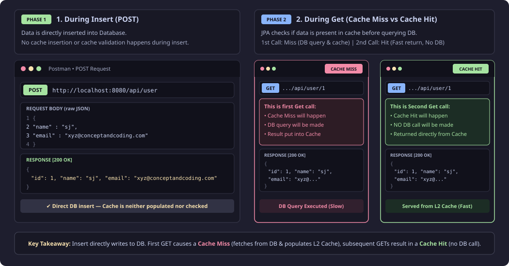

### 1. During Insert

Data is directly inserted into DB, no Cache insertion or validation happens.

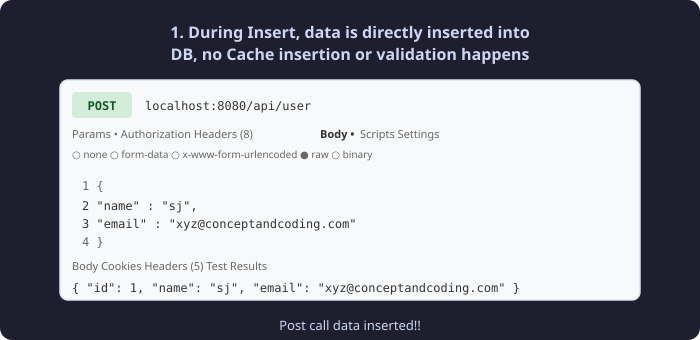

Post call data inserted!!

### 2. Get

During Get, JPA will check, if data is present in cache? If Yes, its **cache hit** and return, else its **cache miss** and it will fetch from DB and put into Cache.

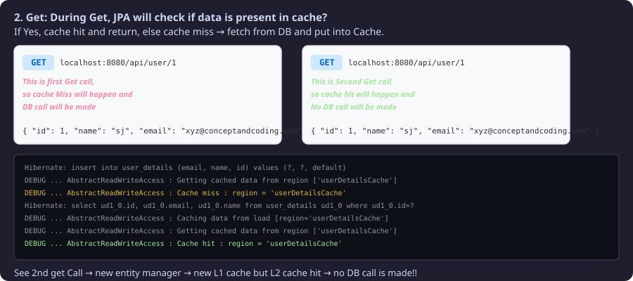

See 2nd get Call — a new entity manager so new L1 cache but L2 cache we get hit so **no DB call is made**!!


---

## Detail Analysis — Why 3 Dependencies?

### 1. Why in pom.xml, 3 dependencies required?

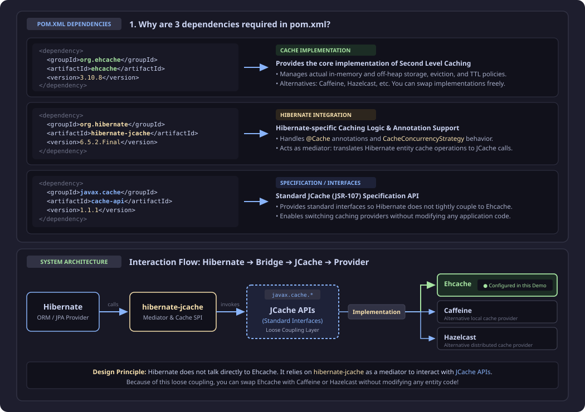

| Dependency | Purpose |
|---|---|
| `org.ehcache:ehcache` | Provides the core implementation of Second level caching |
| `org.hibernate:hibernate-jcache` | Hibernate specific Caching logic. Like we use `@Cache` with `CacheConcurrencyStrategy`, so specific logic need to be executed, and this library helps us with that. |
| `javax.cache:cache-api` | Provides the interface for Jcache, hibernate interact with these APIs. Helps to achieve Loose coupling. We can change from Ehcache to some other Jcache compliant caching provider without changing code. |

- 1st dependency tells which cache implementation to use!! Implementations like **Ehcache**, **Caffeine cache** and **Hazelcast** cast!! You can use any of these!!
- Now we have cache-api!! It provide various api to do operations on cache!! We only interested in invoking APIs which calls cache implementation whatever implementation you use!!
- Hibernate needs to talk to Jcache APIs!! Hibernate does not directly talk to Jcache so we need some mediator between them!! To talk between two we use **Hibernate-jcache**!! Hibernate-jcache provides cache specific logic!!

---

## 2. Lets understand application.properties and Region

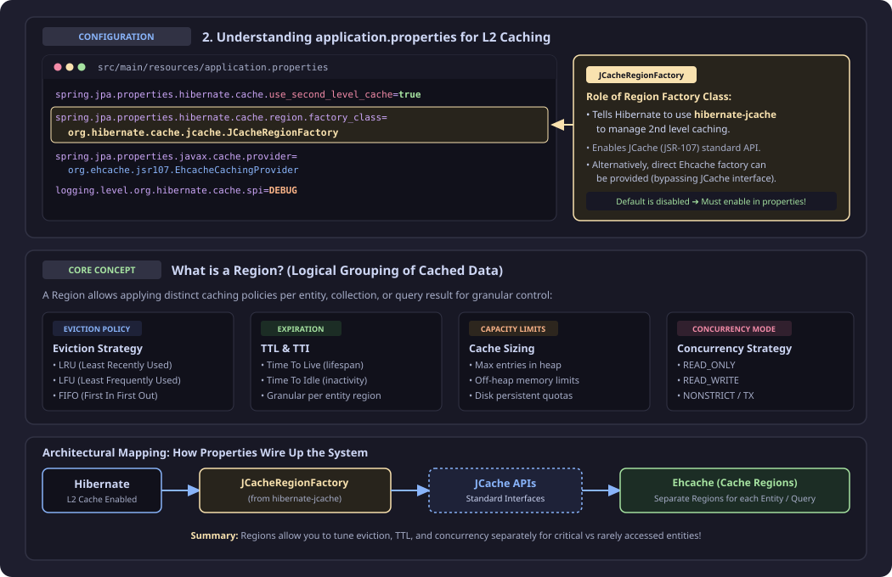

```properties
spring.jpa.properties.hibernate.cache.use_second_level_cache=true
spring.jpa.properties.hibernate.cache.region.factory_class=org.hibernate.cache.jcache.JCacheRegionFactory
spring.jpa.properties.javax.cache.provider=org.ehcache.jsr107.EhcacheCachingProvider
logging.level.org.hibernate.cache.spi=DEBUG
```

- `JCacheRegionFactory` tells hibernate to use hibernate-jcache class to manage caching. We can also provide here direct ehcache factory class, means bypassing Jcache interface.
- By default 2nd level cache is **disabled**, we need to enable it in properties!!
- 2nd property `region factory` → Use `JcacheRegionFactory` which is managed by **Hibernate-jacache**!!

### Region:

Helps in **logical grouping** of cached data. For each Region (or say group), we can apply different caching strategy like:
- Eviction policy
- TTL
- Cache size
- Concurrency strategy etc.

Which helps in achieving granular level management of cached data (either Entity, Collection or Query results)

- But we can use Ehcache too!! But it has disadvantage that if we changed cache then need to change code!
- 3rd property cache provider, so we put `EHcacheCachingProvider`
- 4th one is just for debug!! 1st 3 are only important!!

Region tells about logical grouping!! For each region we have different eviction policy like `LIFO`, `FIFO`, `LRU`, `LFU` and so on, different Time to live, Cache size (entries in cache), Concurrency Strategy etc!!

---

## Entities with Different Cache Regions + ehcache.xml

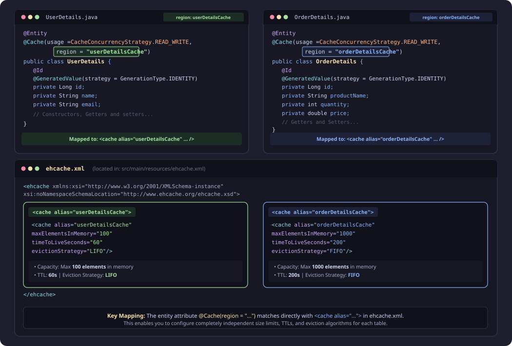

```java
@Entity
@Cache(usage = CacheConcurrencyStrategy.READ_WRITE,
        region = "userDetailsCache")
public class UserDetails {
    @Id
    @GeneratedValue(strategy = GenerationType.IDENTITY)
    private Long id;
    private String name;
    private String email;
    // Constructors, Getters and setters
}

@Entity
@Cache(usage = CacheConcurrencyStrategy.READ_WRITE,
        region = "orderDetailsCache")
public class OrderDetails {
    @Id
    @GeneratedValue(strategy = GenerationType.IDENTITY)
    private Long id;
    private String productName;
    private int quantity;
    private double price;
    // Getters and Setters
}
```

**ehcache.xml** (file within "src/main/resources/" path):

```xml
<ehcache xmlns:xsi="http://www.w3.org/2001/XMLSchema-instance"
          xsi:noNamespaceSchemaLocation="http://www.ehcache.org/ehcache.xsd">

    <cache alias="userDetailsCache"
            maxElementsInMemory="100"
            timeToLiveSeconds="60"
            evictionStrategy="LIFO" />

    <cache alias="orderDetailsCache"
            maxElementsInMemory="1000"
            timeToLiveSeconds="200"
            evictionStrategy="FIFO" />
</ehcache>
```

See above entities we have put Cache on both!! We can give any name to Region!! We can put region details in application.properties or create another xml like above and put region details there!!

---

## 3. Different CacheConcurrencyStrategy

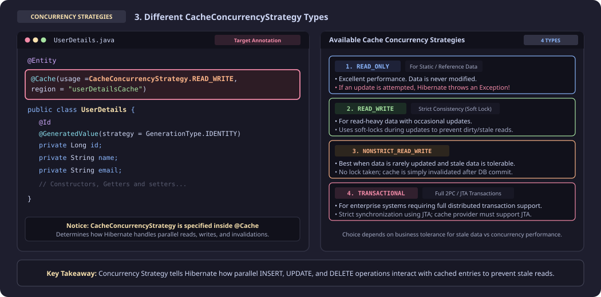

### **Why Do We Need Cache Concurrency Strategies?**

When multiple concurrent database transactions (HTTP threads) read and write to the same database tables at the same time, Hibernate's Second-Level (L2) Cache sits in the middle.

Without a concurrency strategy, you face classic concurrency nightmares:
* **Dirty Reads:** Transaction A reads uncommitted changes cached by Transaction B that later rolls back.
* **Stale Reads:** Transaction A updates the DB, but Transaction B reads old data cached in memory.
* **Lost Updates:** Two threads update the same cached entity concurrently, overwriting each other's data.

Hibernate provides **4 Cache Concurrency Strategies** (configured via `@Cache(usage = CacheConcurrencyStrategy.XYZ)`). Which one you choose depends on:
1. **How frequently data is updated** (read-heavy vs write-heavy).
2. **Whether business rules tolerate temporary stale data**.
3. **The transaction isolation environment** (non-JTA vs JTA/XA distributed transactions).

---

### **Master Comparison Matrix: The 4 Strategies at a Glance**

| Feature | `READ_ONLY` | `READ_WRITE` | `NONSTRICT_READ_WRITE` | `TRANSACTIONAL` |
|---|---|---|---|---|
| **Can Data Be Updated?** | ❌ **Strictly NO** (throws runtime exception) | ✅ Yes | ✅ Yes | ✅ Yes |
| **Locking on Read** | None | None | None | Shared Read Lock (under JTA) |
| **Locking on Update** | None (updates forbidden) | **Soft Lock** (exclusive marker on cache) | None (**Lock-free**) | **True Distributed Write Lock** |
| **What Happens on Update?** | Throws `UnsupportedOperationException` | Soft-locks cache ➔ DB update ➔ Evicts/Refreshes on commit | DB update ➔ Asynchronously invalidates cache after commit | XA Two-Phase Commit (2PC) across DB & Cache |
| **Concurrent Read During Update** | Reads cache freely (data never mutates) | **Bypasses cache ➔ reads directly from DB** (guarantees fresh data) | **Reads old cached data** (can get stale data!) | Waits in lock queue or reads under XA isolation |
| **Stale Reads Possible?** | ❌ No (data is immutable) | ❌ **No** | ⚠️ **Yes** (during concurrent write window) | ❌ **No** |
| **Rollback Handling** | N/A | Releases soft lock; invalidates cache entry | Cache remains unchanged or invalidated | Full distributed rollback (both DB & Cache revert) |
| **Requires `@Version`?** | No | **Highly Recommended / Mandatory** | Optional | Optional |
| **Cache Provider Support** | All (Ehcache, Caffeine, Redis, Hazelcast, Infinispan) | Most (Ehcache, Hazelcast, Infinispan, Redisson) | All (Ehcache, Caffeine, Hazelcast, Infinispan) | **Only JTA-capable** (Infinispan, Hazelcast JTA, JCache) |
| **Throughput / Performance** | ⚡⚡⚡ **Fastest** | ⚡⚡ High | ⚡⚡⚡ Very High | 🐢 Slower (2PC lock overhead) |
| **Primary Use Case** | Reference tables (Countries, Currencies, Zipcodes, Tax Rates) | Core domain entities (Users, Accounts, Orders, Products) | Read-heavy catalogs, blog posts, FAQs, article content | Financial ledgers, banking, high-stakes XA transactions |

---

## Strategy 1: READ_ONLY

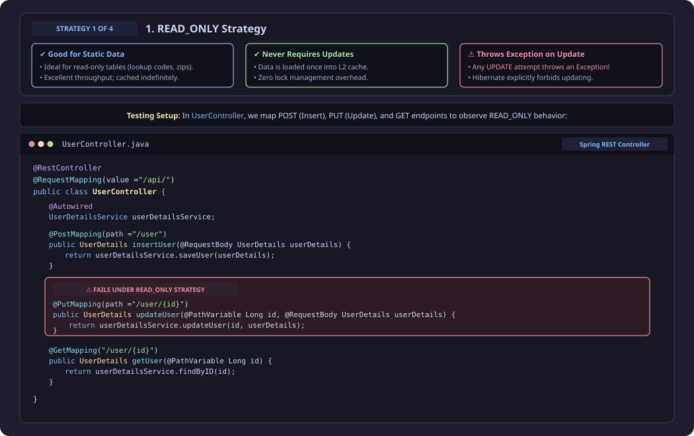

- **Good for Static Data**
- **Which do not require any updates**
- **If try to update just entity, exception will come**

In the Controller see below we have put mapping!!

```java
@RestController
@RequestMapping(value = "/api/")
public class UserController {

    @Autowired
    UserDetailsService userDetailsService;

    @PostMapping(path = "/user")
    public UserDetails insertUser(@RequestBody UserDetails userDetails) {
        return userDetailsService.saveUser(userDetails);
    }

    @PutMapping(path = "/user/{id}")
    public UserDetails updateUser(@PathVariable Long id, @RequestBody UserDetails userDetails) {
        return userDetailsService.updateUser(id, userDetails);
    }

    @GetMapping("/user/{id}")
    public UserDetails getUser2() {
        return userDetailsService.findByID(primaryKey: 1L);
    }
}
```
#### Service

```java
@Service
public class UserDetailsService {

    @Autowired
    UserDetailsRepository userDetailsRepository;

    public UserDetails saveUser(UserDetails user) {
        return userDetailsRepository.save(user);
    }

    public UserDetails updateUser(Long id, UserDetails user) {
        UserDetails existingUser = userDetailsRepository.findById(id).get();
        existingUser.setName(user.getName());
        existingUser.setEmail(user.getEmail());
        return userDetailsRepository.save(existingUser);
    }

    public UserDetails findByID(Long primaryKey) {
        return userDetailsRepository.findById(primaryKey).get();
    }
}

@Repository
public interface UserDetailsRepository extends
        JpaRepository<UserDetails, Long> {
}
```

Above service we are updating.

### Entity with READ_ONLY

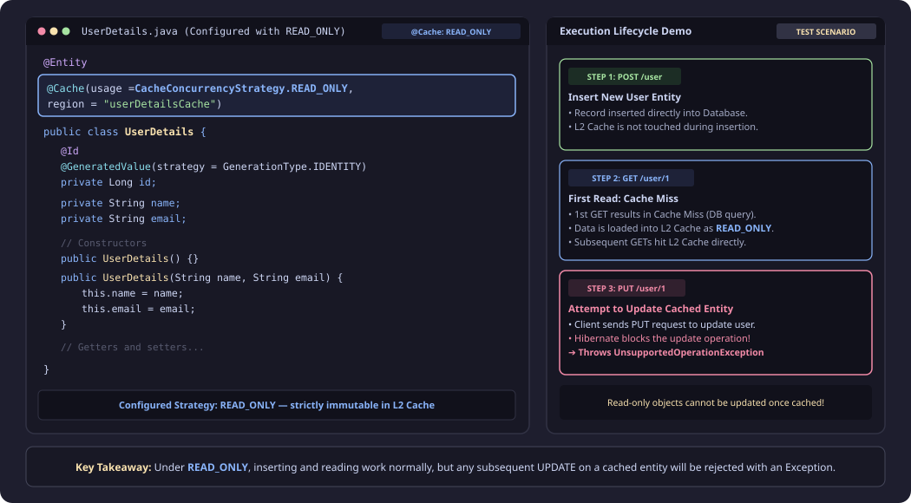

```java
@Entity
@Cache(usage = CacheConcurrencyStrategy.READ_ONLY,
        region = "userDetailsCache")
public class UserDetails {

    @Id
    @GeneratedValue(strategy = GenerationType.IDENTITY)
    private Long id;

    private String name;
    private String email;

    // Constructors
    public UserDetails() {
    }

    public UserDetails(String name, String email) {
        this.name = name;
        this.email = email;
    }

    // Getters and setters
}
```

See entity is read only!!!

1st we have inserted then we do GET — 1st cache miss so get from DB and then put in L2 cache!! Now we do PUT call!! But entity is Read Only

### READ_ONLY Error Demo

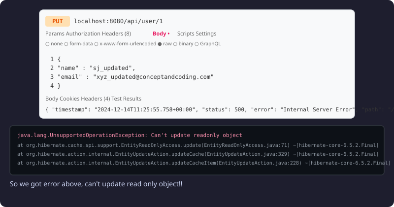

```
PUT localhost:8080/api/user/1
Body: { "name" : "sj_updated", "email" : "xyz_updated@conceptandcoding.com" }

Response: { "timestamp": "2024-12-14T11:25:55.758+00:00", "status": 500, "error": "Internal Server Error", "path": "/api/user/1" }

java.lang.UnsupportedOperationException: Can't update readonly object
    at org.hibernate.cache.spi.support.EntityReadOnlyAccess.update(EntityReadOnlyAccess.java:71)
    at org.hibernate.action.internal.EntityUpdateAction.updateCache(EntityUpdateAction.java:329)
    at org.hibernate.action.internal.EntityUpdateAction.updateCacheItem(EntityUpdateAction.java:228)
```

So we got error above, **can't update read only object**!!

---

## Strategy 2: READ_WRITE

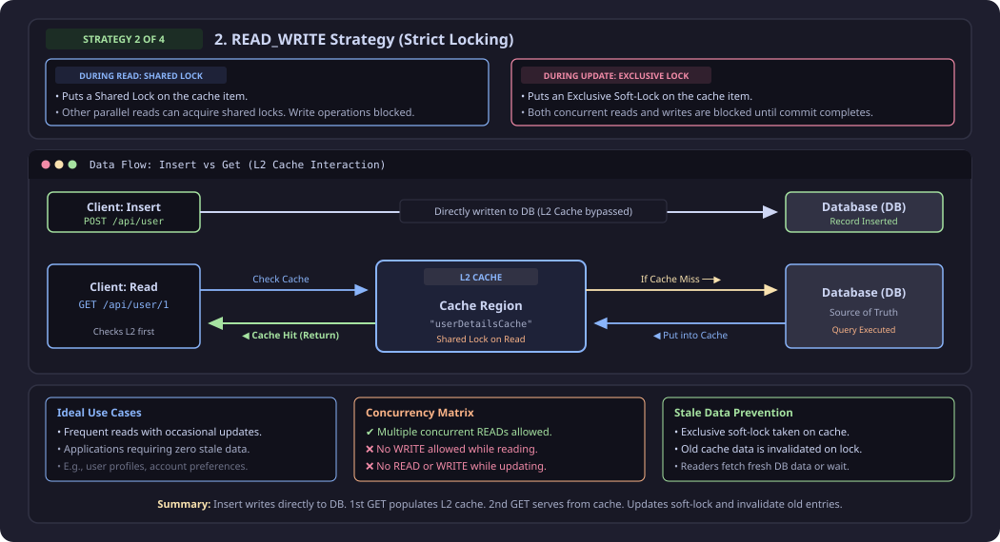

- **During Read**, it put **Shared Lock**, other Read can also acquire Shared Lock. But no Write operation.
- **During Update**, it put **Exclusive Lock**, other Read and Write operation not allowed.

1st we do insert and then do 1st get call!! Then on 2nd get call L2 cache comes into picture!! L2 cache never comes before that!!

Use cases when multiple read, write, delete!! Also we do not want stale data!!

- We can have multiple read!!
- But can't have write on read!!
- And while writing cannot read or write!!

How it makes sure it does not get stale data — Once it gets lock on cache, **it invalidates old data**!!

### READ_WRITE Update Flow

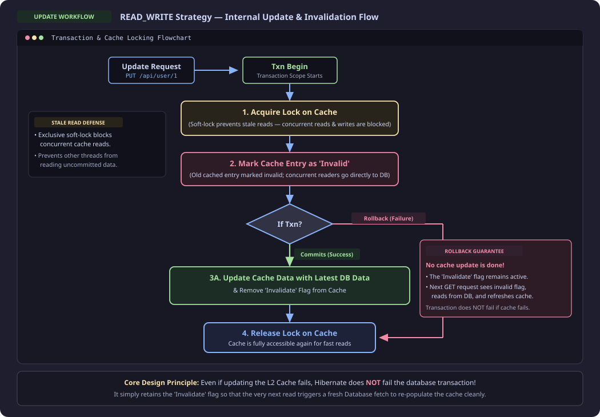

In case of rollback, no updation of cache is done!! But the invalidate flag is still not removed so whenever the next GET call or any call happens it updates the cache!!

In case not able to update the cache we are not failing Transaction!! It will not remove invalidate flag!!!

### READ_WRITE Demo — POST → GET → PUT → GET

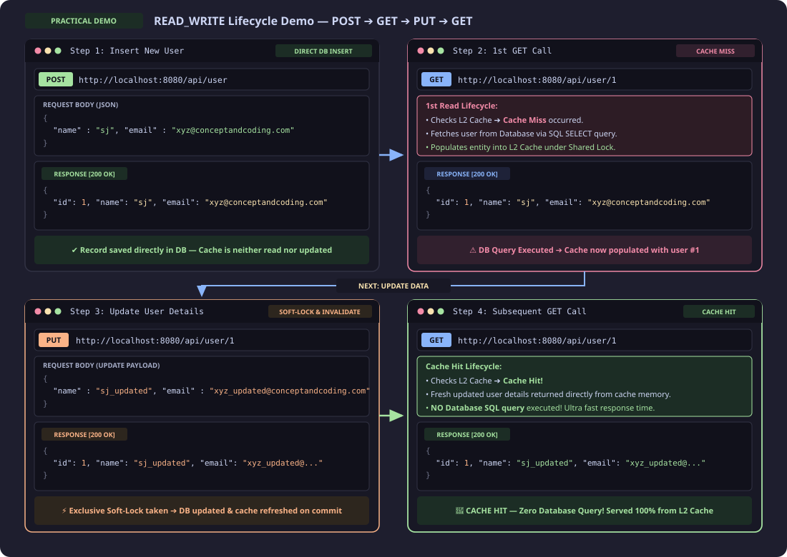

### READ_WRITE Console Logs

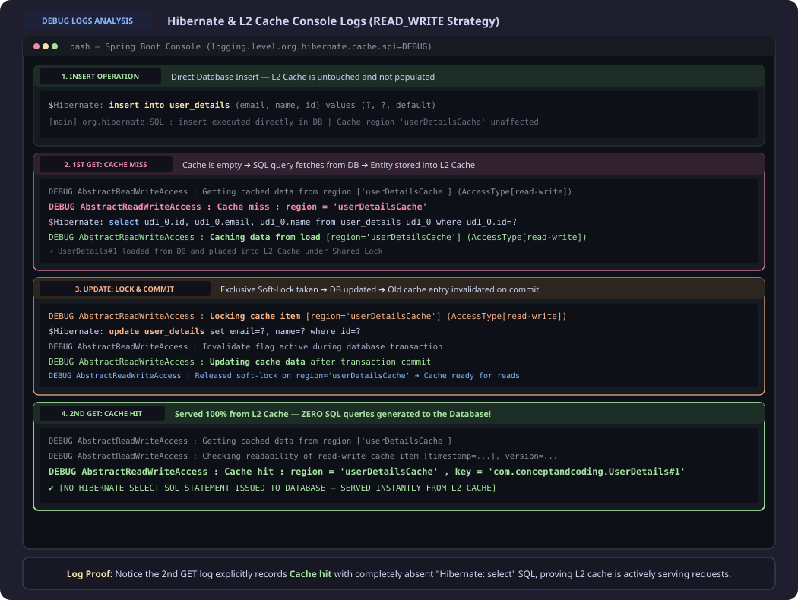

```
Hibernate: insert into user_details (email, name, id) values (?, ?, default)
─── Insert Operation (directly inserted into DB)

DEBUG AbstractReadWriteAccess : Cache miss : region = 'userDetailsCache'
Hibernate: select ud1_0.id, ud1_0.email, ud1_0.name from user_details ud1_0 where ud1_0.id=?
─── Get Operation (Cache Miss, read from DB and inserted into Cache)
DEBUG AbstractReadWriteAccess : Caching data from load [region='userDetailsCache']

Hibernate: update user_details set email=?, name=? where id=?
─── Update Operation (Cache Lock and update both DB and Cache on Success)

DEBUG AbstractReadWriteAccess : Cache hit : region = 'userDetailsCache'
─── Get Operation (Cache hit, No DB hit)
```

After 1st cache miss we get, We get the L2 cache so now on 2nd call we get no DB call!!

- On read **no locks**!!
- It means try to get lock for less time!!
- Now here no update cache on updation!! It just **invalidates** the cache!!
- If transaction rollback, it wont even invalidate!! It just release the lock!!

---

---

## Strategy 3: NONSTRICT_READ_WRITE

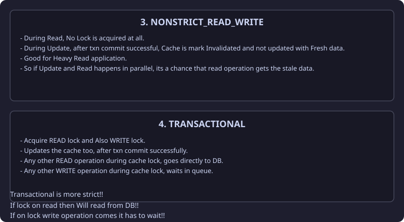

### **What is `NONSTRICT_READ_WRITE`?**
`NONSTRICT_READ_WRITE` is a **lock-free, eventual-consistency caching strategy**. It is designed for applications where **reads vastly outnumber writes (e.g. 99% reads, 1% writes)** and where the business **can tolerate reading slightly stale data for a few milliseconds** during concurrent updates.

---

### **How `NONSTRICT_READ_WRITE` Works Under the Hood:**
1. **Zero Locks on Read:** When a thread reads data, no lock of any kind is acquired. Cache lookups are instant and completely non-blocking.
2. **Zero Locks on Update:** Unlike `READ_WRITE`, Hibernate does **NOT** place a soft lock on the cache entry during an update transaction.
3. **Invalidation Happens AFTER Commit:** 
   - The transaction updates the row in the database.
   - When the transaction successfully commits, Hibernate dispatches an **asynchronous eviction (invalidate) command** to remove that entity from the L2 cache.
   - The cache is **not updated with new data** immediately; it is simply evicted so that the subsequent read will reload fresh data from the DB.

---

### **Entity Configuration Example:**

```java
@Entity
@Table(name = "blog_posts")
@Cacheable
@org.hibernate.annotations.Cache(
    usage = CacheConcurrencyStrategy.NONSTRICT_READ_WRITE, 
    region = "blogPostCache"
)
public class BlogPost {

    @Id
    @GeneratedValue(strategy = GenerationType.IDENTITY)
    private Long id;

    private String title;

    @Column(columnDefinition = "TEXT")
    private String content;

    private String author;

    // getters and setters...
}
```

---

### **⚠️ Why Can Stale Reads Happen in `NONSTRICT_READ_WRITE`? (The Race Condition)**

Because there is **no lock** during an update, look at what happens when Thread 1 updates while Thread 2 reads concurrently:

```
Timeline: Concurrent Read & Write in NONSTRICT_READ_WRITE
═════════════════════════════════════════════════════════════════════════════════

   Thread 1 (Writer: Updates Title)             Thread 2 (Reader: Gets Post)
─────────────────────────────────────       ─────────────────────────────────────
T1: BEGIN Transaction
T2: Updates DB: Title = "Spring 3.4"
    (Database row updated, but NOT committed yet)
                                            T3: Calls findById(1)
                                            T4: Checks L2 Cache ➔ HIT!
                                                👉 Returns OLD title: "Spring 3.0"
                                                ⚠️ (STALE READ OCCURRED!)
T5: Transaction COMMITS!
T6: Hibernate evicts L2 cache entry
    for BlogPost#1
                                            T7: Subsequent read calls findById(1)
                                                Cache MISS ➔ Loads "Spring 3.4" from DB!
═════════════════════════════════════════════════════════════════════════════════
```

> [!NOTE]
> **Why use it if stale reads can happen?**
> Because it is **significantly faster than `READ_WRITE`**!
> * There is **zero lock contention**.
> * Threads never have to wait in queues or bypass the cache to hit the DB during an update.
> * If a blog post, article FAQ, or product description changes once a month, reading the old title for 50 milliseconds while the author clicks "Save" has zero negative business impact!

---

## Strategy 4: TRANSACTIONAL

### **What is `TRANSACTIONAL`?**
`TRANSACTIONAL` is the **most strict, heavyweight concurrency strategy**. It is designed specifically for enterprise environments that use **JTA (Java Transaction API)** with **Distributed Transactions (XA Two-Phase Commit / 2PC)** across both the database and the cache.

---

### **How `TRANSACTIONAL` Works Under the Hood:**
1. **Cache Acts as an XA Resource:**
   In this mode, the L2 Cache is registered directly with the **JTA Transaction Manager** as a distributed transaction participant (alongside the JDBC DataSource).
2. **True Distributed Locking:**
   - When a transaction updates an entity, it acquires a **true distributed exclusive write lock** across all cluster nodes.
   - Concurrent reads during the lock either block or read under strict repeatable-read / serializable transaction isolation.
3. **Atomic Two-Phase Commit (2PC):**
   - **Phase 1 (Prepare):** The JTA Transaction Manager asks both the Database and the Cache: *"Are you both ready to commit?"*
   - **Phase 2 (Commit / Rollback):** If both say YES, both update atomically. If either the database commit OR the cache update fails, **both roll back atomically**!

```
                    ┌───────────────────────────────┐
                    │    JTA Transaction Manager    │
                    │   (Atomikos / Narayana / JTA) │
                    └───────┬───────────────┬───────┘
                            │               │
                 Phase 1    │               │ Phase 1
                 Prepare    ▼               ▼ Prepare
                   ┌────────────────┐   ┌────────────────┐
                   │    Database    │   │  L2 Cache Node │
                   │   (Postgres)   │   │  (Infinispan)  │
                   └───────┬────────┘   └───────┬────────┘
                           │                    │
                 Phase 2   │                    │ Phase 2
                 Commit    ▼                    ▼ Commit
                      [COMMITTED]          [COMMITTED]
```

---

### **Entity Configuration Example:**

```java
@Entity
@Table(name = "bank_accounts")
@Cacheable
@org.hibernate.annotations.Cache(
    usage = CacheConcurrencyStrategy.TRANSACTIONAL, 
    region = "bankAccountCache"
)
public class BankAccount {

    @Id
    private Long accountNumber;

    private BigDecimal balance;

    private String currency;

    // getters and setters...
}
```

---

### **⚠️ Critical Provider Requirement for `TRANSACTIONAL`:**
> [!IMPORTANT]
> **Standard standalone Ehcache does NOT support `TRANSACTIONAL`!**
> If you configure `CacheConcurrencyStrategy.TRANSACTIONAL` with a basic cache provider, Hibernate will throw:
> ```
> org.hibernate.cache.CacheException: Transactional access not supported by provider!
> ```
> To use `TRANSACTIONAL`, your underlying cache provider **MUST support JTA transactions** (such as **JBoss Infinispan**, **Hazelcast in Transactional Mode**, or an enterprise JCache implementation).

---

### **Trade-offs of `TRANSACTIONAL`:**
* **Pros:** Absolute data consistency, zero risk of phantom or stale reads, full atomic rollback across cache and DB.
* **Cons:** High network latency overhead due to distributed 2-Phase Commit (2PC) coordination; lower overall throughput.

---

## 🔍 **Why Are They Different & What Differently Do They Do?**

### **A Head-to-Head Concurrency Scenario Walkthrough**

To truly understand what each strategy does differently, let's observe a concrete scenario:

> **Scenario:**
> At `T=0`, Entity `User#1` has `balance = 100` stored in both DB and L2 Cache.
> At `T=1`, **Transaction 1 (Writer)** updates `balance = 200`.
> At `T=2`, **Transaction 2 (Reader)** executes `userRepository.findById(1)`.
> At `T=3`, **Transaction 1** successfully commits.

Here is exactly how all 4 strategies handle this situation differently:

```
┌──────────────────────────────┬────────────────────────────────────────────────────────────────────────┐
│ Concurrency Strategy         │ What Happens at T=2 (Concurrent Read During Update)                    │
├──────────────────────────────┼────────────────────────────────────────────────────────────────────────┤
│ 1. READ_ONLY                 │ ❌ T1 throws UnsupportedOperationException! Updates are impossible!   │
│                              │    T2 continues reading the immutable balance = 100.                   │
├──────────────────────────────┼────────────────────────────────────────────────────────────────────────┤
│ 2. READ_WRITE                │ 🔒 T1 placed a Soft Lock on User#1 in L2 Cache.                        │
│                              │    T2 checks cache, sees the Soft Lock!                                │
│                              │    👉 T2 BYPASSES L2 cache and queries DB directly (sees committed 100).│
│                              │    ❌ Stale cache read is PREVENTED!                                   │
│                              │    At T=3, T1 commits, updates/invalidates cache, releases soft lock.  │
├──────────────────────────────┼────────────────────────────────────────────────────────────────────────┤
│ 3. NONSTRICT_READ_WRITE      │ ⚡ Zero locks placed!                                                  │
│                              │    T2 checks L2 cache ➔ Cache HIT!                                      │
│                              │    👉 T2 reads OLD balance = 100 from cache (STALE READ!).              │
│                              │    At T=3, T1 commits and sends an invalidation to evict User#1.       │
│                              │    Only subsequent reads after T=3 will reload 200 from DB.            │
├──────────────────────────────┼────────────────────────────────────────────────────────────────────────┤
│ 4. TRANSACTIONAL             │ 🛡️ T1 acquired a distributed XA Write Lock on both DB and Cache.       │
│                              │    T2 WAITS in queue until T1 completes Phase 2 Commit,                │
│                              │    OR reads under strict XA repeatable-read isolation.                 │
│                              │    Both DB and Cache update atomically via Two-Phase Commit.           │
└──────────────────────────────┴────────────────────────────────────────────────────────────────────────┘
```

---

## 🎯 **Decision Guide: Which Strategy Should You Choose?**

Use this simple decision flowchart for technical interviews and production system design:

```
                              Is the Entity EVER updated?
                                     │
                    ┌────────────────┴────────────────┐
                    │ NO                              │ YES
                    ▼                                 ▼
           Use [READ_ONLY]                  Can the business tolerate
        (Highest performance,              a few milliseconds of STALE
         zero lock overhead)                data during updates?
                                                      │
                                     ┌────────────────┴────────────────┐
                                     │ YES                             │ NO
                                     ▼                                 ▼
                         Use [NONSTRICT_READ_WRITE]            Do you have a JTA / XA
                          (Lock-free, fast eviction,           distributed transaction
                           great for read-heavy blogs)         environment (2PC)?
                                                                       │
                                                      ┌────────────────┴────────────────┐
                                                      │ YES                             │ NO (Standard Spring Boot)
                                                      ▼                                 ▼
                                             Use [TRANSACTIONAL]                Use [READ_WRITE]
                                            (Requires Infinispan/              ⭐ MOST COMMON CHOICE!
                                             Hazelcast JTA provider)            (Soft-locks cache,
                                                                                 guarantees fresh reads,
                                                                                 safe for mutable entities)
```

---

# 🎯 Top Hibernate / JPA Second Level (L2) Cache Interview Questions

---

### **Category 1: Core Architecture & Fundamentals**

#### **Q1. What is the difference between First-Level (L1) and Second-Level (L2) Cache in Hibernate?**
| Feature | First-Level (L1) Cache | Second-Level (L2) Cache |
|---|---|---|
| **Scope** | **Session / Transaction** (`EntityManager` level) | **SessionFactory / Application-wide** (shared by all sessions) |
| **Default Status** | **Always ON** (Mandatory, cannot be disabled) | **Always OFF** (Optional, must configure external provider) |
| **Physical Location** | In-memory inside current Java thread/Session | In-memory / Off-heap / Distributed (Ehcache, Redis, Hazelcast) |
| **Lifetime** | Dies when transaction / session closes | Lives for the entire application lifecycle (or until TTL/eviction) |
| **What is Stored** | Live Java Entity object references | Dehydrated entity state (raw column values array) |

> **Punchy Interview Line:**
> *"L1 cache prevents repeat SQL queries within a single transaction; L2 cache prevents repeat SQL queries across different transactions and users."*

---

#### **Q2. Is L2 Cache enabled by default in Spring Boot? Why or why not?**
* **Answer:** **No, it is disabled by default.**
* **Why:**
  1. Hibernate does not bundle a caching engine by default; you must supply a provider (e.g., Ehcache, Infinispan, Hazelcast).
  2. In modern horizontally scaled microservices (multiple instances), an in-memory L2 cache can easily go out-of-sync and serve stale data unless configured in distributed/clustered mode.

---

#### **Q3. What does L2 Cache actually store in memory? Does it store the Java Entity object?**
* **Answer:** **NO, it does NOT store the Java Entity instance!**
* **Why:** Storing live entity references would break thread safety and cause concurrency corruption (e.g., Thread A mutates an entity while Thread B is reading it).
* **What it stores:** It stores a **"dehydrated" array of raw property/column values** indexed by Entity Class and Primary Key:
  ```json
  Key: User#101
  Value: ["Mohit", "mohit@example.com", "ADMIN", version: 2]
  ```
  When an entity is retrieved from L2 cache, Hibernate constructs a **brand-new Java object** in the calling session's L1 cache and populates it with the cached values.

---

#### **Q4. Why must Entities implement `java.io.Serializable` when using L2 Cache?**
* **Answer:** 
  Even though local in-memory providers like simple Ehcache can store raw arrays, L2 cache providers frequently:
  1. **Overflow to disk** when heap memory runs low.
  2. **Replicate across nodes** in a cluster / distributed cache (e.g., Hazelcast, Infinispan, Redis).
  Both disk serialization and network transmission require the cached data and composite keys to be `Serializable`.

---

### **Category 2: Entity Cache vs Collection Cache vs Query Cache**

#### **Q5. If I annotate an Entity with `@Cacheable`, are its `@OneToMany` collections also cached automatically?**
* **Answer:** **NO! This is a classic trap.**
* By default, Hibernate **only caches the direct attributes** (columns) of that entity.
* Child collections (`@OneToMany`, `@ManyToMany`) are **NOT** cached unless you explicitly put `@Cache` directly on the collection field:
  ```java
  @Entity
  @Cacheable
  public class Department {
      @Id
      private Long id;
      private String name;

      // ⚠️ Without @Cache here, accessing employees ALWAYS triggers a SQL query!
      @OneToMany(mappedBy = "department")
      @org.hibernate.annotations.Cache(usage = CacheConcurrencyStrategy.READ_WRITE)
      private List<Employee> employees = new ArrayList<>();
  }
  ```
* **What does the collection cache store?**
  It does **not** store Employee data. It stores **only the list of foreign key IDs** (e.g., `[101, 102, 103]`). To resolve those IDs into entities without hitting the DB, the `Employee` entity must **also** have its own L2 cache enabled!

---

#### **Q6. Does `userRepository.findById(1)` and `userRepository.findAll()` use L2 cache in the same way?**
* **Answer:** **NO!**
  * `findById(1)` lookups use the **Entity Cache** (keyed directly by primary key `User#1`). It hits L2 cache directly without any SQL.
  * `findAll()`, JPQL (`SELECT u FROM User u WHERE u.age > 20`), or Native queries **DO NOT use L2 cache by default!** They will always fire SQL queries to the database unless the **Query Cache** is also explicitly enabled and queried with cache hints.

---

#### **Q7. What is Hibernate Query Cache and how does it work with L2 Cache?**
* **Answer:** 
  The **Query Cache** caches the *results of specific queries* (JPQL / Criteria).
* **What it stores:**
  - Key: `(SQL/JPQL string + parameter values + pagination offsets)`
  - Value: A list of **Entity Primary Keys** only! (e.g., `[1, 5, 12, 44]`), **NOT** entity data.
* **How it interacts with L2 Cache:**
  1. Query Cache returns IDs: `[1, 5, 12]`.
  2. Hibernate looks up each ID in the **L2 Entity Cache**.
  3. If all IDs are in L2 cache: **0 SQL queries fired!**
  4. **The Dangerous Gotcha (N+1 Query Explosion):** If Query Cache is enabled, but the Entity itself is **NOT** cached in L2 cache, Hibernate executes 1 query for the IDs and then **N individual `SELECT` queries** for each ID!

---

### **Category 3: Concurrency Strategies & Locking**

#### **Q8. Explain the 4 Cache Concurrency Strategies in Hibernate. When do you use each?**

| Strategy | Read Lock? | Write Lock? | Stale Reads Possible? | Best Use Case |
|---|---|---|---|---|
| **`READ_ONLY`** | No | No | No (data never changes) | Reference/Lookup data that is never updated (e.g., Country codes, Currencies). Best performance. |
| **`READ_WRITE`** | No | Yes (Soft Lock) | No | Read-heavy entities with occasional updates where strong read-write consistency is required. Uses versioning. |
| **`NONSTRICT_READ_WRITE`** | No | No | **Yes** (temporary) | Entities where data changes infrequently and occasional stale reads are acceptable. Invalidates cache on commit. |
| **`TRANSACTIONAL`** | Yes | Yes | No | Full JTA / XA distributed transaction environments (requires JCache / Infinispan). Highest isolation, lowest throughput. |

---

#### **Q9. What is a "Soft Lock" in `READ_WRITE` strategy?**
* **Answer:** 
  In `READ_WRITE` strategy, when a transaction starts updating an entity:
  1. It places a **"soft lock"** (a marker entry) in the L2 cache for that entity ID instead of immediately deleting it.
  2. Any concurrent transaction trying to read that entity will see the soft lock and **bypass the cache to read directly from the DB** to guarantee consistency.
  3. Once the updating transaction commits successfully, the soft lock is released and the cache entry is refreshed/invalidated.

---

### **Category 4: Distributed Systems & Stale Data Pitfalls**

#### **Q10. What is the biggest danger of using Hibernate L2 Cache in a Microservices / Clustered setup?**
* **Answer:** **Cache Desynchronization (Stale Data across nodes).**
* **Scenario:**
  - You have 2 instances of `OrderService` (Instance A and Instance B), each with its own local in-memory Ehcache.
  - Instance A receives a request: `UPDATE order SET status = 'CANCELLED' WHERE id = 5`.
  - Instance A updates the DB and invalidates its **own** local L2 cache.
  - Instance B knows nothing about this update. Its local L2 cache still has `status = 'PENDING'`.
  - Next user request hits Instance B ➡️ **Serves stale data!**
* **Solutions:**
  1. Use a **Distributed Cache Provider** like **Redis** (via Redisson) or **Infinispan** in clustered/replicated mode.
  2. Use Spring's `@Cacheable` with a centralized Redis instance instead of ORM-level L2 cache.

---

#### **Q11. What happens if someone modifies the database directly using a SQL script, stored procedure, or batch job outside Hibernate?**
* **Answer:** 
  Hibernate L2 Cache **has NO WAY of knowing** that external changes occurred!
  - It will continue serving stale cached entities until:
    1. The entry expires based on TTL (Time-To-Live).
    2. An update is performed on that entity through Hibernate.
    3. The cache is manually evicted programmatically.
* **How to fix:**
  Evict the cache via code:
  ```java
  @Autowired
  private EntityManagerFactory entityManagerFactory;

  public void clearCache() {
      entityManagerFactory.getCache().evict(User.class); // Evict specific entity
      // OR
      entityManagerFactory.getCache().evictAll(); // Evict entire L2 cache
  }
  ```

---

### **Category 5: Configuration & Practical Rules of Thumb**

#### **Q12. What are the 4 values of `shared-cache-mode` in JPA? Which is recommended?**
* Configured via `spring.jpa.properties.jakarta.persistence.sharedCache.mode`:
  1. **`ENABLE_SELECTIVE` (Recommended standard):** Only entities explicitly annotated with `@Cacheable(true)` are cached.
  2. **`DISABLE_SELECTIVE`:** All entities are cached EXCEPT those marked `@Cacheable(false)`.
  3. **`ALL`:** Every entity is cached unconditionally (dangerous for memory!).
  4. **`NONE`:** L2 cache is completely disabled.

---

#### **Q13. When should you AVOID using Hibernate L2 Cache?**
* **Avoid L2 cache when:**
  1. **Write-Heavy tables:** If updates/inserts are frequent, cache churn and continuous invalidations create more CPU/lock overhead than reading from DB.
  2. **Tables with high volume of rows accessed randomly:** Causes frequent cache misses and high memory thrashing.
  3. **Data modified by external systems / raw JDBC:** High risk of persistent stale data.
  4. **Multi-node deployments without a distributed cache:** Leads to cross-instance data inconsistency.

---

#### **Q14. Rapid-Fire Summary: When is L2 Cache the PERFECT fit?**
1. Read-to-write ratio is high (**80%+ reads, 20% or fewer writes**).
2. Lookups are frequently done by **Primary Key (`findById`)**.
3. Small to medium-sized reference datasets (Countries, Plans, Categories, Configurations, Roles).
4. Predictable data access patterns where DB query offloading is critical.

