# JPA @OneToOne Mapping

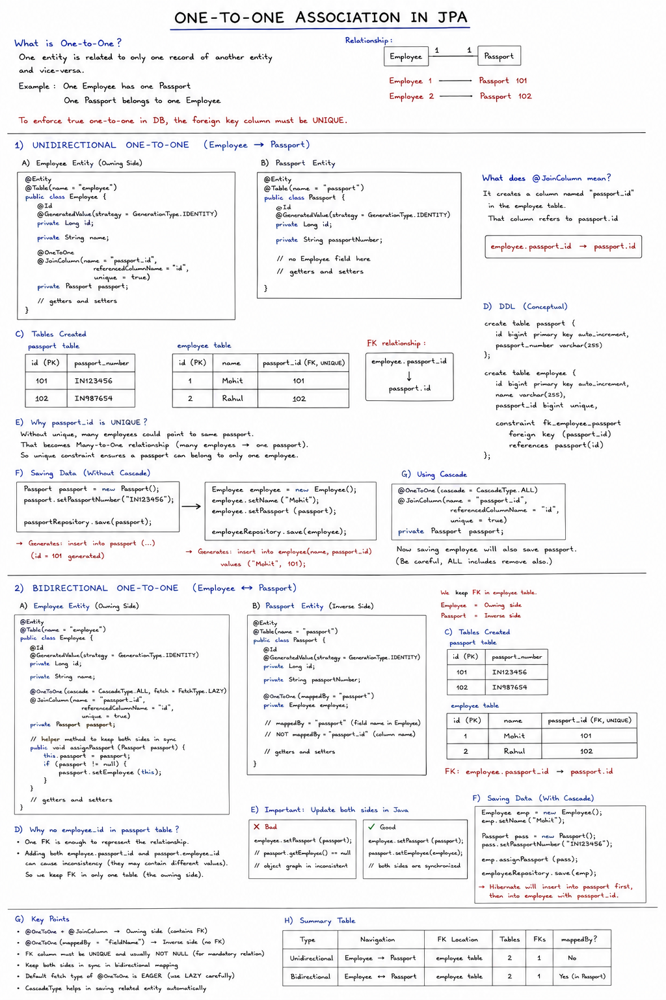

## Unidirectional Mapping

One entity (A) references only one instance of another entity (B), but the reference exists only in one direction — from Parent (A) to Child (B). Example: `UserDetails` (parent) has a `UserAddress` (child). One user can have one address, but from address you cannot get back to userDetails — hence unidirectional.

```java
@Table(name = "user_details")
@Entity
public class UserDetails {

    @Id
    @GeneratedValue(strategy = GenerationType.IDENTITY)
    private Long id;
    private String name;
    private String phone;

    @OneToOne(cascade = CascadeType.ALL)
    private UserAddress userAddress;

    // constructors, getters and setters
}
```

```java
@Entity
@Table(name = "user_address")
public class UserAddress {

    @Id
    @GeneratedValue(strategy = GenerationType.IDENTITY)
    private Long id;

    private String street;
    private String city;
    private String state;
    private String country;
    private String pinCode;

    // constructors, getters and setters
}
```

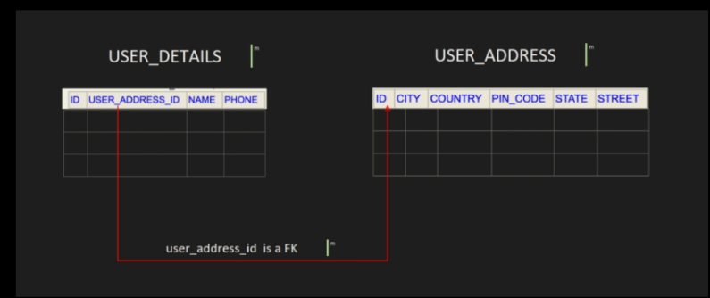

The `@OneToOne` annotation is placed on the foreign key side. By default, hibernate creates the FK column in the owning table as `<field_name>_id` — here it created `user_address_id` in `USER_DETAILS`, and it chooses the primary key of the other table to join on.

### Controlling the FK with @JoinColumn

If you want more control (custom column name, or join by a column other than the PK), use `@JoinColumn`:

```java
@OneToOne(cascade = CascadeType.ALL)
@JoinColumn(name = "address_id", referencedColumnName = "id")
private UserAddress userAddress;
```

This tells hibernate to name the FK column `address_id` in `UserDetails`, and to join it against the `id` column of `UserAddress`.

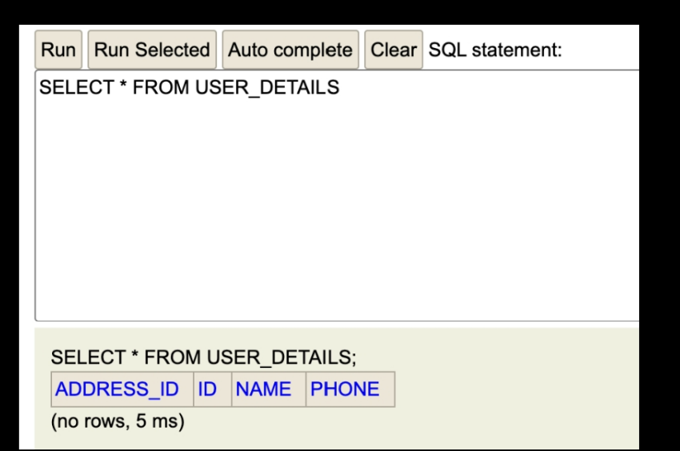

### Referencing a Composite Key

If the child entity has a composite key, use `@JoinColumns` and map every column that makes up the key:

```java
@OneToOne(cascade = CascadeType.ALL)
@JoinColumns({
        @JoinColumn(name = "address_street", referencedColumnName = "street"),
        @JoinColumn(name = "address_pin_code", referencedColumnName = "pinCode")
})
private UserAddress userAddress;
```

The composite key on the child side is defined with `@EmbeddedId`:

```java
@Entity
@Table(name = "user_address")
public class UserAddress {

    @EmbeddedId
    private UserAddressCK id;

    private String city;
    private String state;
    private String country;

    // getters and setters
}
```

```java
@Embeddable
public class UserAddressCK {
    private String street;
    private String pinCode;

    // getters and setters
}
```
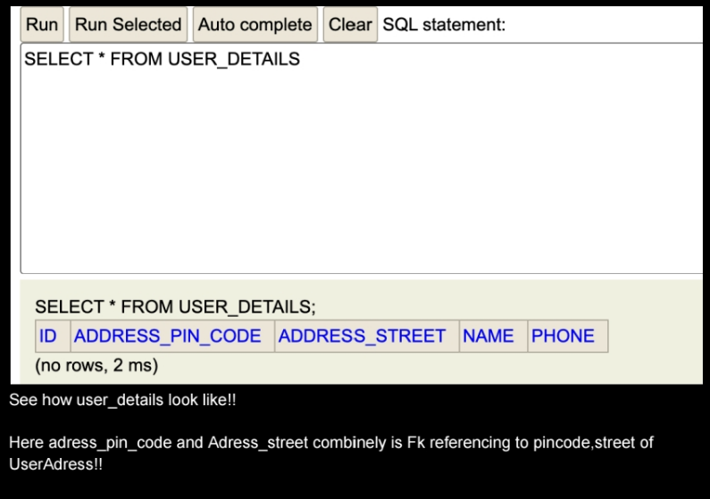

Here, `address_pin_code` and `address_street` together in `UserDetails` are the FK columns referencing `pinCode` and `street` (the composite key) in `UserAddress`.

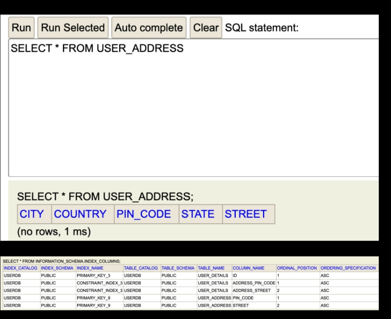

Basic Spring Boot layers used throughout (controller → service → repository) look like:

```java
@RestController
@RequestMapping(value = "/api/")
public class UserController {

    @Autowired
    UserDetailsService userDetailsService;

    @PostMapping(path = "/user")
    public UserDetails insertUser(@RequestBody UserDetails userDetails) {
        return userDetailsService.saveUser(userDetails);
    }
}
```

```java
@Service
public class UserDetailsService {

    @Autowired
    UserDetailsRepository userDetailsRepository;

    public UserDetails saveUser(UserDetails user) {
        return userDetailsRepository.save(user);
    }
}
```

```java
@Repository
public interface UserDetailsRepository extends JpaRepository<UserDetails, Long> {
}
```

Inserting a `UserDetails` object that contains a nested `userAddress` object saves both rows and the response contains the IDs of both the parent and child or not depends on cascade type.

## CascadeType

Existence of the child depends on the parent: if the parent is created, the child should be created; if the parent is updated, the child should be updated; if the parent is deleted, the child should be deleted. Without a CascadeType, any operation on the parent does not affect the child entity — managing child entities explicitly this way is error-prone. CascadeType tells JPA how operations on the parent should propagate to the child. Options: `ALL`, `PERSIST`, `MERGE`, `REMOVE`, `REFRESH`, `DETACH`.

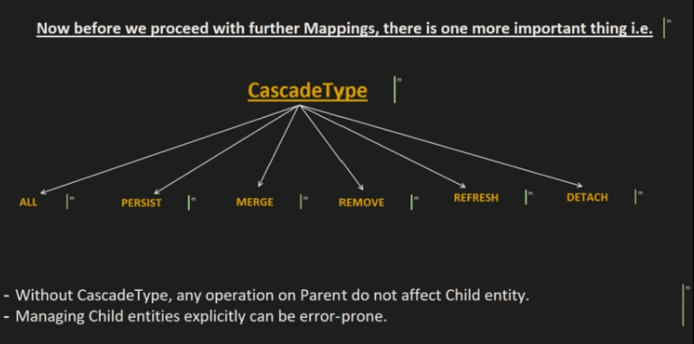

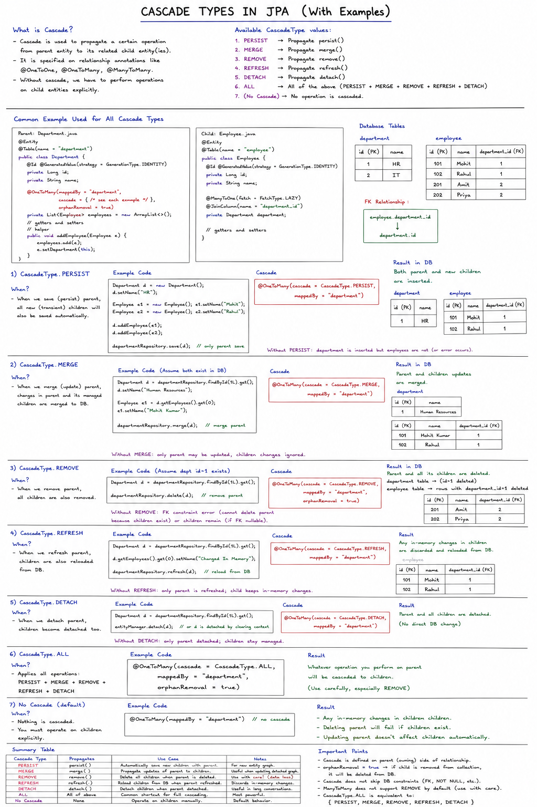

### CascadeType.PERSIST

Persisting/inserting the parent entity automatically persists its associated child entity too. If you insert the parent, the child gets inserted along with it. It does **not** help with updates — if both parent and child are changed and saved, only the parent's changes get reflected in the DB; the child stays as-is.

  
  
  
  
  

### CascadeType.MERGE

Updating the parent entity automatically updates its associated child entity data too. To get both insert and update capability you need both `PERSIST` and `MERGE` together:

```java
@OneToOne(cascade = {CascadeType.PERSIST, CascadeType.MERGE})
```

Let see If we only use Persist first 

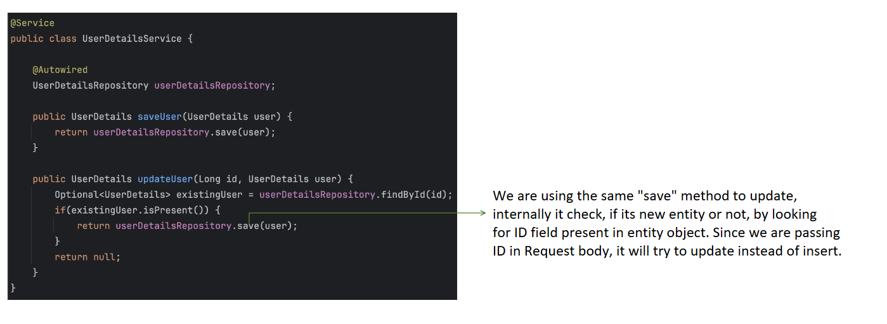

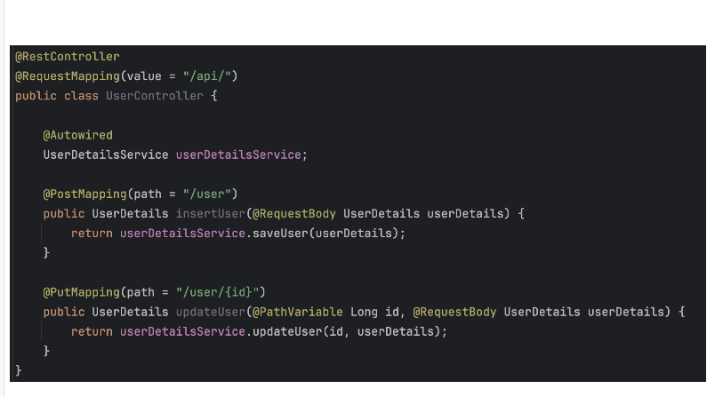

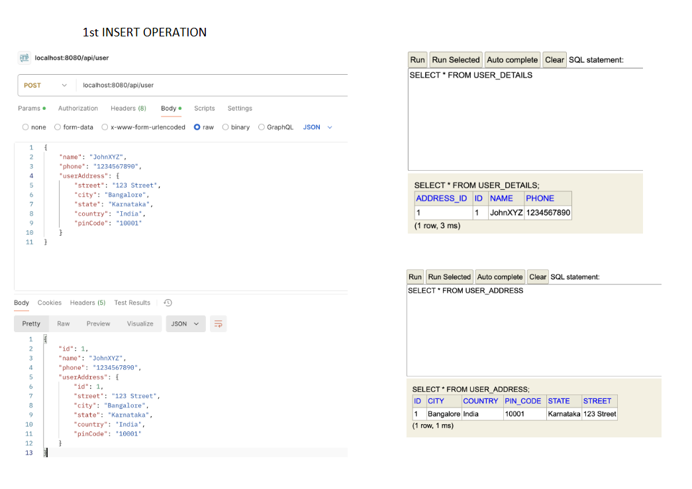

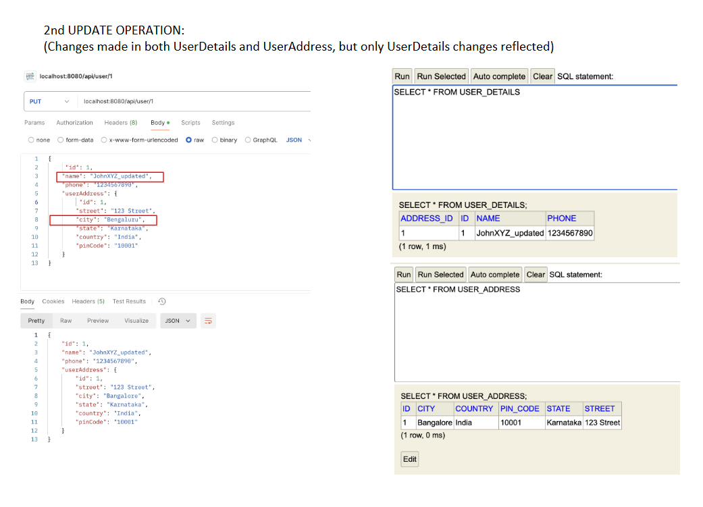

Internally, Spring Data JPA's generic `save()` method (in `SimpleJpaRepository`) checks if the entity is new: if new, it calls `entityManager.persist(entity)`; otherwise it calls `entityManager.merge(entity)`. This is why the same `save()` method is reused for both insert and update in the service layer — whether an ID is present in the request body determines which path is taken.

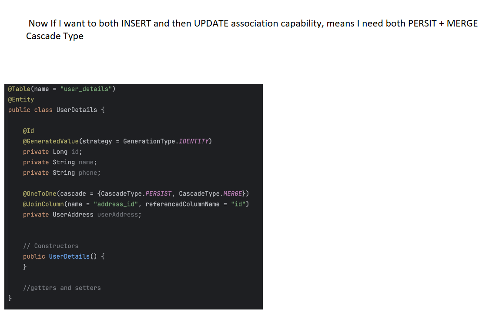

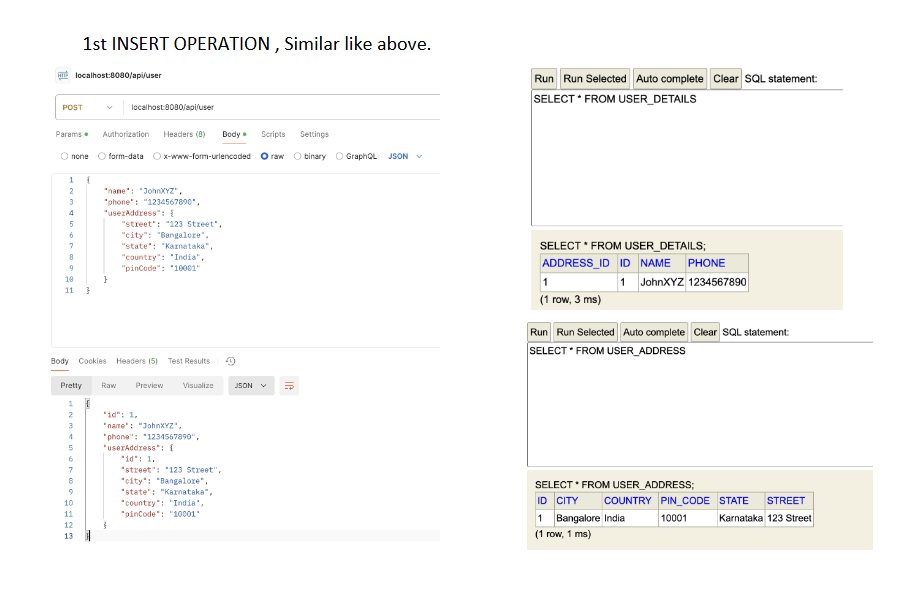

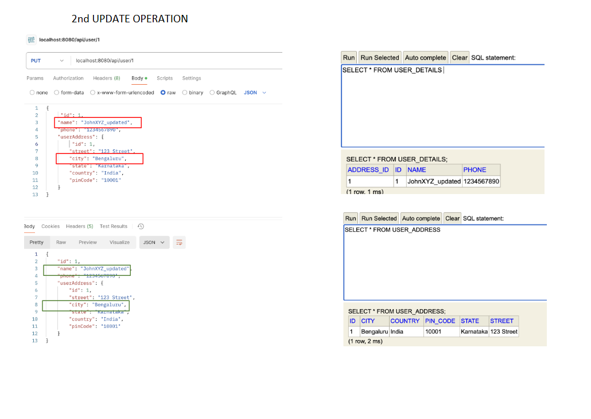

### CascadeType.REMOVE

Deleting the parent entity automatically deletes its associated child entity data too — both rows get removed from their respective tables.

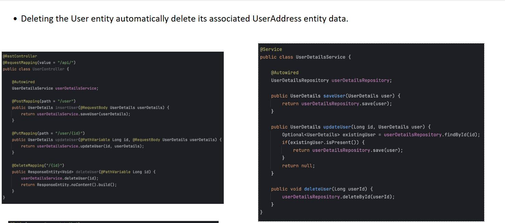

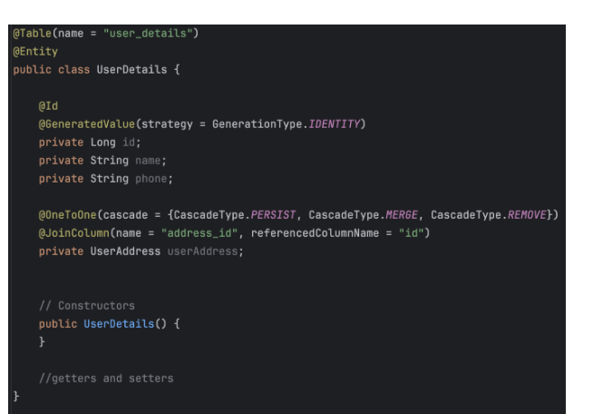

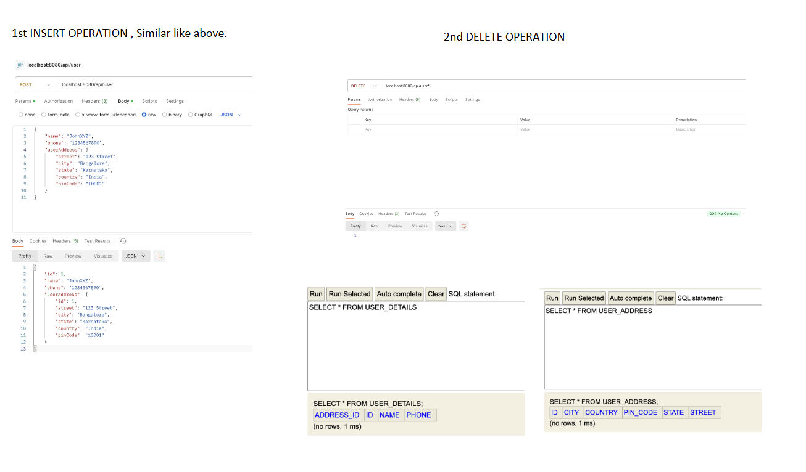


### First Level Cache and CascadeType.REFRESH

Internally, JPA has access to an `EntityManager` object which maintains the persistence context, and this is what implements first level caching. Sometimes we want to bypass the first level cache — `EntityManager` has a `refresh()` method for this: for a given entity it reads the value directly from the DB instead of the first level cache.

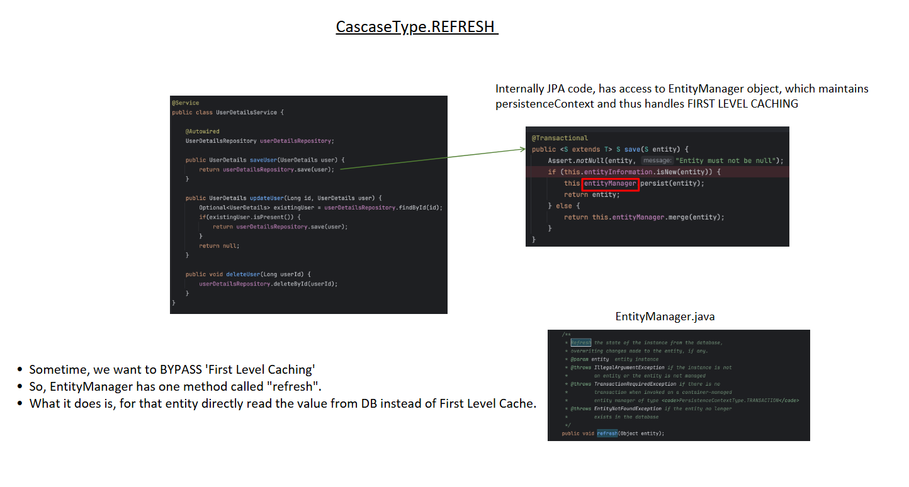

When we use `CascadeType.REFRESH`, we tell JPA to not only re-read the parent entity from the DB but also its associated child entities. So on `UserDetails`, when `entityManager.refresh()` is invoked, it also makes sure `UserAddress` is read fresh from the DB rather than the cache. This option is rarely used in practice.

### CascadeType.DETACH

Similar to persist/remove/refresh, `EntityManager` also has a `detach()` method, whose purpose is to remove the given entity from the persistence context — meaning JPA is no longer managing its lifecycle.

When we use `CascadeType.DETACH`, we tell JPA to detach not only the parent entity from the persistence context but also its associated child entities. So detaching `UserDetails` also detaches `UserAddress` from the persistence context.

### CascadeType.ALL

Means we want all the different cascade capabilities together: `PERSIST`, `MERGE`, `REMOVE`, `REFRESH` and `DETACH`.

## Eager vs Lazy Loading

Given INSERT, UPDATE, and REMOVE are covered by cascading, the next question is about GET: does the child entity always get loaded along with the parent entity?

- **Eager Loading** — the associated entity is loaded immediately along with the parent entity. This is the default for `@OneToOne` and `@ManyToOne`.

- **Lazy Loading** — the associated entity is NOT loaded immediately; it's only loaded when explicitly accessed (e.g. calling `userDetail.getUserAddress()`). This is the default for `@OneToMany` and `@ManyToMany`.

Reasoning: any entity associated as "many" defaults to lazy loading, since loading many rows alongside the parent when not needed would be overhead. Any entity associated as "one" defaults to eager loading, since a single row is cheap to load. Eager loading is implemented internally with a left join; lazy loading, when the child is explicitly accessed, also triggers a left join at that point to fetch the child data.

You can override the default fetch behavior explicitly:

```java
@OneToOne(cascade = CascadeType.ALL, fetch = FetchType.LAZY)
@JoinColumn(name = "address_id", referencedColumnName = "id")
private UserAddress userAddress;
```

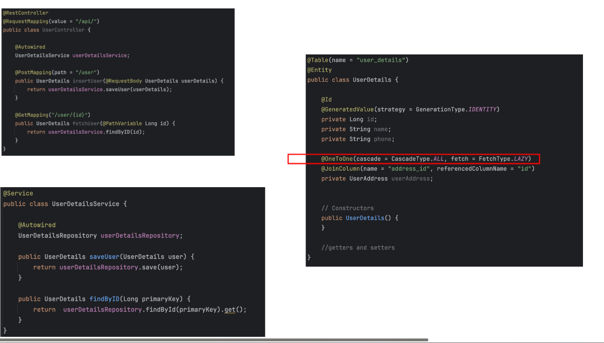

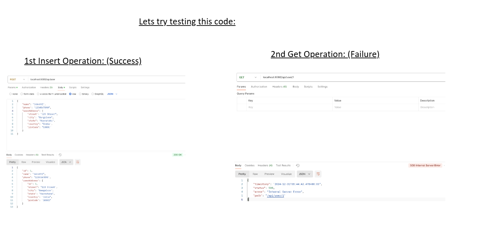


### The Lazy-Loading GET Problem

Making the mapping lazy and then calling a GET endpoint that returns the parent entity directly fails with a 500 error:

```
com.fasterxml.jackson.databind.exc.InvalidDefinitionException:
No serializer found for class org.hibernate.proxy.pojo.bytebuddy.ByteBuddyInterceptor
```

This happens because with lazy loading, `UserAddress` data is not actually loaded — Hibernate substitutes a lazy proxy object. When Jackson tries to build the JSON response it doesn't know how to serialize this proxy, so it fails.

Note: this issue does not appear during INSERT, because during insert the data is written to the DB and also placed into the persistence context (first level cache) — so when the response is built for that same operation, no separate DB call/proxy is involved; it's fetched from the persistence context directly.

### Solving the GET Problem

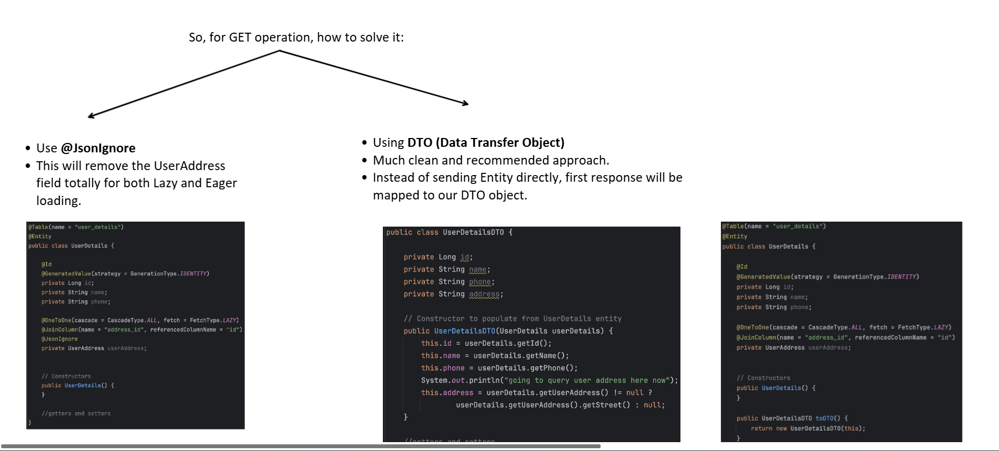

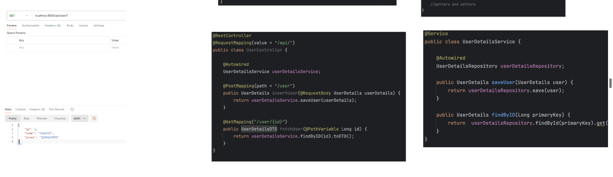

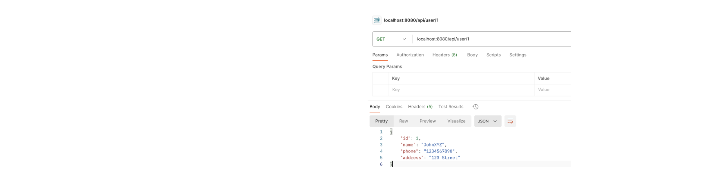

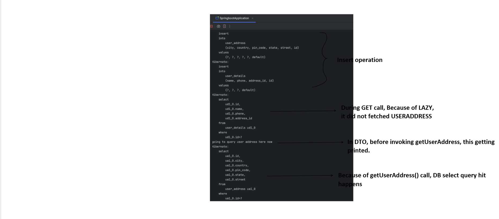

Two approaches:

1. **`@JsonIgnore`** — removes the `UserAddress` field entirely from the JSON response, for both lazy and eager loading. Simple, but the client never gets any address information from this endpoint.

2. **DTO (Data Transfer Object)** — the cleaner, recommended approach. Instead of sending the entity directly, the response is first mapped to a DTO object. We should only expose what the client actually needs — never the whole table structure.

```java
public class UserDetailsDTO {
    private Long id;
    private String name;
    private String phone;
    private String address;

    // Constructor to populate from UserDetails entity
    public UserDetailsDTO(UserDetails userDetails) {
        this.id = userDetails.getId();
        this.name = userDetails.getName();
        this.phone = userDetails.getPhone();
        this.address = userDetails.getUserAddress() != null
                ? userDetails.getUserAddress().getStreet() : null;
    }

    // getters and setters
}
```

```java
@OneToOne(cascade = CascadeType.ALL, fetch = FetchType.LAZY)
@JoinColumn(name = "address_id", referencedColumnName = "id")
private UserAddress userAddress;

public UserDetailsDTO toDTO() {
    return new UserDetailsDTO(this);
}
```

```java
@GetMapping("/user/{id}")
public UserDetailsDTO fetchUser(@PathVariable Long id) {
    return userDetailsService.findByID(id).toDTO();
}
```

With lazy loading, the address ID starts out as `null` on first fetch of the parent; it's only when `toDTO()` explicitly calls `getUserAddress()` that Hibernate issues the extra query to fetch the address data for that ID.

## @OneToOne Bidirectional

Both entities hold a reference to each other:
- `UserDetails` has a reference to `UserAddress` (the **owner side** — this holds the foreign key relationship in the table).
- `UserAddress` also has a reference back to `UserDetails`, but only in the object model, not in the DB table (the **inverse side** — no foreign key is created in the table; it only holds an object reference to the owning entity).

The table structure does not change at all compared to unidirectional mapping — the inverse side has no FK to the owner side; the child only has a reference to the parent in the Java object, not in the table.

```java
@Table(name = "user_details")
@Entity
public class UserDetails {
    // ... fields
    @OneToOne(cascade = CascadeType.ALL)
    @JoinColumn(name = "address_id", referencedColumnName = "id")
    private UserAddress userAddress;
}
```

```java
@Entity
@Table(name = "user_address")
public class UserAddress {
    // ... fields
    @OneToOne(mappedBy = "userAddress", fetch = FetchType.EAGER)
    private UserDetails userDetails;
}
```

In `UserAddress`, `mappedBy = "userAddress"` tells JPA to hold the reference to `UserDetails` without creating any FK column of its own.

This gives us the capability to go backward from `UserAddress` to `UserDetails` too — you can create a controller/service to query the `UserAddress` entity and reach the parent from it.

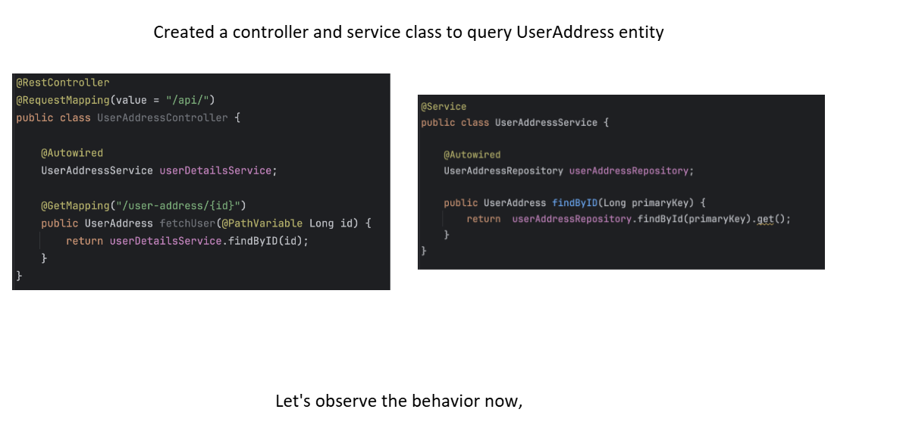

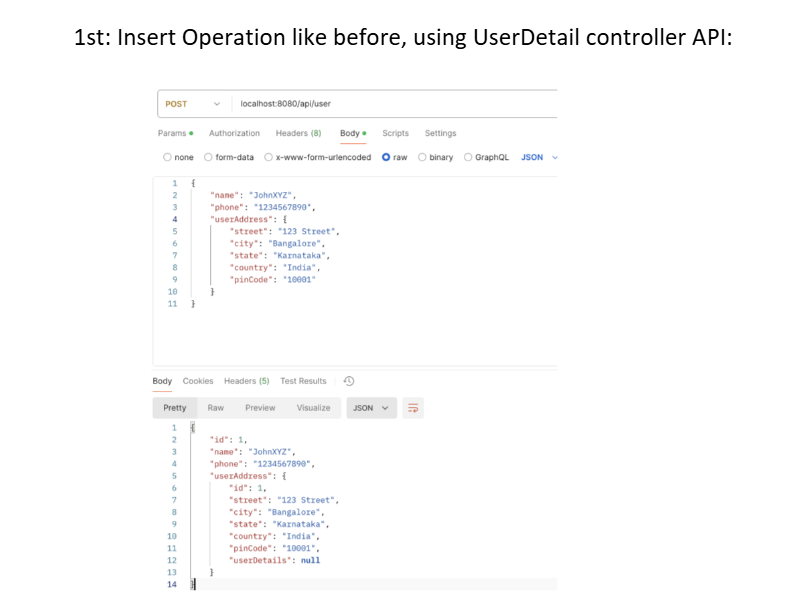
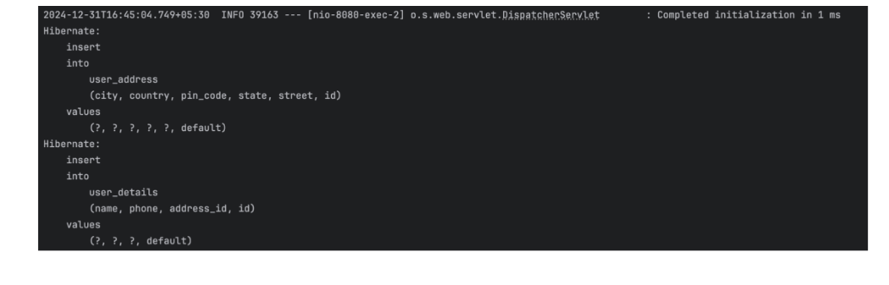

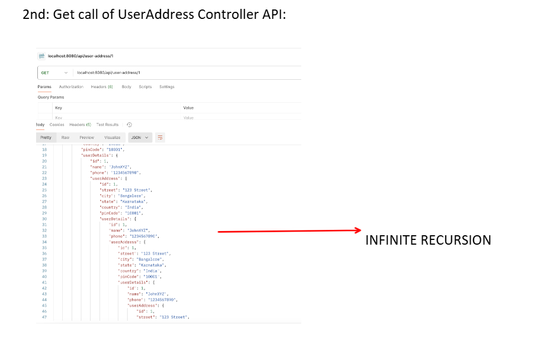

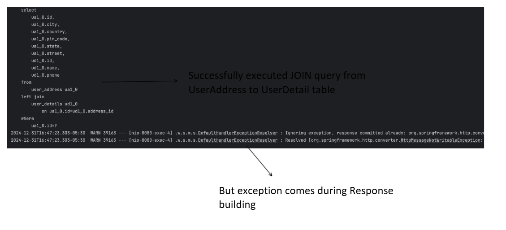

### Infinite Recursion Problem

Once bidirectional, a GET call on the child (`UserAddress`) that joins back to the parent succeeds at the DB/JOIN level, but throws an exception while building the JSON response:

```
org.springframework.http.converter.HttpMessageNotWritableException
```

Why: during response construction —
1. Jackson starts serializing `UserAddress`.
2. It encounters `UserDetails` inside `UserAddress` and starts serializing that.
3. Inside `UserDetails`, it encounters `UserAddress` again — and serialization keeps looping infinitely.

### Solving Infinite Recursion

**Option 1: `@JsonManagedReference` and `@JsonBackReference`** (must be used together)

- `@JsonManagedReference` — used only on the owning entity's reference; tells Jackson to go ahead and serialize the child entity.
- `@JsonBackReference` — used only on the inverse/child entity's reference; tells Jackson to skip serializing the parent entity (breaks the loop).

```java
@OneToOne(cascade = CascadeType.ALL)
@JoinColumn(name = "address_id", referencedColumnName = "id")
@JsonManagedReference
private UserAddress userAddress;
```

```java
@OneToOne(mappedBy = "userAddress", fetch = FetchType.EAGER)
@JsonBackReference
private UserDetails userDetails;
```

Downside: with this, calling GET on the parent (`UserDetails`) still returns the child's data, but calling GET on the child (`UserAddress`) will no longer include the parent's data at all, since it's explicitly excluded.

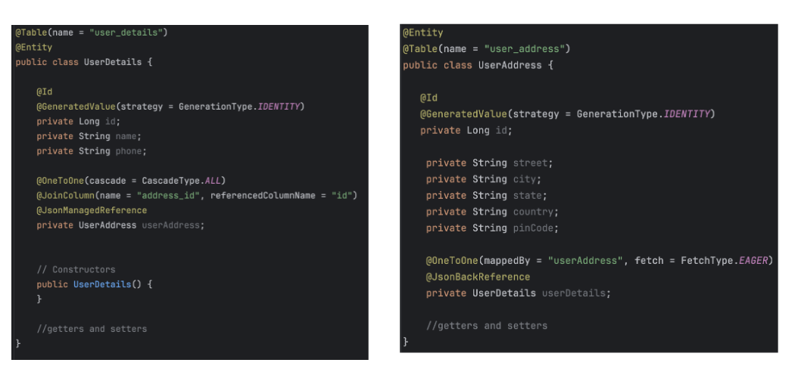
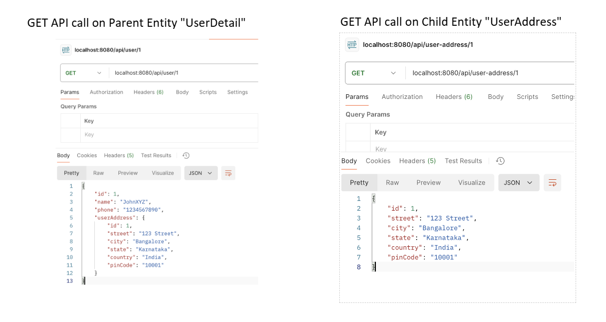


**Option 2: `@JsonIdentityInfo`** — lets you load the associated entity from both sides while still avoiding infinite recursion.

During serialization, Jackson assigns a unique ID to the entity (based on a chosen property field). Once an entity with that ID has already been serialized once, Jackson recognizes it and skips re-serializing it in full — instead it just prints the ID reference.

```java
@Table(name = "user_details")
@Entity
@JsonIdentityInfo(
        generator = ObjectIdGenerators.PropertyGenerator.class,
        property = "id"
)
public class UserDetails {
    // ...
    @OneToOne(cascade = CascadeType.ALL)
    @JoinColumn(name = "address_id", referencedColumnName = "id")
    private UserAddress userAddress;
}
```

```java
@Entity
@Table(name = "user_address")
@JsonIdentityInfo(
        generator = ObjectIdGenerators.PropertyGenerator.class,
        property = "id"
)
public class UserAddress {
    // ...
    @OneToOne(mappedBy = "userAddress", fetch = FetchType.EAGER)
    private UserDetails userDetails;
}
```

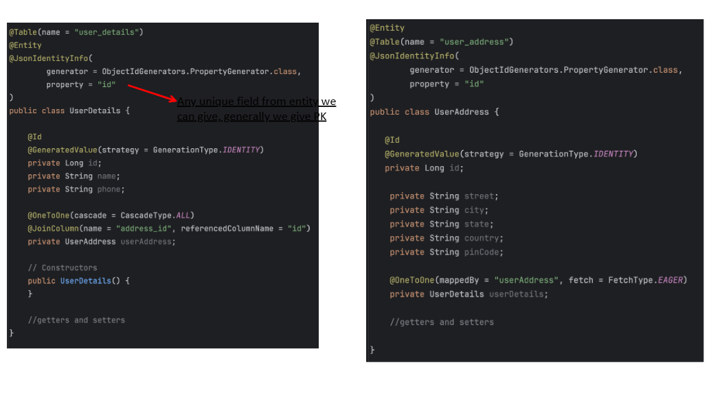

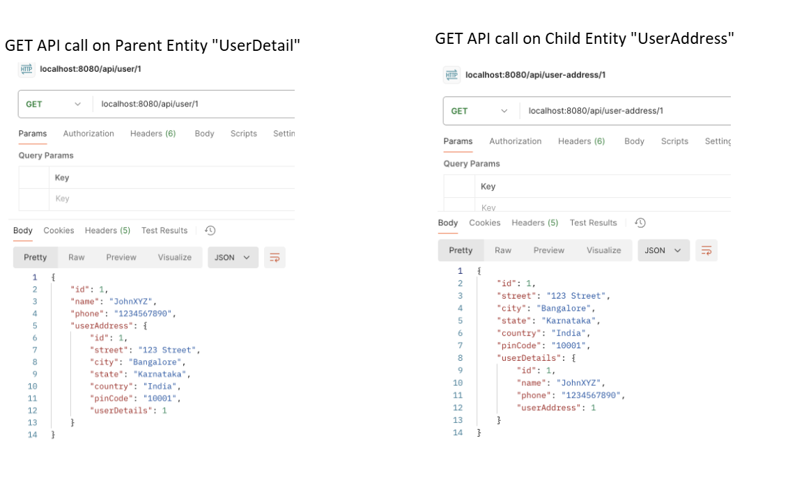

Any unique field from the entity can be used — generally the primary key is used, as shown above (`property = "id"`).

With this, there's no need for `@JsonManagedReference`/`@JsonBackReference` at all. A GET on the parent (`/api/user/1`) returns the full nested `userAddress` object, and inside it `userDetails` is collapsed to just the ID (e.g. `"userDetails": 1`) instead of looping. Likewise, a GET on the child (`/api/user-address/1`) returns the full nested `userDetails` object, with `userAddress` inside it collapsed to just its ID — both directions work without infinite recursion.
