# JPA @OneToMany and @ManyToMany Mapping

## One-to-Many: Unidirectional

One entity is associated with multiple records in another entity — for example, a `User` can have many `Orders`. The reference exists only in one direction, from parent to child. Since it's 1:many, a single parent row cannot store multiple child IDs, so by default JPA creates a brand new join table to store the mapping. By default this relationship is lazy loaded — when the parent is queried, the child rows are not fetched.

```java
@Table(name = "user_details")
@Entity
public class UserDetails {

    @Id
    @GeneratedValue(strategy = GenerationType.IDENTITY)
    private Long id;
    private String name;
    private String phone;

    @OneToMany(cascade = CascadeType.ALL)
    private List<OrderDetails> orderDetails = new ArrayList<>();

    // constructors, getters and setters
}
```

```java
@Table(name = "order_details")
@Entity
public class OrderDetails {

    @Id
    @GeneratedValue(strategy = GenerationType.IDENTITY)
    private Long id;

    private String productName;

    // getters and setters
}
```

With just `@OneToMany`, hibernate creates an extra join table (e.g. `USER_DETAILS_ORDER_DETAILS` with columns `ORDER_DETAILS_ID` and `USER_DETAILS_ID`) to hold the mapping — this is usually not what we want.

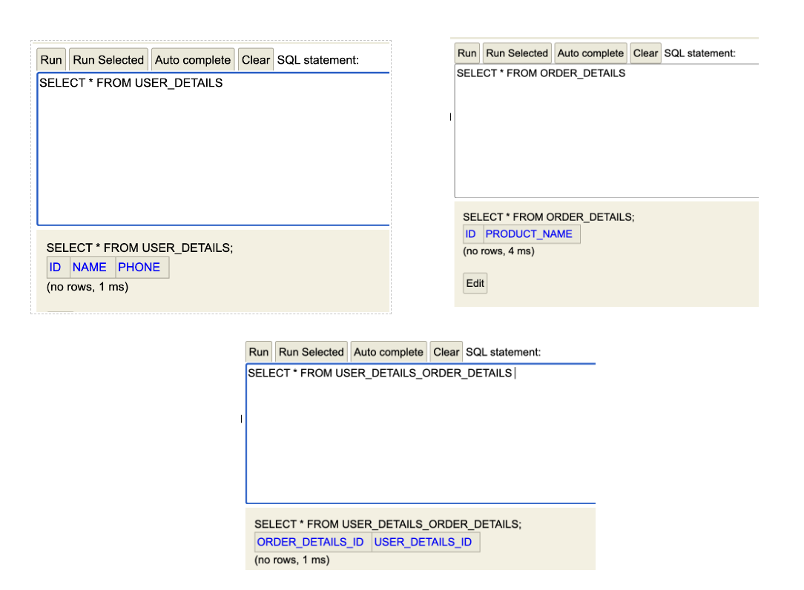

### Avoiding the Extra Join Table with @JoinColumn

If we don't want a new table, `@JoinColumn` tells JPA to store the FK directly in the child table instead:

```java
@OneToMany(cascade = CascadeType.ALL)
@JoinColumn(name = "user_id_fk", referencedColumnName = "userId")
private List<OrderDetails> orderDetails = new ArrayList<>();
```
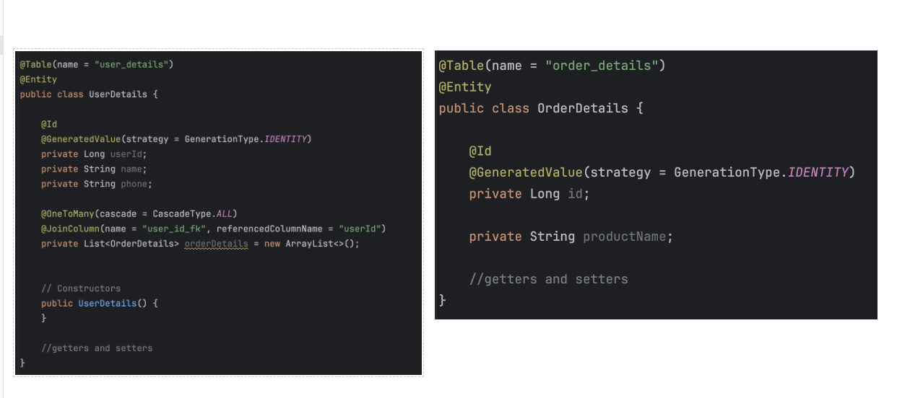

Here, `OrderDetails` (the child) ends up holding the foreign key — in 1:1 the FK sits on the parent, but in 1:many the FK must sit on the child, since one parent is associated with many children and a parent row can't hold multiple child references. `name` is the FK column name to create in the child table; `referencedColumnName` is which column of the parent that FK should point to.

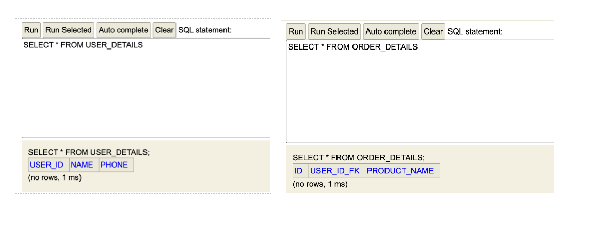

Basic layers used throughout:

```java
@Service
public class UserDetailsService {

    @Autowired
    UserDetailsRepository userDetailsRepository;

    public UserDetails saveUser(UserDetails user) {
        return userDetailsRepository.save(user);
    }

    public UserDetails findByID(Long primaryKey) {
        return userDetailsRepository.findById(primaryKey).get();
    }
}
```

Inserting a `UserDetails` with a nested list of `orderDetails` inserts both the parent row and every child row, each child row carrying the FK back to the parent.

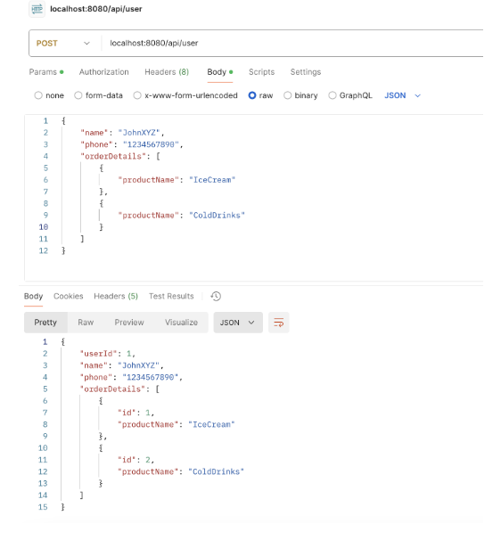

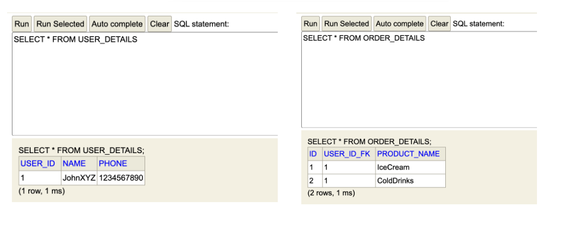

### The Lazy-Loading GET Problem (again)

Same issue as with `@OneToOne`: calling GET directly on the parent entity with lazy loading returns a proxy Jackson can't serialize. The fix is the same — map to a DTO:

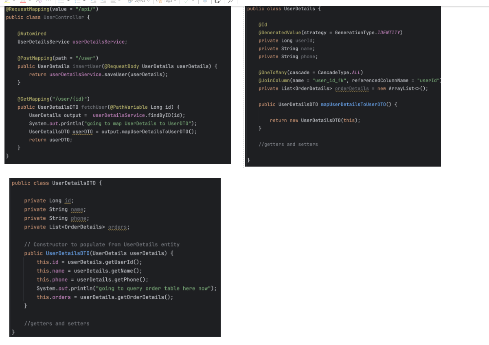

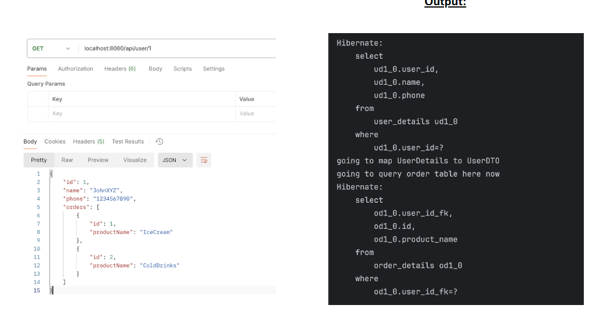

```java
public class UserDetailsDTO {
    private Long id;
    private String name;
    private String phone;
    private List<OrderDetails> orders;

    public UserDetailsDTO(UserDetails userDetails) {
        this.id = userDetails.getUserId();
        this.name = userDetails.getName();
        this.phone = userDetails.getPhone();
        this.orders = userDetails.getOrderDetails();
    }

    // getters and setters
}
```

```java
public UserDetailsDTO mapUserDetailsToUserDTO() {
    return new UserDetailsDTO(this);
}
```

```java
@GetMapping("/user/{id}")
public UserDetailsDTO fetchUser(@PathVariable Long id) {
    UserDetails output = userDetailsService.findByID(id);
    UserDetailsDTO userDTO = output.mapUserDetailsToUserDTO();
    return userDTO;
}
```

With lazy fetch, only the parent row is queried first; the child rows are only queried once the DTO mapping explicitly calls the getter for the order list. With `fetch = FetchType.EAGER` there's no need for a DTO at all — Hibernate performs a single left join query fetching parent and children together, and the entity can be returned directly from the controller.

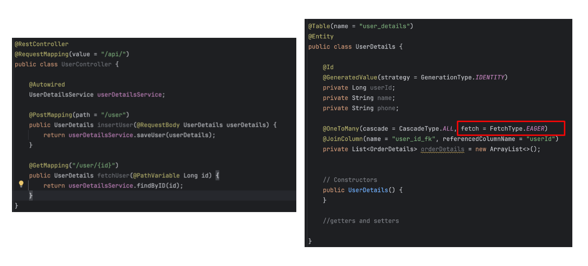

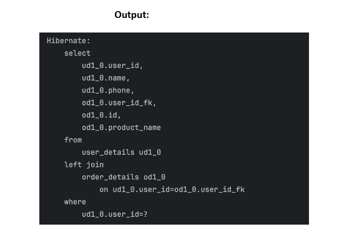

## CascadeType and Orphan Removal

| Cascade Type | Impact |
|---|---|
| `CascadeType.PERSIST` | Saving the parent (User) also saves the related children (Orders). |
| `CascadeType.MERGE` | Updating the parent also updates the children. |
| `CascadeType.REMOVE` | Deleting the parent also deletes the children. |
| `CascadeType.ALL` | Includes all cascade operations. |

**Orphan Removal**: automatically removes a child entry when that child is removed from the parent's collection.

With 1:many, suppose a user `u1` has 4 orders `o1, o2, o3, o4`. If you remove `o4` from the in-memory list and call `save()`, `u1` itself is not deleted, and `o4` is not deleted either — its FK is simply set to null. This leaves `o4` in the `order_details` table with no parent associated with it — this is called an **orphan record**: a record in the child table whose parent reference is gone.

By default, `orphanRemoval` is `false`:

```java
@OneToMany(cascade = CascadeType.ALL, orphanRemoval = false)
@JoinColumn(name = "user_id_fk", referencedColumnName = "userId")
private List<OrderDetails> orderDetails = new ArrayList<>();
```
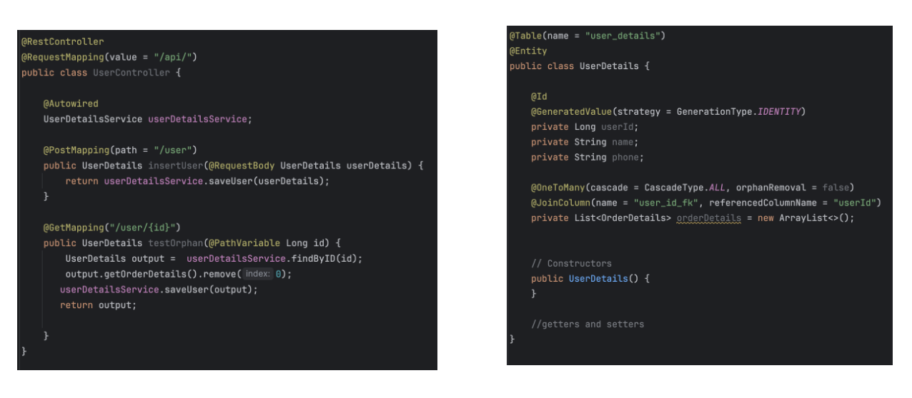

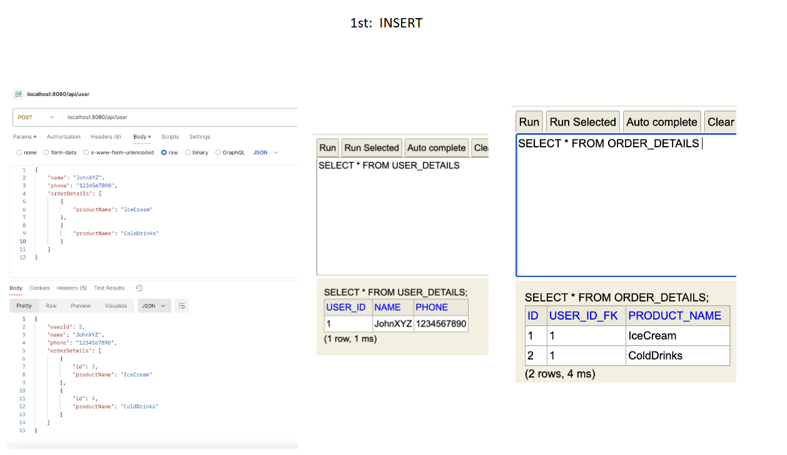

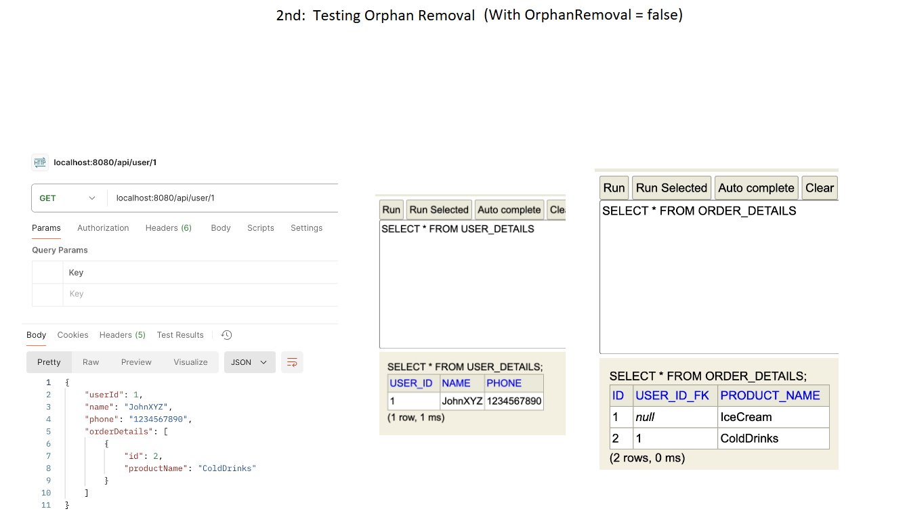

Internally (persistence context is aware of everything in memory), removing a child from the list and saving triggers just an UPDATE that nulls the child's FK — the child row itself is never deleted:

```sql
update order_details set user_id_fk = null where user_id_fk = ? and id = ?
```

Setting `orphanRemoval = true` instead makes JPA actually delete that orphaned child row from the DB (first nulling the FK, then issuing a delete):

```java
@OneToMany(cascade = CascadeType.ALL, orphanRemoval = true)
@JoinColumn(name = "user_id_fk", referencedColumnName = "userId")
private List<OrderDetails> orderDetails = new ArrayList<>();
```

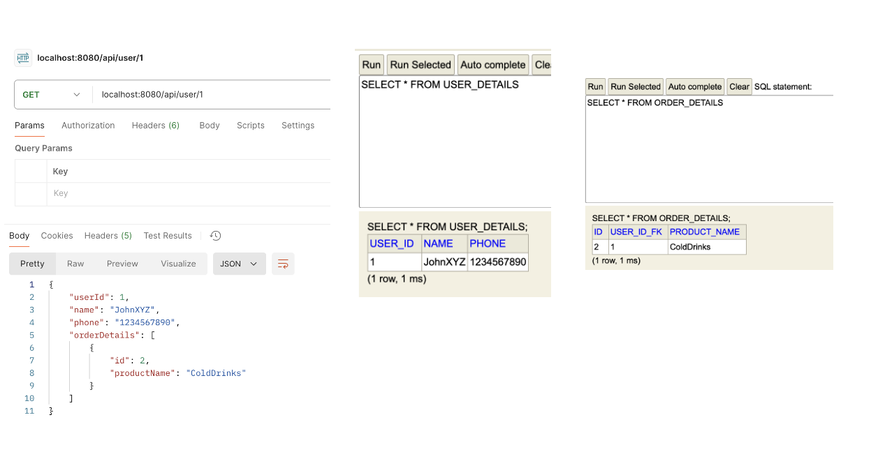

```sql
update order_details set user_id_fk = null where user_id_fk = ? and id = ?
delete from order_details where id = ?
```

In short: orphan removal is about deleting the *association* between child and parent when it's severed — by default, the child is not deleted from the DB, only detached from the parent.

## One-to-Many Bidirectional

- Parent has a reference to child (the collection).
- Each child also has a reference back to parent.

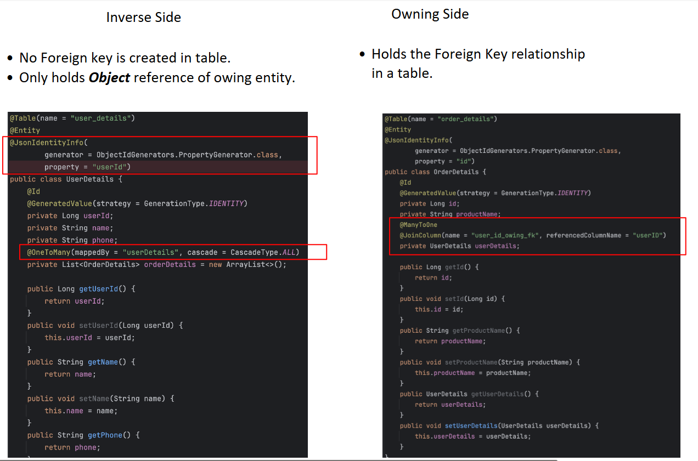

Don't assume parent is always the owning side and child is always the inverse side — "owing" (owning) just means whichever side holds the FK, and "inverse" means the side that doesn't. In 1:1, the parent always holds the FK, so parent is always the owning side. In 1:many, the *child* holds the FK, so the child is the owning side and the parent is the inverse side. Just like in 1:1, bidirectional mapping here doesn't change the table structure at all — the child still just holds an extra object reference to the parent, nothing new in the DB.

```java
@Table(name = "user_details")
@Entity
@JsonIdentityInfo(
        generator = ObjectIdGenerators.PropertyGenerator.class,
        property = "userId"
)
public class UserDetails {

    @Id
    @GeneratedValue(strategy = GenerationType.IDENTITY)
    private Long userId;
    private String name;
    private String phone;

    @OneToMany(mappedBy = "userDetails", cascade = CascadeType.ALL)
    private List<OrderDetails> orderDetails = new ArrayList<>();

    public Long getUserId() { return userId; }
    public void setUserId(Long userId) { this.userId = userId; }
    public String getName() { return name; }
    public void setName(String name) { this.name = name; }
    public String getPhone() { return phone; }
    public void setPhone(String phone) { this.phone = phone; }

    public List<OrderDetails> getOrderDetails() {
        return orderDetails;
    }

    public void setOrderDetails(List<OrderDetails> orderDetails) {
        this.orderDetails = orderDetails;
        for (OrderDetails order : orderDetails) {
            order.setUserDetails(this);
        }
    }
}
```

```java
@Table(name = "order_details")
@Entity
@JsonIdentityInfo(
        generator = ObjectIdGenerators.PropertyGenerator.class,
        property = "id"
)
public class OrderDetails {

    @Id
    @GeneratedValue(strategy = GenerationType.IDENTITY)
    private Long id;
    private String productName;

    @ManyToOne
    @JoinColumn(name = "user_id_owing_fk", referencedColumnName = "userID")
    private UserDetails userDetails;

    // getters and setters
}
```

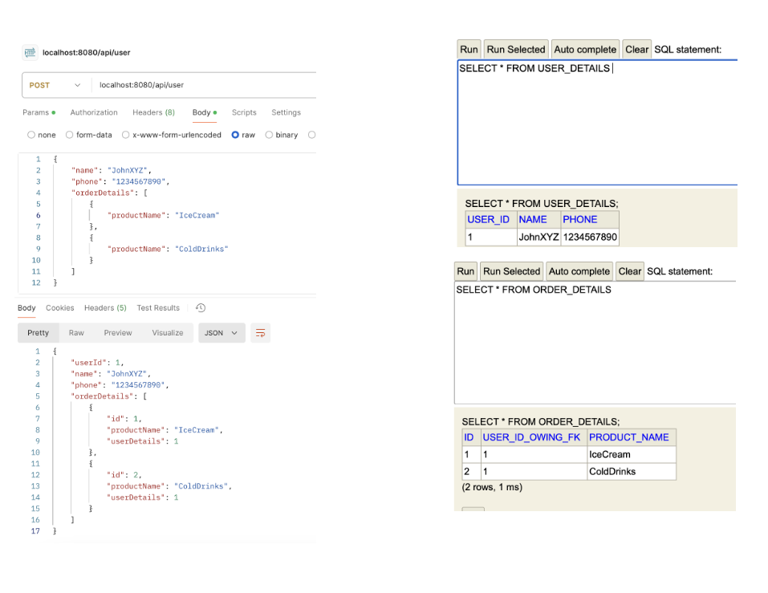

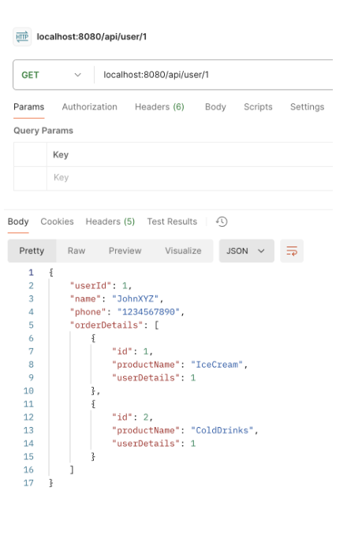

Notes on the annotations here:

- The inverse side (parent) gets `@OneToMany`; the owning side (child) gets `@ManyToOne`.
- `@JoinColumn` (with `name` and `referencedColumnName`) is placed on the owning side — it names the FK column to create in the child table and says which parent column it should reference. Join condition here works out to: `UserDetails.userId = OrderDetails.user_id_owing_fk`.
- `mappedBy` is placed on the inverse side and tells JPA which field on the child class represents the relationship back to this parent — so JPA knows not to create its own FK column, and instead go look at that field on the child.
- Since the object graph is bidirectional, Jackson would hit the same infinite recursion problem covered under `@OneToOne` bidirectional mapping — `@JsonIdentityInfo` (assigning a unique property, generally the primary key) solves it here the same way, letting both sides be serialized without looping.
- Since tables put values through the object's setters, the parent's `setOrderDetails()` should also loop through the list and call `order.setUserDetails(this)` on each child — this keeps the object graph consistent, since the child needs its `userDetails` reference set too.

A GET on the parent returns the full nested list of orders, and inside each order the parent reference collapses to just the ID (avoiding recursion) — this ends up looking exactly like `@OneToOne` bidirectional's output pattern.

## Many-to-One Unidirectional

We generally talk about this from the perspective of the child — e.g. "many Orders can be placed by 1 User." User is still considered the parent and Order the child, but here the parent has *no* reference to the child, and each child has a reference to the parent. This is essentially the reverse of the 1:many case: since it's "many-to-one" the relationship naturally reads from child to parent.

```java
@Table(name = "order_details")
@Entity
public class OrderDetails {

    @Id
    @GeneratedValue(strategy = GenerationType.IDENTITY)
    private Long id;
    private String productName;

    @ManyToOne(cascade = CascadeType.ALL)
    @JoinColumn(name = "user_id_owing_fk", referencedColumnName = "userID")
    private UserDetails userDetails;

    // getters and setters
}
```

```java
@Table(name = "user_details")
@Entity
public class UserDetails {

    @Id
    @GeneratedValue(strategy = GenerationType.IDENTITY)
    private Long userId;
    private String name;
    private String phone;

    // getters and setters — UserDetails knows nothing about OrderDetails
}
```

```java
@RestController
@RequestMapping(value = "/api/")
public class OrderController {

    @Autowired
    OrderService orderService;

    @GetMapping("/order/{id}")
    public OrderDetails fetchUser(@PathVariable Long id) {
        return orderService.findByID(id);
    }

    @PostMapping(path = "/order")
    public OrderDetails insertOrder(@RequestBody OrderDetails orderDetails) {
        return orderService.saveOrder(orderDetails);
    }
}
```
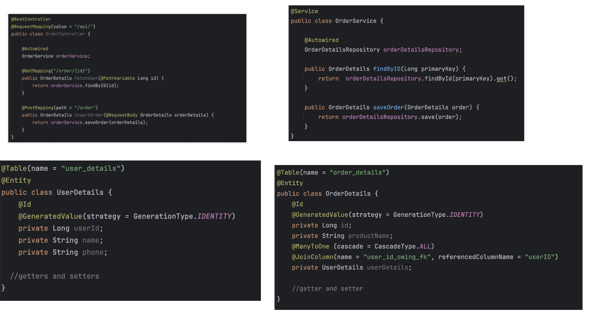

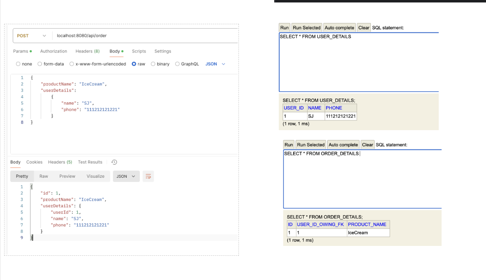

Many-to-One bidirectional would be the exact same setup as One-to-Many bidirectional, just approached from the other entity's perspective.

## Many-to-Many: Unidirectional

There's no parent-child concept in many-to-many — either side can be the owning side, either side can be the inverse side, or in principle both could even be treated as owning/inverse depending on which direction you map. Unidirectional simply means the reference exists from one entity only (e.g. from Order to Product). The DB structure ends up being the same either way, whether you map it unidirectionally or bidirectionally.

```java
@Table(name = "order_details")
@Entity
public class OrderDetails {

    @Id
    @GeneratedValue(strategy = GenerationType.IDENTITY)
    private Long orderNo;

    @ManyToMany(cascade = CascadeType.ALL)
    @JoinTable(
            name = "order_product", // new join table name
            joinColumns = @JoinColumn(name = "order_id"), // FK for Order
            inverseJoinColumns = @JoinColumn(name = "product_id") // FK for Product
    )
    private List<ProductDetails> productDetails = new ArrayList<>();

    // getters and setters
}
```

```java
@Table(name = "product_details")
@Entity
public class ProductDetails {

    @Id
    @GeneratedValue(strategy = GenerationType.IDENTITY)
    private Long productId;
    private String name;
    private double price;

    // getters and setters
}
```

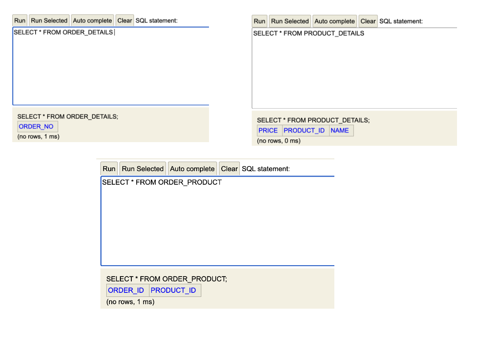

Since many-to-many can't be represented with a single FK column on either side, the relationship is always stored in a new join table. 

`@JoinTable` configures that table: `name` is the join table's name, 

`joinColumns` is the FK pointing back to the current (owning) entity, and `inverseJoinColumns` is the FK pointing to the other entity. JPA creates and maintains this join table automatically — you never touch it directly. If the relationship is instead expressed with `mappedBy` from the other side, that side must manually keep the collection updated, since it doesn't own the join table.

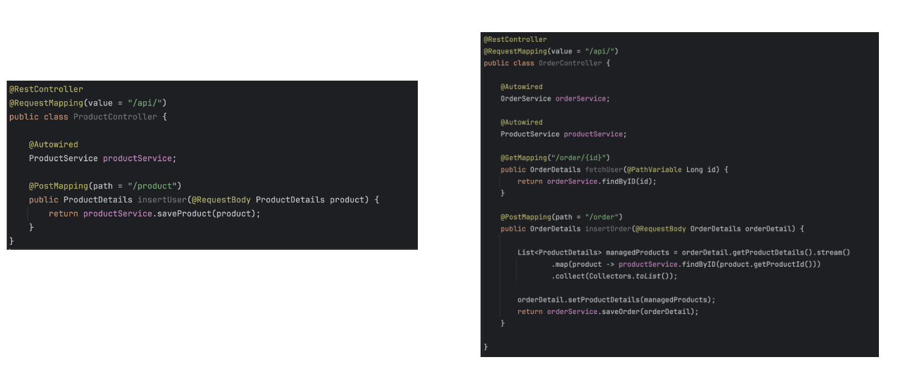

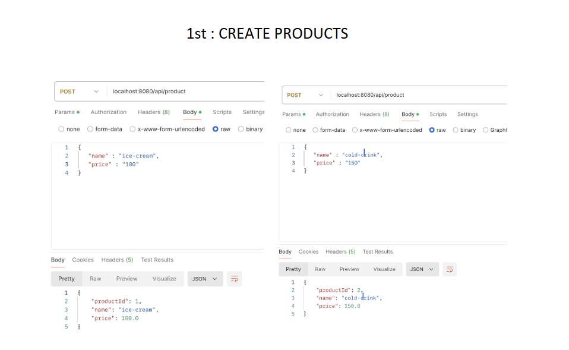

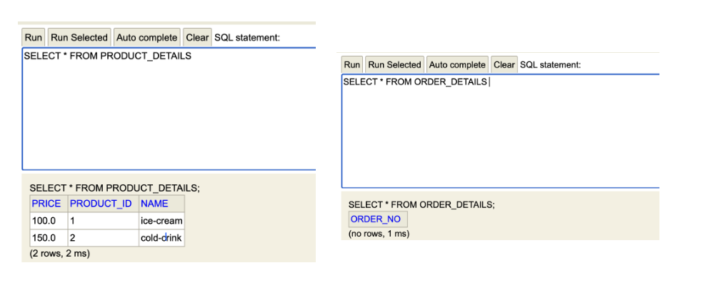


now create order 

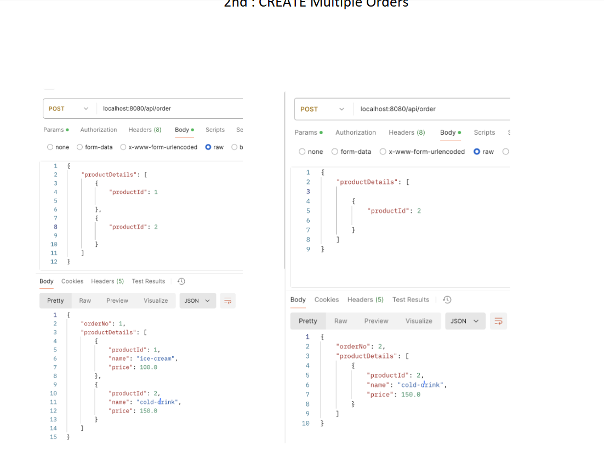

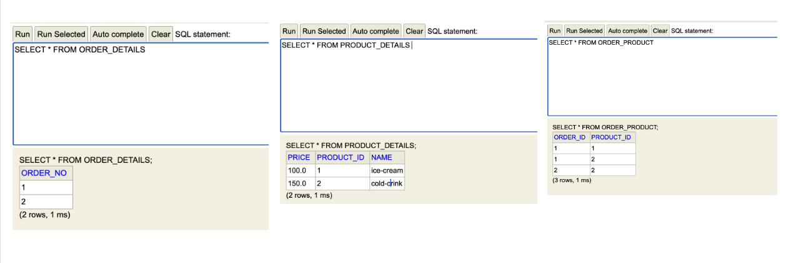

Typical flow: create the products first, then create an order and, in the controller, look up the managed `ProductDetails` entities by ID (since JPA needs already-persisted managed entities, not new detached objects) before associating them with the order:

```java
@PostMapping(path = "/order")
public OrderDetails insertOrder(@RequestBody OrderDetails orderDetail) {

    List<ProductDetails> managedProducts = orderDetail.getProductDetails().stream()
            .map(product -> productService.findByID(product.getProductId()))
            .collect(Collectors.toList());

    orderDetail.setProductDetails(managedProducts);
    return orderService.saveOrder(orderDetail);
}
```

Inserting two products and then an order referencing both product IDs populates all three tables correctly: `order_details`, `product_details`, and the join table `order_product` (holding `order_id` / `product_id` pairs) — one row per order-product association.

## Many-to-Many: Bidirectional

Since it's many-to-many, either side can be the owning side and either side can be the inverse side.

```java
@Table(name = "order_details")
@Entity
public class OrderDetails {

    @Id
    @GeneratedValue(strategy = GenerationType.IDENTITY)
    private Long orderNo;

    @ManyToMany(cascade = CascadeType.ALL)
    @JoinTable(
            name = "order_product",
            joinColumns = @JoinColumn(name = "order_id"),
            inverseJoinColumns = @JoinColumn(name = "product_id")
    )
    private List<ProductDetails> productDetails = new ArrayList<>();

    // getters and setters
}
```

```java
@Table(name = "product_details")
@Entity
public class ProductDetails {

    @Id
    @GeneratedValue(strategy = GenerationType.IDENTITY)
    private Long productId;
    private String name;
    private double price;

    @ManyToMany(mappedBy = "productDetails")
    @JsonIgnore
    List<OrderDetails> orders = new ArrayList<>();

    // getters and setters
}
```

The DB structure is identical to the unidirectional case — bidirectionality here is purely a matter of holding a reference from both sides in the object model. Since there's no fixed child/parent relationship in M:N (a new table is created for the FKs regardless), ownership can be assigned to whichever side makes more logical sense: the owning side gets `@JoinTable`, and the inverse side gets `mappedBy` referencing the owning side's field name.

If you don't want to deal with keeping the inverse side's collection updated, `@JsonIgnore` is a simple way to exclude that side from serialization and avoid the recursion problem entirely — alternatively `@JsonManagedReference`/`@JsonBackReference` or `@JsonIdentityInfo` (as covered for `@OneToOne`) would also work here.

A practical way to decide direction: if one entity is generally "already there" and the other is "coming in and forming the association" (e.g. products already exist, and an incoming order associates itself with existing products), the incoming side (Order) is the natural owning side. If you pick sides without lining up with this logic, you end up having to manually populate the join table yourself instead of letting JPA manage it.
