## JPA - Part 8

Till now, our *Repository interface* looks like this

```java
@Repository
public interface UserDetailsRepository extends
        JpaRepository<UserDetails, Long> {

}
```

And in service class, we used to invoke methods which are available in JPA framework

```java
@Service
public class UserDetailsService {

    @Autowired
    UserDetailsRepository userDetailsRepository;

    public UserDetails saveUser(UserDetails user) {
        return userDetailsRepository.save(user);
    }

    public UserDetails findByID(Long primaryKey) {
        return userDetailsRepository.findById(primaryKey).get();
    }
}
```

Then, we have something called: **Derived Query**
- Automatically generates queries from the methods.
- Need to follow a specific naming convention.
- Derived query used for GET/REMOVE operations but not for INSERT/UPDATE
  - Insert and Update operations is supported though "save()"

**PartTree.java**

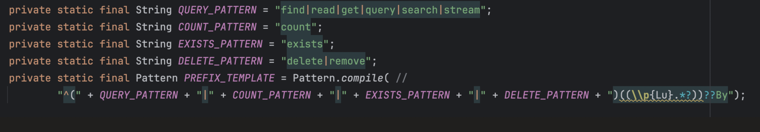

### Naming convention

```java
@Repository
public interface UserDetailsRepository extends
        JpaRepository<UserDetails, Long> {

    List<UserDetails> findUserDetailsByName(String userName);
}
```

```java
@Table(name = "user_details")
@Entity
public class UserDetails {

    @Id
    @GeneratedValue(strategy = GenerationType.IDENTITY)
    private Long userId;

    @Column(name = "user_name")
    private String name;

    private String phone;

    // getters and setters
}
```

The regex used internally by `PartTree` to parse method names:

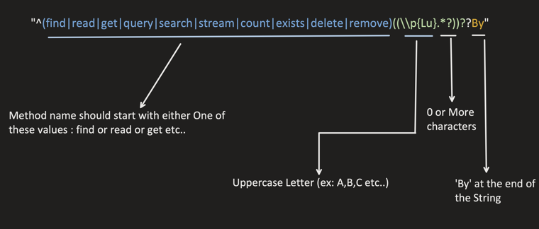

Query in which it get translates too:

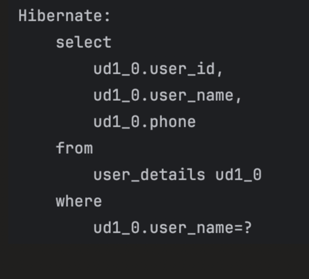

**Different Use cases:**

**And:**

```java
List<UserDetails> findUserDetailsByNameAndPhone(String userName, String phone);
```

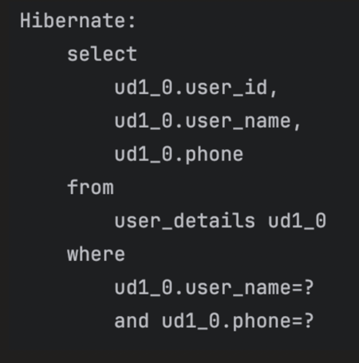

**Or:**

```java
List<UserDetails> findUserDetailsByNameAndPhoneOrUserId(String userName, String phone, Long id);
```

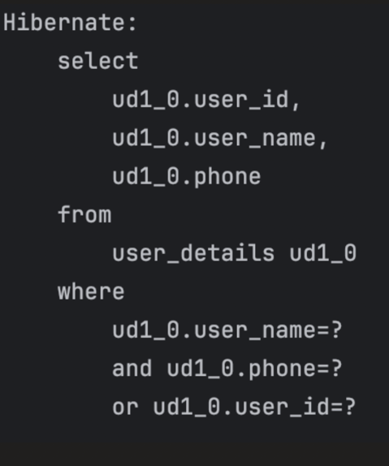

**Comparison:**

**Part.java** — list of all keywords supported by derived query method names:

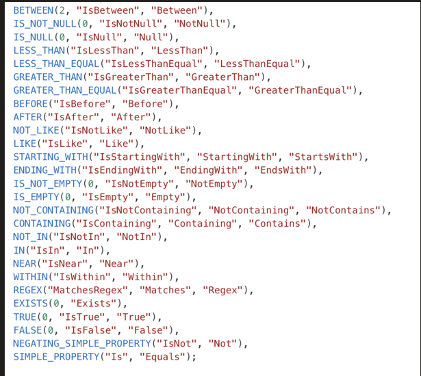

```java
List<UserDetails> findUserDetailsByNameIsIn(List<String> userName);
```

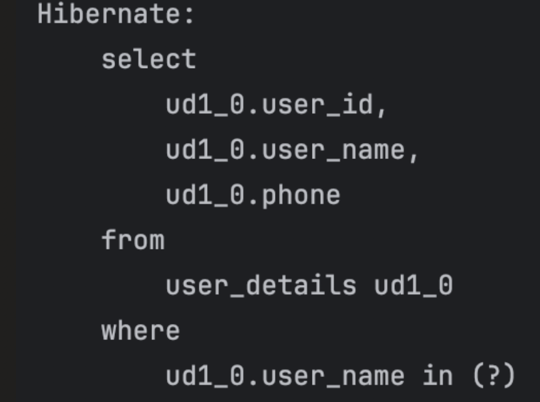

```java
List<UserDetails> findUserDetailsByNameLike(String userName);
```

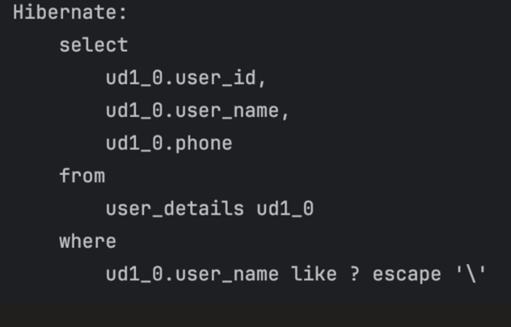

**Delete:**

Need to add @Transactional annotation.

```java
@Transactional
void deleteByName(String userName);
```

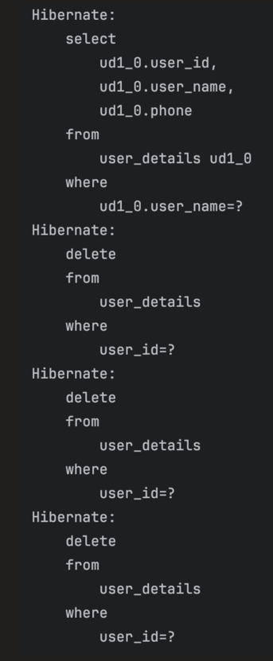

### Paginations and Sorting in Derived Query

JPA provides 2 interfaces to support Pagination and Sorting i.e.

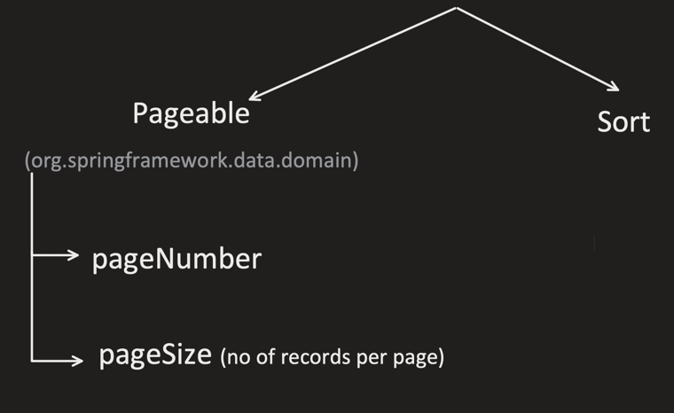

```java
@Repository
public interface UserDetailsRepository extends
        JpaRepository<UserDetails, Long> {

    List<UserDetails> findUserDetailsByNameStartingWith(String userName, Pageable page);
}
```

```java
@Service
public class UserDetailsService {

    @Autowired
    UserDetailsRepository userDetailsRepository;

    public UserDetails saveUser(UserDetails user) {
        return userDetailsRepository.save(user);
    }

    public List<UserDetails> findByNameDerived(String name) {
        Pageable pageable = PageRequest.of(0, 5); // Page 0, 5 records per page
        return userDetailsRepository.findUserDetailsByNameStartingWith(name, pageable);
    }
}
```
pageable as parameter can be used anywhere ,by convention we use at last


If we need more info about Pages, then we can use "Page" as return type

```java
@Repository
public interface UserDetailsRepository extends
        JpaRepository<UserDetails, Long> {

    Page<UserDetails> findUserDetailsByNameStartingWith(String userName, Pageable page);
}
```

```java
public List<UserDetails> findByNameDerived(String name) {

    Pageable pageable = PageRequest.of(0, 5); // Page 0, 5 records per page

    Page<UserDetails> userDetailsPage =
        userDetailsRepository.findUserDetailsByNameStartingWith(name, pageable);

    List<UserDetails> userDetailsList = userDetailsPage.getContent();

    System.out.println("total pages: " + userDetailsPage.getTotalPages());
    System.out.println("is first page: " + userDetailsPage.isFirst());
    System.out.println("is last page: " + userDetailsPage.isLast());

    return userDetailsList;
}
```

H2 console data used for these examples:

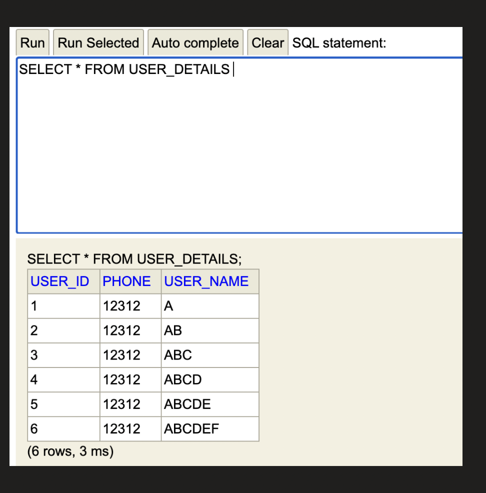

Output for Page 0:

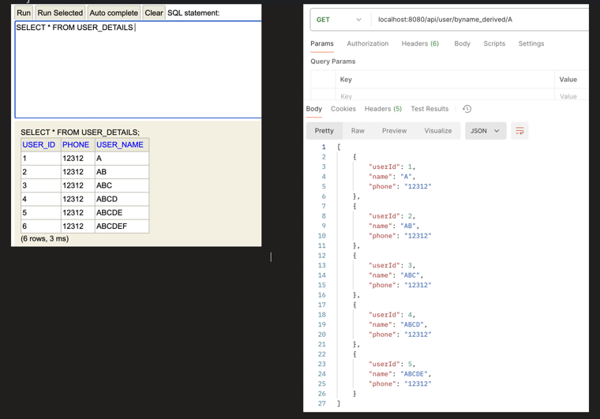

```java
public List<UserDetails> findByNameDerived(String name) {
    Pageable pageable = PageRequest.of(1, 5); // Page 1, 5 records per page
    Page<UserDetails> userDetailsPage =
        userDetailsRepository.findUserDetailsByNameStartingWith(name, pageable);

    List<UserDetails> userDetailsList = userDetailsPage.getContent();

    System.out.println("total pages: " + userDetailsPage.getTotalPages());
    System.out.println("is first page: " + userDetailsPage.isFirst());
    System.out.println("is last page: " + userDetailsPage.isLast());

    return userDetailsList;
}
```

Output for Page 1:

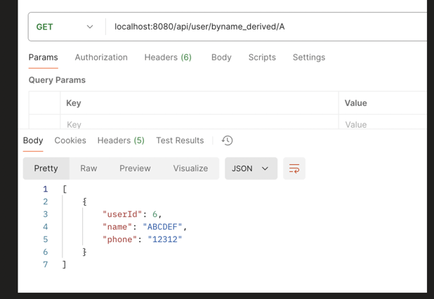

Query generated (offset/fetch, since page requested is the last one):

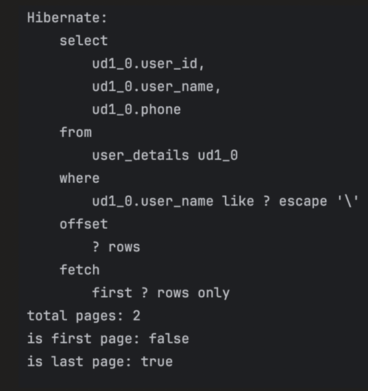

**Paginations with Sorting:**

```java
public List<UserDetails> findByNameDerived(String name) {
    Pageable pageable = PageRequest.of(0, 5,
            Sort.by("name").descending()); // Page 0, 5 records per page
    Page<UserDetails> userDetailsPage =
        userDetailsRepository.findUserDetailsByNameStartingWith(name, pageable);

    List<UserDetails> userDetailsList = userDetailsPage.getContent();

    System.out.println("total pages: " + userDetailsPage.getTotalPages());
    System.out.println("is first page: " + userDetailsPage.isFirst());
    System.out.println("is last page: " + userDetailsPage.isLast());

    return userDetailsList;
}
```


**Only Sorting:**

```java
@Repository
public interface UserDetailsRepository extends
        JpaRepository<UserDetails, Long> {

    List<UserDetails> findUserDetailsByNameStartingWith(String userName, Sort sort);
}
```

```java
public List<UserDetails> findByNameDerived(String name) {
    return userDetailsRepository.findUserDetailsByNameStartingWith(
        name,
        Sort.by("name").descending()
    );
}
```

Output, sorted descending:

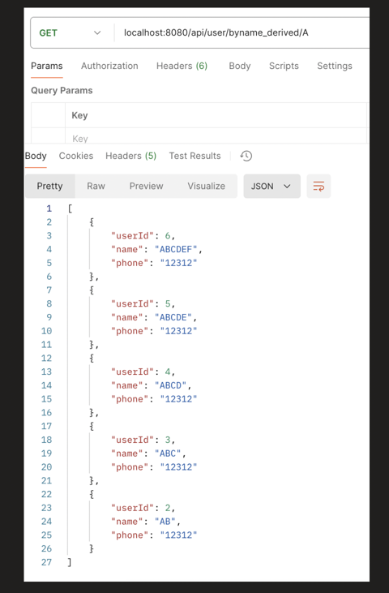

sort.by accepts multiple fields.
When multiple fields provided, sorting applied in order.
first it sort by first field and if there are duplicates then second field is used and so on.

```java
public List<UserDetails> findByNameDerived(String name) {
    return userDetailsRepository.findUserDetailsByNameStartingWith(
        name,
        Sort.by("name", "phone").ascending()
    );
}
```

If we need different sorting order for different fields

```java
public List<UserDetails> findByNameDerived(String name) {
    Sort sort = Sort.by(
        Sort.Order.asc("name"),
        Sort.Order.desc("phone")
    );

    return userDetailsRepository.findUserDetailsByNameStartingWith(name, sort);
}
```

Output, sorted by name asc then phone desc:

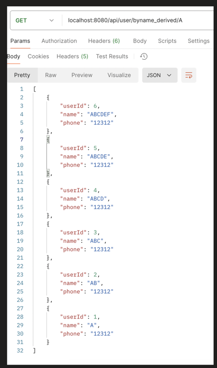

H2 console data used for above sorting example:

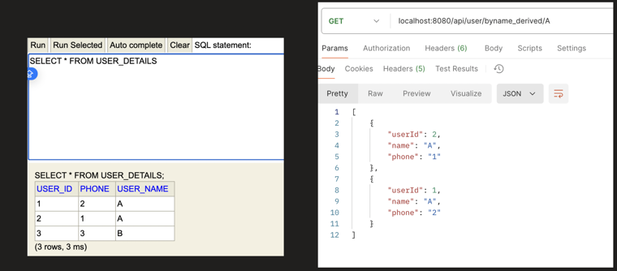

### JPQL

Queries which are little complex and can't be handled via Derived Query, we can use: **JPQL**

- Java Persistence Query Language.
- Similar to SQL but works on Entity Object instead of direct database.
- Its database independent
- Works with Entity name and fields and not with table column names.

**Syntax:**

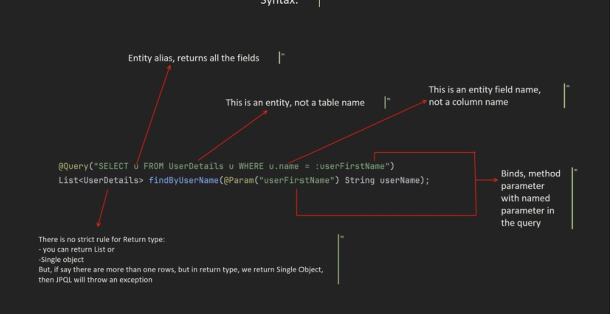

```java
@Query("SELECT u FROM UserDetails u WHERE u.name = :userFirstName")
/*
u:-Entity alias, returns all the fields
userDetails:-This is an entity, not a table name
u.name:-This is an entity field name, not a column name
List<user details>:-There is no strict rule for Return type:
  - you can return List or
  - Single object
But, if say there are more than one rows, but in return type,
we return Single Object, then JPQL will throw an exception
userFirstName:-Binds, method parameter with named userFirstName:- parameter in the query
*/
List<UserDetails> findByUserName(@Param("userFirstName") String userName);
```

### JPQL query with JOIN

**OneToOne**

```java
@Table(name = "user_details")
@Entity
public class UserDetails {

    @Id
    @GeneratedValue(strategy = GenerationType.IDENTITY)
    private Long userId;

    @Column(name = "user_name")
    private String name;
    private String phone;

    @OneToOne(cascade = CascadeType.ALL)
    @JoinColumn(name = "user_address")
    private UserAddress userAddress;

    //getters and setters
}
```

```java
@Entity
@Table(name = "user_address")
public class UserAddress {

    @Id
    @GeneratedValue(strategy = GenerationType.IDENTITY)
    private Long id;

    private String street;
    private String city;
    private String state;
    private String country;
    private String pinCode;

    //getters and setters
}
```

```java
@Repository
public interface UserDetailsRepository extends
        JpaRepository<UserDetails, Long> {
    /*
    We don't specifically need to put "On" here for join,
    JPA will automatically do that
    */

    @Query("SELECT ud FROM UserDetails ud JOIN ud.userAddress ad WHERE ud.name = :userFirstName")
    List<UserDetails> findUserDetailsWithAddress(
        @Param("userFirstName") String userName
    );
}
```

Query generated for the JOIN:

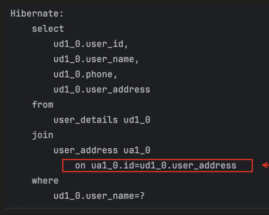

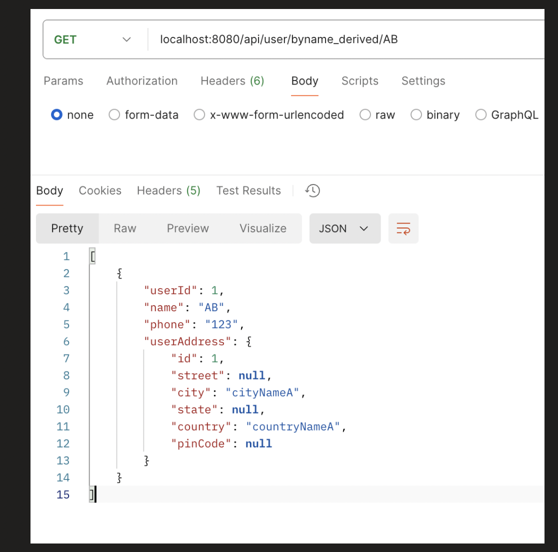
Now we want some field from table1 and soem ftom table2 so we put `Object[]`

```java
@Repository
public interface UserDetailsRepository extends
        JpaRepository<UserDetails, Long> {

    @Query("SELECT ud.name, ad.country FROM UserDetails ud JOIN ud.userAddress ad WHERE ud.name = :userFirstName")
    List<Object[]> findUserDetailsWithAddress(@Param("userFirstName") String userName);
}
```

```java
public class UserDTO {

    String userName;
    String country;

    // Constructor to populate from UserDetails entity
    public UserDTO(String userName, String country) {
        this.userName = userName;
        this.country = country;
    }

    //getters and setters
}
```

```java
public List<UserDTO> findByNameDerived(String name) {

    List<Object[]> dbOutput = userDetailsRepository.findUserDetailsWithAddress(name);
    List<UserDTO> output = new ArrayList<>();

    for (Object[] val : dbOutput) {
        String userName = (String) val[0];
        String country = (String) val[1];
        UserDTO dto = new UserDTO(userName, country);
        output.add(dto);
    }

    return output;
}
```

 selecting only name + address fields into DTO via `Object[]`:


If we don't want `Object[]` to be used, we can also return direct custom DTO

```java
@Repository
public interface UserDetailsRepository extends
        JpaRepository<UserDetails, Long> {

    @Query("SELECT new com.conceptandcoding.learningspringboot.jpa.DTO.UserDTO(ud.name, ad.country) " +
           "FROM UserDetails ud JOIN ud.userAddress ad WHERE ud.name = :userFirstName")
    List<UserDTO> findUserDetailsWithAddress(@Param("userFirstName") String userName);
}
```

**OneToMany**

```java
@Table(name = "user_details")
@Entity
public class UserDetails {

    @Id
    @GeneratedValue(strategy = GenerationType.IDENTITY)
    private Long userId;

    @Column(name = "user_name")
    private String name;
    private String phone;

    @OneToMany(cascade = CascadeType.ALL)
    @JoinColumn(name = "user_id") //fk in user address table
    private List<UserAddress> userAddressList = new ArrayList<>();

    //getters and setters
}
```

```java
@Entity
@Table(name = "user_address")
public class UserAddress {

    @Id
    @GeneratedValue(strategy = GenerationType.IDENTITY)
    private Long id;

    private String street;
    private String city;
    private String state;
    private String country;
    private String pinCode;

    //getters and setters
}
```

```java
@Query("SELECT ud FROM UserDetails ud JOIN ud.userAddressList ad WHERE ud.name = :userFirstName")
List<UserDetails> findUserDetailsWithAddress(@Param("userFirstName") String userName);
```

H2 console data — user_details and user_address tables:

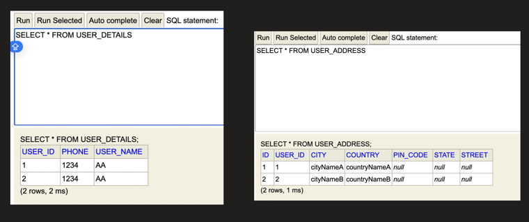

Output for a user having multiple addresses:

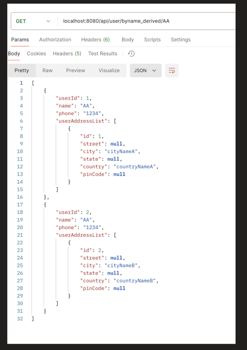

### N+1 Problem and its Solution

**Problem:**

Say, 1 User can have Many Addresses.
And our Query is such that, it can fetch more than 1 Users. Then this problem can occurs.

So, say we have 'N' Users. Then below queries will be hit by JPA:
- 1 query to fetch all the USERS.
- For each User it will fetch ADDRESSES, so for N users, it will fetch N times.
- So total number of query hit : N+1.

So we need to find the way, so that only 1 QUERY it hit instead of N+1.

Before going for the solution for this problem, One question might be coming to our mind: What if, we use EAGER initialization, then can we avoid this issue?

NO because EAGER initialization do not work, when our query tries to fetch multiple PARENT rows and that also have multiple CHILD.

Eager works when we have 1 parent ,for multiple parents we cannot use Eager

In previous video, we tested EAGER with "findByID(id)" method, in which it make sure that, our query is fetching only 1 PARENT and that can have many CHILD, that's fine. In that JPA internally draft a JOIN query.

But when Multiple parent with Multiple child get involved, EAGER do not work in just 1 query, it first fetches all the parent and then for each parent, it fetch all its child.

```java
@Query("SELECT ud FROM UserDetails ud JOIN ud.userAddressList ad WHERE ud.name = :userFirstName")
List<UserDetails> findUserDetailsWithAddress(@Param("userFirstName") String userName);
```

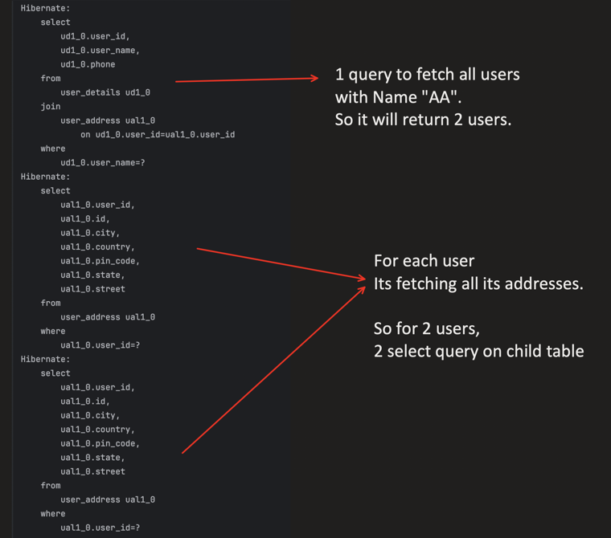

So, how to solve this, N+1 problem?

**Solution 1: using JOIN FETCH (JPQL)**

```java
@Query("SELECT ud FROM UserDetails ud JOIN FETCH ud.userAddressList ad WHERE ud.name = :userFirstName")
List<UserDetails> findUserDetailsWithAddress(
    @Param("userFirstName") String userName
);
```

Query generated — now a single query with all address columns joined in:

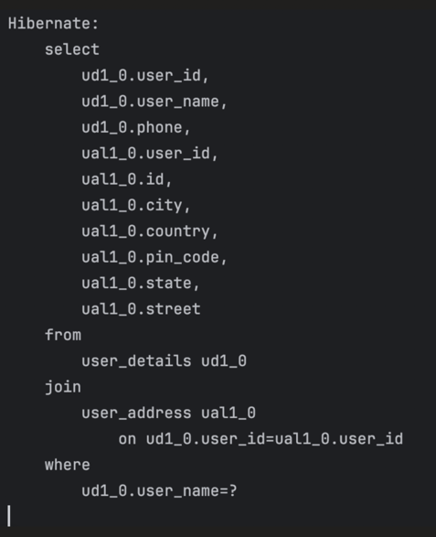

Output:

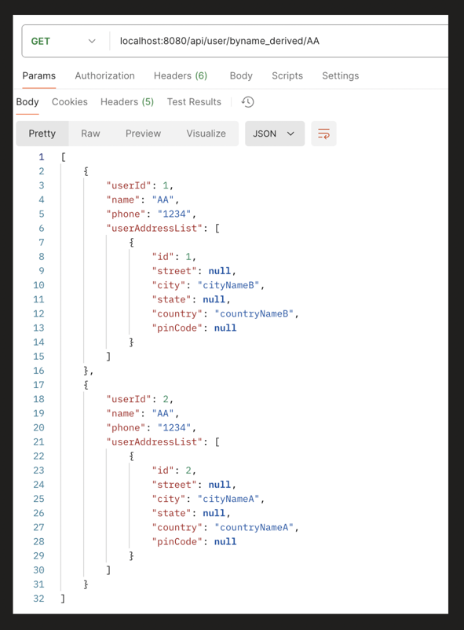

**Solution 2: using @BatchSize(size=10)**

It wont make only 1 query, but it will reduce it, as it will divide it into batches

```java
@Table(name = "user_details")
@Entity
public class UserDetails {

    @Id
    @GeneratedValue(strategy = GenerationType.IDENTITY)
    private Long userId;

    @Column(name = "user_name")
    private String name;
    private String phone;

    @OneToMany(cascade = CascadeType.ALL, fetch = FetchType.EAGER)
    @BatchSize(size = 10)
    @JoinColumn(name = "user_id") //fk in user address table
    private List<UserAddress> userAddressList;

    //getters and setters
}
```

Query generated — one query for users, then batched `IN (?, ?, ?, ...)` query for addresses instead of one query per user:

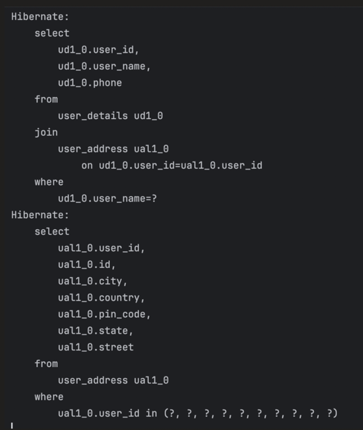

**Solution 3: using @EntityGraph(attributePaths="userAddressList")**

Used over method (helpful in derived methods)

Tell JPA to fetch all the entries of UserAddress along with user details.

```java
@EntityGraph(attributePaths = "userAddressList")
List<UserDetails> findUsersBy();
```

### How to join Many tables?

Its almost same as SQL only

Say, we have
- Table A has one to many relationship with Table B
- Table B has one to many relationship with Table C

```java
@Query("SELECT a FROM A a JOIN a.bList b JOIN b.cList c WHERE c.someProperty = :someValue")
List<A> findAWithBAndC(@Param("someValue") String someValue);
```

### @Modifying Annotation

When @Query annotation used, by-default JPA expects SELECT query.

If we try to use "DELETE" or "INSERT" or "UPDATE" query with @Query, JPA will throw error, that:

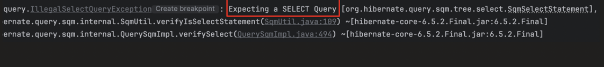

@Modifying annotation, is to tell JPA that, expect either "DELETE" or "INSERT" or "UPDATE" query with @Query

Since we are trying to update the DB, we also need to use @Transactional annotation.

```java
@Modifying
@Transactional
@Query("DELETE FROM UserDetails ud WHERE ud.name = :userFirstName")
void deleteByUserName(@Param("userFirstName") String userName);
```

### Understanding Usage of Flush and Clear

As we know, Flush just pushed the persistence context changes to DB but hold the value in persistence context.
Clear, purge the persistence context, and required fresh DB call

```java
@Modifying
@Query("DELETE FROM UserDetails ud WHERE ud.name = :userFirstName")
void deleteByUserName(@Param("userFirstName") String userName);
```

```java
@Service
public class UserDetailsService {

    @Autowired
    UserDetailsRepository userDetailsRepository;

    public UserDetails saveUser(UserDetails user) {
        return userDetailsRepository.save(user);
    }

    @Transactional
    public void deleteByUserName(String name) {
        userDetailsRepository.findById(1L).get();
        userDetailsRepository.deleteByUserName(name);
        Optional<UserDetails> output = userDetailsRepository.findById(1L);
        System.out.println("output present: " + output.isPresent());
    }
}
```

Without flush/clear — the entity fetched into persistence context before delete is still returned by the 2nd findById (stale cache hit), so `output present: true`:

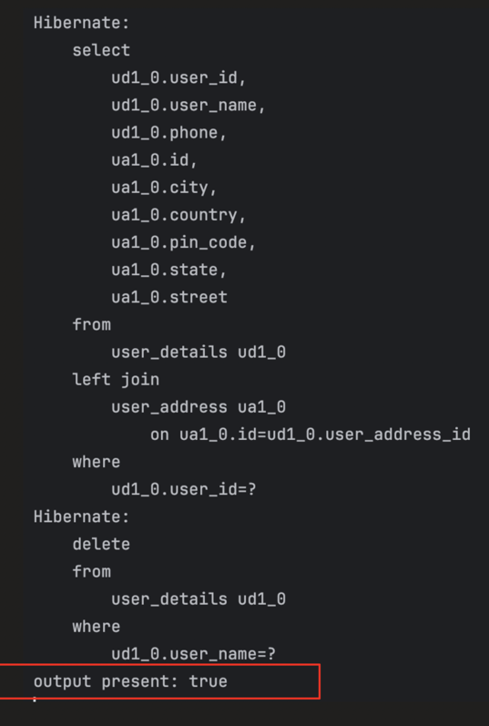

Now using, Flush and Clear

```java
@Modifying(flushAutomatically = true, clearAutomatically = true)
@Query("DELETE FROM UserDetails ud WHERE ud.name = :userFirstName")
void deleteByUserName(@Param("userFirstName") String userName);
```

```java
@Service
public class UserDetailsService {

    @Autowired
    UserDetailsRepository userDetailsRepository;

    public UserDetails saveUser(UserDetails user) {
        return userDetailsRepository.save(user);
    }

    @Transactional
    public void deleteByUserName(String name) {
        userDetailsRepository.findById(1L).get();
        userDetailsRepository.deleteByUserName(name);
        Optional<UserDetails> output = userDetailsRepository.findById(1L);
        System.out.println("output present: " + output.isPresent());
    }
}
```

With flush/clear — persistence context is purged after delete, so the 2nd findById hits the DB fresh, giving `output present: false`:

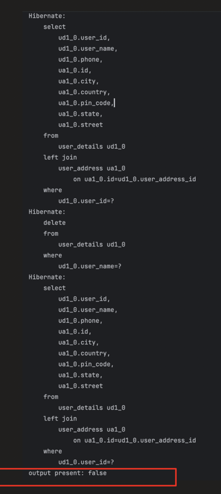

### Pagination and Sorting in JPQL

Same like discussed in derived query method

```java
@Query("SELECT ud FROM UserDetails ud WHERE ud.name = :userFirstName")
List<UserDetails> findUserDetails(@Param("userFirstName") String userName, Pageable pageable);
```

```java
public List<UserDetails> findByUserName(String name) {
    Pageable page = PageRequest.of(1, 5);
    return userDetailsRepository.findUserDetails(name, page);
}
```

Query generated with offset/fetch for pagination:

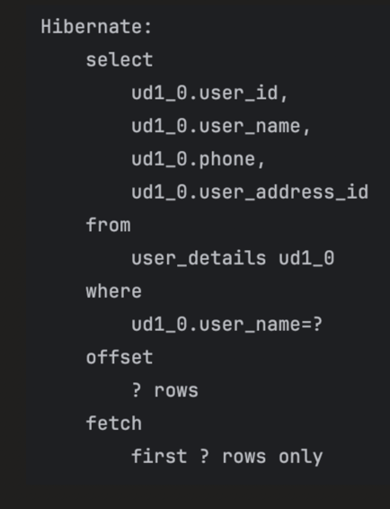

### @NamedQuery Annotation

We can name our Query, so that we can reuse it.

```java
@Table(name = "user_details")
@Entity
@NamedQuery(
    name = "findByUserName",
    query = "SELECT u FROM UserDetails u WHERE u.name = :userFirstName"
)
public class UserDetails {

    @Id
    @GeneratedValue(strategy = GenerationType.IDENTITY)
    private Long userId;

    @Column(name = "user_name")
    private String name;
    private String phone;

    @OneToOne(cascade = CascadeType.ALL)
    private UserAddress userAddress;

    //getters and setters
}
```

Reusing the named query in the repository by matching the `@Query(name = ...)` to the `@NamedQuery` name defined on the entity:

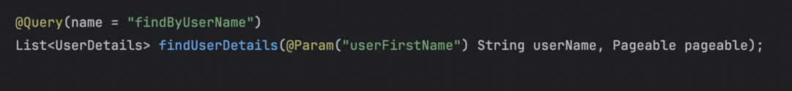