## JPA - Part 9 & 10 (Specification and Criteria API)
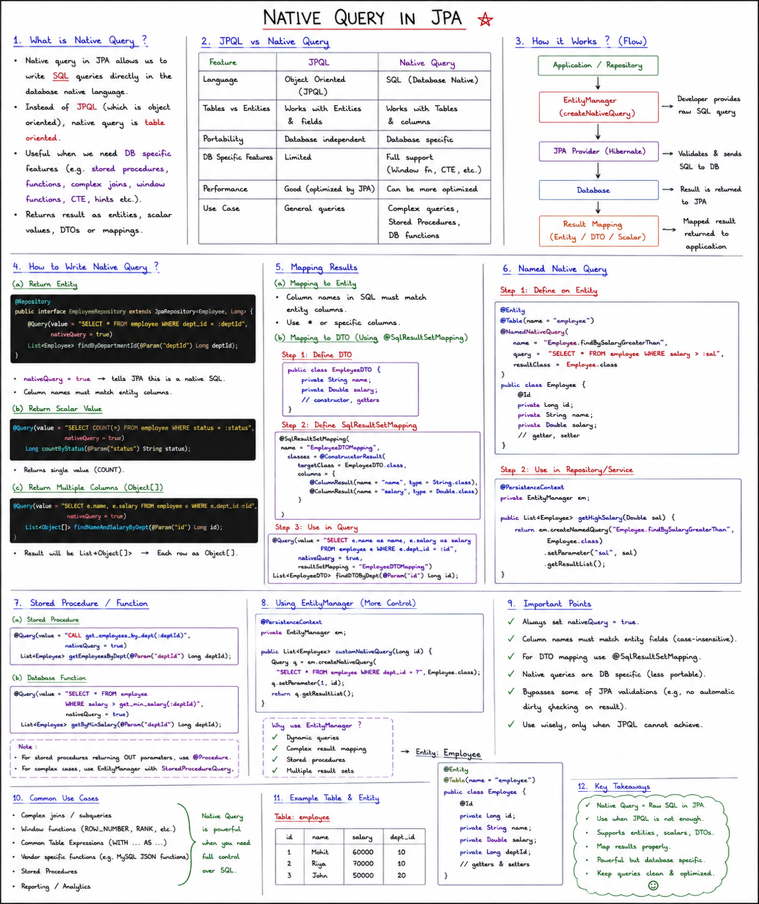
### Native Query

- Plain SQL queries.
- Directly interact with Database, thus if in future DB changes, code changes also required.
- No caching, lazy loading or entity life cycle management happens.

**When to use over JPQL:**
- More complex queries, including database specific features like JSONB, LATERAL JOIN
- Need to fetch non-entity results or joins table without any entity relationship.
- Query efficiency like Bulk operations.

```java
@Repository
public interface UserDetailsRepository extends
        JpaRepository<UserDetails, Long> {

    @Query(value = "SELECT * FROM user_details WHERE user_name = :userFirstName", nativeQuery = true)
    List<UserDetails> getUserDetailsByNameNativeQuery(@Param("userFirstName") String userName);
}
```

When all the fields (*) of the table are returned by Native Query, JPA internally does the mapping between DB column name and Entity fields.

Output — full entity (including the mapped `userAddress`) gets populated automatically:

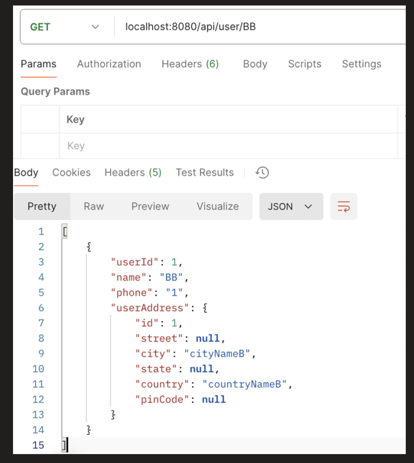

But, when Native Query returned partial fields, then JPA don't map it to Entity by default.

```java
@Repository
public interface UserDetailsRepository extends
        JpaRepository<UserDetails, Long> {

    @Query(value = "SELECT user_name, phone FROM user_details WHERE user_name = :userFirstName", nativeQuery = true)
    List<UserDetails> getUserDetailsByNameNativeQuery(@Param("userFirstName") String userName);
}
```

With partial fields and no mapping told to JPA, it throws an error:

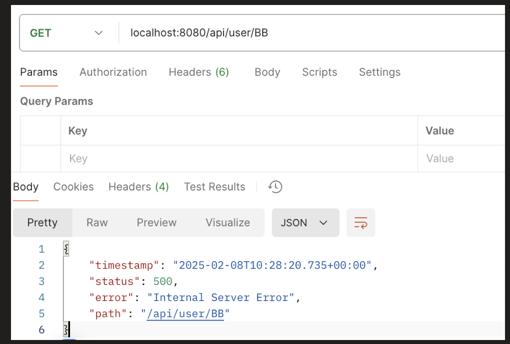

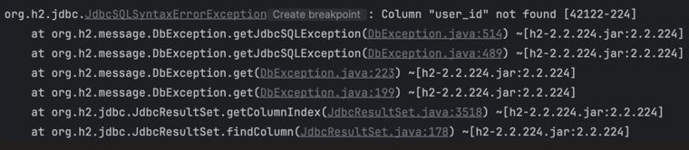

We need to manually tell JPA, how to do the mapping.

**1st: Using @SqlResultSetMapping and @NamedNativeQuery Annotation**

```java
@Table(name = "user_details")
@Entity
@NamedNativeQuery(
    name = "UserDetails.getUserDetailsByName",
    query = "SELECT user_name, phone FROM user_details WHERE user_name = :userFirstName",
    resultSetMapping = "UserDTOMapping"
)
@SqlResultSetMapping(
    name = "UserDTOMapping",
    classes = @ConstructorResult(
        targetClass = UserDTO.class,
        columns = {
            @ColumnResult(name = "user_name", type = String.class),
            @ColumnResult(name = "phone", type = String.class)}
    )
)
public class UserDetails {

    @Id
    @GeneratedValue(strategy = GenerationType.IDENTITY)
    private Long userId;

    @Column(name = "user_name")
    private String name;
    private String phone;

    @OneToOne(cascade = CascadeType.ALL)
    private UserAddress userAddress;

    //getters and setters
}
```

```java
public class UserDTO {

    String userName;
    String phone;

    public UserDTO(String userName, String phone) {
        this.userName = userName;
        this.phone = phone;
    }

    //getters and setters
}
```

```java
@Repository
public interface UserDetailsRepository extends
        JpaRepository<UserDetails, Long> {

    @Query(name = "UserDetails.getUserDetailsByName", nativeQuery = true)
    List<UserDTO> getUserDetailsByNameNativeQuery(@Param("userFirstName") String userName);
}
```

**2nd: With Manual mapping**

```java
@Repository
public interface UserDetailsRepository extends
        JpaRepository<UserDetails, Long> {

    @Query(value = "SELECT user_name, phone FROM user_details WHERE user_name = :userFirstName", nativeQuery = true)
    List<Object[]> getUserDetailsByNameNativeQuery(@Param("userFirstName") String userName);
}
```

```java
public List<UserDTO> getUserDetailsByNameNativeQuery(String name) {
    List<Object[]> results = userDetailsRepository.getUserDetailsByNameNativeQuery(name);
    return results.stream()
            .map(obj -> new UserDTO((String) obj[0], (String) obj[1]))
            .collect(Collectors.toList());
}
```

Output:

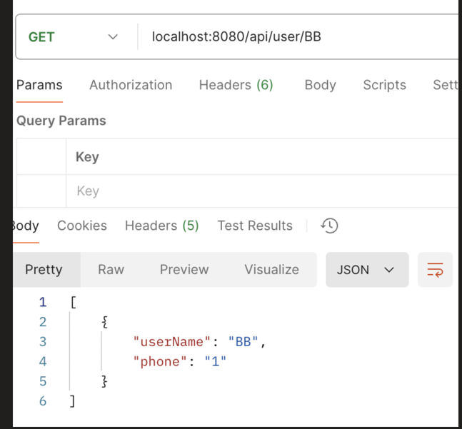

### Dynamic Native Query

```java
@Service
public class UserDetailsService {

    @PersistenceContext
    private EntityManager entityManager;

    public List<UserDTO> getUserDetailsByNameNativeQuery(String userName) {

        StringBuilder queryBuilder = new StringBuilder(
            "SELECT ud.user_name AS user_name, ud.phone AS phone, ua.city AS city ");
        queryBuilder.append("FROM user_details ud ");
        queryBuilder.append("JOIN user_address ua ON ud.user_address_id = ua.id ");
        queryBuilder.append("WHERE 1=1 ");
        //1=1 is always true when we do not need any condition we put 1=1 in where condition

        List<Object> parameters = new ArrayList<>();

        // Dynamically add conditions
        if (userName != null && !userName.isEmpty()) {
            queryBuilder.append("AND ud.user_name = ? ");
            parameters.add(userName);
        }
        /*
        SELECT ud.user_name AS user_name, ud.phone AS phone,
        ua.city AS city FROM user_details ud JOIN user_address ua
        ON ud.user_address_id = ua.id WHERE 1=1 AND ud.user_name = ?
        */
        // Create the native query
        Query nativeQuery = entityManager.createNativeQuery(queryBuilder.toString());

        // Set the parameters for the query
        for (int i = 0; i < parameters.size(); i++) {
            nativeQuery.setParameter(i + 1, parameters.get(i));
        }

        // Execute and get results
        List<Object[]> result = nativeQuery.getResultList();

        // Map the result to UserDTO
        return UserDTO.mapResultToDTO(result);
    }
}
```

### Pagination and Sorting in Native SQL

**1st way:**

```java
public List<UserDTO> getUserDetailsByNameNativeQuery(String userName) {

    StringBuilder queryBuilder = new StringBuilder(
        "SELECT ud.user_name AS user_name, ud.phone AS phone, ua.city AS city ");
    queryBuilder.append("FROM user_details ud ");
    queryBuilder.append("JOIN user_address ua ON ud.user_address_id = ua.id ");
    queryBuilder.append("WHERE 1=1 ");

    List<Object> parameters = new ArrayList<>();

    // Dynamically add conditions
    if (userName != null && !userName.isEmpty()) {
        queryBuilder.append("AND ud.user_name = ? ");
        parameters.add(userName);
    }
//--------------------------------------------------------------------------------------
    // sorting
    queryBuilder.append("ORDER BY ").append("ud.user_name").append(" DESC");

    // pagination
    int size = 5;
    int page = 0;
    queryBuilder.append(" LIMIT ? OFFSET ? ");
    parameters.add(size);
    parameters.add(page * size);
//--------------------------------------------------------------------------------------
    // Create the native query
    Query nativeQuery = entityManager.createNativeQuery(queryBuilder.toString());

    // Set the parameters for the query
    for (int i = 0; i < parameters.size(); i++) {
        nativeQuery.setParameter(i + 1, parameters.get(i));
    }

    // Execute and get results
    List<Object[]> result = nativeQuery.getResultList();

    // Map the result to UserDTO
    return UserDTO.mapResultToDTO(result);
}
```

**2nd way:**

```java
public List<UserDetails> getUserDetailsByNameNativeQuery(String name) {

    Pageable pageableObj = PageRequest.of(0, 5, Sort.by("phone").descending());
    return userDetailsRepository.getUserDetailsByNameNativeQuery(name, pageableObj);
}
```

```java
@Repository
public interface UserDetailsRepository extends
        JpaRepository<UserDetails, Long> {

    @Query(value = "SELECT * FROM user_details ud WHERE ud.user_name = :userName",
           nativeQuery = true)
    List<UserDetails> getUserDetailsByNameNativeQuery(@Param("userName") String userName, Pageable pageable);
}
```

Query generated by JPA for this Pageable-based native query (offset/fetch style):

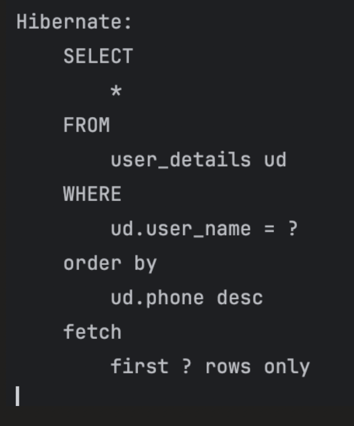

H2 console data used for this example:

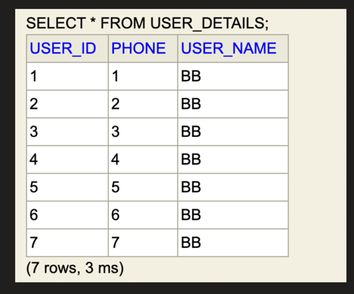

Output (sorted by name DESC, limit 5):


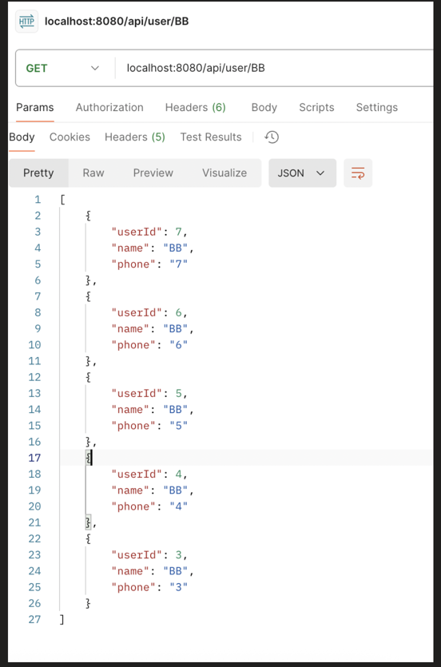


### Criteria API

Native SQL queries support dynamic query building, but they are database-dependent and don't leverage JPA abstraction.

That's why JPA Criteria API exists, it allows you to build dynamic, type-safe queries without writing raw SQL.

Lets understand the Hierarchy:

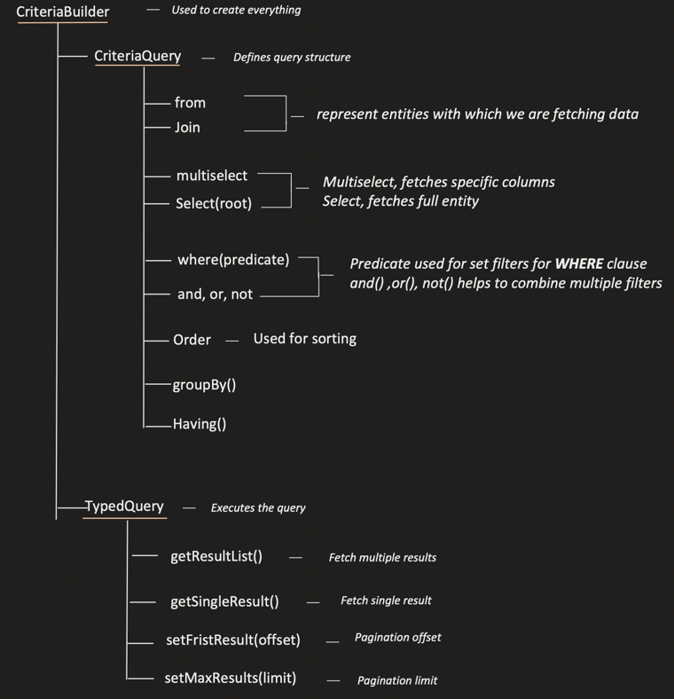


**Controller class:**

```java
@GetMapping("/user/{phone}")
public List<UserDetails> getUserDetailsByPhoneCriteriaAPI(@PathVariable Long phone) {
    return userDetailsService.getUserDetailsByPhoneCriteriaAPI(phone);
}
```

**Service class:**

```java
@Service
public class UserDetailsService {

    @Autowired
    UserDetailsRepository userDetailsRepository;

    @PersistenceContext
    private EntityManager entityManager;

    public UserDetails saveUser(UserDetails user) {
        return userDetailsRepository.save(user);
    }

    public List<UserDetails> getUserDetailsByPhoneCriteriaAPI(Long phoneNo) {

        CriteriaBuilder cb = entityManager.getCriteriaBuilder();

        CriteriaQuery<UserDetails> crQuery =
            cb.createQuery(UserDetails.class); // what my each row would look like, so in this case each row would be UserDetails

        Root<UserDetails> user = crQuery.from(UserDetails.class); // from clause

        crQuery.select(user); // select *

        Predicate predicate = cb.equal(user.get("phone"), phoneNo); // where clause
        crQuery.where(predicate);

        TypedQuery<UserDetails> query = entityManager.createQuery(crQuery);
        List<UserDetails> output = query.getResultList();

        return output;
    }
}
```

**Entity class:**

```java
@Table(name = "user_details")
@Entity
public class UserDetails {

    @Id
    @GeneratedValue(strategy = GenerationType.IDENTITY)
    private Long userId;

    @Column(name = "user_name")
    private String name;
    private Long phone;

    //getters and setters
}
```

**Comparison operator:**

`Root<UserDetails> user = crQuery.from(UserDetails.class); //from clause`

| Method | Description | Equivalent SQL query |
|---|---|---|
| `cb.equal(user.get("phone"), 123);` | Check for equality | Where phone = 123 |
| `cb.notEqual(user.get("phone"), 123);` | Check for in-equality | Where phone <> 123 |
| `cb.gt(user.get("phone"), 123);` | Greater than | Where phone > 123 |
| `cb.ge(user.get("phone"), 123);` | Greater than or equal | Where phone >= 123 |
| `cb.lt(user.get("phone"), 123);` | Less than | Where phone < 123 |
| `cb.le(user.get("phone"), 123);` | Less than or equal | Where phone <= 123 |

H2 console data for `cb.equal(phone, 120)` example:

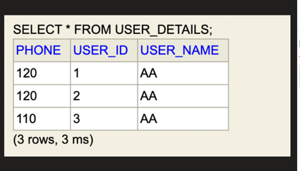

Output — 2 rows match phone 120:

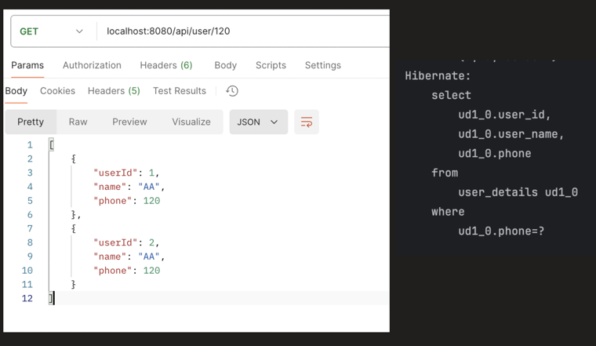

**Logical operator:**

| Method | Description | Equivalent SQL query |
|---|---|---|
| `cb.and(predicate1, predicate2);` | Combining two conditions using and | Where condition1 AND condition2 |
| `cb.or(predicate1, predicate2);` | Combining two conditions using or | Where condition1 OR condition2 |
| `cb.not(predicate1);` | Negate the condition | WHERE NOT condition1 |

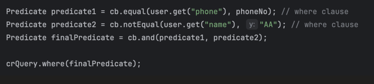

**Strings Operations:**

| Method | Description | Equivalent SQL query |
|---|---|---|
| `cb.like(user.get("name"), "S%");` | Name starts with S | Where name LIKE 'S%' |
| `cb.notLike(user.get("name"), "S%");` | Name do not start with S | Where name NOT LIKE 'S%' |

**Collection Operations:**

| Method | Description | Equivalent SQL query |
|---|---|---|
| `cb.in(user.get("phone")).value(11).value(7);` | Check if phone no is in the list | Where phone IN (11, 7) |
| `cb.not(user.get("phone").in(11,7));` | Check if phone no is not in the list | Where phone NOT IN (11, 7) |

### Select Multiple fields

```java
public List<UserDTO> getUserDetailsByPhoneCriteriaAPI(Long phoneNo) {

    CriteriaBuilder cb = entityManager.getCriteriaBuilder();

/-----------------------------------------------------------------------
    CriteriaQuery<Object[]> crQuery = cb.createQuery(Object[].class); // what my each row would look like

/-----------------------------------------------------------------------
    Root<UserDetails> user = crQuery.from(UserDetails.class); // from clause

/-----------------------------------------------------------------------
    crQuery.multiselect(user.get("name"), user.get("phone")); // select multiple fields

/-----------------------------------------------------------------------
    Predicate predicate1 = cb.equal(user.get("phone"), phoneNo); // where clause
    crQuery.where(predicate1);

    TypedQuery<Object[]> query = entityManager.createQuery(crQuery);
    List<Object[]> results = query.getResultList();

    // Processing results
    List<UserDTO> output = new ArrayList<>();
    for (Object[] row : results) {

        String name = (String) row[0];
        Long phone = (Long) row[1];
        UserDTO result = new UserDTO(name, phone);
        output.add(result);
    }

    return output;
}
```

### Join

```java
public List<UserDTO> getUserDetailsByPhoneCriteriaAPI(Long phoneNo) {

    CriteriaBuilder cb = entityManager.getCriteriaBuilder();

    CriteriaQuery<Object[]> crQuery = cb.createQuery(Object[].class); // what my each row would look like

    Root<UserDetails> user = crQuery.from(UserDetails.class); // from clause

/-----------------------------------------------------------------------
    Join<UserDetails, UserAddress> address = user.join("userAddress", JoinType.INNER);

/-----------------------------------------------------------------------
    crQuery.multiselect(user.get("name"), address.get("city")); // select all the fields of both the table

    Predicate predicate1 = cb.equal(user.get("phone"), phoneNo); // where clause
    crQuery.where(predicate1);

    TypedQuery<Object[]> query = entityManager.createQuery(crQuery);
    List<Object[]> results = query.getResultList();

    // Processing results
    List<UserDTO> output = new ArrayList<>();
    for (Object[] row : results) {

        String name = (String) row[0];
        String city = (String) row[1];
        UserDTO result = new UserDTO(name, city);
        output.add(result);
    }

    return output;
}
```
No need to tell which field to put join on .It will fetch automatiaclly from entity.

### Pagination and Sorting (Criteria API)

```java
public List<UserDetails> getUserDetailsByPhoneCriteriaAPI(Long phoneNo) {

    CriteriaBuilder cb = entityManager.getCriteriaBuilder();

    CriteriaQuery<UserDetails> crQuery =
        cb.createQuery(UserDetails.class); // what my each row would look like

    Root<UserDetails> user = crQuery.from(UserDetails.class); // from clause

    crQuery.select(user); // all columns of UserDetails table

    Predicate predicate1 = cb.equal(user.get("phone"), phoneNo); // where clause
    crQuery.where(predicate1);

    // Sorting
    crQuery.orderBy(cb.desc(user.get("name"))); // ORDER BY name DESC

    TypedQuery<UserDetails> query = entityManager.createQuery(crQuery);
    
/-----------------------------------------------------------------------
    query.setFirstResult(0); // kind of page number or offset
    query.setMaxResults(5); // page size

/-----------------------------------------------------------------------
    List<UserDetails> results = query.getResultList();
    return results;
}
```

H2 data + output (phone=1, sorted by name DESC, top 5 → H, G, F, E, D):

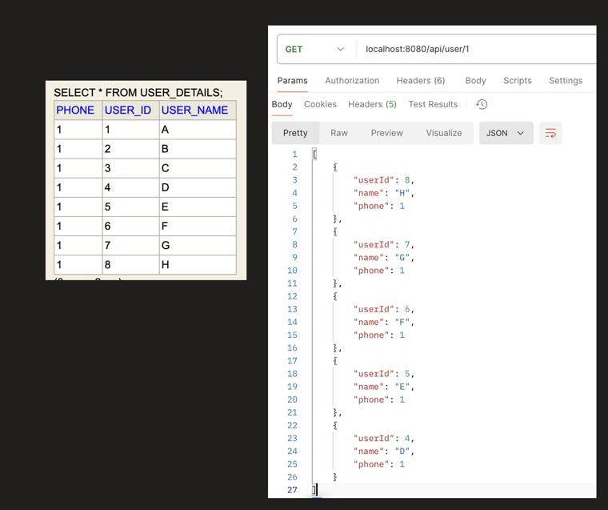


### Specification API (part-10)
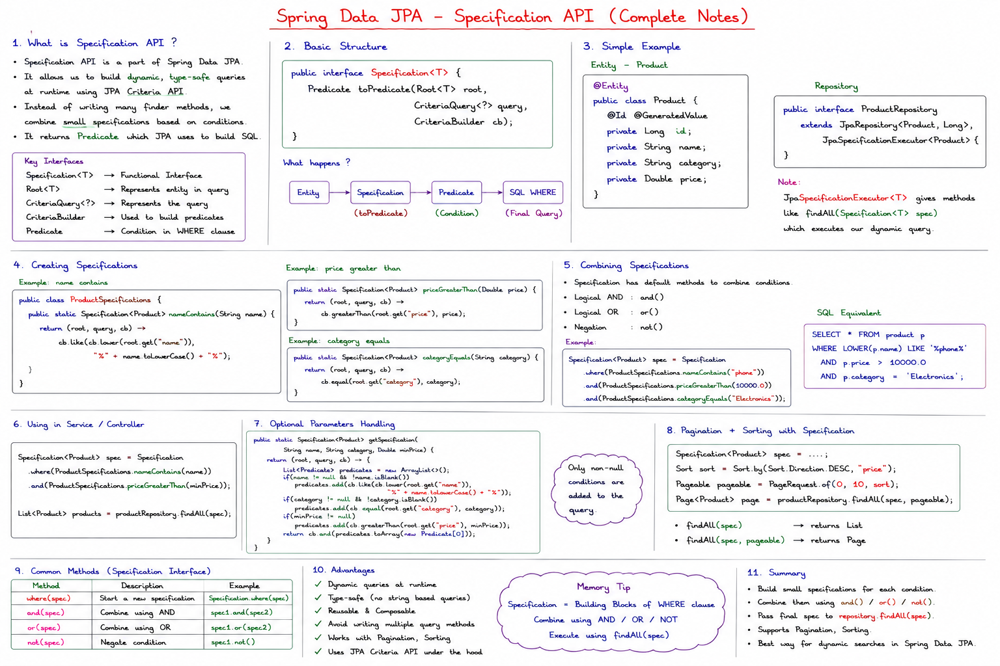
**1st problem it solves is: CODE DUPLICITY**

In Criteria API its possible that, same filter (predicate) used at multiple methods and class, so there is always a challenge of Code Duplicity

```java
@Service
public class UserDetailsService {

    @Autowired
    UserDetailsRepository userDetailsRepository;

    @PersistenceContext
    private EntityManager entityManager;

    public UserDetails saveUser(UserDetails user) {
        return userDetailsRepository.save(user);
    }

    public List<UserDetails> getUserDetailsByPhoneCriteriaAPI(Long phoneNo) {

        CriteriaBuilder cb = entityManager.getCriteriaBuilder();

        CriteriaQuery<UserDetails> crQuery =
            cb.createQuery(UserDetails.class); // what my each row would look like, so in this case each row would be UserDetails

        Root<UserDetails> user = crQuery.from(UserDetails.class); // from clause

        crQuery.select(user); // select *
        /*
        Possible that, same Predicate is used in multiple methods or even
        different class too
        */
        Predicate predicate = cb.equal(user.get("phone"), phoneNo); // where clause
        crQuery.where(predicate);

        TypedQuery<UserDetails> query = entityManager.createQuery(crQuery);
        List<UserDetails> output = query.getResultList();

        return output;
    }
}
```

Example of combining multiple predicates (this repeated combining logic is exactly the kind of duplication Specification API avoids):


Through Specification API, we can solve this:

Specification Interface support following methods

| Method | Description | Equivalent SQL query |
|---|---|---|
| `toPredicate()` | Abstract method, for which we need to provide implementation | Where clause |
| `and()` | `specf1.and(spec2)` | Where cond1 AND cond2 |
| `or()` | `specf1.or(spec2)` | Where cond1 OR cond2 |
| `not()` | `Specification.not(spec1)` | Where NOT condition1 |

```java
public class UserSpecification {

    public static Specification<UserDetails> equalsPhone(Long phoneNo) {

        return (root, query, cb) -> {
            return cb.equal(root.get("phone"), phoneNo);
        };
    }
}
```

**Service Class**

```java
public List<UserDetails> getUserDetailsByPhoneSpecificationAPI(Long phoneNo) {

    CriteriaBuilder cb = entityManager.getCriteriaBuilder();

    CriteriaQuery<UserDetails> crQuery =
        cb.createQuery(UserDetails.class); // what my each row would look like

    Root<UserDetails> userRoot = crQuery.from(UserDetails.class); // from clause

    crQuery.select(userRoot); // all columns of UserDetails table

    Specification<UserDetails> specification = UserSpecification.equalsPhone(phoneNo);
    Predicate predicate = specification.toPredicate(userRoot, crQuery, cb);
    crQuery.where(predicate);

    TypedQuery<UserDetails> query = entityManager.createQuery(crQuery);
    query.setFirstResult(0); // kind of page number or offset
    query.setMaxResults(5); // page size

    List<UserDetails> results = query.getResultList();
    return results;
}
```

**2nd problem it solves is: CODE BOILERPLATE**

Even though we have taken out the predicate logic / filtering logic out, still there are so many boiler code present here

```java
public List<UserDetails> getUserDetailsByPhoneSpecificationAPI(Long phoneNo) {
    /*
    We have to manage an object of CriteriaBuilder
    */
    CriteriaBuilder cb = entityManager.getCriteriaBuilder();
    /*
    We have to manage an CriteriaQuery Object
    */
    CriteriaQuery<UserDetails> crQuery =
        cb.createQuery(UserDetails.class); // what my each row would look like
    /*
    We have to manage Root object
    */
    Root<UserDetails> userRoot = crQuery.from(UserDetails.class); // from clause

    crQuery.select(userRoot); // all columns of UserDetails table
    /*
    We have to manage Predicate object
    */
    Specification<UserDetails> specification = UserSpecification.equalsPhone(phoneNo);
    Predicate predicate = specification.toPredicate(userRoot, crQuery, cb);
    crQuery.where(predicate);
    /*
    We have to execute the query
    */
    TypedQuery<UserDetails> query = entityManager.createQuery(crQuery);
    query.setFirstResult(0); // kind of page number or offset
    query.setMaxResults(5); // page size

    List<UserDetails> results = query.getResultList();
    return results;
}
```

All, we need to tell JPA that:
- From Which table we have to fetch the data, including joins
- What all columns
- Filtering in where clause

that's it, JPA should take care of everything like object creation, query building and execution.

### JpaSpecificationExecutor Framework code
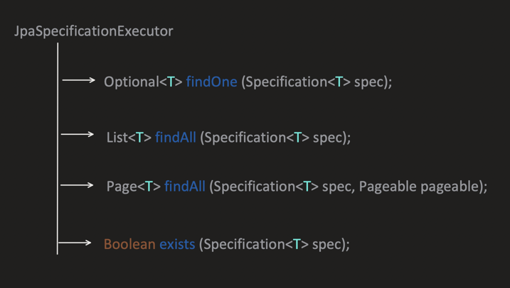
```java
@Override
public Page<T> findAll(@Nullable Specification<T> spec, Pageable pageable) {

    TypedQuery<T> query = getQuery(spec, pageable);//this calls next below class
    return pageable.isUnpaged() ? new PageImpl<>(query.getResultList())
            : readPage(query, getDomainClass(), pageable, spec);
}
```

```java
protected <S extends T> TypedQuery<S> getQuery(@Nullable Specification<S> spec, Class<S> domainClass, Sort sort) {

    CriteriaBuilder builder = entityManager.getCriteriaBuilder();
    CriteriaQuery<S> query = builder.createQuery(domainClass);

    Root<S> root = applySpecificationToCriteria(spec, domainClass, query);
    query.select(root);//this calls to next below class

    if (sort.isSorted()) {
        query.orderBy(toOrders(sort, root, builder));
    }

    return applyRepositoryMethodMetadata(entityManager.createQuery(query));
}
```

```java
private <S, U extends T> Root<U> applySpecificationToCriteria(@Nullable Specification<U> spec,
        Class<U> domainClass, CriteriaQuery<S> query) {

    Assert.notNull(domainClass, "Domain class must not be null");
    Assert.notNull(query, "CriteriaQuery must not be null");

    Root<U> root = query.from(domainClass);

    if (spec == null) {
        return root;
    }

    CriteriaBuilder builder = entityManager.getCriteriaBuilder();
    Predicate predicate = spec.toPredicate(root, query, builder);

    if (predicate != null) {
        query.where(predicate);
    }

    return root;
}
```

`JpaSpecificationExecutor` exposes these methods to use with a Specification:


```java
public class UserSpecification {

    public static Specification<UserDetails> equalsPhone(Long phoneNo) {

        return (root, query, cb) -> {
            return cb.equal(root.get("phone"), phoneNo);
        };
    }

    public static Specification<UserDetails> likeName(String name) {

        return (root, query, cb) -> {
            return cb.like(root.get("name"), "%" + name + "%");
        };
    }

    public static Specification<UserDetails> joinAddress() {
        return (root, query, cb) -> {
            Join<UserDetails, UserAddress> address =
                root.join("userAddress", JoinType.INNER);
            return null;
        };
    }
}
```

```java
@Repository
public interface UserDetailsRepository extends
        JpaRepository<UserDetails, Long>,
        JpaSpecificationExecutor<UserDetails> {
}
```

```java
public List<UserDetails> getUserDetailsByPhoneSpecificationAPI() {

    Specification<UserDetails> result =
        Specification.where(UserSpecification.joinAddress())
            .and(UserSpecification.equalsPhone(123L))
            .and(UserSpecification.likeName("AA"));

    return userDetailsRepository.findAll(result);
}
```

Compares to Criteria API, Specification API is more clean and has reusable code

```java
public List<UserDetails> getUserDetailsByPhoneCriteriaAPI(Long phoneNo) {

    CriteriaBuilder cb = entityManager.getCriteriaBuilder();

    CriteriaQuery<UserDetails> crQuery =
        cb.createQuery(UserDetails.class); // what my each row would look like

    Root<UserDetails> user = crQuery.from(UserDetails.class); // from clause
    Join<UserDetails, UserAddress> address = user.join("userAddress", JoinType.INNER);

    crQuery.select(user); // all columns of UserDetails table

    Predicate predicate1 = cb.equal(user.get("phone"), 123); // where clause
    Predicate predicate2 = cb.equal(user.get("name"), "% AA %"); // where clause
    crQuery.where(cb.and(predicate1, predicate2));

    TypedQuery<UserDetails> query = entityManager.createQuery(crQuery);
    return query.getResultList();
}
```