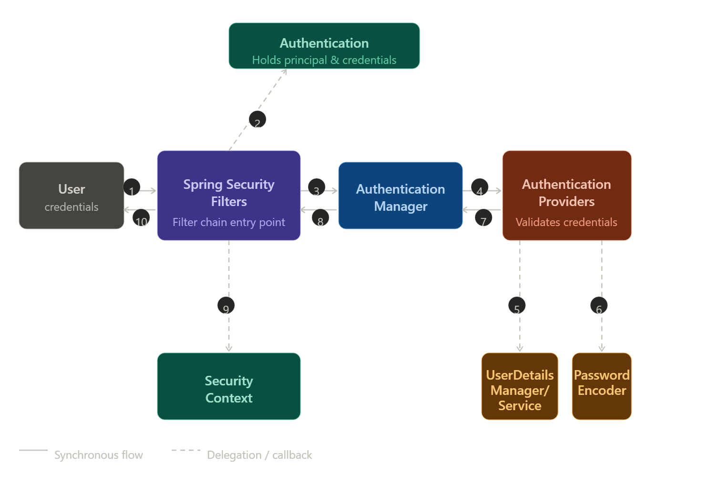
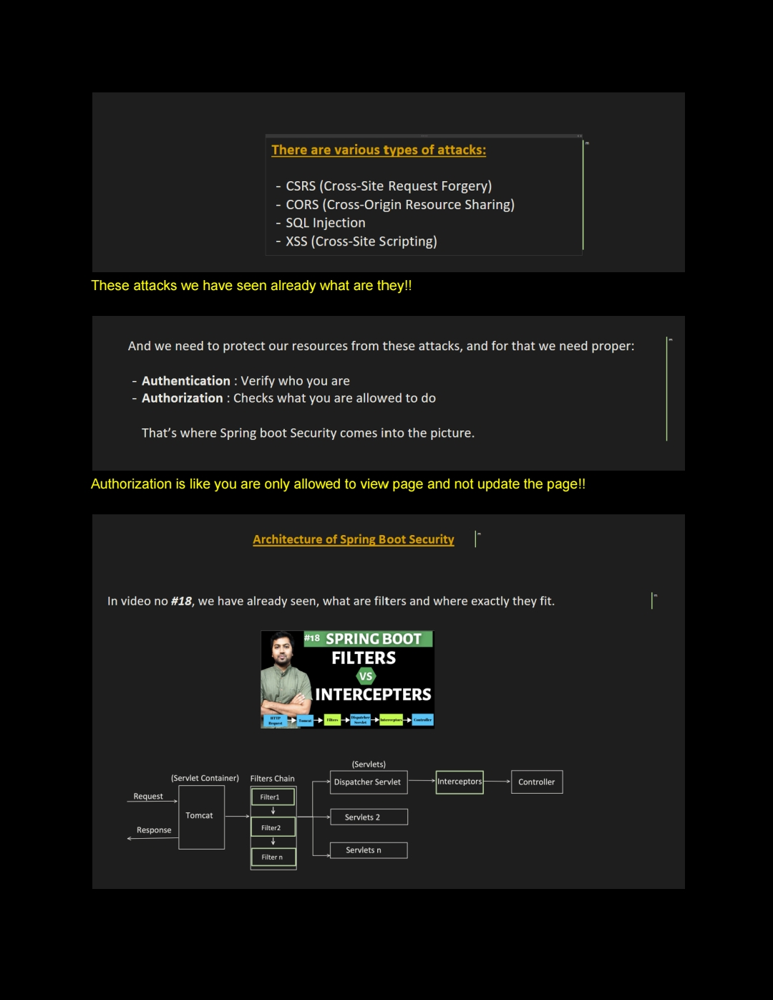
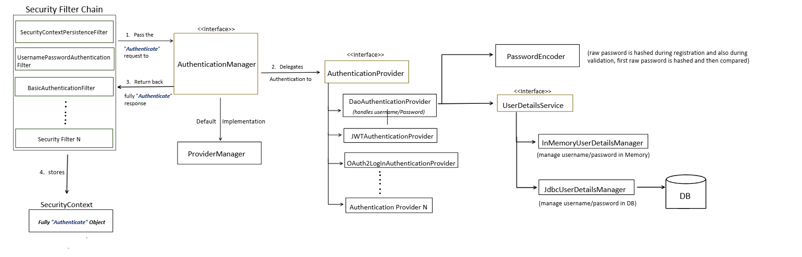
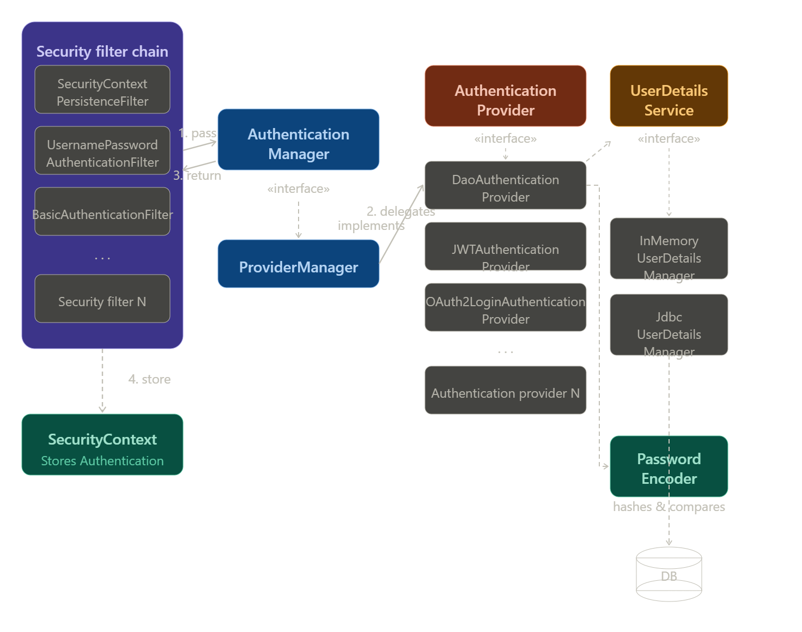
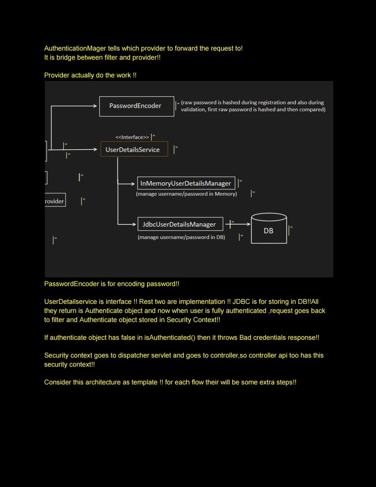
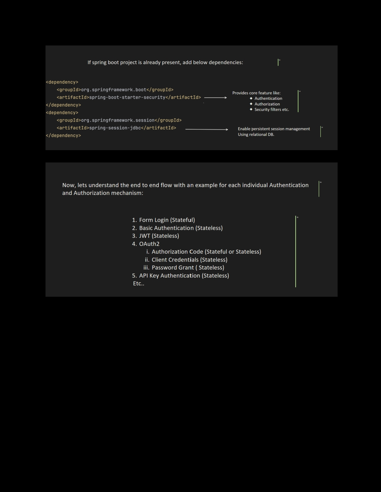
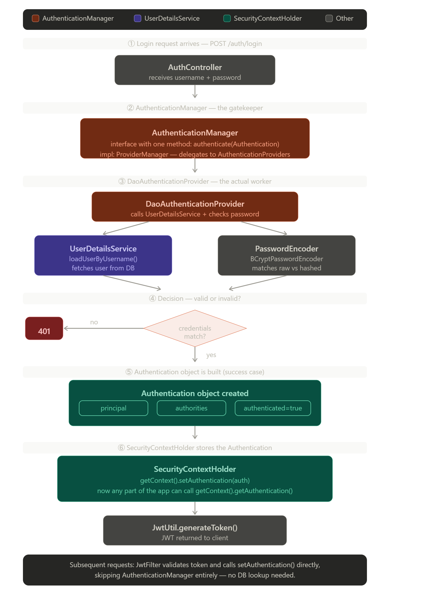

# Spring Security 

Spring Security is a powerful authentication and authorization framework for Java/Spring applications. Here's a breakdown of the key concepts:

### What it does
Spring Security handles two core concerns:
- **Authentication** — *Who are you?* (login, identity verification)
- **Authorization** — *What can you do?* (permissions, roles, access control)

### How it works — The Filter Chain

Spring Security intercepts every HTTP request through a chain of filters before it reaches your application:

```
HTTP Request → [Filter 1] → [Filter 2] → ... → [Your Controller]
```

The most important filter is the **`SecurityFilterChain`**, which decides whether a request is allowed through.

### Core Concepts

**1. Authentication**
- Users provide credentials (username/password, token, etc.)
- Spring verifies them via an `AuthenticationManager`
- On success, a `SecurityContext` stores the authenticated user's details for the duration of the request

**2. UserDetailsService**
- You implement this interface to tell Spring *how to load a user* (from DB, LDAP, etc.)
```java
@Service
public class MyUserService implements UserDetailsService {
    public UserDetails loadUserByUsername(String username) {
        // fetch user from DB
    }
}
```

**3. Password Encoding**
- Passwords are never stored in plain text
- Spring uses `PasswordEncoder` (typically `BCryptPasswordEncoder`)

**4. Authorization / Access Control**
- Done via roles (`ROLE_ADMIN`, `ROLE_USER`) or authorities
- Can be configured at the URL level or method level:
```java
// URL-level
http.authorizeHttpRequests(auth -> auth
    .requestMatchers("/admin/**").hasRole("ADMIN")
    .requestMatchers("/public/**").permitAll()
    .anyRequest().authenticated()
);

// Method-level
@PreAuthorize("hasRole('ADMIN')")
public void deleteUser(Long id) { ... }
```

### Common Authentication Mechanisms

| Mechanism | Use Case |
|---|---|
| Form Login | Traditional web apps |
| HTTP Basic | APIs, simple clients |
| JWT (JSON Web Token) | Stateless REST APIs |
| OAuth2 / OpenID Connect | Social login, SSO |
| LDAP | Enterprise/corporate environments |

### Minimal Configuration Example (Spring Boot)

```java
@Configuration
@EnableWebSecurity
public class SecurityConfig {

    @Bean
    public SecurityFilterChain filterChain(HttpSecurity http) throws Exception {
        http
            .authorizeHttpRequests(auth -> auth
                .requestMatchers("/public").permitAll()
                .anyRequest().authenticated()
            )
            .formLogin(Customizer.withDefaults())
            .logout(Customizer.withDefaults());
        return http.build();
    }

    @Bean
    public PasswordEncoder passwordEncoder() {
        return new BCryptPasswordEncoder();
    }
}
```

### Key Classes to Know

| Class/Interface | Role |
|---|---|
| `SecurityFilterChain` | Defines security rules for HTTP |
| `AuthenticationManager` | Processes authentication requests |
| `UserDetailsService` | Loads user data |
| `GrantedAuthority` | Represents a permission/role |
| `SecurityContextHolder` | Stores the current user's auth info |

### Spring Boot Auto-configuration
If you add `spring-boot-starter-security` to your project, Spring Boot automatically:
- Secures all endpoints
- Generates a default login page
- Creates a default user with a random password (printed in logs)

You then override this by defining your own `SecurityFilterChain` bean.




Here's the flow broken down step by step:

**Steps 1–2 — Credential capture:** The user submits credentials (1), and the Spring Security filter chain intercepts the request and wraps the credentials into an `Authentication` object (2).

**Steps 3–4 — Delegation:** The filter passes the `Authentication` object to the `AuthenticationManager` (3), which delegates to one or more `AuthenticationProvider` implementations (4).

**Steps 5–6 — Validation:** Each provider calls `UserDetailsManager/Service` to load the user record (5) and `PasswordEncoder` to verify the submitted password against the stored hash (6).

**Steps 7–8 — Result propagation:** The provider returns a fully populated `Authentication` back to the `AuthenticationManager` (7), which passes it up to the filters (8).

**Steps 9–10 — Completion:** On success, the filters store the authenticated `Authentication` in the `SecurityContext` (9) so it's available thread-locally. The response is then returned to the user (10). On failure, an exception is thrown and the user gets an error response instead.


---

## Context

The word "context" is one of those terms that confuses a lot of people. Let me break it down from the ground up — what "context" means in general programming, then specifically in Spring Security.---


### What "context" actually means

In plain terms, a **context** is just a *container of information relevant to the current situation*. Think of it like a room — whoever is in that room can see everything inside it, without anyone outside needing to pass it around manually.

In Spring Security specifically, the context answers the question: **"Who is the person making this request right now, and what are they allowed to do?"**

---

### The three layers explained

`SecurityContextHolder` is the outermost shell — a global static class you can call from anywhere in your app. It uses `ThreadLocal` internally, which means every thread gets its own private slot of memory.

`SecurityContext` is what lives inside that slot — one per thread. It's like a backpack tied to the current request. It holds exactly one thing: the `Authentication` object.

`Authentication` is the ID card inside the backpack. It contains three key pieces: the **principal** (who the user is — usually a `UserDetails` object), their **authorities** (roles like `ROLE_USER`, `ROLE_ADMIN`), and a flag `isAuthenticated()` (true/false).

---

### Why ThreadLocal matters

When your server handles 100 simultaneous requests, each one runs on its own thread. `ThreadLocal` ensures thread 1 (Alice's request) and thread 2 (Bob's request) each get their own isolated context — they can never see each other's data. This is how Spring Security stays stateless and thread-safe without you passing the user around manually everywhere.

---

### The lifecycle in one sentence

> `JwtFilter` validates the token → creates an `Authentication` object → puts it in the `SecurityContext` → your controller can read it freely → after the response, Spring clears it automatically.

This is why you can call `SecurityContextHolder.getContext().getAuthentication()` from any service or controller and always get the currently logged-in user — no method parameters needed. The context acts as an invisible carrier for that request's lifetime.


---

## There is NOT just one filter — ALL filters run on every request

This is the most common misconception. The Security Filter Chain runs **every registered filter on every request**, one by one in a fixed order. It does not pick just one.

---

## How the chain works internally

Think of it like a pipeline:

```
Request comes in
      ↓
Filter 1 runs  → calls chain.doFilter() → passes to next
      ↓
Filter 2 runs  → calls chain.doFilter() → passes to next
      ↓
Filter 3 runs  → calls chain.doFilter() → passes to next
      ↓
      ... (15+ filters)
      ↓
Your Controller finally executes
      ↓
Response travels back UP through each filter in reverse
```

Every filter has this same structure:

```java
// This is the pattern EVERY filter follows internally
public class SomeSecurityFilter extends OncePerRequestFilter {

    @Override
    protected void doFilterInternal(
            HttpServletRequest request,
            HttpServletResponse response,
            FilterChain chain) throws ServletException, IOException {

        // 1. Do its own work BEFORE passing on
        doSomethingBefore(request);

        // 2. THIS LINE passes control to the next filter
        //    If this line is NOT called → chain stops here → request blocked
        chain.doFilter(request, response);

        // 3. Do work AFTER the rest of the chain finishes (on the way back)
        doSomethingAfter(response);
    }
}
```

The key is `chain.doFilter()` — calling it moves to the next filter. Not calling it **stops the chain** (blocks the request).

---

## How does Spring Security know which filter to actually do work?

Each filter checks the request itself and decides whether to act or skip. Here are the real examples:

### `UsernamePasswordAuthenticationFilter`

```java
// Spring Security source (simplified)
public class UsernamePasswordAuthenticationFilter {

    // Only triggers on POST /login
    private AntPathRequestMatcher requiresAuthenticationRequestMatcher
        = new AntPathRequestMatcher("/login", "POST");

    @Override
    public void doFilter(request, response, chain) {

        // CHECK: is this a login request?
        if (!requiresAuthenticationRequestMatcher.matches(request)) {
            // NOT a login request → skip my logic, just pass it on
            chain.doFilter(request, response);
            return;
        }

        // YES it's a login request → do authentication work
        Authentication authResult = attemptAuthentication(request, response);
        successfulAuthentication(request, response, chain, authResult);
    }
}
```

### `BasicAuthenticationFilter`

```java
// Spring Security source (simplified)
public class BasicAuthenticationFilter {

    @Override
    protected void doFilterInternal(request, response, chain) {

        // CHECK: does this request have a Basic Auth header?
        String header = request.getHeader("Authorization");

        if (header == null || !header.startsWith("Basic ")) {
            // No Basic Auth header → skip, pass to next filter
            chain.doFilter(request, response);
            return;
        }

        // YES has Basic Auth → decode and authenticate
        String[] credentials = extractCredentials(header);
        attemptAuthentication(credentials[0], credentials[1]);

        chain.doFilter(request, response); // then pass on
    }
}
```

### `BearerTokenAuthenticationFilter` (JWT)

```java
// Spring Security source (simplified)
public class BearerTokenAuthenticationFilter {

    @Override
    protected void doFilterInternal(request, response, chain) {

        // CHECK: does this request have a Bearer token?
        String header = request.getHeader("Authorization");

        if (header == null || !header.startsWith("Bearer ")) {
            // No JWT token → skip, pass to next filter
            chain.doFilter(request, response);
            return;
        }

        // YES has JWT → validate token, set authentication
        String token = header.substring(7);
        validateAndSetAuthentication(token);

        chain.doFilter(request, response);
    }
}
```

---

## The full default filter order

Spring Security registers these filters in this exact order — all of them run, most just pass through:

```
1.  DisableEncodeUrlFilter
        ↓
2.  WebAsyncManagerIntegrationFilter
        ↓
3.  SecurityContextHolderFilter         ← loads SecurityContext from session
        ↓
4.  HeaderWriterFilter                  ← adds security headers (X-Frame-Options etc)
        ↓
5.  CsrfFilter                          ← checks CSRF token (if enabled)
        ↓
6.  LogoutFilter                        ← checks if this is POST /logout
        ↓
7.  UsernamePasswordAuthenticationFilter ← checks if this is POST /login
        ↓
8.  DefaultLoginPageGeneratingFilter    ← generates login page HTML if needed
        ↓
9.  DefaultLogoutPageGeneratingFilter
        ↓
10. BasicAuthenticationFilter           ← checks for Authorization: Basic header
        ↓
11. RequestCacheAwareFilter
        ↓
12. SecurityContextHolderAwareRequestFilter
        ↓
13. AnonymousAuthenticationFilter       ← sets anonymous user if no auth yet
        ↓
14. ExceptionTranslationFilter          ← catches auth exceptions → 401/403
        ↓
15. AuthorizationFilter                 ← checks if user has permission for this URL
        ↓
    Your Controller
```

---

## Concrete walkthrough: POST /login with username+password

```
Request: POST /login  { username:"alice", password:"123" }

Filter 3  - SecurityContextHolderFilter
          → checks session → no existing auth found
          → calls chain.doFilter() ✓ passes on

Filter 4  - HeaderWriterFilter
          → adds security response headers
          → calls chain.doFilter() ✓ passes on

Filter 5  - CsrfFilter
          → CSRF disabled in our config → skip
          → calls chain.doFilter() ✓ passes on

Filter 6  - LogoutFilter
          → is this POST /logout? NO
          → calls chain.doFilter() ✓ passes on

Filter 7  - UsernamePasswordAuthenticationFilter
          → is this POST /login? YES ✓
          → extracts username + password
          → calls AuthenticationManager
          → authentication succeeds
          → stores in SecurityContext
          → sends redirect response (302)
          → does NOT call chain.doFilter() ← CHAIN STOPS HERE
             (request handled, no need to go to controller)
```

---

## Concrete walkthrough: GET /api/data with valid session

```
Request: GET /api/data  (with JSESSIONID cookie)

Filter 3  - SecurityContextHolderFilter
          → finds existing SecurityContext in session
          → loads Authentication into SecurityContextHolder
          → calls chain.doFilter() ✓

Filter 7  - UsernamePasswordAuthenticationFilter
          → is this POST /login? NO → skip
          → calls chain.doFilter() ✓

Filter 10 - BasicAuthenticationFilter
          → Authorization: Basic header present? NO → skip
          → calls chain.doFilter() ✓

Filter 13 - AnonymousAuthenticationFilter
          → is Authentication already set? YES → skip
          → calls chain.doFilter() ✓

Filter 14 - ExceptionTranslationFilter
          → wraps the rest in try/catch for auth errors
          → calls chain.doFilter() ✓

Filter 15 - AuthorizationFilter
          → does this user have permission for GET /api/data? YES ✓
          → calls chain.doFilter() ✓

→ Your Controller executes → returns response
```

---

## Concrete walkthrough: GET /api/data with NO session (unauthenticated)

```
Request: GET /api/data  (no session, no token)

Filter 3  - SecurityContextHolderFilter → no session → passes on
Filter 7  - UsernamePasswordAuthFilter  → not /login → passes on
Filter 10 - BasicAuthenticationFilter   → no header → passes on

Filter 13 - AnonymousAuthenticationFilter
          → no Authentication set yet
          → sets AnonymousAuthenticationToken (guest user)
          → calls chain.doFilter() ✓

Filter 14 - ExceptionTranslationFilter
          → wraps in try/catch
          → calls chain.doFilter() ✓

Filter 15 - AuthorizationFilter
          → does anonymous user have permission? NO ✗
          → throws AccessDeniedException

Filter 14 - ExceptionTranslationFilter catches it
          → sends 401 Unauthorized response
          → CHAIN STOPS — controller never reached
```

---

## Summary of the 3 things that control the chain

| Mechanism | What it does |
|---|---|
| `chain.doFilter()` called | Moves to next filter — request continues |
| `chain.doFilter()` NOT called | Chain stops — request is handled (blocked or redirected) |
| Each filter's own condition check | Filter decides to act or silently skip |

So the answer to your question: **every filter runs, but most silently skip by checking the request. The right filter acts when its condition matches. The chain ends when a filter handles the response without calling `chain.doFilter()`, or when the controller is finally reached.**

## Principal

In Spring Security, a **principal** is simply the identity of the currently authenticated entity — usually a logged-in user.

More concretely, it answers the question: *"Who is this?"*

### What it contains

The principal is stored inside the `Authentication` object (step 2 in the diagram) and typically holds:

- **Username** — the unique identifier (e.g. `"alice@example.com"`)
- **UserDetails object** — the full user record loaded by `UserDetailsService`, which includes roles, authorities, account status (locked, expired, etc.)

### In code

```java
Authentication auth = SecurityContextHolder.getContext().getAuthentication();

Object principal = auth.getPrincipal();

// When using UserDetailsService, it's a UserDetails instance
if (principal instanceof UserDetails userDetails) {
    String username = userDetails.getUsername();
    // → "alice@example.com"
}

// For unauthenticated requests, it's just the string "anonymousUser"
```

### How it fits in the flow

```
Authentication object
├── principal   ← who they are (UserDetails)
├── credentials ← what they proved it with (password — cleared after auth)
└── authorities ← what they're allowed to do (ROLE_USER, ROLE_ADMIN, etc.)
```

### A simple analogy

Think of it like an ID card check at a building entrance:

| Concept | Analogy |
|---|---|
| **Principal** | Your name on the ID card |
| **Credentials** | The ID card itself (shown once, then put away) |
| **Authorities** | Which floors/rooms you're allowed to enter |

So the principal is *not* the password, and it's *not* the permissions — it's purely the **identity** of whoever is authenticated.

 





This diagram zooms in on the internal structure of the components from the first diagram. Here's a cleaner version you can interact with:Here's what the diagram adds beyond the high-level flow:

**Security Filter Chain** — not a single filter but a chain of them. Each filter has a specific responsibility. `UsernamePasswordAuthenticationFilter` handles form login, `BasicAuthenticationFilter` handles HTTP Basic, etc. You can add your own custom filters anywhere in the chain.

**AuthenticationManager is an interface** — its default implementation is `ProviderManager`. The `ProviderManager` holds a list of `AuthenticationProvider` beans and tries each one until one succeeds or all fail.

**AuthenticationProvider implementations:**
- `DaoAuthenticationProvider` — the most common one, handles username/password login using `UserDetailsService`
- `JWTAuthenticationProvider` — validates JWT tokens
- `OAuth2LoginAuthenticationProvider` — handles OAuth2/social login
- You can write your own by implementing the `AuthenticationProvider` interface

**UserDetailsService is also an interface** with two built-in implementations:
- `InMemoryUserDetailsManager` — stores users in memory (good for testing/dev)
- `JdbcUserDetailsManager` — loads users from a database

**PasswordEncoder** — used by `DaoAuthenticationProvider` to hash the incoming raw password and compare it against the stored hash. It never stores or compares plain text passwords.


  


Here's the general Spring Security architecture — no JWT-specific pieces, just the core framework components and how they relate to each other.Here's what each layer does:

---

### 1. `DelegatingFilterProxy`

A standard servlet filter registered with the servlet container (Tomcat). Its only job is to look up Spring's `FilterChainProxy` bean from the `ApplicationContext` and delegate to it. This is the seam between the Java EE world and the Spring world.

---

### 2. `FilterChainProxy`

The central entry point for Spring Security. It holds a list of `SecurityFilterChain` instances and picks the right one based on the request URL. For example, `/api/**` might use a stateless chain, while `/admin/**` uses a different one with stricter rules.

---

### 3. `SecurityFilterChain`

An ordered list of filters that every matched request passes through. The key built-in ones are:

- `SecurityContextPersistenceFilter` — restores or creates a `SecurityContext` at the start of the request, and saves it at the end
- `Authentication filters` — a family of filters depending on your mechanism: `UsernamePasswordAuthenticationFilter` for form login, `BasicAuthenticationFilter` for HTTP Basic, `OAuth2LoginAuthenticationFilter` for OAuth2, etc. Only one typically activates per request
- `ExceptionTranslationFilter` — catches `AuthenticationException` (→ 401) and `AccessDeniedException` (→ 403) thrown by downstream filters and translates them into proper HTTP responses
- `AuthorizationFilter` — the final check before your controller is reached; enforces `.authorizeHttpRequests()` rules

---

### 3 supporting components

`AuthenticationManager` — receives an `Authentication` token (e.g. username + password) and delegates to one or more `AuthenticationProvider` implementations that know how to verify it (against a DB, LDAP, in-memory, etc.).

`SecurityContextHolder` — a thread-local store that holds the `SecurityContext` for the current request. Any code in your app can call `SecurityContextHolder.getContext().getAuthentication()` to find out who's logged in.

`UserDetailsService` — an interface you implement to tell Spring *how to load a user* (typically from a database). The `AuthenticationProvider` calls it during credential verification.

## Q--> do one of these work at a time??

This is a fantastic question, and it is a very common misconception when first looking at the Spring Security architecture. 

The short answer is **no. They are not used one at a time.** They do not compete with each other. Instead, they are three gears in the exact same machine. They work **together in a strict sequence** to log a user in and keep them logged in. 

To understand how they connect, think of them like the **Security System of an MNC Corporate Office**.

---

### The Corporate Security Analogy

* **`UserDetailsService` (The HR Filing Cabinet):** This just holds the employee records. It knows your username, your hashed password, and your role (e.g., "Admin" or "Employee").
* **`AuthenticationManager` (The Security Desk Guard):** This is the active worker. When you walk into the building and hand over your ID, this guard takes your ID, walks over to the HR Filing Cabinet, and verifies that you are who you say you are.
* **`SecurityContextHolder` (The Lanyard / ID Badge):** Once the guard verifies you, they print a physical badge and hang it around your neck. As you walk around the building, any room you try to enter just looks at the badge on your neck to see if you have access.




They do NOT work in parallel — they work in a **strict sequence**, each handing off to the next. Let me build the full picture step by step.Now let's look at exactly what each one is responsible for — and critically, what it is **not** responsible for.

---

### `AuthenticationManager` — the gatekeeper (decides IF auth happens)

It is just an interface with one method:
```java
Authentication authenticate(Authentication authentication) throws AuthenticationException;
```
It doesn't know anything about databases, passwords, or users. Its only job is to **receive raw credentials and return a verified `Authentication` object** — or throw an exception. The real implementation is `ProviderManager`, which loops through a list of `AuthenticationProvider`s until one can handle the request.

---

### `UserDetailsService` — the data fetcher (answers WHO is this user)

It has one method:
```java
UserDetails loadUserByUsername(String username) throws UsernameNotFoundException;
```
It only fetches user data from your database. That's it. It does **not** check the password — it just returns a `UserDetails` object containing the stored hashed password, roles, and account status. The password comparison happens in `DaoAuthenticationProvider`, not here.

```java
@Service
public class MyUserDetailsService implements UserDetailsService {
    @Autowired UserRepository repo;

    public UserDetails loadUserByUsername(String username) {
        User user = repo.findByUsername(username)
            .orElseThrow(() -> new UsernameNotFoundException("Not found"));
        return new org.springframework.security.core.userdetails.User(
            user.getUsername(), user.getPassword(), getAuthorities(user)
        );
    }
}
```

---

### `SecurityContextHolder` — the memory (stores WHO is logged in right now)

It doesn't do any verification at all. It simply holds the `Authentication` object for the duration of the current thread (request). Any layer — service, controller, repository — can read it without needing anything passed to it.

```java
// Reading from anywhere in your app:
Authentication auth = SecurityContextHolder.getContext().getAuthentication();
String username = auth.getName();
Collection<? extends GrantedAuthority> roles = auth.getAuthorities();
```

---

### The critical handoff chain

The three work in a strict relay — not in parallel:

`AuthenticationManager` → calls `DaoAuthenticationProvider` → which calls `UserDetailsService` (to load user) + `PasswordEncoder` (to check password) → on success, builds `Authentication` → `SecurityContextHolder` stores it.

Think of it like hiring someone:
- `UserDetailsService` is HR — it fetches the candidate's file from the database
- `AuthenticationManager` + `PasswordEncoder` is the interview panel — they decide if the credentials match
- `SecurityContextHolder` is the employee ID badge system — it issues and holds the badge for whoever is currently inside the building

They each do one job and hand the result to the next. None of them can skip the others.


---

### The Exact Workflow (How they trigger each other)

Here is the exact millisecond-by-millisecond breakdown of how these three components work together during a single login request:

**Step 1: The Request Arrives**
The user submits a JSON payload with `{"username": "mohit", "password": "123"}` to your backend.

**Step 2: The Guard Intercepts (`AuthenticationManager`)**
Spring Security catches this request before it ever reaches your Controller. It hands the raw username and password to the `AuthenticationManager`.
* *"Hey Manager, someone is trying to log in. Please verify them."*

**Step 3: Fetching the Record (`UserDetailsService`)**
The `AuthenticationManager` does not know how to talk to your MySQL database. So, it calls your `UserDetailsService`. 
* The `AuthenticationManager` asks: *"Hey UserDetailsService, go find the database record for the username 'mohit' and bring it back to me."*
* The `UserDetailsService` runs a `userRepository.findByUsername("mohit")` query and returns the official database record (including the hashed password and roles).

**Step 4: The Verification**
The `AuthenticationManager` looks at the raw password the user typed ("123"), hashes it, and compares it to the hashed password retrieved by the `UserDetailsService`. 
* If they don't match, it throws a `BadCredentialsException` (HTTP 401).
* If they DO match, the user is officially authenticated.

**Step 5: Printing the Badge (`SecurityContextHolder`)**
Now that the user is verified, the `AuthenticationManager` creates a successful `Authentication` object (the ID Badge). But where do we put it so the rest of the application can see it?
* It stuffs that object into the `SecurityContextHolder`. 

---

### Why the `SecurityContextHolder` is the ultimate goal

Steps 1 through 4 only happen **once** (during the actual login request). 

But Step 5 (`SecurityContextHolder`) is what powers your entire application afterward. Because the `SecurityContextHolder` is a `ThreadLocal` variable, it means that data is glued to the specific thread processing the user's request.

If the user tries to access a protected `@RestController` later on, Spring doesn't need to check the database again. It just runs this code:

```java
// Spring checks the "Lanyard" to see if you are allowed in!
Authentication auth = SecurityContextHolder.getContext().getAuthentication();

if (auth.getAuthorities().contains(new SimpleGrantedAuthority("ROLE_ADMIN"))) {
    // Let the user in
}
```

**Summary:** The `AuthenticationManager` uses the `UserDetailsService` to verify a user, and if successful, saves the result in the `SecurityContextHolder`. They are a single, continuous pipeline!


---

### The key design insight

Every mechanism — form login, HTTP Basic, OAuth2, JWT — is just a different `AuthenticationFilter` plugged into the same chain. The rest of the architecture (`ExceptionTranslationFilter`, `AuthorizationFilter`, `SecurityContextHolder`) stays the same regardless of which authentication method you choose.

## UserDetailsService


 `UserDetailsService` exists because Spring Security needs to answer one question during authentication:

> **"Given a username, what do I know about this user?"**

---

### The core reason — separation of concerns

Spring Security knows *how* to authenticate (compare passwords, verify tokens, check roles) but it has **no idea where your users live**. Your users might be in:

- A PostgreSQL database
- An LDAP/Active Directory server
- An in-memory list (for testing)
- A remote REST API
- A flat file

So Spring Security defines a simple contract — `UserDetailsService` — and says:

> *"You tell me how to load a user, I'll handle everything else."*

```java
public interface UserDetailsService {
    UserDetails loadUserByUsername(String username) throws UsernameNotFoundException;
}
```

That's the entire interface. One method. You implement it, Spring Security calls it.

---

### What happens under the hood

When a user tries to log in, here's exactly where `UserDetailsService` fits:

```
User submits credentials
        |
        ▼
AuthenticationFilter          ← intercepts the request
        |
        ▼
AuthenticationManager         ← orchestrates
        |
        ▼
DaoAuthenticationProvider     ← the default provider
        |
        ├── calls UserDetailsService.loadUserByUsername(username)
        |         └── returns a UserDetails object (your user from DB)
        |
        └── calls PasswordEncoder.matches(rawPassword, storedHash)
                  └── compares what user typed vs what DB has
```

`DaoAuthenticationProvider` is the glue — it uses `UserDetailsService` to fetch the user, then uses `PasswordEncoder` to verify the password. You never have to write that comparison logic yourself.

---

### What `UserDetails` carries back

Your `loadUserByUsername` must return a `UserDetails` object. Spring Security uses this to get:

```java
public interface UserDetails {
    String getUsername();
    String getPassword();           // the stored hash
    Collection<GrantedAuthority> getAuthorities();  // roles like ROLE_ADMIN
    boolean isAccountNonExpired();
    boolean isAccountNonLocked();
    boolean isCredentialsNonExpired();
    boolean isEnabled();
}
```

A typical implementation just wraps your `User` entity:

```java
@Service
public class MyUserDetailsService implements UserDetailsService {

    @Autowired
    private UserRepository userRepo;

    @Override
    public UserDetails loadUserByUsername(String username)
            throws UsernameNotFoundException {

        User user = userRepo.findByUsername(username)
            .orElseThrow(() ->
                new UsernameNotFoundException("User not found: " + username));

        return org.springframework.security.core.userdetails.User
            .withUsername(user.getUsername())
            .password(user.getPassword())       // already BCrypt hashed
            .roles(user.getRole())              // e.g. "ADMIN", "USER"
            .accountLocked(!user.isActive())
            .build();
    }
}
```

---

### Why not just let you write the whole auth logic yourself?

Because then every developer would have to re-implement password comparison, account status checks, role loading, exception handling, and integration with the filter chain — all correctly and securely. `UserDetailsService` draws a clear line:

| Spring Security handles | You handle |
|---|---|
| Password comparison | Fetching the user |
| Role/authority checks | Mapping roles from your DB |
| Account lock/expiry logic | Defining what "locked" means in your system |
| Session/token management | Where users are stored |

---

### In JWT specifically — it plays a slightly different role

With JWT, there's no password comparison happening on each request (the token already proves identity). But `UserDetailsService` is still used to:

1. **Reload fresh user details** on every request (in case the user was disabled since the token was issued)
2. **Populate the `Authentication` object** that gets stored in `SecurityContextHolder`

```java
// Inside JwtAuthFilter
UserDetails userDetails = userDetailsService.loadUserByUsername(username);

if (jwtService.isTokenValid(token, userDetails)) {
    // Set authentication in context
    UsernamePasswordAuthenticationToken auth =
        new UsernamePasswordAuthenticationToken(
            userDetails, null, userDetails.getAuthorities()
        );
    SecurityContextHolder.getContext().setAuthentication(auth);
}
```

So even in a stateless JWT setup, `UserDetailsService` acts as a **real-time check** — it ensures the user still exists and is still active, even if their token hasn't expired yet.

---

### In one sentence

`UserDetailsService` is the plugin point that lets Spring Security stay completely storage-agnostic — you own the data layer, Spring Security owns the security logic.


