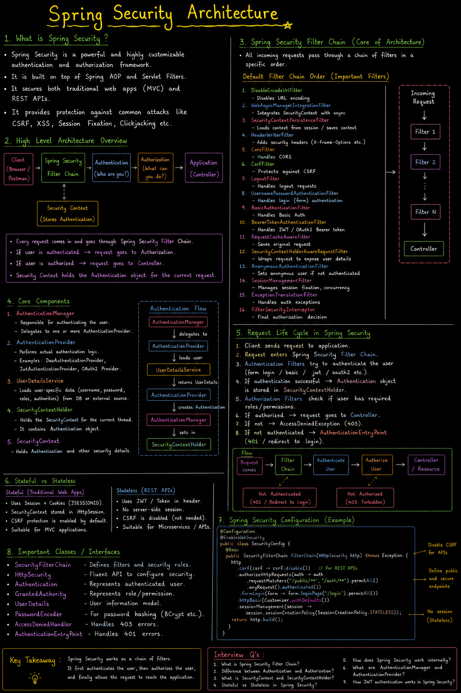

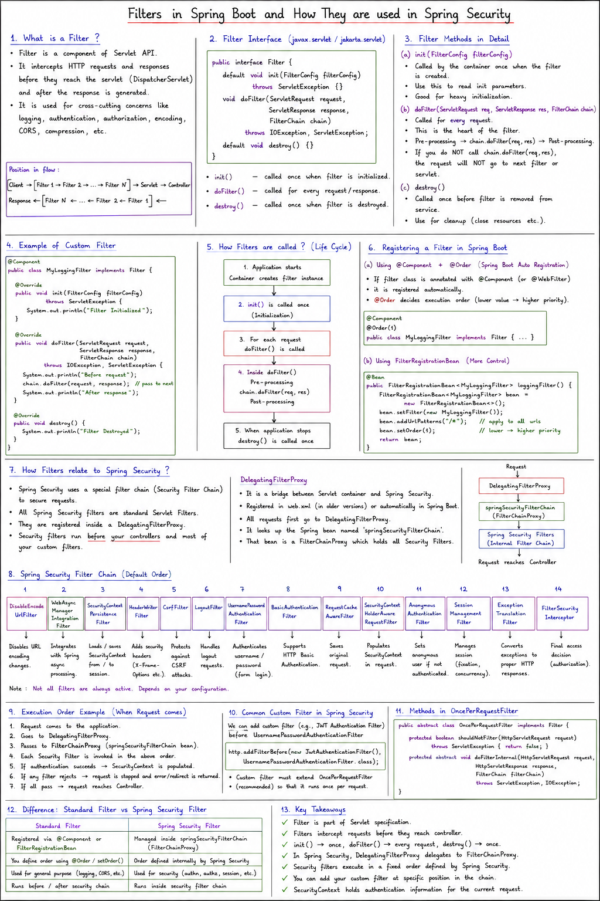

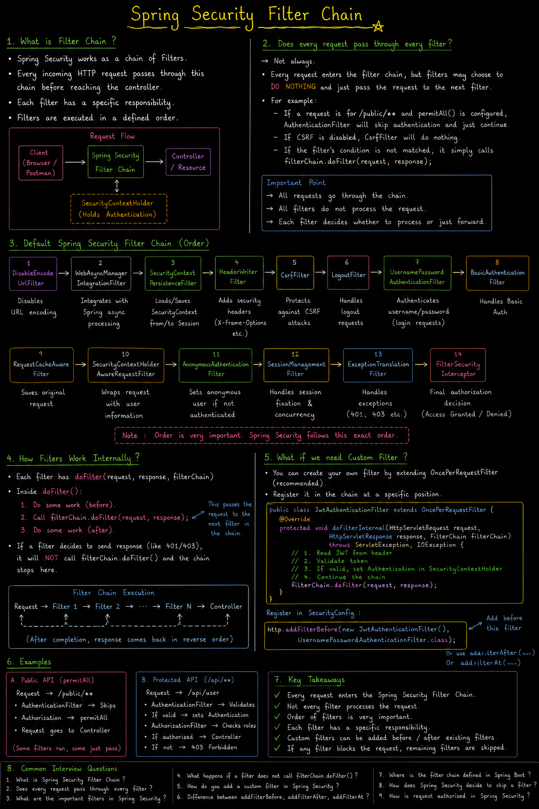


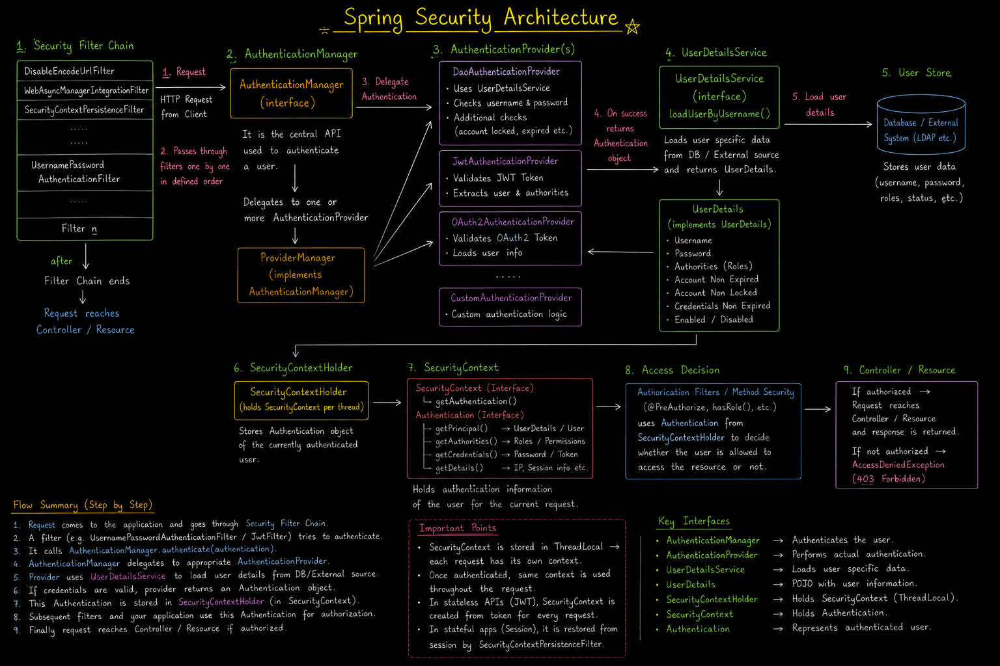

---

## SpringBoot Security - 1

There are various types of attacks:
- CSRF (Cross-Site Request Forgery)
- CORS (Cross-Origin Resource Sharing)
- SQL Injection
- XSS (Cross-Site Scripting)

And we need to protect our resources from these attacks, and for that we need proper:
- **Authentication**: Verify who you are
- **Authorization**: Checks what you are allowed to do

That's where Spring boot Security comes into the picture.

### Architecture of Spring Boot Security

In video no #18, we have already seen, what are filters and where exactly they fit.

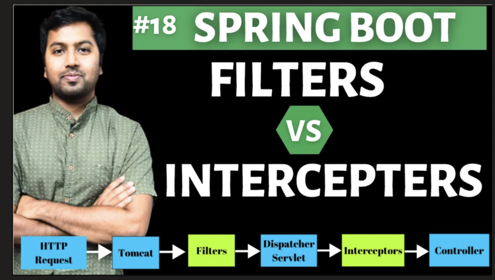

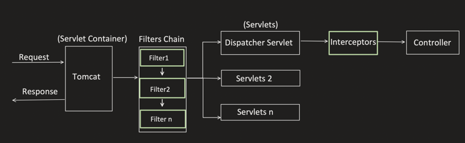

Now, lets enhance it for understanding Spring Security:

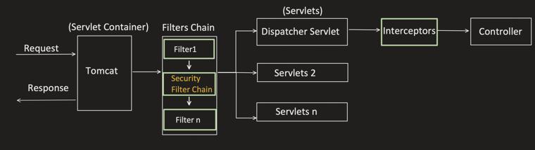

Within Security Filter Chain, the flow is:

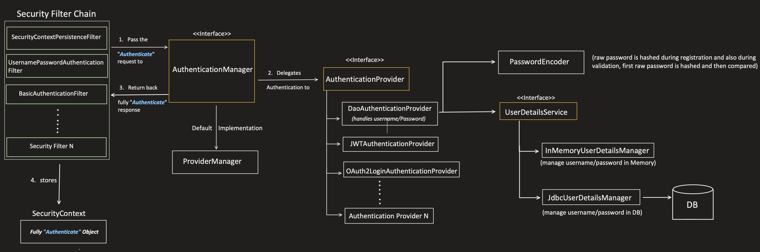

for each authentixation method ,there is different filter involved ,form based uses different filter ,jwt uses different , a request pass through filter chain ,if filter suppports the request then only filter is applied to that request.
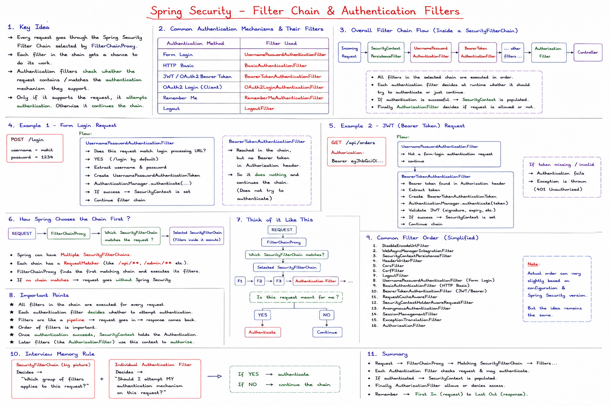

filter creates AUthentication object and pass to AuthneticationManager which checks returns same Authentication object but with check if it is authenticated or not.true??

Almost true. The key correction is: AuthenticationManager is not guaranteed to return the exact same object instance. It receives an unauthenticated Authentication and, after successful authentication, usually returns a new or richer authenticated Authentication object.

The authentication filter creates an unauthenticated Authentication object containing the credentials and passes it to AuthenticationManager. AuthenticationManager delegates to an appropriate AuthenticationProvider. If verification succeeds, it returns an authenticated Authentication object, usually containing the UserDetails principal and authorities. The filter then stores that returned object in the SecurityContext.

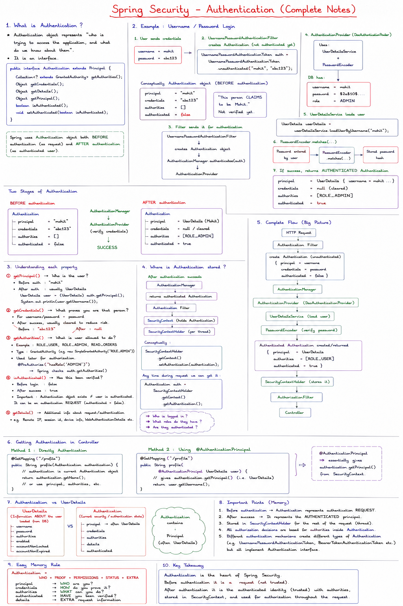

After successful authnetication we need to put this authentication object in security context.

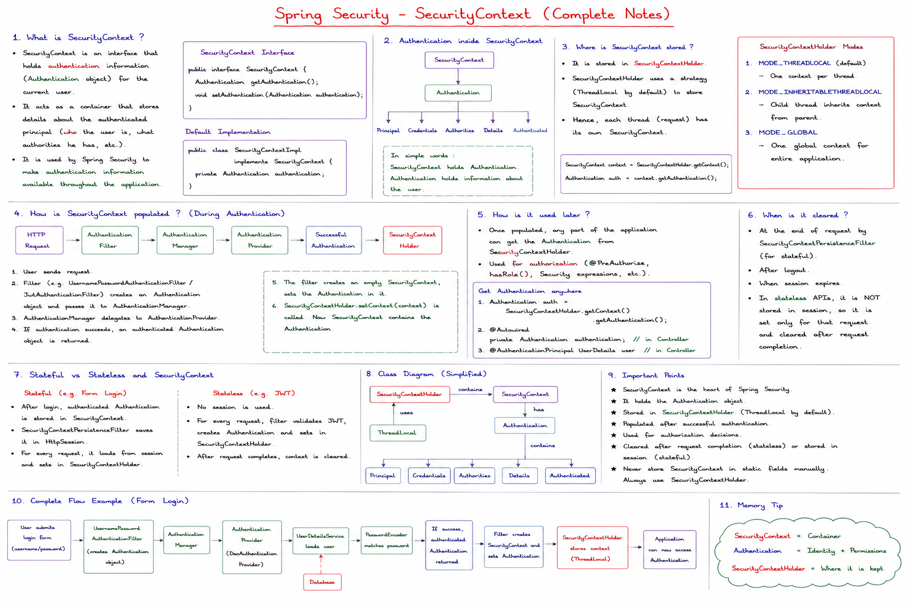

now this security contexct is added to your request and reach to your controller. so now controller can access secuirty context too

If spring boot project is already present, add below dependencies:

```xml
<dependency>
    <groupId>org.springframework.boot</groupId>
    <!--
    Provides core feature like:
    - Authentication
    - Authorization
    - Security filters etc.
    -->
    <artifactId>spring-boot-starter-security</artifactId>
</dependency>

<dependency>
    <groupId>org.springframework.session</groupId>
    <!--
    Enable persistent session management
    Using relational DB only then add it else no need
    -->
    <artifactId>spring-session-jdbc</artifactId>
</dependency>
```

If setting up new Spring boot project:

Go to spring initializer i.e. "start.spring.io"

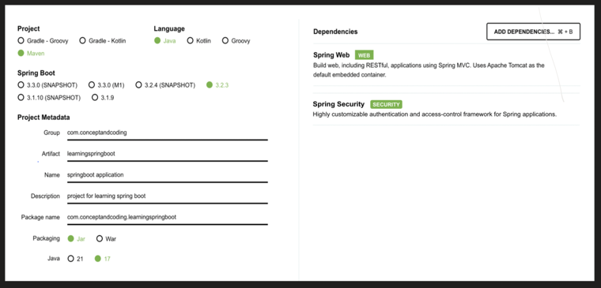

And if we want to persist the session in relational DB, then we need to add below dependency in pom.xml

```xml
<dependency>
    <groupId>org.springframework.session</groupId>
    <artifactId>spring-session-jdbc</artifactId>
</dependency>
```

Now, lets understand the end to end flow with an example for each individual Authentication and Authorization mechanism:

1. Form Login (Stateful)
2. Basic Authentication (Stateless)
3. JWT (Stateless)
4. OAuth2
   - a. Authorization Code (Stateful or Stateless)
   - b. Client Credentials (Stateless)
   - c. Password Grant (Stateless)
5. API Key Authentication (Stateless)

Etc..


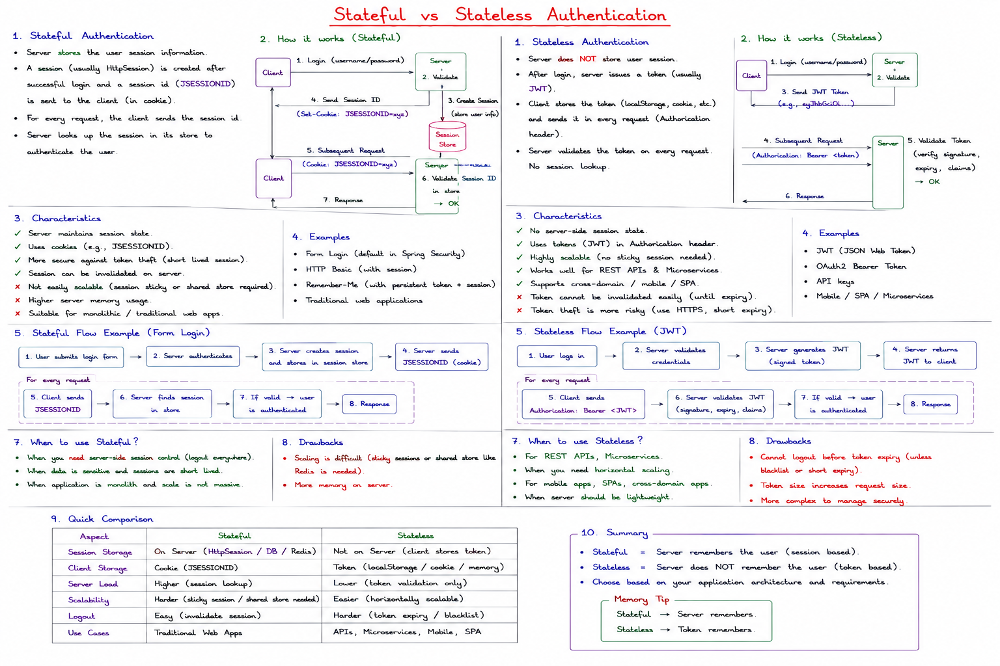