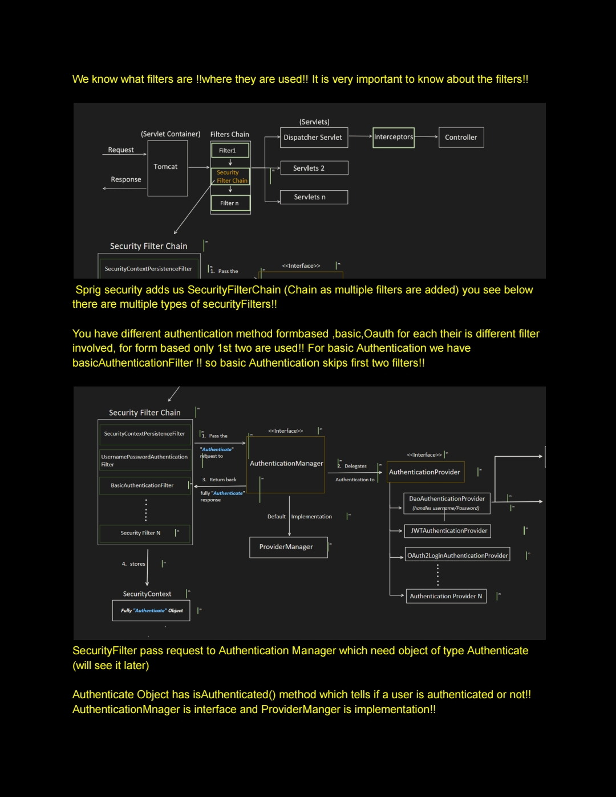

---

## SpringBoot Security - 1

There are various types of attacks:
- CSRF (Cross-Site Request Forgery)
- CORS (Cross-Origin Resource Sharing)
- SQL Injection
- XSS (Cross-Site Scripting)

And we need to protect our resources from these attacks, and for that we need proper:
- **Authentication**: Verify who you are
- **Authorization**: Checks what you are allowed to do

That's where Spring boot Security comes into the picture.

### Architecture of Spring Boot Security

In video no #18, we have already seen, what are filters and where exactly they fit.


Now, lets enhance it for understanding Spring Security:


Within Security Filter Chain, the flow is:


  
If spring boot project is already present, add below dependencies:

```xml
<dependency>
    <groupId>org.springframework.boot</groupId>
    <!--
    Provides core feature like:
    - Authentication
    - Authorization
    - Security filters etc.
    -->
    <artifactId>spring-boot-starter-security</artifactId>
</dependency>

<dependency>
    <groupId>org.springframework.session</groupId>
    <!--
    Enable persistent session management
    Using relational DB
    -->
    <artifactId>spring-session-jdbc</artifactId>
</dependency>
```

If setting up new Spring boot project:

Go to spring initializer i.e. "start.spring.io"


And if we want to persist the session in relational DB, then we need to add below dependency in pom.xml

```xml
<dependency>
    <groupId>org.springframework.session</groupId>
    <artifactId>spring-session-jdbc</artifactId>
</dependency>
```

Now, lets understand the end to end flow with an example for each individual Authentication and Authorization mechanism:

1. Form Login (Stateful)
2. Basic Authentication (Stateless)
3. JWT (Stateless)
4. OAuth2
   - a. Authorization Code (Stateful or Stateless)
   - b. Client Credentials (Stateless)
   - c. Password Grant (Stateless)
5. API Key Authentication (Stateless)

Etc..


