## SpringBoot Security - Part 2: User Creation

Before, we proceed with User Authentication and Authorization methods, we first need to see, User creation process because that's the first step.

Authentication and Authorization of User will happen only after User is created.

Lets see, what will happen when we add below security dependency, as seen in previous Architecture video and starts the server:

```xml
<dependency>
    <groupId>org.springframework.boot</groupId>
    <artifactId>spring-boot-starter-security</artifactId>
</dependency>
```

**Logs when server is started:**

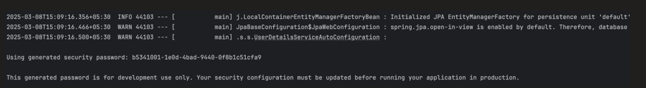

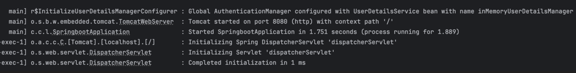

So, what exactly happened here?

During server startup, user is created automatically with default username: "user"

Random password is generated for testing.

Each time, server is restarted, new random password will get generated.

**SecurityProperties.java**

```java
public static class User {

    /** Default user name */
    private String name = "user";

    /** Password for the default username */
    private String password = UUID.randomUUID().toString();

    /** Granted roles for the default username */
    private List<String> roles = new ArrayList<>();

    private boolean passwordGenerated = true;

    // getters and setters
}
```

**@AutoConfiguration — UserDetailsServiceAutoConfiguration.java**

creates bean of  `InMemoryUserDetailsManager` which stores user details created above in memory.It get user from Security Properties.

```java
@Bean
public InMemoryUserDetailsManager inMemoryUserDetailsManager(
        SecurityProperties properties,
        ObjectProvider<PasswordEncoder> passwordEncoder) {

    SecurityProperties.User user = properties.getUser();
    List<String> roles = user.getRoles();

    return new InMemoryUserDetailsManager(
        User.withUsername(user.getName())
            .password(getOrDeducePassword(user, passwordEncoder.getIfAvailable()))
            .roles(StringUtils.toStringArray(roles))
            .build()
    );
}
```

`UserDetailsService` → `UserDetailsManager` → `InMemoryUserDetailsManager`:

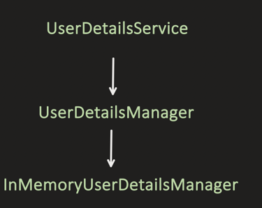

**InMemoryUserDetailsManager.java**
 This is InMemoryUserDetailsManager in which we put user . see here in `UserDetails` we put the data ,`UserDetails` is interface and `User` is the implementation.

```java
private final Map<String, MutableUserDetails> users = new HashMap<>();

public InMemoryUserDetailsManager(UserDetails... users) {
    for (UserDetails user : users) {
        createUser(user);
    }
}

@Override
public void createUser(UserDetails user) {
    Assert.isTrue(!userExists(user.getUsername()), "user should not exist");
    this.users.put(user.getUsername().toLowerCase(), new MutableUser(user));
}
```
see we know every class is singleton and in that we have `final` Map so that makes it a single map for no matter how many user comes.


now i want custom user and custom password.

### How we can control the user creation logic?

**1st: Using application.properties**
(not recommended, only for development and testing)

```properties
spring.security.user.name=my_username
spring.security.user.password=my_password
spring.security.user.roles=ADMIN
```

Internally, it uses reflection and calls `setUserName()` and `setPassword()` method of `SecurityProperties.java` and overrides the default values.

Now, during application startup, no default username and default password is created.

**2nd: By creating custom InMemoryUserDetailsManager Bean**
(not recommended, only for development and testing)

```java
@Configuration
@EnableWebSecurity
public class SecurityConfig {

    @Bean
    public UserDetailsService userDetailsService() {

        UserDetails user1 = User.withUsername("my_username_1")
                .password("{noop}my_password_1") // {noop} means no encoding or hashing
                .roles("ADMIN")
                .build();

        UserDetails user2 = User.withUsername("my_username_2")
                .password("{noop}1234") // {noop} means no encoding or hashing
                .roles("USER")
                .build();

        return new InMemoryUserDetailsManager(user1, user2);
    }
}
```

Why we are appending `{noop}` here?

The default format for storing the password is: `{id}encodedpassword`

`{id}` can be either:
- `{noop}`
- `{bcrypt}`
- `{sha256}`
- Etc..

During User password storing step, if we want to store user password without any encoding or hashing, then we store `"{noop}plain_password"`

Now, during authentication process:
1. 1st, it will fetch the user password from inMemory.
2. 2nd, it goes for comparing logic, inMemory password and password provided for authentication.
3. 3rd, it will take out the `{noop}` or `{bcrypt}` etc. from inMemory password.
4. 4th, Then if its `{noop}`, it will directly compare the remaining inMemory password and provided password for authentication.
5. 5th, if say its `{bcrypt}`, it first do hashing of provided password using `BCryptPasswordEncoder` and then match it with remaining inMemory Password.

Lets say, if we want to store the hashed password (hashed using bcrypt algorithm)

```java
@Configuration
@EnableWebSecurity
public class SecurityConfig {

    @Bean
    public UserDetailsService userDetailsService() {

        UserDetails user1 = User.withUsername("my_username_1")
                .password("{bcrypt}" + new BCryptPasswordEncoder().encode("my_password_1"))
                .roles("ADMIN")
                .build();

        return new InMemoryUserDetailsManager(user1);
    }
}
```

InMemory, password is stored as: `{bcrypt}hashed_password`

and during authentication, I am providing "my_password_1"

But still I am able to successfully authenticate because of `DelegatingPasswordEncoder`, it first checks the format of stored password `{id}` i.e. `{bcrypt}`, so it passes the incoming password to `BcryptPasswordEncoder`, and after hashing, it has done the matching.

`PasswordEncoder` hierarchy:

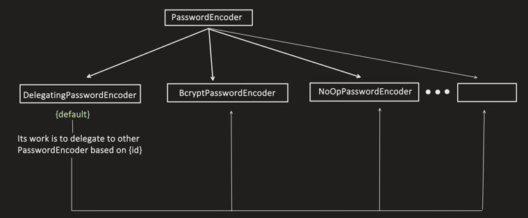

Testing login with this in-memory user:

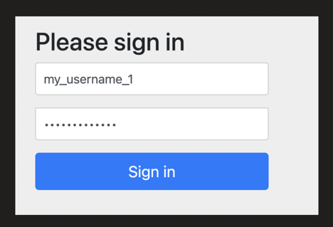

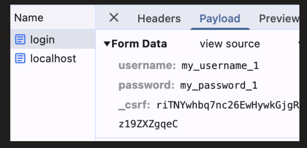

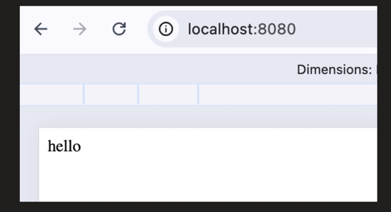

If, we don't want to store `{bcrypt}` or any other hashing algo `{id}` in front of password, then we can define which PasswordEncoder to use.

Now, since we are always using 1 encoding/hashing algorithm, and control will not goes to `DelegatingPasswordEncoder`, and it will directly goes to specific Password Encoder, so now no need to put `{id}` in front of password.

```java
@Configuration
@EnableWebSecurity
public class SecurityConfig {

    @Bean
    public PasswordEncoder passwordEncoder() {
        return new BCryptPasswordEncoder();
    }

    @Bean
    public UserDetailsService userDetailsService() {

        UserDetails user1 = User.withUsername("my_username_1")
                .password(new BCryptPasswordEncoder().encode("my_password_1"))
                .roles("ADMIN")
                .build();

        return new InMemoryUserDetailsManager(user1);
    }
}
```

we do not want in  memory we want to have UserDetails stored in DB

**3rd: Storing UserName and Password (after hashed) in DB**
(recommended for production)

---
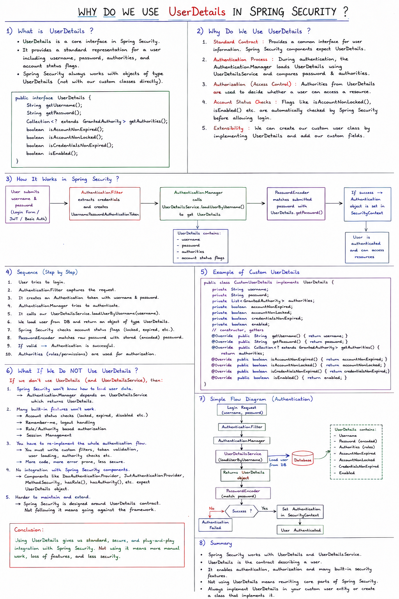

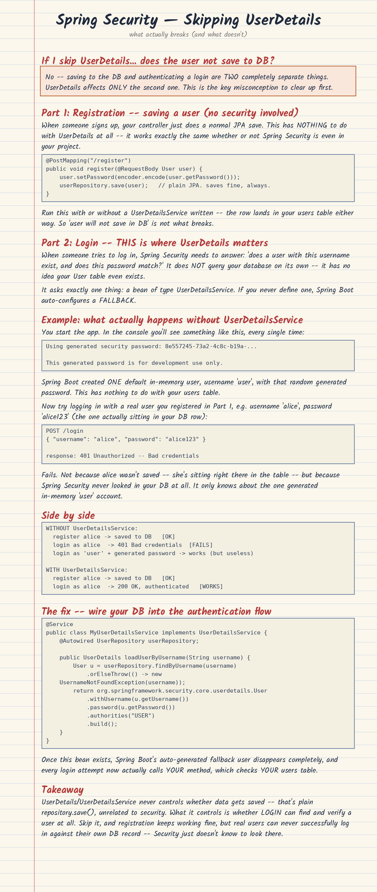

for each authentication we need to go and fetch the user. The return type after fetching from DB is `UserDetails` ,so springSecurity recognize only `UserDetails` object .We do not need to do mapping of UserAuthEntity

## `UserAuthEntity.java`

```java
@Entity
@Table(name = "user_auth")
public class UserAuthEntity implements UserDetails {

    @Id
    @GeneratedValue(strategy = GenerationType.IDENTITY)
    private Long id;

    @Column(unique = true, nullable = false)
    private String username;

    @Column(nullable = false)
    private String password;

    private String role;

    @Override
    public Collection<? extends GrantedAuthority> getAuthorities() {
        return List.of(new SimpleGrantedAuthority(role));
    }

    @Override
    public boolean isAccountNonExpired() { return true; }

    @Override
    public boolean isAccountNonLocked() { return true; }

    @Override
    public boolean isCredentialsNonExpired() { return true; }

    @Override
    public boolean isEnabled() { return true; }

    // Getters and Setters
    @Override
    public String getPassword() {
        return password;
    }

    @Override
    public String getUsername() {
        return username;
    }

    public void setPassword(String password) {
        this.password = password;
    }

    public String getRole() {
        return role;
    }

    public void setRole(String role) {
        this.role = role;
    }
}
```

---

## `UserAuthEntityRepository.java`

```java
@Repository
public interface UserAuthEntityRepository extends JpaRepository<UserAuthEntity, Long> {

    Optional<UserAuthEntity> findByUsername(String username);//springboot automatically creates query for this
}
```

---

## `UserAuthEntityService.java`

here we tell which table and which method to use to get UserDetails.

```java
@Service
public class UserAuthEntityService implements UserDetailsService {

    @Autowired
    private UserAuthEntityRepository userAuthEntityRepository;

    public UserAuthEntity save(UserAuthEntity userAuth) {
        return userAuthEntityRepository.save(userAuth);
    }
//see we returning UserAuthEntity not UserDetails
    @Override
    public UserAuthEntity loadUserByUsername(String username) throws UsernameNotFoundException {
        return userAuthEntityRepository.findByUsername(username)
                .orElseThrow(() -> new UsernameNotFoundException("User not found"));
    }
}
```
`UserDetailsService` has method `loadUserByUsername` retuning `UserDetails`,So if `UserAuthEnity` has not extended `UserDetails` then here `loadUserByUsername`  cannot return `UserAuthEntity`

---

## `UserAuthController.java`

```java
@RestController
@RequestMapping("/auth")
public class UserAuthController {

    @Autowired
    private UserAuthEntityService userAuthEntityService;

    @Autowired
    private PasswordEncoder passwordEncoder;

    @PostMapping("/register")
    public ResponseEntity<String> register(@RequestBody UserAuthEntity userAuthDetails) {
        // Hash the password before saving
        userAuthDetails.setPassword(passwordEncoder.encode(userAuthDetails.getPassword()));

        // Save user
        userAuthEntityService.save(userAuthDetails);
        return ResponseEntity.ok("User registered successfully!");
    }
}
```

Output:

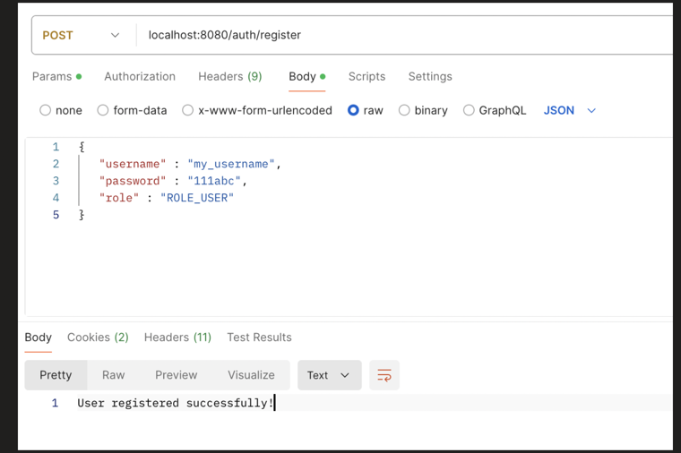

Now, by-default in spring boot security, all the endpoints are AUTHENTICATED, means we have to authenticate ourself by either username/password or JWT etc. to access any API, so how we will access "/auth/register" API, which is just a first step to create user.


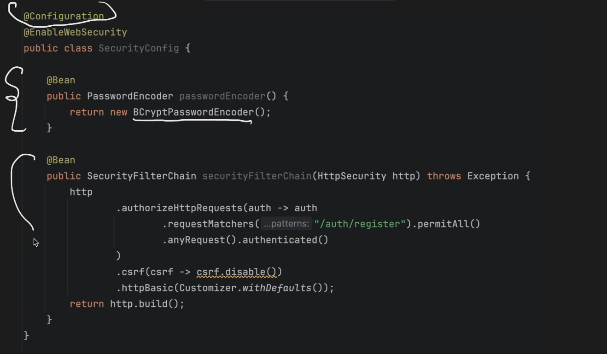

here we are saying `/auth/register` no auth is needed ,it is public.