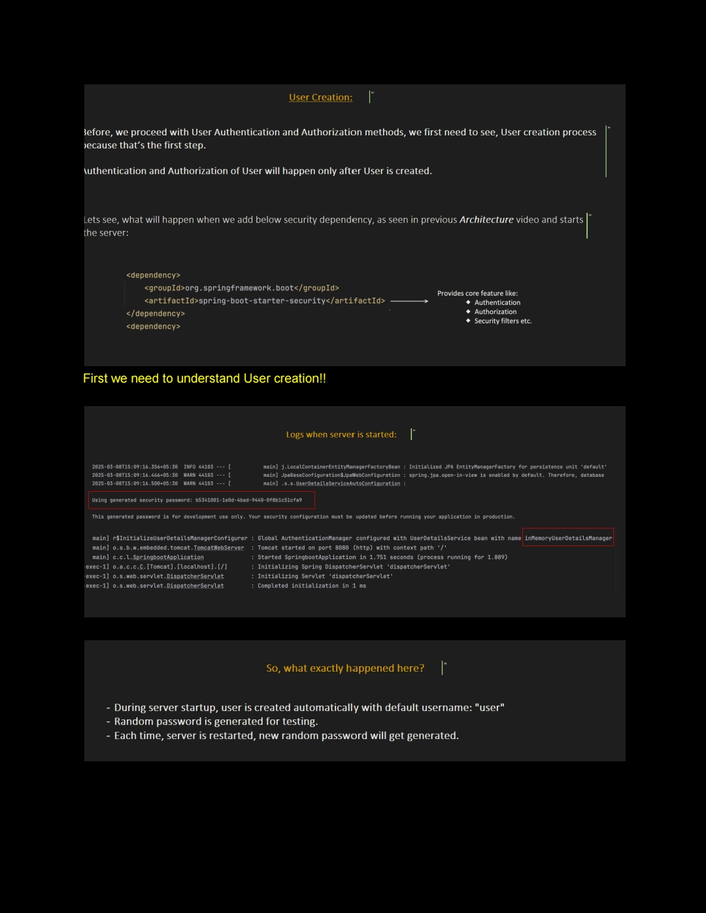
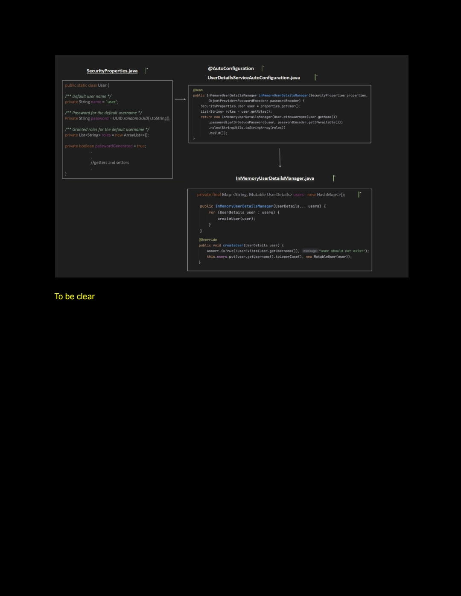
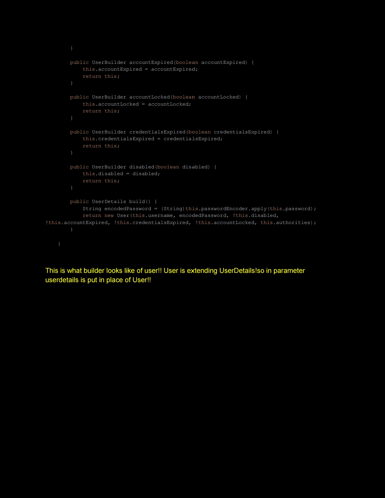
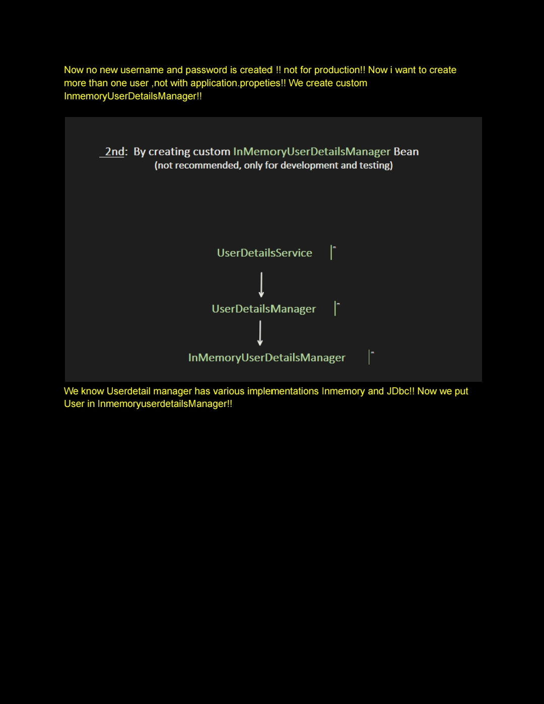
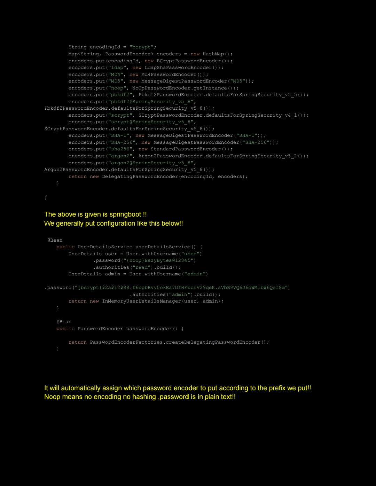
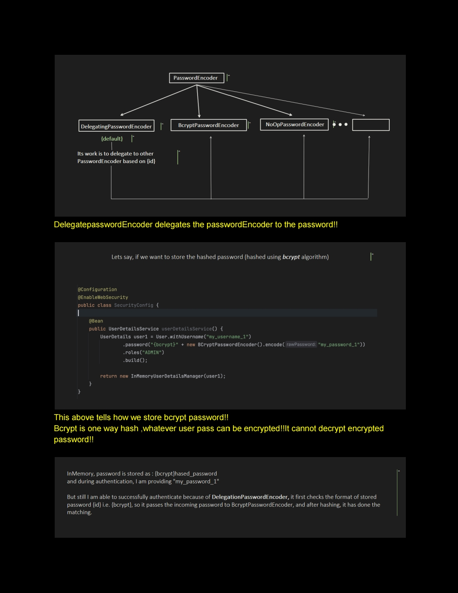
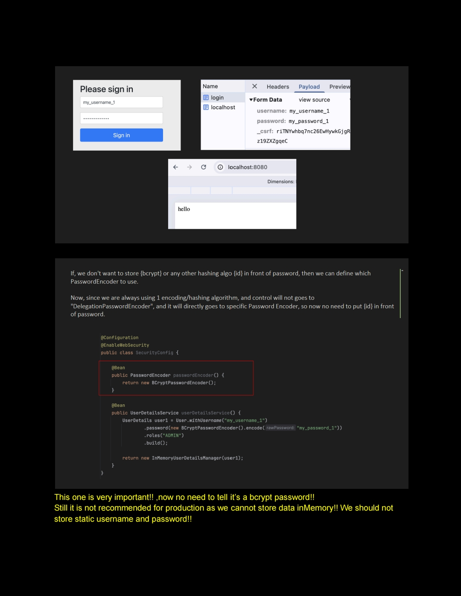
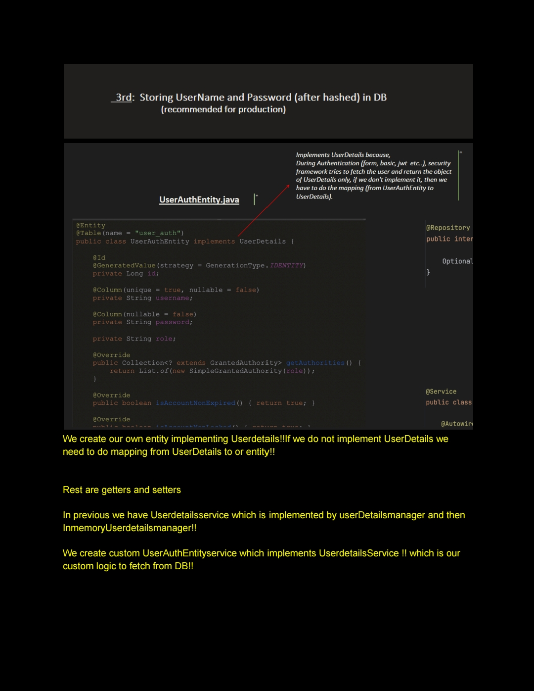

# Notes 

          


 
   


---

## `UserAuthEntity.java`

```java
@Entity
@Table(name = "user_auth")
public class UserAuthEntity implements UserDetails {

    @Id
    @GeneratedValue(strategy = GenerationType.IDENTITY)
    private Long id;

    @Column(unique = true, nullable = false)
    private String username;

    @Column(nullable = false)
    private String password;

    private String role;

    @Override
    public Collection<? extends GrantedAuthority> getAuthorities() {
        return List.of(new SimpleGrantedAuthority(role));
    }

    @Override
    public boolean isAccountNonExpired() { return true; }

    @Override
    public boolean isAccountNonLocked() { return true; }

    @Override
    public boolean isCredentialsNonExpired() { return true; }

    @Override
    public boolean isEnabled() { return true; }

    // Getters and Setters
    @Override
    public String getPassword() {
        return password;
    }

    @Override
    public String getUsername() {
        return username;
    }

    public void setPassword(String password) {
        this.password = password;
    }

    public String getRole() {
        return role;
    }

    public void setRole(String role) {
        this.role = role;
    }
}
```

---

## `UserAuthEntityRepository.java`

```java
@Repository
public interface UserAuthEntityRepository extends JpaRepository<UserAuthEntity, Long> {

    Optional<UserAuthEntity> findByUsername(String username);
}
```

---

## `UserAuthEntityService.java`

```java
@Service
public class UserAuthEntityService implements UserDetailsService {

    @Autowired
    private UserAuthEntityRepository userAuthEntityRepository;

    public UserAuthEntity save(UserAuthEntity userAuth) {
        return userAuthEntityRepository.save(userAuth);
    }

    @Override
    public UserAuthEntity loadUserByUsername(String username) throws UsernameNotFoundException {
        return userAuthEntityRepository.findByUsername(username)
                .orElseThrow(() -> new UsernameNotFoundException("User not found"));
    }
}
```

---

## `UserAuthController.java`

```java
@RestController
@RequestMapping("/auth")
public class UserAuthController {

    @Autowired
    private UserAuthEntityService userAuthEntityService;

    @Autowired
    private PasswordEncoder passwordEncoder;

    @PostMapping("/register")
    public ResponseEntity<String> register(@RequestBody UserAuthEntity userAuthDetails) {
        // Hash the password before saving
        userAuthDetails.setPassword(passwordEncoder.encode(userAuthDetails.getPassword()));

        // Save user
        userAuthEntityService.save(userAuthDetails);
        return ResponseEntity.ok("User registered successfully!");
    }
}
```

---

## `SecurityConfig.java`

```java
@Configuration
@EnableWebSecurity
public class SecurityConfig {

    @Bean
    public PasswordEncoder passwordEncoder() {
        return new BCryptPasswordEncoder();
    }

    @Bean
    public SecurityFilterChain securityFilterChain(HttpSecurity http) throws Exception {
        http
            .authorizeHttpRequests(auth -> auth
                .requestMatchers("/auth/register").permitAll()
                .anyRequest().authenticated()
            )
            .csrf(csrf -> csrf.disable())
            .httpBasic(Customizer.withDefaults());

        return http.build();
    }
}
```


     


