## Form Login Authentication


It's a stateful authentication method.

Stateful authentication means, server maintains the user authentication state (aka Session).

So that user don't have to provide username/password every time with each request.

User enters their credentials (i.e. username/password) in an HTML login form.

On successful authentication, a session (JSESSIONID) is created to maintain the user authentication state across different requests.

Now, with subsequent request, client only passes JSESSIONID and not username/password. And server validates it with stored JSESSIONID.

It's a Default Authentication Method of Springboot Security.

Default Login URL: `/login`
Default Logout URL: `/logout`

H2 console — `user_auth` table (user already exists, from previous "User Creation" video), password stored hashed:

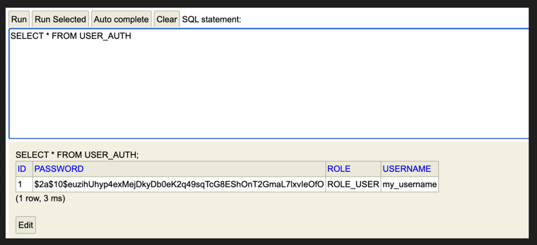

By default, Time to live for the HTTP Session is 30mins (depends on servlet container). But we can configure it too.

Yes, we can store the HTTP Session in DB too.

**application.properties**

```properties
server.servlet.session.timeout=1m
```

Now, after 1 minute of inactivity, makes the session expires.

If user keep doing activity then it will not be expired . It will expire only after 1m of in activity.

Note: if user activity keeps on happening, it will keep on re-authenticating and after 1 min session will not get expired.

We can also store the session in the DB.

Add below dependency in Pom.xml

```xml
<dependency>
    <groupId>org.springframework.session</groupId>
    <artifactId>spring-session-jdbc</artifactId>
</dependency>
```

Add below config in application.properties

```properties
spring.session.store-type=jdbc

## create session table for me
spring.session.jdbc.initialize-schema=always 

server.servlet.session.timeout=5m
```

SpringBoot, will automatically create and manage "SPRING_SESSION" table for us.

This expiry time, will keep on increasing, if user keep on sending request.

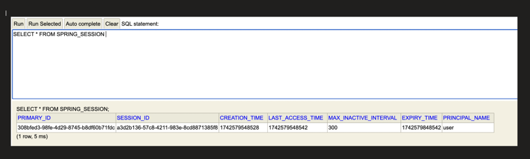

### Flow diagram for Form based Authentication Method

**1. User is log-in for the first time**, means Session does not exist at this point of time, only user exists. "/login" api is invoked.

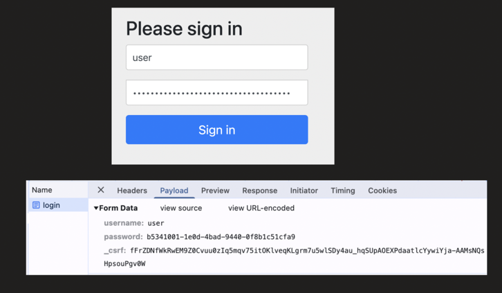

The general Client ↔ Server JSESSIONID exchange:

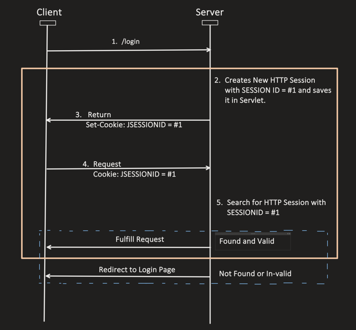

see after 5th step in diagram session id is invalid or already expired so it is redirected to login page.

Generally we store session on servers

It has problem if we have multiple servers,then we do not store session in server we store in db.as same user having acting sesssion who logged in by server1 can give request to server2

Within Security Filter Chain, the flow is:

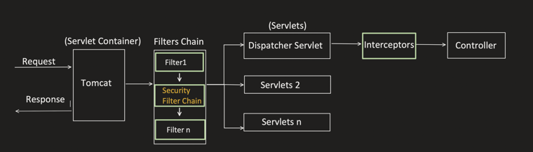

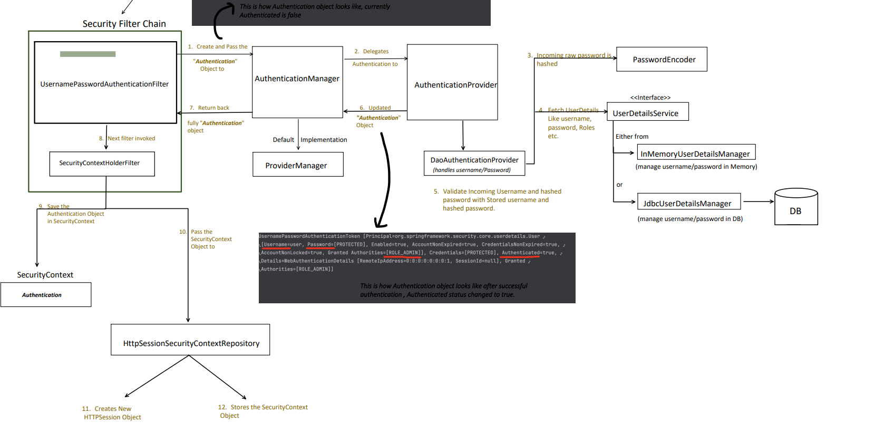

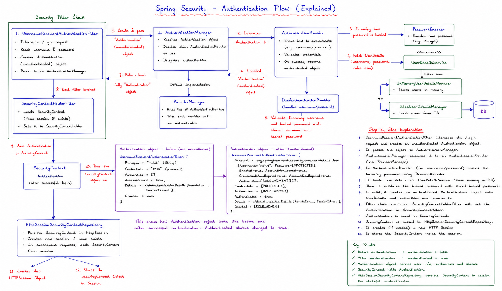
**After successful authentication:**
- If `/login` endpoint was used, then it will try to hit default endpoint by providing username and password.
- If any specific endpoint was used, then after successful authentication, that specific endpoint will only get invoked.

`/login` → hits default endpoint (`/`):

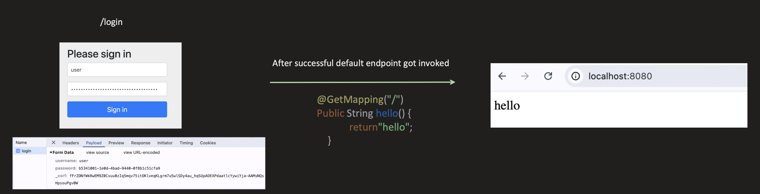

Accessing `/users` first redirects to login page; after successful authentication, redirected back to `/users`:

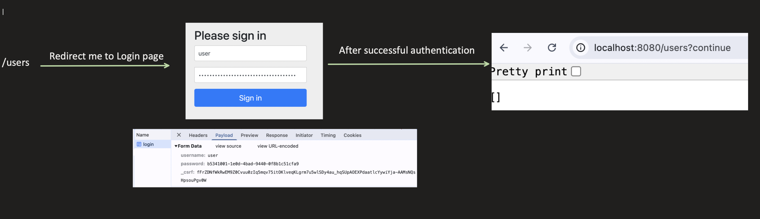

**2. After Authentication, User is invoking any subsequent APIs**

Within Security Filter Chain, the flow is:

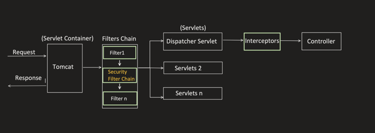

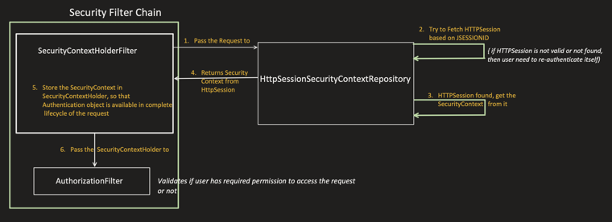


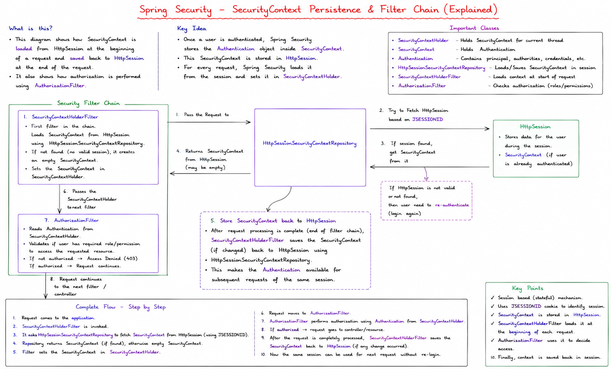

If we just see, we don't have to write a single line of code, its all handled via framework only. As it's a default authentication method of Springboot security.

see here we are using `SecurityContextHolderFilter` not `UserNamePasswordAuthenticationFilter` ,for every subsequent seesion we passing sessionid to server.


**SpringBootWebSecurityConfiguration**

```java
@Bean
@Order(SecurityProperties.BASIC_AUTH_ORDER)
SecurityFilterChain defaultSecurityFilterChain(HttpSecurity http) throws Exception {

    http.authorizeHttpRequests((requests) ->
        requests.anyRequest().authenticated()
    );
    http.formLogin(withDefaults());
    http.httpBasic(withDefaults());

    return http.build();
}
```
see here above we have basic and formLogin as defaulyt set up in `defaultSecurityFilterChain`


Now All we have added is dependency and config.

**Pom.xml**

```xml
<dependency>
    <groupId>org.springframework.boot</groupId>
    <artifactId>spring-boot-starter-security</artifactId>
</dependency>

<dependency>
    <groupId>org.springframework.session</groupId>
    <artifactId>spring-session-jdbc</artifactId>
</dependency>
```

**Application.properties**

```properties
spring.security.user.name=user
spring.security.user.password=pass
spring.session.store-type=jdbc
# spring create db for me
spring.session.jdbc.initialize-schema=always
server.servlet.session.timeout=5m
```

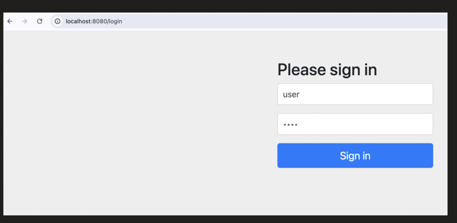

Since `spring.session.store-type=jdbc` is used, the cookie is named `SESSION` (not `JSESSIONID`):

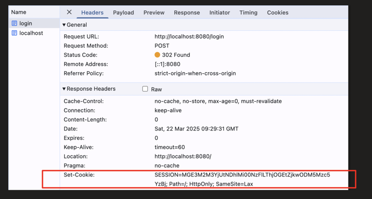

Subsequent request to `/users`, cookie automatically sent by browser:

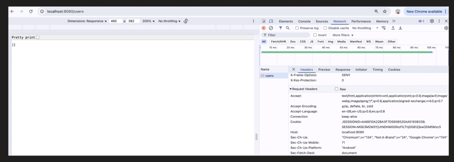

Now, lets say, I want to change few things like:
- Default login and logout page
- Need to relax authentication on few endpoints for public apis 
- Etc..

Then we can override above default SecurityFilterChain method

```java
@Configuration
@EnableWebSecurity
public class SecurityConfig {

    @Bean
    public SecurityFilterChain securityFilterChain(HttpSecurity http) throws Exception {
        http
            .authorizeHttpRequests(auth -> auth
                .requestMatchers("/users").permitAll()//users api is public api else all request be authenticated
                .anyRequest().authenticated()
            )
            .formLogin(Customizer.withDefaults());

        return http.build();
    }
}
```

### Authorization

Now, form based Authentication is clear, but still one thing is left i.e. AuthorizationFilter.

Once the user is Authenticated, and when user is trying to access any resource, authorization check is mandatory. It is done to make sure, User has the permission to access it.

By-default, SpringBoot Security do not put any restriction on any resource, we have to do it manually.

```java
@Configuration
@EnableWebSecurity
public class SecurityConfig {

    @Bean
    public SecurityFilterChain securityFilterChain(HttpSecurity http) throws Exception {
        http
            .authorizeHttpRequests(auth -> auth
                .requestMatchers("/users").hasRole("USER")
                .anyRequest().authenticated()
            )
            .formLogin(Customizer.withDefaults());

        return http.build();
    }
}
```

**Application.properties**

```properties
#creating username and password and assigning the ROLE to the user
spring.security.user.name=user
spring.security.user.password=pass
spring.security.user.roles=USER

#just for storing the session details in DB
spring.session.store-type=jdbc
spring.session.jdbc.initialize-schema=always
server.servlet.session.timeout=5m
```

Now I am manually restricting that any user trying to access "/users" endpoint, should have "ROLE_USER" role.

While using `hasRole`, we don't need to add "ROLE_" — it get appended automatically.

Now in AuthorizationFilter, it will validate does endpoint has any restriction (i.e. user should have any specific role), if Yes, then it matches the role present in SecurityContext and what is required for the endpoint.

If required role is missing, it will throw FORBIDDEN exception.


Generally, we can give any name to the Role like ADMIN, USER, ANONYMOUS etc.. As its just a String. But should follow the proper meaning.

Also more than 1 roles can be assigned to a User.

```java
@Configuration
@EnableWebSecurity
public class SecurityConfig {

    @Bean
    public SecurityFilterChain securityFilterChain(HttpSecurity http) throws Exception {
        http
            .authorizeHttpRequests(auth -> auth
                .requestMatchers("/users").hasAnyRole("USER", "ADMIN")
                .anyRequest().authenticated()
            )
            .formLogin(Customizer.withDefaults());

        return http.build();
    }
}
```

```properties
#creating username and password and assigning the ROLE to the user
spring.security.user.name=user
spring.security.user.password=pass
spring.security.user.roles=USER,ADMIN

#just for storing the session details in DB
spring.session.store-type=jdbc
spring.session.jdbc.initialize-schema=always
server.servlet.session.timeout=5m
```

Authorization actually has 2 phases:

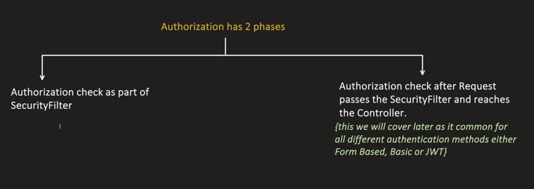

### How to control the Sessions per user?

1 user can keep on login in different browsers, so how to restrict per user session limit.

```java
@Configuration
@EnableWebSecurity
public class SecurityConfig {

    @Bean
    public SecurityFilterChain securityFilterChain(HttpSecurity http) throws Exception {
        http
            .authorizeHttpRequests(auth -> auth
                .requestMatchers("/users").hasRole("USER")
                .anyRequest().authenticated()
            )
            .sessionManagement(session -> session
                .maximumSessions(1)
                .maxSessionsPreventsLogin(true)
            )
            .formLogin(Customizer.withDefaults());

        return http.build();
    }
}
```

Already logged in on 1 browser, trying to log in via a different browser for the same user:

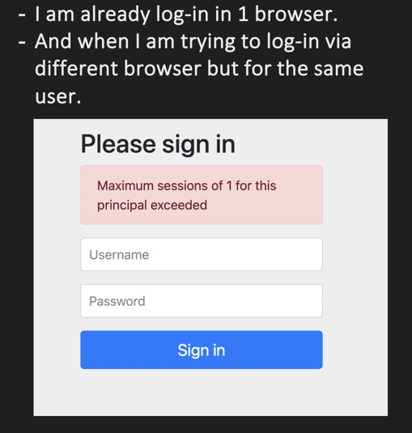

### What are Session Creation Policies?

```java
@Configuration
@EnableWebSecurity
public class SecurityConfig {

    @Bean
    public SecurityFilterChain securityFilterChain(HttpSecurity http) throws Exception {
        http
            .authorizeHttpRequests(auth -> auth
                .requestMatchers("/users").hasRole("USER")
                .anyRequest().authenticated()
            )
            .sessionManagement(session -> session
                .sessionCreationPolicy(SessionCreationPolicy.IF_REQUIRED)
            )
            .formLogin(Customizer.withDefaults());

        return http.build();
    }
}
```

| Policy | Description |
|---|---|
| `IF_REQUIRED` | HttpSession is only created when needed (**DEFAULT**). For example: public api for which authentication is not required, HTTPSession will not be created if this policy will be chosen. |
| `ALWAYS` | HttpSession is always created. If already present then use it. For example: even for public api for which authentication is not required, HTTPSession will be created if this policy will be chosen. |
| `NEVER` | Do not creates a Session, but use if present. |
| `STATELESS` | No Session is created, used for Stateless applications. |

### Disadvantages of Form based authentication

1. **Vulnerable to Security issues like CSRF and Session hijacking**: By default, CSRF is enabled for form based login and we should not disable it.

```java
@Configuration
@EnableWebSecurity
public class SecurityConfig {

    @Bean
    public SecurityFilterChain securityFilterChain(HttpSecurity http) throws Exception {
        http
            .authorizeHttpRequests(auth -> auth
                .anyRequest().authenticated()
            )
            .csrf(csrf -> csrf.disable()) // we should not do this for form based authentication
            .formLogin(Customizer.withDefaults());

        return http.build();
    }
}
```

2. **Session Management is big overhead** and in case of distributed system it can lead to scalability issue.

3. **Database load**: if there are multiple servers then we might need to store the session in DB or Cache, which again required memory and lookup time. Which can cause latency issue.


