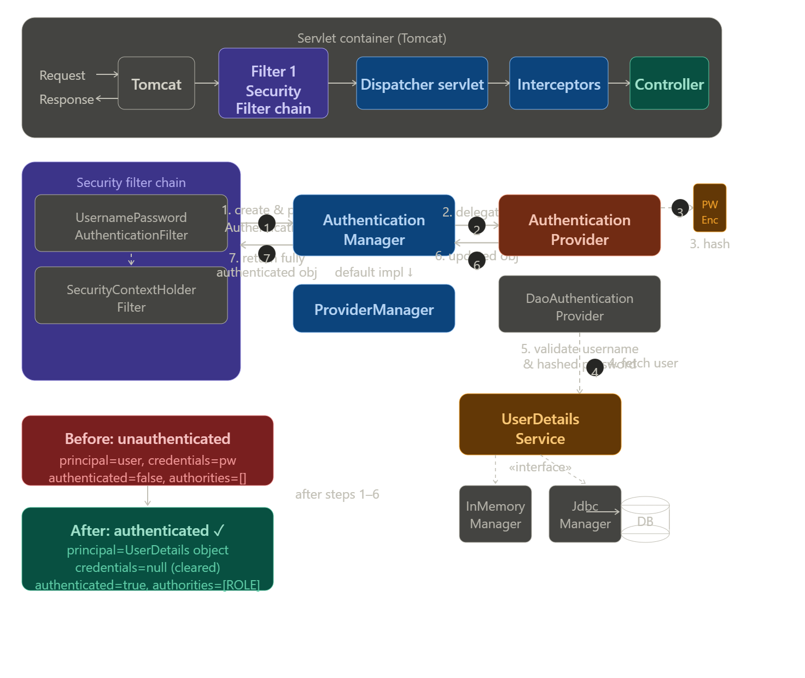
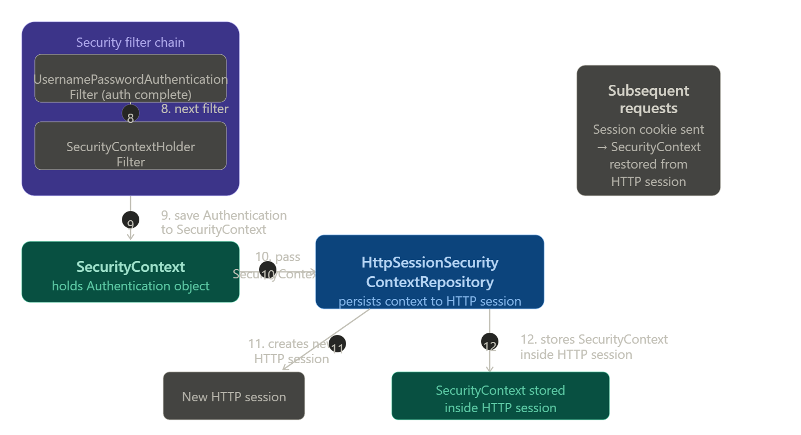
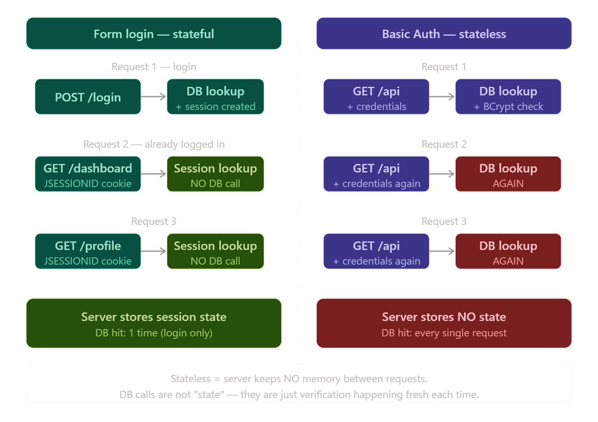

# Notes 


  
 
   
  
    
 






This is a detailed diagram showing the full Spring Security flow from the servlet container all the way down to session storage. I'll break it into two clean diagrams — the top half (servlet container + filter chain + authentication) and the bottom half (SecurityContext + session persistence).The diagram above covers steps 1–7: from the request entering Tomcat, through the filter chain, into AuthenticationManager → ProviderManager → DaoAuthenticationProvider → UserDetailsService + PasswordEncoder, and back. Now here is the second half — what happens after the authenticated object is returned to the filter chain:Here is the full 12-step explanation matching every numbered step in your image:

**Steps 1–2** — `UsernamePasswordAuthenticationFilter` intercepts the login request and creates an `Authentication` object with `authenticated=false`, wrapping the raw username and password.

**Step 2** — The filter calls `AuthenticationManager.authenticate()`, which is implemented by `ProviderManager`.

**Step 3** — `ProviderManager` delegates to `DaoAuthenticationProvider`, which immediately hashes the incoming raw password via `PasswordEncoder`.

**Step 4** — `DaoAuthenticationProvider` calls `UserDetailsService.loadUserByUsername()` to fetch the full user record (username, stored hash, roles) from either `InMemoryUserDetailsManager` or `JdbcUserDetailsManager` (→ DB).

**Step 5** — The provider compares the hashed incoming password with the stored hash. If they match, authentication succeeds.

**Step 6** — A new `Authentication` object is built with `authenticated=true`, the `UserDetails` as principal, credentials cleared to `null`, and `GrantedAuthority` list populated.

**Step 7** — This fully authenticated object is returned back up to the filter.

**Step 8** — The next filter in the chain, `SecurityContextHolderFilter`, is invoked.

**Step 9** — `SecurityContextHolderFilter` saves the `Authentication` object into the `SecurityContext`, which lives in a thread-local `SecurityContextHolder`.

**Step 10** — The `SecurityContext` is passed to `HttpSessionSecurityContextRepository`.

**Step 11** — A new HTTP session object is created.

**Step 12** — The `SecurityContext` is stored inside the HTTP session. On every subsequent request, the session cookie is sent by the browser and Spring restores the `SecurityContext` automatically — so the user doesn't have to log in again.

Here is the complete breakdown — what Spring Security gives you automatically vs what you must write yourself, with code for every step.

---

## Step 1–2: Filter intercepts request → creates Authentication object

**Who writes this:** Spring Security gives you this automatically. You write nothing.

`UsernamePasswordAuthenticationFilter` is built into Spring Security. When you hit `POST /login`, it automatically reads the `username` and `password` from the request and creates this object internally:

```java
// Spring Security creates this INTERNALLY — you never write this
UsernamePasswordAuthenticationToken authToken =
    new UsernamePasswordAuthenticationToken(
        username,       // principal (just a string at this point)
        password        // credentials (raw password)
    );
// At this stage:
// authenticated = false
// authorities   = [] (empty)
// credentials   = "111abc" (raw, not yet hashed)
```

The only thing you configure is which URL triggers this filter, done in your `SecurityConfig`:

```java
// YOU write this in SecurityConfig.java
@Bean
public SecurityFilterChain securityFilterChain(HttpSecurity http) throws Exception {
    http
        .authorizeHttpRequests(auth -> auth
            .requestMatchers("/auth/register").permitAll()
            .anyRequest().authenticated()
        )
        .csrf(csrf -> csrf.disable())
        .httpBasic(Customizer.withDefaults()); // enables the filter
    return http.build();
}
```

---

## Step 2: Filter → AuthenticationManager (ProviderManager)

**Who writes this:** Spring Security gives you this automatically.

The filter internally calls `authenticationManager.authenticate(authToken)`. The default implementation of `AuthenticationManager` is `ProviderManager` — Spring wires this up automatically. You don't write any of this logic.

However, if you want to expose `AuthenticationManager` as a bean (needed for manual auth like JWT), you write this:

```java
// YOU write this ONLY if you need AuthenticationManager as a bean
// (e.g. for custom JWT login endpoint)
@Bean
public AuthenticationManager authenticationManager(
        AuthenticationConfiguration config) throws Exception {
    return config.getAuthenticationManager();
}
```

---

## Step 3: PasswordEncoder hashes the incoming password

**Who writes this:** You register the bean. Spring Security uses it automatically.

You must declare which `PasswordEncoder` to use. Without this bean, Spring Security throws an error.

```java
// YOU write this in SecurityConfig.java
@Bean
public PasswordEncoder passwordEncoder() {
    return new BCryptPasswordEncoder();
    // BCrypt automatically salts + hashes
    // "111abc" → "$2a$10$euzihUhyp4exMejDky..."
}
```

Spring Security's `DaoAuthenticationProvider` picks up this bean automatically and uses it internally to hash the incoming password before comparing.

---

## Step 4: DaoAuthenticationProvider → calls UserDetailsService

**Who writes this:** You write `UserDetailsService`. Spring Security calls it automatically.

`DaoAuthenticationProvider` is provided by Spring Security. But it needs to know how to load your user — so it calls `loadUserByUsername()` on whichever `UserDetailsService` bean you registered.

```java
// YOU write this — UserAuthEntityService.java
@Service
public class UserAuthEntityService implements UserDetailsService {

    @Autowired
    private UserAuthEntityRepository userAuthEntityRepository;

    @Override
    public UserDetails loadUserByUsername(String username)
            throws UsernameNotFoundException {
        // Spring Security calls this method automatically
        // YOUR job: fetch the user from wherever they are stored
        return userAuthEntityRepository.findByUsername(username)
                .orElseThrow(() ->
                    new UsernameNotFoundException("User not found"));
    }
}
```

And your entity must implement `UserDetails` so Spring Security can read it:

```java
// YOU write this — UserAuthEntity.java
@Entity
@Table(name = "user_auth")
public class UserAuthEntity implements UserDetails {  // <-- YOU implement this

    @Column(unique = true, nullable = false)
    private String username;

    @Column(nullable = false)
    private String password;  // stored as BCrypt hash

    private String role;

    @Override
    public Collection<? extends GrantedAuthority> getAuthorities() {
        // Spring Security reads this to know the user's roles
        return List.of(new SimpleGrantedAuthority(role));
    }

    // Spring Security reads these to check account status
    @Override public boolean isAccountNonExpired()     { return true; }
    @Override public boolean isAccountNonLocked()      { return true; }
    @Override public boolean isCredentialsNonExpired() { return true; }
    @Override public boolean isEnabled()               { return true; }

    @Override public String getPassword() { return password; }
    @Override public String getUsername() { return username; }
}
```

And the repository Spring Data generates for you:

```java
// YOU write this interface — Spring Data generates the SQL automatically
@Repository
public interface UserAuthEntityRepository
        extends JpaRepository<UserAuthEntity, Long> {

    // Spring Data generates: SELECT * FROM user_auth WHERE username = ?
    Optional<UserAuthEntity> findByUsername(String username);
}
```

---

## Step 5: Provider validates password

**Who writes this:** Spring Security does this automatically using your `PasswordEncoder` bean.

`DaoAuthenticationProvider` internally does this — you never write it:

```java
// Spring Security does this INTERNALLY — you never write this
boolean matches = passwordEncoder.matches(
    rawPasswordFromRequest,      // "111abc"
    userDetails.getPassword()    // "$2a$10$euzihUhyp4exMejDky..."
);

if (!matches) {
    throw new BadCredentialsException("Wrong password");
}
```

---

## Step 6: Provider returns fully authenticated object

**Who writes this:** Spring Security does this automatically.

After successful validation, `DaoAuthenticationProvider` internally builds a new token — you never write this:

```java
// Spring Security does this INTERNALLY
UsernamePasswordAuthenticationToken authenticated =
    new UsernamePasswordAuthenticationToken(
        userDetails,                    // principal = full UserDetails object
        null,                           // credentials = null (cleared for safety)
        userDetails.getAuthorities()    // [ROLE_USER]
    );
// authenticated = true now
```

---

## Step 7: Result returns to filter

**Who writes this:** Spring Security does this automatically.

The authenticated token bubbles back through `ProviderManager` → filter. No code from you needed.

---

## Steps 8–9: SecurityContextHolderFilter saves to SecurityContext

**Who writes this:** Spring Security does this automatically.

`SecurityContextHolderFilter` is built-in. After the previous filter completes, it stores the result:

```java
// Spring Security does this INTERNALLY
SecurityContext context = SecurityContextHolder.createEmptyContext();
context.setAuthentication(authentication);
SecurityContextHolder.setContext(context);
```

You can read it anywhere in your application though:

```java
// YOU can read it anywhere — in any controller or service
Authentication auth = SecurityContextHolder.getContext().getAuthentication();
String username = auth.getName();                    // "my_username"
Object principal = auth.getPrincipal();             // UserAuthEntity object
Collection<?> roles = auth.getAuthorities();        // [ROLE_USER]
boolean isAuth = auth.isAuthenticated();            // true
```

---

## Steps 10–12: HttpSessionSecurityContextRepository → HTTP Session

**Who writes this:** Spring Security does this automatically.

Spring Security automatically persists the `SecurityContext` into the HTTP session. On every subsequent request, `SecurityContextPersistenceFilter` (or `SecurityContextHolderFilter` in newer versions) restores it automatically from the session cookie.

```java
// Spring Security does this INTERNALLY on every request:
// 1. Read JSESSIONID cookie from request
// 2. Load SecurityContext from session
// 3. Put it into SecurityContextHolder
// 4. After request completes → save updated SecurityContext back to session
```

You only configure session behaviour if you want to customise it:

```java
// YOU write this ONLY if you want to customise session behaviour
http.sessionManagement(session -> session
    .sessionCreationPolicy(SessionCreationPolicy.STATELESS) // for JWT — no session
    // OR
    .sessionCreationPolicy(SessionCreationPolicy.IF_REQUIRED) // default — create if needed
);
```

---

## Registration: the one flow you fully own

The `/auth/register` endpoint is entirely your code — Spring Security has no built-in registration:

```java
// YOU write all of this — UserAuthController.java
@RestController
@RequestMapping("/auth")
public class UserAuthController {

    @Autowired private UserAuthEntityService userAuthEntityService;
    @Autowired private PasswordEncoder passwordEncoder;

    @PostMapping("/register")
    public ResponseEntity<String> register(
            @RequestBody UserAuthEntity userAuthDetails) {

        // Hash password BEFORE saving — never store plain text
        userAuthDetails.setPassword(
            passwordEncoder.encode(userAuthDetails.getPassword())
        );

        userAuthEntityService.save(userAuthDetails);
        return ResponseEntity.ok("User registered successfully!");
    }
}
```

---

## Summary table

| Step | What happens | Who writes it |
|---|---|---|
| Filter intercepts login | Creates unauthenticated token | Spring Security (automatic) |
| Calls AuthenticationManager | Delegates to ProviderManager | Spring Security (automatic) |
| PasswordEncoder hashes | BCrypt hashes incoming password | You declare the `@Bean`, Spring uses it |
| Loads user from DB | Calls `loadUserByUsername()` | **You write** `UserDetailsService` |
| UserDetails entity | Provides username/password/roles | **You write** `UserAuthEntity implements UserDetails` |
| Repository queries DB | `findByUsername()` | **You write** the interface, Spring Data generates SQL |
| Validates password | `passwordEncoder.matches()` | Spring Security (automatic) |
| Returns authenticated token | `authenticated=true`, credentials cleared | Spring Security (automatic) |
| Saves to SecurityContext | Thread-local storage | Spring Security (automatic) |
| Persists to HTTP session | `HttpSessionSecurityContextRepository` | Spring Security (automatic) |
| Security config | Which URLs need auth, which encoder to use | **You write** `SecurityConfig` |
| Registration endpoint | Hash + save new user | **You write** entirely |


             


## Form-Based Login Architecture in Spring SecurityI'll break this into three diagrams — the big picture login flow, the internal component pipeline, and the session-based subsequent request flow.

### Diagram 1 — Login request flow (first visit)The key thing form login adds that Basic Auth doesn't have is the **redirect dance** — save where you were trying to go, redirect to `/login`, then after success send you back to the original URL. That's `SavedRequestAwareAuthenticationSuccessHandler` doing its job.


Now let's look inside the authentication pipeline — what happens between "POST /login received" and "user is authenticated."

### Diagram 2 — Internal authentication pipelineAfter a successful login, Spring creates a session and stores the `SecurityContext` in it. Every subsequent request uses that session — no re-authentication needed. Here's how that looks.


### Diagram 3 — Subsequent request flow (already logged in)No DB call, no password check — just a session lookup. This is the fundamental difference between form login and Basic Auth: form login is **stateful**, Basic Auth is **stateless**.


Great question — this is a really common point of confusion. Let me clear it up precisely.

---

### The confusion: "stateless" doesn't mean "no DB call"

You're right that Basic Auth **does** hit the DB on every request. The word **stateless** refers to something different — it refers to **where the server stores knowledge about you between requests.**


---

### What "state" actually means here

Think of it this way:

> **Stateful** = the server remembers you between requests (via a session)
> **Stateless** = the server remembers nothing — you prove yourself fresh every single time


---

### Full implementation

#### 1. `SecurityConfig`

```java
@Configuration
@EnableWebSecurity
public class SecurityConfig {

    @Autowired
    private UserDetailsService userDetailsService;

    @Bean
    public SecurityFilterChain filterChain(HttpSecurity http) throws Exception {
        http
            .authorizeHttpRequests(auth -> auth
                .requestMatchers("/login", "/css/**", "/js/**").permitAll()
                .requestMatchers("/admin/**").hasRole("ADMIN")
                .anyRequest().authenticated()
            )
            .formLogin(form -> form
                .loginPage("/login")                      // custom login page URL
                .loginProcessingUrl("/login")             // POST target Spring intercepts
                .defaultSuccessUrl("/dashboard", false)   // false = use SavedRequest if exists
                .failureUrl("/login?error=true")
                .usernameParameter("username")            // matches your HTML <input name="">
                .passwordParameter("password")
                .permitAll()
            )
            .logout(logout -> logout
                .logoutUrl("/logout")
                .logoutSuccessUrl("/login?logout=true")
                .invalidateHttpSession(true)              // kills the session
                .deleteCookies("JSESSIONID")
            )
            .sessionManagement(session -> session
                .sessionCreationPolicy(SessionCreationPolicy.IF_REQUIRED)
                .maximumSessions(1)                       // one session per user
                .maxSessionsPreventsLogin(false)          // new login kicks out old session
            );

        return http.build();
    }

    @Bean
    public PasswordEncoder passwordEncoder() {
        return new BCryptPasswordEncoder();
    }
}
```

---

#### 2. Login page controller + Thymeleaf template

```java
@Controller
public class LoginController {

    @GetMapping("/login")
    public String loginPage() {
        return "login";   // renders login.html
    }
}
```

```html
<!-- templates/login.html -->
<form th:action="@{/login}" method="post">
    <input type="hidden" th:name="${_csrf.parameterName}"
                         th:value="${_csrf.token}"/>

    <input type="text"     name="username" placeholder="Username"/>
    <input type="password" name="password" placeholder="Password"/>

    <div th:if="${param.error}">
        Invalid username or password.
    </div>
    <div th:if="${param.logout}">
        You have been logged out.
    </div>

    <button type="submit">Log In</button>
</form>
```

The CSRF token is critical — Spring Security blocks any POST without it by default.

---

#### 3. `UserDetailsService`

```java
@Service
public class MyUserDetailsService implements UserDetailsService {

    @Autowired
    private UserRepository userRepo;

    @Override
    public UserDetails loadUserByUsername(String username)
            throws UsernameNotFoundException {
        User user = userRepo.findByUsername(username)
            .orElseThrow(() -> new UsernameNotFoundException(username));

        return org.springframework.security.core.userdetails.User
            .withUsername(user.getUsername())
            .password(user.getPassword())   // BCrypt hash
            .roles(user.getRole())
            .build();
    }
}
```

---

#### 4. Protected controller

```java
@Controller
public class DashboardController {

    @GetMapping("/dashboard")
    public String dashboard(Model model) {
        Authentication auth = SecurityContextHolder
            .getContext().getAuthentication();
        model.addAttribute("user", auth.getName());
        return "dashboard";
    }

    @GetMapping("/admin")
    @PreAuthorize("hasRole('ADMIN')")
    public String admin() {
        return "admin";
    }
}
```

---

### The complete step-by-step sequence

```
1. GET /dashboard (no session)
   └── ExceptionTranslationFilter detects unauthenticated
   └── LoginUrlAuthenticationEntryPoint → 302 redirect /login
   └── RequestCache saves /dashboard as the target URL

2. GET /login
   └── Spring serves your login.html template

3. POST /login {username, password, _csrf}
   └── UsernamePasswordAuthenticationFilter intercepts
   └── Creates UsernamePasswordAuthenticationToken (unauthenticated)
   └── Calls ProviderManager.authenticate(token)
       └── DaoAuthenticationProvider
           ├── UserDetailsService.loadUserByUsername("alice")  → DB lookup
           └── BCrypt.matches("raw_pass", "$2a$10$...")        → true/false

4a. Failure:
    └── AuthenticationFailureHandler → redirect /login?error

4b. Success:
    └── SecurityContextHolder.getContext().setAuthentication(authToken)
    └── HttpSession created, SecurityContext saved as SPRING_SECURITY_CONTEXT
    └── JSESSIONID cookie sent to browser
    └── SavedRequestAwareAuthenticationSuccessHandler → redirect /dashboard

5. GET /dashboard (with JSESSIONID cookie)
   └── SecurityContextPersistenceFilter restores SecurityContext from session
   └── No DB call, no password check
   └── AuthorizationFilter checks roles → allowed
   └── Controller executes
   └── At end of request: SecurityContext saved back to session
```

---

### Key components and their responsibilities

| Component | What it does |
|---|---|
| `UsernamePasswordAuthenticationFilter` | Intercepts `POST /login`, extracts credentials |
| `LoginUrlAuthenticationEntryPoint` | Redirects unauthenticated users to `/login` |
| `RequestCache` | Remembers the original URL before the redirect |
| `DaoAuthenticationProvider` | Verifies credentials using `UserDetailsService` + `PasswordEncoder` |
| `AuthenticationSuccessHandler` | Redirects to original URL after success |
| `AuthenticationFailureHandler` | Redirects to `/login?error` on failure |
| `SecurityContextPersistenceFilter` | Loads/saves `SecurityContext` from/to `HttpSession` |
| `SessionManagementFilter` | Handles concurrent sessions, session fixation protection |
| `LogoutFilter` | Intercepts `/logout`, invalidates session, clears context |

---

### Form login vs Basic Auth — key differences

| | Form login | Basic Auth |
|---|---|---|
| State | Stateful — uses `HttpSession` | Stateless — credentials every request |
| Credentials sent | Once (POST /login) | Every single request |
| Token | `JSESSIONID` cookie | `Authorization: Basic` header |
| Login page | Custom HTML form | Browser native popup |
| Logout | Explicit `/logout` endpoint | No real logout mechanism |
| CSRF protection | Needed (POST form) | Not needed (no session) |
| Best for | Web apps with browsers | APIs, service-to-service |

