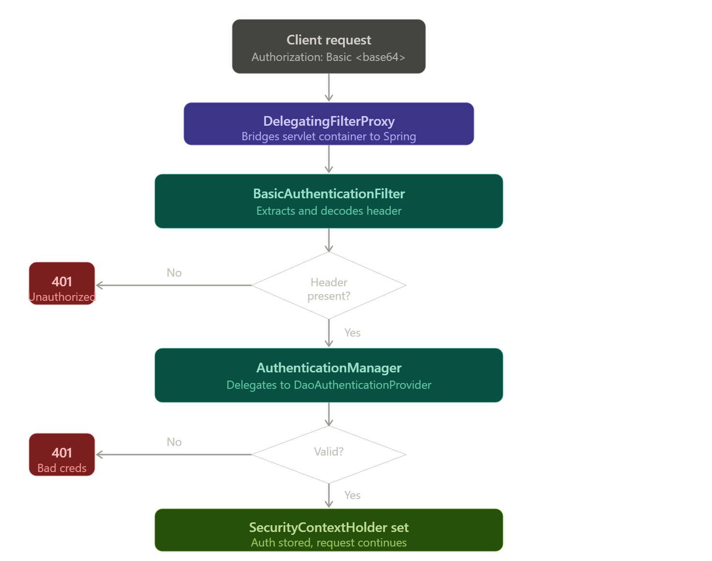
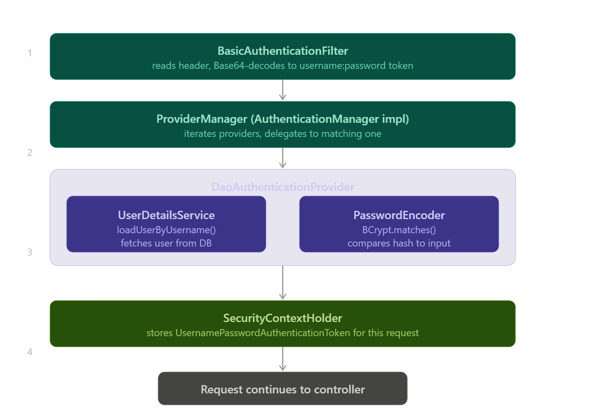
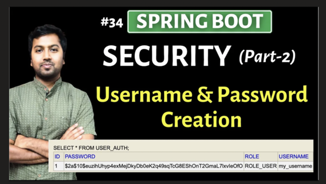
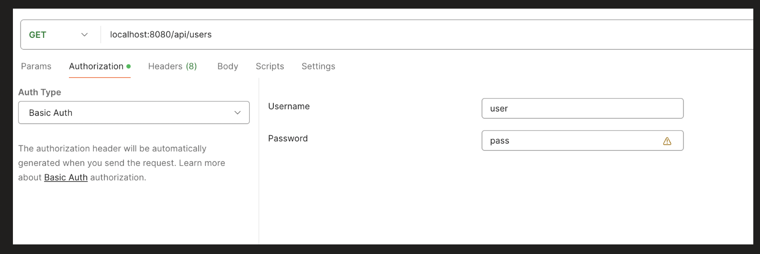
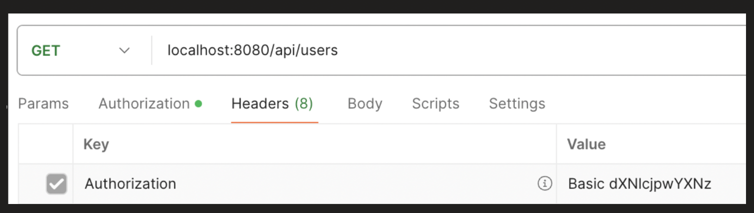
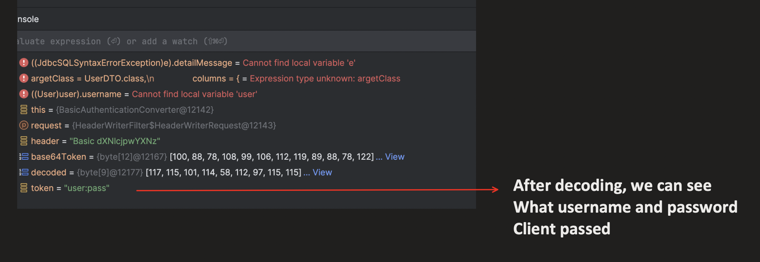
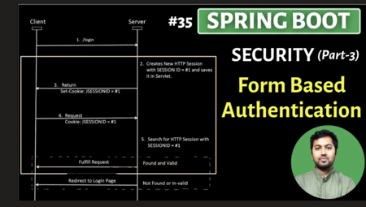
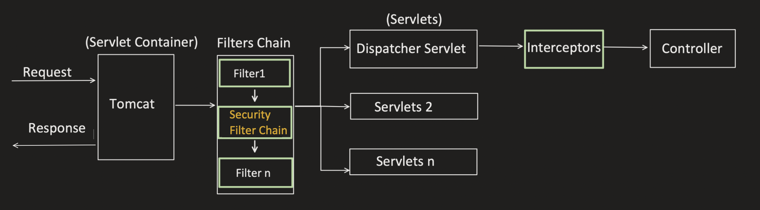
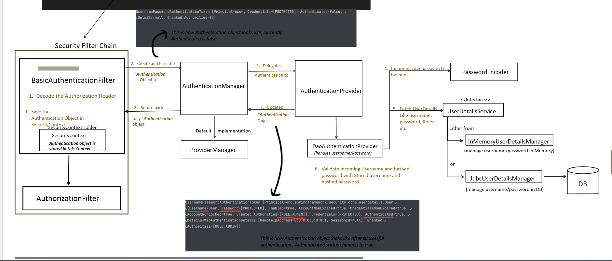

 

---

## SpringBoot Security - Part4 (Basic Authentication)

### Basic Authentication

It's a Stateless Authentication method.

Stateless authentication means, server do not maintains the user authentication state (aka Session).

In this, client has to pass the username and password with every request using Authorization header

```
Authorization: Basic <base64(username:password)>
```

These Credentials are encoded using Base64 (not encrypted), making it insecure over HTTP.

Let's go step by step:

**1st: Lets create a user**

Already discussed, all possible ways to create user and how we can create users dynamically and with industry standard approach.

Also how to create and store it in DB or in-memory. So kindly check that out if there is any doubt with user creation process.



Lets create a user for testing purpose:

**Application.properties**

```properties
#creating username and password and assigning the ROLE to the user
spring.security.user.name=user
spring.security.user.password=pass
spring.security.user.roles=ADMIN
```

Sending the request with Basic Auth credentials in Postman:



Postman automatically generates the `Authorization: Basic <base64>` header:



**BasicAuthenticationFilter.java**

```java
@Override
public UsernamePasswordAuthenticationToken convert(HttpServletRequest request) {
    /*
    Reads Authorization Header
    */
    String header = request.getHeader(HttpHeaders.AUTHORIZATION);

    if (header == null) {
        return null;
    }

    header = header.trim();

    if (!StringUtils.startsWithIgnoreCase(header, AUTHENTICATION_SCHEME_BASIC)) {
        return null;
    }

    if (header.equalsIgnoreCase(AUTHENTICATION_SCHEME_BASIC)) {
        throw new BadCredentialsException("Empty basic authentication token");
    }

    byte[] base64Token = header.substring(6).getBytes(StandardCharsets.UTF_8);
    /*
    Decode the encoded username and password
    */
    byte[] decoded = decode(base64Token);

    String token = new String(decoded, getCredentialsCharset(request));
    int delim = token.indexOf(":");
}
```

Debugging this filter — after decoding, we can see what username and password client passed:



One question comes to mind is, why we need to send username and password in Authorization header, what not in Request body or any other way?

**Possible reasons:**

1. **Standard**: As per HTTP Standardization (RFC 7617), this format is accepted, in order to make it universally accepted standard across APIs and Clients. Otherwise, if there is no Standard follows and some send in Headers, some in body etc, then its difficult when need to deal with multiple APIs and Clients.

2. **Security**: Web servers sometimes log the request body for debugging or analytics purpose. But Headers are typically not logged. So this reduce the risk of exposures of client username and password.

3. **Support for all HTTP request**: Apart from POST & PUT, there are HTTP requests like GET which do not accept any Request body. So with Headers for such APIs too, credentials can be sent consistently.

### Flow of Basic Authentication

If Form Based Authentication flow is understood properly, then this flow is very similar to that.



Within Security Filter Chain, the flow is:





### So, what we need to implement it?

**Pom.xml**

```xml
<dependency>
    <groupId>org.springframework.boot</groupId>
    <artifactId>spring-boot-starter-security</artifactId>
</dependency>

<dependency>
    <groupId>org.springframework.session</groupId>
    <artifactId>spring-session-jdbc</artifactId>
</dependency>
```

**Application.properties**

```properties
#creating username and password and assigning the ROLE to the user
spring.security.user.name=user
spring.security.user.password=pass
spring.security.user.roles=ADMIN,USER
```

```java
@Configuration
@EnableWebSecurity
public class SecurityConfig {

    @Bean
    public SecurityFilterChain securityFilterChain(HttpSecurity http) throws Exception {
        http.authorizeHttpRequests(auth -> auth
                /*
                Added for authorization
                */
                .requestMatchers("/api/users").hasAnyRole("USER")
                .anyRequest().authenticated())
            .sessionManagement(session -> session
                /*
                Its a stateless method
                */
                .sessionCreationPolicy(SessionCreationPolicy.STATELESS))
            /*
            Since its stateless, CSRF is not required
            */
            .csrf(csrf -> csrf.disable())
            /*
            Basic authentication method to be used
            */
            .httpBasic(Customizer.withDefaults());

        return http.build();
    }
}
```

### Disadvantages of Basic Authentication

1. Credentials sent in every request, if HTTPS is not enforced, then it can be intercepted and then decoded.
2. If Credentials are compromised, then only way is to change the credentials.
3. Not suitable for large scale application, as sending credentials with every request is an extra overhead.
   - a. As request size increases because of authorization header.
   - b. Extra work like decoding, hashing of incoming password, fetching username and password from DB, comparing etc..
   - c. DB lookup to fetch user details which increase latency too.