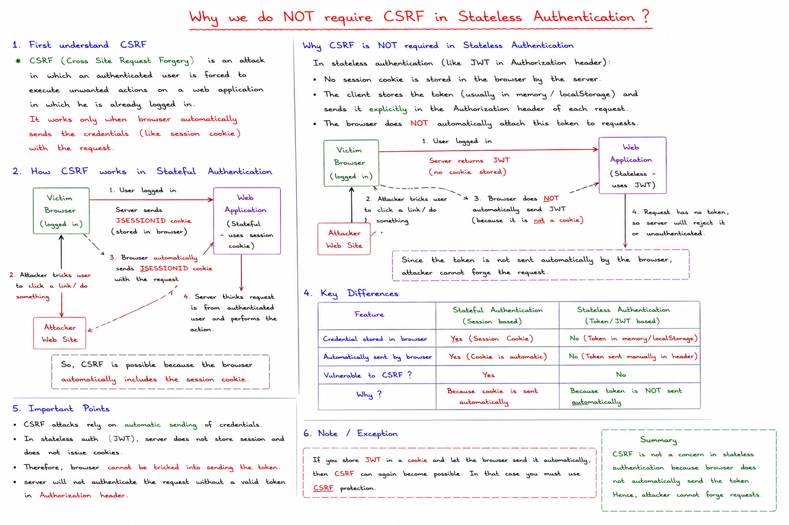
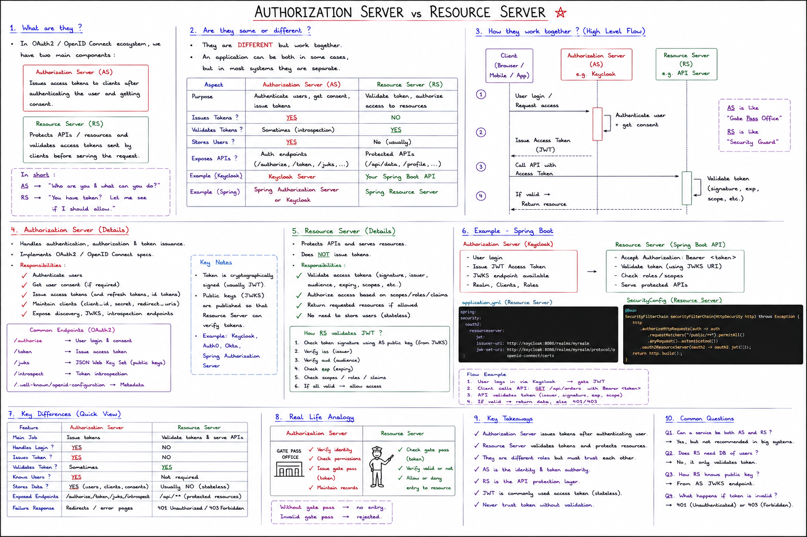
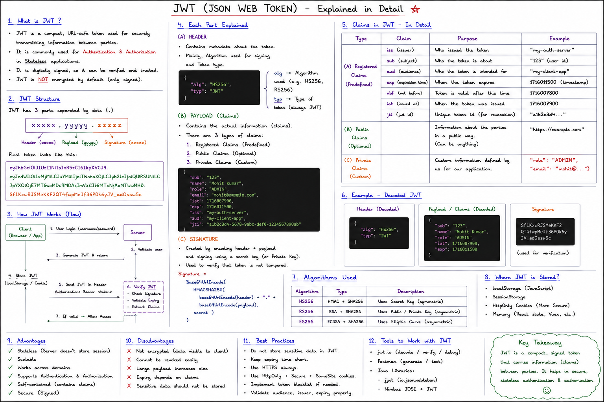

Any chnage in payload will make the Signature value chnaged ,but we have already avlues of signature ,so both will not match and then if it does not match it show token has been changed by   someone!! 

We provide refresh token and then we validate refresh token and then after validating we generate new access token!!

## Step1:User Creation(dynamically) (Very important part)

We have already seen how User Creation is done!!

Till now we have seen how user is generated dynamically!!

## Step-2 Token Generation(When we login)

For form-based and basic-auth we used to have implemenataion in SpringBoot but for JWT no implementation, so we need to provide it and every engineer implement in his own way!!

JWT we need to provide everything AuthenticationProvider ,Filters and everything .

We will try to stick to Security Framework only to implement the JWT functionality.So we not going to create any apis to generate token or apis for refresh token in controller!!We will put in filters only .

>Note:Remember filter creates Authentication Object. So here we will create Authentication object from filter.

>Note:AuthenticationManager gets the AUthentication object and delegate to proper AuthenticationProvider.Provider inteacts with Db through UserDetails Service.

>Note: when AuthenticationManager gives back Authentication object  to Filter ,Filter stores that Object to SecurityContext.

### Very Imp

Security filter creates `Authentication` object from UserName,password or token or sessionID!!Each filter creates it own Authentication object like UsrerName Password has different , Basic auth has different and so on!!

Till now `Authentication` is false!!

Then securityFilter pass this `Authentication` Object to ProviderManager!!

ProviderManager gives the request which has Authentication Object to one of AuthenticationProvider like DAOAuthenticationProvider and so on by testing each Provider which one can accept the request as ProvideManager has a list of Provider!!

### ProviderManager.java (framework code)

### DaoAuthenticationProvider.java (framework code)

### What we need to do

### Let us code 

need jwt dependency to generate token so use jjwt-api (it just provide api), jjwt-impl (implementation of jjwt to sign the key ,get the token)(can use other impl too),jjwt-jackson (payload has Key-value in json so for json processing using it)

---

Let us create a class first

## Custom Filter 

`OnePerRequestFilter` make sure that in one request any filter should not run twice!!

See here how Filter get apis!! We telling this filter only works for `/generate-token` end-point!!

UserNamePasswordAuthenticationToken we are getting as it is supported by DAOAuthentricationProvider!! 

Then we have passed to AuthneticationManager which will deligate to 
DAOAuthentricationProvider and which checks from DB whether credentials are valid or not !!If matches then it will put true in Isauthneticated()!!

If Authenticated we generating the token!!

This we getting from jjwt-impl all the below Apis of jwt is exposed by that

Here JWT is created!!We using HMAC algo , so same key is used in encrption and decryption!!Here we have put key here only , but In prod that should not be case ,we must have key somewhere else also should use different keys!!

##### Config

DAOAuthenticationProvider also we need to provide!!So see below for that!

Now see below we creating object of filter as Filter was not annotated with @Bean so we  need to create its object ourself!!

Also we need to add AuthenticationManager's List of Provider we provide only DAO one!!

 Here we have created a new list but we can also get the AuthenticationMananger and add out provider to list!!

 see here we have `ProviderManager` which is implementation of `AuthenticationManager` and we giving it a list 

 Another way is get `ProviderManager` created by springboot and update list and add your `AuthenticationProvider`

addFilterBefore add our filter to filter we provided before `UserNamePasswordAuthneticationFilter`!!

In response Header we getting JWT token as we have configuered!!

So see we have not put `/generate-token` apu in controller ,It is in Filter part!!

## Step-3 Token Validation

User try to access any api ,so User first goes to SecurityFilter which validates token and then token is passed to Controller if token is valid! 

`/api/users` is protected API

So we need to create filter again!!

If token is not null then we ceating `JWtAuthenticationToken` which is child of `AbstractAuthenticationToken` which is child of `Authentication`!! And initially we have put `Authenticated` as false!!

Now to authenticate we need a provider that `AuthenticationManager` can delegate `authenticate()` request to.So we created `JwtAuthenicationProvider` as springboot doesnt have anything to understand JWt and added this `provider` as in list to manager in securityConfig.

So now Authentication manager goes to both of the `AuthenticationProvider` 1st to `DAOAuthenticationProvider` and asks do it supports `JwtAuthenticationTokem` object it says no and then to `JwtAuthenicationProvider` and asks do it support and it says yes.

Initially we set up isAuthenticated as false.

After validation of JWT token ,we storing Authentication object in SecurityContext.`filterChain.doFilter()` makes sure SecurityChain goes on and not end!!

Now `DAOAutheticatorProvider` do not understand JWT Authentication so we create another `AuthenticatorProvider`!!

here when we return `UserNamePasswordAuthenticationToken` itinternally set up isAuthhenticated to true

We added `JWTAuthenticationProvider` in List!!

This is where validation is done !and from here we returining userName which we have put in subject!!

And In AuthenticationProvider we are checking if this username is null that means Bad credentials!!

and then we returing `Authentication` Object of type `UserNamePasswordAutthenticationToken` which is further passed to controller!!

403 forbidden is given!!

## Step-4 Refresh Token

After 15 min again provide username-password ,so instead increase the time for JWT like 1 day or 2 day , then their might be case where JWT is compromised ,as no way to delete the token,so it is recommended JWT to be short-lived so insted we use `refresh-token`!!

Refresh token is used to get new token without putting credentails again and again so need to add filter here too!!

we want refresh token along with time we get token.

 we genrating one more token sam way but this refresh token is for 7 days.

We can put refreshToken in ResponseBody so user can store in localStorage. And another way is to put in cookie.

We putting RefreshToken in Cookie !!We put `setHttpOnly(true)` so no JS code can access it!! Also `setSecure(true)` so only Https can access it!! We also put `setPath()` so for only this path ,Cookie is sent else browser will send for all request!!

generally browser send cookie for all the request with `setPath()`,we telling browser to send cookie only for this path

---

Now we need to write our own refresh token

Now here we no need to reach controller so we do not do `filterChain.doFilter()` in else part

---

---

---

---

---

This is very simple!!

---

## Authorization

Api will be accessed by Specific role only!!

