# SpringBoot Security - Part8 (OAuth Authentication)

As explained in previous video:

### What is OAuth


It's an Open Authorization framework, enables secure third party access to user protected data.

And its different Grant Types like
- Authorization Code Grant,
- Implicit Grant,
- Client Credentials Grant etc...

### Quick Recap of "Authorization Code Grant" flow


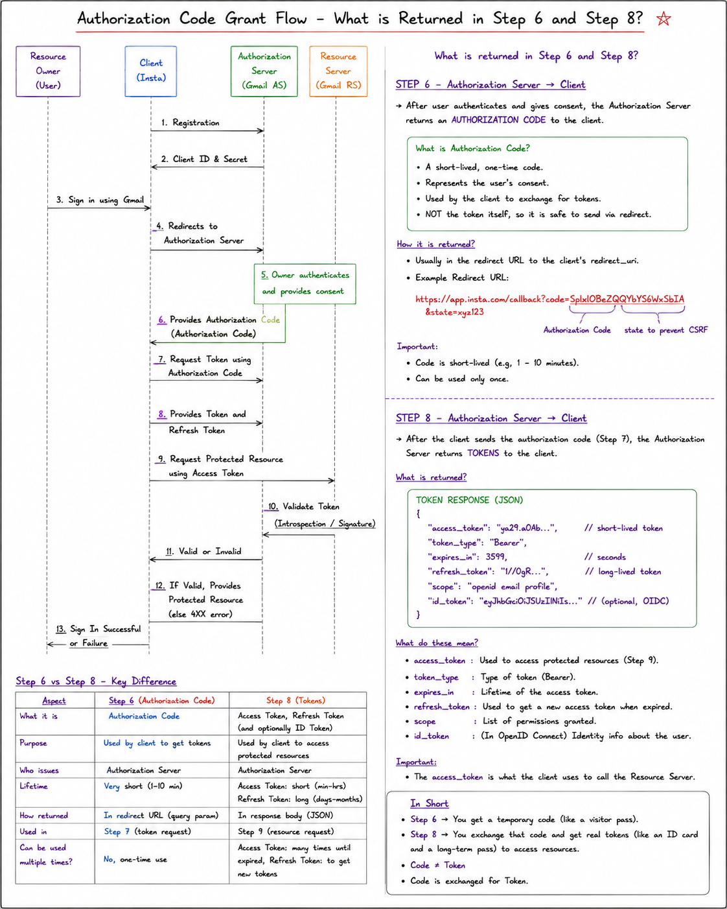

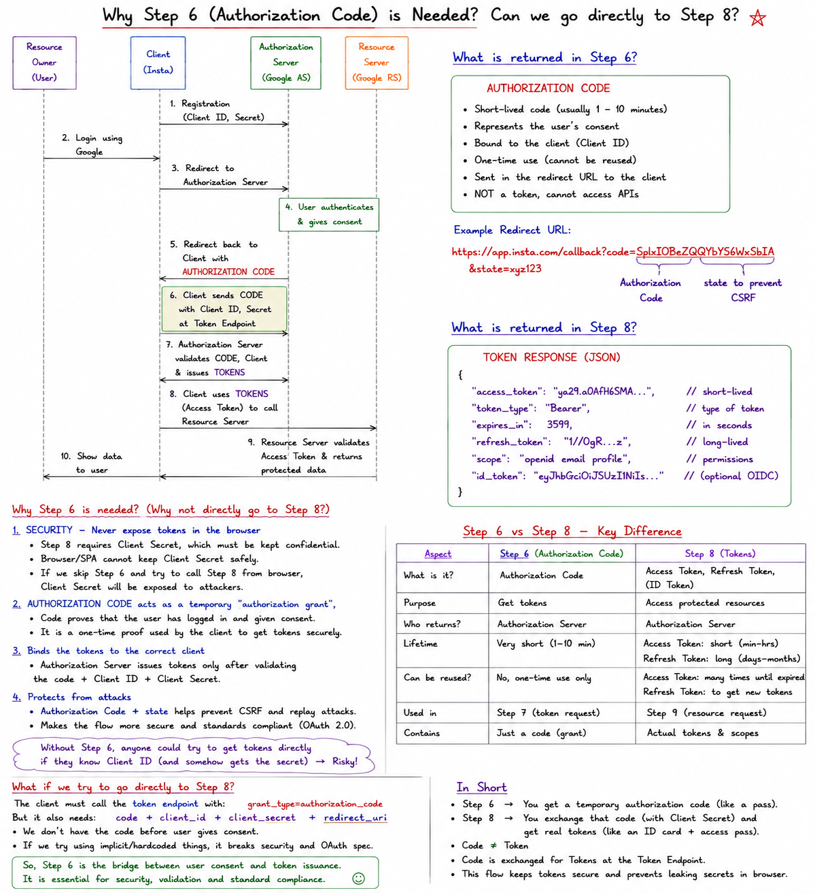


---

## OAuth2 vs OIDC

So, before we proceed with User Authentication implementation using OAuth framework, Lets understand difference between OAUTH and OIDC

| S.No | Title | OAuth2 | OIDC |
|---|---|---|---|
| 1. | Full Form | Open Authorization | OpenID Connect |
| 2. | Purpose | Used for Authorization. Grant secure third party access to user protected data like third party app showing my google calendar data | Authentication. Layer built on top of OAuth2 and enables third party app to verify the identity of the user by an Authorization server |
| 3. | Token generated | Access token (Opaque or JWT) used by Third Party App, to call resource server API's to access user protected data. Many times, these access token could be Opaque, means only Authorization server interpret and validate them. | ID_Token (JWT) + Access Token. ID_Token is a JWT token, which is meant for Third party app, and can be used to Authenticate user (this JWT token contains minimal user info just required for Authentication). Also has Access token, we can call resource server API's to access more user restricted data, if required. |
| 4. | Scope | `read/write`: request access to read or write to resources. `profile`: request access to basic profile info like name, profile picture etc. `email`: request access to user email address etc.. | `openid` (must): it indicates that third party app is requesting a ID_TOKEN (to authenticate the user). Now, this ID_TOKEN (JWT) itself will contain some minimal info which can be used to authenticate user. But if required some additional info, We can use `scope=openid,profile` so this JWT now also has some profile related info too. |

with OIDC we do  not need step 9 ,we just need to authenticate the user ,In Oauth2 we have step 9 to get private Data.

OIDC also generate Access token so we can acess private data of user too as it is build on top of Oauth2

### Step1: Third party app registration to Authorization server

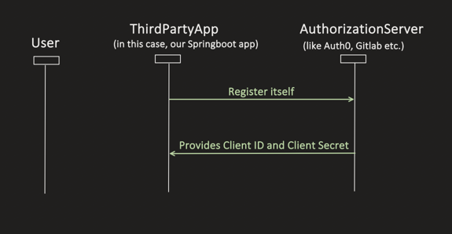

**GitLab Registration:**

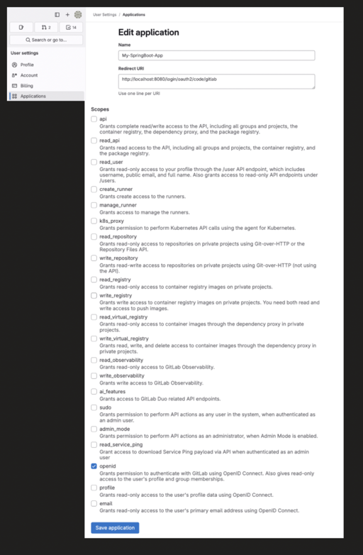

**Auth0 Registration:**

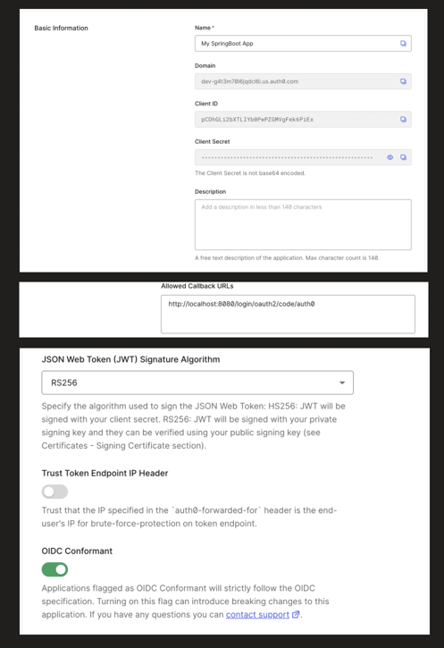

After registration, we get Client id and Secret

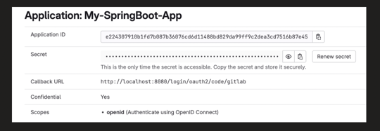

**pom.xml**

```xml
<dependency>
    <groupId>org.springframework.boot</groupId>
    <artifactId>spring-boot-starter-oauth2-client</artifactId>
</dependency>
```

**application.properties**

```properties
#OAuth configurations
##Gitlab
spring.security.oauth2.client.registration.gitlab.client-id=e224307910b1fd7b087b36076cddd11488bd829da99ff9c2dea3cd7516b87e45
spring.security.oauth2.client.registration.gitlab.client-secret=gloas-4d80d8c0b97e7807e36270769e5da47b2467af9395fb418bd745177ec9c81d8
spring.security.oauth2.client.registration.gitlab.scope=openid
spring.security.oauth2.client.registration.gitlab.authorization-grant-type=authorization_code
spring.security.oauth2.client.registration.gitlab.redirect-uri=http://localhost:8080/login/oauth2/code/gitlab
spring.security.oauth2.client.provider.gitlab.authorization-uri=https://gitlab.com/oauth/authorize
spring.security.oauth2.client.provider.gitlab.token-uri=https://gitlab.com/oauth/token
spring.security.oauth2.client.provider.gitlab.issuer-uri=https://gitlab.com
spring.security.oauth2.client.provider.gitlab.jwk-set-uri=https://gitlab.com/oauth/discovery/keys

##Auth0
spring.security.oauth2.client.registration.auth0.client-id=pCDhGLi2bXTLLYb0PwPZGMVqFek6PiEx
spring.security.oauth2.client.registration.auth0.client-secret=crSWtxt6uBYJ_NJjbN8GX4mBULnYB622ejCnnzYxQ1JRyEpo7IC5wpDM8E6bG4t
spring.security.oauth2.client.registration.auth0.scope=openid, profile
spring.security.oauth2.client.registration.auth0.authorization-grant-type=authorization_code
spring.security.oauth2.client.registration.auth0.redirect-uri=http://localhost:8080/login/oauth2/code/auth0
spring.security.oauth2.client.provider.auth0.authorization-uri=https://dev-g4t3m70i6jqdcl6i.us.auth0.com/authorize
spring.security.oauth2.client.provider.auth0.token-uri=https://dev-g4t3m70i6jqdcl6i.us.auth0.com/oauth/token
spring.security.oauth2.client.provider.auth0.issuer-uri=https://dev-g4t3m70i6jqdcl6i.us.auth0.com/
spring.security.oauth2.client.provider.auth0.jwk-set-uri=https://dev-g4t3m70i6jqdcl6i.us.auth0.com/.well-known/jwks.json
```

**SecurityConfig.java**

```java
@Configuration
@EnableWebSecurity
public class SecurityConfig {

    @Bean
    public SecurityFilterChain securityFilterChain(HttpSecurity http) throws Exception {
        http.authorizeHttpRequests(auth -> auth
                .anyRequest().authenticated())
            .csrf(csrf -> csrf.disable())
            .oauth2Login(Customizer.withDefaults());

        return http.build();
    }
}
```

Basic Controller class, just for testing

```java
@RestController
public class UserDetailsController {

    @GetMapping("/")
    public String defaultHomePageMethod(){
        return "hello, you are logged in";
    }

    @GetMapping("/users")
    public String getUsersDetails(){
        return "fetched the details of successfully";
    }
}
```

Let's try:

Notice one thing that, I have not created any User in our Springboot app.

Started the application server:

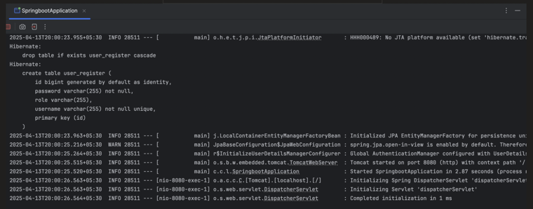

Typed the localhost:8080 url, it takes us to /login endpoint

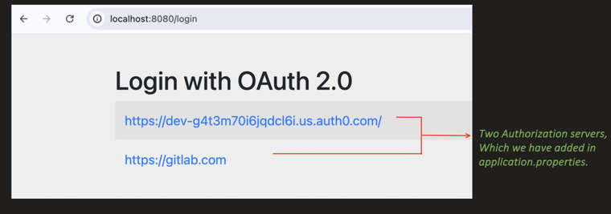

When I clicked the Auth0 authorization server, it redirects me to Auth0 login page

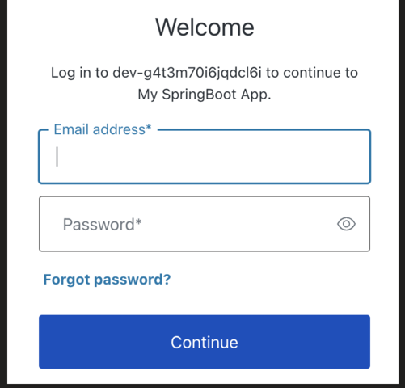

Once I provided the sign in at Auth0 and provided the consent, I am able to logged in:

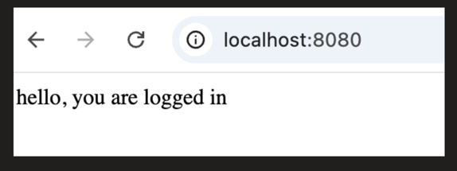

Now, if I try to access, any other API, I don't have to sign in again and access will be given.

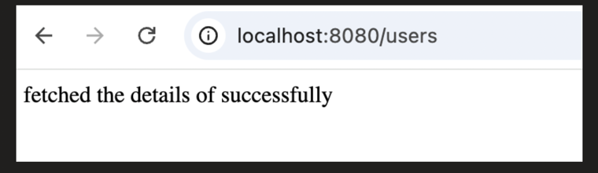

What? With just pom.xml, application.properties and SecurityConfig.java changes, we able to run the complete OAuth2 flow.

Answer is Yes, Springboot Security framework provides the compete functionality of OAUTH2 protocol, we don't have to code anything.

**But here is the twist:**

When I tried to access the "/users" API through postman (not through browser), it takes me back to Login page, why?

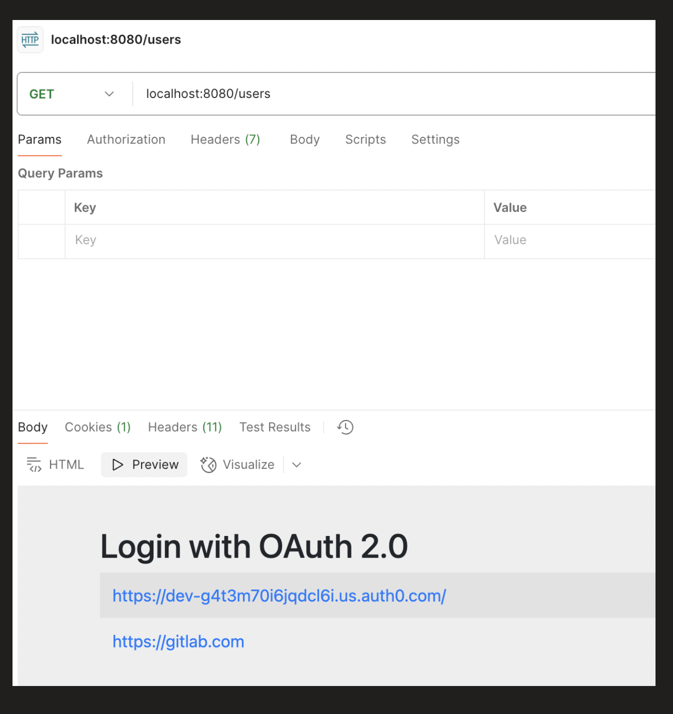

Because, Springboot assume that, Oauth2 login will be done on a browser, so by-default it creates SESSION.Oauth is stateful??

Yes by default spring creates it stateful,we need to make it stateless.

## Internal Flow: How Spring Security handles OAuth2 Login (AuthorizationServer)

When "/login" is invoked, `DefaultLoginPageGeneratingFilter.java` inside that "generateLoginPageHtml()" method builds the login page HTML with the list of registered Authorization servers — this got filled up, at the time of application startup from `application.properties`:

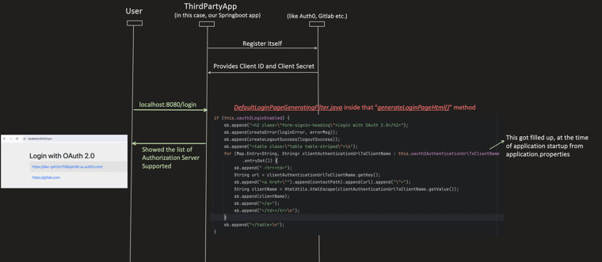

User click on one of the authorization server links, then `/oauth2/authorization/{registration_id}` will get invoked. In this `registration_id` is either auth0 or gitlab, what we have configured in application.properties:

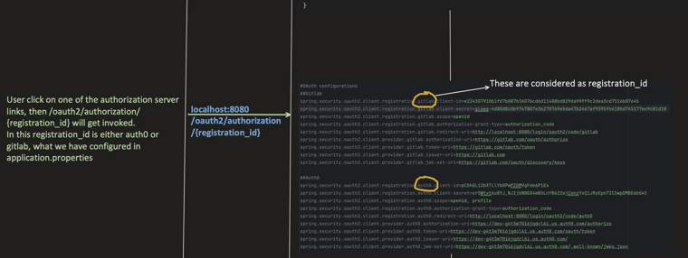

`OAuth2AuthorizationRequestRedirectFilter.java` invokes the authorization-uri of the specific `registration_id`, and redirects to that Authorization Server's own login/consent page. Once redirected back, the Authorization Server calls the redirect URI with the Authorization Code present in the response:

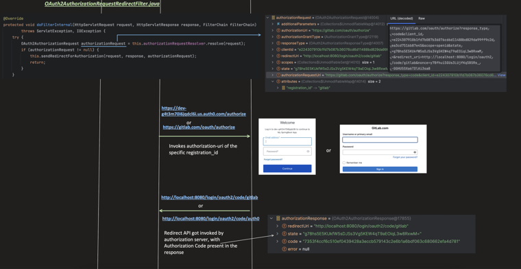

`OAuth2LoginAuthenticationFilter.java`'s `attemptAuthentication()` creates an `OAuth2LoginAuthenticationToken` (an Authentication object) and calls the Authentication Manager. Since our scope is "openid" and Authentication object is `OAuth2LoginAuthenticationToken`, `OidcAuthorizationCodeAuthenticationProvider.java` will handle this request:

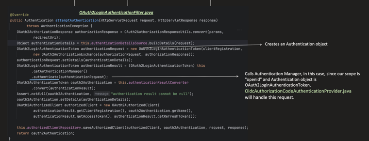

`OidcAuthorizationCodeAuthenticationProvider.authenticate()` invokes the token URI of the Authorization server. From the response, it fetches the Access and Id_Token, and returns back to `OAuth2LoginAuthenticationFilter.java`:

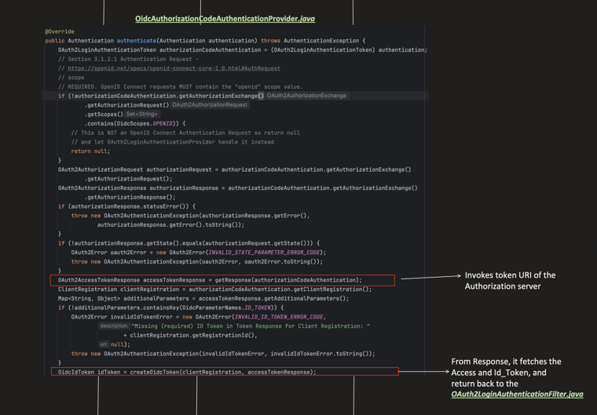

Notice, access token is not a JWT (jwt has 3 parts separated by '.') so this must be Opaque token. Id_token is in JWT form and when checked its payload, we see all the data present which is required for Authentication. Now, `OAuth2LoginAuthenticationFilter.java` stores these tokens and creates a HttpSession. Login Successful home page is called with Session id in cookie:

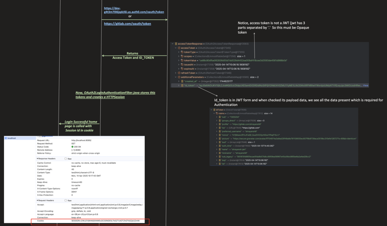

Recap — Security Filter Chain flow for `/login` (invokes `DefaultLoginPageGeneratingFilter`, returns the list of authorization servers supported):

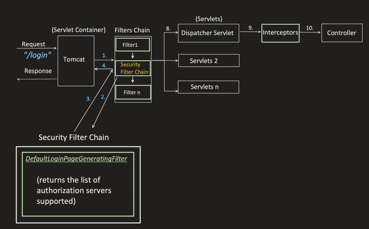

Recap — Security Filter Chain flow for `/oauth2/authorization/{registration_id}`:

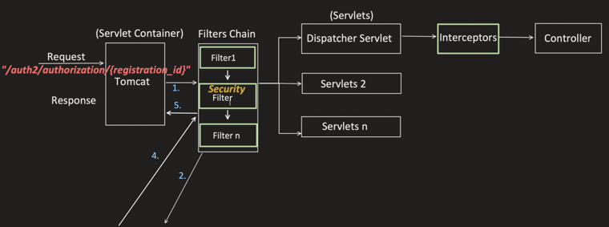

`OAuth2AuthorizationRequestRedirectFilter.java` redirects User to the Authorize URI of the Authorization Server, passed Client ID. Once User authorizes the Third party App, Authorization Server calls the Redirect URI and returns the Authorization Code:

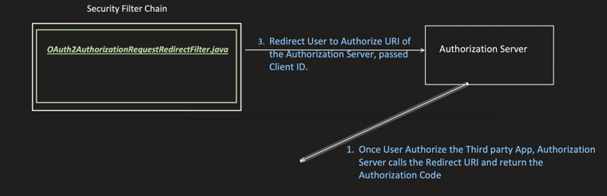

Full internal flow — `OAuth2LoginAuthenticationFilter` creates `OAuth2LoginAuthenticationToken` → delegates to `AuthenticationManager` → `AuthenticationProvider` → `OidcAuthorizationCodeAuthenticationProvider` invokes the Token URI of the Authorization Server (passes ClientID, Secret and Authorization Code) → returns Access Token, Refresh Token, ID_TOKEN → stores the User details like Tokens and other profile info in `InMemoryOAuth2AuthorizedClientService`, creates HttpSession & store it in `SecurityContextHolder`:

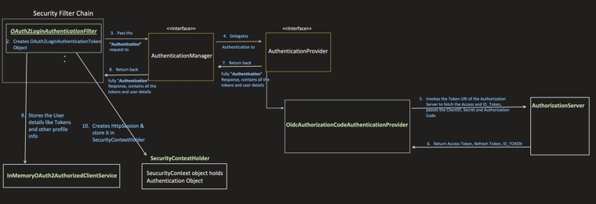

Now, subsequent request to "/users" — Security Filter Chain flow (`SecurityContextHolderFilter` → `HttpSessionSecurityContextRepository`, tries to fetch HTTPSession based on JSESSIONID):

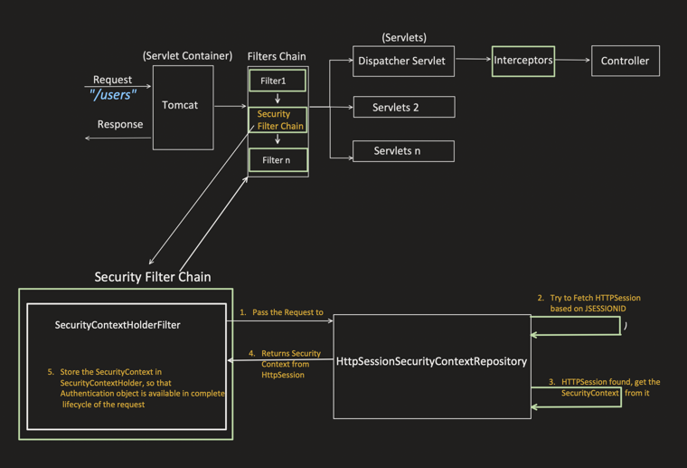

That's why, when we hit the request from Postman, it again asked for Login, because Session id is not set in the cookie.

Also, when session is set, it might not validate the token with each request, till Session is valid. So it might be a possible scenario that ID Token becomes invalidated but Session is still active.

- And this also makes OAuth Stateful.

So, how to fix this?

Lets make it STATELESS. And return the ID_TOKEN in the response. With each request, client will pass the Token and we will validate the token.

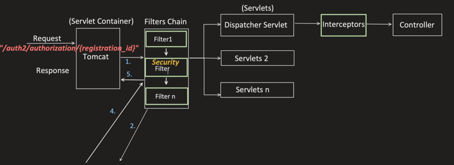

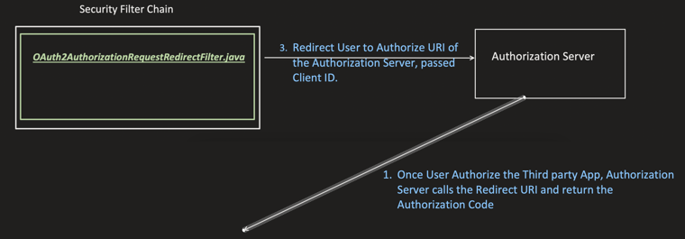

Full internal flow — same as before, but now the ID_TOKEN is set in the response body instead of being stored only in the session:

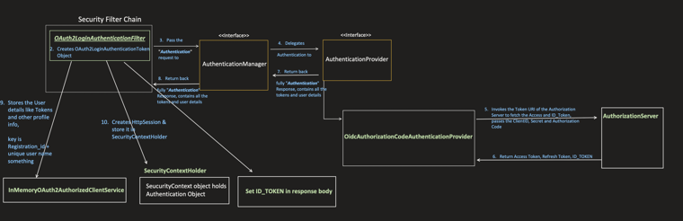

`OAuth2LoginAuthenticationFilter` parent class has one method `onAuthenticationSuccess()` at last, which by default do some cleanup task once authentication process completes, I have overwrite that method and set the ID_TOKEN in the response body.

```java
@Component
public class CustomOAuth2SuccessHandler implements AuthenticationSuccessHandler {

    private final OAuth2AuthorizedClientService clientService;

    @Autowired
    public CustomOAuth2SuccessHandler(OAuth2AuthorizedClientService clientService) {
        this.clientService = clientService;
    }

    @Override
    public void onAuthenticationSuccess(HttpServletRequest request, HttpServletResponse response,
            Authentication authentication) throws IOException {

        OAuth2AuthenticationToken authToken = (OAuth2AuthenticationToken) authentication;
        OAuth2AuthorizedClient client = clientService.loadAuthorizedClient(
                authToken.getAuthorizedClientRegistrationId(), authToken.getName());

        if (client != null) {
            String idToken = null;
            if (authToken.getPrincipal() instanceof OidcUser) {
                OidcUser oidcUser = (OidcUser) authToken.getPrincipal();
                idToken = oidcUser.getIdToken().getTokenValue();
            }

            // Send the access token in the response (JSON)
            response.setContentType("application/json");
            response.getWriter().write("{ \"id_token\": \"" + idToken + "\" }");
            response.getWriter().flush();
        } else {
            response.sendError(HttpServletResponse.SC_UNAUTHORIZED, "Authorization failed");
        }
    }
}
```

```java
@Configuration
@EnableWebSecurity
public class SecurityConfig {

    @Bean
    public SecurityFilterChain securityFilterChain(HttpSecurity http,
            CustomOAuth2SuccessHandler successHandler) throws Exception {

        http.authorizeHttpRequests(auth -> auth
                .anyRequest().authenticated())
            .sessionManagement(session -> session
                .sessionCreationPolicy(SessionCreationPolicy.STATELESS))
            .csrf(csrf -> csrf.disable())
            .oauth2Login(oauth -> oauth
                .successHandler(successHandler));

        return http.build();
    }
}
```

Start the application:

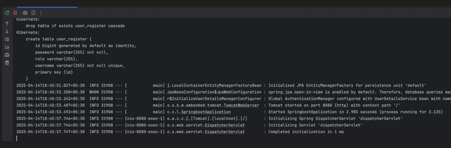

After Authorizing from the Authorization server:

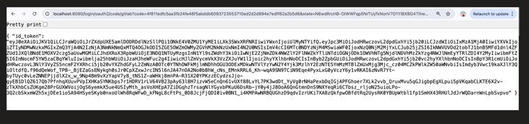

Now, only 1 task left, now Client will pass this TOKEN with every request and we have to verify it.

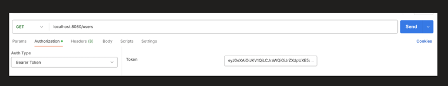

Created New Filter to Validate the token

```java
public class OAuthValidationFilter extends OncePerRequestFilter {

    private final OAuthTokenValidatorUtil tokenValidatorUtil;

    @Autowired
    public OAuthValidationFilter(OAuthTokenValidatorUtil tokenValidatorUtil) {
        this.tokenValidatorUtil = tokenValidatorUtil;
    }

    @Override
    protected void doFilterInternal(HttpServletRequest request,
            HttpServletResponse response,
            FilterChain filterChain) throws ServletException, IOException {

        String token = extractJwtFromRequest(request);
        if (token != null) {

            String username = tokenValidatorUtil.isTokenValid(token);
            if (StringUtil.isNullOrEmpty(username)) {
                response.sendError(HttpServletResponse.SC_UNAUTHORIZED, "Invalid or expired token");
                return;
            }

            Authentication auth = new UsernamePasswordAuthenticationToken(username, null, List.of());
            SecurityContextHolder.getContext().setAuthentication(auth);
        }

        filterChain.doFilter(request, response);
    }

    private String extractJwtFromRequest(HttpServletRequest request) {
        String bearerToken = request.getHeader("Authorization");
        if (bearerToken != null && bearerToken.startsWith("Bearer ")) {
            return bearerToken.substring(7);
        }
        return null;
    }
}
```

Utility Class, just to validate the token

```java
@Component
public class OAuthTokenValidatorUtil {

    public String isTokenValid(String accessToken) {

        String issu = getIssuerIdFromToken(accessToken);
        JwtDecoder decoder = JwtDecoders.fromIssuerLocation(issu);
        Jwt jwt = decoder.decode(accessToken);
        if (jwt != null) {
            return (String) jwt.getClaims().get("sub");
        }
        return null;
    }

    public static String getIssuerIdFromToken(String jwtToken) {
        try {
            String[] parts = jwtToken.split("\\.");
            if (parts.length < 2) {
                throw new IllegalArgumentException("Invalid JWT token.");
            }

            String payloadJson = new String(Base64.getUrlDecoder().decode(parts[1]));
            ObjectMapper mapper = new ObjectMapper();
            Map<String, Object> payloadMap = mapper.readValue(payloadJson, Map.class);
            String iss = (String) payloadMap.get("iss");
            return iss;
        } catch (Exception e) {
            e.printStackTrace();
            return null;
        }
    }
}
```

```java
@Configuration
@EnableWebSecurity
public class SecurityConfig {

    @Autowired
    private OAuthTokenValidatorUtil tokenValidatorUtil;

    @Bean
    public SecurityFilterChain securityFilterChain(HttpSecurity http,
            CustomOAuth2SuccessHandler successHandler) throws Exception {

        http.authorizeHttpRequests(auth -> auth
                .anyRequest().authenticated())
            .sessionManagement(session -> session
                .sessionCreationPolicy(SessionCreationPolicy.STATELESS))
            .csrf(csrf -> csrf.disable())
            .oauth2Login(oauth -> oauth
                .successHandler(successHandler))
            .addFilterBefore(new OAuthValidationFilter(tokenValidatorUtil),
                UsernamePasswordAuthenticationFilter.class);

        return http.build();
    }
}
```

Now passing the Bearer Token with the request to `/users` succeeds, without any session:

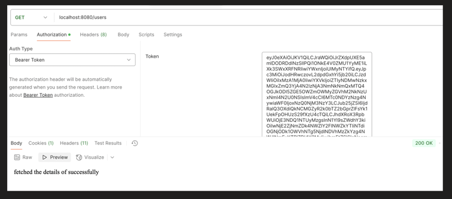
