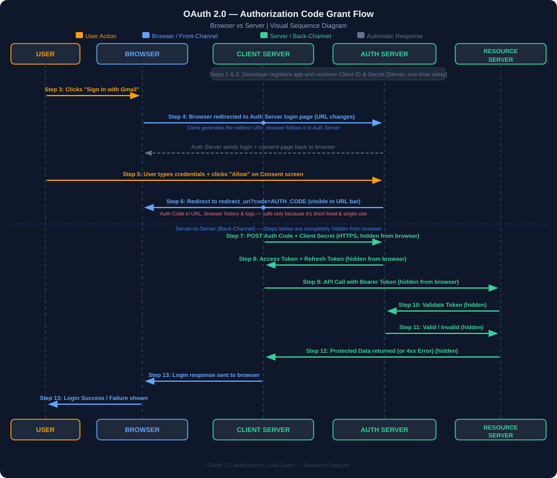

# SpringBoot Security - Part8 (OAuth Authentication)


### What is OAuth


It's an Open Authorization framework, enables secure third party access to user protected data.

And its different Grant Types like
- Authorization Code Grant,
- Implicit Grant,
- Client Credentials Grant etc...

### Quick Recap of "Authorization Code Grant" flow


#### 🔍 Diagram Explanation — Authorization Code Grant Flow

The diagram above is a **sequence diagram** showing the complete OAuth 2.0 **Authorization Code Grant** flow. It involves **4 actors**:

| Actor | Role |
|---|---|
| **Resource Owner** | The end-user (e.g., you) who owns the data and wants to sign in |
| **Client (Insta)** | The third-party application (e.g., Instagram) that wants to access your data |
| **Gmail Authorization Server** | The OAuth provider (e.g., Google/Gmail) that authenticates the user and issues tokens |
| **Gmail Resource Server** | The actual API server that holds the user's protected data (e.g., Gmail contacts, calendar) |

---

#### 📋 Step-by-Step Breakdown

**Step 1 — Registration** *(Client → Authorization Server)*
> Before the flow even begins, the **Client (Insta)** must register itself with the **Gmail Authorization Server** (one-time setup). During registration, the client provides its name, redirect URI, and the scopes it needs.

**Step 2 — Client ID & Secret** *(Authorization Server → Client)*
> After successful registration, the Authorization Server issues a **Client ID** (public identifier) and a **Client Secret** (private key). These are used in later steps to prove the client's identity.

**Step 3 — Sign In using Gmail** *(Resource Owner → Client)*
> The **user (Resource Owner)** clicks "Sign in with Gmail" on the Client app (Insta). This initiates the OAuth flow.

**Step 4 — Redirects Owner to Authorization Server** *(Client → Authorization Server)*
> The Client redirects the user's browser to the **Gmail Authorization Server's login/consent page**, passing along:
> - `client_id`
> - `redirect_uri`
> - `response_type=code`
> - `scope` (what permissions are being requested)
> - `state` (CSRF protection token)

**Step 5 — Owner Authenticates and Provides Consent** *(at Authorization Server)*
> The **user logs in** with their Gmail credentials on Google's page and is shown a **consent screen** listing the permissions the Client is requesting (e.g., read your contacts). The user **approves or denies** the request. *(This is the highlighted green box in the diagram — the most critical step for user interaction.)*

**Step 6 — Provides Authorization Code** *(Authorization Server → Client)*
> If the user consents, the Authorization Server redirects back to the Client's `redirect_uri` with a short-lived, one-time-use **Authorization Code** in the URL query parameter. This code is **not an access token** — it's just a ticket to get one.

**Step 7 — Request Token using Authorization Code** *(Client → Authorization Server)*
> The Client now makes a **back-channel (server-to-server) request** to the Authorization Server's **token endpoint**, sending:
> - `authorization_code` (from Step 6)
> - `client_id`
> - `client_secret`
> - `redirect_uri`
>
> This happens server-side, keeping the client secret hidden from the browser.

**Step 8 — Provides Token and Refresh Token** *(Authorization Server → Client)*
> The Authorization Server validates everything and responds with:
> - **Access Token** — used to call protected APIs
> - **Refresh Token** — used to get a new Access Token when the current one expires
> - *(In OIDC flows, an **ID Token** is also returned here)*

---

#### ❓ Why not just return the Token directly in Step 6?

This is the most important design decision in OAuth 2.0. The answer is **Security** — specifically the difference between **Front-Channel** and **Back-Channel** communication.

##### 🌐 Front-Channel (Steps 3–6) — Browser-Based, Visible, Risky
Step 6 happens via a **browser redirect** (the URL in the browser changes). This means the Authorization Code travels through:
- 🔴 **The browser URL bar** — visible to the user and any browser extensions
- 🔴 **Browser history** — logged permanently on the device
- 🔴 **Web server access logs** — via the `Referer` HTTP header
- 🔴 **Any proxy/middleman** sitting between user and server

If we returned the **Access Token** here directly (via URL), it would be **permanently exposed** in all these places. Anyone who sees the browser history or grabs the URL has full access to the user's data. This is exactly what the **Implicit Grant** used to do — and it's now deprecated for this reason.

##### 🔒 Back-Channel (Steps 7–8) — Server-to-Server, Hidden, Safe
Steps 7–8 happen **server-to-server**, completely hidden from the browser:
- ✅ The Token **never appears in any URL**
- ✅ The Token **never touches browser history**
- ✅ **`client_secret`** is sent along — proves the Client's identity (only the real Insta server knows the secret, not a hacker who grabbed the Authorization Code from the URL)

##### 🔑 The Authorization Code is Safe to Expose Because:
1. It is **short-lived** (expires in ~10 minutes)
2. It is **single-use** — once exchanged, it's invalidated immediately
3. It is **useless alone** — to exchange it for a token, you also need the `client_secret`, which only the server knows

##### 📊 Summary

| | Front-Channel (Step 6) | Back-Channel (Step 7–8) |
|---|---|---|
| **Travels via** | Browser redirect / URL | Direct HTTPS server call |
| **Visible in browser?** | ✅ Yes | ❌ No |
| **Logged in history?** | ✅ Yes | ❌ No |
| **What is sent** | Authorization Code (short-lived, single-use) | Auth Code + Client Secret |
| **What is returned** | Just a code | Access Token + Refresh Token |

> 💡 **Bottom line:** The two-step process exists to move the sensitive token exchange off the browser and onto a secure server-to-server channel. The Authorization Code is just a temporary, low-risk "claim ticket" that only becomes useful when combined with the `client_secret` on the backend.

---

**Step 9 — Request Protected Owner Data using Token** *(Client → Resource Server)*
> The Client now calls the **Gmail Resource Server API** (e.g., to fetch user's contacts or emails), attaching the **Access Token** in the `Authorization: Bearer <token>` header.

**Step 10 — Validate Token** *(Resource Server → Authorization Server)*
> The Resource Server sends the Access Token to the Authorization Server to **verify its authenticity and check if it's still valid** (not expired, not revoked).

**Step 11 — Valid or Invalid** *(Authorization Server → Resource Server)*
> The Authorization Server responds with whether the token is **valid or invalid**.

**Step 12 — If Valid Token, Provides Details; Else 4XX Error** *(Resource Server → Client)*
> - If the token is **valid** → Resource Server returns the requested user data to the Client.
> - If the token is **invalid/expired** → Resource Server throws a `401 Unauthorized` or `403 Forbidden` error.

**Step 13 — Sign In Successful or Failure** *(Client → Resource Owner)*
> Finally, the Client displays the result to the **user**:
> - ✅ **Success** → User is logged in, profile data is shown
> - ❌ **Failure** → An error message is shown

---

#### 💡 Key Takeaways

- The **Authorization Code** (Step 6) is a temporary, single-use code — it's **not** the access token.
- The **Client Secret** is never exposed to the browser — token exchange (Step 7) happens server-to-server.
- The **Resource Server** does not blindly trust tokens — it validates them with the Authorization Server (Steps 10-11).
- **Steps 9–12 are specific to OAuth2** (accessing protected data). In **OIDC**, you may skip these if you only need to authenticate the user using the ID Token.

---

#### 🗺️ Where Does Each Step Happen? (Browser vs Server vs User)

Every step in the OAuth flow falls into one of 3 layers. Understanding this is key to understanding OAuth's security model.

| Layer | Description |
|---|---|
| 👤 **User Action** | The user manually does something (click, type, approve) |
| 🌐 **Browser / Front-Channel** | Happens automatically via browser URL redirects — visible, logged, risky |
| 🖥️ **Server / Back-Channel** | Happens via direct HTTPS calls between servers — hidden from browser, safe |

---

##### 👤 User Action → 🌐 Browser → 🖥️ Server — Step by Step

```
Step 1  [🖥️ Server]         Client registers with Authorization Server (one-time setup, done by developer)
Step 2  [🖥️ Server]         Authorization Server issues Client ID & Secret to Client
Step 3  [👤 User Action]    User clicks "Sign In with Gmail" on the Client app (Insta)
Step 4  [🌐 Browser]        Client redirects browser to Authorization Server's login page (URL changes)
Step 5  [👤 User Action]    User types Gmail credentials + clicks "Allow" on consent screen (in browser)
Step 6  [🌐 Browser]        Auth Server redirects browser back to Client's redirect_uri with Auth Code in URL
Step 7  [🖥️ Server]         Client's backend server sends Auth Code + Client Secret to Auth Server (hidden)
Step 8  [🖥️ Server]         Auth Server returns Access Token + Refresh Token to Client's backend (hidden)
Step 9  [🖥️ Server]         Client's backend calls Resource Server API with Access Token (hidden)
Step 10 [🖥️ Server]         Resource Server calls Auth Server to validate the token (hidden)
Step 11 [🖥️ Server]         Auth Server replies: valid or invalid (hidden)
Step 12 [🖥️ Server]         Resource Server returns protected data to Client's backend (hidden)
Step 13 [🌐 Browser]        Client sends the final response (logged in / error) back to User's browser
```

---

##### 🔍 Detailed Breakdown by Layer

###### 👤 Steps Triggered by the User (Manual Actions)

| Step | What User Does | Where |
|---|---|---|
| **Step 3** | Clicks **"Sign In with Gmail"** button on the Client app | Client app (Insta) UI in browser |
| **Step 5** | Enters Gmail username/password → clicks **"Allow"** on consent screen | Google's own login page in browser |

> These are the **only 2 steps** where the user does something manually. Everything else is automatic.

---

###### 🌐 Steps in the Browser (Front-Channel — Visible, URL-based)

| Step | What Happens | Risk |
|---|---|---|
| **Step 4** | Client redirects browser to `accounts.google.com/oauth/authorize?client_id=...&redirect_uri=...` | Low — no secrets here |
| **Step 6** | Auth Server redirects browser to `insta.com/callback?code=abc123` | Medium — Auth Code in URL (but it's short-lived & single-use) |
| **Step 13** | Client shows "Login Successful" or error page to user in browser | None |

> ⚠️ These steps are **visible in the browser URL bar, browser history, and server logs**. That's why **we never put the Access Token here**.

---

###### 🖥️ Steps Done Server-to-Server (Back-Channel — Hidden, Secure)

| Step | What Happens | Who Talks to Whom |
|---|---|---|
| **Step 1** | App registration (one-time) | Developer registers Client on Auth Server's developer portal |
| **Step 2** | Auth Server issues `client_id` + `client_secret` | Auth Server → Client's backend |
| **Step 7** | Client exchanges Auth Code for Token | Client Backend → Auth Server Token Endpoint (HTTPS POST) |
| **Step 8** | Auth Server returns Access Token + Refresh Token | Auth Server → Client Backend |
| **Step 9** | Client calls Resource Server API | Client Backend → Gmail Resource Server |
| **Step 10** | Resource Server validates Token | Gmail Resource Server → Auth Server |
| **Step 11** | Auth Server confirms valid/invalid | Auth Server → Gmail Resource Server |
| **Step 12** | Resource Server returns protected data | Gmail Resource Server → Client Backend |

> ✅ These steps are **completely invisible to the browser**. No URL changes, nothing in browser history. This is why tokens are safe here.

---

##### 📊 Visual Summary



> 💡 **Key Insight:** Notice how Steps 7–12 never touch the browser at all. The browser is only involved for the redirect dance (Steps 4, 6) which only carries the low-value Auth Code — never the real token.


---

## OAuth2 vs OIDC

So, before we proceed with User Authentication implementation using OAuth framework, Lets understand difference between OAUTH and OIDC

| S.No | Title | OAuth2 | OIDC |
|---|---|---|---|
| 1. | Full Form | Open Authorization | OpenID Connect |
| 2. | Purpose | Used for Authorization. Grant secure third party access to user protected data like third party app showing my google calendar data | Authentication. Layer built on top of OAuth2 and enables third party app to verify the identity of the user by an Authorization server |
| 3. | Token generated | Access token (Opaque or JWT) used by Third Party App, to call resource server API's to access user protected data. Many times, these access token could be Opaque, means only Authorization server interpret and validate them. | ID_Token (JWT) + Access Token. ID_Token is a JWT token, which is meant for Third party app, and can be used to Authenticate user (this JWT token contains minimal user info just required for Authentication). Also has Access token, we can call resource server API's to access more user restricted data, if required. |
| 4. | Scope | `read/write`: request access to read or write to resources. `profile`: request access to basic profile info like name, profile picture etc. `email`: request access to user email address etc.. | `openid` (must): it indicates that third party app is requesting a ID_TOKEN (to authenticate the user). Now, this ID_TOKEN (JWT) itself will contain some minimal info which can be used to authenticate user. But if required some additional info, We can use `scope=openid,profile` so this JWT now also has some profile related info too. |

with OIDC we do  not need step 9 ,we just need to authenticate the user ,In Oauth2 we have step 9 to get private Data.

OIDC also generate Access token so we can acess private data of user too as it is build on top of Oauth2

### Step1: Third party app registration to Authorization server


**GitLab Registration:**


**Auth0 Registration:**


After registration, we get Client id and Secret


**pom.xml**

```xml
<dependency>
    <groupId>org.springframework.boot</groupId>
    <artifactId>spring-boot-starter-oauth2-client</artifactId>
</dependency>
```

**application.properties**

```properties
#OAuth configurations
##Gitlab
spring.security.oauth2.client.registration.gitlab.client-id=e224307910b1fd7b087b36076cddd11488bd829da99ff9c2dea3cd7516b87e45
spring.security.oauth2.client.registration.gitlab.client-secret=gloas-4d80d8c0b97e7807e36270769e5da47b2467af9395fb418bd745177ec9c81d8
spring.security.oauth2.client.registration.gitlab.scope=openid
spring.security.oauth2.client.registration.gitlab.authorization-grant-type=authorization_code
spring.security.oauth2.client.registration.gitlab.redirect-uri=http://localhost:8080/login/oauth2/code/gitlab
spring.security.oauth2.client.provider.gitlab.authorization-uri=https://gitlab.com/oauth/authorize
spring.security.oauth2.client.provider.gitlab.token-uri=https://gitlab.com/oauth/token
spring.security.oauth2.client.provider.gitlab.issuer-uri=https://gitlab.com
spring.security.oauth2.client.provider.gitlab.jwk-set-uri=https://gitlab.com/oauth/discovery/keys

##Auth0
spring.security.oauth2.client.registration.auth0.client-id=pCDhGLi2bXTLLYb0PwPZGMVqFek6PiEx
spring.security.oauth2.client.registration.auth0.client-secret=crSWtxt6uBYJ_NJjbN8GX4mBULnYB622ejCnnzYxQ1JRyEpo7IC5wpDM8E6bG4t
spring.security.oauth2.client.registration.auth0.scope=openid, profile
spring.security.oauth2.client.registration.auth0.authorization-grant-type=authorization_code
spring.security.oauth2.client.registration.auth0.redirect-uri=http://localhost:8080/login/oauth2/code/auth0
spring.security.oauth2.client.provider.auth0.authorization-uri=https://dev-g4t3m70i6jqdcl6i.us.auth0.com/authorize
spring.security.oauth2.client.provider.auth0.token-uri=https://dev-g4t3m70i6jqdcl6i.us.auth0.com/oauth/token
spring.security.oauth2.client.provider.auth0.issuer-uri=https://dev-g4t3m70i6jqdcl6i.us.auth0.com/
spring.security.oauth2.client.provider.auth0.jwk-set-uri=https://dev-g4t3m70i6jqdcl6i.us.auth0.com/.well-known/jwks.json
```

---

#### 🔍 Why all these URLs? — Property-by-Property Explanation

Every property maps to a specific **OAuth 2.0 flow step**. Spring Security reads all of these at startup and uses them automatically at runtime.

There are **two groups** of properties:

| Prefix | Group | What it configures |
|---|---|---|
| `spring.security.oauth2.client.registration.*` | **Registration** | Who your Client (app) is — credentials & behaviour |
| `spring.security.oauth2.client.provider.*` | **Provider** | Where to find the Authorization Server's endpoints |

---

##### 📋 Registration Properties (`client.registration.*`)

These tell Spring Security **about your app** and **how** it should behave in the OAuth flow.

| Property | Value | Used In Step | What it does |
|---|---|---|---|
| `client-id` | `e224307...` | **Step 4, Step 7** | Your app's public identity. Sent to Auth Server during redirect (Step 4) and again during token exchange (Step 7) so Auth Server knows which app is asking |
| `client-secret` | `gloas-4d80...` | **Step 7 only** | Your app's private password. Sent **only** in the back-channel (server-to-server) token exchange. Never goes to the browser. This is why Step 7 exists — to send this secret securely |
| `scope` | `openid` | **Step 4** | Tells Auth Server what permissions your app needs. `openid` = "I want an ID_Token (for authentication)". Sent as `?scope=openid` in the redirect URL |
| `authorization-grant-type` | `authorization_code` | **Step 4** | Tells Spring Security which OAuth flow to use. `authorization_code` means: use the secure two-step code → token exchange instead of returning token directly in URL |
| `redirect-uri` | `http://localhost:8080/login/oauth2/code/gitlab` | **Step 4, Step 6** | The URL on **your server** where Auth Server will send the Authorization Code after user consents. Registered with Auth Server upfront (Step 1). Sent again in redirect (Step 4) so Auth Server knows where to callback. Auth Server verifies it matches what was registered |

---

##### 📋 Provider Properties (`client.provider.*`)

These tell Spring Security **where the Auth Server lives** — the specific URLs to hit for each action.

| Property | Value | Used In Step | What it does |
|---|---|---|---|
| `authorization-uri` | `https://gitlab.com/oauth/authorize` | **Step 4** | The URL Spring Security redirects the browser to. This is GitLab's login + consent page URL. When user clicks "Sign in with GitLab", Spring sends browser here with `?client_id=...&scope=...&redirect_uri=...` |
| `token-uri` | `https://gitlab.com/oauth/token` | **Step 7** | The URL Spring Security calls (server-to-server) to exchange the Authorization Code for tokens. Posts `code + client_id + client_secret` here and gets back `access_token + id_token` |
| `issuer-uri` | `https://gitlab.com` | **Token Validation** | The base URL of the Auth Server. Spring uses this to auto-discover the OIDC configuration by fetching `https://gitlab.com/.well-known/openid-configuration`. Also used to validate the `iss` (issuer) claim inside the JWT |
| `jwk-set-uri` | `https://gitlab.com/oauth/discovery/keys` | **Token Validation** | The URL where GitLab publishes its **public keys** (JSON Web Key Set). Spring fetches these to verify the **digital signature** on the JWT ID_Token — to confirm it was actually signed by GitLab and not tampered with |

---

##### 🗺️ Which step uses which property?

```
Step 1  → client-id, redirect-uri are pre-registered with Auth Server (setup)
Step 4  → authorization-uri  (Spring redirects browser here)
          client-id           (sent as query param in URL)
          scope               (sent as query param in URL)
          redirect-uri        (sent as query param so Auth Server knows where to callback)
          authorization-grant-type  (Spring picks this flow internally)

Step 5  → (User action — no properties involved)

Step 6  → redirect-uri  (Auth Server sends Auth Code to this URL)

Step 7  → token-uri     (Spring POSTs to this URL to exchange code for tokens)
          client-id     (sent in POST body)
          client-secret (sent in POST body — the secret step!)

Step 8  → (Tokens received — no properties needed)

Token   → issuer-uri   (validate "iss" claim in JWT)
Validate  jwk-set-uri  (fetch public keys to verify JWT signature)
```

> 💡 **Key Insight:** If any of these URLs are wrong, the OAuth flow breaks at that exact step. For example:
> - Wrong `authorization-uri` → Step 4 redirect fails (404 or wrong page)
> - Wrong `token-uri` → Step 7 fails, no token received
> - Wrong `jwk-set-uri` → Token signature verification fails, user gets 401
> - Wrong `redirect-uri` → Auth Server rejects callback as "redirect_uri mismatch" error

---


**SecurityConfig.java**

```java
@Configuration
@EnableWebSecurity
public class SecurityConfig {

    @Bean
    public SecurityFilterChain securityFilterChain(HttpSecurity http) throws Exception {
        http.authorizeHttpRequests(auth -> auth
                .anyRequest().authenticated())
            .csrf(csrf -> csrf.disable())
            .oauth2Login(Customizer.withDefaults());

        return http.build();
    }
}
```

Basic Controller class, just for testing

```java
@RestController
public class UserDetailsController {

    @GetMapping("/")
    public String defaultHomePageMethod(){
        return "hello, you are logged in";
    }

    @GetMapping("/users")
    public String getUsersDetails(){
        return "fetched the details of successfully";
    }
}
```

Let's try:

Notice one thing that, I have not created any User in our Springboot app.

Started the application server:


Typed the localhost:8080 url, it takes us to /login endpoint


When I clicked the Auth0 authorization server, it redirects me to Auth0 login page


Once I provided the sign in at Auth0 and provided the consent, I am able to logged in:


Now, if I try to access, any other API, I don't have to sign in again and access will be given.


What? With just pom.xml, application.properties and SecurityConfig.java changes, we able to run the complete OAuth2 flow.

Answer is Yes, Springboot Security framework provides the compete functionality of OAUTH2 protocol, we don't have to code anything.

**But here is the twist:**

When I tried to access the "/users" API through postman (not through browser), it takes me back to Login page, why?


Because, Springboot assume that, Oauth2 login will be done on a browser, so by-default it creates SESSION.Oauth is stateful??

Yes by default spring creates it stateful,we need to make it stateless.

## Internal Flow: How Spring Security handles OAuth2 Login (AuthorizationServer)

When "/login" is invoked, `DefaultLoginPageGeneratingFilter.java` inside that "generateLoginPageHtml()" method builds the login page HTML with the list of registered Authorization servers — this got filled up, at the time of application startup from `application.properties`:


User click on one of the authorization server links, then `/oauth2/authorization/{registration_id}` will get invoked. In this `registration_id` is either auth0 or gitlab, what we have configured in application.properties:


`OAuth2AuthorizationRequestRedirectFilter.java` invokes the authorization-uri of the specific `registration_id`, and redirects to that Authorization Server's own login/consent page. Once redirected back, the Authorization Server calls the redirect URI with the Authorization Code present in the response:


`OAuth2LoginAuthenticationFilter.java`'s `attemptAuthentication()` creates an `OAuth2LoginAuthenticationToken` (an Authentication object) and calls the Authentication Manager. Since our scope is "openid" and Authentication object is `OAuth2LoginAuthenticationToken`, `OidcAuthorizationCodeAuthenticationProvider.java` will handle this request:


`OidcAuthorizationCodeAuthenticationProvider.authenticate()` invokes the token URI of the Authorization server. From the response, it fetches the Access and Id_Token, and returns back to `OAuth2LoginAuthenticationFilter.java`:


Notice, access token is not a JWT (jwt has 3 parts separated by '.') so this must be Opaque token. Id_token is in JWT form and when checked its payload, we see all the data present which is required for Authentication. Now, `OAuth2LoginAuthenticationFilter.java` stores these tokens and creates a HttpSession. Login Successful home page is called with Session id in cookie:


Recap — Security Filter Chain flow for `/login` (invokes `DefaultLoginPageGeneratingFilter`, returns the list of authorization servers supported):


This is complete but i have put in parts below


Recap — Security Filter Chain flow for `/oauth2/authorization/{registration_id}`:


`OAuth2AuthorizationRequestRedirectFilter.java` redirects User to the Authorize URI of the Authorization Server, passed Client ID. Once User authorizes the Third party App, Authorization Server calls the Redirect URI and returns the Authorization Code:


Full internal flow — `OAuth2LoginAuthenticationFilter` creates `OAuth2LoginAuthenticationToken` → delegates to `AuthenticationManager` → `AuthenticationProvider` → `OidcAuthorizationCodeAuthenticationProvider` invokes the Token URI of the Authorization Server (passes ClientID, Secret and Authorization Code) → returns Access Token, Refresh Token, ID_TOKEN → stores the User details like Tokens and other profile info in `InMemoryOAuth2AuthorizedClientService`, creates HttpSession & store it in `SecurityContextHolder`:


Now, subsequent request to "/users" — Security Filter Chain flow (`SecurityContextHolderFilter` → `HttpSessionSecurityContextRepository`, tries to fetch HTTPSession based on JSESSIONID):


That's why, when we hit the request from Postman, it again asked for Login, because Session id is not set in the cookie.

Also, when session is set, it might not validate the token with each request, till Session is valid. So it might be a possible scenario that ID Token becomes invalidated but Session is still active.

- And this also makes OAuth Stateful.

So, how to fix this?

Lets make it STATELESS. And return the ID_TOKEN in the response. With each request, client will pass the Token and we will validate the token.


Full internal flow — same as before, but now the ID_TOKEN is set in the response body instead of being stored only in the session:


`OAuth2LoginAuthenticationFilter` parent class has one method `onAuthenticationSuccess()` at last, which by default do some cleanup task once authentication process completes, I have overwrite that method and set the ID_TOKEN in the response body.

```java
@Component
public class CustomOAuth2SuccessHandler implements AuthenticationSuccessHandler {

    private final OAuth2AuthorizedClientService clientService;

    @Autowired
    public CustomOAuth2SuccessHandler(OAuth2AuthorizedClientService clientService) {
        this.clientService = clientService;
    }

    @Override
    public void onAuthenticationSuccess(HttpServletRequest request, HttpServletResponse response,
            Authentication authentication) throws IOException {

        OAuth2AuthenticationToken authToken = (OAuth2AuthenticationToken) authentication;
        OAuth2AuthorizedClient client = clientService.loadAuthorizedClient(
                authToken.getAuthorizedClientRegistrationId(), authToken.getName());

        if (client != null) {
            String idToken = null;
            if (authToken.getPrincipal() instanceof OidcUser) {
                OidcUser oidcUser = (OidcUser) authToken.getPrincipal();
                idToken = oidcUser.getIdToken().getTokenValue();
            }

            // Send the access token in the response (JSON)
            response.setContentType("application/json");
            response.getWriter().write("{ \"id_token\": \"" + idToken + "\" }");
            response.getWriter().flush();
        } else {
            response.sendError(HttpServletResponse.SC_UNAUTHORIZED, "Authorization failed");
        }
    }
}
```


```java
@Configuration
@EnableWebSecurity
public class SecurityConfig {

    @Bean
    public SecurityFilterChain securityFilterChain(HttpSecurity http,
            CustomOAuth2SuccessHandler successHandler) throws Exception {

        http.authorizeHttpRequests(auth -> auth
                .anyRequest().authenticated())
            .sessionManagement(session -> session
                .sessionCreationPolicy(SessionCreationPolicy.STATELESS))
            .csrf(csrf -> csrf.disable())
            .oauth2Login(oauth -> oauth
                .successHandler(successHandler));

        return http.build();
    }
}
```

Start the application:


After Authorizing from the Authorization server:


Now, only 1 task left, now Client will pass this TOKEN with every request and we have to verify it.


Created New Filter to Validate the token

```java
public class OAuthValidationFilter extends OncePerRequestFilter {

    private final OAuthTokenValidatorUtil tokenValidatorUtil;

    @Autowired
    public OAuthValidationFilter(OAuthTokenValidatorUtil tokenValidatorUtil) {
        this.tokenValidatorUtil = tokenValidatorUtil;
    }

    @Override
    protected void doFilterInternal(HttpServletRequest request,
            HttpServletResponse response,
            FilterChain filterChain) throws ServletException, IOException {

        String token = extractJwtFromRequest(request);
        if (token != null) {

            String username = tokenValidatorUtil.isTokenValid(token);
            if (StringUtil.isNullOrEmpty(username)) {
                response.sendError(HttpServletResponse.SC_UNAUTHORIZED, "Invalid or expired token");
                return;
            }

            Authentication auth = new UsernamePasswordAuthenticationToken(username, null, List.of());
            SecurityContextHolder.getContext().setAuthentication(auth);
        }

        filterChain.doFilter(request, response);
    }

    private String extractJwtFromRequest(HttpServletRequest request) {
        String bearerToken = request.getHeader("Authorization");
        if (bearerToken != null && bearerToken.startsWith("Bearer ")) {
            return bearerToken.substring(7);
        }
        return null;
    }
}
```

Utility Class, just to validate the token

```java
@Component
public class OAuthTokenValidatorUtil {

    public String isTokenValid(String accessToken) {

        String issu = getIssuerIdFromToken(accessToken);
        JwtDecoder decoder = JwtDecoders.fromIssuerLocation(issu);
        Jwt jwt = decoder.decode(accessToken);
        if (jwt != null) {
            return (String) jwt.getClaims().get("sub");
        }
        return null;
    }

    public static String getIssuerIdFromToken(String jwtToken) {
        try {
            String[] parts = jwtToken.split("\\.");
            if (parts.length < 2) {
                throw new IllegalArgumentException("Invalid JWT token.");
            }

            String payloadJson = new String(Base64.getUrlDecoder().decode(parts[1]));
            ObjectMapper mapper = new ObjectMapper();
            Map<String, Object> payloadMap = mapper.readValue(payloadJson, Map.class);
            String iss = (String) payloadMap.get("iss");
            return iss;
        } catch (Exception e) {
            e.printStackTrace();
            return null;
        }
    }
}
```

```java
@Configuration
@EnableWebSecurity
public class SecurityConfig {

    @Autowired
    private OAuthTokenValidatorUtil tokenValidatorUtil;

    @Bean
    public SecurityFilterChain securityFilterChain(HttpSecurity http,
            CustomOAuth2SuccessHandler successHandler) throws Exception {

        http.authorizeHttpRequests(auth -> auth
                .anyRequest().authenticated())
            .sessionManagement(session -> session
                .sessionCreationPolicy(SessionCreationPolicy.STATELESS))
            .csrf(csrf -> csrf.disable())
            .oauth2Login(oauth -> oauth
                .successHandler(successHandler))
            .addFilterBefore(new OAuthValidationFilter(tokenValidatorUtil),
                UsernamePasswordAuthenticationFilter.class);

        return http.build();
    }
}
```

Now passing the Bearer Token with the request to `/users` succeeds, without any session:


