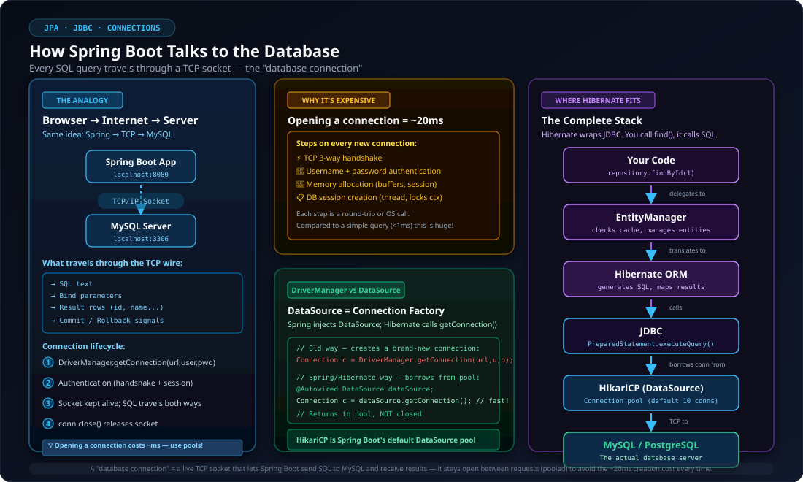
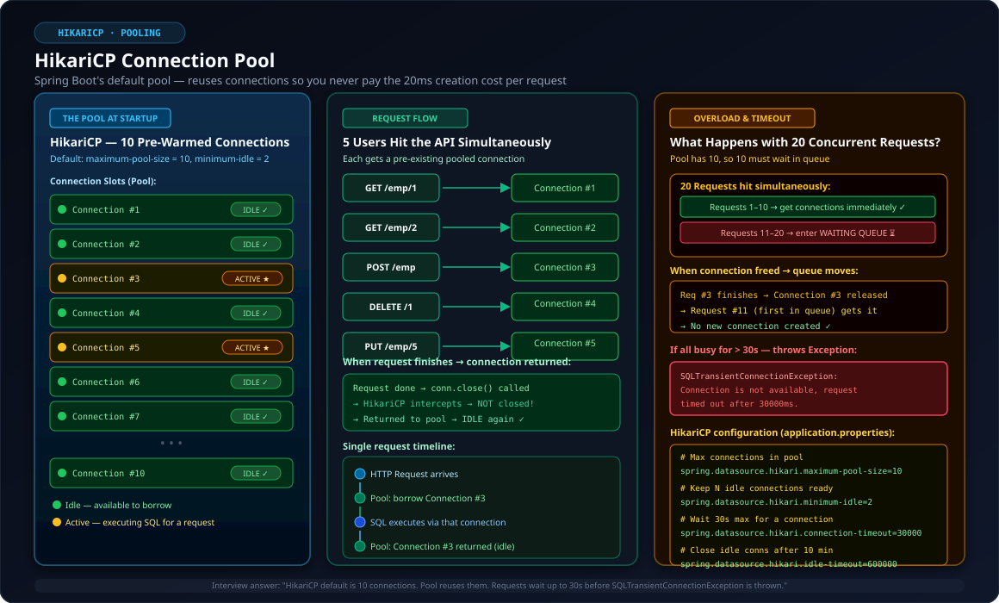
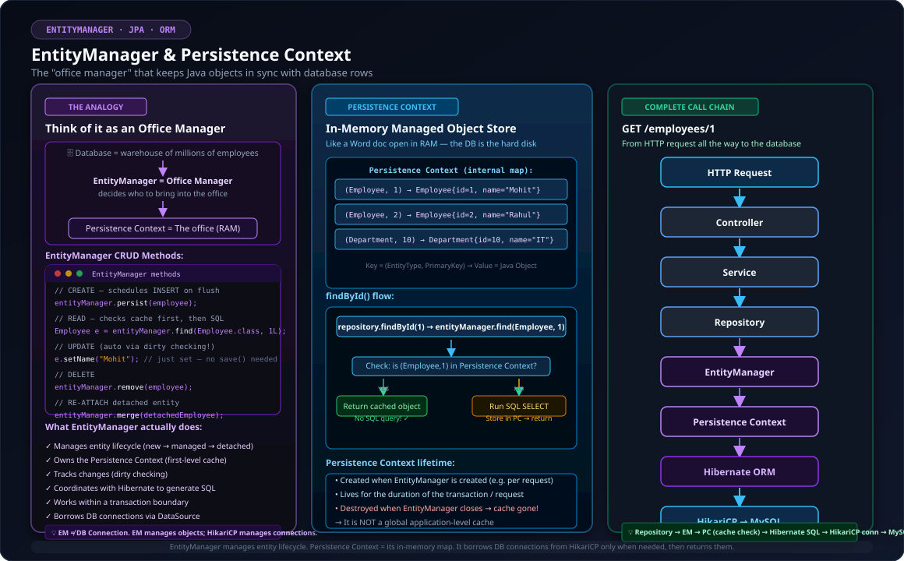
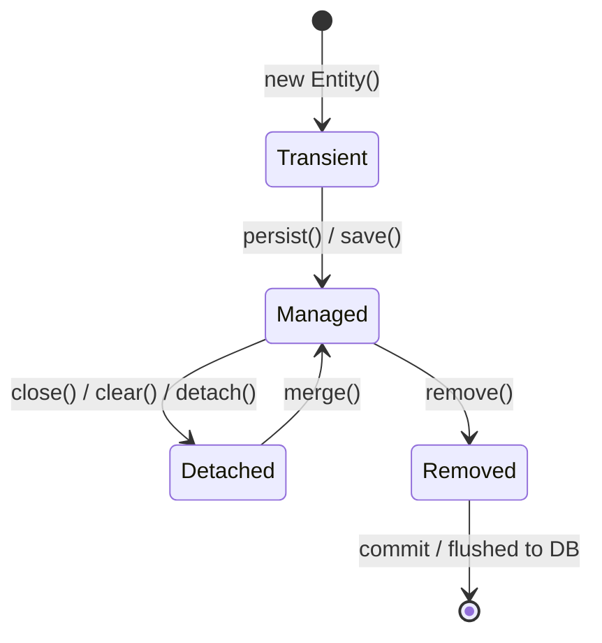
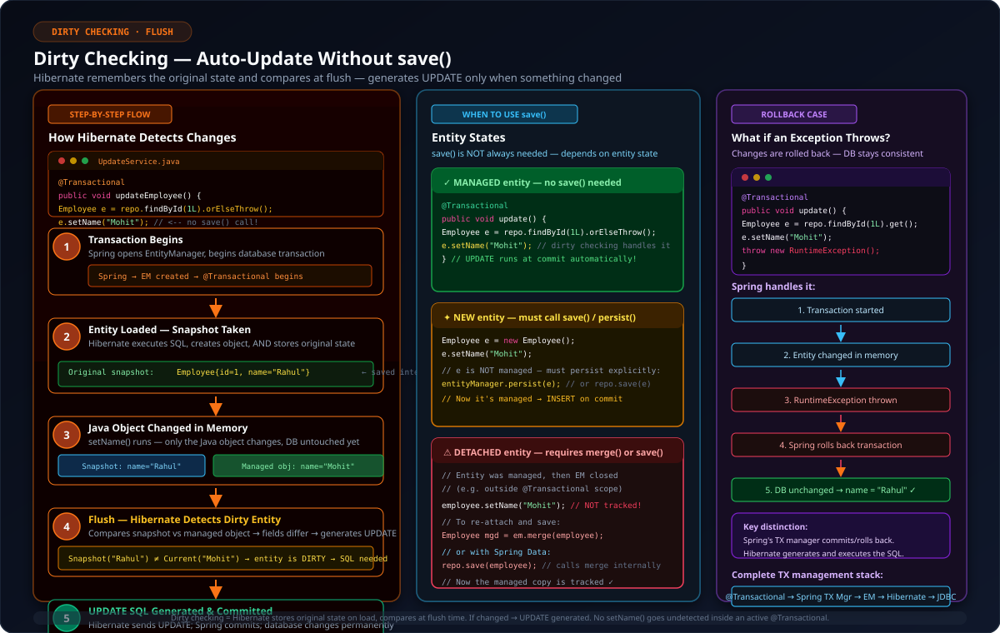
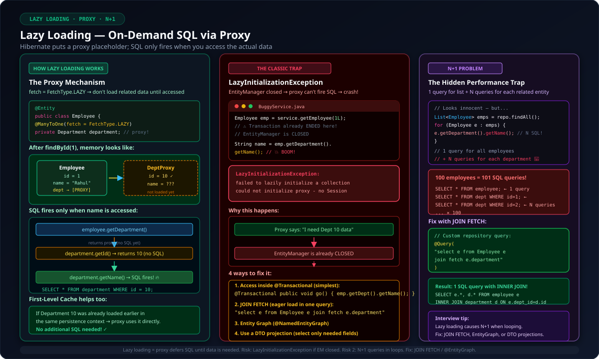

---

## 1. How Spring Boot & Database Communicate

At the physical layer, Spring Boot and your database (such as MySQL or PostgreSQL) communicate over a **network connection** (standard TCP/IP socket).

```text
Spring Boot Application (JVM)
            │
            │  TCP/IP Socket Connection (e.g., Port 3306)
            ▼
MySQL Server Daemon (mysqld)
```

Just like a web browser establishes an HTTP connection over TCP to talk to a web server, your Spring Boot application opens a TCP connection over the network to send SQL commands and receive row datasets. That live TCP channel is what we call a **database connection**.



### What Actually Happens During Connection Creation?

When your application initiates a direct connection using JDBC:

```java
Connection conn = DriverManager.getConnection(
    "jdbc:mysql://localhost:3306/company_db",
    "root",
    "secret_password"
);
```

Under the hood, the following sequence occurs:
1. **Network Handshake:** A standard TCP 3-way handshake (`SYN` → `SYN-ACK` → `ACK`) is negotiated.
2. **Database Protocol Negotiation:** Handshake packets exchange MySQL protocol version, TLS/SSL capabilities, and character encodings.
3. **Authentication:** The client sends credentials (username + hashed password) to the database server.
4. **Session Initialization:** MySQL authenticates the user, checks privileges, allocates memory buffers, and spawns a server-side session thread for this specific client socket.
5. **Connection Ready:** The socket stays open, waiting to transmit SQL statements back and forth.

---

## 2. Why Creating New Connections is Expensive

If an application opened a brand new connection for every single incoming HTTP request:

```text
Request 1 arrives ──> Open TCP Socket ──> Handshake ──> Authenticate ──> Run SQL ──> Close Socket
Request 2 arrives ──> Open TCP Socket ──> Handshake ──> Authenticate ──> Run SQL ──> Close Socket
```

### The Inherent Overhead:
- **Network Latency:** Multi-packet round trips for TCP handshake and TLS handshakes.
- **CPU & Memory Overhead on DB Server:** Authenticating, allocating dedicated thread memory and query cache per connection.
- **Latency Penalty:** Creating a connection can take **30ms to 100ms+**, whereas executing a simple indexed query might only take **1ms**. Creating and tearing down connections for every query degrades database throughput rapidly.

> [!CAUTION]
> Never open and close raw physical database connections per HTTP request in enterprise applications. The database server will quickly run out of file descriptors, threads, and memory under heavy traffic.

---

## 3. Connection Pooling with HikariCP & DataSource Architecture

To eliminate connection creation latency, modern applications use a **Connection Pool**. 

Instead of connecting on-demand and closing immediately, a pool pre-creates a batch of connections at application startup and keeps them open. When your code needs to query the database, it **borrows** a connection, runs the query, and **returns** it to the pool for reuse.



### The Role of `DataSource`

In JDBC, `DriverManager` creates fresh, unpooled connections. In enterprise Spring Boot applications, Spring injects a `javax.sql.DataSource` bean:

```java
@Autowired
private DataSource dataSource;
```

`DataSource` acts as a connection factory abstraction. Behind the scenes, Spring Boot uses **HikariCP** as its default, lightning-fast connection pooling library.

### What Happens When 20 Users Request Concurrently (Pool Size = 10)?

Suppose your application runs with the default `maximum-pool-size = 10`:

```properties
spring.datasource.hikari.maximum-pool-size=10
```

1. **Requests 1 through 10:** Each request immediately borrows an available connection from the pool and executes its SQL.
2. **Requests 11 through 20:** All 10 pool connections are busy. These remaining 10 requests enter a **blocking wait queue** managed by HikariCP.
3. **Connection Return:** As soon as Request 1 finishes and returns its connection to the pool, Request 11 wakes up and takes that connection immediately.
4. **Reused, Never Destroyed:** Connections are reused hundreds of thousands of times throughout the JVM lifecycle.

### What If All Connections Stay Busy? (`connection-timeout`)

If all connections remain in use longer than the configured timeout:

```properties
spring.datasource.hikari.connection-timeout=30000
```

HikariCP waits up to **30,000 ms (30 seconds)**. If no connection becomes free within this window, it aborts and throws:

```text
java.sql.SQLTransientConnectionException: HikariPool-1 - Connection is not available, 
request timed out after 30000ms.
```

### Essential HikariCP Configuration Properties

| Property | Default | Recommended / Purpose |
| :--- | :--- | :--- |
| `spring.datasource.hikari.maximum-pool-size` | `10` | Maximum number of physical connections the pool can hold. |
| `spring.datasource.hikari.minimum-idle` | `10` (same as max) | Minimum number of idle connections HikariCP attempts to maintain. |
| `spring.datasource.hikari.connection-timeout` | `30000` (30s) | Max milliseconds a caller waits for a connection before throwing an exception. |
| `spring.datasource.hikari.idle-timeout` | `600000` (10m) | Max milliseconds an idle connection can sit before being retired. |
| `spring.datasource.hikari.max-lifetime` | `1800000` (30m) | Maximum lifespan of a physical connection to avoid stale socket / DB timeout issues. |

> [!TIP]
> **Common Fallacy:** "More connections = Better performance."  
> If your database server has 8 CPU cores, running 500 concurrent connections causes aggressive disk I/O thrashing, CPU context switching, and row locking contention. A smaller pool (e.g., 20–50 connections) often yields higher throughput and lower query latency than an oversized pool.

---

## 4. JPA vs. Hibernate: Specifications vs. Implementations

Many developers confuse JPA and Hibernate. Their relationship is straightforward:

```text
┌───────────────────────────────────────────────────────────┐
│               JPA (Jakarta Persistence API)               │
│   • Specification / Standard (Interfaces & Annotations)   │
│   • @Entity, @Id, @Table, EntityManager interface         │
└─────────────────────────────┬─────────────────────────────┘
                              │ Implemented by
                              ▼
┌───────────────────────────────────────────────────────────┐
│                     Hibernate ORM                         │
│   • Concrete Implementation Engine                        │
│   • SessionImpl, Query Translators, Bytecode Enhancers    │
└───────────────────────────────────────────────────────────┘
```

- **JPA (Jakarta Persistence API):** A Java specification outlining standard ORM interfaces, rules, and annotations (`@Entity`, `@Table`, `@Id`, `EntityManager`). JPA does not execute any queries itself.
- **Hibernate:** The actual library that implements the JPA interfaces. Hibernate handles SQL dialect generation, proxy generation, dirty checking, caching, and executes queries via JDBC.

---

## 5. EntityManager & The Persistence Context (First-Level Cache)

The `EntityManager` is the central JPA interface responsible for managing the lifecycle of your entity objects and their interactions with the database.



### The Office & Office Manager Analogy

- **Database:** A massive company archive containing millions of records stored on disk.
- **Persistence Context:** Your private office desk (JVM memory). You don't dump millions of files on your desk—you only bring the specific files you are actively working on.
- **EntityManager:** The office manager. It retrieves files from the archive, places them on your desk, keeps an eye on edits, and writes updates back to the archive when you finish your work.

```text
                         EntityManager (Manager)
                                   │
                                   │ manages
                                   ▼
                       Persistence Context (Desk / RAM)
                                   │
            ┌──────────────────────┼──────────────────────┐
            ▼                      ▼                      ▼
       Employee#1             Employee#2            Department#10
     [Managed Entity]       [Managed Entity]       [Managed Entity]
```

### First-Level Cache & Repeatable Read in Memory

Every `EntityManager` maintains its own **Persistence Context**, also known as the **First-Level Cache**.

When you query an entity:

```java
Employee e1 = repository.findById(1L).get();
Employee e2 = repository.findById(1L).get();
```

1. **First Call (`e1`):** 
   - `EntityManager` checks the Persistence Context map: `Key=(Employee, 1L)`.
   - Not found. It generates `SELECT * FROM employee WHERE id = 1` via JDBC.
   - Converts the SQL result set into a Java `Employee` object.
   - Stores the instance in the Persistence Context and returns it.
2. **Second Call (`e2`):**
   - `EntityManager` checks the Persistence Context map.
   - Found! It returns the **exact same in-memory object instance immediately**.
   - **No SQL query is sent to the database.**

```java
System.out.println(e1 == e2); // Prints: true (Identical object reference in memory)
```

> [!NOTE]
> The First-Level Cache is scoped to the current `EntityManager` (typically one transaction or HTTP request). It is **not** a global application-wide cache. When the transaction finishes and the `EntityManager` closes, the Persistence Context is discarded.

---

## 6. EntityManager Core Operations & Entity States

An entity moves across 4 distinct states during its lifecycle:



| Entity State | Description | In Persistence Context? | Has Database Identifier? |
| :--- | :--- | :---: | :---: |
| **Transient (New)** | Instantiated via `new Employee()`. Not associated with any Hibernate session. | ❌ No | ❌ No |
| **Managed** | Actively tracked by `EntityManager`. Changes are automatically synchronized. | ✅ Yes | ✅ Yes |
| **Detached** | Was once managed, but the `EntityManager` closed or cleared. No longer tracked. | ❌ No | ✅ Yes |
| **Removed** | Scheduled for deletion in the database upon transaction commit. | ✅ Yes (marked) | ✅ Yes |

### Core `EntityManager` Methods

```java
// 1. PERSIST: Moves transient entity to managed; inserts on commit/flush
Employee emp = new Employee();
emp.setName("Mohit");
entityManager.persist(emp);

// 2. FIND: Loads entity by primary key (checks L1 cache first, then DB)
Employee emp = entityManager.find(Employee.class, 1L);

// 3. REMOVE: Marks managed entity for DELETE execution
entityManager.remove(emp);

// 4. MERGE: Copies state of detached entity into a new managed instance
Employee managedCopy = entityManager.merge(detachedEmp);
```

---

## 7. Automatic Change Detection (Dirty Checking)

One of JPA/Hibernate's most powerful features is **Dirty Checking**. You do **not** need to manually call `repository.save()` or `entityManager.update()` when modifying an already managed entity within an active transaction!



### The Snapshot Mechanism

When Hibernate loads an entity from the database into the Persistence Context, it stores **two representations**:
1. **The Managed Entity:** The actual Java object reference returned to your business logic.
2. **The Original Snapshot:** A pristine, read-only copy of the entity's state at the moment it was retrieved from the database.

```java
@Transactional
public void updateEmployeeName() {
    // Step 1: Loaded from DB -> placed in Persistence Context + Snapshot saved
    Employee emp = employeeRepository.findById(1L).orElseThrow();
    
    // Step 2: Modified in JVM memory only (No SQL executed yet!)
    emp.setName("Rahul");
    
    // No repository.save(emp) required!
}
// Step 3: Transaction boundary ends -> Flush occurs -> UPDATE employee SET name='Rahul' WHERE id=1
```

### Step-by-Step Dirty Checking Sequence:
1. **Transaction Starts:** Spring associates an `EntityManager` with the transaction thread.
2. **Entity Loaded:** Hibernate fetches the row, populates `emp`, and saves an internal snapshot (`name="Mohit"`).
3. **Property Modified:** You invoke `emp.setName("Rahul")`. The managed object now holds `"Rahul"`, but the snapshot still has `"Mohit"`.
4. **Flush Phase:** Right before transaction commit, Hibernate triggers `flush()`. It iterates all managed entities in the Persistence Context and compares their current field values against their original snapshots.
5. **SQL Generation:** Hibernate detects that `name` changed from `"Mohit"` to `"Rahul"`. It automatically constructs and issues an optimized `UPDATE employee SET name = 'Rahul' WHERE id = 1` through JDBC.
6. **Commit:** The database transaction commits, persisting the change permanently.

---

## 8. Transaction Coordination & Rollback Behavior

How do Spring, Hibernate, and the database coordinate when an error occurs?

```text
@Transactional Method
       │
       ▼
Spring PlatformTransactionManager begins TX
       │
       ▼
EntityManager joins active Transaction
       │
       ▼
Entity Modified in Memory
       │
       ├───> Normal Completion ───> Flush changes ───> SQL UPDATE ───> TX Commit
       │
       └───> RuntimeException ───> Abort Commit ───> TX Rollback ───> DB unchanged
```

### Rollback on Exception

```java
@Transactional
public void transferDepartment() {
    Employee emp = employeeRepository.findById(1L).orElseThrow();
    emp.setName("Rahul"); // In memory change
    
    if (someConditionFails()) {
        throw new RuntimeException("Validation failed!");
    }
}
```

- If an unchecked exception (`RuntimeException` or `Error`) is thrown, Spring's transaction interceptor catches it and signals the database connection to issue a **`ROLLBACK`**.
- Even if Hibernate had already flushed dirty entities to the database socket during an intermediate query, the uncommitted database transaction is reverted. No corrupted data is written.

---

## 9. Lazy Loading, Dynamic Proxies & The N+1 Query Problem

To optimize query performance, JPA supports lazy fetching for relationships:

```java
@Entity
public class Employee {
    @Id
    private Long id;
    private String name;

    @ManyToOne(fetch = FetchType.LAZY)
    private Department department;
}
```



### How Proxies Work (ByteBuddy)

When you load an `Employee`:
```sql
SELECT id, name, department_id FROM employee WHERE id = 1;
```
Hibernate retrieves `department_id = 10`, but it does **not** join the `department` table yet.

Instead, Hibernate injects a **Dynamic Proxy** subclass (generated by ByteBuddy) into `employee.department`:

```text
Employee Object
   │
   ├── id: 1
   ├── name: "Rahul"
   └── department: Department$ByteBuddy$Proxy
          ├── target: null (uninitialized)
          └── id: 10
```

1. **Accessing ID Only:** `employee.getDepartment().getId()` returns `10` **without triggering any SQL**, because the proxy already knows the foreign key identifier!
2. **Accessing Non-ID Fields:** When you call `employee.getDepartment().getName()`, the proxy intercepts the method invocation. Seeing that its `target` is null, it communicates with the active `EntityManager` to run:
   ```sql
   SELECT id, name, location FROM department WHERE id = 10;
   ```
   It initializes the real `Department` target and delegates the `.getName()` call.

### The Feared `LazyInitializationException`

If you access a lazy association after the transaction / session has closed:

```java
// Controller or non-transactional layer:
Employee emp = employeeService.getEmployee(1L); // TX ends here, EntityManager closes!

// Attempting to trigger lazy load outside TX:
String deptName = emp.getDepartment().getName(); 
```

**Result:**
```text
org.hibernate.LazyInitializationException: 
could not initialize proxy [com.example.Department#10] - no Session
```
*Why?* The proxy needs an active database connection and Persistence Context to fetch the missing row, but the `EntityManager` was already closed!

### The N+1 Problem and How to Fix It

If you fetch 100 employees and loop through each employee's lazy department:
1. `SELECT * FROM employee` (1 query returns 100 employees)
2. `100 * SELECT * FROM department WHERE id = ?` (100 individual queries for each department)
Total queries: **1 + N = 101 queries!**

#### Solution 1: `JOIN FETCH` in JPQL
```java
@Query("SELECT e FROM Employee e JOIN FETCH e.department WHERE e.status = :status")
List<Employee> findAllActiveWithDepartment(@Param("status") String status);
```
Executes a single SQL `INNER JOIN` or `LEFT JOIN`, fetching both Employee and Department in 1 round-trip.

#### Solution 2: `@EntityGraph`
```java
@EntityGraph(attributePaths = {"department"})
List<Employee> findByStatus(String status);
```

---

## 10. Direct JDBC vs. JPA / EntityManager Comparison

| Feature / Responsibility | Raw JDBC (`DriverManager` / `Connection`) | JPA / Hibernate (`EntityManager`) |
| :--- | :--- | :--- |
| **Connection Handling** | Manual `getConnection()`, `close()` boilerplate. | Automatic borrowing & returning from HikariCP pool. |
| **SQL Writing** | Hand-written string SQL (`SELECT`, `INSERT`, `UPDATE`). | Auto-generated SQL tailored to dialect (MySQL, PG, Oracle). |
| **Object Mapping** | Manual extraction from `ResultSet` (`rs.getString(...)`). | Automatic ORM hydration into strongly typed Java entities. |
| **Update Detection** | Manual SQL `UPDATE` for every field explicitly. | **Dirty Checking:** Automatically detects and updates changed fields. |
| **Identity Guarantee** | Multiple queries instantiate duplicate objects in memory. | **1st-Level Cache:** Same DB row yields identical Java reference (`==`). |
| **Transactions** | Manual `conn.setAutoCommit(false)`, `commit()`, `rollback()`. | Declarative with `@Transactional` managed by Spring. |
| **Relationship Loading** | Manual complex JOIN queries or repeated lookups. | Dynamic Proxies, transparent Lazy Loading, and `@EntityGraph`. |

---

## 11. End-to-End Request Lifecycle Flow

Here is the exact journey of an HTTP request updating an entity in a Spring Boot application:

```text
1. Client HTTP Request: PUT /employees/1/name?val=Rahul
                       │
                       ▼
2. Controller passes DTO to Service layer
                       │
                       ▼
3. @Transactional Interceptor kicks in:
   • Spring begins transaction
   • Binds EntityManager to the current thread
                       │
                       ▼
4. repository.findById(1L):
   • Checks Persistence Context (Empty)
   • Borrows connection from HikariCP pool
   • Executes: SELECT * FROM employee WHERE id = 1
   • Creates Employee Java object & stores Snapshot in Persistence Context
                       │
                       ▼
5. Business Logic:
   • emp.setName("Rahul")
   • Only memory is updated; DB remains untouched
                       │
                       ▼
6. Service method exits (Transaction Commit boundary):
   • Hibernate flushes Persistence Context
   • Compares Managed Entity vs. Snapshot -> Detected change in 'name'
   • Executes: UPDATE employee SET name = 'Rahul' WHERE id = 1
   • HikariCP connection commits transaction
   • HikariCP connection returned to pool
                       │
                       ▼
7. EntityManager closes & Persistence Context cleared
                       │
                       ▼
8. HTTP 200 OK Response sent to client
```

---

## 12. High-Yield Interview Questions & Cheat Sheet

### Q1: What is the difference between a Database Connection and an EntityManager?
> **Answer:** A **Database Connection** is a low-level physical TCP/IP network socket between the application and the database server (managed by HikariCP). An **EntityManager** is a high-level JPA interface that manages Java entity objects in memory (Persistence Context), performs dirty checking, handles first-level caching, and translates object operations into SQL statements executed through a borrowed connection.

### Q2: What happens if EntityManager doesn't exist? What does it help us do?
> **Answer:** Without `EntityManager`, you would have to manually handle **every aspect** of database interaction yourself using raw JDBC. This means manually opening/closing connections, writing SQL strings, mapping `ResultSet` rows to Java objects field by field, tracking which fields changed (no automatic dirty checking), and managing transactions with explicit `commit()` / `rollback()` calls. The `EntityManager` abstracts all of this away — it provides automatic object-relational mapping, first-level caching, dirty checking, lazy loading, and declarative transaction support.
>
> **Example — Without EntityManager (Raw JDBC):**
> ```java
> Connection conn = dataSource.getConnection();
> try {
>     conn.setAutoCommit(false);
>
>     // 1. Manually write SQL
>     PreparedStatement ps = conn.prepareStatement(
>         "SELECT id, name, salary FROM employee WHERE id = ?"
>     );
>     ps.setLong(1, 1L);
>     ResultSet rs = ps.executeQuery();
>
>     // 2. Manually map each column to a Java object
>     Employee emp = null;
>     if (rs.next()) {
>         emp = new Employee();
>         emp.setId(rs.getLong("id"));
>         emp.setName(rs.getString("name"));
>         emp.setSalary(rs.getDouble("salary"));
>     }
>
>     // 3. Modify and manually write UPDATE SQL
>     emp.setName("Rahul");
>     PreparedStatement update = conn.prepareStatement(
>         "UPDATE employee SET name = ? WHERE id = ?"
>     );
>     update.setString(1, emp.getName());
>     update.setLong(2, emp.getId());
>     update.executeUpdate();
>
>     // 4. Manually commit
>     conn.commit();
> } catch (Exception e) {
>     conn.rollback(); // 5. Manually rollback on error
>     throw e;
> } finally {
>     conn.close(); // 6. Manually close connection
> }
> ```
>
> **Same operation With EntityManager (JPA):**
> ```java
> @Transactional
> public void updateName() {
>     Employee emp = employeeRepository.findById(1L).orElseThrow();
>     emp.setName("Rahul");
>     // That's it! No SQL, no manual mapping, no commit/rollback/close needed.
> }
> ```
>
> The EntityManager handles connection borrowing, SQL generation, result mapping, dirty checking (`name` changed from `"Mohit"` → `"Rahul"`), automatic `UPDATE` generation at flush time, transaction commit, and connection return — all behind the scenes.

### Q3: How does HikariCP handle connection sizing, and what happens when all connections are busy?
> **Answer:** HikariCP defaults to a `maximum-pool-size` of 10. When all 10 connections are in use, incoming requests queue up until a connection is returned. If no connection becomes free before `connection-timeout` (default 30 seconds) expires, HikariCP throws a `SQLTransientConnectionException`.

### Q4: Why don't you need to call `repository.save()` when updating an entity inside a `@Transactional` method?
> **Answer:** Because of **Dirty Checking**. When an entity is loaded inside an active transaction, it becomes *managed* within the Persistence Context, and Hibernate preserves an initial snapshot of its state. When the transaction finishes, Hibernate flushes the context, compares the current object state against the snapshot, and automatically executes an `UPDATE` query for any modified fields.

### Q5: What causes a `LazyInitializationException` and how do you resolve it?
> **Answer:** It occurs when your code attempts to access an uninitialized lazy association or collection after the `EntityManager` / Hibernate session has closed (e.g., in a controller or view layer outside `@Transactional`). Because the proxy cannot borrow a connection to load the data, it fails. Solutions include:
> 1. Fetching the relationship eagerly using **`JOIN FETCH`** in JPQL.
> 2. Using Spring Data JPA **`@EntityGraph`**.
> 3. Loading required attributes inside a `@Transactional` service boundary or mapping to a DTO directly.

### Q6: What is the Persistence Context, and does it act as a global cache?
> **Answer:** No, the Persistence Context (First-Level Cache) is **not** global. It is bound to a single `EntityManager` / transaction lifecycle. Its purpose is to guarantee entity identity within a single unit of work (so `id=1` is never instantiated as two different Java objects) and to batch/delay SQL executions until flush time.

---
