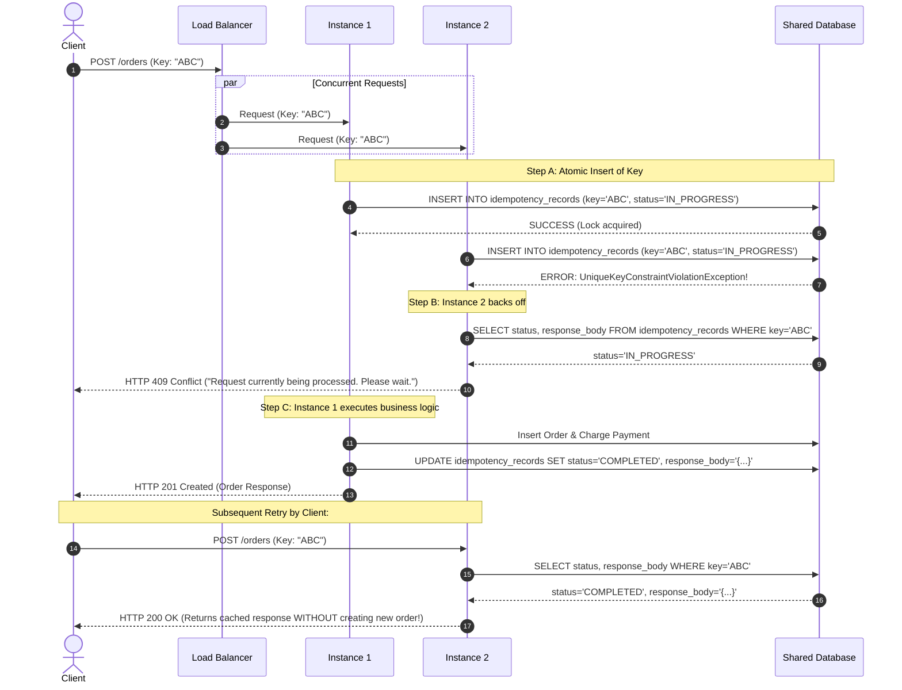

# Scenario 1: Optimizing Nested External API Calls (User -> Address -> City)

---

## 1. The Scenario & The Problem

You fetch a `List<User>`, where each `User` contains a `List<Address>`. While converting them into a response DTO, you need city details for each address by calling an external client: `addressClient.getCity(addressId)`.

### The Naive / Problematic Implementation

```java
@Service
public class UserService {

    @Autowired
    private UserRepository userRepository;

    @Autowired
    private AddressClient addressClient; // External REST / Feign / WebClient

    public List<UserResponseDTO> getUsersWithCityDetails() {
        List<User> users = userRepository.findAll();

        List<UserResponseDTO> responseList = new ArrayList<>();

        for (User user : users) {
            List<AddressDTO> addressDTOs = new ArrayList<>();

            for (Address address : user.getAddresses()) {
                // ⚠️ THE TRAP: Calling external HTTP service in a nested loop!
                CityDTO city = addressClient.getCity(address.getId());

                AddressDTO addressDTO = new AddressDTO(address.getId(), address.getStreet(), city);
                addressDTOs.add(addressDTO);
            }

            responseList.add(new UserResponseDTO(user.getId(), user.getName(), addressDTOs));
        }

        return responseList;
    }
}
```

---

### Why This Destroys Performance ("Distributed N+1 Problem")

Assume:
- 100 Users
- Each User has an average of 2 Addresses (200 addresses total)
- External `addressClient.getCity()` takes **50ms** per HTTP call (network latency + processing)

$$\text{Total Time} = 200 \times 50\text{ ms} = 10,000\text{ ms} = \mathbf{10\text{ seconds!}}$$

#### Additional Hidden Issues:
1. **Duplicate Network Calls:** If 50 addresses belong to the same city or share IDs, you are fetching the exact same data repeatedly over the network.
2. **Connection Pool Starvation:** Synchronous HTTP clients (like `RestTemplate` or default `HttpClient`) tie up connection pool slots and worker threads.
3. **Cascading Failures & Rate Limits:** Hammering the external service with hundreds of calls per incoming request triggers HTTP 429 (Too Many Requests) or external service outages.

---

## 2. Optimization Strategies

---

### Strategy 1: Batch / Bulk API Endpoint (The Best & Recommended Solution)

Instead of calling the external service 1-by-1 in a loop, extract all unique IDs and make **one single bulk HTTP call**.

#### Step 1: Collect Unique IDs
```java
// Extract unique address IDs across all users
Set<Long> uniqueAddressIds = users.stream()
        .flatMap(u -> u.getAddresses().stream())
        .map(Address::getId)
        .collect(Collectors.toSet());
```

#### Step 2: Call Bulk Endpoint Once
```java
// 1 network call instead of 200!
// Map<AddressId, CityDTO>
Map<Long, CityDTO> cityMap = addressClient.getCitiesByAddressIds(uniqueAddressIds);
```

#### Step 3: Stitch Data in Memory (O(1) lookup)
```java
public List<UserResponseDTO> getUsersOptimizedBatch() {
    List<User> users = userRepository.findAll();

    // 1. Gather all unique address IDs
    Set<Long> addressIds = users.stream()
            .flatMap(user -> user.getAddresses().stream())
            .map(Address::getId)
            .collect(Collectors.toSet());

    // 2. Fetch in a single batch call
    Map<Long, CityDTO> cityMap = addressClient.getCitiesByAddressIds(addressIds);

    // 3. Assemble DTOs in memory
    return users.stream().map(user -> {
        List<AddressDTO> addressDTOs = user.getAddresses().stream().map(address -> {
            CityDTO city = cityMap.get(address.getId());
            return new AddressDTO(address.getId(), address.getStreet(), city);
        }).toList();

        return new UserResponseDTO(user.getId(), user.getName(), addressDTOs);
    }).toList();
}
```

> **Performance Gain:** 200 requests (10s) $\rightarrow$ **1 request (~80ms)**.

---

### Strategy 2: Caching (Redis or In-Memory Caffeine)

City and address mapping data is usually static and rarely changes. Caching prevents redundant network hops.

#### Option A: Spring `@Cacheable` on the Client
```java
@Component
public class CachedAddressClient {

    @Autowired
    private AddressClient addressClient;

    // Results cached in Redis / Caffeine with TTL (e.g., 1 hour)
    @Cacheable(value = "cityCache", key = "#addressId", unless = "#result == null")
    public CityDTO getCity(Long addressId) {
        return addressClient.getCity(addressId);
    }
}
```

#### Option B: Bulk Caching with Redis MGET
If using batching, you can:
1. Check Redis for cached IDs using `MGET`.
2. Only call `addressClient.getCitiesByAddressIds(...)` for IDs that had a cache miss.
3. Save missing results back to Redis with `MSET`.

---

### Strategy 3: Parallel / Asynchronous Calls (`CompletableFuture` or Virtual Threads)

What if the external team **refuses** or **cannot provide a batch endpoint**?
You can fan-out the requests concurrently instead of waiting sequentially.

#### Using `CompletableFuture` with a Dedicated Custom Thread Pool

> ⚠️ **Important:** Never use the default `ForkJoinPool.commonPool()` for blocking I/O calls. Use a dedicated `ExecutorService`.

```java
@Service
public class UserService {

    @Autowired
    private AddressClient addressClient;

    @Autowired
    @Qualifier("externalApiExecutor")
    private Executor externalApiExecutor;

    public List<UserResponseDTO> getUsersParallel() {
        List<User> users = userRepository.findAll();

        // 1. Extract unique address IDs to avoid duplicate calls
        Set<Long> uniqueIds = users.stream()
                .flatMap(u -> u.getAddresses().stream())
                .map(Address::getId)
                .collect(Collectors.toSet());

        // 2. Fire calls concurrently in the dedicated thread pool
        Map<Long, CompletableFuture<CityDTO>> futuresMap = uniqueIds.stream()
                .collect(Collectors.toMap(
                        id -> id,
                        id -> CompletableFuture.supplyAsync(() -> addressClient.getCity(id), externalApiExecutor)
                                .exceptionally(ex -> fallbackCity(id, ex)) // Error handling / Fallback
                ));

        // 3. Wait for all futures to finish
        CompletableFuture.allOf(futuresMap.values().toArray(new CompletableFuture[0])).join();

        // 4. Extract results into Map<Long, CityDTO>
        Map<Long, CityDTO> cityMap = futuresMap.entrySet().stream()
                .collect(Collectors.toMap(
                        Map.Entry::getKey,
                        entry -> entry.getValue().join()
                ));

        // 5. In-memory assembly
        return mapToUserDTOs(users, cityMap);
    }
}
```

#### Configuration for Dedicated Thread Pool:
```java
@Configuration
public class AsyncConfig {

    @Bean("externalApiExecutor")
    public Executor externalApiExecutor() {
        ThreadPoolTaskExecutor executor = new ThreadPoolTaskExecutor();
        executor.setCorePoolSize(20);
        executor.setMaxPoolSize(50);
        executor.setQueueCapacity(200);
        executor.setThreadNamePrefix("ExtCityApi-");
        executor.initialize();
        return executor;
    }
}
```

#### Using Java 21 Virtual Threads (Project Loom)
If on Java 21+, virtual threads make concurrent blocking I/O lightweight without thread pool overhead:
```java
try (var executor = Executors.newVirtualThreadPerTaskExecutor()) {
    List<Future<Pair<Long, CityDTO>>> futures = uniqueIds.stream()
        .map(id -> executor.submit(() -> Pair.of(id, addressClient.getCity(id))))
        .toList();

    Map<Long, CityDTO> cityMap = new HashMap<>();
    for (var future : futures) {
        Pair<Long, CityDTO> pair = future.get();
        cityMap.put(pair.getFirst(), pair.getSecond());
    }
}
```

---

### Strategy 4: Reactive Non-Blocking Streams (Spring WebFlux / WebClient)

If your stack uses Spring WebFlux, you can use reactive streams with concurrency controls:

```java
public Mono<List<UserResponseDTO>> getUsersReactive() {
    return userRepository.findAllUsers()
        .collectList()
        .flatMap(users -> {
            Set<Long> uniqueIds = users.stream()
                    .flatMap(u -> u.getAddresses().stream())
                    .map(Address::getId)
                    .collect(Collectors.toSet());

            return Flux.fromIterable(uniqueIds)
                    // flatMap with concurrency limit to prevent overwhelming external service
                    .flatMap(id -> webClient.get()
                            .uri("/cities/{id}", id)
                            .retrieve()
                            .bodyToMono(CityDTO.class)
                            .map(city -> Map.entry(id, city)), 20) 
                    .collectMap(Map.Entry::getKey, Map.Entry::getValue)
                    .map(cityMap -> mapToUserDTOs(users, cityMap));
        });
}
```

---

### Strategy 5: Architectural Fixes (Data Sync & Denormalization)

If this data is fetched frequently on critical read paths:

1. **Denormalization / Local Replica:**
   - Store `city_name`, `state`, and `pincode` directly in your local `Address` entity/table.
   - Eliminates runtime HTTP dependencies completely.
2. **Event-Driven Synchronization (Kafka / RabbitMQ):**
   - Whenever an address or city is updated in the Address Service, publish an event: `AddressUpdatedEvent`.
   - Your service consumes the event and updates its local table or cache asynchronously.

---

## 3. Production Safeguards (Resilience4j)

External calls can hang, time out, or fail. When optimizing external calls:

1. **Strict Timeouts:**
   - Always set `connectTimeout` (e.g. 500ms) and `readTimeout` (e.g. 1500ms) on HTTP clients.
2. **Circuit Breaker & Fallback:**
   - Use Resilience4j `@CircuitBreaker(name = "addressService", fallbackMethod = "defaultCityFallback")`.
   - Return a default `CityDTO("UNKNOWN")` or cached value instead of failing the entire user request.
3. **Rate Limiting / Bulkhead:**
   - Limit maximum concurrent outgoing connections to avoid getting blocked by the external API provider.

---

## 4. Decision Matrix: Which One to Choose?

| Scenario | Best Choice | Expected Latency Reduction |
| :--- | :--- | :--- |
| External team can add a batch endpoint | **Strategy 1: Batch API** | 90% - 98% reduction |
| Data rarely changes / repetitive lookups | **Strategy 2: Redis / Caffeine Cache** | ~99% reduction on cache hits |
| External team cannot add batch API | **Strategy 3: CompletableFuture / Virtual Threads** | 75% - 85% reduction |
| Reactive Spring WebFlux microservice | **Strategy 4: WebClient + flatMap concurrency** | High throughput & non-blocking |
| High-traffic core business flow | **Strategy 5: Event-Driven Sync (Kafka)** | 100% reduction (Zero HTTP calls) |

---
---

# Scenario 2: Aggregating Order & Product Costs for a User (UserId -> Orders -> Products -> Cost API)

---

## 1. The Scenario & The Problem

You receive a `userId`. 
1. You fetch `List<Order>` for that user.
2. Each `Order` contains a `List<Product>` (each product has `productId` and `name`).
3. To calculate the cost, you must call an external client: `orderClient.getCost(productId, name)`.
4. **Goal:** Calculate:
   - The individual cost of each product.
   - The total cost of each order.
   - The grand total cost across all orders for the user.

---

### The Naive / Costly Implementation

```java
@Service
public class OrderCostService {

    @Autowired
    private OrderRepository orderRepository;

    @Autowired
    private OrderClient orderClient; // External pricing/cost service

    public UserTotalCostResponseDTO calculateUserOrdersCostNaive(Long userId) {
        List<Order> orders = orderRepository.findByUserId(userId);

        BigDecimal userGrandTotal = BigDecimal.ZERO;
        List<OrderCostDTO> orderCostDTOs = new ArrayList<>();

        for (Order order : orders) {
            BigDecimal orderTotal = BigDecimal.ZERO;
            List<ProductCostDTO> productDTOs = new ArrayList<>();

            for (Product product : order.getProducts()) {
                // ⚠️ THE TRAP 1: Sequential external HTTP call per product!
                // ⚠️ THE TRAP 2: What if product (ID: 101, "Mouse") appears in Order 1 AND Order 3?
                //                We call external service twice for the exact same item!
                BigDecimal cost = orderClient.getCost(product.getProductId(), product.getName());

                orderTotal = orderTotal.add(cost);
                productDTOs.add(new ProductCostDTO(product.getProductId(), product.getName(), cost));
            }

            userGrandTotal = userGrandTotal.add(orderTotal);
            orderCostDTOs.add(new OrderCostDTO(order.getId(), orderTotal, productDTOs));
        }

        return new UserTotalCostResponseDTO(userId, userGrandTotal, orderCostDTOs);
    }
}
```

---

### Why This Is Dangerous:
1. **Multiplied Latency:** If the user has 10 orders with 4 products each = **40 sequential HTTP calls**. At 100ms/call = **4 seconds** blocking thread time!
2. **Duplicate Calls for Same Products:** Users often re-order standard items (e.g. coffee, cables, accessories). Calling the external service multiple times for the identical `(productId, name)` wastes network bandwidth and pricing quota.
3. **Monetary Precision:** Always use `BigDecimal` instead of `double`/`float` to prevent IEEE 754 floating-point rounding errors on prices.

---

## 2. Key Pattern: Composite Key Deduplication

Notice that `getCost(productId, name)` takes **two** parameters (`productId` and `name`).
To deduplicate requests, define a Java `record` as a composite key:

```java
// Java Record gives built-in equals(), hashCode(), and toString()
public record ProductKey(Long productId, String name) {}
```

By collecting products into a `Set<ProductKey>`, identical products across all orders are automatically deduplicated into a single entry!

---

## 3. Step-by-Step Optimization Solutions

---

### Strategy 1: Batch Pricing API (Best Practice)

Request a batch endpoint from the pricing/order service:  
`POST /costs/batch` taking a list of `ProductKey` and returning `Map<ProductKey, BigDecimal>`.

```java
@Service
public class OrderCostService {

    @Autowired
    private OrderRepository orderRepository;

    @Autowired
    private OrderClient orderClient;

    public UserTotalCostResponseDTO calculateUserOrdersCostBatch(Long userId) {
        // 1. Fetch user orders
        List<Order> orders = orderRepository.findByUserId(userId);
        if (orders.isEmpty()) {
            return new UserTotalCostResponseDTO(userId, BigDecimal.ZERO, List.of());
        }

        // 2. Extract UNIQUE composite keys across ALL orders (Deduplication)
        Set<ProductKey> uniqueKeys = orders.stream()
                .flatMap(order -> order.getProducts().stream())
                .map(product -> new ProductKey(product.getProductId(), product.getName()))
                .collect(Collectors.toSet());

        // 3. Make ONE batch network call
        // Returns Map<ProductKey, BigDecimal>
        Map<ProductKey, BigDecimal> priceMap = orderClient.getCostsBatch(uniqueKeys);

        // 4. In-Memory Calculation (O(1) lookups)
        BigDecimal userGrandTotal = BigDecimal.ZERO;
        List<OrderCostDTO> orderCostDTOs = new ArrayList<>();

        for (Order order : orders) {
            BigDecimal orderTotal = BigDecimal.ZERO;
            List<ProductCostDTO> productDTOs = new ArrayList<>();

            for (Product product : order.getProducts()) {
                ProductKey key = new ProductKey(product.getProductId(), product.getName());
                BigDecimal cost = priceMap.getOrDefault(key, BigDecimal.ZERO);

                orderTotal = orderTotal.add(cost);
                productDTOs.add(new ProductCostDTO(product.getProductId(), product.getName(), cost));
            }

            userGrandTotal = userGrandTotal.add(orderTotal);
            orderCostDTOs.add(new OrderCostDTO(order.getId(), orderTotal, productDTOs));
        }

        return new UserTotalCostResponseDTO(userId, userGrandTotal, orderCostDTOs);
    }
}
```

---

### Strategy 2: Deduplicated Parallel Fan-Out (`CompletableFuture`)

If the external API **only** supports single queries `orderClient.getCost(id, name)`:
1. Deduplicate unique keys first (never make duplicate HTTP calls).
2. Query them all in parallel using a dedicated thread pool.
3. Stitch results into the orders.

```java
@Service
public class OrderCostService {

    @Autowired
    private OrderRepository orderRepository;

    @Autowired
    private OrderClient orderClient;

    @Autowired
    @Qualifier("pricingExecutor")
    private Executor pricingExecutor;

    public UserTotalCostResponseDTO calculateUserOrdersCostParallel(Long userId) {
        List<Order> orders = orderRepository.findByUserId(userId);
        if (orders.isEmpty()) {
            return new UserTotalCostResponseDTO(userId, BigDecimal.ZERO, List.of());
        }

        // 1. Deduplicate keys
        Set<ProductKey> uniqueKeys = orders.stream()
                .flatMap(order -> order.getProducts().stream())
                .map(p -> new ProductKey(p.getProductId(), p.getName()))
                .collect(Collectors.toSet());

        // 2. Fire concurrent calls ONLY for unique keys
        Map<ProductKey, CompletableFuture<BigDecimal>> futureMap = uniqueKeys.stream()
                .collect(Collectors.toMap(
                        key -> key,
                        key -> CompletableFuture.supplyAsync(
                                () -> orderClient.getCost(key.productId(), key.name()),
                                pricingExecutor
                        ).exceptionally(ex -> BigDecimal.ZERO) // Fallback on failure
                ));

        // 3. Wait for all parallel calls to complete
        CompletableFuture.allOf(futureMap.values().toArray(new CompletableFuture[0])).join();

        // 4. Resolve futures into Map<ProductKey, BigDecimal>
        Map<ProductKey, BigDecimal> priceMap = futureMap.entrySet().stream()
                .collect(Collectors.toMap(
                        Map.Entry::getKey,
                        entry -> entry.getValue().join()
                ));

        // 5. Aggregate order totals and user grand total
        return aggregateUserAndOrderTotals(userId, orders, priceMap);
    }
}
```

#### Dedicated Executor Configuration:
```java
@Bean("pricingExecutor")
public Executor pricingExecutor() {
    ThreadPoolTaskExecutor executor = new ThreadPoolTaskExecutor();
    executor.setCorePoolSize(15);
    executor.setMaxPoolSize(30);
    executor.setQueueCapacity(100);
    executor.setThreadNamePrefix("PricingPool-");
    executor.initialize();
    return executor;
}
```

---

### Strategy 3: Java 21 Virtual Threads Fan-Out

On Java 21+, you can avoid manual thread-pool tuning by using `Executors.newVirtualThreadPerTaskExecutor()`:

```java
try (var executor = Executors.newVirtualThreadPerTaskExecutor()) {
    Map<ProductKey, Future<BigDecimal>> futureMap = uniqueKeys.stream()
            .collect(Collectors.toMap(
                    key -> key,
                    key -> executor.submit(() -> orderClient.getCost(key.productId(), key.name()))
            ));

    Map<ProductKey, BigDecimal> priceMap = new HashMap<>();
    for (var entry : futureMap.entrySet()) {
        try {
            priceMap.put(entry.getKey(), entry.getValue().get());
        } catch (Exception e) {
            priceMap.put(entry.getKey(), BigDecimal.ZERO); // Fallback
        }
    }
    return aggregateUserAndOrderTotals(userId, orders, priceMap);
}
```

---

### Strategy 4: Caching with Composite Key (Spring Cache / Redis)

Product prices usually change infrequently. Cache prices using the composite key `#productId + ':' + #name`:

```java
@Component
public class CachedOrderClient {

    @Autowired
    private OrderClient orderClient;

    @Cacheable(value = "productPriceCache", key = "#productId + ':' + #name", unless = "#result == null")
    public BigDecimal getCost(Long productId, String name) {
        return orderClient.getCost(productId, name);
    }
}
```

---

## 4. Complete DTO Models

```java
// Composite key record
public record ProductKey(Long productId, String name) {}

// Product with cost
public record ProductCostDTO(Long productId, String name, BigDecimal cost) {}

// Order with its total cost
public record OrderCostDTO(Long orderId, BigDecimal orderTotalCost, List<ProductCostDTO> products) {}

// User final response
public record UserTotalCostResponseDTO(Long userId, BigDecimal grandTotalCost, List<OrderCostDTO> orders) {}
```

---

## 5. Summary Flow

```
[Input: userId]
       │
       ▼
Fetch List<Order> from DB
       │
       ▼
Extract Unique Set<ProductKey(productId, name)> (Deduplication)
       │
       ├── Option A: 1 Bulk Call -> orderClient.getCostsBatch(uniqueKeys)  [FASTEST]
       │
       ├── Option B: Check Cache -> Redis MGET(keys), call API only for misses
       │
       └── Option C: Parallel Async -> CompletableFuture.allOf() across uniqueKeys
       │
       ▼
Populate Map<ProductKey, BigDecimal>
       │
       ▼
In-Memory Aggregation:
  ├── Sum up each Order's cost
  └── Sum up User's grand total cost
       │
       ▼
Return UserTotalCostResponseDTO
```

---
---

# Scenario 3: Distributed Idempotency Across Multiple Instances (Preventing Duplicate Orders)

---

## 1. The Scenario & The Problem

In a distributed microservice setup:
- You have **2 (or more) instances** of the Spring Boot application running behind a Load Balancer (or receiving asynchronous webhooks/retries).
- The client sends an order request with an **`Idempotency-Key`** header:
  ```http
  POST /api/v1/orders
  Idempotency-Key: 9b1deb4d-3b7d-4bad-9bdd-2b0d7b3dcb6d
  Content-Type: application/json

  { "userId": 101, "productId": 45, "quantity": 1 }
  ```
- Due to a network retry, browser double-click, or concurrent execution, **Instance 1** and **Instance 2** receive the exact same request with the identical key at the **exact same millisecond**.

---

### Why Local Java Locks Fail

```java
// ⚠️ THE FATAL MISTAKE:
public synchronized OrderResponse createOrder(CreateOrderRequest req) { ... }
// OR
private final ReentrantLock lock = new ReentrantLock();
```
> **Why this fails:** Local Java locks only synchronize threads **inside a single JVM**.  
> **Instance 1** and **Instance 2** are completely independent JVMs on different containers/servers. Each instance acquires its own local lock simultaneously and creates two duplicate orders in the database!

---

### The Race Condition Sequence

```
Client / LB
   ├─── Request (Key: "ABC") ───► Instance 1 ───► Check DB ("Does 'ABC' exist?") ──► "No" ──► Insert Order 1
   │
   └─── Request (Key: "ABC") ───► Instance 2 ───► Check DB ("Does 'ABC' exist?") ──► "No" ──► Insert Order 2
                                                                                     ▲
                                                             Both checked before either could finish writing!
```

---

## 2. Solution 1: Database Unique Constraint & State Machine (Strong Consistency, Zero Extra Infrastructure)

The database is your single source of truth. Use a dedicated `idempotency_record` table with a **Unique Constraint** on the `idempotency_key`.

### Step 1: Idempotency Record Entity / Schema

```sql
CREATE TABLE idempotency_records (
    idempotency_key VARCHAR(255) PRIMARY KEY,
    request_hash VARCHAR(64) NOT NULL,          -- SHA-256 of request body to detect payload tampering
    status VARCHAR(20) NOT NULL,                 -- 'IN_PROGRESS', 'COMPLETED', 'FAILED'
    response_body TEXT,                          -- Cached JSON response
    created_at TIMESTAMP DEFAULT CURRENT_TIMESTAMP,
    updated_at TIMESTAMP DEFAULT CURRENT_TIMESTAMP ON UPDATE CURRENT_TIMESTAMP
);
```

```java
@Entity
@Table(name = "idempotency_records")
@Getter @Setter @NoArgsConstructor @AllArgsConstructor
public class IdempotencyRecord {

    @Id
    @Column(name = "idempotency_key")
    private String idempotencyKey;

    @Column(nullable = false)
    private String requestHash;

    @Enumerated(EnumType.STRING)
    @Column(nullable = false)
    private IdempotencyStatus status; // IN_PROGRESS, COMPLETED, FAILED

    @Column(columnDefinition = "TEXT")
    private String responseBody;

    private Instant createdAt;
    private Instant updatedAt;
}
```

---

### Step 2: The Two-Instance Execution Flow



---

### Step 3: Implementation Code

```java
@Service
public class OrderService {

    @Autowired
    private IdempotencyRecordRepository idempotencyRepo;

    @Autowired
    private OrderRepository orderRepository;

    @Autowired
    private ObjectMapper objectMapper;

    @Transactional(noRollbackFor = DuplicateIdempotencyException.class)
    public OrderResponseDTO createOrder(String idempotencyKey, CreateOrderRequest request) {
        String currentHash = hashPayload(request);

        // 1. Try to acquire the idempotency slot
        try {
            IdempotencyRecord initialRecord = new IdempotencyRecord(
                    idempotencyKey,
                    currentHash,
                    IdempotencyStatus.IN_PROGRESS,
                    null,
                    Instant.now(),
                    Instant.now()
            );
            // Must flush to force immediate unique constraint check in DB
            idempotencyRepo.saveAndFlush(initialRecord);
        } catch (DataIntegrityViolationException ex) {
            // Another instance (Instance 2) hit the unique constraint!
            return handleDuplicateRequest(idempotencyKey, currentHash);
        }

        // 2. We are Instance 1 (Lock winner) -> Execute business logic
        try {
            Order order = new Order(request.getUserId(), request.getProductId(), request.getQuantity());
            orderRepository.save(order);

            OrderResponseDTO response = new OrderResponseDTO(order.getId(), "CREATED", order.getTotalAmount());
            String responseJson = objectMapper.writeValueAsString(response);

            // 3. Mark COMPLETED and cache response
            IdempotencyRecord record = idempotencyRepo.findById(idempotencyKey).orElseThrow();
            record.setStatus(IdempotencyStatus.COMPLETED);
            record.setResponseBody(responseJson);
            record.setUpdatedAt(Instant.now());
            idempotencyRepo.save(record);

            return response;

        } catch (Exception ex) {
            // If business logic fails, mark FAILED so user can retry with valid data
            IdempotencyRecord record = idempotencyRepo.findById(idempotencyKey).orElse(null);
            if (record != null) {
                record.setStatus(IdempotencyStatus.FAILED);
                idempotencyRepo.save(record);
            }
            throw new RuntimeException("Failed to process order", ex);
        }
    }

    private OrderResponseDTO handleDuplicateRequest(String idempotencyKey, String currentHash) {
        IdempotencyRecord existing = idempotencyRepo.findById(idempotencyKey)
                .orElseThrow(() -> new IllegalStateException("Record must exist"));

        // Safeguard: Check if same key is reused with DIFFERENT payload
        if (!existing.getRequestHash().equals(currentHash)) {
            throw new ResponseStatusException(HttpStatus.UNPROCESSABLE_ENTITY, 
                    "Idempotency key reused with different request payload!");
        }

        if (existing.getStatus() == IdempotencyStatus.IN_PROGRESS) {
            // Instance 1 is still processing
            throw new ResponseStatusException(HttpStatus.CONFLICT, 
                    "Order request is currently being processed. Please retry in a few seconds.");
        }

        if (existing.getStatus() == IdempotencyStatus.COMPLETED) {
            // Already processed! Return cached response directly
            try {
                return objectMapper.readValue(existing.getResponseBody(), OrderResponseDTO.class);
            } catch (Exception e) {
                throw new RuntimeException("Error parsing cached response", e);
            }
        }

        throw new ResponseStatusException(HttpStatus.BAD_REQUEST, "Previous attempt failed. Please use a new key.");
    }

    private String hashPayload(Object object) {
        try {
            String json = objectMapper.writeValueAsString(object);
            MessageDigest digest = MessageDigest.getInstance("SHA-256");
            byte[] hash = digest.digest(json.getBytes(StandardCharsets.UTF_8));
            return HexFormat.of().formatHex(hash);
        } catch (Exception e) {
            throw new RuntimeException(e);
        }
    }
}
```

---

## 3. Solution 2: Distributed Lock with Redis (High Throughput)

When handling **thousands of requests per second**, inserting and updating the database for every idempotency check creates DB write pressure. A common production pattern uses **Redis** with atomic `SET NX EX` (or Redisson).

---

### Step 1: Redis Key Design
- **Lock Key:** `lock:idempotency:{key}` with a short TTL (e.g., 30 seconds).
- **Response Key:** `response:idempotency:{key}` with a long TTL (e.g., 24 hours).

---

### Step 2: Implementation with Redisson / RedisTemplate

```java
@Service
public class RedisIdempotentOrderService {

    @Autowired
    private StringRedisTemplate redisTemplate;

    @Autowired
    private OrderRepository orderRepository;

    @Autowired
    private ObjectMapper objectMapper;

    private static final String LOCK_PREFIX = "lock:idempotency:";
    private static final String RESPONSE_PREFIX = "response:idempotency:";

    public OrderResponseDTO createOrder(String idempotencyKey, CreateOrderRequest request) {
        String lockKey = LOCK_PREFIX + idempotencyKey;
        String responseKey = RESPONSE_PREFIX + idempotencyKey;

        // 1. Check if order was already completed in the last 24h
        String cachedResponse = redisTemplate.opsForValue().get(responseKey);
        if (cachedResponse != null) {
            return deserialize(cachedResponse);
        }

        // 2. Atomic acquire: SET lock:idempotency:{key} "PROCESSING" NX EX 30
        // Returns true ONLY for the first instance that reaches Redis!
        Boolean acquired = redisTemplate.opsForValue()
                .setIfAbsent(lockKey, "PROCESSING", Duration.ofSeconds(30));

        if (Boolean.FALSE.equals(acquired)) {
            // Instance 2 hits this branch: Lock already held by Instance 1!
            throw new ResponseStatusException(HttpStatus.CONFLICT,
                    "Concurrent request in progress for this key. Please wait.");
        }

        try {
            // 3. Instance 1 executes business logic
            Order order = new Order(request.getUserId(), request.getProductId(), request.getQuantity());
            orderRepository.save(order);

            OrderResponseDTO response = new OrderResponseDTO(order.getId(), "CREATED", order.getTotalAmount());
            String responseJson = objectMapper.writeValueAsString(response);

            // 4. Cache response for 24 hours so future duplicate requests return instantly
            redisTemplate.opsForValue().set(responseKey, responseJson, Duration.ofHours(24));

            return response;

        } finally {
            // 5. Always release lock
            redisTemplate.delete(lockKey);
        }
    }

    private OrderResponseDTO deserialize(String json) {
        try {
            return objectMapper.readValue(json, OrderResponseDTO.class);
        } catch (Exception e) {
            throw new RuntimeException(e);
        }
    }
}
```

---

## 4. Critical Edge Cases to Know for Production & Interviews

### 1. What if Instance 1 crashes mid-way?
- **With Redis:** The lock key has an expiration TTL (e.g., 30s). Once it expires, a retry can acquire it without getting permanently locked.
- **With DB table:** Add an `expires_at` column. If a record is still in `IN_PROGRESS` and `NOW() > expires_at`, consider the lock expired and allow a subsequent worker to reclaim it.

### 2. Payload Mismatch (Tampering / Reused Key)
- Never rely on the idempotency key alone. Always store a **hash of the request body** (`SHA-256`).
- If an attacker or buggy client sends the same idempotency key with **different parameters** (e.g. `quantity: 10` instead of `quantity: 1`), return **`HTTP 422 Unprocessable Entity`** to prevent fraud.

### 3. Polling vs 409 Conflict
- **Quick APIs (< 200ms):** Instance 2 can briefly sleep and poll (e.g., retry 3 times with 50ms intervals) to return the cached response immediately to the client without throwing an error.
- **Long-Running APIs (> 1s):** Return **`HTTP 409 Conflict`** or **`HTTP 425 Too Early`** with a `Retry-After: 2` header so the client's frontend handles the retry gracefully.

---

## 5. Comparison: Database Constraint vs Redis Lock

| Feature | DB Unique Constraint | Redis Distributed Lock |
| :--- | :--- | :--- |
| **Consistency** | **Strong (ACID guarantees)** | Eventual (depends on Redis persistence) |
| **External Dependencies** | None (uses existing RDBMS) | Requires Redis cluster |
| **Performance** | Good (extra DB write/read) | **Extremely Fast** (in-memory operations) |
| **Transaction Boundary** | Can participate in `@Transactional` | Runs outside DB transaction |
| **Best Used For** | Financial transactions, Core orders | High-throughput APIs, Webhook receivers |
