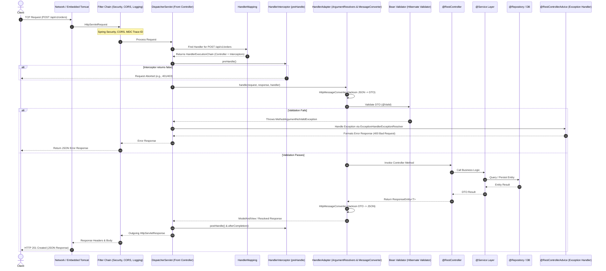
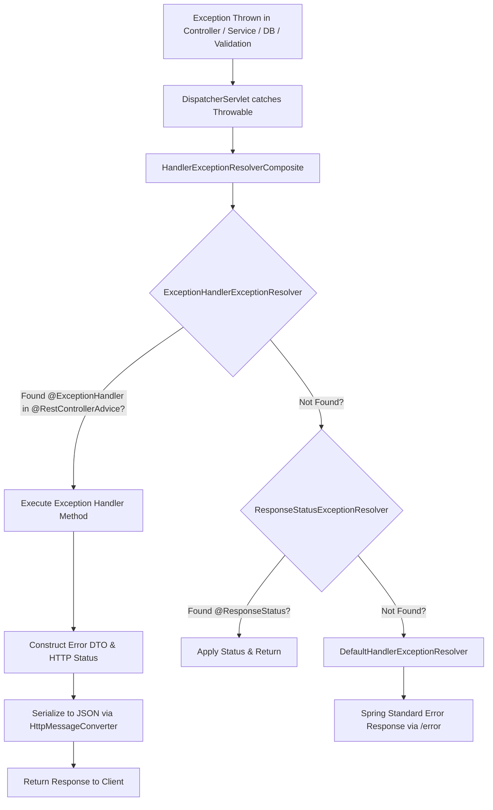

# REST APIs, Validations & Request Lifecycle in Spring Boot

---

## 1. Validations in Spring Boot

In any enterprise web application, never trust user input. Validation is the first line of defense to ensure data conforms to required business rules, formats, and integrity constraints before entering the application core.

### 1.1 Maven Dependency

Spring Boot provides validation through the **Jakarta Bean Validation (JSR-380)** specification, implemented by **Hibernate Validator**:

```xml
<dependency>
    <groupId>org.springframework.boot</groupId>
    <artifactId>spring-boot-starter-validation</artifactId>
</dependency>
```

> **Note:** Prior to Spring Boot 2.3, validation was bundled inside `spring-boot-starter-web`. Since Spring Boot 2.3+, it must be added explicitly.

---

### 1.2 Core Built-in Validation Annotations

| Annotation | Description | Applicable Types | Example |
|---|---|---|---|
| `@NotNull` | Value cannot be `null`. (Empty strings `""` or whitespace `"   "` are allowed). | Any Object | `@NotNull Long id;` |
| `@NotEmpty` | Value cannot be `null` and length/size must be `> 0`. (Whitespace `" "` is allowed). | `CharSequence`, `Collection`, `Map`, Array | `@NotEmpty List<String> tags;` |
| `@NotBlank` | Value cannot be `null` and trimmed length must be `> 0`. (No empty string, no whitespace). | `CharSequence` / `String` | `@NotBlank String name;` |
| `@Size(min, max)` | Size/length must be between `min` and `max` (inclusive). | `String`, `Collection`, `Map`, Array | `@Size(min = 3, max = 50) String title;` |
| `@Min(value)` | Number must be greater than or equal to `value`. | Numeric types, `BigDecimal`, `BigInteger` | `@Min(18) int age;` |
| `@Max(value)` | Number must be less than or equal to `value`. | Numeric types, `BigDecimal`, `BigInteger` | `@Max(100) int percentage;` |
| `@Positive` | Number must be strictly `> 0`. | Numeric types | `@Positive BigDecimal price;` |
| `@PositiveOrZero` | Number must be `>= 0`. | Numeric types | `@PositiveOrZero int stock;` |
| `@Negative` | Number must be strictly `< 0`. | Numeric types | `@Negative int temperature;` |
| `@Email` | Must be a well-formed email address. | `CharSequence` | `@Email String email;` |
| `@Pattern(regexp = ...)` | Must match the specified regular expression. | `CharSequence` | `@Pattern(regexp = "^[0-9]{10}$") String phone;` |
| `@Past` | Date/time must be strictly in the past. | Date, Time, `LocalDate`, `Instant`, etc. | `@Past LocalDate dateOfBirth;` |
| `@Future` | Date/time must be strictly in the future. | Date, Time, `LocalDate`, `Instant`, etc. | `@Future LocalDateTime eventDate;` |
| `@AssertTrue` | Boolean must be `true`. | `boolean`, `Boolean` | `@AssertTrue boolean termsAccepted;` |
| `@AssertFalse` | Boolean must be `false`. | `boolean`, `Boolean` | `@AssertFalse boolean isDeleted;` |

#### Interview Gold: `@NotNull` vs `@NotEmpty` vs `@NotBlank`

| Input Value | `@NotNull` | `@NotEmpty` | `@NotBlank` |
|---|:---:|:---:|:---:|
| `null` | ❌ Invalid | ❌ Invalid | ❌ Invalid |
| `""` (empty string) | ✅ Valid | ❌ Invalid | ❌ Invalid |
| `"   "` (whitespace only) | ✅ Valid | ✅ Valid | ❌ Invalid |
| `"John"` (valid string) | ✅ Valid | ✅ Valid | ✅ Valid |

> **Rule of Thumb:** Always use `@NotBlank` for String text fields (names, emails, titles) to prevent strings containing only spaces.

---

### 1.3 How to Trigger Validation in Controllers

#### 1. Validating Request Body (`@Valid` with `@RequestBody`)
Put `@Valid` before the `@RequestBody` argument. If any field fails validation, Spring automatically aborts method execution and throws `MethodArgumentNotValidException`:

```java
@RestController
@RequestMapping("/api/v1/users")
public class UserController {

    @PostMapping
    public ResponseEntity<UserResponse> createUser(@Valid @RequestBody CreateUserRequest request) {
        // Only reached if all validation checks pass!
        UserResponse response = userService.createUser(request);
        return ResponseEntity.status(HttpStatus.CREATED).body(response);
    }
}
```

#### 2. Validating Path Variables and Query Parameters (`@Validated`)
For validating parameters directly on controller methods (`@PathVariable`, `@RequestParam`), annotate the **controller class** with `@Validated`. If a parameter fails validation, Spring throws `ConstraintViolationException`:

```java
@RestController
@RequestMapping("/api/v1/products")
@Validated // Required at class-level for method parameter validation!
public class ProductController {

    @GetMapping("/{id}")
    public ResponseEntity<ProductDto> getProductById(
            @PathVariable @Min(value = 1, message = "Product ID must be greater than 0") Long id) {
        return ResponseEntity.ok(productService.findById(id));
    }

    @GetMapping
    public ResponseEntity<List<ProductDto>> searchProducts(
            @RequestParam @NotBlank @Size(min = 2, max = 50) String keyword,
            @RequestParam(defaultValue = "1") @Min(1) int page,
            @RequestParam(defaultValue = "20") @Max(100) int size) {
        return ResponseEntity.ok(productService.search(keyword, page, size));
    }
}
```

#### 3. Validating Nested Objects & Collections
To validate objects inside objects or lists, you **must** place `@Valid` on the nested field:

```java
public class OrderRequest {

    @NotNull(message = "Customer ID is required")
    private Long customerId;

    @Valid // REQUIRED: tells validator to inspect fields inside ShippingAddress!
    @NotNull(message = "Shipping address is required")
    private ShippingAddress address;

    @Valid // REQUIRED: tells validator to inspect each item in the list!
    @NotEmpty(message = "Order must contain at least one item")
    private List<OrderItemRequest> items;
}
```

---

### 1.4 `@Valid` vs `@Validated`

| Feature | `@Valid` | `@Validated` |
|---|---|---|
| **Origin** | Standard Java / Jakarta (`jakarta.validation.Valid`) | Spring Framework (`org.springframework.validation.annotation.Validated`) |
| **Scope** | Can be placed on fields, methods, constructors, parameters | Can be placed on classes, methods, parameters |
| **Validation Groups** | Does **NOT** support groups | **Supports validation groups** (`@Validated(OnCreate.class)`) |
| **Method Parameter Validation** | Does not trigger AOP validation on `@PathVariable` / `@RequestParam` | Triggers AOP validation on method arguments when on `@RestController` |

---

### 1.5 Validation Groups

Validation Groups allow applying different validation rules to the same DTO depending on the operation (e.g. creating vs updating).

**1. Define Marker Interfaces:**
```java
public interface OnCreate {}
public interface OnUpdate {}
```

**2. Annotate DTO Fields with Groups:**
```java
public class UserDto {

    @Null(groups = OnCreate.class, message = "ID must be null when creating")
    @NotNull(groups = OnUpdate.class, message = "ID is required when updating")
    private Long id;

    @NotBlank(groups = {OnCreate.class, OnUpdate.class}, message = "Name is required")
    private String name;

    @NotBlank(groups = OnCreate.class, message = "Password is required on registration")
    @Null(groups = OnUpdate.class, message = "Use separate endpoint to update password")
    private String password;
}
```

**3. Specify Group in Controller with `@Validated`:**
```java
@PostMapping
public ResponseEntity<UserDto> create(@Validated(OnCreate.class) @RequestBody UserDto dto) {
    return ResponseEntity.ok(userService.create(dto));
}

@PutMapping("/{id}")
public ResponseEntity<UserDto> update(@Validated(OnUpdate.class) @RequestBody UserDto dto) {
    return ResponseEntity.ok(userService.update(dto));
}
```

---

### 1.6 Custom Annotations and Custom Validators

When built-in annotations are not enough (e.g. validating phone numbers, checking enum values, password strength, cross-field password matching):

#### Step 1: Create the Custom Annotation
```java
@Target({ElementType.FIELD, ElementType.PARAMETER})
@Retention(RetentionPolicy.RUNTIME)
@Constraint(validatedBy = PhoneNumberValidator.class)
@Documented
public @interface ValidPhoneNumber {

    String message() default "Invalid phone number. Must start with '+' followed by 10 to 15 digits";

    Class<?>[] groups() default {};

    Class<? extends Payload>[] payload() default {};
}
```

#### Step 2: Implement `ConstraintValidator`
```java
public class PhoneNumberValidator implements ConstraintValidator<ValidPhoneNumber, String> {

    // Regex for E.164 international phone number format: e.g. +919876543210
    private static final Pattern PHONE_PATTERN = Pattern.compile("^\\+[1-9]\\d{9,14}$");

    @Override
    public boolean isValid(String value, ConstraintValidatorContext context) {
        if (value == null || value.isBlank()) {
            return true; // Let @NotBlank handle null/blank checks if required
        }
        return PHONE_PATTERN.matcher(value).matches();
    }
}
```

#### Step 3: Use it in DTO
```java
public class RegisterRequest {

    @NotBlank(message = "Phone number is required")
    @ValidPhoneNumber
    private String phoneNumber;
}
```

---

## 2. Why Aren't Frontend Validations Enough?

A common question in engineering interviews and design reviews:
> *"If the React/Angular/Vue frontend already checks email format, password length, and empty fields, why do we need backend validations?"*

### 1. Zero Trust & Total Client Bypass
The frontend executes on the user's client machine (browser, mobile device). Anyone can bypass client-side validation completely in seconds:
- **cURL / Postman / Insomnia:** Direct HTTP requests can be crafted without touching the frontend UI.
- **Browser DevTools:** Disabling JavaScript, modifying DOM elements, altering form inputs in the console, or tampering with network requests before dispatch.
- **Interception Proxies (Burp Suite, OWASP ZAP):** Malicious actors intercept legitimate requests, modify fields (e.g. change `price: 100` to `price: -1` or inject SQL scripts), and forward them to your server.

```
+-------------------------------------------------------------+
|                      ATTACKER VECTOR                        |
|                                                             |
|   Attacker  --->  cURL / Postman  --->  [ Bypasses UI ]     |
|                                              |              |
|                                              v              |
|                                     Spring Boot Server      |
|                                (If no backend validation:   |
|                                  DATABASE IS COMPROMISED!)  |
+-------------------------------------------------------------+
```

### 2. Diverse and Multiple Clients
Modern backend APIs rarely serve just one web frontend. A typical system serves:
- Web App (React / Angular / Vue)
- iOS App (Swift)
- Android App (Kotlin)
- Third-party Partner B2B Integrations
- Internal Admin Dashboards & Cron Workers

Relying on frontend validation requires duplicating business validation rules across 5 different codebases in 5 different languages. If one client has a bug, bad data enters the database.

### 3. Mobile "Version Drift"
When you update validation rules on the web, users get the latest JavaScript bundle immediately. But mobile users may not update their iOS/Android app for months or years. If validation is only on the frontend, users on legacy app versions can send invalid payloads indefinitely.

### 4. Database Integrity and Downstream Failure
The database is the system of record. If invalid data slips through:
- Corrupted database state causes foreign key conflicts, negative inventory, or calculation failures.
- Batch processing jobs, billing calculations, and analytics pipelines will crash unexpectedly.

### Summary: Complementary Responsibilities

| Dimension | Frontend Validation | Backend Validation |
|---|---|---|
| **Primary Goal** | **User Experience (UX)** | **Security & Data Integrity** |
| **Speed** | Instant visual feedback (no network round-trip) | Network round-trip required |
| **Trust Level** | **Untrusted** (can be bypassed) | **Authoritative & Enforced** |
| **Role** | Friendly guidance for legitimate users | Impenetrable barrier against invalid/malicious input |

---

## 3. How an API Request Travels Through Spring Boot (Complete Lifecycle)

When a client sends an HTTP request (e.g., `POST /api/v1/orders`), it travels through a well-defined sequence of architectural layers before reaching business code and returning.

### 3.1 Architectural Flow Diagram



---

### 3.2 Step-by-Step Breakdown of Every Layer

#### Layer 1: Network & Embedded Web Server (Tomcat / Jetty / Undertow)
1. The client establishes a TCP connection to port `8080`.
2. The web server's acceptor thread accepts the connection and hands it to a worker thread (`http-nio-8080-exec-*`).
3. The server parses raw HTTP bytes (method, URI, headers, body) into standard Servlet API objects: `HttpServletRequest` and `HttpServletResponse`.

#### Layer 2: Servlet Filter Chain (`javax.servlet.Filter` / `OncePerRequestFilter`)
Before reaching Spring MVC, the request passes through the **Servlet Filter Chain**:
- **Logging / Tracing Filter:** Generates a unique `X-Correlation-ID` or `traceId` and puts it into SLF4J's `MDC` (Mapped Diagnostic Context).
- **CORS Filter:** Checks `Origin` headers against allowed origins.
- **Spring Security Filter Chain (`SecurityFilterChain`):** Authenticates JWT tokens, parses session cookies, extracts user roles, and populates `SecurityContextHolder`. If unauthenticated/unauthorized, it halts here and returns `401 Unauthorized` or `403 Forbidden`.

#### Layer 3: DispatcherServlet (The Front Controller)
- The central brain of Spring MVC.
- Every HTTP request mapped to `/` is received by `DispatcherServlet.doDispatch(request, response)`.

#### Layer 4: HandlerMapping
- `DispatcherServlet` queries registered `HandlerMapping` implementations (primarily `RequestMappingHandlerMapping`).
- Evaluates HTTP method (`GET`, `POST`), URL path (`/api/v1/orders`), headers, and consumes/produces clauses to find the matching `@RestController` method.
- Returns a **`HandlerExecutionChain`**, which packages:
  - The target controller method (`HandlerMethod`).
  - All matching `HandlerInterceptor` instances.

#### Layer 5: HandlerInterceptor (`preHandle`)
- Executes pre-processing hooks (`preHandle()`) on registered interceptors (e.g. rate limiters, session verification, custom performance timers).
- If any interceptor returns `false`, execution immediately aborts and does not proceed to the controller.

#### Layer 6: HandlerAdapter & Argument Resolution
- `DispatcherServlet` calls `RequestMappingHandlerAdapter.handle()`.
- **Argument Resolvers (`HandlerMethodArgumentResolver`):** Resolves method arguments:
  - `@PathVariable` $\rightarrow$ `PathVariableMethodArgumentResolver`
  - `@RequestParam` $\rightarrow$ `RequestParamMethodArgumentResolver`
  - `@RequestBody` $\rightarrow$ `RequestResponseBodyMethodProcessor`
- **HttpMessageConverter (Jackson):** Reads the incoming JSON stream from `HttpServletRequest.getInputStream()` and deserializes it into the Java DTO.

#### Layer 7: Validation Engine (Hibernate Validator)
- If `@Valid` or `@Validated` is present on the argument, Spring invokes the `Validator`.
- It executes constraint checks against all annotations (`@NotBlank`, `@Min`, `@ValidPhoneNumber`, etc.).
- **If validation fails:** It does **NOT** call the controller method. Instead, it throws **`MethodArgumentNotValidException`**, which contains a `BindingResult` listing all violated fields and error messages.

#### Layer 8: Controller (`@RestController`)
- The controller method executes cleanly because the incoming DTO is guaranteed to be syntactically and structurally valid.
- The controller orchestrates request handling and delegates business processing to the Service layer.

#### Layer 9: Service Layer (`@Service`)
- Contains pure business logic, calculations, domain validation, and transaction boundaries (`@Transactional`).
- Coordinates multiple repositories or external integrations.

#### Layer 10: Repository Layer (`@Repository`)
- Uses Spring Data JPA / Hibernate to execute SQL queries or updates against the Database.

#### Layer 11: Return Path & Serialization
1. The Controller returns a `ResponseEntity<T>` or a raw DTO.
2. **`ResponseBodyAdvice` / `HttpMessageConverter`:** Jackson serializes the Java response object into JSON and sets `Content-Type: application/json`.
3. **`HandlerInterceptor.postHandle()`:** Runs after controller execution (skipped if an exception occurred).
4. **`HandlerInterceptor.afterCompletion()`:** Always runs, ideal for cleanup (e.g., stopping request timers).
5. The response bubbles back through the Servlet Filters (which can add security headers like `X-Content-Type-Options: nosniff`).
6. Tomcat writes the HTTP response bytes back to the socket.

---

### 3.3 What Happens When an Exception Occurs?



1. **Detection:** Any uncaught exception thrown in the Controller, Service, Repository, or Validation layer bubbles up to `DispatcherServlet.doDispatch()`.
2. **Delegation:** `DispatcherServlet` invokes `HandlerExceptionResolverComposite`.
3. **`ExceptionHandlerExceptionResolver`:**
   - Scans for beans annotated with `@ControllerAdvice` or `@RestControllerAdvice`.
   - Matches the thrown exception type against methods annotated with `@ExceptionHandler(SpecificException.class)`.
4. **Execution:** The matching handler method executes, formats a custom error response object (e.g. `ApiErrorResponse`), and specifies the HTTP status (e.g., `400 Bad Request`, `404 Not Found`, `409 Conflict`).
5. **No Stack Traces Leaked:** The internal stack trace is logged to server logs (with MDC trace ID) for engineers, but a safe, standardized error payload is sent to the client.

---

## 4. What Makes an API "Production-Ready"?

Writing an API that works on `localhost:8080` is easy; writing an API that survives 10,000 requests per second in production with zero downtime requires meeting enterprise production standards.

### The 10 Pillars of Production-Ready APIs

| Pillar | Requirement | How It's Implemented in Spring Boot |
|---|---|---|
| **1. Strict Validation** | Reject invalid requests at the boundary; provide clear, field-level error messages. | `spring-boot-starter-validation`, `@Valid`, `@NotBlank`, custom validators. |
| **2. Standardized Error Contract** | Uniform error structure across all endpoints. Never leak Java stack traces to clients! | `@RestControllerAdvice`, RFC 7807 `ProblemDetail` or custom `ApiErrorResponse`. |
| **3. Security & Auth** | Authentication, Role-Based Access Control (RBAC), CORS, CSRF, security headers. | Spring Security (`SecurityFilterChain`, `@PreAuthorize("hasRole('ADMIN')")`). |
| **4. Observability & Tracing** | Every log line must correlate to a single request; monitor JVM and traffic metrics. | SLF4J `MDC` with `X-Correlation-ID`, Spring Boot Actuator, Micrometer. |
| **5. Pagination & Limits** | **Never** return unbounded lists (`List<User>`); enforce maximum page size. | `Pageable`, `Page<T>`, `Slice<T>`, `@PageableDefault(size = 20)`. |
| **6. Proper HTTP Semantics** | Accurate HTTP verbs and status codes (`200`, `201`, `204`, `400`, `401`, `403`, `404`, `409`, `422`, `500`). | `ResponseEntity.status(HttpStatus.CREATED).body(...)`. |
| **7. API Versioning** | Allow APIs to evolve without breaking existing mobile or web clients. | URI path versioning: `/api/v1/users`, `/api/v2/users`. |
| **8. Documentation** | Interactive, auto-generated API specifications for consumers. | `springdoc-openapi-starter-webmvc-ui` (OpenAPI 3 / Swagger UI). |
| **9. Resiliency & Timeouts** | Prevent cascading failures when downstream databases or microservices slow down. | HikariCP pool limits, HTTP client connection timeouts, Resilience4j Circuit Breakers. |
| **10. Graceful Shutdown** | Allow in-flight requests to complete before pods terminate during deployments. | `server.shutdown=graceful`, `spring.lifecycle.timeout-per-shutdown-phase=30s`. |

---

## 5. Complete, Production-Ready Spring Boot Implementation

Below is a complete, real-world reference implementation illustrating all concepts: **validation, custom constraints, global exception handling, correlation ID tracking, and standardized response structures.**

### 5.1 Standardized API Responses

#### Success Wrapper: `ApiResponse.java`
```java
package com.example.common.response;

import com.fasterxml.jackson.annotation.JsonInclude;
import lombok.Builder;
import lombok.Getter;

import java.time.Instant;

@Getter
@Builder
@JsonInclude(JsonInclude.Include.NON_NULL)
public class ApiResponse<T> {

    @Builder.Default
    private boolean success = true;

    private String message;

    private T data;

    @Builder.Default
    private Instant timestamp = Instant.now();

    public static <T> ApiResponse<T> ok(T data, String message) {
        return ApiResponse.<T>builder()
                .success(true)
                .message(message)
                .data(data)
                .build();
    }

    public static <T> ApiResponse<T> created(T data, String message) {
        return ApiResponse.<T>builder()
                .success(true)
                .message(message)
                .data(data)
                .build();
    }
}
```

#### Error Contract: `ApiErrorResponse.java`
```java
package com.example.common.response;

import com.fasterxml.jackson.annotation.JsonInclude;
import lombok.Builder;
import lombok.Getter;

import java.time.Instant;
import java.util.Map;

@Getter
@Builder
@JsonInclude(JsonInclude.Include.NON_NULL)
public class ApiErrorResponse {

    private boolean success;
    private int status;
    private String error;
    private String message;
    private String path;
    private String traceId;
    private Instant timestamp;
    private Map<String, String> validationErrors; // Field -> Error Message
}
```

---

### 5.2 Custom Validation Annotation & Validator

#### Custom Annotation: `@PasswordMatches.java`
```java
package com.example.validation;

import jakarta.validation.Constraint;
import jakarta.validation.Payload;
import java.lang.annotation.*;

@Target({ElementType.TYPE})
@Retention(RetentionPolicy.RUNTIME)
@Constraint(validatedBy = PasswordMatchesValidator.class)
@Documented
public @interface PasswordMatches {

    String message() default "Passwords do not match";

    Class<?>[] groups() default {};

    Class<? extends Payload>[] payload() default {};
}
```

#### Custom Validator: `PasswordMatchesValidator.java`
```java
package com.example.validation;

import com.example.dto.CreateUserRequest;
import jakarta.validation.ConstraintValidator;
import jakarta.validation.ConstraintValidatorContext;

public class PasswordMatchesValidator implements ConstraintValidator<PasswordMatches, CreateUserRequest> {

    @Override
    public boolean isValid(CreateUserRequest request, ConstraintValidatorContext context) {
        if (request.getPassword() == null || request.getConfirmPassword() == null) {
            return false;
        }

        boolean matches = request.getPassword().equals(request.getConfirmPassword());
        if (!matches) {
            context.disableDefaultConstraintViolation();
            context.buildConstraintViolationWithTemplate("Confirm password must match password")
                   .addPropertyNode("confirmPassword")
                   .addConstraintViolation();
        }
        return matches;
    }
}
```

---

### 5.3 Validated Request DTO: `CreateUserRequest.java`

```java
package com.example.dto;

import com.example.validation.PasswordMatches;
import jakarta.validation.constraints.*;
import lombok.Data;

@Data
@PasswordMatches // Custom class-level validation
public class CreateUserRequest {

    @NotBlank(message = "Username is required")
    @Size(min = 3, max = 30, message = "Username must be between 3 and 30 characters")
    @Pattern(regexp = "^[a-zA-Z0-9._-]+$", message = "Username can only contain alphanumeric characters, dots, and underscores")
    private String username;

    @NotBlank(message = "Email is required")
    @Email(message = "Email must be a valid email address")
    private String email;

    @NotBlank(message = "Password is required")
    @Size(min = 8, max = 100, message = "Password must be at least 8 characters long")
    @Pattern(
        regexp = "^(?=.*[0-9])(?=.*[a-z])(?=.*[A-Z])(?=.*[@#$%^&+=!]).*$",
        message = "Password must contain at least one digit, one uppercase letter, one lowercase letter, and one special character"
    )
    private String password;

    @NotBlank(message = "Confirm password is required")
    private String confirmPassword;

    @NotNull(message = "Age is required")
    @Min(value = 18, message = "User must be at least 18 years old")
    @Max(value = 120, message = "Age cannot exceed 120")
    private Integer age;
}
```

---

### 5.4 Correlation ID / Tracing Filter: `CorrelationIdFilter.java`

Ensures every incoming request gets an `X-Correlation-ID` attached to logs via SLF4J MDC:

```java
package com.example.filter;

import jakarta.servlet.*;
import jakarta.servlet.http.HttpServletRequest;
import jakarta.servlet.http.HttpServletResponse;
import org.slf4j.MDC;
import org.springframework.core.Ordered;
import org.springframework.core.annotation.Order;
import org.springframework.stereotype.Component;

import java.io.IOException;
import java.util.UUID;

@Component
@Order(Ordered.HIGHEST_PRECEDENCE)
public class CorrelationIdFilter implements Filter {

    public static final String CORRELATION_ID_HEADER = "X-Correlation-ID";
    public static final String MDC_KEY = "traceId";

    @Override
    public void doFilter(ServletRequest request, ServletResponse response, FilterChain chain)
            throws IOException, ServletException {
        HttpServletRequest httpRequest = (HttpServletRequest) request;
        HttpServletResponse httpResponse = (HttpServletResponse) response;

        String correlationId = httpRequest.getHeader(CORRELATION_ID_HEADER);
        if (correlationId == null || correlationId.isBlank()) {
            correlationId = UUID.randomUUID().toString();
        }

        MDC.put(MDC_KEY, correlationId);
        httpResponse.setHeader(CORRELATION_ID_HEADER, correlationId);

        try {
            chain.doFilter(request, response);
        } finally {
            MDC.remove(MDC_KEY);
        }
    }
}
```

---

### 5.5 Global Exception Handler: `GlobalExceptionHandler.java`

Handles validation errors, business exceptions, and unexpected crashes gracefully:

```java
package com.example.exception;

import com.example.common.response.ApiErrorResponse;
import jakarta.servlet.http.HttpServletRequest;
import lombok.extern.slf4j.Slf4j;
import org.slf4j.MDC;
import org.springframework.http.HttpStatus;
import org.springframework.http.ResponseEntity;
import org.springframework.validation.FieldError;
import org.springframework.web.bind.MethodArgumentNotValidException;
import org.springframework.web.bind.annotation.ExceptionHandler;
import org.springframework.web.bind.annotation.RestControllerAdvice;

import java.time.Instant;
import java.util.HashMap;
import java.util.Map;

@Slf4j
@RestControllerAdvice
public class GlobalExceptionHandler {

    // 1. Handles @Valid / @Validated DTO validation failures (HTTP 400)
    @ExceptionHandler(MethodArgumentNotValidException.class)
    public ResponseEntity<ApiErrorResponse> handleValidationException(
            MethodArgumentNotValidException ex, HttpServletRequest request) {

        Map<String, String> errors = new HashMap<>();
        for (FieldError fieldError : ex.getBindingResult().getFieldErrors()) {
            errors.put(fieldError.getField(), fieldError.getDefaultMessage());
        }

        log.warn("Validation failed for path [{}]: {}", request.getRequestURI(), errors);

        ApiErrorResponse response = ApiErrorResponse.builder()
                .success(false)
                .status(HttpStatus.BAD_REQUEST.value())
                .error(HttpStatus.BAD_REQUEST.getReasonPhrase())
                .message("Input validation failed")
                .path(request.getRequestURI())
                .traceId(MDC.get("traceId"))
                .timestamp(Instant.now())
                .validationErrors(errors)
                .build();

        return ResponseEntity.status(HttpStatus.BAD_REQUEST).body(response);
    }

    // 2. Handles custom business exceptions, e.g. ResourceNotFoundException (HTTP 404)
    @ExceptionHandler(ResourceNotFoundException.class)
    public ResponseEntity<ApiErrorResponse> handleNotFound(
            ResourceNotFoundException ex, HttpServletRequest request) {

        log.warn("Resource not found: {}", ex.getMessage());

        ApiErrorResponse response = ApiErrorResponse.builder()
                .success(false)
                .status(HttpStatus.NOT_FOUND.value())
                .error(HttpStatus.NOT_FOUND.getReasonPhrase())
                .message(ex.getMessage())
                .path(request.getRequestURI())
                .traceId(MDC.get("traceId"))
                .timestamp(Instant.now())
                .build();

        return ResponseEntity.status(HttpStatus.NOT_FOUND).body(response);
    }

    // 3. Fallback for unhandled 500 errors (never leak stack trace to client!)
    @ExceptionHandler(Exception.class)
    public ResponseEntity<ApiErrorResponse> handleGlobalException(
            Exception ex, HttpServletRequest request) {

        log.error("Unhandled internal server error on [{}]: ", request.getRequestURI(), ex);

        ApiErrorResponse response = ApiErrorResponse.builder()
                .success(false)
                .status(HttpStatus.INTERNAL_SERVER_ERROR.value())
                .error(HttpStatus.INTERNAL_SERVER_ERROR.getReasonPhrase())
                .message("An unexpected error occurred. Please contact support quoting traceId: " + MDC.get("traceId"))
                .path(request.getRequestURI())
                .traceId(MDC.get("traceId"))
                .timestamp(Instant.now())
                .build();

        return ResponseEntity.status(HttpStatus.INTERNAL_SERVER_ERROR).body(response);
    }
}
```

---

### 5.6 Production-Ready Controller: `UserController.java`

```java
package com.example.controller;

import com.example.common.response.ApiResponse;
import com.example.dto.CreateUserRequest;
import com.example.dto.UserResponse;
import com.example.service.UserService;
import io.swagger.v3.oas.annotations.Operation;
import io.swagger.v3.oas.annotations.tags.Tag;
import jakarta.validation.Valid;
import jakarta.validation.constraints.Min;
import lombok.RequiredArgsConstructor;
import org.springframework.data.domain.Page;
import org.springframework.data.domain.Pageable;
import org.springframework.data.web.PageableDefault;
import org.springframework.http.HttpStatus;
import org.springframework.http.ResponseEntity;
import org.springframework.validation.annotation.Validated;
import org.springframework.web.bind.annotation.*;

@RestController
@RequestMapping("/api/v1/users")
@RequiredArgsConstructor
@Validated
@Tag(name = "User Management", description = "Endpoints for managing users")
public class UserController {

    private final UserService userService;

    @PostMapping
    @Operation(summary = "Register a new user")
    public ResponseEntity<ApiResponse<UserResponse>> createUser(
            @Valid @RequestBody CreateUserRequest request) {

        UserResponse createdUser = userService.createUser(request);
        return ResponseEntity
                .status(HttpStatus.CREATED)
                .body(ApiResponse.created(createdUser, "User registered successfully"));
    }

    @GetMapping("/{id}")
    @Operation(summary = "Get user by ID")
    public ResponseEntity<ApiResponse<UserResponse>> getUserById(
            @PathVariable @Min(value = 1, message = "ID must be a positive number") Long id) {

        UserResponse user = userService.getUserById(id);
        return ResponseEntity.ok(ApiResponse.ok(user, "User fetched successfully"));
    }

    @GetMapping
    @Operation(summary = "Get paginated users list")
    public ResponseEntity<ApiResponse<Page<UserResponse>>> getAllUsers(
            @PageableDefault(size = 20, sort = "createdAt") Pageable pageable) {

        Page<UserResponse> users = userService.getAllUsers(pageable);
        return ResponseEntity.ok(ApiResponse.ok(users, "Users retrieved successfully"));
    }
}
```

---

### 5.7 Sample Client Request and Validation Response

#### Bad Request Payload:
```json
POST /api/v1/users
Content-Type: application/json

{
  "username": "a",
  "email": "not-an-email",
  "password": "secret",
  "confirmPassword": "mismatch",
  "age": 15
}
```

#### Production-Grade Standardized Error Response (`400 Bad Request`):
```json
{
  "success": false,
  "status": 400,
  "error": "Bad Request",
  "message": "Input validation failed",
  "path": "/api/v1/users",
  "traceId": "9b1deb4d-3b7d-4bad-9bdd-2b0d7b3dcb6d",
  "timestamp": "2026-10-09T03:55:00.123Z",
  "validationErrors": {
    "username": "Username must be between 3 and 30 characters",
    "email": "Email must be a valid email address",
    "password": "Password must contain at least one digit, one uppercase letter, one lowercase letter, and one special character",
    "confirmPassword": "Confirm password must match password",
    "age": "User must be at least 18 years old"
  }
}
```
